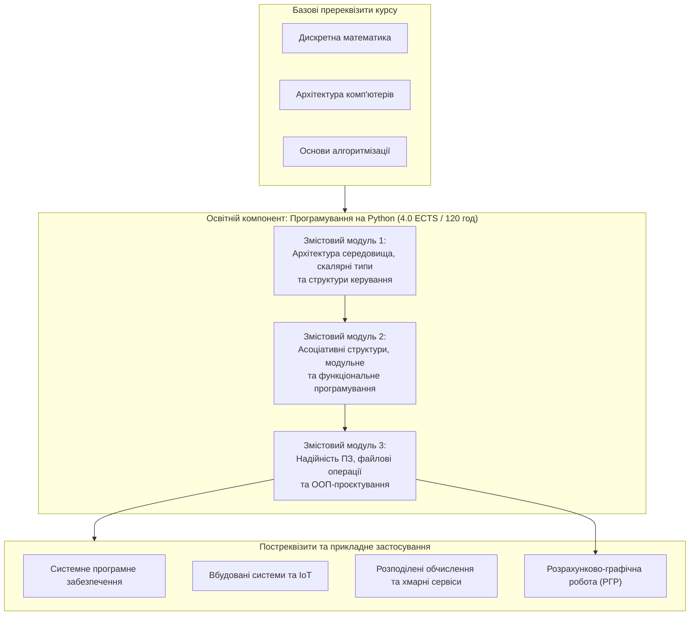

# РОБОЧА ПРОГРАМА ОСВІТНЬОГО КОМПОНЕНТА «Програмування на Python»

---

### 1. Опис освітнього компонента

Освітній компонент «Програмування на Python» є нормативною дисципліною професійного циклу підготовки здобувачів вищої освіти першого (бакалаврського) рівня за спеціальністю F7 «Комп’ютерна інженерія». Дисципліна формує базовий комплекс теоретичних знань та прикладних навичок у галузі проектування алгоритмічних структур, низькорівневої та високорівневої обробки даних, розробки системних утиліт і автоматизації процесів комп'ютерної інженерії. Освітній компонент інтегрує знання з дискретної математики, архітектури комп'ютерних систем та операційних систем, забезпечуючи підготовку майбутніх інженерів до створення відмовостійкого, модульного та масштабованого програмного забезпечення на основі сучасного технологічного стеку екосистеми Python.

| Найменування показників | Галузь знань, спеціальність, освітній рівень | Характеристика навчальної дисципліни |
| :--- | :--- | :--- |
| **Кількість кредитів ECTS:** 4.0 **Загальний обсяг годин:** 120 | **Галузь знань:** Інформаційні технології / Комп'ютерна інженерія **Спеціальність:** F7 «Комп’ютерна інженерія» | **Вид дисципліни:** Обов'язкова (нормативна) |
| **Модулів:** 1 **Змістових модулів:** 3 **Індивідуальне завдання:** Розрахунково-графічна робота (РГР) | **Освітня програма:** «Комп’ютерна інженерія» **Освітній рівень:** Перший (бакалаврський) | **Рік підготовки:** 3-й **Семестр:** 5-й |
| **Тижневих годин:** аудиторних — 2.5 год; СР — 5.0 год | **Форма навчання:** Денна | **Лекції:** 18 год. **Практичні:** 0 год. **Лабораторні:** 22 год. **Самостійна робота:** 80 год. **Індивідуальне завдання:** у межах СР **Вид контролю:** Диференційований залік |

Співвідношення кількості годин аудиторних занять до самостійної роботи становить $40 / 80 = 1 / 2$ (33.3% аудиторного навантаження та 66.7% позааудиторної самостійної роботи).

---

### 2. Мета та завдання освітнього компонента

**Метою викладання освітнього компонента** є формування у здобувачів вищої освіти системного інженерного мислення, глибоких фундаментальних знань та стійких практичних умінь щодо алгоритмізації, проектування, написання, налагодження, тестування та супроводу програмного забезпечення мовою Python із використанням процедурної, функціональної та об'єктно-орієнтованої парадигм для вирішення прикладних задач комп'ютерної інженерії.

**Основними завданнями освітнього компонента є:**
* засвоєння архітектурних засад виконання програм у середовищі CPython, внутрішньої моделі керування пам'яттю, механізмів компіляції вихідного коду в байт-код та функціонування віртуальної машини PVM;
* опанування інструментів професійного середовища розробника, включаючи дистрибутив Miniconda, ізольовані віртуальні оточення, середовище Visual Studio Code, систему контролю версій Git та репозиторій GitHub;
* вивчення теоретичних засад і внутрішньої організації скалярних, впорядкованих та асоціативних структур даних мови Python, а також аналіз їхньої асимптотичної просторової та часової складності;
* опанування методів процедурної та функціональної декомпозиції коду з використанням варіативних сигнатур функцій, областей видимості LEGB, анонімних lambda-виразів та рекурсивних алгоритмів;
* набуття практичних навичок проектування модульних програмних комплексів, організації пакетів, розбору аргументів командного рядка та взаємодії із системним оточенням;
* засвоєння принципів об'єктно-орієнтованого програмування, інкапсуляції, механізмів лінеаризації множинного наслідування MRO та перевантаження спеціальних dunder-методів;
* набуття практичних навичок забезпечення відмовостійкості програмного забезпечення за допомогою багаторівневої обробки винятків та організації персистентного збереження даних у файлових структурах за допомогою менеджерів контексту.

---

### 3. Результати навчання та компетентності

У результаті вивчення освітнього компонента здобувач вищої освіти повинен:

**Знати:**
* внутрішню організацію середовища CPython, структуру об'єкта `PyObject`, механізми підрахунку посилань, збирання сміття та функціонування Global Interpreter Lock (GIL);
* правила оформлення вихідного коду відповідно до міжнародного стандарту PEP 8 та правила структуризації блоків за допомогою відступів;
* математичні моделі та алгоритмічну складність операцій над списками (`list`), кортежами (`tuple`), рядками (`str`), словниками (`dict`) та множинами (`set`);
* математичний апарат розбору структурованих текстів за допомогою скінченних автоматів модуля регулярних виразів `re`;
* правила дозволу ідентифікаторів у просторах імен за моделлю LEGB та механізми функціонування лексичних замикань;
* алгоритми лінеаризації порядку вирішення методів (MRO C3) при множинному наслідуванні класів та призначення спеціальних dunder-методів;
* архітектуру безпечного файлового введення-виведення на основі патерну RAII та протоколу менеджерів контексту.

**Уміти:**
* розгортати та конфігурувати інженерне середовище розробки на основі Miniconda, Visual Studio Code та керувати версіями проекту за допомогою Git і GitHub;
* реалізовувати ефективні алгоритми обробки скалярних та багатовимірних векторних даних із використанням побітової арифметики та зрізів;
* застосовувати генератори списків (*List Comprehensions*) та словників (*Dict Comprehensions*) для високошвидкісної трансформації та фільтрації даних;
* проектувати та викликати функції з розширеною сигнатурою (`*args`, `**kwargs`, positional-only `/`, keyword-only `*`) без створення небажаних побічних ефектів;
* розробляти власні багатофайлові модулі та пакети з чітко регламентованим публічним інтерфейсом за допомогою списку `__all__` та захищеною точкою входу `__main__`;
* створювати ієрархії користувацьких класів винятків та організовувати надійне перехоплення помилок часу виконання за допомогою конструкції `try-except-else-finally`;
* проектувати об'єктно-орієнтовані моделі комп'ютерних систем із повноцінною інкапсуляцією через `@property` та перевантаженням операторів порівняння й арифметики.

**Формовані компетентності та програмні результати навчання (ПРН):**
* **Загальні компетентності (ЗК):**
  * *ЗК 1.* Здатність до абстрактного мислення, аналізу та синтезу алгоритмічних структур.
  * *ЗК 2.* Здатність застосовувати теоретичні знання у практичних інженерних ситуаціях.
  * *ЗК 6.* Здатність використовувати інформаційні та комунікаційні технології для командної розробки ПЗ.
* **Спеціальні (фахові) компетентності (СК):**
  * *СК 1.* Здатність проектувати, розробляти та налагоджувати програмне забезпечення комп'ютерних систем із використанням сучасних мов високого рівня.
  * *СК 3.* Здатність розробляти математичні та імітаційні моделі функціонування вузлів комп'ютерних систем і мереж.
  * *СК 7.* Здатність ефективно управляти системними ресурсами, пам'яттю та файловими дескрипторами на рівні операційної системи.
* **Програмні результати навчання (ПРН):**
  * *ПРН 3.* Володіти навичками розробки алгоритмів, вибору структур даних та їх програмної реалізації мовою Python.
  * *ПРН 8.* Вміти створювати надійне об'єктно-орієнтоване програмне забезпечення з обробкою аварійних станів.
  * *ПРН 14.* Застосовувати розподілені системи контролю версій для організації командної та індивідуальної інженерної розробки.

---

### 4. Програма навчальної дисципліни

**Модуль 1. Основи алгоритмізації, модульної архітектури та об'єктно-орієнтованого програмування на Python**

**Змістовий модуль 1. Архітектура середовища, скалярні типи та структури керування**

* **Тема 1. Архітектура Python, інфраструктура розробника та модель скалярних даних.** 
  Принципи дворівневого виконання коду в середовищі CPython. Лексичний аналіз, побудова абстрактного синтаксичного дерева AST, компіляція у проміжний байт-код та кешування у файлах `.pyc`. Функціонування віртуальної машини PVM як стекового емулятора. Проблема синхронізації пам'яті та механізм Global Interpreter Lock (GIL). Інфраструктура інженерної розробки на базі дистрибутива Miniconda, ізоляція оточень conda/venv, конфігурація VS Code та сервісу GitHub. Модель динамічної строгої типізації, змінні як посилання на об'єкти, внутрішня структура `PyObject`. Незмінність скалярних типів даних (`int`, `float`, `complex`, `bool`, `NoneType`). Математичні особливості довгої арифметики цілих чисел. Модель дійсних чисел за стандартом IEEE 754, проблема похибок округлення та використання функції `math.isclose()`. Побітова арифметика (`<<`, `>>`, `&`, `|`, `^`, `~`) та алгоритми маскування апаратних регістрів.

* **Тема 2. Керування потоком виконання: розгалужені та циклічні алгоритмічні конструкції.**
  Синтаксичні стандарти оформлення коду PEP 8 та концепція синтаксичного виділення блоків відступами. Повні, неповні та каскадні форми оператора розгалуження `if-elif-else`. Оцінювання істинності об'єктів у логічному контексті (*truthiness*). Алгебра логіки та короткозамкнене обчислення (*short-circuit evaluation*) складених виразів із операторами `and`, `or`, `not`. Синтаксис та семантика лінивого обчислення тернарного умовного виразу. Цикл із передумовою `while`, інваріант циклу та дотримання умов збіжності чисельних методів. Цикл перебору `for` як реалізація протоколу ітератора (`iter()`, `next()`, `StopIteration`). Незмінний числовий діапазон `range()` та доведення константності споживання пам'яті $O(1)$. Керування мікродинамікою ітерацій через директиви `break`, `continue`, `pass`. Архітектурний патерн пошуку без прапорців на основі блоку `else` у циклах.

* **Тема 3. Впорядковані структури даних: Списки (list) та Кортежі (tuple).**
  Внутрішня організація динамічного масиву покажчиків `PyListObject`. Пряма адресна адресація елементів за індексом за час $O(1)$. Позиційна та від'ємна індексація. Математична модель вилучення підмасивів за допомогою зрізів `[start:stop:step]`. Багатовимірні списки як основа матричної алгебри в комп'ютерній інженерії та запобігання помилкам поверхневого множення вкладених посилань. Динамічне зростання списків та формула геометричного надлишкового виділення пам'яті (*over-allocation*). Методи модифікації списку: `append()`, `extend()`, `insert()`, `pop()`, `remove()`, `clear()`. Алгоритм гібридного стабільного сортування Timsort та порівняння методів `list.sort()` і `sorted()`. Семантика копіювання: присвоєння посилань, поверхнева копія `copy()` та глибока рекурсивна копія `deepcopy()`. Незмінні кортежі `tuple`, кешування у вільних списках (*free lists*) CPython та розширене позиційне розпакування послідовностей (*tuple unpacking*). Генератори списків (*List Comprehensions*) та їх оптимізація на рівні опкоду `LIST_APPEND`.

* **Тема 4. Текстові та двійкові структури даних. Регулярні вирази.**
  Рядки `str` як незмінні послідовності символів Unicode. Адаптивна структура зберігання рядків у пам'яті за специфікацією PEP 393 (формати `Latin-1`, `UCS-2`, `UCS-4`). Керувальні escape-послідовності та властивості сирих рядків `r""`. Методи токенізації, пошуку, валідації та сегментації рядків (`find()`, `count()`, `split()`, `join()`, `strip()`, `replace()`, `isdigit()`). Еволюція форматування: f-рядки (f-strings, PEP 498) та міні-мова специфікаторів вирівнювання, знака, ширини полів і точності дійсних чисел. Низькорівневі двійкові типи даних: незмінні октетні масиви `bytes` та мутабельні буфери `bytearray`. Архітектура нульового копіювання (*Zero-Copy*) на основі буферного протоколу `memoryview`. Модуль `re`, математичний апарат регулярних виразів на основі недетермінованих скінченних автоматів (NFA), метасимволи, квантифікатори та іменовані групи захоплення `(?P<name>...)`.

**Змістовий модуль 2. Асоціативні структури, модульне та функціональне програмування**

* **Тема 5. Хеш-таблиці та асоціативні структури: Словники (dict) та Множини (set).**
  Теоретичні засади функціонування асоціативних масивів. Математичний контракт хешованості об'єктів: взаємозв'язок методів `__hash__()` та `__eq__()`. Причини заборони використання змінюваних об'єктів як ключів хеш-таблиць. Архітектура компактних словників (*Compact Dict*, PEP 468) у CPython, розподіл обов'язків між таблицею індексів `indices` та щільним масивом записів `entries`. Гарантія збереження порядку вставки записів. Рекурентне псевдовипадкове зондування для розв'язання колізій відкритої адресації. Методи безпечного доступу та модифікації словників: `get()`, `setdefault()`, `pop()`, `popitem()`, `update()`. Властивості динамічних уявлень словника `keys()`, `values()`, `items()`. Генератори словників (*Dict Comprehensions*) та операція інверсії асоціативних карт. Множини `set` та `frozenset`. Теоретико-множинні операції: об'єднання (`|`), перетин (`&`), різниця (`-`), симетрична різниця (`^`) та розрахунок індексу подібності Жаккара $J(A, B)$. Алгоритмічна константна складність пошуку `in` за $O(1)$.

* **Тема 6. Функціональна організація програмного коду.**
  Процедурна декомпозиція програмних систем. Інструкція `def` як динамічний виконуваний оператор створення об'єкта `PyFunctionObject`. Семантика передачі параметрів за механізмом *pass-by-object-reference*. Оператор `return`, повернення множинних значень через неявне пакування в кортеж. Математичні критерії чистих функцій (*pure functions*) та ізоляція побічних ефектів. Позиційні та іменовані аргументи. Значення параметрів за замовчуванням та аналіз системних причин виникнення пастки змінного значення за замовчуванням (*mutable default argument trap*). Варіативне пакування та розпакування аргументів через `*args` та `**kwargs`. Синтаксичні роздільники сигнатури функції: виключно позиційні параметри `/` (PEP 570) та виключно іменовані параметри `*` (PEP 3102). Ієрархічне правило пошуку ідентифікаторів LEGB (Local, Enclosing, Global, Built-in), оператори `global` та `nonlocal`. Лексичні замикання (*closures*) та об'єкти комірок `cell`. Анонімні lambda-вирази та функції вищого порядку (`map`, `filter`). Рекурсивні алгоритми: базовий випадок, рекурсивний крок, глибина стекових кадрів `PyFrameObject` та обмеження `sys.getrecursionlimit()`.

* **Тема 7. Модульна архітектура, пакети та взаємодія з оточенням.**
  Принципи проектування модульних систем: слабка зв'язність та висока внутрішня цілісність. Життєвий цикл завантаження модуля інтерпретатором CPython, роль глобального реєстру кешу `sys.modules` та системного списку пошуку `sys.path`. Синтаксичні форми імпорту (`import`, `from ... import`, аліаси `as`). Системна змінна `__name__` та ідіома захисту точки входу `if __name__ == '__main__':`. Причини виникнення та методи усунення циклічних імпортів (*circular imports*). Архітектура регулярних пакетів із файлами `__init__.py` та просторових пакетів (*PEP 420*). Регламентація публічного інтерфейсу бібліотеки через спеціальний список `__all__`. Розбір аргументів командного рядка через список `sys.argv` та керування кодами завершення процесу `sys.exit()`. Огляд стандартної бібліотеки: системні виклики модуля `os`, об'єктно-орієнтована навігація файловою системою `pathlib.Path`, прецизійний монотонний таймер `time.perf_counter()` та генератор псевдовипадкових процесів Mersenne Twister (модуль `random`).

**Змістовий модуль 3. Надійність ПЗ, файлові операції та об'єктно-орієнтоване проєктування**

* **Тема 8. Обробка виняткових ситуацій та файлове введення-виведення.**
  Класифікація програмних помилок: синтаксичні дефекти `SyntaxError` проти винятків часу виконання `Exception`. Архітектура розкручування стека викликів (*stack unwinding*) та структура об'єкта трасування `traceback`. Повний чотириблочний каркас `try-except-else-finally`, призначення секції успішного виконання `else` та гарантованого очищення ресурсів `finally`. Деревоподібна ієрархія стандартних винятків, відмінності між кореневим класом `BaseException` та прикладним класом `Exception`. Правило порядку перехоплення винятків від нащадків до базових класів. Примусова генерація помилок за допомогою оператора `raise` та побудова ланцюжків винятків (*exception chaining*) через конструкцію `raise ... from ...`. Проектування ієрархії користувацьких класів винятків (*Custom Exceptions*) із контекстними числовими атрибутами. Порівняння парадигм проектування EAFP та LBYL. Файлові потоки введення-виведення, функція `open()`, текстові та бінарні режими доступу (`r`, `w`, `a`, `x`, `b`, `+`). Буферизація та кодування. Низькорівневе позиціонування файлового курсору методами `seek()` і `tell()`. Архітектурний патерн RAII та протокол менеджерів контексту (`__enter__`, `__exit__`). Структурний парсинг і генерація файлів CSV (`csv.DictReader`, `csv.DictWriter`) та серіалізація об'єктів у формат JSON (`json.dump`, `json.load`).

* **Тема 9. Об'єктно-орієнтоване програмування в Python.**
  Фундаментальні парадигми ООП: абстракція, інкапсуляція, наслідування та поліморфізм. Класи як типи даних, визначені користувачем, та об'єкти як екземпляри класу. Двофазна ініціалізація екземпляра в пам'яті: виділення сирої пам'яті методом `__new__(cls)` та наповнення атрибутами через ініціалізатор `__init__(self)`. Фізичний зміст параметра `self` як явного покажчика на екземпляр. Порівняння статичних атрибутів класу в `Class.__dict__` та динамічних полів екземпляра в `self.__dict__`. Рівні доступу до даних: публічні атрибути, конвенційні захищені поля `_protected` та приватні поля `__private` із механізмом спотворення імен (*name mangling*). Проектування керованих полів за допомогою дескрипторів властивостей: декоратор `@property`, сетери `@prop.setter` та делетери `@prop.deleter`. Наслідування класів, перевизначення методів (*method overriding*) та кооперативне делегування конструктора через функцію `super()`. Проблема ромбоподібного множинного наслідування та алгоритм лінеаризації C3 для побудови послідовності MRO. Динамічний поліморфізм та концепція качиної типізації (*Duck Typing*). Перевантаження спеціальних магічних dunder-методів: рядкове відображення (`__str__`, `__repr__`), порівняння (`__eq__`, `__ne__`, `__lt__`, `__le__`, `__gt__`, `__ge__`), арифметика (`__add__`, `__radd__`, `__sub__`, `__mul__`), протокол колекцій (`__len__`, `__getitem__`). Декоратори методів класу `@classmethod` та статичних функцій `@staticmethod`.

---

### 5. Структура освітнього компонента

| Назва змістових модулів і тем | Усього годин | Лекції | Практичні | Лабораторні | Самостійна робота |
| :--- | :---: | :---: | :---: | :---: | :---: |
| **Змістовий модуль 1. Архітектура середовища, скалярні типи та структури керування** | | | | | |
| Тема 1. Архітектура Python, інфраструктура розробника та модель скалярних даних | 14 | 2 | 0 | 4 | 8 |
| Тема 2. Керування потоком виконання: розгалужені та циклічні алгоритмічні конструкції | 12 | 2 | 0 | 2 | 8 |
| Тема 3. Впорядковані структури даних: Списки (list) та Кортежі (tuple) | 12 | 2 | 0 | 2 | 8 |
| Тема 4. Текстові та двійкові структури даних. Регулярні вирази | 12 | 2 | 0 | 2 | 8 |
| **Усього за змістовим модулем 1** | **50** | **8** | **0** | **10** | **32** |
| **Змістовий модуль 2. Асоціативні структури, модульне та функціональне програмування** | | | | | |
| Тема 5. Хеш-таблиці та асоціативні структури: Словники (dict) та Множини (set) | 12 | 2 | 0 | 2 | 8 |
| Тема 6. Функціональна організація програмного коду | 14 | 2 | 0 | 2 | 10 |
| Тема 7. Модульна архітектура, пакети та взаємодія з оточенням | 14 | 2 | 0 | 2 | 10 |
| **Усього за змістовим модулем 2** | **40** | **6** | **0** | **6** | **28** |
| **Змістовий модуль 3. Надійність ПЗ, файлові операції та об'єктно-орієнтоване проєктування** | | | | | |
| Тема 8. Обробка виняткових ситуацій та файлове введення-виведення | 16 | 2 | 0 | 4 | 10 |
| Тема 9. Об'єктно-орієнтоване програмування в Python | 14 | 2 | 0 | 2 | 10 |
| **Усього за змістовим модулем 3** | **30** | **4** | **0** | **6** | **20** |
| Виконання індивідуального завдання (Розрахунково-графічна робота) | *(в межах СР)* | — | — | — | *(в межах СР)* |
| **УСЬОГО ГОДИН** | **120** | **18** | **0** | **22** | **80** |

---

### 6. Теми лабораторних робіт

| № з/п | Назва теми лабораторної роботи | Кількість годин |
| :---: | :--- | :---: |
| 1 | **ЛБ №1.** Розгортання інфраструктури розробки: Miniconda, VS Code, Git/GitHub та базові режими виконання Python | 2 |
| 2 | **ЛБ №2.** Скалярні типи даних, побітові операції та математичне моделювання | 2 |
| 3 | **ЛБ №3.** Програмування алгоритмів розгалуженої та циклічної структури | 2 |
| 4 | **ЛБ №4.** Обробка одновимірних і багатовимірних списків та операції з кортежами | 2 |
| 5 | **ЛБ №5.** Обробка текстових даних, рядкові методи та регулярні вирази | 2 |
| 6 | **ЛБ №6.** Асоціативні структури даних: Словники та Множини | 2 |
| 7 | **ЛБ №7.** Проєктування функцій, робота з просторами імен та рекурсивні алгоритми | 2 |
| 8 | **ЛБ №8.** Модульне програмування, створення пакетів та системні бібліотеки | 2 |
| 9 | **ЛБ №9.** Побудова надійного програмного забезпечення: Обробка виняткових ситуацій | 2 |
| 10 | **ЛБ №10.** Файлове введення-виведення та збереження стану за допомогою менеджерів контексту | 2 |
| 11 | **ЛБ №11.** Об'єктно-орієнтоване проєктування класів та перевантаження магічних методів | 2 |
| | **Усього годин** | **22** |

---

### 7. Теми практичних (семінарських) занять

Відповідно до затвердженого навчального плану підготовки бакалаврів за спеціальністю F7 «Комп’ютерна інженерія», для освітнього компонента «Програмування на Python» проведення практичних (семінарських) занять **не передбачено** (0 годин). Весь комплекс практичних умінь та навичок формується під час виконання 11 лабораторних робіт (22 години аудиторного навантаження) та виконання індивідуальної розрахунково-графічної роботи в межах годин самостійної роботи (80 годин).

---

### 8. Самостійна робота

| № з/п | Назва теми для самостійного опрацювання та деталізований зміст робіт | Кількість годин СР |
| :---: | :--- | :---: |
| 1 | **Тема 1. Архітектура Python, інфраструктура розробника та модель скалярних даних.** Дослідження розширених команд системи контролю версій Git (створення гілок `branch`, злиття `merge`, аналіз конфліктів). Вивчення налаштувань лінтерів `flake8` та статичного аналізатора типів `mypy` у VS Code. Аналіз механізму кешування цілих чисел та дослідження виділення пам'яті під об'єкти `PyLongObject`. | 8 |
| 2 | **Тема 2. Керування потоком виконання: розгалужені та циклічні алгоритмічні конструкції.** Проектування оптимізованих алгоритмів чисельного інтегрування та пошуку коренів нелінійних рівнянь за допомогою циклу `while`. Дослідження поведінки інструкцій `break` та `continue` у багаторівневих вкладених циклах. Реалізація патернів пошуку за допомогою конструкцій `for-else`. | 8 |
| 3 | **Тема 3. Впорядковані структури даних: Списки (list) та Кортежі (tuple).** Порівняльний бенчмаркінг швидкодії алгоритмів сортування (сортування вибором, вставками, бульбашкове) на базі списків проти стандартного методу `list.sort()`. Дослідження поведінки функції `copy.deepcopy()` на циклічних графах посилань. | 8 |
| 4 | **Тема 4. Текстові та двійкові структури даних. Регулярні вирази.** Складання комплексних регулярних виразів для синтаксичного аналізу дампів мережевих пакетів, розбору конфігурацій мережевого обладнання Cisco та валідації поштових адрес за стандартом RFC 5322. Дослідження операцій прямого доступу до пам'яті через `memoryview`. | 8 |
| 5 | **Тема 5. Хеш-таблиці та асоціативні структури: Словники (dict) та Множини (set).** Порівняльний аналіз швидкості операцій пошуку у структурах `list`, `tuple`, `set`, `dict` при обсягах вибірки $N = 10^3 \dots 10^6$. Вивчення спеціалізованих структур модуля `collections`: `defaultdict`, `OrderedDict`, `namedtuple`, `deque`. | 8 |
| 6 | **Тема 6. Функціональна організація програмного коду.** Дослідження теоретичних засад лямбда-числення Чорча. Проектування користувацьких декораторів функцій для логування, кешування результатів обчислень (мемоізація) та вимірювання часу виконання. Аналіз глибини рекурсії та переповнення стека. | 10 |
| 7 | **Тема 7. Модульна архітектура, пакети та взаємодія з оточенням.** Побудова структури розповсюджуваного пакета Python із файлом `pyproject.toml` та маніфестом `requirements.txt`. Дослідження методів модуля `time` (`perf_counter`, `process_time`) для точного аналізу обчислювальної складності алгоритмів. | 10 |
| 8 | **Тема 8. Обробка виняткових ситуацій та файлове введення-виведення.** Дослідження патернів проектування відмовостійкого програмного забезпечення. Створення власного класу менеджера контексту на базі методів `__enter__` та `__exit__` для контролю стану апаратного порту або системного ресурсу. | 10 |
| 9 | **Тема 9. Об'єктно-орієнтоване програмування в Python. Виконання розрахунково-графічної роботи (РГР).** Проектування повної об'єктної моделі відповідно до індивідуального варіанта РГР. Побудова UML-діаграми класів, реалізація інкапсуляції через властивості, перевантаження магічних методів (`__str__`, `__repr__`, `__eq__`, `__add__`, `__len__`), написання пояснювальної записки згідно з ДСТУ, оформлення репозиторію на GitHub та підготовка презентації до захисту. | 10 |
| | **Усього годин самостійної роботи** | **80** |

---

### 9. Методи навчання

Організація освітнього процесу з компонента «Програмування на Python» базується на поєднанні традиційних академічних підходів та сучасних інтерактивних проблемно-орієнтованих технологій навчання:

* **Словесні та лекційні методи:** проблемні оглядові та тематичні лекції з використанням мультимедійних презентацій, аналітичний розбір архітектурних рішень інтерпретатора CPython, лекції-дискусії щодо порівняння мовних парадигм та вибору структур даних для інженерних задач.
* **Наочні методи та демонстрації:** демонстрація виконання коду в режимі реального часу (Live Coding) у середовищі Visual Studio Code, візуалізація графів пам'яті, покрокове трасування виконання інструкцій у налагоджувачі `debugpy` та інтерактивний аналіз даних у блокнотах Jupyter Notebook.
* **Практичні та дослідницькі методи:** виконання 11 лабораторних робіт на комп'ютерній техніці лабораторії кафедри, самостійне розв'язання індивідуальних розрахункових завдань, робота з реальними апаратними логами, телеметричними потоками та мережевими конфігураціями.
* **Проєктно-орієнтоване навчання (Project-Based Learning):** виконання наскрізної розрахунково-графічної роботи (РГР), яка передбачає проходження повного життєвого циклу інженерного проектування програмного модуля: від формалізації технічного завдання до публічного захисту працюючого програмного продукту з версіонуванням у Git/GitHub.

---

### 10. Методи контролю

Оцінювання результатів навчання здобувачів вищої освіти здійснюється за 100-бальною рейтинговою шкалою, яка інтегрує поточний, модульний (проміжний) та підсумковий семестровий контроль.

* **Поточний контроль:** здійснюється на кожному лабораторному занятті шляхом перевірки правильності функціонування розроблених програмних модулів, якості коду (відповідність PEP 8, типізація, відсутність дублювання), оцінювання оформленого індивідуального звіту та усного захисту здобувачем результатів роботи за контрольними запитаннями. Також враховується поточна активність здобувача на лекційних заняттях та результати експрес-опитувань.
* **Модульний (проміжний) контроль:** проводиться після завершення вивчення кожного з трьох змістових модулів у формі комп'ютерного тестування або модульної контрольної роботи (МКР) для оцінки рівня засвоєння теоретичного базису та здатності розв'язувати типові алгоритмічні задачі.
* **Контроль виконання індивідуального завдання (РГР):** передбачає поетапну перевірку науково-технічного змісту пояснювальної записки, інспекцію репозиторію на платформі GitHub, перевірку на академічну доброчесність та публічний захист роботи перед комісією кафедри з мультимедійною доповіддю і демонстрацією комплексу.
* **Підсумковий семестровий контроль:** проводиться у формі **диференційованого заліку** в кінці 5 семестру. До диференційованого заліку допускаються здобувачі вищої освіти, які успішно виконали, оформили та захистили всі 11 лабораторних робіт, отримали позитивну оцінку за розрахунково-графічну роботу та набрали за результатами поточного і модульного контролю не менше 40 балів.

---

### 11. Розподіл балів, які отримують здобувачі за темами

| Вид занять / Контрольні заходи | Змістовий модуль 1 | | | | Змістовий модуль 2 | | | Змістовий модуль 3 | | Підсумковий контроль | Сума |
| :--- | :---: | :---: | :---: | :---: | :---: | :---: | :---: | :---: | :---: | :---: | :---: |
| | **Т1** | **Т2** | **Т3** | **Т4** | **Т5** | **Т6** | **Т7** | **Т8** | **Т9** | | |
| Опитування / активність на лекціях | 1 | 1 | 1 | 1 | 1 | 1 | 1 | 1 | 1 | — | **9** |
| Виконання та захист лабораторних робіт | 8 (ЛБ1,2) | 4 (ЛБ3) | 4 (ЛБ4) | 4 (ЛБ5) | 4 (ЛБ6) | 4 (ЛБ7) | 4 (ЛБ8) | 8 (ЛБ9,10)| 4 (ЛБ11) | — | **44** |
| Модульний контроль (МКР / тести) | 5 | — | — | — | 5 | — | — | — | 5 | — | **15** |
| Розрахунково-графічна робота (РГР) | — | — | — | — | — | — | — | — | 12 | — | **12** |
| Підсумковий контроль (Диф. залік) | — | — | — | — | — | — | — | — | — | 20 | **20** |
| **Усього балів за темами** | **14** | **5** | **5** | **5** | **10** | **5** | **5** | **9** | **22** | **20** | **100** |

---

### 12. Розподіл балів, які отримують здобувачі за видами занять

| Вид навчальної роботи та контрольного заходу, розрахункова формула | Максимальний бал |
| :--- | :---: |
| **Опрацювання теоретичного матеріалу та активність на лекціях.** Усього 9 лекційних тем. За 1 тему нараховується **1 бал** ($9 \times 1 = 9$). | **9** |
| **Виконання та захист лабораторних робіт.** Усього 11 лабораторних робіт. За 1 виконану та успішно захищену роботу нараховується **4 бали** ($11 \times 4 = 44$). | **44** |
| **Модульний контроль (тестування / МКР за змістовими модулями).** Усього 3 змістові модулі. За 1 модульну контрольну роботу нараховується **5 балів** ($3 \times 5 = 15$). | **15** |
| **Виконання, оформлення та публічний захист індивідуального завдання (РГР).** Оцінюється комплексно: зміст та алгоритмічна якість коду — 6 балів, якість пояснювальної записки та дотримання ДСТУ — 2 бали, доповідь та відповіді на запитання на захисті — 4 бали ($6 + 2 + 4 = 12$). | **12** |
| **Підсумковий семестровий контроль (диференційований залік).** Письмова теоретична частина (10 балів) та практичне завдання з розробки алгоритмічного коду (10 балів) ($10 + 10 = 20$). | **20** |
| **УСЬОГО БАЛІВ ЗА ОСВІТНІЙ КОМПОНЕНТ:** | **100** |

---

### 13. Критерії оцінювання

#### 13.1. Критерії оцінювання лабораторних робіт та поточного контролю

Кожна з 11 лабораторних робіт оцінюється максимально у 4 бали за такими детальними критеріями:
* **4 бали (Відмінно):** завдання лабораторної роботи виконано повністю згідно з індивідуальним варіантом, вихідний код є чистим, структурованим, задокументованим відповідно до PEP 8 та позбавленим логічних дефектів. Здобувач продемонстрував бездоганне функціонування програми, впевнено володіє інструментами налагодження у VS Code та системними модулями, своєчасно надав звіт у форматі PDF, оформив коміт у репозиторії GitHub та дав вичерпні, теоретично обґрунтовані відповіді на всі контрольні запитання викладача.
* **3 бали (Добре):** програма функціонує коректно і вирішує поставлену інженерну задачу, однак присутні незначні зауваження щодо стилю оформлення коду (відхилення від PEP 8, надлишкові операції копіювання), звіт містить окремі неточності в оформленні, або під час захисту здобувач відповів на контрольні запитання з незначними неточностями чи після навідних запитань.
* **2 бали (Задовільно):** завдання виконано частково або програма містить логічні недоліки при обробці граничних значень (не обробляються винятки, відсутня валідація вхідних даних), звіт оформлено з порушенням структури, здобувач відчуває труднощі під час пояснення роботи окремих операторів або методів мови Python.
* **0–1 бал (Незадовільно):** програма не працює або містить критичні синтаксичні помилки, індивідуальний варіант не відповідає завданню, звіт не оформлено або виявлено ознаки несанкціонованого запозичення коду (плагіату). Робота підлягає обов'язковому доопрацюванню та повторному захисту.

#### 13.2. Критерії оцінювання індивідуального завдання (Розрахунково-графічної роботи)

Розрахунково-графічна робота оцінюється максимально у 12 балів на основі критеріїв, наведених у таблиці:

| Складова оцінювання РГР | Критерії відповідності та вимоги до виконання | Макс. бали |
| :--- | :--- | :---: |
| **Зміст та інженерна якість розробки** | Повна відповідність технічному завданню, проектування довершеної ООП-архітектури (інкапсуляція, наслідування, поліморфізм, dunder-методи), стійкість до збоїв через ієрархію власних винятків, персистентність через збереження у JSON/CSV, наявність відкритого репозиторію на GitHub з історією комітів. | **6** |
| **Оформлення пояснювальної записки** | Суворе дотримання вимог державних стандартів (ДСТУ), якість типографіки, коректне оформлення математичних формул LaTeX, таблиць, графічних додатків та бібліографічного списку. | **2** |
| **Публічний захист, доповідь та Live Demo** | Чітка структурована доповідь у межах регламенту (5–7 хв), якісна презентація, успішна демонстрація функціонування комплексу в режимі реального часу, глибокі та обґрунтовані відповіді на запитання комісії. | **4** |
| **УСЬОГО ЗА РГР:** | | **12** |

*Застереження щодо академічної доброчесності:* Виявлення академічного плагіату, фабрикації даних або несанкціонованого використання чужого вихідного коду без модифікації та розуміння архітектури призводить до негайного анулювання оцінки (0 балів), недопуску до семестрового контролю та призначення нового варіанта завдання.

#### 13.3. Критерії оцінювання підсумкового контролю (диференційованого заліку)

Диференційований залік оцінюється максимально у 20 балів і складається з двох рівноцінних частин:
1. **Теоретична частина (10 балів):** включає два комплексні теоретичні питання (по 5 балів кожне) щодо архітектури CPython, моделей пам'яті, внутрішньої організації структур даних, лінеаризації MRO, файлового введення-виведення або обробки винятків. Оцінюється глибина наукового викладу, точність термінології та розуміння причинно-наслідкових зв'язків.
2. **Практична частина (10 балів):** передбачає розробку алгоритмічної функції або об'єктного класу мовою Python для розв'язання інженерної задачі безпосередньо під час заліку. Оцінюється коректність алгоритму, оптимізація складності, правильність обробки винятків та читабельність коду.

---

### 14. Шкала оцінювання: національна та ECTS

| Сума балів за всі види навчальної діяльності | Оцінка ECTS | Оцінка за національною шкалою (для диференційованого заліку) |
| :---: | :---: | :--- |
| 90–100 | **A** | **Відмінно** — відмінний рівень знань і практичних навичок без суттєвих помилок |
| 82–89 | **B** | **Добре** — дуже добрий рівень вище середнього стандарту з незначними недоліками |
| 75–81 | **C** | **Добре** — загалом добрий рівень виконання із певною кількістю неточностей |
| 64–74 | **D** | **Задовільно** — посередній рівень із задовільним розкриттям основних критеріїв |
| 60–63 | **E** | **Задовільно** — мінімально допустимий рівень, що відповідає базовим вимогам |
| 35–59 | **FX** | **Незадовільно з можливістю повторного складання** — необхідне повторне складання заліку |
| 1–34 | **F** | **Незадовільно з обов'язковим повторним вивченням** — необхідний повторний курс |

---

### 15. Рекомендована література та інформаційні ресурси

**Основна література:**
1. Діденко Ю. В., Татарчук Д. Д. Об'єктно-орієнтоване програмування мовою PYTHON : конспект лекцій. Київ : КПІ ім. Ігоря Сікорського, 2021. 129 с. [Електронний ресурс]. URL: https://ela.kpi.ua/handle/123456789/41444
2. Костюченко А. О. Основи програмування мовою Python : навчальний посібник. Чернігів : ФОП Баликіна С. М., 2020. 180 с.
3. Савченко М. В. Основи програмування мовою Python : лабораторний практикум. Харків : НТУ «ХПІ», 2025. 181 с. [Електронний ресурс]. URL: http://repository.kpi.kharkov.ua/handle/KhPI-Press/78210
4. Ковтанюк М. С., Тітова Л. О. Програмування : навчальний посібник. Умань : Візаві, 2023. 186 с. [Електронний ресурс]. URL: https://dspace.udpu.edu.ua/handle/123456789/15389
5. Анісімов А. В. та ін. Програмування числових методів мовою Python : підручник / за ред. А. В. Анісімова. Київ : ВПЦ «Київський університет», 2014. 640 с.
6. Рамський Ю. С., Цибко Г. Ю. Основи програмування : навчальний посібник. Київ : НПУ імені М. П. Драгоманова, 2008. 188 с.

**Додаткова література:**
7. Lutz M. Learning Python. 5th ed. Sebastopol : O’Reilly Media, 2013. 1540 p. ISBN 978-1449355739.
8. Ramalho L. Fluent Python: Clear, Concise, and Effective Programming. 2nd ed. Sebastopol : O’Reilly Media, 2022. 1014 p. ISBN 978-1492056355.
9. Slatkin B. Effective Python: 90 Specific Ways to Write Better Python. 2nd ed. Boston : Addison-Wesley, 2019. 480 p. ISBN 978-0134853987.
10. Matthes E. Python Crash Course: A Hands-On, Project-Based Introduction to Programming. 3rd ed. San Francisco : No Starch Press, 2023. 552 p. ISBN 978-1718502703.
11. Gamma E., Helm R., Johnson R., Vlissides J. Design Patterns: Elements of Reusable Object-Oriented Software. Boston : Addison-Wesley, 1994. 395 p. DOI: https://doi.org/10.1145/214878.214879
12. Hettinger R. Data structures and algorithms in Python core engine. *Journal of Systems and Software*. 2021. Vol. 172. P. 110–124. DOI: https://doi.org/10.1016/j.jss.2020.110852

**Інформаційні ресурси в Інтернеті:**
1. Офіційний портал та технічна документація Python / Python Software Foundation. URL: https://docs.python.org/3/
2. Стандарт стилю написання коду PEP 8 / Python Enhancement Proposals. URL: https://peps.python.org/pep-0008/
3. Документація середовища розробки Visual Studio Code для Python. URL: https://code.visualstudio.com/docs/languages/python
4. Документація дистрибутива Miniconda та пакетного менеджера Conda. URL: https://docs.conda.io/projects/conda/en/latest/
5. Офіційне довідкове керівництво з системи контролю версій Git. URL: https://git-scm.com/doc