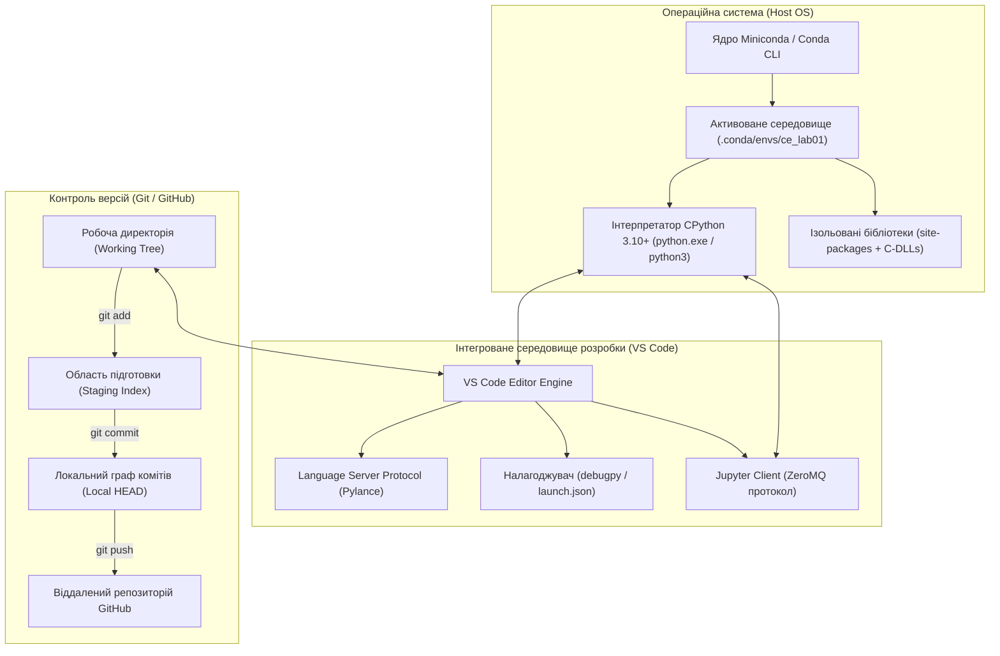
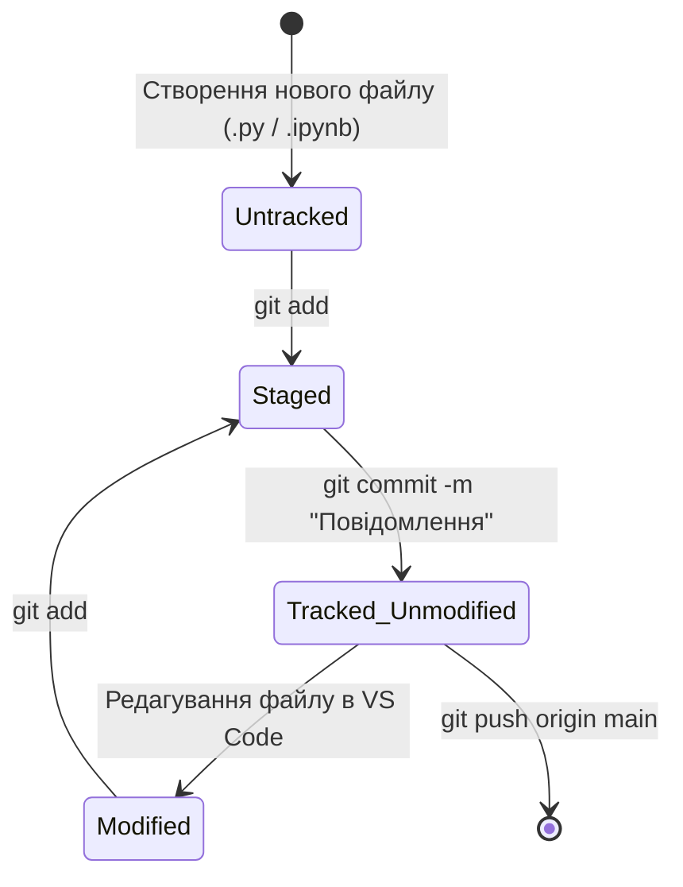

# Лабораторна робота № 1. Розгортання інфраструктури розробки: Miniconda, VS Code, Git/GitHub та базові режими виконання Python

**Мета:** Опанувати повний цикл розгортання та конфігурації професійного інженерного середовища для розробки програмного забезпечення мовою Python. Набути практичних навичок створення та ізоляції віртуальних середовищ за допомогою пакетного менеджера Miniconda, інтеграції середовища розробки Visual Studio Code із підсистемою налагодження `debugpy` та мовним сервером Pylance, налаштування розподіленої системи контролю версій Git та віддаленого репозиторію GitHub. Дослідити фундаментальні відмінності виконання програмного коду в інтерактивній консолі REPL, термінальному пакетному режимі та інтерактивному блокноті Jupyter Notebook.

**Стек технологій та інструменти:**
* **Мова програмування / Інтерпретатор:** Python версії 3.10 або новішої (еталонна реалізація CPython)
* **Платформа управління середовищами:** Дистрибутив Miniconda (Conda Package & Environment Manager)
* **Інструменти розробки (IDE):** Visual Studio Code (із встановленими розширеннями *Python*, *Pylance*, *Jupyter*)
* **Система контролю версій:** Git (локальний клієнт) та хмарна платформа GitHub
* **Інтерактивні обчислення:** Ядро IPython, Jupyter Notebook (`.ipynb`)

---

## 1 Теоретичні відомості

Професійна інженерія програмного забезпечення на сучасному етапі вимагає суворого розмежування глобального оточення операційної системи та проектних залежностей. Якщо інсталяція бібліотек виконується безпосередньо в системний інтерпретатор, неминуче виникає ситуація взаємного блокування версій (*dependency hell*), за якої різні програмні модулі вимагають несумісних бінарних бібліотек або релізів інтерпретатора. Для усунення цієї проблеми застосовується концепція ізольованих віртуальних середовищ.

Дистрибутив Miniconda являє собою мінімалістичний інсталятор кросплатформної системи управління пакетами та віртуальними середовищами Conda. На відміну від стандартного модуля `venv`, який оперує виключно пакунками мови Python через менеджер `pip`, система Conda функціонує як універсальний менеджер системного рівня. Вона дозволяє ізолювати не лише сам інтерпретатор Python заданої версії, але й бінарні скомпільовані динамічні бібліотеки C/C++, фортранівські обчислювальні ядра лінійної алгебри (OpenBLAS, MKL) та низькорівневі системні утиліти. 

Алгоритм розв'язання залежностей у Conda зводиться до розв'язання задачі здійсненності булевих формул (Boolean Satisfiability Problem, SAT):

$$F(x_1, x_2, \dots, x_m) = \bigwedge_{j=1}^{k} C_j = \text{True}$$

де кожна клауза $C_j$ представляє сукупність обмежень на сумісність версій компонентів, а змінні $x_i \in \{0, 1\}$ визначають факт включення конкретної бінарної збірки пакунка до цільового середовища. Оскільки задача SAT належить до класу NP-повних задач, використання легковикового дистрибутива Miniconda мінімізує простір пошуку за рахунок завантаження тільки базових компонентів ядра.


*Рисунок 1 — Архітектурна модель інтеграції середовища виконання Conda, IDE Visual Studio Code та системи Git*

Проаналізуємо взаємодію елементів інфраструктури, наведених на схемі. Простір розробника спирається на ізольоване середовище Conda, шлях до якого явно вказується в середовищі Visual Studio Code як цільовий інтерпретатор (*Python Interpreter*). 

Завдяки протоколу мовного сервера (Language Server Protocol, LSP), підсистема Pylance виконує безперервний статичний аналіз вихідного тексту, індексує типи даних за допомогою дескрипторів та забезпечує навігацію за кодом. 

Підсистема налагодження `debugpy` взаємодіє з віртуальною машиною Python через сокетне з'єднання, перехоплюючи виконання програми у точках зупинки (*breakpoints*) та передаючи у графічний інтерфейс стан стекових кадрів `PyFrameObject` і значення локальних змінних.

Паралельно з файловою структурою функціонує система контролю версій Git, архітектура якої побудована як спрямований ациклічний граф (Directed Acyclic Graph, DAG). Кожен стан проекту однозначно фіксується криптографічним хешем об'єкта коміту:

$$H = \text{SHA-1}(\text{"commit "} + \text{size} + \text{"\0"} + \text{tree\_sha} + \text{parent\_sha} + \text{author} + \text{message})$$

де $H$ — унікальний 160-бітний ідентифікатор стану системи; $\text{tree\_sha}$ — покажчик на кореневе дерево директорій; $\text{parent\_sha}$ — хеш попереднього вузла в історії розробки. 

Файл `.gitignore` виконує детерміновану фільтрацію потоку файлів, блокуючи потрапляння до сховища тимчасових артефактів компіляції (`__pycache__`, `*.pyc`), бінарних файлів віртуальних середовищ та системних конфігурацій робочих станцій, що є критичною вимогою для забезпечення чистоти репозиторію.


*Рисунок 2 — Схема переходів станів файлів у робочому просторі Git*

Життєвий цикл файлу в Git, відображений на рисунку 2, демонструє чіткі межі між станами: невідстежувані файли (*Untracked*) додаються до індексу підготовки (*Staged*), після чого фіксуються в незмінній історії локального репозиторію у вигляді нового коміту, готового до відправки на віддалений сервер GitHub.

---

## 2 Підготовка середовища та розгортання проєкту (Крок 0)

Для розгортання робочого простору здобувач вищої освіти повинен перевірити наявність базового інструментарію у системі та виконати послідовні команди в терміналі операційної системи.

### 2.1. Перевірка версій встановленого програмного забезпечення

Відкрийте системний термінал (PowerShell для Windows або Bash/Zsh для Linux/macOS) та виконайте перевірку доступності базових утиліт:

```bash
# Перевірка працездатності та версії дистрибутива Conda
conda --version

# Перевірка наявності системи контролю версій Git
git --version

# Перевірка доступності виклику редактора Visual Studio Code з командного рядка
code --version
```

### 2.2. Створення та активація ізольованого середовища Conda

Створіть цільове віртуальне середовище з назвою `ce_lab_env`, явно зафіксувавши версію мови Python 3.10 та інсталювавши бібліотеку інтерактивного ядра `ipykernel`:

```bash
# Створення нового ізольованого середовища з інтерпретатором Python 3.10
conda create -n ce_lab_env python=3.10 ipykernel -y

# Активація створеного віртуального середовища
conda activate ce_lab_env

# Перевірка фізичного шляху активованого інтерпретатора Python
python -c "import sys; print(sys.executable)"
```

### 2.3. Структура файлової системи проекту

Для виконання робіт навчального курсу на локальному диску створюється уніфікована ієрархія папок. Створіть кореневу директорію лабораторної роботи та перейдіть до неї:

```bash
mkdir -p ~/projects/computer_engineering_python/lab01
cd ~/projects/computer_engineering_python/lab01
```

Структура каталогу проекту повинна мати такий вигляд:

```text
lab01/
├── .vscode/
│   └── launch.json            # Конфігурація налагоджувача VS Code (debugpy)
├── .gitignore                 # Файл виключення тимчасових та системних файлів
├── environment.yml            # Декларативний опис середовища Conda
├── README.md                  # Загальний опис проекту та інструкція запуску
├── system_diagnostics.py      # Головний діагностичний скрипт програми
└── exploration_notebook.ipynb # Інтерактивний блокнот Jupyter для аналізу середовища
```

### 2.4. Створення конфігураційних файлів

Створіть файл `.gitignore` у корені проекту за допомогою текстового редактора або термінальної команди:

```text
# Файл .gitignore
# Тимчасові файли та кеш байт-коду CPython
__pycache__/
*.py[cod]
*$py.class

# Директорії віртуальних середовищ
.env/
.venv/
env/
venv/
ENV/
miniconda3/

# Конфігурації середовищ розробки та операційної системи
.vscode/*
!.vscode/launch.json
.idea/
.DS_Store
Thumbs.db

# Тимчасові файли Jupyter Notebook
.ipynb_checkpoints/
*-checkpoint.ipynb
```

Створіть файл специфікації середовища `environment.yml` для забезпечення можливості стовідсоткового відтворення інфраструктури:

```yaml
name: ce_lab_env
channels:
  - conda-forge
  - defaults
dependencies:
  - python=3.10
  - ipykernel
  - pip
```

---

## 3 Порядок виконання роботи

### 3.1 Індивідуальні завдання

Кожен здобувач вищої освіти виконує варіант завдання, номер якого відповідає номеру в академічному журналі групи. Програма повинна збирати та відображати діагностичні характеристики операційного середовища виконання CPython відповідно до індивідуального завдання, форматувати вивід та генерувати структурований звіт.

| Варіант | Назва діагностичного модуля | Контрольовані системні параметри та методи | Очікуваний результат / Цільовий артефакт |
| :---: | :--- | :--- | :--- |
| **1** | Архітектура та бітовий порядок | `sys.byteorder`, `platform.machine()`, `sys.maxsize` | Звіт структури розрядності та порядку байтів |
| **2** | Інспекція версій середовища | `sys.version_info`, `platform.python_build()`, `sys.hexversion` | Аналіз мікроверсії інтерпретатора CPython |
| **3** | Діагностика шляхів пошуку | `sys.path`, `sys.prefix`, `sys.base_prefix` | Валідація ізоляції каталогів віртуального середовища |
| **4** | Ліміти рекурсії та пам'яті | `sys.getrecursionlimit()`, розміри `int`, `float` | Визначення накладних витрат скалярів у купі |
| **5** | Інспекція платформи ядра | `platform.system()`, `platform.release()`, `platform.version()` | Профілювання версії ядра операційної системи |
| **6** | Параметри компілятора CPython | `platform.python_compiler()`, `sys.implementation` | Ідентифікація C-компілятора збірки інтерпретатора |
| **7** | Дослідження пулу цілих чисел | `id()` для чисел $-5 \dots 256$ та поза пулом ($300$) | Верифікація роботи механізму Small Integer Cache |
| **8** | Системні потоки введення-виводу | `sys.stdin.encoding`, `sys.stdout.encoding`, `sys.flags` | Звіт таблиці кодування консольних потоків ОС |
| **9** | Конфігурація системного часу | `time.get_clock_info('perf_counter')`, `time.time()` | Визначення дискретності апаратного таймера |
| **10** | Інспекція вбудованого простору | `dir(__builtins__)`, кількість вбудованих винятків | Кількісний аналіз простору імен `builtins` |
| **11** | Діагностика прапорців CPython | `sys.flags`, прапорці оптимізації `-O`, `dont_write_bytecode` | Аналіз параметрів запуску процесу віртуальної машини |
| **12** | Аналіз пам'яті структур даних | `sys.getsizeof()` для порожніх `list`, `tuple`, `dict`, `set` | Порівняльна таблиця базових розмірів структур у пам'яті |
| **13** | Інспекція системних модулів | `sys.builtin_module_names`, перевірка модуля `math` | Виділення скомпільованих C-модулів у ядрі |
| **14** | Ідентифікація апаратного процесора | `platform.processor()`, `platform.uname()` | Повна апаратна паспортизація робочої станції |
| **15** | Характеристики числових типів | `sys.float_info`, `sys.int_info` | Звіт точності мантиси та порядку чисел IEEE 754 |
| **16** | Змінні системного оточення | `os.environ['CONDA_DEFAULT_ENV']`, `os.environ['PATH']` | Верифікація реєстрації змінних середовища Conda |
| **17** | Інспекція розміщення файлів | `__file__`, `os.getcwd()`, абсолютний шлях скрипта | Валідація точок монтування файлової структури |
| **18** | Таймаути перемикання потоків | `sys.getswitchinterval()`, перевірка GIL | Аналіз інтервалу квантування потоків інтерпретатора |
| **19** | Конфігурація кодування файлів | `sys.getfilesystemencoding()`, `sys.getdefaultencoding()` | Звіт стандартів обробки файлових назв і рядків |
| **20** | Аудит налагоджувальних дескрипторів | `sys.gettrace()`, `sys.getprofile()`, стан debugpy | Перевірка активності перехоплювачів налагоджувача |

---

### 3.2. Покроковий алгоритм та розв'язок еталонного прикладу

Розглянемо базовий приклад розробки універсального інженерного модуля діагностики робочого середовища `system_diagnostics.py`, який виконує збір системних метаданих, перевіряє факт ізоляції середовища Conda та обчислює точні розміри структур даних у пам'яті.

#### Крок 1. Створення файлу конфігурації налагодження VS Code

Для забезпечення керованого запуску програми з можливістю встановлення точок зупинки створіть файл `.vscode/launch.json`:

```json
{
    "version": "0.2.0",
    "configurations": [
        {
            "name": "Python: Запуск діагностичного скрипта",
            "type": "debugpy",
            "request": "launch",
            "program": "${workspaceFolder}/system_diagnostics.py",
            "console": "integratedTerminal",
            "justMyCode": true
        }
    ]
}
```

#### Крок 2. Реалізація повного вихідного коду скрипта `system_diagnostics.py`

Створіть файл `system_diagnostics.py` та введіть наступний програмний код, який повністю позбавлений будь-яких скорочень чи спрощень:

```python
"""
Модуль системної діагностики інженерного середовища Python.
Освітній компонент: Програмування на Python.
Спеціальність: F7 Комп'ютерна інженерія.
"""

import os
import platform
import sys
import time


def collect_environment_metadata() -> dict:
    """
    Здійснює агрегацію характеристик апаратної платформи,
    операційної системи та параметрів інтерпретатора CPython.
    """
    # Збір інформації про версію та архітектуру платформи
    system_info = {
        "os_name": platform.system(),
        "os_release": platform.release(),
        "os_architecture": platform.architecture()[0],
        "processor": platform.processor(),
        "python_version": platform.python_version(),
        "python_implementation": platform.python_implementation(),
        "python_compiler": platform.python_compiler(),
        "byte_order": sys.byteorder,
        "interpreter_path": sys.executable,
        "active_conda_env": os.environ.get("CONDA_DEFAULT_ENV", "None (Global/Non-Conda)"),
        "recursion_limit": sys.getrecursionlimit(),
        "thread_switch_interval": sys.getswitchinterval(),
    }
    return system_info


def calculate_memory_footprint() -> dict:
    """
    Обчислює фізичний розмір базових скалярних та складених
    структур даних у байтах за допомогою функції sys.getsizeof.
    """
    # Створення тестових екземплярів різних типів даних
    sample_int_zero = 0
    sample_int_large = 2**64
    sample_float = 3.141592653589793
    sample_complex = 1.0 + 2.0j
    sample_bool = True
    sample_none = None
    sample_str_empty = ""
    sample_str_ascii = "Computer Engineering"
    sample_list_empty = []
    sample_tuple_empty = ()
    sample_dict_empty = {}
    sample_set_empty = set()

    # Формування словника розмірів об'єктів у байтах
    sizes = {
        "int (0)": sys.getsizeof(sample_int_zero),
        "int (2^64)": sys.getsizeof(sample_int_large),
        "float": sys.getsizeof(sample_float),
        "complex": sys.getsizeof(sample_complex),
        "bool": sys.getsizeof(sample_bool),
        "NoneType": sys.getsizeof(sample_none),
        "str (empty)": sys.getsizeof(sample_str_empty),
        "str (ASCII, len=20)": sys.getsizeof(sample_str_ascii),
        "list (empty)": sys.getsizeof(sample_list_empty),
        "tuple (empty)": sys.getsizeof(sample_tuple_empty),
        "dict (empty)": sys.getsizeof(sample_dict_empty),
        "set (empty)": sys.getsizeof(sample_set_empty),
    }
    return sizes


def verify_integer_cache() -> list:
    """
    Здійснює експериментальну верифікацію роботи механізму
    Small Integer Cache для інтервалу [-5, 256] та чисел поза ним.
    """
    cache_results = []
    test_integers = [-5, 0, 100, 256, 257, 1000]

    for val in test_integers:
        # Створення двох незалежних змінних через обчислення
        int_a = int(str(val))
        int_b = int(str(val))
        is_identical = int_a is int_b
        cache_results.append(
            {
                "value": val,
                "id_a": id(int_a),
                "id_b": id(int_b),
                "is_same_object": is_identical,
            }
        )
    return cache_results


def print_formatted_report() -> None:
    """
    Виводить на екран консолі комплексну діагностичну таблицю
    з використанням сучасних специфікаторів форматування f-strings.
    """
    meta = collect_environment_metadata()
    memory = calculate_memory_footprint()
    cache_data = verify_integer_cache()

    separator = "=" * 80
    sub_separator = "-" * 80

    print(separator)
    print(f"{'ЗВІТ СИСТЕМНОЇ ДІАГНОСТИКИ СЕРЕДОВИЩА PYTHON':^80}")
    print(separator)

    # Виведення метаданих платформи
    print(f"Операційна система:      {meta['os_name']} {meta['os_release']} ({meta['os_architecture']})")
    print(f"Апаратний процесор:      {meta['processor']}")
    print(f"Версія інтерпретатора:   {meta['python_version']} ({meta['python_implementation']})")
    print(f"Компілятор ядра CPython: {meta['python_compiler']}")
    print(f"Порядок байтів системи:  {meta['byte_order'].upper()}-ENDIAN")
    print(f"Активоване Conda-env:    {meta['active_conda_env']}")
    print(f"Шлях до інтерпретатора:  {meta['interpreter_path']}")
    print(f"Ліміт глибини рекурсії:  {meta['recursion_limit']} кадрів")
    print(f"Квант перемикання GIL:   {meta['thread_switch_interval']} с")

    print(sub_separator)
    print(f"{'ПРОСТОРОВІ НАКЛАДНІ ВИТРАТИ СТРУКТУР ДАНИХ (CPython 64-bit)':^80}")
    print(sub_separator)
    print(f"| {'Тип даних та стан':<30} | {'Розмір у пам`яті (Байти)':<43} |")
    print(sub_separator)
    for type_name, size_bytes in memory.items():
        print(f"| {type_name:<30} | {size_bytes:<43} |")

    print(sub_separator)
    print(f"{'ВЕРИФІКАЦІЯ МЕХАНІЗМУ SMALL INTEGER CACHE':^80}")
    print(sub_separator)
    print(f"| {'Число':<8} | {'Адреса id(a)':<18} | {'Адреса id(b)':<18} | {'a is b':<12} | {'Статус пулу':<10} |")
    print(sub_separator)
    for row in cache_data:
        pool_status = "КЕШОВАНЕ" if row["is_same_object"] else "ДИНАМІЧНЕ"
        print(
            f"| {row['value']:<8} | {row['id_a']:<18} | {row['id_b']:<18} | {str(row['is_same_object']):<12} | {pool_status:<10} |"
        )
    print(separator)


if __name__ == "__main__":
    t_start = time.perf_counter()
    print_formatted_report()
    t_elapsed = time.perf_counter() - t_start
    print(f"Час повної діагностики середовища: {t_elapsed * 1000:.4f} мс\n")
```

#### Крок 3. Створення інтерактивного блокнота `exploration_notebook.ipynb`

Для дослідження роботи в інтерактивному середовищі створіть у VS Code файл `exploration_notebook.ipynb`. Додайте першу комірку типу Markdown із назвою дослідження та дві комірки виконуваного коду:

*Комірка коду 1 (Ініціалізація та імпорт):*
```python
import sys
import platform
import math

print(f"Ядро IPython успішно підключено до інтерпретатора: {sys.executable}")
```

*Комірка коду 2 (Обчислювальний експеримент):*
```python
# Обчислення числа Пі методом ряду Лейбніца з оцінкою точності
iterations = 100_000
pi_approx = 4.0 * sum((-1.0)**k / (2.0 * k + 1.0) for k in range(iterations))

print(f"Наближення Pi ({iterations} ітерацій): {pi_approx:.8f}")
print(f"Еталонне значення math.pi:         {math.pi:.8f}")
print(f"Абсолютна похибка обчислення:      {abs(pi_approx - math.pi):.8e}")
```

#### Крок 4. Ініціалізація репозиторію та фіксація змін у Git

Виконайте послідовність термінальних команд для фіксації першого етапу розробки в системі контролю версій Git:

```bash
# Ініціалізація нового репозиторію в поточному каталозі
git init

# Перевірка поточного стану відстежуваних файлів
git status

# Додавання всіх файлів проекту до індексу підготовки (Staging Area)
git add .

# Створення першого коміту з інформативним повідомленням
git commit -m "feat(infra): ініціалізація проекту, налаштування conda env, VS Code та діагностичного модуля"

# Перевірка історії комітів
git log --oneline --graph
```

---

### 3.3. Запуск, тестування та перевірка результатів

Для верифікації правильності розгортання виконайте запуск головного скрипта у терміналі під управлінням активованого середовища Conda:

```bash
# Запуск розробленої діагностичної програми
python system_diagnostics.py
```

Нижче наведено приклад еталонного виведення програми в терміналі для 64-розрядної операційної системи Linux / Windows:

```text
================================================================================
                    ЗВІТ СИСТЕМНОЇ ДІАГНОСТИКИ СЕРЕДОВИЩА PYTHON                 
================================================================================
Операційна система:      Linux 6.8.0-40-generic (64bit)
Апаратний процесор:      x86_64
Версія інтерпретатора:   3.10.14 (CPython)
Компілятор ядра CPython: GCC 11.2.0
Порядок байтів системи:  LITTLE-ENDIAN
Активоване Conda-env:    ce_lab_env
Шлях до інтерпретатора:  /home/student/miniconda3/envs/ce_lab_env/bin/python
Ліміт глибини рекурсії:  1000 кадрів
Квант перемикання GIL:   0.005 с
--------------------------------------------------------------------------------
           ПРОСТОРОВІ НАКЛАДНІ ВИТРАТИ СТРУКТУР ДАНИХ (CPython 64-bit)          
--------------------------------------------------------------------------------
| Тип даних та стан              | Розмір у пам`яті (Байти)                    |
--------------------------------------------------------------------------------
| int (0)                        | 28                                          |
| int (2^64)                     | 36                                          |
| float                          | 24                                          |
| complex                        | 32                                          |
| bool                           | 28                                          |
| NoneType                       | 16                                          |
| str (empty)                    | 49                                          |
| str (ASCII, len=20)            | 69                                          |
| list (empty)                   | 56                                          |
| tuple (empty)                  | 40                                          |
| dict (empty)                   | 64                                          |
| set (empty)                    | 216                                         |
--------------------------------------------------------------------------------
                    ВЕРИФІКАЦІЯ МЕХАНІЗМУ SMALL INTEGER CACHE                   
--------------------------------------------------------------------------------
| Число    | Адреса id(a)       | Адреса id(b)       | a is b       | Статус пулу|
--------------------------------------------------------------------------------
| -5       | 139820542387120    | 139820542387120    | True         | КЕШОВАНЕ   |
| 0        | 139820542387280    | 139820542387280    | True         | КЕШОВАНЕ   |
| 100      | 139820542390480    | 139820542390480    | True         | КЕШОВАНЕ   |
| 256      | 139820542395472    | 139820542395472    | True         | КЕШОВАНЕ   |
| 257      | 139820539824624    | 139820539824880    | False        | ДИНАМІЧНЕ  |
| 1000     | 139820539825136    | 139820539824944    | False        | ДИНАМІЧНЕ  |
================================================================================
Час повної діагностики середовища: 1.4820 мс
```

Аналіз результатів перевірки демонструє чітке функціонування механізму `Small Integer Cache`: для значень $-5, 0, 100, 256$ адреси пам'яті `id(a)` та `id(b)` є абсолютно ідентичними, а вираз `a is b` повертає `True`. Для чисел $257$ та $1000$, які виходять за межі пулу, алокуються окремі структури з різними фізичними адресами в купі (`a is b == False`).

---

## 4. Вимоги до змісту звіту

Звіт з лабораторної роботи оформлюється у форматі PDF відповідно до стандартів вищої освіти та повинен містити такі обов'язкові структурні розділи:
1. **Титульна сторінка:** повна назва закладу вищої освіти, назва інституту/факультету, назва кафедри, найменування навчальної дисципліни, номер і тема лабораторної роботи, прізвище та ініціали здобувача, номер академічної групи, номер індивідуального варіанта, прізвище та вчене звання викладача.
2. **Мета роботи та стислий теоретичний вступ:** формулювання мети дослідження, стислий опис архітектури віртуального середовища Conda та системи версіонування Git.
3. **Постановка індивідуального завдання:** опис вимог та контрольованих параметрів згідно з номером призначеного варіанта.
4. **Технологія виконання та програмний код:** повні лістинги створених конфігураційних файлів (`.gitignore`, `environment.yml`, `.vscode/launch.json`), повний вихідний код модуля на мові Python із детальними коментарями.
5. **Результати тестування:** копії екранних форм (скріншоти) термінального виведення програми, виконання коду в Jupyter Notebook, а також графічне відображення графа історії комітів з термінала (`git log --graph --oneline`).
6. **Посилання на віддалений репозиторій:** діюче посилання на створений відкритий репозиторій на платформі GitHub, що містить зафіксовану історію розробки.
7. **Висновки:** аналітичні підсумки щодо досягнення мети роботи, порівняння витрат пам'яті скалярних типів та оцінка переваг ізоляції залежностей у дистрибутиві Miniconda.

---

## 5. Контрольні запитання для захисту роботи

1. У чому полягає системна відмінність між ізоляцією робочого середовища засобами стандартного модуля `venv` та дистрибутива Miniconda при роботі з низькорівневими C-бібліотеками комп'ютерної інженерії?
2. Яким чином влаштована внутрішня модель пам'яті еталонного інтерпретатора CPython? Чому скалярний нуль типу `int` займає 28 байтів у 64-розрядній системі, тоді як у мові C тип `int` потребує лише 4 байти?
3. Поясніть механізм функціонування та призначення пулу малих цілих чисел (*Small Integer Cache*) у CPython. Чому інтерпретатор обмежує кешування строго закритим діапазоном значень $[-5, 256]$?
4. Опишіть трирівневу архітектуру збереження станів файлів у системі контролю версій Git (Working Tree, Staging Area, Local Repository). Яке математичне перетворення забезпечує цілісність графа комітів DAG?
5. Чим принципово відрізняється виконання коду в інтерактивній консолі REPL від запуску скрипта через термінал та виконання у клієнт-серверному блокноті Jupyter Notebook?
6. Яку роль відіграє конфігураційний файл `.vscode/launch.json` та підсистема `debugpy` під час покрокового трасування програми за точками зупинки (*breakpoints*)?