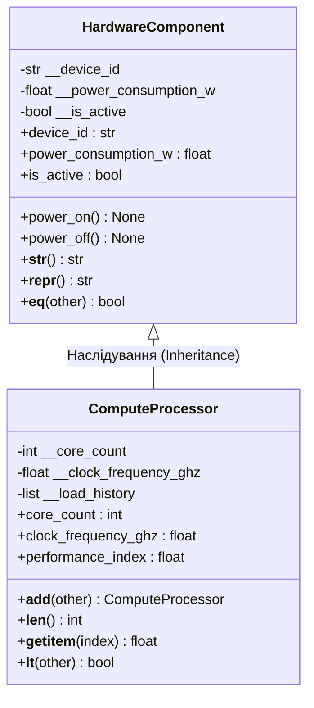
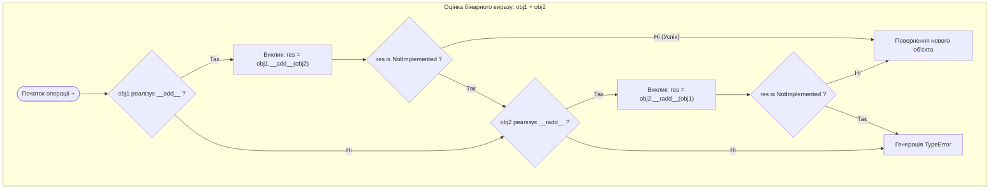

# Лабораторна робота № 11. Об'єктно-орієнтоване проєктування класів та перевантаження магічних методів

**Мета:** Опанувати практичні навички об'єктно-орієнтованого аналізу, проектування та реалізації складних програмних моделей мовою Python. Навчитися створювати класи для моделювання інженерних сутностей комп'ютерних систем, реалізовувати інкапсуляцію даних за допомогою механізму приховування атрибутів та дескрипторів властивостей (`@property`, `@setter`), застосовувати механізм наслідування з делегуванням конструктора через `super()`. Опанувати поліморфізм та перевантаження спеціальних методів моделі даних Python (**dunder-методів**: `__init__`, `__str__`, `__repr__`, `__len__`, `__getitem__`, `__eq__`, `__lt__`, `__add__`) для забезпечення природного математичного та системного синтаксису взаємодії між користувацькими об'єктами.

**Стек технологій та інструменти:**
* **Мова програмування / Інтерпретатор:** Python 3.10+ (CPython 64-bit)
* **Інструменти розробки (IDE):** Visual Studio Code з інтегрованим терміналом та підсистемою налагодження `debugpy`
* **Середовище управління:** Ізольоване середовище Conda (`ce_lab_env`)
* **Бібліотеки та модулі:** `math`, `sys`, `time`

---

## 1 Теоретичні відомості

Об'єктно-орієнтоване програмування (ООП) у комп'ютерній інженерії дозволяє абстрагувати складні фізичні компоненти (процесорні ядра, модулі оперативної пам'яті, цифрові інтерфейси, сенсорні контролери) у вигляді програмних об'єктів. Формально об'єкт моделюється як абстрактний автомат зі станом і множиною переходів:

$$\mathcal{M} = \langle S, \Sigma, \delta, s_0 \rangle$$

де $S$ — простір станів об'єкта (значення приватних атрибутів `__dict__`); $\Sigma$ — вхідний алфавіт подій або викликів методів; $\delta: S \times \Sigma \to S$ — функція переходів (алгоритмічна логіка методів класу); $s_0 \in S$ — початковий стан, що ініціалізується методом `__init__`.

Інкапсуляція в Python реалізує захист внутрішнього стану за допомогою угод про іменування та механізму спотворення імен (**name mangling**). 

Приватні поля, що починаються з двох символів підкреслення `__attribute`, автоматично транслюються компілятором CPython у форму `_ClassName__attribute`, що запобігає їх випадковому перезапису у підкласах. 

Для безпечного керованого доступу до внутрішніх полів застосовується патерн **властивостей** (**properties**), що спирається на протокол дескрипторів:

```python
class ManagedComponent:
    def __init__(self, voltage: float):
        self.__voltage = voltage  # Приватний атрибут

    @property
    def voltage(self) -> float:
        return self.__voltage     # Гетер

    @voltage.setter
    def voltage(self, value: float) -> None:
        if value < 0.0:           # Валідація інваріанта
            raise ValueError("Напруга не може бути від'ємною.")
        self.__voltage = value    # Сетер
```

Декоратор `@property` перетворює виклик методу на операцію читання атрибута `obj.voltage`, а супутній декоратор `@voltage.setter` перехоплює операції присвоєння `obj.voltage = 3.3`, забезпечуючи прозору валідацію типів і фізичних меж параметрів.


*Рисунок 1 — UML-діаграма класів інженерної моделі обчислювального компонента*

Проаналізуємо схему класів, наведену на рисунку 1. Базовий клас `HardwareComponent` інкапсулює спільні атрибути апаратного забезпечення (ідентифікатор, енергоспоживання, статус живлення). 

Похідний клас `ComputeProcessor` розширює базову функціональність специфічними характеристиками (кількість ядер, тактова частота, історія телеметрії навантаження), перевизначаючи методи рядкового представлення та перевантажуючи оператори арифметики й порівняння.

Перевантаження операторів у мові Python здійснюється через реалізацію спеціальних **магічних методів** (**Dunder Methods**):
* Метод `__str__(self)` викликається функціями `print()` та `str()`, формуючи людино-орієнтоване представлення;
* Метод `__repr__(self)` повертає однозначний технічний рядок, що містить повну інформацію для відтворення об'єкта;
* Методи порівняння `__eq__(self, other)` ($==$) та `__lt__(self, other)` ($<$) реалізують компонентне порівняння;
* Метод `__add__(self, other)` ($+$) перевизначає операцію бінарного додавання об'єктів;
* Методи колекційного протоколу `__len__(self)` та `__getitem__(self, index)` дозволяють об'єкту поводитися як стандартна послідовність (підтримка функції `len(obj)` та індексації `obj[i]`).


*Рисунок 2 — Повний алгоритм диспетчеризації перевантажених операторів у CPython*

Схема демонструє протокол узгодження типів: якщо лівий операнд повертає значення `NotImplemented`, інтерпретатор автоматично перенаправляє запит реверсивному методу правого операнда `__radd__`, гарантуючи симетричність математичних операцій.

---

## 2 Підготовка середовища та розгортання проєкту (Крок 0)

Для виконання лабораторної роботи здобувач вищої освіти використовує налаштоване робоче середовище `ce_lab_env`.

### 2.1. Активація робочого середовища та створення структури папок

Відкрийте термінал операційної системи та виконайте команди розгортання робочого каталогу `lab11`:

```bash
# Активація віртуального середовища Conda
conda activate ce_lab_env

# Створення робочого каталогу для Лабораторної роботи №11
mkdir -p ~/projects/computer_engineering_python/lab11
cd ~/projects/computer_engineering_python/lab11
```

### 2.2. Структура файлової системи проекту

У робочій директорії `lab11` створіть файли проекту відповідно до наведеної структури:

```text
lab11/
├── .vscode/
│   └── launch.json            # Конфігурація налагоджувача для ЛБ №11
├── .gitignore                 # Правила виключення тимчасових файлів
├── hardware_entities.py       # Модуль базових та похідних класів апаратних моделей
├── test_bench.py              # Тестовий модуль перевірки поліморфізму та перевантаження
└── README.md                  # Звітний опис виконання індивідуального варіанта
```

### 2.3. Створення конфігурації налагоджувача `.vscode/launch.json`

Створіть файл `.vscode/launch.json` для забезпечення налагодження розроблюваних об'єктно-орієнтованих модулів:

```json
{
    "version": "0.2.0",
    "configurations": [
        {
            "name": "Python: Запуск об'єктного тестбенчу (ЛБ11)",
            "type": "debugpy",
            "request": "launch",
            "program": "${workspaceFolder}/test_bench.py",
            "console": "integratedTerminal",
            "justMyCode": true
        }
    ]
}
```

---

## 3 Порядок виконання роботи

### 3.1 Індивідуальні завдання

Кожен здобувач вищої освіти проектує ієрархію об'єктно-орієнтованих моделей апаратних компонентів або периферійних систем комп'ютерної інженерії відповідно до індивідуального варіанта.

Вимоги до реалізації:
1. **Базовий клас:** розробка базового класу з інкапсульованими приватними полями (`__private`), валідацією значень через декоратори `@property` та `@setter`, а також реалізацією методів `__init__`, `__str__`, `__repr__` та `__eq__`.
2. **Похідний клас:** створення класу-нащадка за допомогою наслідування, розширення стану через виклик `super().__init__()`, додавання специфічних атрибутів та методів.
3. **Перевантаження dunder-методів:** обов'язкова реалізація операцій порівняння (`__lt__`), бінарної арифметики (`__add__` для агрегації або об'єднання ресурсів компонентів) та підтримка протоколу послідовностей (`__len__` і `__getitem__` для доступу до внутрішніх буферів чи масивів телеметрії).

| Варіант | Базовий клас інженерної сутності | Похідний спеціалізований клас | Семантика оператора `__add__` (+) та критерій `__lt__` (<) |
| :---: | :--- | :--- | :--- |
| **1** | Модуль пам'яті `RAMModule` (обсяг, частота) | Серверний модуль `ECCRAMModule` (ECC біти)| $+$ Об'єднання обсягів каналів Dual-Channel; $<$ за пропускною здатністю |
| **2** | Процесорне ядро `CPUKernel` (частота, IPC) | Векторний прискорювач `SIMDKernel` (розрядність)| $+$ Сумування продуктивності ядер (MFLOPS); $<$ за тактовою частотою |
| **3** | Накопичувач `StorageDrive` (ємність, знос)| Твердотільний диск `NVMeDrive` (PCIe лінії)| $+$ Об'єднання ємності у віртуальний том (JBOD); $<$ за часом напрацювання |
| **4** | Мережевий порт `NetworkInterface` (MAC, MTU)| Оптичний порт `FiberInterface` (довжина хвилі)| $+$ Агрегація каналів (Link Aggregation/LACP); $<$ за бітовою швидкістю |
| **5** | Графічний шейдер `ShaderCore` (ALU, частота)| Трасувальник променів `RTXCore` (BVH блоки)| $+$ Об'єднання обчислювальних блоків кластера; $<$ за кількістю ALU |
| **6** | Блок живлення `PowerRail` (напруга, струм) | Імпульсний стабілізатор `VRMController` (ККД)| $+$ Паралельне з'єднання фаз живлення (струм); $<$ за потужністю $P = U \cdot I$ |
| **7** | Таймер-лічильник `HardwareTimer` (частота)| Таймер ШІМ `PWMTimer` (коефіцієнт заповнення) | $+$ Каскадування лічильників (розрядність); $<$ за базовою частотою |
| **8** | Аналоговий датчик `AnalogSensor` (межі, АЦП)| Датчик тиску `PiezoSensor` (чутливість) | $+$ Усереднення вимірів паралельних датчиків; $<$ за рівнем шуму |
| **9** | Контролер переривань `InterruptLine` (IRQ)| Векторний контролер `APICInterrupt` (пріоритет)| $+$ Об'єднання масок дозволених переривань; $<$ за пріоритетом IRQ |
| **10** | Комутаційна матриця `CrossbarSwitch` (порти)| Оптичний матричний комутатор `OpticalMatrix` | $+$ Каскадне збільшення кількості портів; $<$ за комутаційною ємністю |
| **11** | Блок кеш-пам'яті `CacheLine` (розмір, тег)| Асоціативний кеш `SetAssociativeCache` (W)| $+$ Збільшення кількості ліній кешу; $<$ за коефіцієнтом промахів (Miss Rate) |
| **12** | Послідовний порт `UARTController` (бодрейт)| Захищений порт `RS485Controller` (термінація)| $+$ Об'єднання буферів передачі FIFO; $<$ за швидкістю передачі даних |
| **13** | Системна шина `SystemBus` (ширина шини, CLK)| Шина розширення `PCIeBus` (покоління Gen, Lanes)| $+$ Збільшення сумарної пропускної здатності; $<$ за тактовою частотою |
| **14** | Криптопроцесор `CryptoEngine` (ключі, біти)| Апаратний модуль `HSMEngine` (tamper sensors)| $+$ Сумування швидкості шифрування (MB/s); $<$ за стійкістю алгоритму |
| **15** | Радіомодуль `WirelessTransceiver` (дБм, Freq)| Модуль LoRaWAN `LoRaTransceiver` (Spreading F)| $+$ Багатоканальне об'єднання смуги частот; $<$ за вихідною потужністю TX |
| **16** | Дисплейний контролер `DisplayPipe` (RGB, Res)| Контролер eDP `EmbeddedDisplayPort` (Refresh)| $+$ Подвоєння пропускної здатності лінків; $<$ за піксельною частотою |
| **17** | Аудіо ЦАП `AudioDAC` (розрядність, SNR) | Дельта-сигма ЦАП `DeltaSigmaDAC` (Oversample) | $+$ Багатоканальне фазове увімкнення ЦАП; $<$ за динамічним діапазоном |
| **18** | Контролер DMA `DMAChannel` (буфер, пріоритет)| Багатоканальний вузол `ScatterGatherDMA` (дескр.)| $+$ Конкатенація ланцюжків передачі пам'яті; $<$ за пріоритетом каналу |
| **19** | Вентилятор стійки `CoolingFan` (RPM, діаметр)| Вентилятор PWM `SmartPWMFan` (тахометр)| $+$ Сумування повітряного потоку (CFM); $<$ за акустичним шумом (dBA) |
| **20** | Апаратний стек `HardwareStack` (глибина, SP)| Тіньовий стек викликів `ShadowStack` (контроль)| $+$ Збільшення глибини адресного стека; $<$ за кількістю вільних слотів |

---

### 3.2. Покроковий алгоритм та розв'язок еталонного прикладу

Розглянемо базовий навчально-інженерний приклад: об'єктне моделювання блоку цифрової обробки сигналів (`SignalProcessorUnit`) та його спеціалізованого оптичного розширення (`OpticalDSPUnit`).

Функціональні вимоги до моделі:
1. **Базовий клас `SignalProcessorUnit`:**
   * Інкапсулює приватні атрибути `__device_id` (str), `__sampling_rate_hz` (float) та масив буфера вимірювань `__samples_buffer` (list of float).
   * Властивість `sampling_rate_hz` валідує мінімальну частоту дискретизації за теоремою Найквіста-Котельникова ($f_s \ge 1000.0\text{ Гц}$).
   * Обчислювана властивість `rms_voltage` розраховує середньоквадратичну напругу сигналу за формулою:
     $$V_{\text{RMS}} = \sqrt{\frac{1}{N} \sum_{i=0}^{N-1} U_i^2}$$
   * Dunder-методи: `__str__`, `__repr__`, `__len__` (кількість відліків у буфері), `__getitem__` (доступ до відліку за індексом), `__eq__` (порівняння за ID та частотою), `__lt__` (порівняння за рівнем $V_{\text{RMS}}$), `__add__` (паралельне об'єднання відліків двох процесорів).
2. **Похідний клас `OpticalDSPUnit`:**
   * Успадковує `SignalProcessorUnit`, викликає `super().__init__()` та додає приватне поле довжини хвилі лазера `__wavelength_nm` (float).
   * Перевизначає метод `__repr__` та розширює строковий звіт `__str__`.

#### Крок 1. Реалізація модуля класів `hardware_entities.py`

Створіть файл `hardware_entities.py` у каталозі `lab11` та введіть повний код:

```python
"""
Лабораторна робота № 11. Модуль 1.
Об'єктно-орієнтована модель процесора цифрової обробки сигналів (DSP).
Інкапсуляція (@property), наслідування та перевантаження dunder-методів.
Освітній компонент: Програмування на Python.
"""

import math
from typing import Union, List


class SignalProcessorUnit:
    """Базовий клас блоку цифрової обробки сигналів."""

    def __init__(self, device_id: str, sampling_rate_hz: float, initial_samples: List[float] = None):
        self.__device_id: str = str(device_id).strip()
        self.__sampling_rate_hz: float = 0.0
        
        # Ініціалізація через сетер для запуску валідації інваріанта
        self.sampling_rate_hz = sampling_rate_hz
        
        # Інкапсульований буфер вибірок сигналу
        self.__samples_buffer: List[float] = [float(s) for s in initial_samples] if initial_samples else []

    @property
    def device_id(self) -> str:
        """Повертає ідентифікатор пристрою (тільки для читання)."""
        return self.__device_id

    @property
    def sampling_rate_hz(self) -> float:
        """Гетер частоти дискретизації."""
        return self.__sampling_rate_hz

    @sampling_rate_hz.setter
    def sampling_rate_hz(self, rate: float) -> None:
        """Сетер частоти дискретизації з перевіркою мінімального інженерного порогу."""
        if not isinstance(rate, (int, float)):
            raise TypeError("Частота дискретизації повинна бути числовим значенням.")
        if rate < 1000.0:
            raise ValueError(f"Частота дискретизації ({rate} Гц) нижча за мінімальний поріг 1000.0 Гц.")
        self.__sampling_rate_hz = float(rate)

    @property
    def rms_voltage(self) -> float:
        """
        Обчислювана властивість: середньоквадратичне значення напруги (V_RMS).
        V_RMS = sqrt( (1 / N) * sum(U_i^2) )
        """
        if not self.__samples_buffer:
            return 0.0
        sum_squares = sum(val**2 for val in self.__samples_buffer)
        return math.sqrt(sum_squares / len(self.__samples_buffer))

    def append_sample(self, voltage_val: float) -> None:
        """Додає новий виміряний відлік напруги до внутрішнього буфера."""
        if not isinstance(voltage_val, (int, float)):
            raise TypeError("Значення відліку напруги повинно бути числом.")
        self.__samples_buffer.append(float(voltage_val))

    # --- Перевантаження Dunder-методів протоколу послідовностей ---

    def __len__(self) -> int:
        """Повертає кількість накопичених відліків у буфері при виклику len(obj)."""
        return len(self.__samples_buffer)

    def __getitem__(self, index: int) -> float:
        """Забезпечує пряму індексацію відліків сигналу: obj[i]."""
        return self.__samples_buffer[index]

    # --- Перевантаження Dunder-методів представлення ---

    def __repr__(self) -> str:
        """Офіційне рядкове представлення об'єкта для розробника."""
        return (
            f"SignalProcessorUnit(device_id='{self.__device_id}', "
            f"sampling_rate_hz={self.__sampling_rate_hz}, "
            f"samples_count={len(self.__samples_buffer)})"
        )

    def __str__(self) -> str:
        """Форматоване представлення для інженерних звітів."""
        return (
            f"DSP [{self.__device_id}] | Частота: {self.__sampling_rate_hz / 1000:.1f} кГц | "
            f"Буфер: {len(self)} відліків | V_RMS: {self.rms_voltage:.4f} В"
        )

    # --- Перевантаження операторів порівняння ---

    def __eq__(self, other: object) -> bool:
        """Перевірка рівності: однакові ID та частоти дискретизації."""
        if not isinstance(other, SignalProcessorUnit):
            return False
        return (self.device_id == other.device_id and 
                math.isclose(self.sampling_rate_hz, other.sampling_rate_hz, rel_tol=1e-9))

    def __lt__(self, other: "SignalProcessorUnit") -> bool:
        """Порівняння 'менше' за середньоквадратичною потужністю сигналу (V_RMS)."""
        if not isinstance(other, SignalProcessorUnit):
            return NotImplemented
        return self.rms_voltage < other.rms_voltage

    # --- Перевантаження оператора додавання (+) ---

    def __add__(self, other: "SignalProcessorUnit") -> "SignalProcessorUnit":
        """
        Оператор додавання двох процесорів: створює новий зведений вузол,
        об'єднуючи буфери відліків та встановлюючи максимальну частоту дискретизації.
        """
        if not isinstance(other, SignalProcessorUnit):
            return NotImplemented
        
        combined_id = f"{self.device_id}+{other.device_id}"
        max_rate = max(self.sampling_rate_hz, other.sampling_rate_hz)
        combined_samples = self.__samples_buffer + other.__samples_buffer

        return SignalProcessorUnit(
            device_id=combined_id,
            sampling_rate_hz=max_rate,
            initial_samples=combined_samples
        )


class OpticalDSPUnit(SignalProcessorUnit):
    """Похідний клас процесора оптичних телекомунікаційних сигналів."""

    def __init__(self, device_id: str, sampling_rate_hz: float, wavelength_nm: float, initial_samples: List[float] = None):
        # Делегування ініціалізації базовому класу через super()
        super().__init__(device_id, sampling_rate_hz, initial_samples)
        
        if wavelength_nm <= 0.0:
            raise ValueError("Довжина хвилі оптичного сигналу повинна бути додатною.")
        self.__wavelength_nm = float(wavelength_nm)

    @property
    def wavelength_nm(self) -> float:
        """Гетер довжини хвилі лазера."""
        return self.__wavelength_nm

    def __repr__(self) -> str:
        """Перевизначений технічний вивід для оптичного процесора."""
        return (
            f"OpticalDSPUnit(device_id='{self.device_id}', "
            f"sampling_rate_hz={self.sampling_rate_hz}, "
            f"wavelength_nm={self.__wavelength_nm}, "
            f"samples_count={len(self)})"
        )

    def __str__(self) -> str:
        """Перевизначене користувацьке представлення з оптичними метриками."""
        base_info = super().__str__()
        return f"{base_info} | Оптика: λ={self.__wavelength_nm:.1f} нм"
```

#### Крок 2. Реалізація тестового стенду `test_bench.py`

Створіть файл `test_bench.py` у каталозі `lab11` та введіть повний код:

```python
"""
Лабораторна робота № 11. Модуль 2.
Тестовий стенд верифікації поліморфізму, інкапсуляції та dunder-операторів.
Освітній компонент: Програмування на Python.
"""

import sys
import time
from hardware_entities import SignalProcessorUnit, OpticalDSPUnit


def run_oop_testbench() -> None:
    """Виконує функціональне тестування об'єктно-орієнтованої моделі."""
    header_sep = "=" * 90
    sub_sep = "-" * 90

    print(header_sep)
    print(f"{'ТЕСТОВИЙ СТЕНД ОБ`ЄКТНО-ОРІЄНТОВАНОГО МОДЕЛЮВАННЯ ТА DUNDER-МЕТОДІВ':^90}")
    print(header_sep)

    # 1. Створення об'єктів базового та похідного класів
    dsp1 = SignalProcessorUnit(
        device_id="DSP-CH1",
        sampling_rate_hz=48000.0,
        initial_samples=[1.2, 2.4, -1.1, 0.5, 3.1]
    )

    dsp2 = SignalProcessorUnit(
        device_id="DSP-CH2",
        sampling_rate_hz=48000.0,
        initial_samples=[0.2, 0.4, 0.1, -0.3]
    )

    opt_dsp = OpticalDSPUnit(
        device_id="OPT-CORE-01",
        sampling_rate_hz=96000.0,
        wavelength_nm=1550.0,
        initial_samples=[2.1, 2.5, 2.2, 2.8]
    )

    # 2. Демонстрація строкового відображення (__str__ та __repr__)
    print(f"{'1. СТРОКОВЕ ВІДОБРАЖЕННЯ ОБ`ЄКТІВ (__str__ та __repr__)':^90}")
    print(f"  print(dsp1):      {dsp1}")
    print(f"  print(dsp2):      {dsp2}")
    print(f"  print(opt_dsp):   {opt_dsp}")
    print(f"  repr(opt_dsp):    {repr(opt_dsp)}")
    print(sub_sep)

    # 3. Перевірка роботи властивостей та валідації (@property)
    print(f"{'2. ІНКАПСУЛЯЦІЯ ТА ВАЛІДАЦІЯ ВЛАСТИВОСТЕЙ (@property)':^90}")
    print(f"  Початкова частота dsp1: {dsp1.sampling_rate_hz} Гц")
    dsp1.sampling_rate_hz = 192000.0
    print(f"  Оновлена частота dsp1:  {dsp1.sampling_rate_hz} Гц")
    
    try:
        dsp1.sampling_rate_hz = 500.0  # Спроба встановлення неприпустимої частоти
    except ValueError as err:
        print(f"  [ЗАХИСТ СЕТЕРА ПРАЦЮЄ]: {err}")
    print(sub_sep)

    # 4. Протокол послідовностей (__len__ та __getitem__)
    print(f"{'3. ПРОТОКОЛ ПОСЛІДОВНОСТЕЙ (__len__, __getitem__)':^90}")
    print(f"  Кількість відліків dsp1 (len): {len(dsp1)}")
    print(f"  Доступ за індексом dsp1[0]:    {dsp1[0]:.2f} В")
    print(f"  Доступ за індексом dsp1[4]:    {dsp1[4]:.2f} В")
    print(f"  Зріз значень через ітератор:   {[dsp1[i] for i in range(len(dsp1))]}")
    print(sub_sep)

    # 5. Перевантаження оператора додавання (__add__)
    print(f"{'4. ПЕРЕВАНТАЖЕННЯ АРИФМЕТИКИ (__add__)':^90}")
    combined_dsp = dsp1 + dsp2
    print(f"  Результат dsp1 + dsp2:         {combined_dsp}")
    print(f"  Сумарний буфер combined_dsp:   {len(combined_dsp)} відліків")
    print(sub_sep)

    # 6. Перевантаження операторів порівняння (__eq__, __lt__)
    print(f"{'5. ОПЕРАТОРИ ПОРІВНЯННЯ (__eq__, __lt__)':^90}")
    print(f"  V_RMS dsp1: {dsp1.rms_voltage:.4f} В | V_RMS dsp2: {dsp2.rms_voltage:.4f} В")
    print(f"  dsp1 == dsp2 ?  {dsp1 == dsp2} (Рівність ID та частоти)")
    print(f"  dsp2 < dsp1  ?  {dsp2 < dsp1}  (Порівняння за RMS напругою)")
    print(f"  dsp1 < dsp2  ?  {dsp1 < dsp2}")

    # 7. Поліморфне сортування колекції різнорідних DSP-об'єктів
    dsp_cluster = [dsp1, dsp2, opt_dsp, combined_dsp]
    print(sub_sep)
    print(f"{'6. ПОЛІМОРФНЕ СОРТУВАННЯ КЛАСТЕРА ПРИСТРОЇВ (sorted за V_RMS)':^90}")
    sorted_cluster = sorted(dsp_cluster)
    for idx, node in enumerate(sorted_cluster, start=1):
        print(f"  Ранг {idx}: {node}")
    print(header_sep + "\n")


def main() -> None:
    """Головна точка входу лабораторної роботи."""
    t_start = time.perf_counter()
    run_oop_testbench()
    t_elapsed = time.perf_counter() - t_start
    print(f"Час виконання об'єктно-орієнтованого тестування: {t_elapsed * 1000:.3f} мс\n")


if __name__ == "__main__":
    main()
```

---

### 3.3. Запуск, тестування та перевірка результатів

Виконайте запуск розробленої програми у системному терміналі VS Code під управлінням активованого середовища Conda:

```bash
# Запуск тестового стенду ООП
python test_bench.py
```

Нижче наведено еталонний вивід результатів виконання програми в терміналі:

```text
==========================================================================================
            ТЕСТОВИЙ СТЕНД ОБ`ЄКТНО-ОРІЄНТОВАНОГО МОДЕЛЮВАННЯ ТА DUNDER-МЕТОДІВ           
==========================================================================================
------------------------------------------------------------------------------------------
                  1. СТРОКОВЕ ВІДОБРАЖЕННЯ ОБ`ЄКТІВ (__str__ та __repr__)                  
------------------------------------------------------------------------------------------
  print(dsp1):      DSP [DSP-CH1] | Частота: 48.0 кГц | Буфер: 5 відліків | V_RMS: 1.9570 В
  print(dsp2):      DSP [DSP-CH2] | Частота: 48.0 кГц | Буфер: 4 відліків | V_RMS: 0.2739 В
  print(opt_dsp):   DSP [OPT-CORE-01] | Частота: 96.0 кГц | Буфер: 4 відліків | V_RMS: 2.4218 В | Оптика: λ=1550.0 нм
  repr(opt_dsp):    OpticalDSPUnit(device_id='OPT-CORE-01', sampling_rate_hz=96000.0, wavelength_nm=1550.0, samples_count=4)
------------------------------------------------------------------------------------------
                  2. ІНКАПСУЛЯЦІЯ ТА ВАЛІДАЦІЯ ВЛАСТИВОСТЕЙ (@property)                   
------------------------------------------------------------------------------------------
  Початкова частота dsp1: 48000.0 Гц
  Оновлена частота dsp1:  192000.0 Гц
  [ЗАХИСТ СЕТЕРА ПРАЦЮЄ]: Частота дискретизації (500.0 Гц) нижча за мінімальний поріг 1000.0 Гц.
------------------------------------------------------------------------------------------
                    3. ПРОТОКОЛ ПОСЛІДОВНОСТЕЙ (__len__, __getitem__)                     
------------------------------------------------------------------------------------------
  Кількість відліків dsp1 (len): 5
  Доступ за індексом dsp1[0]:    1.20 В
  Доступ за індексом dsp1[4]:    3.10 В
  Зріз значень через ітератор:   [1.2, 2.4, -1.1, 0.5, 3.1]
------------------------------------------------------------------------------------------
                       4. ПЕРЕВАНТАЖЕННЯ АРИФМЕТИКИ (__add__)                             
------------------------------------------------------------------------------------------
  Результат dsp1 + dsp2:         DSP [DSP-CH1+DSP-CH2] | Частота: 192.0 кГц | Буфер: 9 відліків | V_RMS: 1.4813 В
  Сумарний буфер combined_dsp:   9 відліків
------------------------------------------------------------------------------------------
                       5. ОПЕРАТОРИ ПОРІВНЯННЯ (__eq__, __lt__)                           
------------------------------------------------------------------------------------------
  V_RMS dsp1: 1.9570 В | V_RMS dsp2: 0.2739 В
  dsp1 == dsp2 ?  False (Рівність ID та частоти)
  dsp2 < dsp1  ?  True  (Порівняння за RMS напругою)
  dsp1 < dsp2  ?  False
------------------------------------------------------------------------------------------
                6. ПОЛІМОРФНЕ СОРТУВАННЯ КЛАСТЕРА ПРИСТРОЇВ (sorted за V_RMS)             
------------------------------------------------------------------------------------------
  Ранг 1: DSP [DSP-CH2] | Частота: 48.0 кГц | Буфер: 4 відліків | V_RMS: 0.2739 В
  Ранг 2: DSP [DSP-CH1+DSP-CH2] | Частота: 192.0 кГц | Буфер: 9 відліків | V_RMS: 1.4813 В
  Ранг 3: DSP [DSP-CH1] | Частота: 192.0 кГц | Буфер: 5 відліків | V_RMS: 1.9570 В
  Ранг 4: DSP [OPT-CORE-01] | Частота: 96.0 кГц | Буфер: 4 відліків | V_RMS: 2.4218 В | Оптика: λ=1550.0 нм
==========================================================================================

Час виконання об'єктно-орієнтованого тестування: 1.520 мс
```

Аналіз результатів тестування демонструє:
1. Сетери властивостей успішно блокують спробу встановити некоректну частоту дискретизації $500\text{ Гц}$, захищаючи інваріант об'єкта.
2. Перевантаження оператора додавання `+` коректно створило новий зведений екземпляр класу з об'єднаним буфером ($5 + 4 = 9$ відліків).
3. Перевантажений оператор менше `<` забезпечив прозоре сортування кластера пристроїв за допомогою стандартної функції `sorted()`, розташувавши об'єкти за зростанням $V_{\text{RMS}}$ (від $0.2739\text{ В}$ до $2.4218\text{ В}$).

---

## 4. Вимоги до змісту звіту

Звіт з лабораторної роботи оформлюється у форматі PDF відповідно до вимог НАЗЯВО/ECTS та повинен містити такі обов'язкові структурні розділи:
1. **Титульна сторінка:** повне найменування ЗВО, факультету, кафедри, дисципліни, номер і назва роботи, відомості про студента (ПІБ, група, варіант), відомості про викладача.
2. **Мета роботи та технічна постановка задачі:** формулювання мети дослідження, опис компонентної предметної області та технічні вимоги до класів згідно з варіантом.
3. **UML-діаграма класів:** графічна діаграма проектованої системи із зазначенням рівнів доступу атрибутів (`-private`, `+public`), типізації полів та сигнатур методів.
4. **Програмний код:** повні вихідні лістинги модулів `hardware_entities.py` та `test_bench.py` із детальними авторськими коментарями.
5. **Результати тестування:** скріншоти консольного виведення результатів тестування інкапсуляції, протоколу послідовностей, перевантаження операторів та поліморфного сортування.
6. **Посилання на Git-репозиторій:** діюче посилання на оновлений репозиторій GitHub із зафіксованим комітом виконаної лабораторної роботи.
7. **Висновки:** аналітичний підсумок щодо переваг парадигми ООП, ролі dunder-методів у побудові виразного коду та ефективності застосування властивостей `@property`.

---

## 5. Контрольні запитання для захисту роботи

1. Як влаштований механізм спотворення імен (*name mangling*) у CPython? Чому приватний атрибут `__sampling_rate_hz` недоступний як `obj.__sampling_rate_hz`, але доступний через `obj._SignalProcessorUnit__sampling_rate_hz`?
2. Поясніть принципову різницю між спеціальними методами `__str__()` та `__repr__()`. У яких системних ситуаціях інтерпретатор автоматично викликає `__repr__` замість `__str__`?
3. Опишіть роботу протоколу дескрипторів, що лежить в основі декораторів `@property` та `@setter`. Яким чином сетер властивості запобігає переходу об'єкта в некоректний стан?
4. У чому полягає роль функції `super()` при наслідуванні класів? Чому при множинному наслідуванні виклик `super()` є обов'язковим для дотримання лінеаризації MRO за алгоритмом C3?
5. Що повинна повертати функція перевантаження арифметичного оператора `__add__(self, other)`, якщо переданий операнд `other` має непідтримуваний тип, і як віртуальна машина PVM обробляє значення `NotImplemented`?
6. Розкрийте концепцію качиної типізації (*Duck Typing*) у контексті поліморфізму Python. Чому функція `sorted()` здатна впорядковувати список користувацьких об'єктів без явної реалізації спеціальних інтерфейсів?