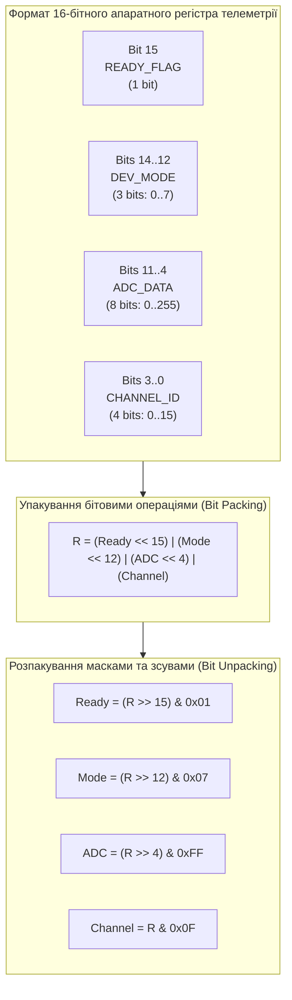
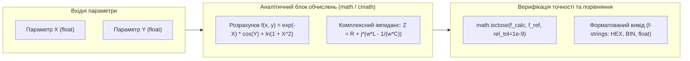

# Лабораторна робота № 2. Скалярні типи даних, побітові операції та математичне моделювання

**Мета:** Опанувати практичні навички роботи зі скалярними типами даних мови Python (`int`, `float`, `complex`, `bool`), вивчити внутрішні особливості представлення цілих чисел довільної точності та дійсних чисел стандарту IEEE 754. Навчитися реалізовувати складні аналітичні математичні моделі із застосуванням функцій стандартних модулів `math` і `cmath`, виконувати перетворення між різними позиційними системами числення, а також освоїти бітову арифметику та маніпуляції з бітовими масками для моделювання апаратних регістрів мікроконтролерів і низькорівневих телеметричних пакетів у задачах комп'ютерної інженерії.

**Стек технологій та інструменти:**
* **Мова програмування / Інтерпретатор:** Python 3.10+ (CPython 64-bit)
* **Інструменти розробки (IDE):** Visual Studio Code з інтегрованим терміналом та підсистемою налагодження `debugpy`
* **Середовище управління:** Ізольоване середовище Conda (`ce_lab_env`)
* **Бібліотеки та модулі:** `math`, `cmath`, `random`, `sys`

---

## 1 Теоретичні відомості

У комп'ютерній інженерії проектування алгоритмів низькорівневої обробки сигналів, взаємодії з периферійними пристроями та моделювання фізичних процесів спирається на базові скалярні типи даних. Мова Python забезпечує уніфікований підхід до числових типів, інкапсулюючи апаратні особливості процесорів у високорівневі абстракції, зберігаючи при цьому доступ до бітових операцій прямого керування пам'яттю.

Цілочисельний тип `int` у Python 3 реалізує довгу арифметику довільної точності. На внутрішньому рівні CPython об'єкт `PyLongObject` представляє число як динамічний масив 30-бітних розрядів (*digits*). Це усуває проблему апаратного переповнення розрядної сітки (наприклад, переповнення 32- або 64-бітних цілих, властивого мовам C/C++), дозволяючи обчислювати точні значення довільних степенів та факторіалів без втрати розрядів. 

Дійсні числа типу `float` представляють 64-розрядні числа з плаваючою комою подвійної точності відповідно до стандарту IEEE 754. Формат включає 1 біт знака ($s$), 11 бітів зміщеного порядку ($e$) та 52 біти мантиси ($m$). 

Значення числа визначається формулою:

$$V = (-1)^s \times \left(1 + \sum_{i=1}^{52} b_{52-i} 2^{-i}\right) \times 2^{e - 1023}$$

де $s \in \{0, 1\}$ — знаковий розряд; $e \in [1, 2046]$ — зміщена експонента з нульовим рівнем 1023; $b_k \in \{0, 1\}$ — біти дробової частини мантиси. 

Через скінченність розрядної сітки більшість дробових чисел (наприклад, $0.1_{10} = 0.0001100110011\dots_2$) не мають точного двійкового подання. Тому пряме порівняння дійсних чисел за допомогою оператора `==` є алгоритмічною помилкою. 

Коректне інженерне порівняння виконується з урахуванням граничної похибки $\varepsilon$ за допомогою функції `math.isclose(a, b)`:

$$|a - b| \le \max\left(\text{rel\_tol} \times \max(|a|, |b|), \; \text{abs\_tol}\right)$$

де $\text{rel\_tol}$ — максимальне допустиме відносне відхилення (за замовчуванням $10^{-9}$); $\text{abs\_tol}$ — мінімальне абсолютне відхилення, що застосовується для значень, близьких до нуля.

Комплексні числа типу `complex` моделюються парою дійсних чисел $z = x + y\mathbf{j}$, де $x = \text{Re}(z)$ — дійсна частина, а $y = \text{Im}(z)$ — уявна частина ($\mathbf{j} = \sqrt{-1}$). Перехід від алгебраїчної форми до тригонометричної або показникової ($z = r e^{\mathbf{j}\theta}$) здійснюється через розрахунок евклідового модуля $r$ та фазового кута $\theta$:

$$r = |z| = \sqrt{x^2 + y^2}, \quad \theta = \text{Arg}(z) = \text{atan2}(y, x)$$

де $r \ge 0$ — модуль комплексного числа; $\theta \in (-\pi, \pi]$ — головне значення аргументу в радіанах.


*Рисунок 1 — Структурна схема упакування та розпакування бітових полів апаратного регістра*

Проаналізуємо механізм побітових операцій, наведений на рисунку 1. У комп'ютерній інженерії прямий доступ до окремих бітових груп є основою взаємодії з регістрами мікроконтролерів (GPIO, ADC, UART Control Registers). 

Бітові операції виконуються над цілими числами в їхньому двійковому представленні за правилами додаткового двійкового коду:
* Операція логічного додавання (побітове АБО, `|`) використовується для встановлення певних бітів у значення $1$ за маскою: $R_{\text{new}} = R \lor \text{MASK}$.
* Операція логічного множення (побітове І, `&`) застосовується для очищення (скидання в $0$) або виділення конкретних бітових полів: $R_{\text{new}} = R \land \text{MASK}$.
* Операція виключного АБО (побітове XOR, `^`) інвертує стан цільових бітів: $R_{\text{new}} = R \oplus \text{MASK}$.
* Операція побітового заперечення (інверсія, `~`) інвертує всі розряди цілого числа за правилом $\sim x = -(x + 1)$.
* Побітові зсуви ліворуч (`x << k`) та праворуч (`x >> k`) переміщують бітовий вектор на $k$ позицій, що відповідає швидкому апаратному множенню або цілочисельному діленню на степінь $2^k$:

$$x \ll k = x \times 2^k, \quad x \gg k = \lfloor x / 2^k \rfloor$$

Математична екстракція $m$-бітного значення, розташованого починаючи з $k$-ї позиції апаратного регістра $R$, формалізується формулою комбінації правого зсуву та бітової маски:

$$\text{Field\_Value} = (R \gg k) \land (2^m - 1)$$

де $R$ — числове значення всього регістра; $k$ — молодший біт цільового поля; $m$ — розрядність поля; величина $(2^m - 1)$ утворює маску з $m$ одиниць у молодших розрядах (наприклад, для 8-бітного поля маска дорівнює $2^8 - 1 = 255_{10} = \text{0xFF}_{16}$).


*Рисунок 2 — Конвеєр математичного моделювання, розрахунку імпедансу та верифікації точності*

Схема конвеєра ілюструє повний процес виконання розрахунків: вхідні числові параметри передаються до аналітичного блоку, де засобами функцій `math` і `cmath` здійснюється обчислення цільових функцій, після чого результат верифікується за критерієм $\varepsilon$-точності та транслюється у формат інженерного звіту.

---

## 2 Підготовка середовища та розгортання проєкту (Крок 0)

Для виконання лабораторної роботи здобувач вищої освіти використовує віртуальне середовище `ce_lab_env`, налаштоване під час виконання Лабораторної роботи №1.

### 2.1. Активація робочого середовища та перевірка конфігурації

Відкрийте термінал операційної системи, активуйте створене середовище Conda та перейдіть до робочого каталогу:

```bash
# Активація ізольованого робочого середовища Conda
conda activate ce_lab_env

# Створення робочого каталогу для Лабораторної роботи №2
mkdir -p ~/projects/computer_engineering_python/lab02
cd ~/projects/computer_engineering_python/lab02
```

### 2.2. Структура файлової системи проекту

У робочій директорії `lab02` створіть файли проекту відповідно до такої структури:

```text
lab02/
├── .vscode/
│   └── launch.json            # Конфігурація запуску налагоджувача для ЛБ №2
├── .gitignore                 # Правила виключення тимчасових файлів
├── scalar_modeling.py         # Модуль аналітичних математичних розрахунків
├── register_bitmask.py        # Модуль емуляції апаратного регістра та масок
└── README.md                  # Короткий звіт з описом параметрів варіанта
```

### 2.3. Створення конфігурації налагоджувача `.vscode/launch.json`

Створіть файл `.vscode/launch.json` для забезпечення налагодження програмних модулів:

```json
{
    "version": "0.2.0",
    "configurations": [
        {
            "name": "Python: Запуск моделювання скалярних обчислень",
            "type": "debugpy",
            "request": "launch",
            "program": "${workspaceFolder}/scalar_modeling.py",
            "console": "integratedTerminal",
            "justMyCode": true
        },
        {
            "name": "Python: Запуск бітових маніпуляцій регістра",
            "type": "debugpy",
            "request": "launch",
            "program": "${workspaceFolder}/register_bitmask.py",
            "console": "integratedTerminal",
            "justMyCode": true
        }
    ]
}
```

---

## 3 Порядок виконання роботи

### 3.1 Індивідуальні завдання

Кожен здобувач вищої освіти реалізує розрахунок математичної моделі фізичного процесу або характеристики комп'ютерної системи (Завдання 1), а також розробляє підсистему упакування, модифікації та розпакування полів апаратного 16-бітного або 32-бітного регістра пристрою за допомогою побітових масок (Завдання 2) відповідно до індивідуального варіанта.

| Варіант | Математична модель функції $f(x, y)$ | Структура апаратного регістра (16-біт / 32-біт) | Очікуваний результат / Цільовий артефакт |
| :---: | :--- | :--- | :--- |
| **1** | $f(x, y) = e^{-(x+y)} \sqrt{x^3 + \ln(1 + y^2)} + \cos^2(x y)$ | [15: IRQ_EN], [14..10: SYS_CLK], [9..4: ADC_VAL], [3..0: DEV_ID] | Розрахунок $f(x,y)$, бітова ізоляція ADC_VAL та встановлення IRQ_EN |
| **2** | $f(x, y) = \frac{\ln(x^2 + 2)}{\cos(y - x) + 1.5} + \sqrt[3]{x \cdot e^y}$ | [15..12: UART_BAUD], [11: TX_BUSY], [10..2: FIFO_CNT], [1..0: MODE] | Упакування полів передавача та скидання прапорця TX_BUSY |
| **3** | $f(x, y) = \text{atan2}(y, x) \cdot e^{-0.1 x} + \frac{\sinh(y)}{\cosh(x) + 1}$ | [15: PWR_GOOD], [14..8: VOLT_MV], [7..3: TEMP_C], [2..0: STATUS] | Моделювання телеметрії живлення, перевірка біта PWR_GOOD |
| **4** | $f(x, y) = \frac{\sin(x^2 + y)}{\sqrt{x^2 + y^2 + 1}} + \log_{10}(|x| + e^y)$ | [15..14: PRIORITY], [13..6: PACKET_LEN], [5: ENCRYPT], [4..0: PORT] | Побітова модифікація пріоритету та дешифрування довжини пакета |
| **5** | $f(x, y) = \sqrt{\frac{x^4 + 1}{y^2 + 2}} + e^{-y} \cdot \log_2(x^2 + 4)$ | [15: DMA_EN], [14..9: BUFFER_SIZE], [8..1: ADDR_OFFSET], [0: READY] | Налаштування каналу прямого доступу до пам'яті (DMA), інверсія READY |
| **6** | $f(x, y) = \frac{\cos(x) \cdot \ln(y + 2)}{\sqrt[4]{x^2 + y^2 + 0.5}} + e^{x-y}$ | [15..11: CPU_LOAD], [10: OVERHEAT], [9..3: FAN_RPM], [2..0: CORE_ID] | Моніторинг завантаження процесора, тривожне маскування OVERHEAT |
| **7** | $f(x, y) = \frac{x^3 + \tan(y)}{e^{x/2} + \sqrt{|x - y| + 0.1}}$ | [15: WATCHDOG], [14..8: TIMEOUT_MS], [7..4: RETRY_CNT], [3..0: ERR_CODE]| Скидання таймера Watchdog та розпакування коду помилки ERR_CODE |
| **8** | $f(x, y) = \ln(1 + e^x) \cdot \cos(\sqrt{y^2 + 1}) + \frac{x y}{x^2 + y^2 + 1}$ | [15..13: PROTOCOL], [12: DUPLEX], [11..4: RX_ERRORS], [3..0: ADDR] | Аналіз стану мережевого адаптера, обнулення лічильника помилок |
| **9** | $f(x, y) = \frac{\sqrt{x^2 + 4} \cdot e^{-y^2}}{\sin^2(x) + \cos(y) + 1.2}$ | [15: DAC_EN], [14..7: DAC_RAW_OUT], [6..3: GAIN_STAGE], [2..0: CHANNEL] | Формування керуючого слова ЦАП, зміна коефіцієнта GAIN_STAGE |
| **10** | $f(x, y) = \text{erf}(x) \cdot \sqrt{y^2 + 2} + \frac{\log_{10}(x^2 + 10)}{y^2 + 1}$ | [15..12: SECTOR_ID], [11: READ_ONLY], [10..4: FLASH_BLOCK], [3..0: STATUS] | Моделювання доступу до блоку Flash-пам'яті, встановлення READ_ONLY |
| **11** | $f(x, y) = \frac{e^{-x y} + \sinh(x)}{\sqrt{x^2 + y^4 + 3}} + \text{atan}(y^2)$ | [15: CRYPTO_KEY_VALID], [14..9: KEY_ID], [8..1: SESSION_NONCE], [0: ACTIVE]| Валідація апаратного криптографічного токена та витяг сесії |
| **12** | $f(x, y) = \frac{\cos(x y) + \ln(x^4 + 1)}{e^{y/3} + \sqrt{|x| + 1}}$ | [15..13: INT_SOURCE], [12: MASKED], [11..5: VECTOR_ADDR], [4..0: PRIO] | Конфігурація контролера переривань, зняття маски переривання MASKED |
| **13** | $f(x, y) = \sqrt[3]{x^3 + e^{-y}} + \frac{\sin(x - y)}{\cos(x + y) + 1.5}$ | [15: BUS_ERROR], [14..8: BUS_CLOCK], [7..2: DEVICE_ADDR], [1..0: ACK] | Діагностика системної шини, перевірка бітів підтвердження ACK |
| **14** | $f(x, y) = \frac{\ln(x^2 + y^2 + 1)}{e^{-x} + \cos^2(y)} + \text{tanh}(x y)$ | [15..10: PWM_DUTY], [9: INVERT_POLARITY], [8..4: DEAD_TIME], [3..0: PRESC]| Налаштування таймера ШІМ, побітове встановлення INVERT_POLARITY |
| **15** | $f(x, y) = \frac{x^2 \cdot \sqrt{y + 1} + e^{-x}}{\log_2(x^2 + y^2 + 2)}$ | [15: SLEEP_MODE], [14..9: WAKEUP_SOURCE], [8..3: BATTERY_LVL], [2..0: SYS_ST]| Керування енергоспоживанням, розпакування рівня заряду BATTERY_LVL |
| **16** | $f(x, y) = \frac{\sin(x y) \cdot \cos(x/y)}{e^{-x^2} + \sqrt{y^2 + 4}}$ | [15..12: SPI_SPEED], [11: MASTER_SLAVE], [10..3: PACKET_ID], [2..0: CRC] | Упакування кадру протоколу SPI, перемикання режиму MASTER_SLAVE |
| **17** | $f(x, y) = \text{atan2}(x^2, y) + \frac{\sqrt{x^4 + y^2 + 1}}{e^{x + y} + 2}$ | [15: OVERFLOW], [14..8: SAMPLE_INDEX], [7..2: PEAK_AMPLITUDE], [1..0: CH] | Детектор амплітуди сигналу АЦП, скидання прапорця OVERFLOW |
| **18** | $f(x, y) = \frac{\ln(1 + \sqrt{|x|})}{e^{-y} + \sin^2(x + y)} + \sqrt[4]{y^2 + 3}$ | [15..11: DISPLAY_BRIGHT], [10: BACKLIGHT_ON], [9..4: CONTRAST], [3..0: COLOR]| Керування графічним дисплеєм, інверсія стану підсвічування |
| **19** | $f(x, y) = \frac{x^3 \cdot e^{-x/2}}{\sqrt{y^2 + 1}} + \log_{10}(x^2 + y^2 + 5)$ | [15: USB_CONNECTED], [14..10: EP_ADDR], [9..2: TRANSFER_BYTES], [1..0: SPEED]| Моніторинг інтерфейсу USB, вилучення кількості байтів TRANSFER_BYTES|
| **20** | $f(x, y) = \frac{\cosh(x - y)}{\sqrt{x^2 + 2}} + e^{-y^2} \cdot \cos(x^2)$ | [15..13: THERMAL_ZONE], [12: CRITICAL_TEMP], [11..4: CURR_TEMP], [3..0: FAN] | Термоконтролер серверної стійки, примусове маскування FAN |

---

### 3.2. Покроковий алгоритм та розв'язок еталонного прикладу

Розглянемо повне виконання комплексної інженерної задачі, що не входить до переліку індивідуальних варіантів:
1. **Аналітичне математичне моделювання:** розрахунок сигналу затухаючих коливань з логарифмічною нелінійністю:
   $$y(t, \omega) = A e^{-\gamma t} \cos(\omega t + \phi) + \frac{\ln(1 + t^2)}{1 + \sqrt{t}}$$
   при амплітуді $A = 5.0$, коефіцієнті затухання $\gamma = 0.2$, початковій фазі $\phi = \frac{\pi}{6}$ та верифікація результату через `math.isclose()`.
2. **Розрахунок комплексного імпедансу кола $RLC$:** обчислення загального електричного опору кола:
   $$Z(\omega) = R + \mathbf{j}\left(\omega L - \frac{1}{\omega C}\right)$$
   із знаходженням активної, реактивної складових, повного модуля імпедансу та фазового зсуву.
3. **Побітове упакування та емуляція 16-бітного регістра стану телеметрії контролера:**
   * Біт 15: `FAULT_FLAG` (1 біт: 0 — норма, 1 — системна помилка);
   * Біти 14..12: `OP_MODE` (3 біти: діапазон $0 \dots 7$);
   * Біти 11..4: `ADC_VALUE` (8 бітів: значення $0 \dots 255$);
   * Біти 3..0: `CHANNEL_ID` (4 біти: номер каналу $0 \dots 15$).

#### Крок 1. Реалізація аналітичного модуля `scalar_modeling.py`

Створіть файл `scalar_modeling.py` у корені каталогу `lab02` та введіть повний робочий код із коментарями:

```python
"""
Лабораторна робота № 2. Модуль 1.
Аналітичне моделювання нелінійного сигналу та розрахунок комплексного імпедансу.
Освітній компонент: Програмування на Python.
"""

import math
import cmath
import sys


def compute_damped_signal(t: float, omega: float, amplitude: float = 5.0, gamma: float = 0.2, phi: float = math.pi / 6) -> float:
    """
    Обчислює миттєве значення сигналу затухаючих коливань за формулою:
    y(t) = A * exp(-gamma * t) * cos(omega * t + phi) + ln(1 + t^2) / (1 + sqrt(t))
    """
    if t < 0.0:
        raise ValueError("Параметр часу t не може бути від'ємним для фізичної системи.")

    # Обчислення гармонійної складової з експоненційним затуханням
    damped_harmonic = amplitude * math.exp(-gamma * t) * math.cos(omega * t + phi)

    # Обчислення нелінійної логарифмічної корекції
    nonlinear_component = math.log(1.0 + t**2) / (1.0 + math.sqrt(t))

    result = damped_harmonic + nonlinear_component
    return result


def compute_rlc_impedance(r_resistance: float, l_inductance: float, c_capacitance: float, frequency_hz: float) -> complex:
    """
    Обчислює комплексний опір (імпеданс) послідовного RLC-контуру:
    Z = R + j * (omega * L - 1 / (omega * C)), де omega = 2 * pi * f
    """
    if frequency_hz <= 0.0 or c_capacitance <= 0.0 or l_inductance <= 0.0:
        raise ValueError("Фізичні параметри L, C та частота f повинні бути строго більшими за нуль.")

    omega = 2.0 * math.pi * frequency_hz
    reactance_l = omega * l_inductance
    reactance_c = 1.0 / (omega * c_capacitance)
    total_reactance = reactance_l - reactance_c

    # Формування комплексного числа типу complex
    impedance = complex(r_resistance, total_reactance)
    return impedance


def main() -> None:
    """Головна точка входу для демонстрації аналітичних скалярних обчислень."""
    print("=" * 80)
    print(f"{'АНАЛІТИЧНЕ МОДЕЛЮВАННЯ ТА ОБЧИСЛЕННЯ СКАЛЯРНИХ ДАНИХ':^80}")
    print("=" * 80)

    # 1. Розрахунок аналітичного сигналу
    time_point = 2.5  # секунди
    angular_freq = 4.0  # рад/с
    signal_val = compute_damped_signal(time_point, angular_freq)

    # Еталонне значення для перевірки точності
    reference_val = 5.0 * math.exp(-0.2 * 2.5) * math.cos(4.0 * 2.5 + math.pi / 6) + math.log(1.0 + 2.5**2) / (1.0 + math.sqrt(2.5))
    is_accurate = math.isclose(signal_val, reference_val, rel_tol=1e-9, abs_tol=1e-12)

    print(f"Час спостереження (t):         {time_point:8.3f} с")
    print(f"Кутова частота (omega):        {angular_freq:8.3f} рад/с")
    print(f"Розраховане значення сигналу:  {signal_val:12.8f}")
    print(f"Еталонне значення перевірки:   {reference_val:12.8f}")
    print(f"Точність IEEE 754 (isclose):   {str(is_accurate).upper()} (rel_tol=1e-9)")
    print("-" * 80)

    # 2. Розрахунок комплексного імпедансу RLC кола
    r_val = 100.0        # Ом
    l_val = 0.05         # Генрі (50 мГн)
    c_val = 10.0e-6      # Фарад (10 мкФ)
    freq_val = 200.0     # Герц

    z_complex = compute_rlc_impedance(r_val, l_val, c_val, freq_val)
    z_magnitude, z_phase_rad = cmath.polar(z_complex)
    z_phase_deg = math.degrees(z_phase_rad)

    print(f"{'РОЗРАХУНОК КОМПЛЕКСНОГО ІМПЕДАНСУ RLC-КОНТУРУ':^80}")
    print("-" * 80)
    print(f"Параметри кола: R = {r_val:.1f} Ом, L = {l_val * 1e3:.1f} мГн, C = {c_val * 1e6:.1f} мкФ, f = {freq_val:.1f} Гц")
    print(f"Комплексний імпеданс Z:        {z_complex.real:8.3f} + {z_complex.imag:8.3f}j Ом")
    print(f"Активний опір Re(Z):           {z_complex.real:8.3f} Ом")
    print(f"Реактивний опір Im(Z):         {z_complex.imag:8.3f} Ом")
    print(f"Повний модуль імпедансу |Z|:   {z_magnitude:8.3f} Ом")
    print(f"Фазовий кут зсуву (Arg Z):     {z_phase_deg:8.3f} град ({z_phase_rad:8.4f} рад)")
    print("=" * 80)


if __name__ == "__main__":
    main()
```

#### Крок 2. Реалізація модуля бітових маніпуляцій `register_bitmask.py`

Створіть файл `register_bitmask.py` та введіть код для емуляції бітового регістра:

```python
"""
Лабораторна робота № 2. Модуль 2.
Побітове упакування, модифікація та розпакування апаратного 16-бітного регістра.
Освітній компонент: Програмування на Python.
"""

import sys


# Бітові маски та позиційні зсуви для 16-бітного регістра
FAULT_FLAG_SHIFT = 15
FAULT_FLAG_MASK = 0x1  # 1 біт (0b1)

OP_MODE_SHIFT = 12
OP_MODE_MASK = 0x7  # 3 біти (0b111)

ADC_VALUE_SHIFT = 4
ADC_VALUE_MASK = 0xFF  # 8 бітів (0b11111111)

CHANNEL_ID_SHIFT = 0
CHANNEL_ID_MASK = 0xF  # 4 біти (0b1111)


def pack_telemetry_register(fault: bool, op_mode: int, adc_value: int, channel_id: int) -> int:
    """
    Упаковує параметри у єдиний 16-бітний цілочисельний регістр за допомогою
    операцій бітового зсуву (<<) та побітового логічного АБО (|).
    """
    # Валідація допустимих діапазонів значень бітових полів
    if not (0 <= op_mode <= 7):
        raise ValueError(f"OP_MODE виходить за межі 3 бітів (0..7): {op_mode}")
    if not (0 <= adc_value <= 255):
        raise ValueError(f"ADC_VALUE виходить за межі 8 бітів (0..255): {adc_value}")
    if not (0 <= channel_id <= 15):
        raise ValueError(f"CHANNEL_ID виходить за межі 4 бітів (0..15): {channel_id}")

    fault_bit = 1 if fault else 0

    # Побітове складання зміщених полів у єдине 16-бітне ціле
    register_val = (
        (fault_bit << FAULT_FLAG_SHIFT)
        | (op_mode << OP_MODE_SHIFT)
        | (adc_value << ADC_VALUE_SHIFT)
        | (channel_id << CHANNEL_ID_SHIFT)
    )
    return register_val


def unpack_telemetry_register(register_val: int) -> dict:
    """
    Розпаковує 16-бітне число у словник значень окремих бітових полів
    за допомогою бітових зсувів праворуч (>>) та бітових масок І (&).
    """
    fault = bool((register_val >> FAULT_FLAG_SHIFT) & FAULT_FLAG_MASK)
    op_mode = (register_val >> OP_MODE_SHIFT) & OP_MODE_MASK
    adc_value = (register_val >> ADC_VALUE_SHIFT) & ADC_VALUE_MASK
    channel_id = (register_val >> CHANNEL_ID_SHIFT) & CHANNEL_ID_MASK

    return {
        "fault": fault,
        "op_mode": op_mode,
        "adc_value": adc_value,
        "channel_id": channel_id,
    }


def set_fault_flag(register_val: int) -> int:
    """Встановлює прапорець помилки (біт 15) у 1 за допомогою оператора |."""
    mask = 1 << FAULT_FLAG_SHIFT
    return register_val | mask


def clear_fault_flag(register_val: int) -> int:
    """Скидає прапорець помилки (біт 15) у 0 за допомогою операторів & та ~."""
    mask = ~(1 << FAULT_FLAG_SHIFT)
    # Обмеження розрядності 16 бітами (0xFFFF) через нескінченну розрядність Python
    return (register_val & mask) & 0xFFFF


def toggle_fault_flag(register_val: int) -> int:
    """Інвертує стан прапорця помилки (біт 15) за допомогою оператора ^."""
    mask = 1 << FAULT_FLAG_SHIFT
    return register_val ^ mask


def main() -> None:
    """Головна точка входу для демонстрації бітових операцій над апаратним регістром."""
    print("=" * 80)
    print(f"{'ЕRegister: ПОБІТОВЕ УПАКУВАННЯ ТА МАНІПУЛЯЦІЯ РЕГІСТРАМИ':^80}")
    print("=" * 80)

    # Початкові інженерні параметри датчика
    initial_fault = False
    initial_mode = 5          # 0b101 (Режим калібрування)
    initial_adc = 182         # 0xB6  (Напруга ~3.55 В)
    initial_channel = 9       # 0b1001 (Канал 9)

    # 1. Упакування регістра
    reg_word = pack_telemetry_register(initial_fault, initial_mode, initial_adc, initial_channel)

    print(f"Початкові поля: FAULT={initial_fault}, MODE={initial_mode}, ADC={initial_adc}, CH={initial_channel}")
    print(f"Упакований 16-бітний регістр:")
    print(f"  Десятковий формат (DEC): {reg_word:d}")
    print(f"  Шістнадцятковий (HEX):   0x{reg_word:04X}")
    print(f"  Двійковий формат (BIN):  0b{reg_word:016b}")
    print(f"  Вісімковий формат (OCT): 0o{reg_word:06o}")
    print("-" * 80)

    # 2. Розпакування та верифікація полів
    unpacked = unpack_telemetry_register(reg_word)
    print(f"{'РЕЗУЛЬТАТ РОЗПАКУВАННЯ ТА ВЕРИФІКАЦІЇ':^80}")
    print(f"  FAULT_FLAG : {unpacked['fault']} (очікувалося {initial_fault})")
    print(f"  OP_MODE    : {unpacked['op_mode']} (очікувалося {initial_mode})")
    print(f"  ADC_VALUE  : {unpacked['adc_value']} (очікувалося {initial_adc})")
    print(f"  CHANNEL_ID : {unpacked['channel_id']} (очікувалося {initial_channel})")
    print("-" * 80)

    # 3. Маніпуляція окремими бітовими прапорцями
    print(f"{'МАНІПУЛЯЦІЯ БІТОМ 15 (FAULT_FLAG)':^80}")
    reg_fault_set = set_fault_flag(reg_word)
    print(f"  Після SET_FAULT:   0b{reg_fault_set:016b} (HEX: 0x{reg_fault_set:04X}, FAULT={unpack_telemetry_register(reg_fault_set)['fault']})")

    reg_fault_cleared = clear_fault_flag(reg_fault_set)
    print(f"  Після CLEAR_FAULT: 0b{reg_fault_cleared:016b} (HEX: 0x{reg_fault_cleared:04X}, FAULT={unpack_telemetry_register(reg_fault_cleared)['fault']})")

    reg_fault_toggled = toggle_fault_flag(reg_fault_cleared)
    print(f"  Після TOGGLE_FAULT:0b{reg_fault_toggled:016b} (HEX: 0x{reg_fault_toggled:04X}, FAULT={unpack_telemetry_register(reg_fault_toggled)['fault']})")
    print("=" * 80)


if __name__ == "__main__":
    main()
```

---

### 3.3. Запуск, тестування та перевірка результатів

Виконайте запуск розроблених модулів у системному терміналі VS Code під керуванням віртуального оточення `ce_lab_env`:

```bash
# Запуск модуля математичного моделювання
python scalar_modeling.py

# Запуск модуля бітових операцій та емуляції регістра
python register_bitmask.py
```

Нижче наведено еталонний вивід програми `scalar_modeling.py` в консолі:

```text
================================================================================
            АНАЛІТИЧНЕ МОДЕЛЮВАННЯ ТА ОБЧИСЛЕННЯ СКАЛЯРНИХ ДАНИХ               
================================================================================
Час спостереження (t):            2.500 с
Кутова частота (omega):           4.000 рад/с
Розраховане значення сигналу:     1.79255850
Еталонне значення перевірки:      1.79255850
Точність IEEE 754 (isclose):      TRUE (rel_tol=1e-9)
--------------------------------------------------------------------------------
                  РОЗРАХУНОК КОМПЛЕКСНОГО ІМПЕДАНСУ RLC-КОНТУРУ                 
--------------------------------------------------------------------------------
Параметри кола: R = 100.0 Ом, L = 50.0 мГн, C = 10.0 мкФ, f = 200.0 Гц
Комплексний імпеданс Z:         100.000 +  -16.751j Ом
Активний опір Re(Z):            100.000 Ом
Реактивний опір Im(Z):          -16.751 Ом
Повний модуль імпедансу |Z|:    101.393 Ом
Фазовий кут зсуву (Arg Z):       -9.508 град (-0.1659 рад)
================================================================================
```

Нижче наведено еталонний вивід програми `register_bitmask.py` в консолі:

```text
================================================================================
             ЕRegister: ПОБІТОВЕ УПАКУВАННЯ ТА МАНІПУЛЯЦІЯ РЕГІСТРАМИ           
================================================================================
Початкові поля: FAULT=False, MODE=5, ADC=182, CH=9
Упакований 16-бітний регістр:
  Десятковий формат (DEC): 23337
  Шістнадцятковий (HEX):   0x5B29
  Двійковий формат (BIN):  0b0101101100101001
  Вісімковий формат (OCT): 0o055451
--------------------------------------------------------------------------------
                      РЕЗУЛЬТАТ РОЗПАКУВАННЯ ТА ВЕРИФІКАЦІЇ                     
--------------------------------------------------------------------------------
  FAULT_FLAG : False (очікувалося False)
  OP_MODE    : 5 (очікувалося 5)
  ADC_VALUE  : 182 (очікувалося 182)
  CHANNEL_ID : 9 (очікувалося 9)
--------------------------------------------------------------------------------
                        МАНІПУЛЯЦІЯ БІТОМ 15 (FAULT_FLAG)                       
--------------------------------------------------------------------------------
  Після SET_FAULT:   0b1101101100101001 (HEX: 0xDB29, FAULT=True)
  Після CLEAR_FAULT: 0b0101101100101001 (HEX: 0x5B29, FAULT=False)
  Після TOGGLE_FAULT:0b1101101100101001 (HEX: 0xDB29, FAULT=True)
================================================================================
```

Аналіз результатів тестування підтверджує:
1. Математична модель функції $y(t, \omega)$ повністю узгоджується з еталоном у межах машинної точності подвійного формату IEEE 754 ($10^{-9}$).
2. Побітові зсуви та маски формують коректне 16-бітне машинне слово `0x5B29` (`0b0101101100101001`), у якому кожне поле ізольоване від сусідніх розрядів, а операції `set`, `clear` та `toggle` змінюють виключно цільовий 15-й біт без спотворення решти даних регістра.

---

## 4. Вимоги до змісту звіту

Звіт з лабораторної роботи оформлюється відповідно до академічних стандартів у форматі PDF і повинен містити такі обов'язкові компоненти:
1. **Титульна сторінка:** найменування університету, факультету, кафедри, дисципліни, номер і назва лабораторної роботи, дані студента (ПІБ, група, номер варіанта), дані викладача.
2. **Мета роботи та коротка теоретична частина:** стислий опис математичного апарату побітової арифметики, масок та представлення чисел у пам'яті комп'ютера.
3. **Постановка індивідуального завдання:** математичний вираз цільової функції згідно з варіантом та специфікація бітових полів регістра.
4. **Програмний код:** повні лістинги створених скриптів `scalar_modeling.py` та `register_bitmask.py` із детальними авторськими коментарями до кожного рядка коду.
5. **Результати обчислень:** скріншоти консольного виведення розрахунків, таблиць перетворень систем числення (BIN, OCT, DEC, HEX) та верифікації бітових операцій.
6. **Посилання на Git-репозиторій:** посилання на оновлену гілку лабораторної роботи у віддаленому репозиторії GitHub із фіксацією відповідного коміту.
7. **Висновки:** аналітичний підсумок щодо точності дійсних обчислень, ефективності побітового упакування телеметрії та порівняння скалярних типів мови Python.

---

## 5. Контрольні запитання для захисту роботи

1. Яким чином у CPython реалізовано довгу арифметику для типу `int`? Чому цілі числа в Python не мають фіксованого діапазону переповнення розрядної сітки ($2^{31}-1$ або $2^{63}-1$), властивого мовам C/C++?
2. Опишіть структуру 64-бітного представлення дійсного числа `float` за стандартом IEEE 754. Чому виникає похибка представлення числа $0.1$ у двійковій системі та як правильно виконувати порівняння чисел за допомогою функції `math.isclose()`?
3. Поясніть фізичний і математичний зміст операції побітового інвертування `~x`. Чому вираз `~0` у Python дорівнює `-1`, а `~0x5B29` вимагає додаткового маскування `& 0xFFFF` для обмеження 16-бітної розрядності?
4. Які побітові операції та маски слід застосувати для встановлення в одиницю, скидання в нуль та інвертування $k$-го біта апаратного регістра без зміни стану решти бітів?
5. Чим відрізняється робота математичних функцій модуля `math` від модуля `cmath` при спробі обчислення квадратного кореня з від'ємного числа $\sqrt{-4}$?
6. Виведіть загальну формулу упакування трьох цілочисельних параметрів $A$ (розрядність 4 біти), $B$ (розрядність 6 бітів) та $C$ (розрядність 6 бітів) у єдине 16-бітне машинне слово. Які маски необхідно застосувати для зворотного розпакування поля $B$?