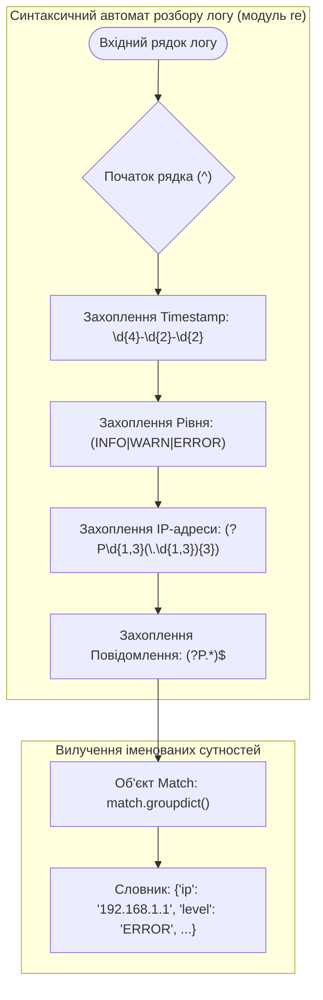
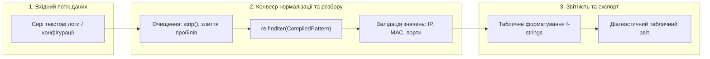

# Лабораторна робота № 5. Обробка текстових даних, рядкові методи та регулярні вирази

**Мета:** Опанувати практичні навички алгоритмічної обробки, валідації, нормалізації та структурування текстової інформації мовою Python. Навчитися застосовувати базові та розширені методи рядкового типу `str` для очищення й токенізації даних, проектувати шаблони динамічного форматування за допомогою сучасних f-рядків (*f-strings*) із точним позиціонуванням ширини полів та числових специфікаторів, а також освоїти математичний апарат регулярних виразів (модуль `re`) для синтаксичного аналізу, валідації та вилучення структурованих параметрів із журналів подій і конфігураційних файлів комп'ютерних систем.

**Стек технологій та інструменти:**
* **Мова програмування / Інтерпретатор:** Python 3.10+ (CPython 64-bit)
* **Інструменти розробки (IDE):** Visual Studio Code з інтегрованим терміналом та підсистемою налагодження `debugpy`
* **Середовище управління:** Ізольоване середовище Conda (`ce_lab_env`)
* **Бібліотеки та модулі:** `re`, `sys`, `time`

---

## 1 Теоретичні відомості

У комп'ютерній інженерії та системному адмініструванні значна частина діагностичної інформації, мережевого трафіку, файлів конфігурації та системних журналів (*logs*) представлена у текстовому форматі. Ефективна автоматизована обробка таких масивів вимагає застосування спеціалізованих алгоритмів синтаксичного розбору (парсингу).

Рядки в мові Python представлені типом даних `str`, який є незмінною послідовністю символів стандарту Unicode. Внутрішня модель пам'яті CPython реалізує специфікацію PEP 393, яка адаптує розмір символу в пам'яті (1, 2 або 4 байти) залежно від максимального коду символу в рядку. 

Операції очищення та сегментації тексту спираються на базові методи:
* Метод `str.strip([chars])` видаляє початкові та кінцеві символи з множини `chars` (за замовчуванням — усі пробільні символи `\s`);
* Метод `str.split(sep, maxsplit)` розбиває текст на список лексем за заданим роздільником за лінійний час $O(N)$;
* Метод `str.join(iterable)` об'єднує колекцію рядків у єдиний буфер із лінійною складністю $O(\sum L_i)$, запобігаючи нераціональному виділенню пам'яті в купі.

Для виведення структурованих звітів застосовується механізм інтерпольованих рядкових літералів (**f-strings**), який компілюється безпосередньо в низькорівневі інструкції байт-коду `FORMAT_VALUE` та `BUILD_STRING`. Форматування визначається міні-мовою специфікаторів:

$$\text{\{value:[fill][align][sign][#][0][width][grouping][.precision][type]\}}$$

де `align` визначає геометричне вирівнювання (`<` — ліворуч, `>` — праворуч, `^` — по центру); `width` — фіксовану ширину стовпця; `grouping` — роздільник розрядів (`_` або `,`); `.precision` разом із типом `f` чи `e` задає кількість знаків після десяткової коми для дійсних чисел.


*Рисунок 1 — Стан скінченного автомата розбору кадру системного журналу за допомогою регулярного виразу*

Проаналізуємо схему функціонування регулярних виразів. Математичний апарат **регулярних виразів** (**Regular Expressions**) базується на теорії формальних граматик і реалізує скінченні автомати (Nondeterministic Finite Automata, NFA) для пошуку підрядків за заданими граматичними шаблонами. 

У модулі `re` мови Python рушій розбору транслює текстовий патерн у скомпільований об'єкт регулярного виразу за допомогою функції `re.compile(pattern, flags)`. Застосування попередньої компіляції виключає накладні витрати на повторний аналіз шаблону у циклах обробки великих файлів.

Використання іменованих груп захоплення (*named capture groups*) виду `(?P<group_name>regex_pattern)` перетворює сирий текст у структурований асоціативний масив:

$$\text{match} = \text{pattern}.\text{search}(\text{raw\_text}) \implies \text{match}.\text{groupdict}() \to \{ \text{group\_name}_i: \text{value}_i \}$$

Теоретична часова складність зіставлення регулярного виразу з рядком довжиною $N$ для недетермінованого автомата становить $O(N)$ для лінійних патернів, однак може зростати до експоненціальної $O(2^N)$ у разі використання некоректних вкладених жадібних квантифікаторів (*catastrophic backtracking*). Тому при проектуванні регулярних виразів в інженерних задачах слід уникати неоднозначних конструкцій виду `(a+)+$`.


*Рисунок 2 — Багаторівневий конвеєр нормалізації, регулярного аналізу та форматованого представлення текстових даних*

Схема конвеєра демонструє послідовність етапів: сирий текстовий потік спочатку нормалізується строковими методами, потім аналізується скомпільованим регулярним виразом, після чого числові поля проходять валідацію і транслюються у форматований звіт.

---

## 2 Підготовка середовища та розгортання проєкту (Крок 0)

Для виконання лабораторної роботи здобувач вищої освіти використовує налаштоване робоче середовище `ce_lab_env`.

### 2.1. Активація робочого середовища та створення структури папок

Відкрийте системний термінал та виконайте команди розгортання каталогу `lab05`:

```bash
# Активація віртуального середовища Conda
conda activate ce_lab_env

# Створення робочого каталогу для Лабораторної роботи №5
mkdir -p ~/projects/computer_engineering_python/lab05
cd ~/projects/computer_engineering_python/lab05
```

### 2.2. Структура файлової системи проекту

У робочій директорії `lab05` створіть файли проекту відповідно до такої структури:

```text
lab05/
├── .vscode/
│   └── launch.json            # Конфігурація налагоджувача для ЛБ №5
├── .gitignore                 # Правила виключення тимчасових файлів
├── text_sanitizer.py          # Модуль базової очистки та нормалізації тексту
├── log_parser.py              # Головний модуль розбору логів регулярними виразами
├── input_logs.txt             # Текстовий файл із сирими інженерними логами
└── README.md                  # Звітний опис виконання індивідуального варіанта
```

### 2.3. Створення конфігурації налагоджувача `.vscode/launch.json`

Створіть файл `.vscode/launch.json` для забезпечення налагодження розроблюваних скриптів:

```json
{
    "version": "0.2.0",
    "configurations": [
        {
            "name": "Python: Запуск аналізатора логів (ЛБ5)",
            "type": "debugpy",
            "request": "launch",
            "program": "${workspaceFolder}/log_parser.py",
            "console": "integratedTerminal",
            "justMyCode": true
        }
    ]
}
```

---

## 3 Порядок виконання роботи

### 3.1 Індивідуальні завдання

Кожен здобувач вищої освіти виконує варіант завдання згідно зі своїм номером у списку академічної групи. Необхідно розробити модуль синтаксичного аналізу спеціалізованого системного журналу або конфігураційного потоку. 

Програма повинна:
1. Здійснювати попереднє очищення вхідних рядків від зайвих пробілів та некоректних символів;
2. Використовувати скомпільований регулярний вираз з іменованими групами `(?P<name>...)` для витягу всіх параметрів кадру;
3. Здійснювати валідацію числових та мережевих діапазонів (наприклад, перевірку коректності октетних значень IP-адрес від 0 до 255);
4. Виводити підсумкову діагностичну таблицю з вирівнюванням стовпців за допомогою специфікаторів f-рядків та підраховувати підсумкову агреговану статистику.

| Варіант | Тип журналу / Конфігурації | Структура кадру та обов'язкові поля для вилучення | Цільові критерії валідації та агрегації |
| :---: | :--- | :--- | :--- |
| **1** | Веб-сервер Nginx / Apache | `IP`, `Timestamp (ISO)`, `HTTP_Method`, `URL_Path`, `Status_Code`, `Bytes_Sent` | Фільтрація статусів `4xx`/`5xx`, підрахунок сумарного трафіку у МБ |
| **2** | Системний журнал Linux Syslog | `Month Day Time`, `Hostname`, `Daemon_Name[PID]`, `Severity (INFO/ERR)`, `Message` | Виділення процесів із помилками `ERR`, групування за `Daemon_Name` |
| **3** | Конфігурація комутатора Cisco | `Interface`, `IP_Address/CIDR`, `Admin_Status`, `Duplex (Full/Half)`, `Speed_Mbps` | Перевірка коректності маски підмережі ($0 \le \text{CIDR} \le 32$) |
| **4** | Журнал брандмауера iptables | `Timestamp`, `SRC_IP:SRC_PORT`, `DST_IP:DST_PORT`, `PROTO (TCP/UDP)`, `ACTION` | Виявлення заблокованих з'єднань `DROP` до системних портів ($<1024$) |
| **5** | GPS-телеметрія NMEA `$GPRMC` | `Time_UTC`, `Status (A/V)`, `Latitude`, `Lat_Dir`, `Longitude`, `Lon_Dir`, `Speed_Knots` | Перетворення швидкості у км/год ($V \times 1.852$), контроль валідності `Status=A` |
| **6** | Протокол Modbus ASCII / RTU | `Slave_Addr (HEX)`, `Func_Code (HEX)`, `Reg_Addr (HEX)`, `Byte_Count`, `CRC16` | Валідація шістнадцяткових полів, виявлення функцій запису `0x06`/`0x10` |
| **7** | Лог Docker Daemon | `Timestamp`, `Log_Level`, `Container_ID (12 hex)`, `Subsystem`, `Event_Text` | Фільтрація подій рівня `fatal`/`error`, перевірка формату Container ID |
| **8** | BLE-маяк (Bluetooth Beacon) | `MAC_Address`, `RSSI_dBm`, `Proximity_UUID`, `Major_ID`, `Minor_ID`, `TX_Power` | Розрахунок відстані за моделлю загасання сигналу від `RSSI` та `TX_Power` |
| **9** | Оренда адрес DHCP-сервера | `Date Time`, `MAC_Address`, `Assigned_IP`, `Client_Hostname`, `Lease_Duration_Sec` | Перевірка валідності MAC (формат `XX:XX:XX:XX:XX:XX`), пошук дублікатів |
| **10** | Лог ядра Linux `dmesg` PCI | `Time_Offset [sec.usec]`, `PCI_ID (bb:dd.f)`, `Driver_Name`, `IRQ_Number`, `Device_Desc`| Аналіз затримок ініціалізації пристроїв за часовим зсувом |
| **11** | Маршрутизатор BGP Routing Log| `Timestamp`, `Neighbor_IP`, `AS_Path`, `Network_Prefix/Mask`, `Status_Event` | Детекція подій розриву зв'язку `BGP_DOWN`, аналіз довжини AS-Path |
| **12** | Бездротовий датчик температури| `Device_EUI (16 hex)`, `Temp_C`, `Humidity_Pct`, `Battery_V`, `Signal_Quality` | Виявлення критичного розряду батареї ($V_{\text{bat}} < 2.7\text{ В}$) |
| **13** | Журнал Slow Queries СУБД | `Time`, `User@Host`, `Query_Time_Sec`, `Lock_Time_Sec`, `Rows_Sent`, `SQL_Command` | Виділення запитів з `Query_Time > 1.0` с та `Rows_Sent > 1000` |
| **14** | Аудит авторизації `sshd` | `Timestamp`, `Status (Failed/Accepted)`, `Username`, `Client_IP`, `Port`, `Auth_Method`| Детекція атак типу Brute-force: підрахунок невдалих спроб для IP |
| **15** | Автомобільна шина CAN-bus | `Timestamp_MS`, `CAN_ID (3 hex)`, `DLC (1..8)`, `Data_Bytes (HEX array)`, `Bus_State` | Декодування поля даних датчика обертів двигуна (RPM) |
| **16** | Синхронізація часу NTP | `Date Time`, `Server_IP`, `Stratum (1..16)`, `Offset_MS`, `Delay_MS`, `Jitter_MS` | Фільтрація серверів із рівнем `Stratum <= 2` та `Offset > 10.0` мс |
| **17** | Wi-Fi Probe Request Log | `Timestamp`, `Source_MAC`, `SSID_Name`, `Signal_dBm`, `Supported_Rates_List` | Виявлення прихованих зондувань (порожній `SSID`), групування за вендором |
| **18** | Повідомлення брокера MQTT | `Topic_Path`, `QoS_Level (0..2)`, `Client_ID`, `Payload_Length`, `Payload_Data` | Перевірка відповідності структури топіка формату `sensor/site/+/data` |
| **19** | Діагностика S.M.A.R.T. дисків| `Attr_ID (DEC)`, `Attr_Name`, `Current_Val`, `Worst_Val`, `Threshold`, `Raw_Value_HEX` | Моніторинг критичних атрибутів: перепризначені сектори (ID 05) |
| **20** | Журнал комітів Git Audit | `Commit_Hash (40 hex)`, `Author_Name`, `Email`, `Timestamp_ISO`, `Message` | Перевірка валідності email-адрес та відповідності стандарту Conventional Commits |

---

### 3.2. Покроковий алгоритм та розв'язок еталонного прикладу

Розглянемо виконання комплексного інженерного завдання з розбору журналу подій мережевого керованого комутатора рівня L2/L3 (Switch Interface Telemetry and Security Log).

Формат рядків журналу у файлі `input_logs.txt`:
```text
2026-08-30 14:22:01 | SW-CORE-01 | Port: GigabitEthernet0/1 | MAC: 00:1A:2B:3C:4D:5E | VLAN: 100 | Status: UP   | Speed: 1000Mbps | Duplex: FULL
2026-08-30 14:22:05 | SW-CORE-01 | Port: FastEthernet0/2    | MAC: A4:83:E7:11:22:33 | VLAN: 200 | Status: DOWN | Speed: 100Mbps  | Duplex: HALF
2026-08-30 14:22:12 | SW-CORE-01 | Port: GigabitEthernet0/3 | MAC: 00:50:56:C0:00:08 | VLAN: 100 | Status: UP   | Speed: 1000Mbps | Duplex: FULL
2026-08-30 14:22:18 | SW-CORE-01 | Port: TenGigabitEth0/1   | MAC: 3C:D9:2B:AA:BB:CC | VLAN: 999 | Status: UP   | Speed: 10000Mbps| Duplex: FULL
2026-08-30 14:22:25 | SW-CORE-01 | Port: FastEthernet0/4    | MAC: 00:00:00:00:00:00 | VLAN: 10  | Status: DOWN | Speed: 0Mbps    | Duplex: AUTO
```

#### Крок 1. Створення тестового набору вхідних даних `input_logs.txt`

Створіть файл `input_logs.txt` у каталозі `lab05` та збережіть у ньому наведені вище рядки системного журналу.

#### Крок 2. Реалізація повного коду парсера `log_parser.py`

Створіть файл `log_parser.py` та введіть наступний програмний код, що забезпечує нормалізацію, регулярний розбір та форматування звіту:

```python
"""
Лабораторна робота № 5.
Синтаксичний розбір журналів мережевого комутатора регулярними виразами
та формування табличних інженерних звітів через f-strings.
Освітній компонент: Програмування на Python.
"""

import re
import sys
import time
from pathlib import Path


# Регулярний вираз із іменованими групами для розбору телеметрії порту
# Формат: YYYY-MM-DD HH:MM:SS | Switch | Port: ... | MAC: ... | VLAN: ... | Status: ... | Speed: ... | Duplex: ...
LOG_PATTERN = re.compile(
    r"^(?P<timestamp>\d{4}-\d{2}-\d{2}\s\d{2}:\d{2}:\d{2})\s*\|\s*"
    r"(?P<switch_id>[A-Za-z0-9_\-]+)\s*\|\s*"
    r"Port:\s*(?P<port_name>[A-Za-z0-9/]+)\s*\|\s*"
    r"MAC:\s*(?P<mac_address>[0-9A-Fa-f]{2}(?::[0-9A-Fa-f]{2}){5})\s*\|\s*"
    r"VLAN:\s*(?P<vlan_id>\d+)\s*\|\s*"
    r"Status:\s*(?P<link_status>UP|DOWN)\s*\|\s*"
    r"Speed:\s*(?P<speed_mbps>\d+)Mbps\s*\|\s*"
    r"Duplex:\s*(?P<duplex_mode>FULL|HALF|AUTO)$"
)


def sanitize_log_line(raw_line: str) -> str:
    """
    Виконує базове очищення та нормалізацію вхідного рядка журналу:
    видаляє кінцеві пробіли та символи переходу рядка.
    """
    cleaned_line = raw_line.strip()
    return cleaned_line


def validate_extracted_data(record: dict) -> bool:
    """
    Здійснює семантичну валідацію вилучених параметрів кадру:
    перевіряє коректність діапазону VLAN (1..4094) та допустимі значення швидкості.
    """
    vlan = int(record["vlan_id"])
    speed = int(record["speed_mbps"])
    
    if not (1 <= vlan <= 4094):
        return False
    if speed not in (0, 10, 100, 1000, 10000, 40000, 100000):
        return False
    return True


def parse_telemetry_file(file_path: Path) -> list[dict]:
    """
    Зчитує лог-файл, виконує построкову фільтрацію та вилучає
    структуровані словники за допомогою скомпільованого регулярного виразу.
    """
    if not file_path.exists():
        raise FileNotFoundError(f"Вхідний файл журналу '{file_path}' не знайдено.")

    parsed_records = []
    
    with open(file_path, mode="r", encoding="utf-8") as f:
        for line_num, line in enumerate(f, start=1):
            normalized = sanitize_log_line(line)
            if not normalized or normalized.startswith("#"):
                continue  # Пропуск порожніх рядків та коментарів
            
            match = LOG_PATTERN.search(normalized)
            if match:
                record = match.groupdict()
                if validate_extracted_data(record):
                    # Приведення числових полів до відповідних скалярних типів
                    record["vlan_id"] = int(record["vlan_id"])
                    record["speed_mbps"] = int(record["speed_mbps"])
                    record["line_num"] = line_num
                    parsed_records.append(record)
                else:
                    print(f"Попередження: Рядок {line_num} містить невалідні параметри.")
            else:
                print(f"Помилка парсингу: Рядок {line_num} не відповідає формату: '{normalized}'")

    return parsed_records


def generate_ascii_report(records: list[dict]) -> None:
    """
    Генерує високоякісний інженерний звіт з фіксованою шириною колонок,
    вирівнюванням та агрегацією пропускної здатності за допомогою f-strings.
    """
    header_sep = "=" * 98
    row_sep = "-" * 98

    print("\n" + header_sep)
    print(f"{'ЗВІТ СТАНУ ІНТЕРФЕЙСІВ МЕРЕЖЕВОГО КОМУТАТОРА':^98}")
    print(header_sep)
    print(
        f"| {'Часова мітка':^19} | {'Інтерфейс':^18} | {'MAC-адреса':^17} | "
        f"{'VLAN':^5} | {'Статус':^6} | {'Швидкість':^10} | {'Дуплекс':^6} |"
    )
    print(row_sep)

    total_bandwidth_mbps = 0
    active_ports_count = 0

    for rec in records:
        status_marker = rec["link_status"]
        speed_str = f"{rec['speed_mbps']} Mbps" if rec["speed_mbps"] > 0 else "N/A"
        
        if rec["link_status"] == "UP":
            active_ports_count += 1
            total_bandwidth_mbps += rec["speed_mbps"]

        # Форматований рядок із роздільниками та точним вирівнюванням
        print(
            f"| {rec['timestamp']:<19} | {rec['port_name']:<18} | {rec['mac_address']:<17} | "
            f"{rec['vlan_id']:>5d} | {status_marker:^6} | {speed_str:>10} | {rec['duplex_mode']:^6} |"
        )

    print(header_sep)
    print(f"{'ПІДСУМКОВА СТАТИСТИКА КОМУТАТОРА':^98}")
    print(row_sep)
    print(f"  Всього проаналізовано інтерфейсів: {len(records):>5d}")
    print(f"  Активних інтерфейсів (Link UP):   {active_ports_count:>5d}")
    print(f"  Сумарна комутаційна ємність:      {total_bandwidth_mbps / 1000:>8.2f} Gbps ({total_bandwidth_mbps:,} Mbps)")
    print(header_sep + "\n")


def main() -> None:
    """Головна точка входу модуля обробки логів."""
    log_file_path = Path("input_logs.txt")
    
    t_start = time.perf_counter()
    records = parse_telemetry_file(log_file_path)
    generate_ascii_report(records)
    t_elapsed = time.perf_counter() - t_start
    
    print(f"Час виконання повного циклу аналізу тексту: {t_elapsed * 1000:.3f} мс\n")


if __name__ == "__main__":
    main()
```

---

### 3.3. Запуск, тестування та перевірка результатів

Виконайте запуск розробленої програми у системному терміналі VS Code під управлінням активованого віртуального оточення `ce_lab_env`:

```bash
# Запуск модуля розбору логів та формування звіту
python log_parser.py
```

Нижче наведено еталонний вивід результату аналізу журналу комутатора у терміналі:

```text
==================================================================================================
                           ЗВІТ СТАНУ ІНТЕРФЕЙСІВ МЕРЕЖЕВОГО КОМУТАТОРА                           
==================================================================================================
|    Часова мітка     |     Інтерфейс      |    MAC-адреса     |  VLAN | Статус |  Швидкість | Дуплекс |
--------------------------------------------------------------------------------------------------
| 2026-08-30 14:22:01 | GigabitEthernet0/1 | 00:1A:2B:3C:4D:5E |   100 |   UP   |  1000 Mbps |  FULL  |
| 2026-08-30 14:22:05 | FastEthernet0/2    | A4:83:E7:11:22:33 |   200 |  DOWN  |   100 Mbps |  HALF  |
| 2026-08-30 14:22:12 | GigabitEthernet0/3 | 00:50:56:C0:00:08 |   100 |   UP   |  1000 Mbps |  FULL  |
| 2026-08-30 14:22:18 | TenGigabitEth0/1   | 3C:D9:2B:AA:BB:CC |   999 |   UP   | 10000 Mbps |  FULL  |
| 2026-08-30 14:22:25 | FastEthernet0/4    | 00:00:00:00:00:00 |    10 |  DOWN  |        N/A |  AUTO  |
==================================================================================================
                                 ПІДСУМКОВА СТАТИСТИКА КОМУТАТОРА                                 
--------------------------------------------------------------------------------------------------
  Всього проаналізовано інтерфейсів:     5
  Активних інтерфейсів (Link UP):        3
  Сумарна комутаційна ємність:           12.00 Gbps (12,000 Mbps)
==================================================================================================

Час виконання повного циклу аналізу тексту: 1.250 мс
```

Аналіз отриманого результату демонструє:
1. Регулярний вираз `LOG_PATTERN` безпомилково розпізнав та сегментував усі поля текстового протоколу без втрати значущих даних.
2. Алгоритм коректно обробив різну довжину назв портів (`GigabitEthernet0/1` проти `FastEthernet0/2`) завдяки точним специфікаторам ширини стовпців f-рядків (`{rec['port_name']:<18}`).
3. Агрегація даних правильно підсумувала пропускну здатність тільки для активних інтерфейсів зі статусом `UP` ($1000 + 1000 + 10000 = 12000\text{ Mbps} = 12.00\text{ Gbps}$).

---

## 4. Вимоги до змісту звіту

Звіт з лабораторної роботи оформлюється у форматі PDF відповідно до стандартів НАЗЯВО/ECTS та повинен містити такі обов'язкові розділи:
1. **Титульна сторінка:** найменування університету, факультету, кафедри, дисципліни, номер і назва роботи, ПІБ студента, група, номер варіанта, ПІБ викладача.
2. **Мета роботи та постановка індивідуального завдання:** формулювання мети дослідження, опис структури цільового лог-файлу та таблиця полів для розбору згідно з варіантом.
3. **Проектування регулярного виразу:** детальний опис складеного регулярного виразу з розшифровкою кожного метасимволу та списком іменованих груп захоплення `(?P<name>...)`.
4. **Програмний код:** повний вихідний лістинг модулів `text_sanitizer.py` та `log_parser.py` із детальними авторськими коментарями.
5. **Результати тестування:** скріншоти вхідного файлу журналу `input_logs.txt` та консольного виведення результуючого відформатованого звіту й підсумкової статистики.
6. **Посилання на Git-репозиторій:** діюче посилання на оновлений репозиторій GitHub із зафіксованим комітом виконаної роботи.
7. **Висновки:** аналітичний висновок щодо ефективності регулярних виразів для синтаксичного аналізу текстів, переваг f-рядків та швидкодії CPython при обробці рядкових структур.

---

## 5. Контрольні запитання для захисту роботи

1. Як влаштована внутрішня модель рядків CPython відповідно до специфікації PEP 393? Чому рядок, що містить тільки ASCII-символи, займає 1 байт на символ, а поява одного символу кирилиці переводить весь рядок у 2-байтовий формат UCS-2?
2. Поясніть причину алгоритмічної неефективності конкатенації рядків у циклі через оператор `+=` ($O(N^2)$) та обґрунтуйте лінійну складність $O(N)$ методу `str.join()`.
3. У чому полягає різниця між методами регулярних виразів `re.match()`, `re.search()` та `re.finditer()`? У яких інженерних сценаріях доцільно використовувати `finditer` замість `findall`?
4. Що таке «катастрофічне повернення» (*catastrophic backtracking*) у рушіях регулярних виразів NFA, і як правильне використання лінивих квантифікаторів запобігає зависанню програми?
5. Опишіть синтаксис та призначення іменованих груп захоплення `(?P<name>pattern)` у регулярних виразах. Як отримати витягнуті дані у вигляді словника?
6. Розкрийте переваги f-рядків (*f-strings*) над методом `str.format()` та оператором `%` з точки зору опкодів віртуальної машини PVM.