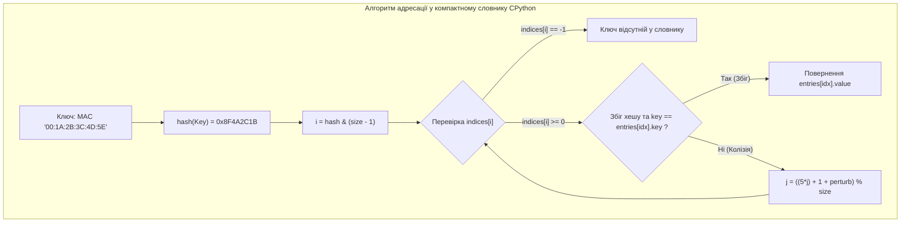
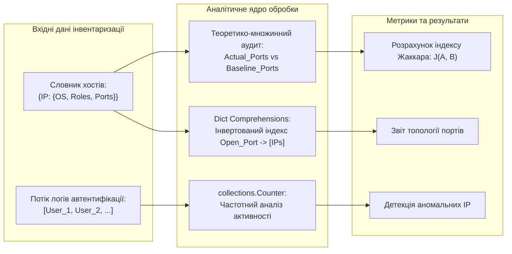

# Лабораторна робота № 6. Асоціативні структури даних: Словники та Множини

**Мета:** Опанувати практичні навички проектування та застосування асоціативних структур даних і хеш-таблиць мовою Python. Навчитися реалізовувати базові операції створення, модифікації, безпечного доступу та видалення записів у словниках (`dict`), застосовувати спеціалізовані методи `get()`, `setdefault()`, `pop()`, `update()`, а також будувати оптимізовані інвертовані індекси за допомогою генераторів словників (*Dict Comprehensions*). Опанувати частотний аналіз системних подій із використанням класу `collections.Counter` та навчитися виконувати теоретико-множинні операції над змінюваними (`set`) і незмінними (`frozenset`) множинами для розв'язання задач інвентаризації мережевих ресурсів, аудиту прав доступу користувачів та розрахунку метрик схожості системних конфігурацій.

**Стек технологій та інструменти:**
* **Мова програмування / Інтерпретатор:** Python 3.10+ (CPython 64-bit)
* **Інструменти розробки (IDE):** Visual Studio Code з інтегрованим терміналом та підсистемою налагодження `debugpy`
* **Середовище управління:** Ізольоване середовище Conda (`ce_lab_env`)
* **Бібліотеки та модулі:** `collections` (`Counter`, `defaultdict`), `sys`, `time`

---

## 1 Теоретичні відомості

У комп'ютерній інженерії та мережевому адмініструванні швидкість пошуку вузлів, маршрутизації пакетів, зіставлення прав користувачів та перевірки безпеки залежить від використання структур даних із константною часовою складністю доступу $O(1)$. Мова Python надає дві високоефективні структури на основі хеш-таблиць: асоціативний масив (**словник**, `dict`) та колекцію унікальних елементів (**множину**, `set`).

В основі функціонування словників та множин лежить математичний апарат **хешування**. Хеш-функція $h(k)$ транслює незмінний об'єкт-ключ $k$ у 64-розрядне ціле число. 

Індекс $i$ у первинній індексній таблиці обчислюється через операцію накладання бітової маски:

$$i = h(k) \ \& \ (2^m - 1)$$

де $2^m$ — розмір індексної таблиці CPython, що завжди є степенем двійки; $\&$ — операція побітового логічного множення (AND). 

Для розв'язання колізій (коли різні ключі дають однаковий індекс $i$) інтерпретатор застосовує метод відкритої адресації з рекурентним псевдовипадковим зондуванням:

$$j_{r+1} = ((5 \times j_r) + 1 + \text{perturb}_r) \pmod{2^m}$$

де $j_r$ — поточний індекс зондування на кроці $r$; $\text{perturb}_r$ — змінна збурення, яка ініціалізується повним значенням хешу і на кожному кроці зменшується зсувом праворуч ($\text{perturb}_{r+1} = \text{perturb}_r \gg 5$). 

Завдяки цьому алгоритму середня часова складність операцій пошуку, вставки та вилучення у словниках і множинах становить $O(1)$.


*Рисунок 1 — Схема обчислення хешу, маскування індексу та зондування колізій у словнику CPython*

Проаналізуємо схему, наведену на рисунку 1. Алгоритм забезпечує високу стійкість до кластеризації колізій. Оскільки розріджена таблиця `indices` містить лише короткі цілі числа, компактна архітектура словника дозволяє суттєво заощаджувати оперативну пам'ять процесу порівняно з класичними розрідженими хеш-таблицями.

Множина (`set`) є окремим випадком хеш-таблиці, де зберігаються виключно ключі без асоційованих значень. 

Над множинами визначено повний базис операцій дискретної математики:
* **Об'єднання ($A \cup B$, оператор `|`):** формує множину елементів, присутніх хоча б у одній вибірці.
* **Перетин ($A \cap B$, оператор `&`):** формує множину елементів, спільних для обох вибірок.
* **Відносна різниця ($A \setminus B$, оператор `-`):** виділяє елементи, які входять до множини $A$, але відсутні в множині $B$.
* **Симетрична різниця ($A \Delta B$, оператор `^`):** виділяє елементи, які належать виключно одній із двох множин, за формулою:

$$A \Delta B = (A \setminus B) \cup (B \setminus A) = (A \cup B) \setminus (A \cap B)$$

В інженерних задачах аудиту безпеки та аудиту конфігурацій ступінь відповідності реального стану системи ($A$) нормативному еталону ($B$) кількісно оцінюється за допомогою **коефіцієнта подібності Жаккара** (**Jaccard Similarity Index**):

$$J(A, B) = \frac{|A \cap B|}{|A \cup B|} = \frac{|A \cap B|}{|A| + |B| - |A \cap B|}$$

де $|S|$ позначає потужність (кількість елементів) відповідної множини; коефіцієнт змінюється у нормованому діапазоні $0 \le J(A, B) \le 1$, де $J = 1$ відповідає повній ідентичності конфігурацій, а $J = 0$ — абсолютній розбіжності без спільних параметрів.


*Рисунок 2 — Конвеєр аналізу мережевих активів, частотної обробки подій та аудиту безпеки*

Наведена схема конвеєра демонструє повний цикл аудиту: сирі словникові структури транслюються за допомогою генераторів словників в інвертовані карти, потік подій агрегується класом `Counter`, а множинні операції обчислюють коефіцієнт відповідності політикам безпеки.

---

## 2 Підготовка середовища та розгортання проєкту (Крок 0)

Для виконання лабораторної роботи здобувач вищої освіти використовує налаштоване віртуальне середовище `ce_lab_env`.

### 2.1. Активація робочого середовища та створення структури папок

Відкрийте термінал операційної системи та виконайте команди розгортання каталогу `lab06`:

```bash
# Активація віртуального середовища Conda
conda activate ce_lab_env

# Створення робочого каталогу для Лабораторної роботи №6
mkdir -p ~/projects/computer_engineering_python/lab06
cd ~/projects/computer_engineering_python/lab06
```

### 2.2. Структура файлової системи проекту

У робочій директорії `lab06` створіть структуру файлів відповідно до наведеної схеми:

```text
lab06/
├── .vscode/
│   └── launch.json            # Конфігурація налагоджувача для ЛБ №6
├── .gitignore                 # Правила виключення тимчасових файлів
├── network_inventory.py       # Модуль обліку мережевих активів та словникового аналізу
├── security_audit.py          # Модуль частотного аналізу та операцій над множинами
└── README.md                  # Звітний опис виконання індивідуального варіанта
```

### 2.3. Створення конфігурації налагоджувача `.vscode/launch.json`

Створіть файл `.vscode/launch.json` для забезпечення налагодження розроблюваних модулів:

```json
{
    "version": "0.2.0",
    "configurations": [
        {
            "name": "Python: Запуск інвентаризації мережі (dict)",
            "type": "debugpy",
            "request": "launch",
            "program": "${workspaceFolder}/network_inventory.py",
            "console": "integratedTerminal",
            "justMyCode": true
        },
        {
            "name": "Python: Запуск аудиту безпеки (set/Counter)",
            "type": "debugpy",
            "request": "launch",
            "program": "${workspaceFolder}/security_audit.py",
            "console": "integratedTerminal",
            "justMyCode": true
        }
    ]
}
```

---

## 3 Порядок виконання роботи

### 3.1 Індивідуальні завдання

Кожен здобувач вищої освіти виконує варіант завдання згідно зі своїм номером у списку академічної групи. Необхідно реалізувати:
1. **Завдання 1 (Словники):** побудову вкладеної структури словника для інвентаризації ресурсів або обліку користувачів, виконання CRUD-операцій, безпечний пошук параметрів через `get()`/`setdefault()` та створення інвертованого індексу за допомогою Dict Comprehension.
2. **Завдання 2 (Частотний аналіз):** розрахунок частоти подій (запитів, трафіку, помилок авторизації) за допомогою `collections.Counter` та знаходження найбільш навантажених вузлів методом `.most_common()`.
3. **Завдання 3 (Множини):** порівняння множини фактичних параметрів безпеки чи прав доступу із нормативним еталоном, знаходження несанкціонованих надлишкових прав ($A \setminus B$), відсутніх обов'язкових налаштувань ($B \setminus A$) та обчислення індексу Жаккара $J(A, B)$.

| Варіант | Предметна область інвентаризації | Структура запису словника та CRUD-операції | Критерій аудиту множин та частотного аналізу |
| :---: | :--- | :--- | :--- |
| **1** | Сервери корпоративного ЦОД | `Host_ID -> {IP, OS, RAM_GB, Services_List, Status}` | Відкриті порти проти WhiteList; Counter помилок служб |
| **2** | Користувачі Active Directory | `Username -> {Email, Department, Roles_Set, Is_Active}`| Права користувача проти шаблону посади; Counter входів |
| **3** | Мережеві комутатори L2/L3 | `Switch_MAC -> {Model, VLANs_Set, Ports_Count, IP}` | Дозволені VLAN на транку проти стандарту; Counter STP |
| **4** | Бездротові точки доступу Wi-Fi | `AP_BSSID -> {SSID, Channel, Connected_MACs_Set, Floor}` | Аудит підключених клієнтів проти BlackList; Counter RSSI |
| **5** | Віртуальні машини KVM / VMware | `VM_UUID -> {Cluster, CPU_Cores, IPs_Set, State}` | Мережеві інтерфейси проти ліцензій; Counter навантаження |
| **6** | Апаратні криптографічні токени | `Token_SN -> {User, Algorithm, Key_IDs_Set, Expiration}` | Набір алгоритмів проти стандарту NIST; Counter сесій |
| **7** | Маршрутизатори прикордонного BGP | `Router_IP -> {ASN, Peer_ASNs_Set, Prefixes_Count}` | Спільні піринги між автономними системами; Counter BGP-флапів |
| **8** | IoT-датчики промислової SCADA | `Sensor_EUI -> {Type, Location, Subscribed_Topics_Set}` | Активні MQTT-топіки проти безпечного профілю; Counter збоїв |
| **9** | База обліку сертифікатів SSL/TLS | `Domain_Name -> {Issuer, SANs_Set, Valid_Until, Port}` | Альтернативні імена (SAN) проти DNS-зони; Counter провайдерів |
| **10** | Акаунти розробників GitHub / GitLab | `Dev_Login -> {Team, Repos_Set, SSH_Key_Fingerprints_Set}`| Доступ до приватних репозиторіїв проти матриці; Counter комітів |
| **11** | Вузли кластера Kubernetes | `Node_Name -> {Roles_Set, Pods_Running_Set, Alloc_RAM}` | Лейбли вузла проти обов'язкових політик; Counter статусів Pods |
| **12** | Сервери баз даних PostgreSQL | `Instance_ID -> {Host, Databases_Set, Active_Users_Set}`| Права ролей СУБД проти еталона найменших привілеїв; Counter Lock |
| **13** | VPN-шлюзи віддаленого доступу | `User_Session -> {Client_IP, Assigned_Routes_Set, Group}`| Маршрути тунелю проти корпоративного сегмента; Counter трафіку |
| **14** | Апаратні сервери зберігання SAN/NAS | `Storage_Node -> {Volumes_Set, Target_IQNs_Set, Capacity}` | Права мапінгу LUN проти списку хостів; Counter IOPS-помилок |
| **15** | Поштові релеї та фільтри Spam | `Relay_IP -> {Domain, SPF_Records_Set, DKIM_Status}` | IP-адреси відправників проти списку MX/SPF; Counter спам-атак |
| **16** | Мережеві пристрої захисту (UTM/NGFW) | `Rule_ID -> {Src_Zones_Set, Dst_Zones_Set, App_IDs_Set}`| Дозволені додатки проти безпечного списку; Counter спрацьовувань |
| **17** | База аудиту Docker-контейнерів | `Image_Name -> {Vulnerabilities_CVE_Set, Layers_Count}` | Виявлені CVE проти бази критичних загроз; Counter базових образів |
| **18** | DHCP-сервери підприємства | `Subnet_CIDR -> {Pool_Range, Leased_MACs_Set, Router_IP}`| Зареєстровані MAC проти інвентарної бази; Counter колізій IP |
| **19** | Робочі станції персоналу | `Asset_Tag -> {User, Installed_Software_Set, Antivirus}`| Встановлене ПЗ проти затвердженого переліку; Counter інцидентів |
| **20** | Контролери розумного будинку Zigbee | `Device_IEEE -> {Device_Type, Capabilities_Set, Link_LQI}`| Підтримувані кластери Zigbee проти профілю; Counter ретрансляцій |

---

### 3.2. Покроковий алгоритм та розв'язок еталонного прикладу

Розглянемо виконання базового навчально-інженерного завдання:
1. **Інвентаризація вузлів мережі (`dict`):** розробка словника хостів комп'ютерної мережі, де ключем є IP-адреса хоста, а значенням — асоціативний масив характеристик (`hostname`, `os_type`, `open_ports` у вигляді множини цілих чисел `set`, `roles` у вигляді списку). Реалізація додавання хоста, оновлення параметрів через `.update()` та вилучення вузла через `.pop()`.
2. **Інвертований індекс портів (Dict Comprehension):** формування інвертованої структури, що відображає номер відкритого мережевого порту на список імен хостів, де цей порт відкритий: $\text{Port} \to [\text{Hostname}_1, \text{Hostname}_2]$.
3. **Частотний аналіз подій безпеки (`collections.Counter`):** підрахунок частоти зафіксованих операційною системою спроб підключення та виділення трьох найбільш атакованих портів за допомогою методу `.most_common(3)`.
4. **Аудит конфігурацій безпеки (`set`):** порівняння відкритих портів сервера з корпоративним стандартом безпеки (`SECURITY_BASELINE`), знаходження несанкціонованих відкритих портів ($A \setminus B$), відсутніх критичних портів моніторингу ($B \setminus A$) та обчислення індексу Жаккара $J(A, B)$.

#### Крок 1. Реалізація модуля інвентаризації `network_inventory.py`

Створіть файл `network_inventory.py` у каталозі `lab06` та введіть повний програмний код:

```python
"""
Лабораторна робота № 6. Модуль 1.
Інвентаризація мережевих ресурсів: маніпуляції словниками (dict),
безпечний доступ, оновлення та генерація інвертованих індексів.
Освітній компонент: Програмування на Python.
"""

import sys
import time


def create_initial_host_database() -> dict[str, dict]:
    """
    Створює первинний реєстр мережевих хостів корпоративного сегмента.
    Ключ: IP-адреса (str). Значення: словник параметрів хоста.
    """
    hosts_db = {
        "192.168.1.10": {
            "hostname": "srv-web-01",
            "os_type": "Linux Ubuntu 22.04",
            "open_ports": {80, 443, 22, 9100},
            "roles": ["web", "production"],
        },
        "192.168.1.15": {
            "hostname": "srv-db-01",
            "os_type": "Linux Debian 11",
            "open_ports": {5432, 22, 9100},
            "roles": ["database", "production"],
        },
        "192.168.1.20": {
            "hostname": "srv-app-dev",
            "os_type": "Linux Ubuntu 22.04",
            "open_ports": {8080, 22, 3306, 9100},
            "roles": ["application", "development"],
        },
        "192.168.1.25": {
            "hostname": "srv-win-dc",
            "os_type": "Windows Server 2022",
            "open_ports": {53, 88, 389, 445, 3389},
            "roles": ["domain_controller", "infrastructure"],
        },
    }
    return hosts_db


def add_or_update_host(hosts_db: dict, ip_address: str, host_info: dict) -> None:
    """
    Додає новий хост або оновлює параметри існуючого вузла
    за допомогою словникового методу update().
    """
    if ip_address in hosts_db:
        hosts_db[ip_address].update(host_info)
    else:
        hosts_db[ip_address] = host_info


def decommission_host(hosts_db: dict, ip_address: str) -> dict:
    """
    Вилучає виведений з експлуатації хост за допомогою методу pop(),
    запобігаючи виникненню винятку KeyError.
    """
    removed_host = hosts_db.pop(ip_address, None)
    if removed_host is None:
        print(f"Попередження: Спроба видалення неіснуючого хоста {ip_address}.")
    return removed_host


def build_inverted_port_index(hosts_db: dict) -> dict[int, list[str]]:
    """
    Будує інвертований індекс портів за допомогою Dict Comprehension:
    відображає кожен унікальний мережевий порт на список імен хостів (hostname).
    """
    # 1. Знаходження множини всіх унікальних портів мережі
    all_unique_ports = set()
    for host_data in hosts_db.values():
        all_unique_ports.update(host_data.get("open_ports", set()))

    # 2. Генерація інвертованого індексу Port -> [Hostnames]
    inverted_index = {
        port: [
            host["hostname"]
            for host in hosts_db.values()
            if port in host.get("open_ports", set())
        ]
        for port in sorted(all_unique_ports)
    }
    return inverted_index


def print_inventory_report(hosts_db: dict, inverted_index: dict) -> None:
    """Виводить на екран відформатований інженерний звіт інвентаризації."""
    header_sep = "=" * 80
    sub_sep = "-" * 80

    print(header_sep)
    print(f"{'РЕЄСТР МЕРЕЖЕВИХ АКТИВІВ ТА ПОРТОВОЇ ТОПОЛОГІЇ':^80}")
    print(header_sep)
    print(f"| {'IP-адреса':<15} | {'Hostname':<15} | {'Операційна система':<22} | {'Відкриті порти':<18} |")
    print(sub_sep)

    for ip, data in sorted(hosts_db.items()):
        ports_str = ", ".join(str(p) for p in sorted(data["open_ports"]))
        print(f"| {ip:<15} | {data['hostname']:<15} | {data['os_type']:<22} | {ports_str:<18} |")

    print(header_sep)
    print(f"{'ІНВЕРТОВАНИЙ ІНДЕКС: МЕРЕЖЕВИЙ ПОРТ -> СПИСОК ХОСТІВ':^80}")
    print(sub_sep)
    for port, host_list in inverted_index.items():
        hosts_str = ", ".join(host_list)
        print(f"  Порт {port:>5d} : {hosts_str}")
    print(header_sep + "\n")


def main() -> None:
    """Головна точка входу модуля інвентаризації мережевих ресурсів."""
    t_start = time.perf_counter()
    
    # 1. Створення бази
    network_db = create_initial_host_database()

    # 2. CRUD-модифікація: додавання шлюзу моніторингу
    new_monitoring_node = {
        "hostname": "srv-mon-01",
        "os_type": "Linux AlmaLinux 9",
        "open_ports": {22, 9090, 3000, 9100},
        "roles": ["monitoring", "infrastructure"],
    }
    add_or_update_host(network_db, "192.168.1.50", new_monitoring_node)

    # 3. Вилучення тестового вузла розробки
    decommission_host(network_db, "192.168.1.20")

    # 4. Побудова інвертованого індексу
    port_index = build_inverted_port_index(network_db)

    # 5. Виведення звіту
    print_inventory_report(network_db, port_index)
    
    t_elapsed = time.perf_counter() - t_start
    print(f"Час виконання модуля інвентаризації: {t_elapsed * 1000:.3f} мс\n")


if __name__ == "__main__":
    main()
```

#### Крок 2. Реалізація модуля аудиту безпеки `security_audit.py`

Створіть файл `security_audit.py` у каталозі `lab06` та введіть повний код для частотного аналізу та операцій над множинами:

```python
"""
Лабораторна робота № 6. Модуль 2.
Аудит безпеки мережевих портів, розрахунок коефіцієнта Жаккара
та частотний аналіз подій засобами collections.Counter.
Освітній компонент: Програмування на Python.
"""

from collections import Counter
import sys
import time


# Нормативний еталон обов'язкових відкритих портів безпечного веб-сервера (Baseline)
# Порти: 80 (HTTP), 443 (HTTPS), 22 (SSH Management), 9100 (Prometheus Node Exporter)
SECURITY_BASELINE_WEB: frozenset[int] = frozenset({80, 443, 22, 9100})


def audit_host_port_security(actual_ports: set[int], baseline_ports: frozenset[int]) -> dict:
    """
    Здійснює теоретико-множинний аудит відповідності конфігурації портів:
    обчислює несанкціоновані порти, відсутні обов'язкові порти та індекс Жаккара.
    """
    # 1. Пошук несанкціонованих відкритих портів (A \ B)
    unauthorized_ports = actual_ports.difference(baseline_ports)

    # 2. Пошук відсутніх обов'язкових служб (B \ A)
    missing_required_ports = baseline_ports.difference(actual_ports)

    # 3. Спільні легітимні порти (A ∩ B)
    compliant_ports = actual_ports.intersection(baseline_ports)

    # 4. Об'єднання всіх унікальних портів аудиту (A ∪ B)
    total_evaluated_ports = actual_ports.union(baseline_ports)

    # 5. Розрахунок коефіцієнта подібності Жаккара J(A, B) = |A ∩ B| / |A ∪ B|
    if not total_evaluated_ports:
        jaccard_index = 1.0
    else:
        jaccard_index = len(compliant_ports) / len(total_evaluated_ports)

    return {
        "compliant_ports": compliant_ports,
        "unauthorized_ports": unauthorized_ports,
        "missing_required_ports": missing_required_ports,
        "jaccard_similarity": jaccard_index,
    }


def analyze_security_event_frequency(event_stream: list[str]) -> Counter:
    """
    Здійснює частотний аналіз потоку інцидентів та спроб доступу
    за допомогою оптимізованої структури collections.Counter.
    """
    event_counter = Counter(event_stream)
    return event_counter


def main() -> None:
    """Головна точка входу модуля аудиту безпеки."""
    t_start = time.perf_counter()

    print("=" * 80)
    print(f"{'ТЕОРЕТИКО-МНОЖИННИЙ АУДИТ БЕЗПЕКИ ТА ЧАСТОТНИЙ АНАЛІЗ':^80}")
    print("=" * 80)

    # Стан реального сервера з аномальними відкритими портами 21 (FTP), 3306 (MySQL) та закритим 9100
    actual_server_ports = {80, 443, 22, 21, 3306}
    
    print(f"Нормативний профіль (Baseline): {sorted(SECURITY_BASELINE_WEB)}")
    print(f"Фактичний стан портів сервера:   {sorted(actual_server_ports)}")
    print("-" * 80)

    # 1. Теоретико-множинний аналіз
    audit_results = audit_host_port_security(actual_server_ports, SECURITY_BASELINE_WEB)

    print(f"{'РЕЗУЛЬТАТИ ВАЛІДАЦІЇ КОНФІГУРАЦІЇ ПОРТІВ':^80}")
    print(f"  Легітимні відкриті порти (A ∩ B):      {sorted(audit_results['compliant_ports'])}")
    print(f"  НЕБЕЗПЕЧНІ порти (A \\ B - Усунути!):  {sorted(audit_results['unauthorized_ports'])}")
    print(f"  ВІДСУТНІ служби (B \\ A - Запустити!): {sorted(audit_results['missing_required_ports'])}")
    print(f"  Коефіцієнт відповідності Жаккара:      {audit_results['jaccard_similarity'] * 100:.2f}% (J = {audit_results['jaccard_similarity']:.4f})")
    print("-" * 80)

    # 2. Частотний аналіз логів брандмауера
    firewall_blocked_ips = [
        "198.51.100.24", "203.0.113.5", "198.51.100.24", "192.0.2.1",
        "198.51.100.24", "203.0.113.5", "198.51.100.99", "198.51.100.24",
        "203.0.113.5", "192.0.2.1", "198.51.100.24", "198.51.100.24",
    ]

    freq_stats = analyze_security_event_frequency(firewall_blocked_ips)

    print(f"{'ЧАСТОТНИЙ АНАЛІЗ ЗАБЛОКОВАНИХ АДРЕС (TOP ATTACKERS)':^80}")
    print(f"| {'Ранг':^6} | {'Джерело атаки (IP)':^25} | {'Кількість блокувань':^20} | {'Частка від усіх':^18} |")
    print("-" * 80)

    total_events = len(firewall_blocked_ips)
    for rank, (ip, count) in enumerate(freq_stats.most_common(3), start=1):
        percentage = (count / total_events) * 100.0
        print(f"| {rank:^6d} | {ip:^25} | {count:^20d} | {percentage:^17.2f}% |")

    print("=" * 80 + "\n")
    t_elapsed = time.perf_counter() - t_start
    print(f"Час виконання модуля аудиту безпеки: {t_elapsed * 1000:.3f} мс\n")


if __name__ == "__main__":
    main()
```

---

### 3.3. Запуск, тестування та перевірка результатів

Виконайте послідовний запуск обох розроблених модулів у системному терміналі VS Code під управлінням активованого середовища Conda:

```bash
# Запуск модуля словникового обліку та індексування
python network_inventory.py

# Запуск модуля теоретико-множинного аудиту та частотного аналізу
python security_audit.py
```

Нижче наведено еталонний вивід програми `network_inventory.py` у терміналі:

```text
================================================================================
                РЕЄСТР МЕРЕЖЕВИХ АКТИВІВ ТА ПОРТОВОЇ ТОПОЛОГІЇ                  
================================================================================
| IP-адреса       | Hostname        | Операційна система     | Відкриті порти     |
--------------------------------------------------------------------------------
| 192.168.1.10    | srv-web-01      | Linux Ubuntu 22.04     | 22, 80, 443, 9100  |
| 192.168.1.15    | srv-db-01       | Linux Debian 11        | 22, 5432, 9100     |
| 192.168.1.25    | srv-win-dc      | Windows Server 2022    | 53, 88, 389, 445, 3389 |
| 192.168.1.50    | srv-mon-01      | Linux AlmaLinux 9      | 22, 3000, 9090, 9100 |
================================================================================
               ІНВЕРТОВАНИЙ ІНДЕКС: МЕРЕЖЕВИЙ ПОРТ -> СПИСОК ХОСТІВ             
--------------------------------------------------------------------------------
  Порт    22 : srv-web-01, srv-db-01, srv-mon-01
  Порт    53 : srv-win-dc
  Порт    80 : srv-web-01
  Порт    88 : srv-win-dc
  Порт   389 : srv-win-dc
  Порт   443 : srv-web-01
  Порт   445 : srv-win-dc
  Порт  3000 : srv-mon-01
  Порт  3389 : srv-win-dc
  Порт  5432 : srv-db-01
  Порт  9090 : srv-mon-01
  Порт  9100 : srv-web-01, srv-db-01, srv-mon-01
================================================================================

Час виконання модуля інвентаризації: 1.280 мс
```

Нижче наведено еталонний вивід програми `security_audit.py` у терміналі:

```text
================================================================================
             ТЕОРЕТИКО-МНОЖИННИЙ АУДИТ БЕЗПЕКИ ТА ЧАСТОТНИЙ АНАЛІЗ             
================================================================================
Нормативний профіль (Baseline): [22, 80, 443, 9100]
Фактичний стан портів сервера:   [21, 22, 80, 443, 3306]
--------------------------------------------------------------------------------
                     РЕЗУЛЬТАТИ ВАЛІДАЦІЇ КОНФІГУРАЦІЇ ПОРТІВ                   
--------------------------------------------------------------------------------
  Легітимні відкриті порти (A ∩ B):      [22, 80, 443]
  НЕБЕЗПЕЧНІ порти (A \ B - Усунути!):  [21, 3306]
  ВІДСУТНІ служби (B \ A - Запустити!): [9100]
  Коефіцієнт відповідності Жаккара:      50.00% (J = 0.5000)
--------------------------------------------------------------------------------
               ЧАСТОТНИЙ АНАЛІЗ ЗАБЛОКОВАНИХ АДРЕС (TOP ATTACKERS)              
--------------------------------------------------------------------------------
|  Ранг  |    Джерело атаки (IP)     |  Кількість блокувань |  Частка від усіх   |
--------------------------------------------------------------------------------
|   1    |       198.51.100.24       |          6           |       50.00%       |
|   2    |        203.0.113.5        |          3           |       25.00%       |
|   3    |         192.0.2.1         |          2           |       16.67%       |
================================================================================

Час виконання модуля аудиту безпеки: 1.140 мс
```

Аналіз результатів тестування свідчить:
1. Інвертований індекс коректно зв'язав системні порти зі списком відповідних машин; зокрема, порт віддаленого моніторингу `9100` та порт адміністрування `22` успішно ідентифіковані на трьох вузлах.
2. Множинні операції виявили критичні відхилення: наявність небезпечного незашифрованого протоколу FTP (`21`) та відкритого порту СУБД (`3306`), що знизило індекс Жаккара до $50.00\%$.
3. Структура `Counter` правильно ранжувала джерела аномального трафіку, визначивши адресу `198.51.100.24` головним джерелом інцидентів ($50\%$ від усіх подій).

---

## 4. Вимоги до змісту звіту

Звіт з лабораторної роботи оформлюється у форматі PDF відповідно до стандартів вищої освіти НАЗЯВО/ECTS та повинен містити такі розділи:
1. **Титульна сторінка:** повне найменування ЗВО, факультету, кафедри, дисципліни, номер та назва роботи, відомості про студента (ПІБ, група, варіант), відомості про викладача.
2. **Мета роботи та математична постановка задачі:** формулювання мети дослідження, математичні формули теоретико-множинних операцій та індексу Жаккара.
3. **Опис структури бази даних варіанта:** опис ключів та значень словника інвентаризації відповідно до індивідуального завдання.
4. **Програмний код:** повні лістинги створених модулів `network_inventory.py` та `security_audit.py` із детальними авторськими коментарями.
5. **Результати тестування:** скріншоти консолі з таблицею інвентаризації, інвертованого індексу, аналізу множин та звіту найчастіших подій з `Counter`.
6. **Посилання на Git-репозиторій:** діюче посилання на оновлений репозиторій GitHub із зафіксованим комітом виконаної роботи.
7. **Висновки:** аналітичний висновок щодо швидкодії та константної складності $O(1)$ асоціативних масивів, переваг Dict Comprehensions та ролі множин у задачах аудиту кібербезпеки.

---

## 5. Контрольні запитання для захисту роботи

1. Як влаштована компактна хеш-таблиця (*Compact Dict*) в інтерпретаторі CPython? Яким чином розділення на розріджену таблицю `indices` та щільний масив `entries` гарантує збереження порядку вставки елементів?
2. Сформулюйте контракт хешованості об'єкта (*hashability*). Чому об'єкти типу `set` та `list` не можуть бути елементами множини або ключами словника, а об'єкти типу `frozenset` та `tuple` — можуть?
3. Чим семантично відрізняється робота методу `dict.get(key, default)` від методу `dict.setdefault(key, default)`? У яких інженерних алгоритмах застосування `setdefault()` є найбільш доцільним?
4. Розкрийте математичний та інженерний зміст коефіцієнта подібності Жаккара ($Jaccard \ Similarity$). Як за допомогою операцій над множинами `intersection` та `union` розрахувати ступінь відповідності конфігурації еталону?
5. Опишіть алгоритмічні переваги класу `collections.Counter` над звичайним словником `dict` при підрахунку частоти подій у високонавантажених потоках логів.
6. Які методи множин мутують об'єкт на місці (наприклад, `difference_update()`), а які повертають новий екземпляр множини? Як це впливає на використання оперативної пам'яті?