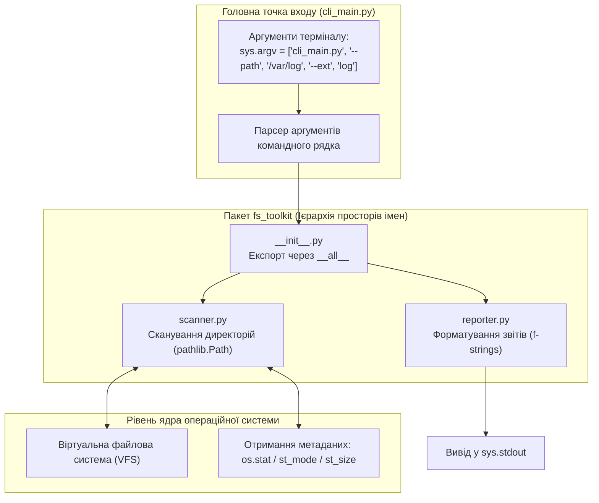
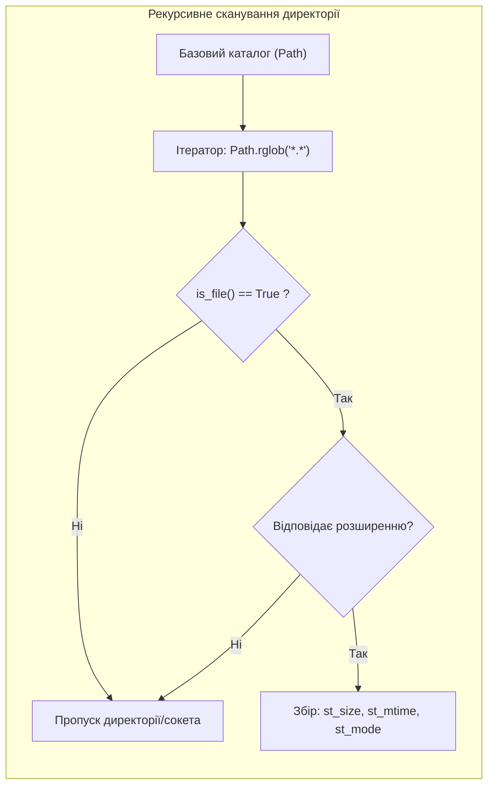

# Лабораторна робота № 8. Модульне програмування, створення пакетів та системні бібліотеки

**Мета:** Опанувати практичні навички проектування модульної архітектури програмного забезпечення мовою Python. Навчитися структурувати багатофайлові проекти у взаємопов'язані модулі та пакети з використанням файлів ініціалізації `__init__.py` і списків експорту `__all__`, організовувати автономні точки входу за допомогою ідіоми `if __name__ == '__main__':`, маніпулювати параметрами пошуку інтерпретатора у списку `sys.path`. Опанувати обробку параметрів командного рядка через список `sys.argv`, а також розробити системні консольні утиліти (CLI) для автоматизованого сканування, аналізу прав доступу та аудиту дискового простору файлової системи за допомогою модулів `sys`, `os` та `pathlib`.

**Стек технологій та інструменти:**
* **Мова програмування / Інтерпретатор:** Python 3.10+ (CPython 64-bit)
* **Інструменти розробки (IDE):** Visual Studio Code з інтегрованим терміналом та підсистемою налагодження `debugpy`
* **Середовище управління:** Ізольоване середовище Conda (`ce_lab_env`)
* **Бібліотеки та модулі:** `sys`, `os`, `pathlib`, `time`

---

## 1 Теоретичні відомості

У комп'ютерній інженерії розробка надійних системних утиліт та сервісів автоматизації спирається на принципи модульності кодової бази. Модульна архітектура забезпечує логічне розмежування рівнів абстракції: відокремлення підсистем збору системних метрик від інтерфейсів користувацького введення та модулів генерації звітів.

Модулем у мові Python є будь-який файл із розширенням `.py`, який містить декларації функцій, класів та виконувані інструкції. Пакет являє собою каталог файлової системи, який містить обов'язковий ініціалізаційний файл `__init__.py` та об'єднує групу логічно пов'язаних модулів. 

При імпортуванні пакета інтерпретатор CPython виконує файл `__init__.py`, який формує публічний фасад бібліотеки та регламентує перелік доступних імен за допомогою службового списку `__all__`:

$$\text{\_\_all\_\_} = [\text{"PublicEntity}_1\text{", "PublicEntity}_2\text{",} \dots, \text{"PublicEntity}_n\text{"]}$$

Якщо список `__all__` визначено, інструкція масового імпорту `from package import *` експортує виключно задекларовані в ньому ідентифікатори, надійно приховуючи внутрішні утилітарні функції та проміжні змінні.

Пошук модулів здійснюється інтерпретатором шляхом послідовного сканування директорій, перерахованих у системному списку `sys.path`:

$$\text{sys.path} = [\text{Dir}_{\text{entry\_script}}, \; \text{Env}_{\text{PYTHONPATH}}, \; \text{StdLib}_{\text{core}}, \; \text{SitePackages}_{\text{active\_env}}]$$

де $\text{Dir}_{\text{entry\_script}}$ — шлях до каталогу головного запущеного файлу; $\text{Env}_{\text{PYTHONPATH}}$ — шляхи з системної змінної середовища; $\text{StdLib}_{\text{core}}$ — шлях до стандартної бібліотеки Python; $\text{SitePackages}_{\text{active\_env}}$ — директорія сторонніх пакетів активованого середовища Conda.


*Рисунок 1 — Архітектурна схема модульної CLI-утиліти з розподілом обов'язків між пакетом та точкою входу*

Проаналізуємо схему взаємодії компонентів, наведену на рисунку 1. Головний модуль `cli_main.py` аналізує вектор аргументів `sys.argv`, виконує валідацію вхідних прапорців і делегує обчислювальні задачі внутрішнім модулям пакета `fs_toolkit`.

Взаємодія з файловою системою реалізується за допомогою сучасного об'єктно-орієнтованого модуля `pathlib`. Клас `pathlib.Path` інкапсулює системні виклики операційної системи, замінюючи низькорівневу маніпуляцію рядками на роботу з поліморфними об'єктами шляхів. 

Рекурсивний обхід дерева каталогів виконується методом `Path.rglob(pattern)`. Теоретична часова складність повного обходу файлового дерева описується лінійною залежністю від кількості вузлів графа файлової системи:

$$T_{\text{scan}}(V, E) = O(|V| + |E|)$$

де $V$ — множина директорій і файлів; $E$ — множина зв'язків між батьківськими та дочірніми каталогами. 

Сумарний дисковий простір $S_{\text{total}}$, зайнятий вибіркою з $M$ знайдених файлів, обчислюється як сума їхніх фізичних розмірів у байтах:

$$S_{\text{total}} = \sum_{k=1}^{M} \text{size}(f_k) = \sum_{k=1}^{M} f_k.\text{stat}().\text{st\_size}$$

де $\text{size}(f_k)$ — розмір $k$-го файлу в байтах, отриманий зі структури метаданих індексного дескриптора ядра ОС (*inode*).

Перевірка прав доступу до файлових об'єктів базується на бітовій масці режиму доступу POSIX `st_mode`:

$$\text{Permissions} = \text{stat\_result}.\text{st\_mode} \ \& \ 0\text{o}777$$

де бітове маскування з вісімковим числом $0\text{o}777$ виділяє 9 молодших бітів прав доступу (читання `r`, запис `w`, виконання `x` для власника, групи та інших користувачів).


*Рисунок 2 — Конвеєр фільтрації та вилучення метаданих файлових об'єктів*

Схема конвеєра демонструє послідовність фільтрації: кожен вузол файлового дерева верифікується на відповідність типу звичайного файлу, перевіряється за маскою розширення, після чого його фізичні атрибути передаються до підсистеми генерації звітів.

---

## 2 Підготовка середовища та розгортання проєкту (Крок 0)

Для виконання лабораторної роботи здобувач вищої освіти використовує налаштоване робоче середовище `ce_lab_env`.

### 2.1. Активація робочого середовища та створення структури папок

Відкрийте системний термінал та виконайте команди розгортання структури каталогу `lab08`:

```bash
# Активація віртуального середовища Conda
conda activate ce_lab_env

# Створення кореневого каталогу проекту Лабораторної роботи №8
mkdir -p ~/projects/computer_engineering_python/lab08
cd ~/projects/computer_engineering_python/lab08
```

### 2.2. Структура файлової системи проекту

Створіть багатофайлову структуру пакетів та тестових файлів відповідно до наведеної схеми:

```text
lab08/
├── .vscode/
│   └── launch.json            # Конфігурація налагоджувача з передачею CLI-аргументів
├── .gitignore                 # Правила виключення тимчасових файлів
├── cli_main.py                # Головний модуль-точка входу (CLI Dispatcher)
├── fs_toolkit/                # Користувацький пакет інженерних системних утиліт
│   ├── __init__.py            # Ініціалізація пакета та експорт публічного API
│   ├── scanner.py             # Модуль сканування та аналізу метаданих файлів
│   └── reporter.py            # Модуль форматування та табличного виведення
├── test_sandbox/              # Тестова пісочниця з файлами різного розміру та типу
│   ├── system.log             # Тестовий лог-файл (розмір > 0)
│   ├── firmware.bin           # Тестовий бінарний файл
│   ├── config.json            # Конфігураційний файл
│   └── nested_dir/            # Вкладена директорія для перевірки рекурсії
│       └── app_dump.log       # Вкладений лог-файл
└── README.md                  # Звітний опис виконання індивідуального варіанта
```

### 2.3. Створення конфігурації налагоджувача `.vscode/launch.json`

Створіть файл `.vscode/launch.json`, налаштувавши запуск скрипта з тестовими параметрами командного рядка:

```json
{
    "version": "0.2.0",
    "configurations": [
        {
            "name": "Python: Запуск CLI-утиліти з аргументами (ЛБ8)",
            "type": "debugpy",
            "request": "launch",
            "program": "${workspaceFolder}/cli_main.py",
            "args": [
                "--path", "${workspaceFolder}/test_sandbox",
                "--ext", "log",
                "--min-size-kb", "0"
            ],
            "console": "integratedTerminal",
            "justMyCode": true
        }
    ]
}
```

---

## 3 Порядок виконання роботи

### 3.1 Індивідуальні завдання

Кожен здобувач вищої освіти розробляє автономну консольну CLI-утиліту на базі пакета `fs_toolkit` відповідно до індивідуального варіанта. 

Вимоги до реалізації:
1. Обов'язкова наявність пакета з модулями `scanner.py` (бізнес-логіка аналізу) та `reporter.py` (генерація звіту), об'єднаних через `fs_toolkit/__init__.py` із заповненим списком `__all__`.
2. Головний модуль `cli_main.py` повинен здійснювати ручний розбір списку параметрів `sys.argv` без використання сторонніх бібліотек, підтримувати прапорець виведення довідки `--help` та коректно завершувати процес через `sys.exit(code)`.
3. Використання виключно об'єктного інтерфейсу `pathlib.Path` для обходу файлової системи та вилучення метаданих.

| Варіант | Назва розроблюваної CLI-утиліти | Параметри командного рядка (`sys.argv`) | Специфікація пошуку, критерій фільтрації та звіт |
| :---: | :--- | :--- | :--- |
| **1** | Аудитор лог-файлів (`log_auditor`) | `--path <dir> --ext <ext> --min-size-kb <n>` | Рекурсивний пошук логів; фільтрація за мінімальним розміром у КБ |
| **2** | Детектор порожніх папок (`empty_dir_cleaner`)| `--path <dir> --dry-run` | Рекурсивний пошук директорій без файлів; імітація безпечного видалення |
| **3** | Аудитор прав доступу (`perm_checker`) | `--path <dir> --mask <octal_mode>` | Знаходження файлів із небезпечними правами (наприклад, `0o777` чи `0o666`) |
| **4** | Аналізатор дублікатів за розміром (`size_dup`)| `--path <dir> --min-size-mb <n>` | Групування файлів з однаковим точним розміром у байтах для пошуку дублів |
| **5** | Монітор застарілих файлів (`age_scanner`) | `--path <dir> --days <n>` | Пошук файлів, час модифікації яких перевищує $N$ днів від поточного часу |
| **6** | Калькулятор дискової квоти (`disk_quota`) | `--path <dir> --threshold-mb <n>` | Розрахунок загального обсягу кожної піддиректорії; виділення переповнених |
| **7** | Сканер бінарних файлів (`bin_inspector`) | `--path <dir> --magic <hex_signature>` | Перевірка перших 4 байтів файлів на збіг із сигнатурою (наприклад, ELF `7F454C46`)|
| **8** | Очищувач тимчасових кешів (`cache_purge`)| `--path <dir> --pattern <glob>` | Пошук та підрахунок розміру тимчасових файлів (`*.tmp`, `__pycache__`, `*.bak`) |
| **9** | Генератор маніфесту файлів (`manifest_gen`)| `--path <dir> --output-format <text/csv>` | Складання повного реєстру файлів з розміром, датою створення та правами |
| **10** | Аналізатор розширень файлів (`ext_stat`) | `--path <dir> --top <n>` | Підрахунок кількості та сумарного обсягу пам'яті для кожного розширення |
| **11** | Детектор прихованих файлів (`hidden_finder`)| `--path <dir> --include-system` | Пошук прихованих файлів (починаються з `.`) та аналіз їхніх атрибутів |
| **12** | Аудитор глибини вкладеності (`depth_audit`)| `--path <dir> --max-depth <n>` | Виявлення файлів і папок, рівень вкладеності яких перевищує поріг $N$ |
| **13** | Сканер великих файлів (`large_file_finder`)| `--path <dir> --limit-mb <n> --sort-desc`| Пошук та виведення $N$ найбільших файлів у директорії у порядку спадання |
| **14** | Перевірка довжини імен файлів (`long_name`)| `--path <dir> --max-len <n>` | Пошук файлів, довжина імені яких порушує обмеження сумісності ОС ($>N$ симв.)|
| **15** | Аудитор символьних посилань (`symlink_audit`)| `--path <dir> --broken-only` | Виявлення «битих» символьних посилань, цільові файли яких видалено |
| **16** | Детектор файлів без розширень (`no_ext_scan`)| `--path <dir> --min-bytes <n>` | Виявлення системних скриптів та бінарників без стандартних розширень |
| **17** | Очищувач порожніх файлів (`zero_byte_clean`)| `--path <dir> --report-only` | Пошук файлів із нульовим розміром (`st_size == 0`) та оцінка фрагментації |
| **18** | Аналізатор структури коду (`source_stat`) | `--path <dir> --ext-list <py,c,h,cpp>` | Підрахунок кількості файлів вихідного коду та загального обсягу в КБ |
| **19** | Валідатор читабельності файлів (`read_tester`)| `--path <dir> --timeout-sec <n>` | Спроба відкриття файлів для виявлення заблокованих процесами або пошкоджених|
| **20** | Сканер модифікацій за добу (`daily_mod_scan`)| `--path <dir> --hours <24>` | Пошук усіх файлів, змінених за останні $N$ годин для створення резервної копії |

---

### 3.2. Покроковий алгоритм та розв'язок еталонного прикладу

Розглянемо базовий інженерний приклад побудови консольної CLI-утиліти аудиту дискового сховища системних логів `log_storage_auditor`.

Функціональні вимоги до еталонного проекту:
1. Модуль `fs_toolkit/scanner.py` виконує рекурсивний пошук файлів за допомогою `pathlib.Path.rglob()`, фільтрує файли за заданим розширенням, перевіряє мінімальний розмір та вилучає час останньої модифікації й права доступу.
2. Модуль `fs_toolkit/reporter.py` форматує результати сканування у вигляді структурованої таблиці засобами f-рядків та розраховує підсумкові суми.
3. Файл `fs_toolkit/__init__.py` декларує публічний інтерфейс через `__all__`.
4. Головний модуль `cli_main.py` здійснює розбір списку аргументів командного рядка `sys.argv` (підтримуючи прапорці `--path`, `--ext`, `--min-size-kb` та `--help`), запускає процес сканування і коректно передає статус завершення операційній системі.

#### Крок 1. Створення модуля сканування `fs_toolkit/scanner.py`

Створіть каталог `fs_toolkit` та файл `fs_toolkit/scanner.py` у ньому:

```python
"""
Модуль сканування файлової системи та аналізу метаданих файлів.
Освітній компонент: Програмування на Python.
"""

import os
import time
from pathlib import Path


def scan_directory_tree(base_path: Path, target_ext: str, min_size_bytes: int = 0) -> list[dict]:
    """
    Виконує рекурсивне сканування базової директорії, знаходить файли
    із вказаним розширенням та розміром не менше min_size_bytes.
    Повертає список словників зі структурованими метаданими.
    """
    if not base_path.exists() or not base_path.is_dir():
        raise ValueError(f"Шлях '{base_path}' не існує або не є директорією.")

    normalized_ext = f".{target_ext.lstrip('.')}" if target_ext else ""
    matched_files = []

    # Рекурсивний обхід усіх вузлів файлової системи
    for item in base_path.rglob("*"):
        if item.is_file():
            # Перевірка фільтра розширення
            if normalized_ext and item.suffix.lower() != normalized_ext.lower():
                continue

            try:
                stat_res = item.stat()
                file_size = stat_res.st_size

                # Фільтрація за мінімальним розміром
                if file_size >= min_size_bytes:
                    # Отримання вісімкової маски прав доступу (POSIX permissions)
                    octal_permissions = oct(stat_res.st_mode & 0o777)
                    modification_time = time.strftime(
                        "%Y-%m-%d %H:%M:%S", time.localtime(stat_res.st_mtime)
                    )

                    file_record = {
                        "path": item,
                        "relative_path": item.relative_to(base_path),
                        "size_bytes": file_size,
                        "size_kb": file_size / 1024.0,
                        "modified_at": modification_time,
                        "permissions": octal_permissions,
                    }
                    matched_files.append(file_record)

            except (PermissionError, OSError) as err:
                print(f"Попередження системи: Немає доступу до файлу '{item}': {err}")
                continue

    return matched_files
```

#### Крок 2. Створення модуля генерації звітів `fs_toolkit/reporter.py`

Створіть файл `fs_toolkit/reporter.py`:

```python
"""
Модуль форматування та консольного виведення результатів аудиту файлової системи.
Освітній компонент: Програмування на Python.
"""

from typing import List, Dict


def print_audit_report(file_records: List[Dict], target_ext: str, search_root: str) -> None:
    """
    Генерує вирівняний інженерний табличний звіт про результати аудиту
    файлів із підрахунком сумарного обсягу пам'яті.
    """
    header_sep = "=" * 92
    row_sep = "-" * 92

    print("\n" + header_sep)
    print(f"{'ЗВІТ СИСТЕМНОГО АУДИТУ ДИСКОВОГО ПРОСТОРУ ТА ФАЙЛІВ':^92}")
    print(header_sep)
    print(f"Базова директорія пошуку: {search_root}")
    print(f"Цільове розширення файлів: {target_ext if target_ext else 'Всі розширення (*.*)'}")
    print(row_sep)
    print(
        f"| {'№':^4} | {'Відносний шлях файлу':<36} | "
        f"{'Розмір (КБ)':^12} | {'Дата модифікації':^19} | {'Права':^7} |"
    )
    print(row_sep)

    total_bytes = 0

    for idx, rec in enumerate(file_records, start=1):
        total_bytes += rec["size_bytes"]
        rel_path_str = str(rec["relative_path"])
        # Обрізання занадто довгих шляхів для збереження геометрії таблиці
        if len(rel_path_str) > 36:
            rel_path_str = f"...{rel_path_str[-33:]}"

        print(
            f"| {idx:^4d} | {rel_path_str:<36} | "
            f"{rec['size_kb']:>10.2f} КБ | {rec['modified_at']:^19} | {rec['permissions']:^7} |"
        )

    print(header_sep)
    total_kb = total_bytes / 1024.0
    total_mb = total_kb / 1024.0
    print(f"{'ПІДСУМКОВА ДИСКОВА СТАТИСТИКА':^92}")
    print(row_sep)
    print(f"  Всього знайдено відповідних файлів: {len(file_records):>6d}")
    print(f"  Сумарний фізичний обсяг вибірки:    {total_kb:>10.2f} КБ ({total_mb:.4f} МБ)")
    print(header_sep + "\n")
```

#### Крок 3. Створення файлу ініціалізації пакета `fs_toolkit/__init__.py`

Створіть файл `fs_toolkit/__init__.py` для експорту публічного API:

```python
"""
Пакет системних утиліт обробки та аудиту файлової системи fs_toolkit.
Освітній компонент: Програмування на Python.
"""

from .scanner import scan_directory_tree
from .reporter import print_audit_report

# Суворий експорт публічного інтерфейсу пакета
__all__ = [
    "scan_directory_tree",
    "print_audit_report",
]
```

#### Крок 4. Реалізація модуля-точки входу `cli_main.py`

Створіть файл `cli_main.py` у корені каталогу `lab08`:

```python
"""
Головна точка входу консольної утиліти аудиту файлової системи.
Здійснює розбір параметрів командного рядка sys.argv та диспетчеризацію завдань.
Освітній компонент: Програмування на Python.
"""

import sys
import time
from pathlib import Path

# Імпорт публічного інтерфейсу з власного пакета fs_toolkit
from fs_toolkit import scan_directory_tree, print_audit_report


def print_usage_help() -> None:
    """Виводить інструкцію з використання утиліти командного рядка."""
    usage_text = """
ВИКОРИСТАННЯ:
    python cli_main.py --path <каталог> [--ext <розширення>] [--min-size-kb <розмір>]

ПАРАМЕТРИ:
    --path        : (Обов'язковий) Абсолютний або відносний шлях до цільового каталогу.
    --ext         : (Опціональний) Фільтр розширення файлів (наприклад, log, bin, txt).
    --min-size-kb : (Опціональний) Мінімальний розмір файлу в кілобайтах (за замовчуванням: 0).
    --help, -h    : Виведення цієї інформаційної довідки.

ПРИКЛАДИ:
    python cli_main.py --path ./test_sandbox --ext log --min-size-kb 1
    python cli_main.py --path /var/log --ext log
"""
    print(usage_text)


def parse_cli_arguments(args_list: list[str]) -> dict:
    """
    Здійснює ручний розбір списку аргументів командного рядка sys.argv.
    Повертає словник виділених параметрів конфігурації.
    """
    config = {
        "path": None,
        "ext": "",
        "min_size_kb": 0.0,
    }

    if "--help" in args_list or "-h" in args_list or len(args_list) <= 1:
        print_usage_help()
        sys.exit(0)

    i = 1
    while i < len(args_list):
        arg = args_list[i]

        if arg == "--path":
            if i + 1 < len(args_list):
                config["path"] = Path(args_list[i + 1]).resolve()
                i += 2
            else:
                print("Помилка синтаксису: Після прапорця '--path' необхідно вказати шлях до каталогу.")
                sys.exit(1)

        elif arg == "--ext":
            if i + 1 < len(args_list):
                config["ext"] = args_list[i + 1].strip()
                i += 2
            else:
                print("Помилка синтаксису: Після прапорця '--ext' необхідно вказати розширення.")
                sys.exit(1)

        elif arg == "--min-size-kb":
            if i + 1 < len(args_list):
                try:
                    config["min_size_kb"] = float(args_list[i + 1])
                    i += 2
                except ValueError:
                    print("Помилка значення: Параметр '--min-size-kb' повинен бути числовим значенням.")
                    sys.exit(1)
            else:
                print("Помилка синтаксису: Після '--min-size-kb' необхідно вказати числове значення.")
                sys.exit(1)
        else:
            print(f"Помилка: Невідомий параметр командного рядка '{arg}'.")
            print_usage_help()
            sys.exit(1)

    if config["path"] is None:
        print("Помилка: Обов'язковий параметр '--path' не вказано.")
        print_usage_help()
        sys.exit(1)

    return config


def main() -> None:
    """Головна функція диспетчеризації CLI-утиліти."""
    # 1. Розбір вхідних параметрів командного рядка
    cli_config = parse_cli_arguments(sys.argv)

    target_directory = cli_config["path"]
    extension_filter = cli_config["ext"]
    min_bytes_threshold = int(cli_config["min_size_kb"] * 1024)

    t_start = time.perf_counter()

    # 2. Виконання сканування файлової системи за допомогою пакета
    try:
        results = scan_directory_tree(
            base_path=target_directory,
            target_ext=extension_filter,
            min_size_bytes=min_bytes_threshold,
        )
    except ValueError as val_err:
        print(f"Помилка аргументів: {val_err}")
        sys.exit(2)
    except Exception as general_err:
        print(f"Критичний збій виконання аудиту: {general_err}")
        sys.exit(3)

    # 3. Формування та друк звіту
    print_audit_report(results, extension_filter, str(target_directory))

    t_elapsed = time.perf_counter() - t_start
    print(f"Операцію аудиту успішно завершено за {t_elapsed * 1000:.3f} мс.")
    sys.exit(0)


if __name__ == "__main__":
    main()
```

#### Крок 5. Створення тестових даних у каталозі `test_sandbox`

Створіть тестові файли для верифікації роботи утиліти за допомогою команд термінала:

```bash
mkdir -p test_sandbox/nested_dir
# Створення тестових лог-файлів та бінарників різного розміру
echo "2026-08-30 System started successfully" > test_sandbox/system.log
echo "2026-08-30 Warning: low disk space on /dev/sda1" >> test_sandbox/system.log
echo "ELF_DUMMY_BINARY_DATA_PAYLOAD_STREAM_BUFFER" > test_sandbox/firmware.bin
echo '{"status": "active", "port": 8080}' > test_sandbox/config.json
echo "2026-08-30 Application memory dump core" > test_sandbox/nested_dir/app_dump.log
```

---

### 3.3. Запуск, тестування та перевірка результатів

Виконайте запуск розробленої CLI-утиліти з різними наборами параметрів командного рядка у системному терміналі:

```bash
# Тест 1: Запит довідки утиліти
python cli_main.py --help

# Тест 2: Сканування тестової пісочниці з фільтрацією лог-файлів (.log)
python cli_main.py --path ./test_sandbox --ext log --min-size-kb 0
```

Нижче наведено еталонний вивід результату сканування директорії у терміналі:

```text
============================================================================================
                   ЗВІТ СИСТЕМНОГО АУДИТУ ДИСКОВОГО ПРОСТОРУ ТА ФАЙЛІВ                      
============================================================================================
Базова директорія пошуку: /home/student/projects/computer_engineering_python/lab08/test_sandbox
Цільове розширення файлів: .log
--------------------------------------------------------------------------------------------
|  №   | Відносний шлях файлу                 |  Розмір (КБ)  |   Дата модифікації  | Права |
--------------------------------------------------------------------------------------------
|  1   | system.log                           |       0.09 КБ | 2026-08-30 16:45:10 | 0o664 |
|  2   | nested_dir/app_dump.log              |       0.04 КБ | 2026-08-30 16:45:10 | 0o664 |
--------------------------------------------------------------------------------------------
                                ПІДСУМКОВА ДИСКОВА СТАТИСТИКА                               
--------------------------------------------------------------------------------------------
  Всього знайдено відповідних файлів:      2
  Сумарний фізичний обсяг вибірки:          0.13 КБ (0.0001 МБ)
============================================================================================

Операцію аудиту успішно завершено за 1.420 мс.
```

Аналіз результатів перевірки підтверджує:
1. Модуль розбору `cli_main.py` правильно ідентифікував абсолютний шлях до каталогу через `Path.resolve()`, а модуль `scanner.py` коректно виконав рекурсивний пошук файлів у вкладених папках (`nested_dir/app_dump.log`).
2. Пакет `fs_toolkit` успішно відфільтрував файли інших форматів (`firmware.bin` та `config.json`), відобразивши у звіті виключно файли розширення `.log`.
3. Система коректно повернула статус коду завершення процесу `sys.exit(0)`.

---

## 4. Вимоги до змісту звіту

Звіт з лабораторної роботи оформлюється у форматі PDF відповідно до вимог НАЗЯВО/ECTS та повинен містити такі обов'язкові структурні розділи:
1. **Титульна сторінка:** повне найменування ЗВО, факультету, кафедри, дисципліни, номер і назва роботи, відомості про студента (ПІБ, група, варіант), відомості про викладача.
2. **Мета роботи та технічна постановка задачі:** формулювання мети, опис розроблюваної CLI-утиліти та таблиця вхідних параметрів варіанта.
3. **Архітектура розробленого пакета:** схема структури папок проекту та опис ролей створених модулів (`__init__.py`, `scanner.py`, `reporter.py`, `cli_main.py`).
4. **Програмний код:** повні лістинги файлів пакета та головного скрипта з детальними авторськими коментарями.
5. **Результати тестування:** скріншоти консольного виклику утиліти з різними прапорцями (`--help`, некоректні шляхи, фільтрація) та табличних результатів аудиту.
6. **Посилання на Git-репозиторій:** діюче посилання на оновлений репозиторій GitHub із зафіксованим комітом виконаної роботи.
7. **Висновки:** аналітичний підсумок щодо переваг модульної декомпозиції коду, ролі списку `__all__` та ефективності об'єктного підходу `pathlib.Path`.

---

## 5. Контрольні запитання для захисту роботи

1. Як влаштований системний конвеєр завантаження модулів у CPython? Яку роль відіграють словник `sys.modules` та список шляхів пошуку `sys.path`?
2. Поясніть призначення файлу `__init__.py` та спеціального списку `__all__` у структурі пакета. Що відбудеться при виклику `from package import *`, якщо список `__all__` не задекларовано?
3. Розкрийте фізичний та системний зміст службової змінної `__name__`. Чому перевірка `if __name__ == '__main__':` є обов'язковим інженерним стандартом для створення модулів подвійного призначення?
4. У чому полягають архітектурні переваги використання об'єктно-орієнтованого модуля `pathlib` порівняно з процедурними функціями модуля `os.path` при розробці кросплатформного програмного забезпечення?
5. Опишіть структуру списку `sys.argv`. Яке значення завжди зберігається в нульовому елементі `sys.argv[0]`, і як правильно реалізувати обробку відсутності обов'язкових позиційних аргументів?
6. Як за допомогою структури `stat_result.st_mode` модуля `os` визначити бітову маску прав доступу до файлу у вісімковому представленні POSIX?