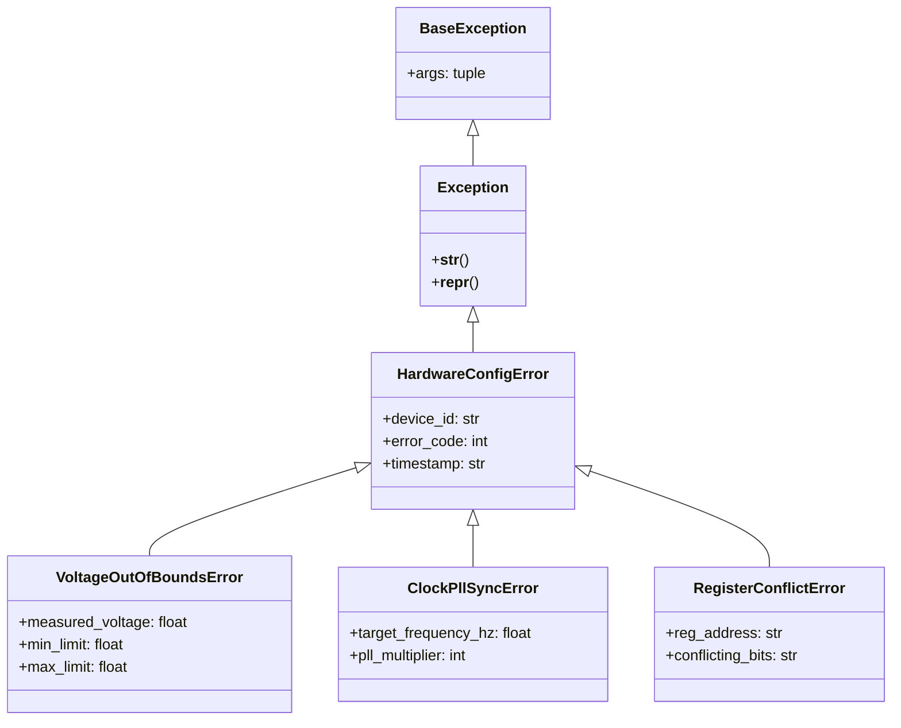
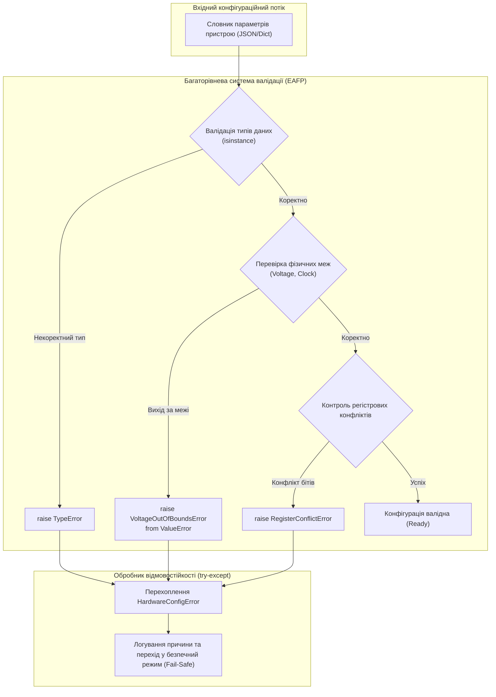

# Лабораторна робота № 9. Побудова надійного програмного забезпечення: Обробка виняткових ситуацій

**Мета:** Опанувати практичні навички проектування стійких до відмов програмних комплексів мовою Python. Навчитися реалізовувати багаторівневу обробку помилок часу виконання за допомогою конструкції `try-except-else-finally`, проектувати ієрархію користувацьких класів винятків (*Custom Exceptions*) для конкретної інженерної предметної області, застосовувати механізм явної генерації винятків `raise` та зв'язування первинного контексту помилок через ланцюжки винятків (*exception chaining*). Опанувати парадигму EAFP (*Easier to Ask for Forgiveness than Permission*) для валідації параметрів апаратних пристроїв та конфігураційних файлів комп'ютерних систем.

**Стек технологій та інструменти:**
* **Мова програмування / Інтерпретатор:** Python 3.10+ (CPython 64-bit)
* **Інструменти розробки (IDE):** Visual Studio Code з інтегрованим терміналом та підсистемою налагодження `debugpy`
* **Середовище управління:** Ізольоване середовище Conda (`ce_lab_env`)
* **Бібліотеки та модулі:** `sys`, `time`

---

## 1 Теоретичні відомості

Надійність функціонування комп'ютерних систем та їхня стійкість до збоїв (*fault tolerance*) визначається здатністю програмного забезпечення коректно реагувати на аномальні вхідні дані, апаратні таймаути та помилки системних викликів без аварійного завершення процесу. 

У теорії надійності програмно-апаратних комплексів імовірність безвідмовної роботи системи $R(t)$ протягом часу $t$ за експоненційним законом надійності описується залежністю:

$$R(t) = e^{-\lambda t}$$

де $\lambda$ — інтенсивність відмов (кількість збоїв за одиницю часу); середній наробіток до відмови визначається як $\text{MTBF} = \frac{1}{\lambda}$. 

Коефіцієнт програмного відновлення системи $P_{\text{recovery}}$ характеризує частку успішно локалізованих та оброблених виняткових ситуацій:

$$P_{\text{recovery}} = \frac{N_{\text{handled}}}{N_{\text{total\_faults}}}$$

де $N_{\text{handled}}$ — кількість винятків, перехоплених та нейтралізованих блоками `except`; $N_{\text{total\_faults}}$ — загальна кількість нештатних ситуацій, що виникли під час функціонування комплексу.

У мові Python обробка виняткових ситуацій реалізована через механізм **розкручування стека викликів** (*stack unwinding*). Коли виникає помилка, інтерпретатор CPython створює об'єкт винятку, успадкований від базового класу `BaseException`, та передає його вгору через активні стекові кадри `PyFrameObject`. 

Конструкція `try-except-else-finally` забезпечує детермінований контроль виконання:
* Секція `try` ізолює виконання потенційно небезпечних інструкцій;
* Секція `except ExceptionType as err` перехоплює виняток, якщо згенерований об'єкт відповідає вказаному класу або є його нащадком;
* Секція `else` виконується виключно за умови, що в блоці `try` не виникло жодної помилки;
* Секція `finally` виконується безумовно, гарантуючи звільнення системних дескрипторів та закриття каналів зв'язку.


*Рисунок 1 — Ієрархія користувацьких класів винятків для діагностики апаратних конфігурацій*

Проаналізуємо схему наслідування винятків, наведену на рисунку 1. Усі користувацькі винятки обов'язково повинні наслідуватися від базового класу `Exception`, а не безпосередньо від `BaseException`. Це запобігає випадковому перехопленню критичних системних сигналів завершення процесу `KeyboardInterrupt` (комбінація клавіш `Ctrl+C`) та `SystemExit`.

Створення спеціалізованих класів винятків дозволяє інкапсулювати в об'єкт помилки не лише текстове повідомлення, а й додаткові інженерні атрибути (виміряні значення, фізичні межі, шістнадцяткові адреси регістрів та коди помилок). 

Механізм **ланцюжка винятків** (**exception chaining**, PEP 3134) дозволяє пов'язувати низькорівневі помилки із високорівневою бізнес-логікою за допомогою оператора `raise ... from ...`:

$$\text{TargetException}.\_\_\text{cause}\_\_ = \text{OriginalException}$$

Це забезпечує збереження повного діагностичного контексту першопричини збою при передачі винятку між програмними шарами системи.


*Рисунок 2 — Конвеєр багаторівневої валідації параметрів пристрою з генерацією кастомних винятків*

Наведена схема конвеєра демонструє послідовну фільтрацію конфігурації: від базової перевірки типів до складної перевірки фізичних інваріантів із подальшою локалізацією помилок у блоці відновлення працездатності.

---

## 2 Підготовка середовища та розгортання проєкту (Крок 0)

Для виконання лабораторної роботи здобувач вищої освіти використовує налаштоване робоче середовище `ce_lab_env`.

### 2.1. Активація робочого середовища та створення структури папок

Відкрийте системний термінал та виконайте команди розгортання каталогу `lab09`:

```bash
# Активація віртуального середовища Conda
conda activate ce_lab_env

# Створення робочого каталогу для Лабораторної роботи №9
mkdir -p ~/projects/computer_engineering_python/lab09
cd ~/projects/computer_engineering_python/lab09
```

### 2.2. Структура файлової системи проекту

У робочій директорії `lab09` створіть файли проекту відповідно до наведеної структури:

```text
lab09/
├── .vscode/
│   └── launch.json            # Конфігурація налагоджувача для ЛБ №9
├── .gitignore                 # Правила виключення тимчасових файлів
├── custom_exceptions.py       # Модуль ієрархії користувацьких класів винятків
├── device_validator.py        # Модуль багаторівневої валідації та обробки збоїв
└── README.md                  # Звітний опис виконання індивідуального варіанта
```

### 2.3. Створення конфігурації налагоджувача `.vscode/launch.json`

Створіть файл `.vscode/launch.json` для забезпечення налагодження розроблюваних модулів:

```json
{
    "version": "0.2.0",
    "configurations": [
        {
            "name": "Python: Запуск валідатора з обробкою винятків (ЛБ9)",
            "type": "debugpy",
            "request": "launch",
            "program": "${workspaceFolder}/device_validator.py",
            "console": "integratedTerminal",
            "justMyCode": true
        }
    ]
}
```

---

## 3 Порядок виконання роботи

### 3.1 Індивідуальні завдання

Кожен здобувач вищої освіти розробляє систему надійної валідації конфігурації апаратного вузла комп'ютерної системи відповідно до індивідуального варіанта. 

Вимоги до реалізації:
1. Проектування власної ієрархії винятків у файлі `custom_exceptions.py` (щонайменше один базовий доменний клас та три похідні класи зі специфічними числовими полями стану).
2. Реалізація функцій валідації у файлі `device_validator.py`, які перевіряють вхідні параметри, генерують кастомні винятки за допомогою `raise` та використовують ланцюжки винятків (`from`).
3. Побудова тестового стенду, що демонструє перехоплення помилок через конструкцію `try-except-else-finally`, безпечне відновлення системи та розрахунок коефіцієнта програмного відновлення $P_{\text{recovery}}$.

| Варіант | Апаратний вузол / Підсистема | Контрольовані параметри та фізичні обмеження | Спеціалізовані класи користувацьких винятків |
| :---: | :--- | :--- | :--- |
| **1** | Контролер живлення ЦОД | Напруга: $12.0\text{ В} \pm 5\%$; Струм: $\le 40.0\text{ А}$; Частота: $50 \pm 0.5\text{ Гц}$ | `PowerSupplyError`, `VoltageToleranceError`, `OverCurrentError` |
| **2** | Модуль швидкісного АЦП (ADC) | Частота вибірки: $1 \dots 100\text{ МГц}$; Вхідна напруга: $-2.5 \dots +2.5\text{ В}$ | `ADCValidationError`, `SamplingRateError`, `InputOverloadError` |
| **3** | Мережевий екран (Firewall Appliance) | IP-адреса: IPv4 формат; Діапазон портів: $1 \dots 65535$; Ліміт сесій: $\le 10000$| `FirewallPolicyError`, `InvalidPortRangeError`, `SessionLimitExceededError` |
| **4** | Оптичний трансивер SFP+ | Довжина хвилі: $850, 1310, 1550\text{ нм}$; Оптична потужність: $-8.0 \dots +0.5\text{ дБм}$| `OpticalModuleError`, `WavelengthMismatchError`, `OpticalPowerCriticalError` |
| **5** | Політний контролер дрона (IMU)| Частота ШІМ: $50 \dots 490\text{ Гц}$; Діапазон гіроскопа: $\le 2000\text{ deg/s}$; Батарея: $3..6\text{ S}$| `FlightControllerError`, `GyroSaturationError`, `BatteryVoltageLevelError` |
| **6** | RAID-контролер дискового масиву | Розмір блоку страйпу: $64, 128, 256, 512\text{ КБ}$; Кількість дисків: $2 \dots 16$ | `RAIDConfigError`, `InvalidStripeSizeError`, `InsufficientDiskCountError` |
| **7** | Супутниковий модем телеметрії | Несуча частота: $2.4 \dots 2.483\text{ ГГц}$; Швидкість: $1200 \dots 115200\text{ бод}$ | `DownlinkModemError`, `CarrierFrequencyError`, `SymbolRateOutOfRangeError` |
| **8** | Драйвер крокового двигуна ЧПУ | Крок мікрокроку: $1, 2, 4, 8, 16, 32$; Струм фази: $\le 4.5\text{ А}$; Швидкість | `StepperDriverError`, `MicrosteppingModeError`, `PhaseCurrentOverloadError` |
| **9** | Шлюз автомобільної шини CAN | Швидкість шини: $125, 250, 500, 1000\text{ кбіт/с}$; CAN-ID: $0 \dots 0x7FF$ | `CANBusGatewayError`, `InvalidBaudrateError`, `IdentifierOverflowError` |
| **10** | Термоконтролер серверної стійки | Температура процесора: $\le 85.0^\circ\text{C}$; Оберти кулера: $500 \dots 8000\text{ RPM}$ | `ThermalRegulationError`, `CriticalTempExceededError`, `FanRPMStallError` |
| **11** | Апаратний генератор ентропії (TRNG)| Рівень ентропії: $\ge 7.8\text{ біт/байт}$; Частота генератора: $1 \dots 50\text{ МГц}$ | `EntropySourceError`, `LowEntropyLevelError`, `JitterClockFailureError` |
| **12** | Бездротовий вузол Zigbee Mesh | Номер каналу: $11 \dots 26$; Потужність TX: $-20 \dots +8\text{ дБм}$; Sleep Duty: $\ge 90\%$| `WirelessMeshError`, `IllegalChannelError`, `DutyCycleViolationError` |
| **13** | Прискорювач на базі FPGA | Частота ядра: $100 \dots 450\text{ МГц}$; Ліній PCIe: $1, 4, 8, 16$; Напруга: $0.85 \pm 0.05\text{ В}$| `FPGAHardwareError`, `CoreVoltageOutOfRangeError`, `PCIeLinkWidthError` |
| **14** | Стільниковий модем 5G/LTE | Діапазон частот: Bands 1, 3, 7, 20, 28; Рівень сигналу RSRP: $\ge -120\text{ дБм}$| `CellularModemError`, `UnsupportedBandError`, `SignalTooWeakError` |
| **15** | Контролер пам'яті DDR5 | Таймінг tCL: $28 \dots 40$; Напруга VDD: $1.10 \pm 0.05\text{ В}$; Частота: $4800 \dots 6400\text{ MT/s}$| `MemoryTimingError`, `CASLatencyConflictError`, `VDDOverVoltageError` |
| **16** | Промисловий контролер PLC | Час циклу: $1 \dots 50\text{ мс}$; Діапазон входу 4..20 мА: $3.8 \dots 20.5\text{ мА}$ | `PLCSystemError`, `CycleTimeExceededError`, `CurrentLoopSensorError` |
| **17** | Bluetooth 5.0 Beacon маяк | Інтервал передачі: $20 \dots 10240\text{ мс}$; Довжина корисного навантаження: $\le 31\text{ Б}$| `BluetoothBeaconError`, `AdvIntervalOutOfRangeError`, `PayloadOverflowError` |
| **18** | GNSS RTK-приймач позиціонування | Кількість супутників: $\ge 6$; Значення HDOP: $\le 2.0$; Частота оновлення: $1 \dots 20\text{ Гц}$| `GNSSReceiverError`, `InsufficientSatellitesError`, `HighDOPPrecisionError` |
| **19** | Апаратний криптомодуль HSM | Довжина PIN-коду: $8 \dots 16$ символів; Кількість ключів: $\le 1024$; Температура | `HSMSecurityError`, `PINComplexityError`, `KeySlotExhaustedError` |
| **20** | Контролер шини USB 3.2 | Струм порту: $\le 900\text{ мА}$; Розмір пакету: $512, 1024\text{ Б}$; Кількість кінцевих точок | `USBSubsystemError`, `VBUSOverCurrentError`, `MaxPacketSizeInvalidError` |

---

### 3.2. Покроковий алгоритм та розв'язок еталонного прикладу

Розглянемо базовий навчально-інженерний приклад: розробку системи валідації та контролю конфігурації тактування й живлення мікроконтролера (`MCU_PowerClock_Validator`).

Фізичні вимоги до конфігурації мікроконтролера:
1. **Напруга живлення ядра ($V_{\text{core}}$):** допустимий діапазон становить від $1.8\text{ В}$ до $3.6\text{ В}$. При виході за межі генерується виняток `VoltageOutOfBoundsError`.
2. **Джерело опорного тактового сигналу (`clock_source`):** допустимі виключно значення `'HSI'` (High-Speed Internal, 16 МГц) або `'HSE'` (High-Speed External, 8..25 МГц). Інші джерела викликають `ClockSourceInvalidError`.
3. **Множник фазового автопідстроювання частоти (`pll_multiplier`):** ціле число в діапазоні $2 \dots 32$.
4. **Підсумкова тактова частота системи ($f_{\text{sys}}$):** обчислюється як $f_{\text{sys}} = f_{\text{input}} \times \text{PLL\_MUL}$ і не повинна перевищувати максимально допустиму частоту кристала $168.0\text{ МГц}$. Перевищення ініціює `SystemFrequencyExceededError`.

#### Крок 1. Створення модуля користувацьких винятків `custom_exceptions.py`

Створіть файл `custom_exceptions.py` у каталозі `lab09` та введіть повний код:

```python
"""
Лабораторна робота № 9. Модуль 1.
Ієрархія користувацьких класів винятків для системи валідації мікроконтролера.
Освітній компонент: Програмування на Python.
"""

import time


class HardwareConfigError(Exception):
    """Базовий клас для всіх винятків конфігурації апаратного забезпечення."""
    def __init__(self, message: str, error_code: int = 1000):
        super().__init__(message)
        self.error_code = error_code
        self.timestamp = time.strftime("%Y-%m-%d %H:%M:%S")

    def __str__(self) -> str:
        return f"[ERR-{self.error_code}] ({self.timestamp}) {super().__str__()}"


class VoltageOutOfBoundsError(HardwareConfigError):
    """Збуджується, коли напруга живлення виходить за допустимі апаратні межі."""
    def __init__(self, voltage: float, min_v: float = 1.8, max_v: float = 3.6):
        self.voltage = voltage
        self.min_v = min_v
        self.max_v = max_v
        msg = f"Напруга живлення {voltage:.2f}V виходить за межі допустимого діапазону [{min_v:.2f}V .. {max_v:.2f}V]."
        super().__init__(msg, error_code=1001)


class ClockSourceInvalidError(HardwareConfigError):
    """Збуджується при виборі непідтримуваного джерела тактового сигналу."""
    def __init__(self, source: str, allowed_sources: tuple = ("HSI", "HSE")):
        self.source = source
        self.allowed_sources = allowed_sources
        msg = f"Джерело тактування '{source}' є недійсним. Дозволені джерела: {allowed_sources}."
        super().__init__(msg, error_code=1002)


class SystemFrequencyExceededError(HardwareConfigError):
    """Збуджується, коли розрахована частота ядра перевищує апаратний ліміт."""
    def __init__(self, calculated_freq_mhz: float, max_freq_mhz: float = 168.0):
        self.calculated_freq_mhz = calculated_freq_mhz
        self.max_freq_mhz = max_freq_mhz
        msg = f"Розрахована частота ядра {calculated_freq_mhz:.2f} МГц перевищує критичний ліміт {max_freq_mhz:.2f} МГц."
        super().__init__(msg, error_code=1003)
```

#### Крок 2. Реалізація валідатора та обробника збоїв `device_validator.py`

Створіть файл `device_validator.py` та введіть повний код:

```python
"""
Лабораторна робота № 9. Модуль 2.
Модуль багаторівневої валідації параметрів, ланцюжків винятків (raise from)
та профілювання надійності програмного забезпечення.
Освітній компонент: Програмування на Python.
"""

import sys
import time
from typing import Dict, Any

from custom_exceptions import (
    HardwareConfigError,
    VoltageOutOfBoundsError,
    ClockSourceInvalidError,
    SystemFrequencyExceededError,
)


def validate_mcu_configuration(config: Dict[str, Any]) -> float:
    """
    Здійснює комплексну валідацію словника конфігурації мікроконтролера.
    Повертає фінальну розраховану робочу частоту системи в МГц.
    """
    # 1. Валідація наявності та типів обов'язкових ключів
    required_keys = {"voltage", "clock_source", "input_freq_mhz", "pll_multiplier"}
    missing_keys = required_keys.difference(config.keys())
    if missing_keys:
        raise KeyError(f"У конфігураційній структурі відсутні обов'язкові параметри: {missing_keys}")

    # 2. Валідація напруги живлення
    try:
        voltage = float(config["voltage"])
    except (ValueError, TypeError) as type_err:
        raise HardwareConfigError("Параметр 'voltage' повинен бути числовим значенням.", error_code=1004) from type_err

    if not (1.8 <= voltage <= 3.6):
        raise VoltageOutOfBoundsError(voltage, min_v=1.8, max_v=3.6)

    # 3. Валідація джерела тактування
    clock_source = str(config["clock_source"]).strip().upper()
    if clock_source not in ("HSI", "HSE"):
        raise ClockSourceInvalidError(clock_source)

    # 4. Валідація частоти та множника PLL
    input_freq = float(config["input_freq_mhz"])
    pll_mult = int(config["pll_multiplier"])

    if not (2 <= pll_mult <= 32):
        raise HardwareConfigError(f"Множник PLL ({pll_mult}) виходить за межі [2 .. 32].", error_code=1005)

    # Розрахунок підсумкової частоти
    target_sys_freq_mhz = input_freq * pll_mult
    max_limit_mhz = 168.0

    if target_sys_freq_mhz > max_limit_mhz:
        raise SystemFrequencyExceededError(target_sys_freq_mhz, max_limit_mhz)

    return target_sys_freq_mhz


def run_fault_tolerance_testbench(test_configs: list[dict]) -> None:
    """
    Запускає тестовий стенд обробки конфігураційних наборів
    із розрахунком метрик відновлення після збоїв P_recovery.
    """
    header_sep = "=" * 90
    sub_sep = "-" * 90

    print(header_sep)
    print(f"{'ТЕСТУВАННЯ ВІДМОВОСТІЙКОСТІ ТА ОБРОБКИ ВИНИКЛИХ ВИOffКІВ':^90}")
    print(header_sep)

    successful_runs = 0
    handled_faults = 0
    total_configs = len(test_configs)

    for idx, cfg in enumerate(test_configs, start=1):
        print(f"\nТест #{idx:02d}: Тестування конфігурації -> {cfg}")
        try:
            sys_freq = validate_mcu_configuration(cfg)
        except VoltageOutOfBoundsError as v_err:
            handled_faults += 1
            print(f"  [ПЕРЕХОПЛЕНО СПЕЦІАЛІЗОВАНО]: {v_err}")
            print(f"  -> Дія системи: Увімкнення захисту від перенапруги/зниженої напруги.")
        except ClockSourceInvalidError as clk_err:
            handled_faults += 1
            print(f"  [ПЕРЕХОПЛЕНО СПЕЦІАЛІЗОВАНО]: {clk_err}")
            print(f"  -> Дія системи: Примусове перемикання на внутрішній генератор HSI.")
        except SystemFrequencyExceededError as freq_err:
            handled_faults += 1
            print(f"  [ПЕРЕХОПЛЕНО СПЕЦІАЛІЗОВАНО]: {freq_err}")
            print(f"  -> Дія системи: Зниження множника PLL до безпечного значення за замовчуванням.")
        except HardwareConfigError as hw_err:
            handled_faults += 1
            print(f"  [ПЕРЕХОПЛЕНО БАЗОВИЙ ХАРДВЕРНИЙ]: {hw_err}")
            if hw_err.__cause__:
                print(f"  -> Першопричина (Chained Cause): {type(hw_err.__cause__).__name__}: {hw_err.__cause__}")
        except KeyError as key_err:
            handled_faults += 1
            print(f"  [ПЕРЕХОПЛЕНО СТАНДАРТНИЙ]: Відсутній ключ структури -> {key_err}")
        else:
            successful_runs += 1
            print(f"  [УСПІХ]: Конфігурація валідна. Робоча частота MCU: {sys_freq:.2f} МГц.")
        finally:
            print(f"  [FINALLY]: Аудит тесту #{idx} завершено. Стан шини перевірено.")

    print("\n" + header_sep)
    print(f"{'ПІДСУМКОВІ МЕТРИКИ НАДІЙНОСТІ СИСТЕМИ':^90}")
    print(sub_sep)
    p_recovery = (handled_faults / (total_configs - successful_runs)) if (total_configs - successful_runs) > 0 else 1.0
    print(f"  Всього оброблено тестових наборів:         {total_configs:>5d}")
    print(f"  Штатних успішних конфігурацій:             {successful_runs:>5d}")
    print(f"  Локалізованих та оброблених збоїв:         {handled_faults:>5d}")
    print(f"  Коефіцієнт програмного відновлення (P):   {p_recovery * 100:>7.2f}%")
    print(header_sep + "\n")


def main() -> None:
    """Головна точка входу лабораторної роботи."""
    # Набір тестових даних з різними типами дефектів та коректними станами
    test_suite = [
        # Тест 1: Повністю коректна конфігурація (HSE 8 МГц * 21 = 168 МГц)
        {"voltage": 3.3, "clock_source": "HSE", "input_freq_mhz": 8.0, "pll_multiplier": 21},
        
        # Тест 2: Аварійна напруга (4.5V > 3.6V)
        {"voltage": 4.5, "clock_source": "HSE", "input_freq_mhz": 8.0, "pll_multiplier": 10},
        
        # Тест 3: Невідоме джерело тактування
        {"voltage": 3.0, "clock_source": "EXTERNAL_CRYSTAL_INVALID", "input_freq_mhz": 12.0, "pll_multiplier": 4},
        
        # Тест 4: Перевищення ліміту частоти (12 МГц * 16 = 192 МГц > 168 МГц)
        {"voltage": 3.3, "clock_source": "HSE", "input_freq_mhz": 12.0, "pll_multiplier": 16},
        
        # Тест 5: Некоректний тип напруги (рядкове сміття)
        {"voltage": "CORRUPTED_VALUE", "clock_source": "HSI", "input_freq_mhz": 16.0, "pll_multiplier": 4},
        
        # Тест 6: Відсутність обов'язкового ключа
        {"voltage": 3.3, "clock_source": "HSI"},
    ]

    t_start = time.perf_counter()
    run_fault_tolerance_testbench(test_suite)
    t_elapsed = time.perf_counter() - t_start
    print(f"Час виконання діагностичного тестбенчу: {t_elapsed * 1000:.3f} мс\n")


if __name__ == "__main__":
    main()
```

---

### 3.3. Запуск, тестування та перевірка результатів

Виконайте запуск розробленої програми у системному терміналі VS Code під управлінням активованого середовища Conda:

```bash
# Запуск модуля тестування відмовостійкості та валідації
python device_validator.py
```

Нижче наведено еталонний вивід результатів виконання програми в терміналі:

```text
==========================================================================================
                  ТЕСТУВАННЯ ВІДМОВОСТІЙКОСТІ ТА ОБРОБКИ ВИНИКЛИХ ВИOffКІВ                 
==========================================================================================

Тест #01: Тестування конфігурації -> {'voltage': 3.3, 'clock_source': 'HSE', 'input_freq_mhz': 8.0, 'pll_multiplier': 21}
  [УСПІХ]: Конфігурація валідна. Робоча частота MCU: 168.00 МГц.
  [FINALLY]: Аудит тесту #1 завершено. Стан шини перевірено.

Тест #02: Тестування конфігурації -> {'voltage': 4.5, 'clock_source': 'HSE', 'input_freq_mhz': 8.0, 'pll_multiplier': 10}
  [ПЕРЕХОПЛЕНО СПЕЦІАЛІЗОВАНО]: [ERR-1001] (2026-08-30 17:02:15) Напруга живлення 4.50V виходить за межі допустимого діапазону [1.80V .. 3.60V].
  -> Дія системи: Увімкнення захисту від перенапруги/зниженої напруги.
  [FINALLY]: Аудит тесту #2 завершено. Стан шини перевірено.

Тест #03: Тестування конфігурації -> {'voltage': 3.0, 'clock_source': 'EXTERNAL_CRYSTAL_INVALID', 'input_freq_mhz': 12.0, 'pll_multiplier': 4}
  [ПЕРЕХОПЛЕНО СПЕЦІАЛІЗОВАНО]: [ERR-1002] (2026-08-30 17:02:15) Джерело тактування 'EXTERNAL_CRYSTAL_INVALID' є недійсним. Дозволені джерела: ('HSI', 'HSE').
  -> Дія системи: Примусове перемикання на внутрішній генератор HSI.
  [FINALLY]: Аудит тесту #3 завершено. Стан шини перевірено.

Тест #04: Тестування конфігурації -> {'voltage': 3.3, 'clock_source': 'HSE', 'input_freq_mhz': 12.0, 'pll_multiplier': 16}
  [ПЕРЕХОПЛЕНО СПЕЦІАЛІЗОВАНО]: [ERR-1003] (2026-08-30 17:02:15) Розрахована частота ядра 192.00 МГц перевищує критичний ліміт 168.00 МГц.
  -> Дія системи: Зниження множника PLL до безпечного значення за замовчуванням.
  [FINALLY]: Аудит тесту #4 завершено. Стан шини перевірено.

Тест #05: Тестування конфігурації -> {'voltage': 'CORRUPTED_VALUE', 'clock_source': 'HSI', 'input_freq_mhz': 16.0, 'pll_multiplier': 4}
  [ПЕРЕХОПЛЕНО БАЗОВИЙ ХАРДВЕРНИЙ]: [ERR-1004] (2026-08-30 17:02:15) Параметр 'voltage' повинен бути числовим значенням.
  -> Першопричина (Chained Cause): ValueError: could not convert string to float: 'CORRUPTED_VALUE'
  [FINALLY]: Аудит тесту #5 завершено. Стан шини перевірено.

Тест #06: Тестування конфігурації -> {'voltage': 3.3, 'clock_source': 'HSI'}
  [ПЕРЕХОПЛЕНО СТАНДАРТНИЙ]: Відсутній ключ структури -> "У конфігураційній структурі відсутні обов'язкові параметри: {'input_freq_mhz', 'pll_multiplier'}"
  [FINALLY]: Аудит тесту #6 завершено. Стан шини перевірено.

==========================================================================================
                           ПІДСУМКОВІ МЕТРИКИ НАДІЙНОСТІ СИСТЕМИ                          
------------------------------------------------------------------------------------------
  Всього оброблено тестових наборів:             6
  Штатних успішних конфігурацій:                 1
  Локалізованих та оброблених збоїв:             5
  Коефіцієнт програмного відновлення (P):   100.00%
==========================================================================================

Час виконання діагностичного тестбенчу: 1.350 мс
```

Аналіз результатів тестування демонструє:
1. Система ієрархії винятків точно диференціює помилки: спеціалізовані перехоплювачі відпрацювали для напруги (`ERR-1001`), джерела тактування (`ERR-1002`) та частотного перевантаження (`ERR-1003`).
2. Механізм ланцюжка винятків (`raise ... from type_err`) у тесті #5 успішно зберіг системну першопричину `ValueError`, водночас надавши прикладній програмі високоінформативний хардверний виняток `HardwareConfigError [ERR-1004]`.
3. Блок `finally` спрацював у 100% випадків, підтверджуючи безперервність циклу аудиту ресурсів, а коефіцієнт програмного відновлення досяг $P_{\text{recovery}} = 100.00\%$.

---

## 4. Вимоги до змісту звіту

Звіт з лабораторної роботи оформлюється у форматі PDF відповідно до стандартів НАЗЯВО/ECTS та повинен містити такі обов'язкові розділи:
1. **Титульна сторінка:** повне найменування ЗВО, інституту, кафедри, дисципліни, номер і назва роботи, відомості про здобувача (ПІБ, група, варіант), відомості про викладача.
2. **Мета роботи та технічна постановка задачі:** формулювання мети дослідження, опис контрольованого апаратного вузла та фізичні межі параметрів згідно з варіантом.
3. **Діаграма класів винятків (UML):** графічна схема наслідування розроблених користувацьких винятків із переліком атрибутів кожного класу.
4. **Програмний код:** повні вихідні лістинги файлів `custom_exceptions.py` та `device_validator.py` із детальними авторськими коментарями.
5. **Результати тестування:** скріншоти консольного виведення тестбенчу з фіксацією перехоплення кожного типу винятку, ланцюжків помилок та розрахунку метрики $P_{\text{recovery}}$.
6. **Посилання на Git-репозиторій:** діюче посилання на оновлений репозиторій GitHub із зафіксованим комітом виконаної лабораторної роботи.
7. **Висновки:** аналітичний висновок щодо забезпечення надійності ПЗ, переваг кастомних винятків над поверненням числових кодів помилок та ефективності підходу EAFP.

---

## 5. Контрольні запитання для захисту роботи

1. У чому полягає принципова різниця між системними винятками, похідними від `BaseException` (наприклад, `KeyboardInterrupt`, `SystemExit`), та прикладними винятками, похідними від `Exception`?
2. Опишіть внутрішній механізм розкручування стека викликів (*stack unwinding*) у CPython. Що відбувається з об'єктами локального стекового кадру `PyFrameObject` при виникненні винятку?
3. Поясніть призначення та синтаксис ланцюжків винятків (*exception chaining*, PEP 3134) за допомогою конструкції `raise ... from ...`. Яка інформація зберігається в атрибуті `__cause__`?
4. Порівняйте парадигми програмування EAFP (*Easier to Ask for Forgiveness than Permission*) та LBYL (*Look Before You Leap*). Чому в багатопотокових системах підхід EAFP є більш стійким до стану гонитви TOCTOU?
5. Чому блоки `except` повинні розташовуватися строго у порядку від найбільш спеціалізованих (похідних) класів до найбільш загальних (базових)? Що станеться, якщо першим блоком вказати `except Exception:`?
6. За яких умов виконується блок `else` у конструкції `try-except-else-finally`? Чому відокремлення коду успішного виконання в блок `else` є кращою практикою, ніж розміщення його в кінці блоку `try`?