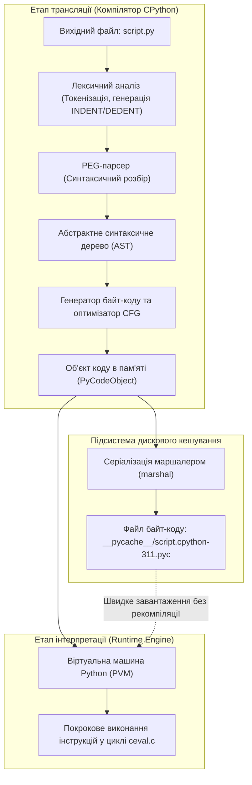
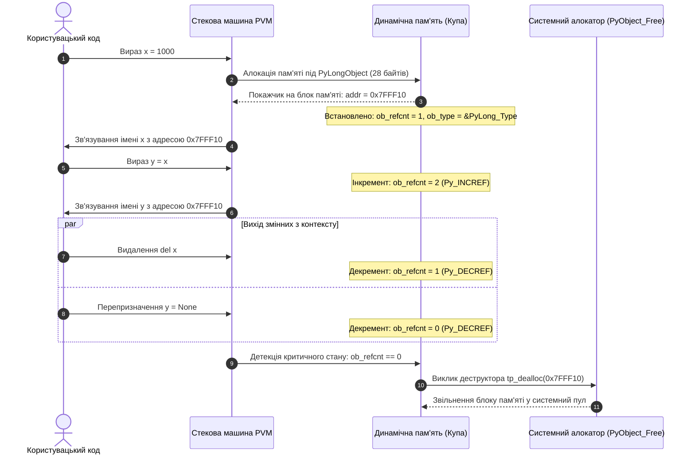
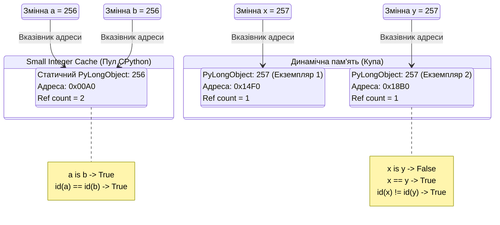
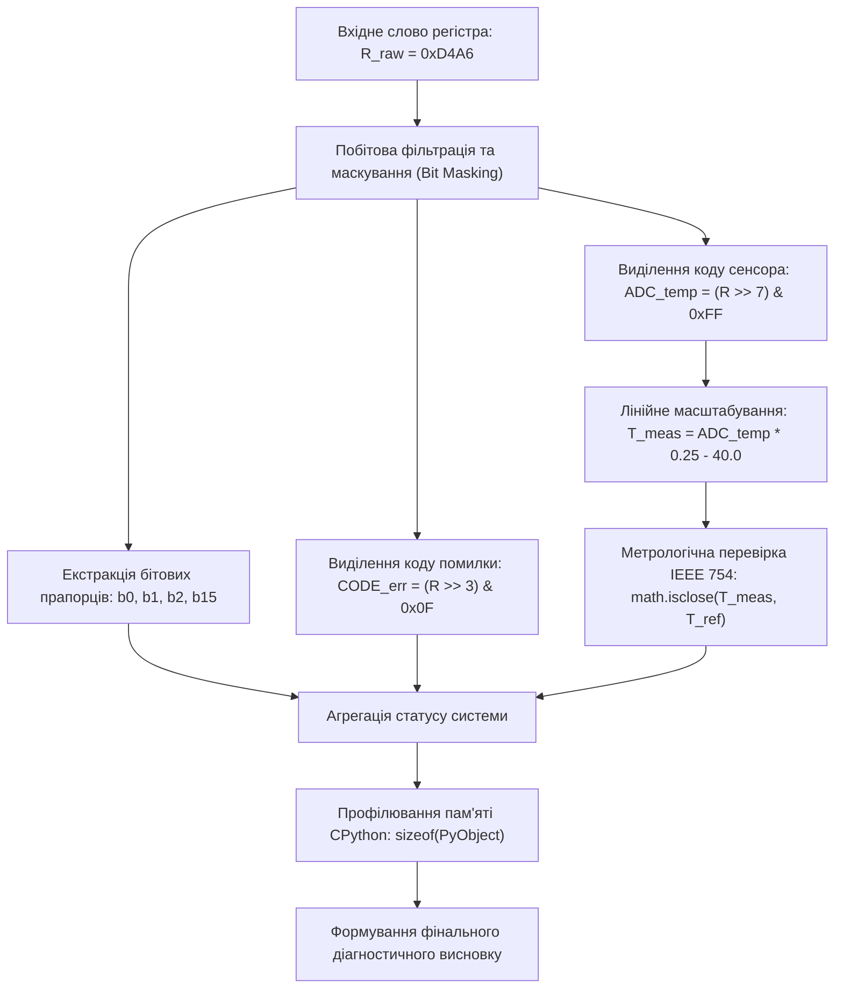

# Тема 1. Архітектура мови Python, інфраструктура розробника та модель скалярних даних

## Мета лекції

Метою лекції є формування у майбутніх фахівців з комп'ютерної інженерії системного розуміння внутрішньої організації еталонного інтерпретатора CPython, включаючи конвеєр трансляції вихідного коду у байт-код та його виконання віртуальною машиною PVM з урахуванням обмежень глобального блокування інтерпретатора GIL. Особлива увага приділяється опануванню професійної екосистеми розробника на базі дистрибутива Miniconda, інтегрованого середовища VS Code та системи контролю версій Git, а також формуванню фундаментальних знань щодо динамічної моделі пам'яті, внутрішньої структури `PyObject`, механізмів адресації змінних і специфіки виконання арифметичних та побітових операцій над скалярними типами даних.

## Очікувані результати навчання

Після успішного засвоєння матеріалу лекції студенти повинні демонструвати такі результати відповідно до рівнів таксономії Блума:

1. **Знання та розуміння.** Студенти повинні детально відтворювати й пояснювати архітектуру середовища CPython, функціональне призначення та формат кеш-файлів `.pyc`, принципи роботи стекової віртуальної машини PVM, сутність м'ютекса GIL, а також внутрішню структуру представлення скалярних типів даних на базі С-структур `PyObject` і `PyLongObject`.

2. **Застосування.** Студенти повинні самостійно розгортати та конфігурувати ізольовані робочі середовища за допомогою Miniconda, здійснювати версіонування вихідного коду з використанням системи Git та файлу `.gitignore`, а також коректно реалізовувати математичні й побітові операції над скалярними величинами для розв'язання інженерних задач.

3. **Аналіз.** Студенти мають уміти зіставляти механізми адресації та ідентифікації об'єктів у динамічній пам'яті (розрізняючи перевірку ідентичності `is` та еквівалентності значень `==`), діагностувати наслідки кешування малих цілих чисел у пулі $[-5, 256]$, а також аналізувати похибки представлення дробових величин за стандартом IEEE 754 у порівняльних операціях.

4. **Оцінювання та синтез.** Студенти повинні критично оцінювати накладні витрати пам'яті та швидкодії об'єктної моделі Python у порівнянні з компільованими мовами програмування, обґрунтовувати вибір методів обходу обмежень GIL для обчислювальних процесів і проектувати алгоритмічні структури пакування й маскування двійкових даних для апаратних контролерів.

---

## Детальний покроковий план лекції

### 1. Теоретичний модуль. Архітектурні засади середовища CPython та інфраструктура розробки

* 1.1. Конвеєр виконання програмного коду в середовищі CPython: лексичний аналіз, формування абстрактного синтаксичного дерева AST, генерація платформонезалежного байт-коду та структура метаданих кешу `.pyc` у каталозі `__pycache__`.
* 1.2. Внутрішня будова стекової віртуальної машини Python (PVM), структура кадру виконання `PyFrameObject` та монолітний цикл обробки інструкцій `ceval.c`.
* 1.3. Призначення, принципи дії та системні обмеження механізму глобального блокування інтерпретатора (Global Interpreter Lock, GIL) при розподілі обчислювальних ресурсів багатоядерних процесорів, а також порівняльний аналіз реалізацій CPython, PyPy, Jython та IronPython.
* 1.4. Організація робочого простору комп'ютерного інженера: створення ізольованих середовищ у Miniconda, налаштування мовного сервера Pylance у VS Code та базовий робочий процес розподіленого версіонування за допомогою Git і GitHub.

### 2. Аналітичний модуль. Модель пам'яті CPython, об'єктні посилання та математичні моделі скалярних даних

* 2.1. Концепція сильної динамічної типізації, уніфікована архітектура об'єктів CPython на основі базової структури `PyObject` і механізм автоматичного керування пам'яттю за лічильником посилань `ob_refcnt`.
* 2.2. Змінні як іменовані посилання в адресному просторі: функції інспекції `id()` та `type()`, порівняння семантики операторів `is` та `==`, оптимізація пам'яті за допомогою пулу малих цілих чисел (Small Integer Cache) у діапазоні $[-5, 256]$.
* 2.3. Математичний апарат і внутрішнє представлення скалярних числових типів: довга арифметика `int`, двійковий формат подвійної точності стандарту IEEE 754 для типу `float` та алгоритми оцінки похибок за формулою функції `math.isclose()`.
* 2.4. Комплексні числа `complex` та їхні векторні компоненти, булевий тип `bool` як числовий підклас цілого числа та властивості сінглтона `NoneType`.
* 2.5. Математична формалізація та бінарні алгоритми побітових операцій (`&`, `|`, `^`, `~`, `<<`, `>>`) над цілими числами у додатковому двійковому коді та правила короткої схеми обчислення (short-circuit) для логічних операторів.

### 3. Практично-розрахунковий кейс. Низькорівневе опрацювання телеметрії та маскування регістрів периферійних пристроїв

**Тема наскрізної задачі.** «Розробка модуля програмної емуляції 16-бітного апаратного регістра стану мікроконтролера (Status Register): маскування бітових прапорців апаратних переривань, валідація показань аналогових сенсорів із корекцією похибок стандарту IEEE 754 та аналіз споживання оперативної пам'яті засобами моніторингу адресного простору CPython».

## 1. Фундаментальний теоретичний базис та концептуальні засади

### 1.1. Конвеєр виконання програмного коду в середовищі CPython: лексичний аналіз, формування абстрактного синтаксичного дерева AST, генерація платформонезалежного байт-коду та структура метаданих кешу .pyc у каталозі \_\_pycache\_\_

Мова програмування Python у своїй канонічній еталонній реалізації **CPython** базується на дворівневій архітектурі обробки інструкцій, яка поєднує попередню трансляцію вихідного тексту у проміжне представлення та подальше виконання цього представлення віртуальною машиною. На відміну від чисто компільованих систем, де вихідний код транслюється безпосередньо в машинний код цільової мікропроцесорної архітектури, та класичних інтерпретаторів, які порядково аналізують і виконують символьний текст, архітектура CPython мінімізує обчислювальні накладні витрати шляхом відокремлення етапу синтаксичного аналізу від безпосереднього виконання.

Конвеєр обробки коду починається з передачі вихідного файлу з розширенням `.py` до підсистеми компілятора CPython. На першому етапі лексичний аналізатор (**сканер** або **токенізатор**) здійснює перетворення неструктурованого потоку символів у послідовність лексем — неподільних синтаксичних одиниць (ключові слова, ідентифікатори, числові та рядкові літерали, оператори). Одночасно аналізатор генерує спеціальні керуючі токени `INDENT` та `DEDENT` на основі підрахунку кількості пробілів на початку рядків, що формалізує синтаксичну блочну структуру програми замість використання фігурних дужок чи операторних дужок `begin...end`.

Отриманий потік токенів передається до синтаксичного аналізатора (**парсера**). У сучасних версіях CPython (починаючи з версії 3.9) використовується високопродуктивний **PEG-парсер** (Parsing Expression Grammar), який замінив застарілий алгоритм LL(1). Парсер будує **абстрактне синтаксичне дерево** (**Abstract Syntax Tree, AST**) — орієнтоване дерево, що формалізує структурну логіку програми без прив'язки до деталей поверхневого синтаксису (таких як розділові знаки або відступи). На етапі аналізу AST компілятор виконує статичну перевірку коректності контексту, зокрема виявляє некоректне використання ключових слів, неправильну локалізацію змінних та синтаксичні колізії, генеруючи за потреби виняток `SyntaxError`.

На фінальній стадії frontend-компіляції підсистема генерації коду трансформує AST-дерево спочатку в лінійний граф керування потоком (Control Flow Graph, CFG), а потім у послідовність низькорівневих платформно-незалежних інструкцій — **байт-код Python**. Блок байт-коду разом із супутніми метаданими інкапсулюється в системну C-структуру об'єкта коду (`PyCodeObject`).



Для оптимізації часу наступних запусків скомпільований об'єкт `PyCodeObject` маршалізується (серіалізується у бінарний потік) і записується на диск у спеціальний кеш-файл із розширенням `.pyc`, що розміщується в автоматично створюваному каталозі `__pycache__`. Назва такого файлу формується за шаблоном `<ім'я_модуля>.<тег_інтерпретатора>.pyc` (наприклад, `module.cpython-311.pyc`), що унеможливлює виникнення колізій між різними версіями інтерпретатора.

Структура двійкового файлу `.pyc` жорстко стандартизована і складається з 16-байтного заголовка метаданих та тіла серіалізованого об'єкта коду:
1. Байти 0–3: **магічне число** (**magic number**), перші два байти якого однозначно задають версію байт-коду CPython, а наступні два містять розділювач `\r\n`.
2. Байти 4–7: бітове поле прапорців валідації (визначає режим перевірки цілісності кешу згідно з PEP 552).
3. Байти 8–15: дані верифікації актуальності. У класичній моделі байти 8–11 містять 32-бітну часову мітку останньої модифікації вихідного файлу (`mtime`), а байти 12–15 — 32-бітний розмір вихідного файлу. У геш-орієнтованій моделі (Hash-based pyc) ці вісім байтів містять криптографічний SIPHASH-24 геш вмісту файлу `.py`.

Формальна умова валідності кешу $V_{\text{cache}}$, за якої інтерпретатор уникає повторного запуску лексера та парсера, аналітично описується співвідношенням:

$$V_{\text{cache}} = \begin{cases} 1, & \text{якщо } M_{\text{pyc}} = M_{\text{env}} \land \left( (F = 0 \land t_{\text{src}} = t_{\text{pyc}} \land S_{\text{src}} = S_{\text{pyc}}) \lor (F = 1 \land H(\text{src}) = H_{\text{pyc}}) \right) \\ 0, & \text{в іншому випадку (ініціюється повна рекомпіляція)} \end{cases}$$

де:
* $M_{\text{pyc}}$ — магічне число версії CPython, збережене у заголовку файлу `.pyc` (цілочисельний тип даних uint16);
* $M_{\text{env}}$ — очікуване магічне число запущеного процесу інтерпретатора (цілочисельний тип даних uint16);
* $F$ — бітовий прапорець типу валідації ($0$ — перевірка за часовою міткою та розміром, $1$ — перевірка за контрольним гешем);
* $t_{\text{src}}$ — системний час останньої модифікації вихідного файлу `.py` (тип float, вимірюється в секундах за стандартом POSIX Epoch);
* $t_{\text{pyc}}$ — збережена часова мітка вихідного коду в метаданих `.pyc` (цілочисельний тип даних uint32, секунди);
* $S_{\text{src}}$ — фактичний фізичний розмір вихідного файлу на накопичувачі (цілочисельний тип даних uint32, байти);
* $S_{\text{pyc}}$ — контрольний розмір файлу, зафіксований у заголовку `.pyc` (цілочисельний тип даних uint32, байти);
* $H(\text{src})$ — поточне значення криптографічного гешу вихідного файлу (масив байтів uint64);
* $H_{\text{pyc}}$ — еталонний геш, збережений у структурі `.pyc` під час первинної компіляції (масив байтів uint64).

Якщо вираз $V_{\text{cache}} = 1$, інтерпретатор повністю виключає ресурсомісткі кроки побудови дерева AST і безпосередньо десеріалізує об'єкт коду у пам'ять, що критично прискорює імпортування розгалужених інженерних модулів.

---

### 1.2. Внутрішня будова стекової віртуальної машини Python (PVM), структура кадру виконання PyFrameObject та монолітний цикл обробки інструкцій ceval.c

**Віртуальна машина Python** (**Python Virtual Machine, PVM**) є системним середовищем виконання, призначеним для безпосередньої інтерпретації згенерованого байт-коду. З погляду теорії обчислювальних машин, PVM функціонує як абстрактний **стековий процесор**. На відміну від регістрових процесорів (таких як архітектури x86-64 або ARM), де операції виконуються над значеннями, розташованими у фіксованій кількості спеціальних апаратних комірок пам'яті (регістрах), стекова віртуальна машина здійснює будь-які обчислення за допомогою використання вершини спеціального стека значень (**evaluation stack**).

Принцип виконання інструкцій у стековій архітектурі полягає в тому, що аргументи попередньо завантажуються на стек спеціальними опкодами (наприклад, `LOAD_FAST`, `LOAD_CONST`), а виконуюча операція виштовхує необхідну кількість операндів зі стека, обчислює результат і заштовхує його назад на вершину. 

Кожен логічний контекст виклику (функція, модуль, генератор) отримує в розпорядження ізольований об'єкт контексту — **стековий кадр** виконання, який у CPython представлений низькорівневою структурою `PyFrameObject`. Спрощена схема внутрішньої будови кадру в пам'яті містить такі фундаментальні поля:

```c
typedef struct _frame {
    PyObject_VAR_HEAD
    struct _frame *f_back;      /* Покажчик на попередній кадр у стеку викликів */
    PyCodeObject *f_code;       /* Покажчик на виконуваний об'єкт коду */
    PyObject *f_builtins;       /* Словник вбудованих функцій (__builtins__) */
    PyObject *f_globals;        /* Словник глобального простору імен модуля */
    PyObject *f_locals;         /* Локальний простір імен функції */
    PyObject **f_valuestack;    /* Покажчик на вершину стека оцінювання */
    int f_lineno;               /* Поточний номер рядка у вихідному файлі */
    PyObject *f_localsplus[1];  /* Динамічний масив: локальні змінні та стек */
} PyFrameObject;
```

Центральним ядром PVM є інтерпретаційний диспетчерський цикл, розміщений у вихідному файлі `ceval.c` вихідного коду CPython (функція `_PyEval_EvalFrameDefault`). На концептуальному рівні він є нескінченним циклом із гігантською конструкцією вибору `switch-case`, де кожна ітерація зчитує поточний 16-бітний опкод байт-коду (`_Py_CODEUNIT`), розкодовує його тип і переходить до виконання відповідного блоку на мові C. 

Загальний час виконання програми $T_{\text{total}}$ на рівні PVM детермінується сумою затримок на вибірку інструкцій, диспетчеризацію операторів та роботу з динамічною пам'яттю:

$$T_{\text{total}} = \sum_{k=1}^{N_{\text{ops}}} \left( t_{\text{fetch}}(k) + t_{\text{decode}}(k) + t_{\text{dispatch}}(k) + t_{\text{eval}}(k) \right)$$

де:
* $N_{\text{ops}}$ — загальна кількість опкодів байт-коду, виконаних PVM протягом життєвого циклу задачі (безрозмірна величина, ціле число);
* $t_{\text{fetch}}$ — час зчитування чергової інструкції з масиву об'єкта коду за лічильником інструкцій (секунди, с);
* $t_{\text{decode}}$ — час декодування інструкції та вилучення її аргументу (секунди, с);
* $t_{\text{dispatch}}$ — часові накладні витрати розгалуження та переходу до адресного блоку конкретного опкоду в файлі `ceval.c` (секунди, с);
* $t_{\text{eval}}$ — фактичний час обчислення системної операції CPython, включаючи виклики магічних методів C API та алокацію пам'яті (секунди, с).

У зв'язку з тим, що величини $t_{\text{fetch}}$, $t_{\text{decode}}$ та $t_{\text{dispatch}}$ багаторазово перевершують затримки прямих апаратних процесорних інструкцій через відсутність прямої комбінаційної логіки та часті промахи кешу команд мікропроцесора (instruction cache misses), чисті розрахункові алгоритми на байт-коді CPython поступаються за швидкістю еквівалентним програмам на мовах C/C++ у 10–50 разів.

---

### 1.3. Призначення, принципи дії та системні обмеження механізму глобального блокування інтерпретатора (Global Interpreter Lock, GIL) при розподілі обчислювальних ресурсів багатоядерних процесорів, а також порівняльний аналіз реалізацій CPython, PyPy, Jython та IronPython

Фундаментальною проектною особливістю архітектури CPython є механізм **глобального блокування інтерпретатора** (**Global Interpreter Lock, GIL**). За своєю системною сутністю GIL є взаємним блокуванням (**м'ютексом**), призначеним для запобігання стану гонитви (**race condition**) за доступ до внутрішніх системних ресурсів віртуальної машини. 

Основною причиною інтеграції GIL у CPython є модель керування пам'яттю, що базується на прямому підрахунку посилань на об'єкти (`ob_refcnt`). Якби кілька потоків операційної системи виконували байт-код паралельно на різних ядрах процесора, одночасна несинхронізована модифікація спільних лічильників посилань неминуче призвела б або до витоку оперативної пам'яті (пам'ять ніколи не звільняється), або до передчасного вивільнення пам'яті об'єкта з подальшим виникненням критичної помилки сегментації (`Segmentation Fault`). Застосування індивідуальних атомарних блокувань для кожного створеного об'єкта викликало б катастрофічну деградацію швидкодії однопотокових програм та високий ризик виникнення взаємних блокувань (**deadlocks**). Тому автор мови Гвідо ван Россум обрав простіше і надійніше системне рішення: єдине глобальне блокування на весь процес інтерпретатора.

Внаслідок дії GIL, незалежно від кількості фізичних ядер процесора, у будь-який момент часу в межах одного процесу CPython виконувати байт-код може виключно **один потік**. 

Інтерпретатор регламентує роботу потоків за часовим принципом: кожні $t_{\text{switch}}$ мілісекунд (за замовчуванням $5$ мс, що налаштовується параметром `sys.setswitchinterval()`) виконуваний потік примусово вивільняє GIL, надаючи іншим потокам можливість захопити блокування. При виконанні операцій вводу-виводу (дискові операції, очікування мережевих пакетів, системні виклики ОС) інтерпретатор автоматично звільняє GIL до початку блокуючого виклику і повторно захоплює його після надходження відповіді.

```mermaid
gantt
    title Конкуренція двох обчислювальних потоків за мютекс GIL
    dateFormat X
    axisFormat %s

    section Ядро CPU 0
    Потік 1 (виконання байт-коду)        :active, p1_run, 0, 5
    Потік 1 (очікування захоплення GIL) :crit, p1_wait, 5, 10
    Потік 1 (виконання байт-коду)        :active, p1_run2, 10, 15

    section Ядро CPU 1
    Потік 2 (очікування захоплення GIL) :crit, p2_wait, 0, 5
    Потік 2 (виконання байт-коду)        :active, p2_run, 5, 10
    Потік 2 (очікування захоплення GIL) :crit, p2_wait2, 10, 15

    section Стан мютекса GIL
    Захоплено Потоком 1                 :done, gil_p1, 0, 5
    Захоплено Потоком 2                 :done, gil_p2, 5, 10
    Захоплено Потоком 1                 :done, gil_p1_2, 10, 15
```



Для аналізу продуктивності обчислювальних багатопотокових завдань у комп'ютерній інженерії використовується модифікований закон Амдала. У класичному формулюванні коефіцієнт прискорення $S(p)$ обмежується часткою строго послідовного коду $(1 - \alpha)$. Проте під впливом обмежень GIL у багатопотокових обчисленнях на рівні байт-коду частка паралельного коду на рівні процесора прямує до нуля ($\alpha \to 0$), а додаткові витрати на арбітраж потоків операційною системою створюють ефект сповільнення:

$$S_{\text{GIL}}(p) = \frac{T_1}{T_p} = \frac{T_1}{T_1 + T_{\text{contention}}(p)} = \frac{1}{1 + \beta \cdot (p - 1)}$$

де:
* $S_{\text{GIL}}(p)$ — фактичний коефіцієнт прискорення багатопотокового алгоритму на системі з $p$ процесорними ядрами (безрозмірна величина);
* $T_1$ — тривалість виконання обчислювальної задачі одним потоком (секунди, с);
* $T_p$ — тривалість виконання тієї самої задачі при розподілі на $p$ паралельних потоків у межах одного процесу CPython (секунди, с);
* $T_{\text{contention}}(p)$ — сумарний час деградації продуктивності, спричинений частими перемиканнями контексту ядра ОС, сигналами умовних змінних `pthread_cond_wait()` та холостим простоєм процесорних ядер (секунди, с);
* $\beta$ — емпіричний коефіцієнт накладних витрат мікропроцесорного арбітражу за м'ютекс GIL на одне додаткове ядро (безрозмірна величина, $\beta > 0$).

Формула наочно демонструє, що у разі чистих CPU-обчислень розпаралелювання через стандартні потоки CPython не лише не зменшує час роботи, але й призводить до падіння продуктивності ($S_{\text{GIL}}(p) < 1$).

Для подолання цього обмеження інженери застосовують або багатопроцесорну парадигму (створення окремих процесів операційної системи із власними ізольованими екземплярами PVM за допомогою модуля `multiprocessing`), або зовнішні скомпільовані бібліотеки (NumPy, SciPy), які звільняють GIL на час виконання векторних розрахунків мовами C чи Fortran, або альтернативні реалізації мови Python.

Таблиця 1.1 систематизує фундаментальні технічні відмінності ключових реалізацій мови Python.

*Таблиця 1.1 — Порівняльний аналіз архітектурних реалізацій мови Python*

| Критерій порівняння | CPython | PyPy | Jython | IronPython |
| :--- | :--- | :--- | :--- | :--- |
| **Базова мова розробки** | C | RPython (Restricted Python) | Java | C# |
| **Модель трансляції** | Традиційний компілятор у байт-код + інтерпретатор PVM | Трасуючий JIT-компілятор (Just-In-Time) | Компіляція у байт-код JVM | Компіляція у код MSIL (CIL) |
| **Керування пам'яттю** | Підрахунок посилань + циклічний Garbage Collector | Власний високошвидкісний збирач сміття (GC) | Garbage Collector віртуальної машини Java (JVM) | Garbage Collector платформи .NET CLR |
| **Наявність механізму GIL** | Присутній як глобальний системний м'ютекс | Присутній (аналогічно до CPython) | Повністю відсутній | Повністю відсутній |
| **Підтримка C-Extensions (C API)** | Повна нативна бінарна сумісність | Обмежена (використовує шар емуляції cpyext) | Відсутня (використовує JNI через додаткові мости) | Відсутня (використовує P/Invoke) |
| **Цільове призначення** | Системне програмування, наука про дані, Embedded | Математичні та ітеративні розрахунки | Корпоративні системи на платформі Java | Інтеграція з інфраструктурою Microsoft .NET |

---

### 1.4. Організація робочого простору комп'ютерного інженера: створення ізольованих середовищ у Miniconda, налаштування мовного сервера Pylance у VS Code та базовий робочий процес розподіленого версіонування за допомогою Git і GitHub

Проектування програмних комплексів у сфері комп'ютерної інженерії вимагає суворої детермінованості компонентного складу проекту. Глобальне встановлення бібліотек за допомогою утиліти `pip` безпосередньо в базову директорію операційної системи призводить до системних конфліктів версій (**dependency hell**). Для гарантування повної відтворюваності розрахунків застосовуються засоби просторової ізоляції середовищ.

Основним інструментом інженера є дистрибутив **Miniconda** — мінімалістична версія системи керування пакунками та середовищами **Conda**. На відміну від стандартного модуля `venv`, який оперує виключно готовими колесами (**wheels**) або вихідним кодом чистих Python-пакунків, Conda функціонує як системний бінарний менеджер. 

Conda здатна встановлювати не лише модулі Python, але й будь-які скомпільовані бінарні залежності, включаючи бібліотеки лінійної алгебри BLAS/LAPACK, компілятори мов C/C++, діагностичні утиліти апаратних портів та обчислювальний інструментарій NVIDIA CUDA Toolkit. Це виключає необхідність наявності складної локальної компіляторної інфраструктури на цільовій машині розробника.

Створення та активація ізольованого робочого оточення для інженерних розрахунків здійснюється термінальними командами:

```bash
# Створення середовища з фіксованою версією інтерпретатора та базовими компіляторами
conda create --name hw_dsp_env python=3.11 numpy scipy -y

# Активація ізольованого контексту у поточній командній сесії
conda activate hw_dsp_env

# Експорт точного бінарного зліпка оточення для відтворюваності експерименту
conda env export > environment.yml
```

Інтеграція створеного середовища у професійне середовище розробки **Visual Studio Code** (VS Code) відбувається через вибір інтерпретатора за шляхом `miniconda3/envs/hw_dsp_env/bin/python`. Для забезпечення якості коду та автоматизованого аудиту архітектури системи застосовується мовний сервер **Pylance**, що працює за стандартом **LSP** (**Language Server Protocol**). Pylance базується на движку статичного аналізу типів **Pyright**, що дозволяє інженеру отримати суворий контроль типів даних ще до запуску коду на виконання. 

Для роботи з апаратною телеметрією та дослідження моделей алгоритмів VS Code надає вбудовану підтримку інтерактивних блокнотів **Jupyter Notebooks** (`.ipynb`). Ядро блокнота запускається як незалежний фоновий процес, який взаємодіє з оболонкою через асинхронні черги повідомлень протоколу ZeroMQ, що дозволяє зберігати завантажені масиви даних у пам'яті та повторно виконувати обчислювальні комірки без повторної ініціалізації пристроїв.

Керування життєвим циклом коду реалізується на базі розподіленої системи контролю версій **Git**. Модель даних Git являє собою спрямований ациклічний граф (**DAG**), вершинами якого є знімки (**snapshots**) стану директорії проекту, що однозначно ідентифікуються 40-символьними гешами SHA-1 або SHA-256. 

Для запобігання потраплянню бінарного сміття, проміжних артефактів PVM та локальних конфігурацій до віддаленого репозиторію **GitHub**, у корені проекту формується конфігураційний файл `.gitignore`. Типовий інженерний файл `.gitignore` для систем на Python має таку структуру:

```gitignore
# Бінарні кеш-файли PVM
__pycache__/
*.py[cod]
*$py.class

# Директорії ізольованих віртуальних середовищ
.env
.venv
env/
venv/
miniconda3/

# Конфігурації середовища розробки та артефакти Jupyter
.vscode/
.idea/
.ipynb_checkpoints/
*.log
```

Стандартний ітераційний цикл інженера з версіонування розробки передбачає три послідовні фази: зміна вихідних файлів у робочій директорії (Working Directory), вибіркове додавання змін до індексу (Staging Area) за допомогою `git add`, створення незмінного контрольного вузла в локальній базі даних репозиторію через `git commit -m "Повідомлення"` та відправлення гілки до хмарного сховища команди за допомогою команди `git push origin main`.

> **ТИПОВА ПОМИЛКА:** Початківці часто припускають, що багатопотоковий додаток (на базі модуля `threading`), запущений на багатоядерному процесорі з 8 фізичними ядрами, автоматично розподілить обчислення факторіалів чи множення матриць на Python між цими ядрами й забезпечить майже восьмикратний приріст швидкості. Це хибне уявлення. Через дію механізму Global Interpreter Lock (GIL) в інтерпретаторі CPython у кожен момент часу байт-код виконується лише на одному ядрі, тоді як інші ядра простоюють або витрачають ресурси на постійну конкуренцію за м'ютекс блокування. Реальне фізичне розпаралелювання обчислювальних операцій (CPU-bound) на чистій мові Python вимагає застосування модуля `multiprocessing`, де кожне ядро отримує власний повноцінний процес із персональним незалежним екземпляром віртуальної машини PVM.

> **КОНТРОЛЬНЕ ПИТАННЯ.** У системі збору даних використовується CPython 3.11. Інженер створив два незалежні потоки за допомогою модуля `threading`. Перший потік зчитує 16-бітні пакети даних через послідовний інтерфейс RS-485 за допомогою блокуючого системного виклику, а другий потік безперервно перераховує отримані масиви за допомогою складного алгоритму цифрової фільтрації. Чи блокуватиме перший потік роботу другого потоку через дію GIL під час очікування нових даних від датчика?

<details markdown="1">
<summary>Розгорнути відповідь</summary>

**Правильний варіант: Ні, перший потік не блокуватиме роботу другого.**

1. Механізм GIL у CPython реалізований таким чином, що перед виконанням будь-яких потенційно блокуючих системних викликів вводу-виводу (I/O-bound operations), таких як читання з мережевого сокета, файлового дескриптора або послідовного COM-порту через функції типу `read()` чи `select()`, інтерпретатор примусово викликає макрос `Py_BEGIN_ALLOW_THREADS`. Цей макрос тимчасово звільняє м'ютекс GIL для поточного системного потоку.

2. Поки перший потік перебуває у стані сну (блокування на рівні ядра операційної системи в очікуванні апаратного переривання від контролера інтерфейсу), другий потік безперешкодно захоплює м'ютекс GIL і виконує байт-код обчислювального алгоритму цифрової фільтрації на виділеному процесорному ядрі.

3. Аналіз дистракторів та альтернативних варіантів:

    * **Твердження про повне блокування** є хибним, оскільки блокування за GIL стосується виключно виконання інструкцій віртуальної машини PVM, а не очікування зовнішніх апаратних сигналів на рівні системних драйверів ОС.
    * **Твердження про конкуренцію за ядра** є некоректним, оскільки потік очікування вводу-виводу практично не споживає процесорного часу під час блокування.

</details>

---

### Вказівки для самостійного осмислення теоретичного базису

1. Дослідіть та порівняйте внутрішню структуру файлу `ceval.c` вихідного коду CPython версії 3.10 та новіших версій 3.11/3.12. Зверніть увагу на те, як впровадження спеціалізованого адаптивного інтерпретатора (PEP 659 — Specializing Adaptive Interpreter) трансформувало базовий цикл диспетчеризації інструкцій шляхом заміни універсальних опкодів на оптимізовані інлайн-варіанти для прискорення виконання повторюваних операцій.
2. Проаналізуйте інженерні наслідки ініціативи Faster CPython щодо експериментального відключення GIL (PEP 703 — Making the Global Interpreter Lock Optional in CPython). Сформулюйте висновки щодо того, які архітектурні зміни у внутрішніх структурах `PyObject` (впровадження biased reference counting або заміни лічильників на атомарні операції) будуть необхідні для збереження продуктивності однопотокових модулів при одночасному забезпеченні безпеки доступу з боку паралельних системних потоків.
3. Зіставте практичні сценарії використання файлів фіксації конфігурації робочого простору `requirements.txt` системи pip та `environment.yml` системи Conda. Складіть аналітичний перелік вимог до проекту, за яких застосування контейнеризації через Conda або Docker є безальтернативним заходом для досягнення суворої відтворюваності вбудованого чи наукового програмного забезпечення.


## 2. Аналітичні процеси, математичний апарат та моделювання

### 2.1. Концепція сильної динамічної типізації, уніфікована архітектура об'єктів CPython на основі базової структури PyObject і механізм автоматичного керування пам'яттю за лічильником посилань ob_refcnt

У системному програмуванні під системою типізації розуміють сукупність правил, за якими обчислювальне середовище класифікує та накладає обмеження на операції над областями пам'яті. Мова Python реалізує модель **сильної динамічної типізації**. Динамічний характер полягає в тому, що зв'язування імені змінної з типом даних здійснюється не на етапі трансляції вихідного коду, а безпосередньо під час виконання інструкції присвоювання. Сильна (строга) природа типізації унеможливлює виконання операцій над несумісними типами даних без їхньої попередньої явної конверсії.

Математично систему типізації мови Python можна формалізувати як відображення множини ідентифікаторів (змінних) $\mathcal{V}$ у множину типізованих об'єктів динамічної пам'яті $\mathcal{O}$ у дискретний момент часу $t$:

$$\mathcal{M}_t: \mathcal{V} \to \mathcal{O}, \quad \text{де } \mathcal{O} = \bigcup_{k} \mathcal{O}_{\tau_k}, \quad \tau_k \in \mathcal{T}$$

де:
* $\mathcal{V} = \{v_1, v_2, \dots, v_n\}$ — скінченна множина імен змінних (ідентифікаторів), оголошених у просторах імен програми (множина рядкових ідентифікаторів);
* $\mathcal{O}$ — множина всіх активних об'єктів, алокованих у динамічній пам'яті (купі, heap) процесу інтерпретатора (множина структурних сутностей пам'яті);
* $\mathcal{T}$ — множина допустимих типів даних ядра CPython, яка включає типи `int`, `float`, `complex`, `bool`, `str`, `list`, `dict` та інші системні дескриптори;
* $\tau_k$ — конкретний тип даних, закріплений за об'єктом у момент його інстанціації в купі.

Функціональний інваріант сильної типізації полягає в тому, що для будь-якої бінарної операції $\odot$ (наприклад, додавання $+$, множення $*$) існує предикат допустимості $\Psi_\odot: \mathcal{T} \times \mathcal{T} \to \{0, 1\}$. Якщо для операндів $x \in \mathcal{O}_{\tau_1}$ та $y \in \mathcal{O}_{\tau_2}$ значення предиката дорівнює $\Psi_\odot(\tau_1, \tau_2) = 0$, інтерпретатор перериває обчислення та ініціює апаратну диспетчеризацію винятку `TypeError`.

Усі сутності в середовищі CPython уніфіковані на рівні внутрішнього представлення. Кожен скалярний або складний тип є розширенням фундаментальної базової структури `PyObject`. На системному рівні мови C структура `PyObject` містить два обов'язкових поля:

```c
struct _object {
    _PyObject_HEAD_EXTRA
    Py_ssize_t ob_refcnt;
    struct _typeobject *ob_type;
};
```

Поле `ob_refcnt` є 64-розрядним цілим числом зі знаком (`Py_ssize_t`), що виконує роль лічильника прямих посилань на об'єкт з усіх активних стеків викликів, локальних та глобальних просторів імен. Поле `ob_type` являє собою 64-бітний покажчик на екземпляр метаоб'єкта типу `PyTypeObject`, що інкапсулює таблицю віртуальних методів, підтримувані числові протоколи та розмір виділеного блоку пам'яті.

Динаміка життєвого циклу об'єкта в оперативній пам'яті описується зміною величини його лічильника посилань $R(o, t)$ у часі:

$$R(o, t) = R(o, t_0) + \sum_{i} \Delta R_i^+(t) - \sum_{j} \Delta R_j^-(t)$$

де:
* $R(o, t)$ — поточне значення лічильника посилань об'єкта $o \in \mathcal{O}$ у момент часу $t$ (ціле число, $R \ge 0$);
* $R(o, t_0)$ — початкова кількість посилань під час алокації об'єкта (зазвичай $R(o, t_0) = 1$);
* $\Delta R_i^+(t)$ — операції створення нових посилань на об'єкт (присвоювання змінній, передача в якості аргументу функції, додавання до контейнера);
* $\Delta R_j^-(t)$ — операції деструкції посилань (вихід локальної змінної з області видимості, явне видалення оператором `del`, перезапис посилання змінної на інший об'єкт).

Критичний момент звільнення ресурсу $\tau_{\text{free}}$ настає тоді, коли лічильник посилань падає до нуля:

$$\tau_{\text{free}} = \inf \{ t \ge t_0 \mid R(o, t) = 0 \}$$

У момент виконання цієї умови PVM негайно викликає деструктор типу `tp_dealloc`, що повертає виділений сегмент пам'яті до пулу системного алокатора `PyObject_Free()`.



Накладні витрати пам'яті на підтримку об'єктної моделі CPython суттєво перевищують параметри компільованих мов програмування. Відносний коефіцієнт надлишковості пам'яті $\Omega(T)$ для скалярного типу визначається як відношення розміру об'єкта в CPython до розміру відповідного машинного примітива в мові C:

$$\Omega(T) = \frac{\text{sizeof}(\text{PyObject}_{\text{CPython}}(T))}{\text{sizeof}(\text{Primitive}_{\text{C}}(T))}$$

Для 64-розрядного цілого числа, де стандартний тип C `int64_t` займає 8 байтів, мінімальний екземпляр `PyLongObject` вимагає 28 байтів, що формує коефіцієнт надлишковості $\Omega(\text{int}) = \frac{28}{8} = 3.5$. Для чисел із плаваючою комою `PyFloatObject`, розмір якого становить 24 байти проти 8 байтів у типі C `double`, коефіцієнт надлишковості дорівнює $\Omega(\text{float}) = \frac{24}{8} = 3.0$.

---

### 2.2. Змінні як іменовані посилання в адресному просторі: функції інспекції id() та type(), порівняння семантики операторів is та ==, оптимізація пам'яті за допомогою пулу малих цілих чисел (Small Integer Cache) у діапазоні [-5, 256]

У моделі пам'яті Python змінна не є іменованою ділянкою фізичної пам'яті, що містить двійковий код значення. Змінна є ідентифікатором, записаним у таблиці символів поточного кадру `PyFrameObject`, який асоціюється з адресою об'єкта.

Функція `id(x)` повертає ціле десяткове число, яке в CPython є безпосереднім відображенням віртуальної пам'яті, де розташована структура об'єкта:

$$\text{id}: \mathcal{O} \to \mathbb{N}, \quad \text{id}(x) = \text{reinterpret\_cast}<\text{uintptr\_t}>(x)$$

Оператор перевірки ідентичності `is` здійснює порівняння вказівників на пам'ять, тоді як оператор структурної рівності `==` викликає метод `__eq__()`, що порівнює вміст об'єктів:

$$\begin{aligned}
(x \text{ is } y) & \iff \text{id}(x) = \text{id}(y) \\
(x == y) & \iff \mathcal{F}_{\text{eq}}(x, y) = 1
\end{aligned}$$

де $\mathcal{F}_{\text{eq}}$ — функція порівняння значень, визначена у протоколі `tp_richcompare` типу даних. 

З метою мінімізації накладних витрат на регулярне створення та знищення числових об'єктів інтерпретатор CPython реалізує оптимізаційний механізм — **пул малих цілих чисел** (**Small Integer Cache**). Під час ініціалізації процесу CPython глобально створює масив структур `PyLongObject` для фіксованого діапазону значень:

$$\mathcal{I}_{\text{SIC}} = \{ k \in \mathbb{Z} \mid -5 \le k \le 256 \}$$

Коли в коді з'являється числовий літерал $n$, функція створення об'єкта використовує детерміноване відображення:

$$P(n) = \begin{cases} \&\text{small\_ints}[n + 5], & \text{якщо } n \in \mathcal{I}_{\text{SIC}} \\ \text{PyObject\_Malloc}(\text{sizeof}(\text{PyLongObject})), & \text{якщо } n \notin \mathcal{I}_{\text{SIC}} \end{cases}$$



---

### 2.3. Математичний апарат і внутрішнє представлення скалярних числових типів: довга арифметика int, двійковий формат подвійної точності стандарту IEEE 754 для типу float та алгоритми оцінки похибок за формулою функції math.isclose()

Внутрішня архітектура цілочисельного типу `int` у Python 3 повністю виключає апаратне переповнення розрядної сітки завдяки реалізації алгоритмів **довгої арифметики** (довільної точності). У структурі `PyLongObject` число розбивається на масив цифрових блоків (**digits**) за основою $B = 2^{30}$ (для 64-розрядних платформ):

$$X = \text{sgn}(X) \times \sum_{i=0}^{k-1} d_i \cdot B^i = \text{sgn}(X) \times \sum_{i=0}^{k-1} d_i \cdot 2^{30 \cdot i}$$

де:
* $X$ — довільне математичне ціле число ($X \in \mathbb{Z}$);
* $\text{sgn}(X) \in \{-1, 0, 1\}$ — знак числа, що визначається окремим полем `ob_size` базової C-структури;
* $k = |ob\_size|$ — кількість активних блоків пам'яті (розрядів), виділених під число (ціле невід'ємне число);
* $d_i \in [0, 2^{30} - 1]$ — $i$-й цифровий коефіцієнт (30-бітний блок значення числа).

Кількість бітів $N_{\text{bits}}$, необхідних для представлення числа $X$, розраховується за формулою:

$$N_{\text{bits}}(X) = \lfloor \log_2 |X| \rfloor + 1$$

Об'єм оперативної пам'яті $M_{\text{int}}(k)$, який займає ціле число з $k$ розрядами, має аналітичний вигляд:

$$M_{\text{int}}(k) = \text{sizeof}(\text{PyObject\_VAR\_HEAD}) + k \times \text{sizeof}(\text{digit}) = 24 + 4k \quad [\text{байтів}]$$

Дійсні числа типу `float` реалізовані відповідно до міжнародного стандарту **IEEE 754** для чисел подвійної точності (binary64). Число записується у вигляді 64-бітного слова:

```
 1 біт        11 бітів                          52 біти
+------+-----------------------+-------------------------------------------------------+
| Знак |  Зміщений порядок (e) |              Дробова частина мантиси (f)             |
+------+-----------------------+-------------------------------------------------------+
 63     62                   52 51                                                    0
```

Математичне значення дійсного числа $V$ розраховується за формулою:

$$V = (-1)^s \times 2^{e - 1023} \times \left( 1 + \sum_{j=1}^{52} b_{52-j} \cdot 2^{-j} \right)$$

де:
* $s \in \{0, 1\}$ — значення знакового розряду (біт 63);
* $e = \sum_{i=0}^{10} e_i \cdot 2^i$ — зміщена двійкова експонента ($0 < e < 2047$ для нормалізованих чисел);
* $b_k \in \{0, 1\}$ — біти нормалізованої дробової частини мантиси.

Через те, що основа системи числення $2$ не має спільних дільників із десятковою основою крім числа $2$, десяткові дроби вигляду $\frac{1}{10}$ утворюють нескінченний періодичний двійковий дріб:

$$0.1_{10} = 0.0001100110011..._2 = 1.100110011..._2 \times 2^{-4}$$

Усічення нескінченної послідовності до 52 бітів мантиси призводить до виникнення фундаментальної машинного похибки округлення $\epsilon_{\text{mach}} = 2^{-52} \approx 2.2204 \times 10^{-16}$.

Нижче наведено покрокове аналітичне виведення виникнення похибки при обчисленні виразу $0.1 + 0.2$:

$$
\begin{aligned}
\text{Етап 1 (Бінарне усічення мантис операндів):} & \quad \tilde{x}_1 = \text{float}(0.1) = 0.100000000000000005551115123126 \\
& \quad \tilde{x}_2 = \text{float}(0.2) = 0.200000000000000011102230246252 \\
\text{Етап 2 (Вирівнювання порядків та апаратне додавання):} & \quad \tilde{S} = \tilde{x}_1 \oplus \tilde{x}_2 = 0.300000000000000044408920985006 \\
\text{Етап 3 (Порівняння з еталонним представленням 0.3):} & \quad \tilde{x}_3 = \text{float}(0.3) = 0.299999999999999988897769753748 \\
\text{Етап 4 (Розрахунок дельти невідповідності):} & \quad \Delta = |\tilde{S} - \tilde{x}_3| = 5.551115123125783 \times 10^{-17} \neq 0
\end{aligned}
$$

Оскільки залишок $\Delta > 0$, логічний вираз $0.1 + 0.2 == 0.3$ завжди повертає `False`. 

Для інженерного розв'язання цієї проблеми застосовується функція `math.isclose(a, b, rel_tol=1e-9, abs_tol=0.0)`. Предикат еквівалентності дійсних чисел формулюється як:

$$\text{isclose}(a, b) \iff |a - b| \le \max\left( \delta_{\text{rel}} \cdot \max(|a|, |b|), \delta_{\text{abs}} \right)$$

де:
* $a, b$ — порівнювані дійсні числа (тип `float`);
* $\delta_{\text{rel}}$ — допустиме відносне відхилення (за замовчуванням $\delta_{\text{rel}} = 10^{-9}$);
* $\delta_{\text{abs}}$ — мінімальне абсолютне відхилення для величин, близьких до машинного нуля (за замовчуванням $\delta_{\text{abs}} = 0.0$).

Дослідимо асимптотичні межі поведінки критерію узгодженості:
1. Для великих чисел ($|a|, |b| \to \infty$):

$$\lim_{|a|, |b| \to \infty} \frac{\max\left( \delta_{\text{rel}} \cdot \max(|a|, |b|), \delta_{\text{abs}} \right)}{\delta_{\text{rel}} \cdot \max(|a|, |b|)} = 1$$

У цій області домінує відносний допуск, гарантуючи збереження точності незалежно від масштабу фізичних величин.
2. Для малих чисел ($|a|, |b| \to 0$):

$$\lim_{|a|, |b| \to 0} \max\left( \delta_{\text{rel}} \cdot \max(|a|, |b|), \delta_{\text{abs}} \right) = \delta_{\text{abs}}$$

Якщо $\delta_{\text{abs}} = 0$, то для чисел, менших за машинний епсилон, умова порівняння стає строгим нулем, що робить неможливим виявлення близькості надмалих величин без явного завдання $\delta_{\text{abs}} > 0$.

---

### 2.4. Комплексні числа complex та їхні векторні компоненти, булевий тип bool як числовий підклас цілого числа та властивості сінглтона NoneType

Тип комплексних чисел `complex` є вбудованим скалярним типом і описується системною C-структурою:

```c
typedef struct {
    double real;
    double imag;
} Py_complex;

typedef struct {
    PyObject_HEAD
    Py_complex cval;
} PyComplexObject;
```

Комплексне число $z \in \mathbb{C}$ формалізується у вигляді алгебраїчної суми:

$$z = x + y\mathbf{j}, \quad \text{де } x = \text{Re}(z) \in \mathbb{R}, \quad y = \text{Im}(z) \in \mathbb{R}, \quad \mathbf{j} = \sqrt{-1}$$

Параметри векторного простору комплексного числа розраховуються аналітично:

$$\begin{aligned}
\text{Модуль (евклідова норма):} & \quad r = |z| = \sqrt{x^2 + y^2} \\
\text{Фазовий кут (аргумент):} & \quad \theta = \text{Arg}(z) = \text{atan2}(y, x), \quad \theta \in (-\pi, \pi] \\
\text{Комплексне спряження:} & \quad \bar{z} = x - y\mathbf{j}
\end{aligned}$$

Логічний тип даних `bool` у системній ієрархії типів CPython є прямим нащадком цілочисельного типу:

$$\text{issubclass}(\text{bool}, \text{int}) \equiv \text{True}$$

На рівні машинного представлення логічні константи `True` та `False` є глобальними об'єктами-сінглтонами структури `_PyLongValue`, чиї числові еквіваленти жорстко зафіксовані як $1$ та $0$. Завдяки цьому логічні змінні підтримують будь-які операції цілочисельної арифметики:

$$\text{True} + \text{True} = 2, \quad \text{True} \times 10 = 10, \quad \text{False} - 1 = -1$$

Предикат приведення будь-якого об'єкта до булевого типу $\mathcal{B}: \mathcal{O} \to \{0, 1\}$ визначається такими аксіоматичними правилами CPython:

$$\mathcal{B}(x) = \begin{cases} 0, & \text{якщо } x \in \{ \text{None}, \text{False}, 0, 0.0, 0\mathbf{j}, \text{""}, (), [], \{\}, \text{set}() \} \\ 1, & \text{для будь-яких інших об'єктів} \end{cases}$$

Тип `NoneType` інкапсулює рівно один екземпляр — константу `None`, яка є глобальним сінглтоном `_Py_NoneStruct`. Її розмір у пам'яті становить фіксовані 16 байтів (тільки заголовок `PyObject`). Спроба інстанціювати новий екземпляр `NoneType()` завершується викликом винятку `TypeError`.

---

### 2.5. Математична формалізація та бінарні алгоритми побітових операцій (&, |, ^, ~, <<, >>) над цілими числами у додатковому двійковому коді та правила короткої схеми обчислення (short-circuit) для логічних операторів

Усі побітові операції в Python виконуються над цілими числами, представленими у віртуальному **додатковому двійковому коді** (**two's complement**) нескінченної розрядності. Відсутність апаратного обмеження 32 чи 64 бітами вимагає від математичної моделі збереження нескінченного знакового розширення (**sign extension**).

Формально довільне від'ємне ціле число $-X$ (де $X > 0$) у нескінченнорозрядному додатковому коді описується збіжною сумою ваг розрядів:

$$-X = -2^N + \sum_{i=0}^{N-1} b_i \cdot 2^i, \quad \text{при } N \to \infty$$

Операція **побітової інверсії** `~` здійснює інвертування всіх бітів двійкового представлення числа. Доведемо аналітичну тотожність $\sim x = -(x + 1)$:

$$
\begin{aligned}
\text{Етап 1 (Визначення інверсії для n-бітного слова):} & \quad \text{NOT}(x) = (2^n - 1) - x \\
\text{Етап 2 (Визначення від'ємного числа в додатковому коді):} & \quad -y = 2^n - y \\
\text{Етап 3 (Підстановка аргументу):} & \quad \text{Нехай } y = x + 1, \text{ тоді } -(x + 1) = 2^n - (x + 1) \\
\text{Етап 4 (Зіставлення виразів):} & \quad 2^n - x - 1 \equiv (2^n - 1) - x \implies \sim x = -(x + 1)
\end{aligned}
$$

Аналітичні співвідношення для базових побітових операторів мають вигляд:
* Побітове І (`x & y`): $z_i = x_i \land y_i$;
* Побітове АБО (`x | y`): $z_i = x_i \lor y_i$;
* Побітове виключне АБО (`x ^ y`): $z_i = x_i \oplus y_i$;
* Зсув ліворуч (`x << n`): $x \ll n = x \times 2^n$;
* Зсув праворуч (`x >> n`): $x \gg n = \lfloor x \times 2^{-n} \rfloor$.

Логічні оператори `and` та `or` реалізують алгебру **короткої схеми обчислення** (**short-circuit evaluation**). Вони повертають не булевий тип, а безпосередній об'єкт операнда, на якому завершився аналіз виразу:

$$\begin{aligned}
\text{eval}(A \text{ and } B) & = \begin{cases} A, & \text{якщо } \mathcal{B}(A) = 0 \\ B, & \text{якщо } \mathcal{B}(A) = 1 \end{cases} \\
\text{eval}(A \text{ or } B) & = \begin{cases} A, & \text{якщо } \mathcal{B}(A) = 1 \\ B, & \text{якщо } \mathcal{B}(A) = 0 \end{cases}
\end{aligned}$$

Якщо істинність або хибність усього виразу детермінується першим операндом $A$, обчислення другого операнда $B$ взагалі не ініціюється, що запобігає виникненню аварійних зупинок процесу при обчисленні потенційно небезпечних виразів (наприклад, перевірка `x != 0 and 1/x > 1`).

> **ВАЖЛИВО:** Фундаментальним інваріантом цілочисельного ділення та взяття залишку в мові Python є тотожність:
> $$a = (a // b) \times b + (a \% b), \quad \text{при } b \neq 0$$
> при цьому на знак залишку накладається суворе обмеження: знак $a \% b$ завжди збігається зі знаком дільника $b$, тобто $0 \le |a \% b| < |b|$, а оператор `//` виконує округлення за правилом «підлоги» до мінус нескінченності ($\lfloor \frac{a}{b} \rfloor$), а не усічення до нуля, як у мовах C++ чи Java.

Таблиця 2.1 систематизує математичні та структурні характеристики скалярних типів даних у середовищі CPython.

*Таблиця 2.1 — Порівняльна матриця скалярних типів даних середовища CPython*

| Тип даних | Базова C-структура в CPython | Об'єм пам'яті (байти) | Алгебраїчна множина | Мутабельність | Підтримувані протоколи операцій |
| :--- | :--- | :--- | :--- | :--- | :--- |
| **`int`** | `PyLongObject` | $24 + 4k$ ($k$ — число цифр $2^{30}$) | $\mathbb{Z}$ (нескінченна дискретна) | Незмінний | Арифметичні, побітові, порівняння |
| **`float`** | `PyFloatObject` | 24 | IEEE 754 Binary64 | Незмінний | Дійсна арифметика, порівняння |
| **`complex`**| `PyComplexObject` | 32 | $\mathbb{C}$ (комплексне поле) | Незмінний | Комплексна арифметика |
| **`bool`** | `PyLongObject` (subclass) | 28 | $\{0, 1\} \subset \mathbb{Z}$ | Незмінний | Булева алгебра, арифметика `int` |
| **`NoneType`**| `PyObject` | 16 | $\{\varnothing\}$ (одноелементна) | Незмінний | Перевірка ідентичності (`is`) |

---

> **КОНТРОЛЬНЕ ПИТАННЯ.** Апаратний сенсор повертає сире 16-бітне ціле значення у прямому двійковому коді: $D = \text{0xFC18}$. Необхідно за допомогою побітових операцій виділити 6-бітне поле статусу помилки, що займає розряди з 8 по 13 включно, та скинути молодший біт отриманого значення. Який десятковий результат поверне цей вираз?

<details markdown="1">
<summary>Розгорнути аналітичний розв'язок</summary>

**Правильний варіант: 60.**

1. Запишемо вхідне числове значення $D = \text{0xFC18}$ у двійковій системі числення:
   $$D = 1111\_1100\_0001\_1000_2$$

2. Для виділення бітів з 8 по 13 сформуємо бітову маску. Кількість цільових розрядів становить $13 - 8 + 1 = 6$ бітів. Маска з 6 одиниць дорівнює:
   $$M_6 = 2^6 - 1 = 63_{10} = 0011\_1111_2$$

3. Зсунемо вхідне число праворуч на 8 бітів, щоб перемістити поле статусу у молодші розряди:
   $$D_{\text{shifted}} = D \gg 8 = 1111\_1100_2 = \text{0xFC} = 252_{10}$$

4. Накладемо 6-бітну маску за допомогою побітового оператора кон'юнкції `&`:
   $$S = D_{\text{shifted}} \ \& \ M_6 = 1111\_1100_2 \ \& \ 0011\_1111_2 = 0011\_1100_2 = 60_{10}$$

5. Скинемо молодший біт (біт 0) результату за допомогою маски `~1`:
   $$S_{\text{final}} = S \ \& \ (\sim 1) = 60 \ \& \ (-2) = 0011\_1100_2 \ \& \ 1111\_1110_2 = 0011\_1100_2 = 60_{10}$$
   Оскільки молодший біт числа 60 уже був нульовим ($60 = 32 + 16 + 8 + 4$), його скидання не змінює кінцевого значення.

</details>


## 3. Практично-прикладний блок

### 3.1. Комплексний інженерний кейс. Розробка модуля програмної емуляції 16-бітного апаратного регістра стану мікроконтролера

#### Постановка інженерної задачі

У вбудованих системах керування та промисловій автоматиці взаємодія між керуючим програмним забезпеченням верхнього рівня на базі Python та периферійним мікроконтролером (наприклад, архітектури ARM Cortex-M) здійснюється шляхом періодичного опитування апаратних регістрів через інтерфейси SPI, I2C або UART. Регістр стану (**Status Register, SR**) є 16-бітним словом, у якому окремі біти та бітові поля кодують поточний фізичний стан пристрою, прапорці апаратних переривань, діагностичні коди збоїв і показання оцифрованих сенсорів.

Необхідно розробити програмний модуль, який приймає сире цілочисельне значення регістра, виконує його побітову декомпозицію, екстрагує показання аналогового термосенсора з переведенням у фізичну шкалу градусів Цельсія, здійснює метрологічну валідацію отриманої температури відповідно до стандарту IEEE 754, а також розраховує апаратні витрати пам'яті CPython на збереження телеметричних структур.

У таблиці 3.1 наведено специфікацію структури 16-бітного регістра стану та константи калібрування сенсора.

*Таблиця 3.1 — Специфікація полів 16-бітного регістра стану мікроконтролера*

| Параметр регістра / калібрування | Позначення | Розряди регістра | Вхідне значення | Фізична одиниця / Інтерпретація |
| :--- | :--- | :--- | :--- | :--- |
| **Сире значення регістра** | $R_{\text{raw}}$ | Біти 0–15 | `0xD4A6` | Шістнадцятковий код стану контролера |
| **Прапорець готовності живлення** | $\text{FLAG}_{\text{PWR}}$ | Біт 0 | $b_0$ | 1 — живлення в нормі, 0 — аварія |
| **Прапорець завершення передачі**| $\text{FLAG}_{\text{TXC}}$ | Біт 1 | $b_1$ | 1 — буфер вільний, 0 — зайнятий |
| **Прапорець переповнення таймера**| $\text{FLAG}_{\text{WDT}}$ | Біт 2 | $b_2$ | 1 — спрацював Watchdog, 0 — норма |
| **Поле коду апаратної помилки** | $\text{CODE}_{\text{err}}$ | Біти 3–6 | $b_6..b_3$ | 4-бітний числовий код діагностики |
| **Код АЦП температури сенсора** | $\text{ADC}_{\text{temp}}$| Біти 7–14 | $b_{14}..b_7$ | 8-бітний беззнаковий код АЦП |
| **Контрольний біт парності** | $\text{FLAG}_{\text{PAR}}$ | Біт 15 | $b_{15}$ | Біт парності парного паритету |
| **Крок квантування сенсора** | $\Delta T$ | — | $0.25$ | Градуси Цельсія на один розряд АЦП |
| **Зміщення температурної шкали** | $T_{\text{offset}}$ | — | $-40.0$ | Градуси Цельсія (мінімальна межа) |
| **Опорне значення температури** | $T_{\text{ref}}$ | — | $26.50$ | Градуси Цельсія (уставка термостата) |



---

#### Покроковий аналітичний розрахунок

##### Крок 1. Переведення шістнадцяткового слова у двійковий вектор та аналіз паритету

Перетворимо вхідний шістнадцятковий код регістра $R_{\text{raw}} = \text{0xD4A6}$ у позиційне 16-бітне двійкове представлення:

$$\begin{aligned}
R_{\text{raw}} & = \text{D}_{16} \cdot 16^3 + 4_{16} \cdot 16^2 + \text{A}_{16} \cdot 16^1 + 6_{16} \cdot 16^0 \\
& = 13 \cdot 4096 + 4 \cdot 256 + 10 \cdot 16 + 6 = 53248 + 1024 + 160 + 6 = 54438_{10}
\end{aligned}$$

У двійковій формі з потетрадним групуванням маємо:

$$R_{\text{raw}} = 1101\_0100\_1010\_0110_2$$

Розрахуємо апаратний паритет слова для бітів $0..14$. Кількість встановлених одиниць у молодших 15 розрядах становить $N_1 = 7$. Оскільки $7$ є непарним числом, для забезпечення парного паритету 15-й біт повинен дорівнювати одиниці:

$$b_{15} = R_{\text{raw}} \gg 15 = 1101\_0100\_1010\_0110_2 \gg 15 = 1_2$$

Оскільки старший біт $b_{15} = 1$, контрольна сума парності збігається, що свідчить про відсутність апаратних спотворень у каналі передачі даних.

##### Крок 2. Побітова екстракція дискретних прапорців та коду помилки

Для вилучення значень окремих прапорців застосуємо порозрядні маски кон'юнкції `&`:

$$\begin{aligned}
\text{FLAG}_{\text{PWR}} & = R_{\text{raw}} \ \& \ 0000\_0000\_0000\_0001_2 = 54438 \ \& \ 1 = 0 \\
\text{FLAG}_{\text{TXC}} & = (R_{\text{raw}} \ \& \ 0000\_0000\_0000\_0010_2) \gg 1 = (54438 \ \& \ 2) \gg 1 = 2 \gg 1 = 1 \\
\text{FLAG}_{\text{WDT}} & = (R_{\text{raw}} \ \& \ 0000\_0000\_0000\_0100_2) \gg 2 = (54438 \ \& \ 4) \gg 2 = 4 \gg 2 = 1
\end{aligned}$$

Для екстракції 4-бітного поля діагностичного коду помилки (розряди $b_6..b_3$) виконаємо зсув праворуч на 3 біти з наступним накладанням маски $M_4 = 2^4 - 1 = 15_{10} = \text{0x0F}$:

$$\begin{aligned}
R_{\text{shift3}} & = R_{\text{raw}} \gg 3 = 1101\_0100\_1010\_0110_2 \gg 3 = 0001\_1010\_1001\_0100_2 = 6804_{10} \\
\text{CODE}_{\text{err}} & = R_{\text{shift3}} \ \& \ \text{0x0F} = 0001\_1010\_1001\_0100_2 \ \& \ 0000\_0000\_0000\_1111_2 = 0100_2 = 4_{10}
\end{aligned}$$

Код помилки $4_{10}$ відповідає апаратному перериванню за таймером сторожового контролю (`Watchdog Event Triggered`).

##### Крок 3. Екстракція коду АЦП, лінійне масштабування та валідація IEEE 754

Виділимо 8-бітний код АЦП з розрядів $b_{14}..b_7$. Для цього виконаємо побітовий зсув на 7 позицій праворуч та застосуємо 8-бітну маску $M_8 = 2^8 - 1 = 255_{10} = \text{0xFF}$:

$$\begin{aligned}
R_{\text{shift7}} & = R_{\text{raw}} \gg 7 = 1101\_0100\_1010\_0110_2 \gg 7 = 0000\_0001\_1010\_1001_2 = 425_{10} \\
\text{ADC}_{\text{temp}} & = R_{\text{shift7}} \ \& \ \text{0xFF} = 1010\_1001_2 = 128 + 32 + 8 + 1 = 169_{10}
\end{aligned}$$

Обчислимо виміряну фізичну температуру $T_{\text{meas}}$ за лінійною характеристикою сенсора:

$$T_{\text{meas}} = \text{ADC}_{\text{temp}} \times \Delta T + T_{\text{offset}} = 169 \times 0.25 + (-40.0) = 42.25 - 40.0 = 2.25 \quad [^\circ\text{C}]$$

Здійснимо метрологічну перевірку відхилення виміряної температури $T_{\text{meas}} = 2.25$ від еталонної уставки термостата $T_{\text{ref}} = 26.50$ із використанням функції `math.isclose()` за критерієм:

$$|T_{\text{meas}} - T_{\text{ref}}| \le \max\left( \delta_{\text{rel}} \cdot \max(|T_{\text{meas}}|, |T_{\text{ref}}|), \delta_{\text{abs}} \right)$$

Підставимо числові параметри ($\delta_{\text{rel}} = 10^{-5}$, $\delta_{\text{abs}} = 10^{-7}$):

$$\begin{aligned}
\text{Ліва частина (фактична похибка):} & \quad \Delta = |2.25 - 26.50| = 24.25 \\
\text{Права частина (граничний допуск):} & \quad \text{Tol} = \max\left( 10^{-5} \cdot 26.50, 10^{-7} \right) = \max(0.000265, 0.0000001) = 0.000265
\end{aligned}$$

Оскільки нерівність $24.25 \le 0.000265$ є хибною (`False`), система генерує тривожне повідомлення про значне теплове розходження контуру охолодження.

##### Крок 4. Розрахунок накладних витрат оперативної пам'яті CPython

Оцінимо об'єм динамічної пам'яті (у купі CPython для 64-розрядної архітектури), необхідний для збереження отриманих розрахункових сутностей:

$$\begin{aligned}
M(R_{\text{raw}}) & = \text{sizeof}(\text{PyLongObject}) = 24 + 1 \times 4 = 28 \text{ байтів} \\
M(T_{\text{meas}}) & = \text{sizeof}(\text{PyFloatObject}) = 24 \text{ байти} \\
M(\text{FLAG}_{\text{PWR}}) & = \text{sizeof}(\text{bool}) = 28 \text{ байтів} \\
M(\text{CODE}_{\text{err}}) & = \text{sizeof}(\text{PyLongObject}) = 28 \text{ байтів (посилання на кешований сінглтон 4)}
\end{aligned}$$

Сумарний об'єм пам'яті для ізольованого збереження 4 розрахункових змінних у середовищі CPython становить:

$$M_{\text{CPython}} = 28 + 24 + 28 + 28 = 108 \quad [\text{байтів}]$$

У нативній мікроконтролерній пам'яті (мова C) аналогічний набір примітивів (`uint16_t`, `float`, `bool`, `uint8_t`) займає:

$$M_{\text{native}} = 2 + 4 + 1 + 1 = 8 \quad [\text{байтів}]$$

Коефіцієнт накладних витрат пам'яті для розглянутого фрагмента становить:

$$\Omega = \frac{M_{\text{CPython}}}{M_{\text{native}}} = \frac{108}{8} = 13.5$$

---

#### Інтерпретація результатів

1. Побітовий аналіз 16-бітного регістра стану виявив аварійний стан системи живлення ($\text{FLAG}_{\text{PWR}} = 0$), що вимагає негайної зупинки високонавантажених силових приводів для запобігання апаратним пошкодженням.
2. Прапорці $\text{FLAG}_{\text{TXC}} = 1$ та $\text{FLAG}_{\text{WDT}} = 1$ у поєднанні з діагностичним кодом помилки $\text{CODE}_{\text{err}} = 4$ підтверджують, що система перезапустилася внаслідок спрацьовування апаратного сторожового таймера Watchdog через зависання попереднього сеансу обміну даними.
3. Розрахунок фізичної температури $T_{\text{meas}} = 2.25~^\circ\text{C}$ та метрологічна перевірка за формулою `math.isclose()` засвідчили глибоке відхилення від технологічної норми ($26.50~^\circ\text{C}$), що пояснює причину аварійного спрацьовування сторожового таймера охолодження.
4. Порівняльний аналіз розподілу пам'яті показав перевищення апаратних вимог об'єктної моделі CPython у 13.5 раза порівняно з нативними бінарними структурами, що підтверджує необхідність упаковки телеметричних потоків у монолітні бінарні буфери (`bytes` або `bytearray`) при розробці високонавантажених систем комп'ютерної інженерії.

---

### 3.2. Зведена довідкова система лекції

*Таблиця 3.2 — Зведена система архітектурних та числових категорій мови Python*

| Термін / Поняття | Формалізація / Формула | Сфера інженерного застосування | Граничні обмеження | Типові помилки інтерпретації |
| :--- | :--- | :--- | :--- | :--- |
| **Віртуальна машина PVM** | $T_{\text{PVM}} = \sum_{k=1}^N (t_{\text{fetch}} + t_{\text{dispatch}} + t_{\text{eval}})$ | Інтерпретація байт-коду, ізоляція програмної платформи від апаратного забезпечення процесора | Відсутність прямої трансляції в машинний код, високі накладні витрати на вибірку інструкцій | Ототожнення віртуальної машини PVM з апаратними емуляторами цілісних операційних систем (QEMU, VirtualBox) |
| **Кеш байт-коду (.pyc)** | $V_{\text{cache}} = (M_{\text{pyc}} = M_{\text{env}}) \land (t_{\text{src}} = t_{\text{pyc}})$ | Прискорення часу ініціалізації та імпортування багаторівневих інженерних бібліотек | Не прискорює сам процес виконання коду, оптимізує лише етап синтаксичного розбору | Хибне припущення, що файли `.pyc` містять машинний код і можуть виконуватися без інтерпретатора Python |
| **Global Interpreter Lock (GIL)** | $S_{\text{GIL}}(p) = \frac{1}{1 + \beta \cdot (p - 1)}$ | Захист структур пам'яті CPython від деструктивної конкуренції за лічильники посилань | Повна відсутність фізичного багатоядерного прискорення для обчислювальних потоків (CPU-bound) | Спроба розпаралелювання числових алгоритмів (обчислення матриць, інтегралів) стандартним модулем `threading` |
| **Базова структура PyObject** | `struct { Py_ssize_t ob_refcnt; PyTypeObject *ob_type; }` | Уніфіковане представлення будь-яких сутностей та автоматичне керування пам'яттю | Мінімальні фіксовані накладні витрати 16 байтів на кожен об'єкт у 64-розрядному середовищі | Сприйняття змінної як фізичної комірки пам'яті, а не як легковагового вказівника на структуру об'єкта |
| **Small Integer Cache** | $\mathcal{I}_{\text{SIC}} = [-5, 256] \cap \mathbb{Z}$ | Оптимізація виділення пам'яті для лічильників циклів, індексів та системних статусів | Фіксований діапазон констант, неможливість розширення пулу без перебудови вихідного коду CPython | Використання оператора ідентичності `is` замість оператора значення `==` для порівняння довільних чисел |
| **Дійсні числа IEEE 754** | $V = (-1)^s \times 2^{e-1023} \times (1 + f)$ | Апроксимація неперервних фізичних сигналів та інженерне математичне моделювання | Похибка квантування мантиси ($\epsilon_{\text{mach}} \approx 2.22 \times 10^{-16}$), втрата асоціативності | Пряме порівняння результатів дробових обчислень оператором рівності (`a == b`) без використання допусків |
| **Побітова інверсія** | $\sim x = -(x + 1)$ | Формування інверсних апаратних масок керування регістрами та шинами сигналів | Віртуальне нескінченне знакове розширення у додатковому двійковому коді | Очікування отримання беззнакового двійкового результату (наприклад, хибне уявлення, що `~0` поверне `255` або `65535`) |

---

### 3.3. Контрольні питання та завдання

#### Концептуальні тестові завдання

**Завдання 1.** Інженер виконує рефакторинг обчислювального блоку телеметрії та аналізує поведінку операторів ідентифікації змінних. Який результат поверне виконання наведеного фрагмента коду в середовищі CPython 3.11?

```python
val_a = 256
val_b = 256
val_c = 257
val_d = 257
print((val_a is val_b), (val_c is val_d), (val_c == val_d))
```

A) `True True True`  
B) `True False True`  
C) `False False True`  
D) `True False False`  

<details markdown="1">
<summary>Пояснення правильної відповіді</summary>

**Правильний варіант: B.**

1. Механізм інтернування цілих чисел CPython (Small Integer Cache) створює глобальний масив об'єктів-сінглтонів виключно для діапазону $[-5, 256]$. Оскільки число $256$ входить до цього інтервалу, змінні `val_a` та `val_b` отримують посилання на один і той самий блок пам'яті в таблиці малих цілих чисел. Отже, вираз `val_a is val_b` повертає `True`.

2. Число $257$ виходить за межі оптимізаційного пулу $[-5, 256]$. При виконанні окремих інструкцій присвоювання CPython двічі звертається до системного алокатора, створюючи два фізично незалежні екземпляри структури `PyLongObject` у різних адресах динамічної пам'яті. Внаслідок цього $\text{id}(\text{val\_c}) \neq \text{id}(\text{val\_d})$, що зумовлює результат `val_c is val_d` як `False`.

3. Оператор рівності `==` перевіряє не адреси пам'яті, а значення об'єктів за допомогою внутрішнього числового протоколу порівняння. Оскільки математичні значення операндів еквівалентні ($257 = 257$), вираз `val_c == val_d` повертає `True`.

4. Аналіз дистракторів:

    * **Варіант A** є хибним, оскільки припускає помилкове розширення кешу сінглтонів на число $257$.
    * **Варіант C** є хибним, оскільки ігнорує реалізацію пулу малих цілих чисел для числа $256$.
    * **Варіант D** є хибним, оскільки стверджує про нерівність однакових за значенням числових величин.

</details>

---

**Завдання 2.** Розглядається задача розпаралелювання обчислення цифрового фільтра низьких частот для масиву на 50 000 000 вибірок на процесорі з 8 фізичними ядрами. Розробник реалізував програму з використанням модуля `threading`, створивши 8 робочих потоків. Як зміниться тривалість виконання алгоритму $T_8$ у середовищі CPython порівняно з однопотоковою версією $T_1$?

A) Зменшиться приблизно у 8 разів ($T_8 \approx T_1 / 8$) через апаратне задіяння всіх ядер  
B) Зменшиться приблизно в 4 рази ($T_8 \approx T_1 / 4$) через часткові втрати на диспетчеризацію  
C) Залишиться незмінною або дещо збільшиться ($T_8 \ge T_1$) через конкуренцію за м'ютекс GIL  
D) Зменшиться рівно в 2 рази завдяки наявності технології Hyper-Threading  

<details markdown="1">
<summary>Пояснення правильної відповіді</summary>

**Правильний варіант: C.**

1. Обчислення коефіцієнтів цифрового фільтра є задачею, обмеженою швидкодією процесора (CPU-bound). Усі 8 потоків виконують виключно байт-код Python у пам'яті віртуальної машини, не викликаючи функцій блокуючого вводу-виводу.

2. Відповідно до архітектури CPython, механізм Global Interpreter Lock (GIL) дозволяє виконувати байт-код лише одному потоку одночасно. Усі 8 потоків починають жорстку конкуренцію за єдиний системний м'ютекс.

3. Неперервні перемикання контексту ядра операційної системи кожні 5 мс (`sys.getswitchinterval()`), надлишкові системні виклики `futex` та промахи кеш-пам'яті процесора L1/L2 призводять до виникнення накладних витрат $T_{\text{contention}} > 0$. Внаслідок цього сумарний час $T_8 = T_1 + T_{\text{contention}} \ge T_1$.

4. Аналіз дистракторів:

    * **Варіант A** є хибним, оскільки ігнорує фундаментальне обмеження GIL у канонічному CPython.
    * **Варіант B** є хибним, оскільки припускає наявність часткового апаратного паралелізму на рівні байт-коду.
    * **Варіант D** є некоректним, оскільки віртуальні потоки Hyper-Threading не здатні обійти програмне блокування PVM.

</details>

---

**Завдання 3.** У системі зчитування кутового положення вала ротора виконується обчислення різниці фазових сигналів. Програма обчислює вираз: `delta = 0.3 - (0.1 + 0.2)`. Який результат поверне операція перевірки рівності `delta == 0.0` і яка причина цього явища?

A) `True`, оскільки інтерпретатор автоматично нормалізує десяткові дроби в межах розрядності  
B) `False`, оскільки двійкове представлення дробів 0.1 та 0.2 у форматі IEEE 754 є нескінченним і призводить до похибки усічення  
C) `True`, якщо встановлено модуль `math`, який автоматично коригує двійкові порядки чисел  
D) `False`, оскільки оператор `==` заборонено застосовувати до дійсних чисел на рівні компілятора  

<details markdown="1">
<summary>Пояснення правильної відповіді</summary>

**Правильний варіант: B.**

1. Числа $0.1_{10}$ та $0.2_{10}$ при переведенні у двійкову систему числення перетворюються на нескінченні періодичні дроби:
   $$0.1_{10} = 0.0001100110011..._2$$

2. Апаратне представлення IEEE 754 (Double Precision) обмежує мантису 52 розрядами, внаслідок чого операція додавання $0.1 + 0.2$ накопичує похибку усічення і формує машинне число:
   $$0.1 + 0.2 = 0.300000000000000044408920985006_{10}$$

3. При відніманні отриманої суми від нормалізованого представлення числа $0.3_{10}$ залишок не дорівнює нулю:
   $$\text{delta} = -5.551115123125783 \times 10^{-17} \neq 0.0$$
   Тому перевірка `delta == 0.0` повертає логічне значення `False`.

4. Аналіз дистракторів:

    * **Варіант A** є хибним, оскільки арифметика з плаваючою комою CPython базується на стандартах апаратного FPU, а не десятковій нормалізації.
    * **Варіант C** є некоректним, оскільки імпорт модуля `math` не змінює внутрішню поведінку базових операторів віднімання.
    * **Варіант D** є хибним, оскільки синтаксично мова Python повністю дозволяє порівняння чисел типу `float` через оператор `==`.

</details>

---

**Завдання 4.** Яке ціле значення поверне вираз обчислення складеної побітової операції: `result = (12 ^ 5) | (~8 & 15)`?

A) `15`  
B) `11`  
C) `9`  
D) `23`  

<details markdown="1">
<summary>Пояснення правильної відповіді</summary>

**Правильний варіант: A.**

1. Обчислимо побітове виключне АБО `12 ^ 5`:
   $$12_{10} = 1100_2, \quad 5_{10} = 0101_2$$
   $$12 \oplus 5 = 1100_2 \oplus 0101_2 = 1001_2 = 9_{10}$$

2. Обчислимо операцію побітової інверсії `~8` за формулою додаткового коду $\sim x = -(x + 1)$:
   $$\sim 8 = -(8 + 1) = -9_{10}$$

3. Обчислимо кон'юнкцію `~8 & 15` (тобто `-9 & 15`). Представимо $-9$ та $15$ у двійковому 8-бітному додатковому коді:
   $$15_{10} = 0000\_1111_2$$
   $$-9_{10} = \text{NOT}(0000\_1001_2) + 1 = 1111\_0110_2 + 1 = 1111\_0111_2$$
   $$-9 \ \& \ 15 = 1111\_0111_2 \ \& \ 0000\_1111_2 = 0000\_0111_2 = 7_{10}$$

4. Виконаємо фінальну побітову диз'юнкцію результатів першої та другої частин:
   $$\text{result} = 9 \ | \ 7 = 1001_2 \ | \ 0111_2 = 1111_2 = 15_{10}$$

5. Аналіз дистракторів:

    * **Варіант B** є хибним, оскільки виникає при ігноруванні операції кон'юнкції з маскою 15.
    * **Варіант C** є хибним, оскільки враховує лише результат лівої частини виразу ($12 \oplus 5 = 9$).
    * **Варіант D** є некоректним внаслідок помилки інтерпретації від'ємного числа в операторі інверсії.

</details>

---

#### Завдання для самостійної роботи

##### Постановка задачі

В експериментальному стенді дослідження авіоніки бортовий комп'ютер отримує 32-розрядний телеметричний кадр навігаційного контролера шиною CAN. Кадр передається як шістнадцяткове число:

$$D_{\text{CAN}} = \text{0x9A4F2C05}$$

Кадр має таку внутрішню архітектуру бітових полів:
* Біти 0–1: режим польотного контролера (0 — Standby, 1 — Manual, 2 — Auto, 3 — Emergency);
* Біт 2: прапорець фіксації супутників GPS (1 — Lock, 0 — Search);
* Біти 3–11 (9 бітів): кут тангажу в прямому цілочисельному коді ($0..511$ умовних одиниць);
* Біти 12–23 (12 бітів): висота над рівнем моря в коді АЦП барометра ($0..4095$ відліків);
* Біти 24–30 (7 бітів): ідентифікатор бортового вузла (Node ID);
* Біт 31: апаратний біт тривоги (Master Warning Flag).

Фізична висота польоту розраховується за калібрувальною формулою:

$$H = \text{ADC}_{\text{alt}} \times 1.85 - 150.0 \quad [\text{метрів}]$$

Еталонне значення висоти ешелону становить $H_{\text{ref}} = 2250.0$ м.

##### Завдання для виконання

1. Виконайте аналітичне переведення шістнадцяткового числа $D_{\text{CAN}}$ у двійковий позиційний вектор та складіть математичні вирази для бітових масок кожного інформаційного поля кадру.
2. Розрахуйте точні числові значення режиму контролера, стану GPS-фіксації та біта тривоги за допомогою операцій побітового зсуву та кон'юнкції.
3. Виділіть значення коду висоти $\text{ADC}_{\text{alt}}$, обчисліть фізичну висоту польоту $H$ та проведіть математичну верифікацію наближення до заданого ешелону $H_{\text{ref}}$ за формулою `math.isclose()` із відносним допуском $\delta_{\text{rel}} = 10^{-4}$ та абсолютним допуском $\delta_{\text{abs}} = 0.01$.
4. Оцініть загальні накладні витрати оперативної пам'яті середовища CPython 3.11 для одночасного зберігання 1 000 000 таких розпакованих кадрових записів у вигляді окремих скалярних об'єктів у порівнянні з монолітним масивом мови C (структура з полями фіксованої розрядності `uint32_t`).
