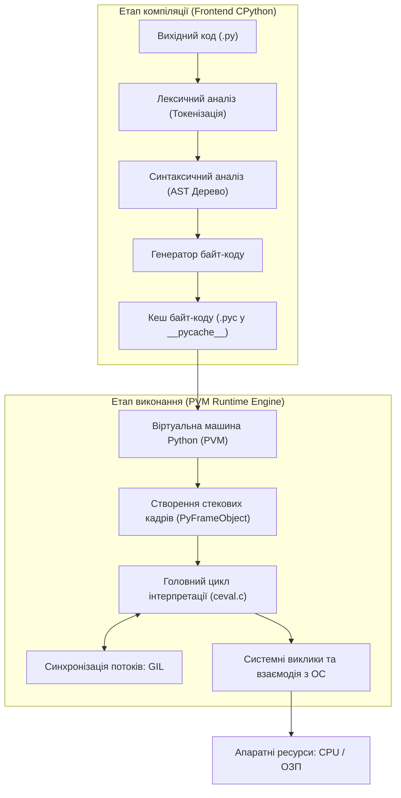
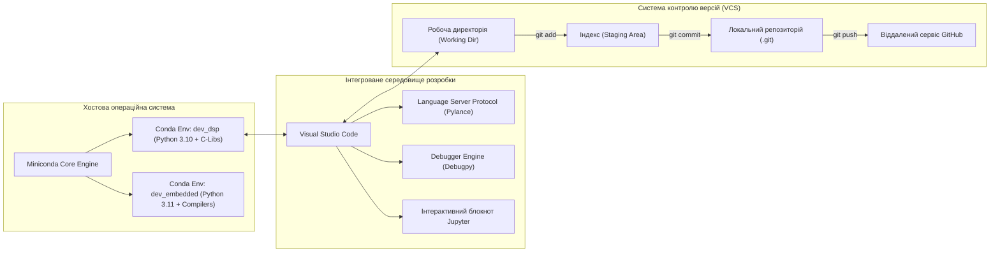
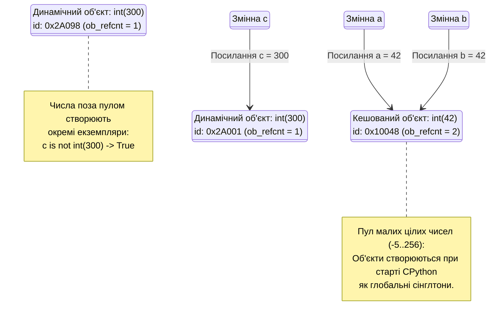

# ЗМІСТОВИЙ МОДУЛЬ 1. ТЕМА 1. АРХІТЕКТУРА МОВИ PYTHON, ІНФРАСТРУКТУРА РОЗРОБНИКА ТА МОДЕЛЬ СКАЛЯРНИХ ДАНИХ

---

## 1.1. Архітектура та принципи виконання коду в Python: CPython, компіляція у байт-код (.pyc), віртуальна машина Python (PVM), поняття GIL (Global Interpreter Lock)

### Основний зміст та теоретичний базис

Мова програмування Python у своїй канонічній реалізації базується на дворівневій моделі обробки вихідного коду, яка поєднує попередню компіляцію у проміжне представлення та подальшу інтерпретацію віртуальною машиною. На відміну від чисто компільованих мов програмування, таких як C або C++, де вихідний текст транслюється безпосередньо в бінарні інструкції цільового процесора, та суто інтерпретованих мов першого покоління, де аналіз синтаксису здійснюється безпосередньо під час виконання кожного рядка, Python застосовує високоефективну гібридну архітектуру. 


*Рисунок 1 — Багаторівневий конвеєр компіляції та виконання програми в середовищі CPython*

Наведемо детальний аналіз процесів, відображених на схемі архітектурного конвеєра. Процес обробки програми розпочинається з трансляції вихідного коду з розширенням `.py`. На першому етапі лексичний аналізатор розбиває символьний потік на неподільні елементарні лексеми, після чого синтаксичний парсер формує абстрактне синтаксичне дерево (Abstract Syntax Tree, AST). Генератор байт-коду обробляє це дерево і транслює його в компактну послідовність низькорівневих платформно-незалежних інструкцій. 

Згенерований байт-код зберігається на диску у спеціальних файлах з розширенням `.pyc`, розміщених у піддиректоріях `__pycache__`. Метою створення таких файлів є оптимізація часу повторного завантаження програмних модулів. Файл кешу байт-коду містить чотирибайтне магічне число (magic number), яке кодує версію формату байт-коду, часову мітку або бітовий хеш вихідного файлу, а також серіалізований об'єкт програмного коду (`PyCodeObject`). 

Під час повторного запуску інтерпретатор перевіряє часову мітку вихідного файлу `.py` та порівнює її з метаданими у заголовку відповідного `.pyc`. Якщо вихідний файл не зазнав змін, етап побудови абстрактного синтаксичного дерева та генерації байт-коду повністю пропускається, а серіалізовані інструкції зчитуються безпосередньо з кешу, що суттєво скорочує час ініціалізації середовища.

Виконання згенерованого байт-коду бере на себе віртуальна машина Python (Python Virtual Machine, PVM). PVM є програмним емулятором стекового процесора, у якому відсутні апаратні регістри загального призначення, а всі обчислення, передача аргументів та повернення результатів функцій реалізуються через динамічний стек оцінювання (evaluation stack). 

Ядром віртуальної машини виступає монолітний цикл обробки інструкцій, реалізований у вихідному коді CPython у файлі `ceval.c`. Для виконання кожної окремої інструкції PVM створює об'єкт контексту виконання — стековий кадр (`PyFrameObject`), який інкапсулює локальний простір імен, покажчик на глобальний простір імен, стек обчислень та поточний стан лічильника команд.

Фундаментальною архітектурною особливістю еталонного інтерпретатора CPython є наявність механізму глобального блокування інтерпретатора (Global Interpreter Lock, GIL). GIL являє собою м'ютекс взаємного виключення, розроблений для запобігання стану гонитви (race conditions) при паралельному доступі потоків до внутрішніх структур пам'яті CPython, зокрема до лічильників посилань на об'єкти (`ob_refcnt`). 

Через наявність GIL у будь-який момент часу тільки один потік операційної системи може виконувати байт-код Python у межах одного процесу інтерпретатора. У випадках, коли програма розпаралелює обчислювальні задачі (CPU-bound tasks) через стандартний модуль `threading`, кілька потоків не здатні задіяти ресурси багатоядерних процесорів одночасно, оскільки вони конкурують за захоплення єдиного м'ютекса GIL. 

Для розрахункових завдань у комп'ютерній інженерії зазначене обмеження долається за рахунок використання багатопроцесорної парадигми (модуль `multiprocessing`), винесення ресурсомістких циклів у бібліотеки, реалізовані мовами C/C++ із тимчасовим вивільненням GIL через макрос `Py_BEGIN_ALLOW_THREADS`, або застосування альтернативних інтерпретаторів.

Таблиця 1.1 систематизує ключові характеристики основних реалізацій мови Python, які суттєво відрізняються архітектурою віртуальних машин та підходами до синхронізації пам'яті.

*Таблиця 1.1 — Порівняльний аналіз реалізацій середовища виконання мови Python*

| Реалізація | Базова мова реалізації | Модель виконання та компіляції | Наявність GIL | Цільова сфера інженерного застосування |
| :--- | :--- | :--- | :--- | :--- |
| **CPython** | C | Компіляція в байт-код, інтерпретація на PVM | Присутній | Еталонна реалізація загального призначення, системне програмування |
| **PyPy** | RPython | Байт-код інтерпретатор із вбудованим трасуючим JIT-компілятором | Присутній | Високопродуктивні математичні та алгоритмічні обчислення |
| **Jython** | Java | Компіляція в байт-код JVM, виконання на JVM | Відсутній | Пряма інтеграція з корпоративною інфраструктурою на платформі Java |
| **IronPython**| C# | Компіляція у проміжний код CIL (.NET CLR) | Відсутній | Інтеграція з екосистемою Microsoft .NET та платформою Windows |
| **RustPython**| Rust | Інтерпретатор байт-коду, безпека пам'яті | Відсутній / Експер. | Вбудовані системи, WebAssembly, мікроконтролерні платформи |

Як свідчать наведені дані, вибір середовища виконання безпосередньо визначає стратегію оптимізації та розпаралелювання програмного продукту. CPython залишається промисловим стандартом завдяки широкій бінарній сумісності із зовнішніми бібліотеками, тоді як альтернативні реалізації застосовуються у специфічних інфраструктурних сценаріях, де критичною є відсутність глобального блокування або інтеграція з іншими віртуальними машинами.

---

## 1.2. Професійна екосистема розробника: дистрибутив Miniconda, ізольовані оточення conda/venv, інтегроване середовище VS Code та система контролю версій Git/GitHub

### Основний зміст та теоретичний базис

Розробка сучасних програмних комплексів для комп'ютерної інженерії вимагає суворого структурування інструментального середовища, запобігання конфліктам версій бібліотек та підтримки повної відтворюваності експериментів. Якщо встановлювати сторонні пакунки безпосередньо в глобальне оточення операційної системи, виникає явище «конфлікту залежностей» (dependency hell), коли різні програмні модулі вимагають взаємовиключних версій одних і тих самих динамічних бібліотек чи інтерпретатора.

Для розв'язання проблеми ізоляції програмних залежностей використовуються два фундаментальні підходи: стандартний легковиковий інструмент `venv` та кросплатформна система управління бінарними пакунками й середовищами `conda`, оптимізована у вигляді мінімалістичного дистрибутива Miniconda. 

Утиліта `venv`, яка інтегрована безпосередньо в стандартну бібліотеку Python, створює ізольовану структуру каталогів, що містить копію або символьне посилання на бінарний виконуваний файл інтерпретатора, власний каталог `site-packages` та локальні скрипти управління. Проте `venv` здатний керувати виключно пакунками мови Python, які інсталюються за допомогою менеджера `pip` у вигляді збірок Wheel або вихідного коду, що вимагає наявності локальних компіляторів C/C++ для встановлення бібліотек із низькорівневими розширеннями.

На відміну від `venv`, дистрибутив Miniconda є повнофункціональним менеджером системних залежностей. Контейнеризація на рівні середовищ conda забезпечує встановлення попередньо скомпільованих бінарних файлів, включаючи системні бібліотеки лінійної алгебри (BLAS, LAPACK), драйвери взаємодії з апаратними прискорювачами (NVIDIA CUDA toolkit) та скомпільовані компілятори мов C/Fortran. Це перетворює Miniconda на незамінний інструмент при проектуванні систем моделювання та обробки телеметрії.


*Рисунок 2 — Архітектура взаємодії компонентів робочого простору інженера-програміста*

Взаємозв'язок інструментів, продемонстрований на схемі, показує, що сучасна розробка поєднує ізольоване середовище виконання, інтелектуальну платформу написання коду та розподілену систему контролю версій. 

Основним інструментом редагування та налагодження коду виступає Visual Studio Code (VS Code). Завдяки клієнт-серверній архітектурі та підтримці протоколу мовного сервера (Language Server Protocol, LSP), редактор взаємодіє з мовним сервером Pylance, який виконує фоновий синтаксичний аналіз, контроль відповідності стандарту стилю коду PEP 8, інтелектуальне автодоповнення та статичну перевірку типів. 

Інтегрований налагоджувач дозволяє виконувати покрокову трасування інструкцій (Step Over, Step Into, Step Out), встановлювати умовні точки зупинки (conditional breakpoints), переглядати стековий кадр викликів та досліджувати поточний стан пам'яті через панель інспекції змінних.

Паралельно з традиційними скриптами `.py`, середовище розробки підтримує формат інтерактивних обчислень Jupyter Notebooks (`.ipynb`). Структура блокнота Jupyter являє собою документ формату JSON, розділений на незалежні комірки виконуваного коду та розмітки Markdown. 

Ядро Jupyter (IPython kernel) функціонує як окремий процес, який зв'язується з інтерфейсом редактора через протокол обміну повідомленнями ZeroMQ. Це надає можливість виконувати блоки коду у довільному порядку, зберігати проміжні стани пам'яті та безпосередньо візуалізувати математичні графіки й масиви даних.

Невіддільним компонентом професійної інженерної культури є застосування розподіленої системи контролю версій Git та хмарної платформи GitHub. Архітектурно репозиторій Git побудовано на основі спрямованого ациклічного графа (Directed Acyclic Graph, DAG), де кожен вузол (коміт) фіксує незмінний зліпок стану файлової системи за допомогою криптографічних хеш-сум SHA-1 або SHA-256. 

Життєвий цикл змін у Git охоплює три рівні: робочу директорію (Working Directory), область підготовки змін (Staging Area або Index) та локальний репозиторій (Local Repository). 

Для підтримки чистоти репозиторію критичне значення має конфігураційний файл `.gitignore`, який запобігає випадковій фіксації бінарних артефактів компіляції (`__pycache__`, `*.pyc`), віртуальних середовищ (`.venv/`, `miniconda3/`), локальних конфігурацій IDE (`.vscode/`) та тимчасових даних блокнотів (`.ipynb_checkpoints`). 

Таблиця 1.2 порівнює інструменти ізоляції робочих середовищ за фундаментальними технічними критеріями.

*Таблиця 1.2 — Порівняльна характеристика засобів ізоляції середовищ розробки*

| Критерій | Python venv | Conda / Miniconda | Docker Container |
| :--- | :--- | :--- | :--- |
| **Рівень ізоляції** | Простір пакунків конкретного інтерпретатора | Інтерпретатор, C-бібліотеки, бінарні утиліти | Повна ізоляція користувацького простору ОС |
| **Керування версією Python** | Використовує тільки вже встановлений хостовий Python | Дозволяє вільно встановлювати будь-яку версію | Дозволяє розгортати будь-яку версію всередині образу |
| **Робота з не-Python залежностями** | Не підтримує (потребує системних компіляторів) | Повноцінне бінарне керування (CUDA, C++, HDF5) | Повна підтримка на рівні пакетного менеджера ОС |
| **Файл фіксації середовища** | `requirements.txt` | `environment.yml` | `Dockerfile`, `docker-compose.yml` |
| **Накладні витрати ресурсів** | Мінімальні (символьні посилання, декілька МБ) | Помірні (окремі бінарні копії, 0.5–2 ГБ) | Високі (шари образів, віртуалізація ядра, 1–10 ГБ) |

Аналіз свідчить, що для вирішення інженерних завдань на мові Python оптимальний баланс між швидкістю розгортання та контролем бінарних залежностей досягається за допомогою дистрибутива Miniconda у поєднанні з системою версіонування Git.

---

## 1.3. Модель пам'яті та типізація: динамічна строга типізація, змінні як посилання, ідентифікація об'єктів та скалярні типи даних

### Основний зміст та теоретичний базис

Класифікація системи типізації мови Python базується на двох фундаментальних властивостях: динамічній типізації та сильній (строгій) типізації. Динамічна типізація означає, що типи даних асоціюються безпосередньо зі значеннями (об'єктами), що розміщені в динамічній пам'яті (купі, heap), а не з ідентифікаторами змінних, як це реалізовано у статично типізованих мовах (C, C++, Java). 

Змінна у Python не є виділеною іменованою коміркою пам'яті фіксованого розміру; вона функціонує виключно як зв'язане ім'я — іменоване посилання (покажчик) на відповідний об'єкт. Сильна типізація забороняє автоматичне неявне приведення несумісних типів у бінарних операціях: спроба обчислення виразу додавання рядка та числа призведе до виникнення винятку `TypeError`, вимагаючи від розробника явного виклику функцій перетворення.

Усі сутності в CPython є повноцінними об'єктами першого класу. На внутрішньому системному рівні будь-який екземпляр скалярного типу описується C-структурою, похідною від базового типу `PyObject`:

```c
typedef struct _object {
    _PyObject_HEAD_EXTRA
    Py_ssize_t ob_refcnt;
    struct _typeobject *ob_type;
} PyObject;
```

де $ob\_refcnt$ позначає 64-бітне ціле число, що є лічильником активних посилань на цей об'єкт із різних областей видимості; $ob\_type$ є покажчиком на структуру типу метаданих (`PyTypeObject`), яка визначає поведінку, підтримувані протоколи операцій та розмір виділеної пам'яті. 

Керування життєвим циклом об'єкта здійснюється автоматично: коли лічильник посилань декрементується до нуля ($ob\_refcnt = 0$), пам'ять, виділена під об'єкт, негайно звільняється системним алокатором `PyObject_Free()`.

Для інспекції характеристик об'єктів мова надає вбудовані функції `id()` та `type()`. Функція `id(obj)` повертає унікальний цілочисельний ідентифікатор, який в інтерпретаторі CPython відповідає фактичній шістнадцятковій фізичній адресі об'єкта у віртуальному адресному просторі процесу:

$$\text{id}(obj) = \text{Address}_{\text{RAM}}(obj)$$

Оператор перевірки тотожності `is` порівнює значення адрес двох операндів, встановлюючи, чи посилаються змінні на один і той самий блок пам'яті:

$$x \text{ is } y \iff \text{id}(x) = \text{id}(y)$$

Натомість оператор рівності `==` делегує виклик магічному методу порівняння значень `__eq__()`, перевіряючи еквівалентність внутрішнього стану даних об'єктів незалежно від їхнього фізичного розташування в адресній пам'яті.

Усі базові скалярні типи даних у Python є строго незмінними (immutable). Це означає, що після ініціалізації об'єкта в динамічній пам'яті його значення не може бути модифіковано. 

Будь-яка операція, яка семантично сприймається як зміна змінної (наприклад, оператор інкременту `x += 1`), насправді створює абсолютно новий об'єкт у купі з новим значенням і перенаправляє посилання змінної на нову адресу, зменшуючи лічильник посилань старого об'єкта.


*Рисунок 3 — Модель розміщення змінних-посилань та оптимізація пулу малих цілих чисел у CPython*

Проаналізуємо схему керування пам'яттю, наведену на рисунку. З метою кардинального зниження накладних витрат на постійне виділення та звільнення пам'яті під типові лічильники, інтерпретатор CPython реалізує оптимізаційний механізм інтернування (Small Integer Cache). 

Під час ініціалізації середовища runtime створює фіксований масив глобальних об'єктів-сінглтонів для всіх цілих чисел у закритому діапазоні $[-5, 256]$. Якщо в коді створюється цілочисельне значення з цього інтервалу, новий об'єкт у купі не алокується — інтерпретатор повертає посилання на вже існуючий екземпляр із пулу. Тому для малих цілих чисел вираз `a is b` завжди повертає `True`. 

Для чисел, що виходять за межі вказаного інтервалу (наприклад, число $300$), щоразу виділяється новий сегмент пам'яті, що демонструє створення незалежних екземплярів `DynObj1` та `DynObj2`.

Розглянемо математичну модель та особливості скалярних типів даних:

**1. Цілі числа (`int`):** У Python 3 реалізовано модель довгої арифметики довільної точності (arbitrary-precision arithmetic). Розмір цілого числа обмежується виключно загальним обсягом доступної оперативної пам'яті комп'ютера. Внутрішньо об'єкт `PyLongObject` зберігає число у вигляді масиву «цифр» за основою $2^{30}$ (на 64-розрядних архітектурах). Це дозволяє без переповнення розрядної сітки обчислювати факторіали або підносити значення у надвеликі степені, наприклад $2^{2048}$. Числові літерали підтримують запис у двійковій (`0b`), вісімковій (`0o`), десятковій та шістнадцятковій (`0x`) системах числення.

**2. Дійсні числа (`float`):** Представляють числа з плаваючою комою подвійної точності за міжнародним стандартом IEEE 754 (еквівалент типу `double` у мові C). Число зберігається у 64 бітах пам'яті: 1 біт знака ($s$), 11 біт зміщеного порядку ($e$), 52 біти мантиси ($m$). Математичне значення числа розраховується за формулою:

$$V = (-1)^s \times \left(1 + \sum_{i=1}^{52} b_{52-i} 2^{-i}\right) \times 2^{e - 1023}$$

де $s \in \{0, 1\}$ — знаковий розряд; $e \in [1, 2046]$ — зміщена експонента; $b_k \in \{0, 1\}$ — біти дробової частини мантиси.

Через неможливість точного подання багатьох десяткових дробів (наприклад, $0.1_{10}$ або $0.2_{10}$) у скінченній двійковій мантисі, операції з плаваючою комою призводять до накопичення похибок округлення: вираз $0.1 + 0.2 == 0.3$ набуває значення `False`. 

У комп'ютерній інженерії коректне порівняння дійсних чисел вимагає перевірки з урахуванням абсолютного або відносного допуску (epsilon) за допомогою формули, реалізованої у функції `math.isclose(a, b)`:

$$|a - b| \le \max\left(\text{rel\_tol} \times \max(|a|, |b|), \text{abs\_tol}\right)$$

де $\text{rel\_tol}$ — максимальне допустиме відносне відхилення (за замовчуванням $10^{-9}$); $\text{abs\_tol}$ — мінімальне абсолютне відхилення, що застосовується при значеннях, близьких до нуля.

**3. Комплексні числа (`complex`):** Вбудований тип, що представляє комплексне число у вигляді пари чисел із плаваючою комою: дійсної ($x = \text{Re}(z)$) та уявної ($y = \text{Im}(z)$) частин:

$$z = x + y\mathbf{j}, \quad \text{де } \mathbf{j} = \sqrt{-1}$$

Тип підтримує доступ до атрибутів `.real` і `.imag`, знаходження спряженого значення через `.conjugate()`, а також полярні та тригонометричні перетворення через спеціалізований системний модуль `cmath`.

**4. Логічний тип (`bool`):** Логічний тип є прямим підкласом цілого числа (`issubclass(bool, int) == True`) і містить рівно два незмінні екземпляри-сінглтони: `True` та `False`. На машинному рівні вони мають числові еквіваленти $1$ та $0$, завдяки чому логічні змінні можуть брати участь у арифметичних операціях ($\text{True} + \text{True} = 2$). Усі порожні об'єкти (число $0$, порожні рядки `""`, списки `[]`, словники `{}`) у логічному контексті інтерпретуються як `False`, тоді як будь-які ненульові чи непорожні структури еквівалентні `True`.

**5. Тип відсутності значення (`NoneType`):** Представлений єдиним глобальним об'єктом-сінглтоном `None`, який сигналізує про відсутність результату обчислення, порожній стан змінної або значення за замовчуванням для неініціалізованих параметрів функцій.

Операції над скалярними типами даних поділяються на арифметичні, логічні та побітові. Арифметичні операції включають стандартне додавання (`+`), віднімання (`-`), множення (`*`), ділення з отриманням дійсного результату (`/`), ділення націло (`//`), взяття залишку (`%`) та піднесення до степеня (`**`). Залишок від цілочисельного ділення задовольняє інваріанту:

$$a = (a // b) \times b + (a \% b)$$

причому знак залишку $a \% b$ у Python завжди збігається зі знаком дільника $b$, що відрізняє поведінку оператора від мов C/C++.

Логічні операції `and`, `or`, `not` працюють за короткою схемою обчислення (short-circuit evaluation). Оператор `x and y` повертає значення першого хибного операнда або значення $y$, якщо $x$ істинний. Оператор `x or y` повертає перший істинний операнд або $y$, якщо $x$ хибний.

Побітові операції виконуються виключно над цілими числами (`int`) у їхньому двійковому представленні за правилами додаткового двійкового коду (two's complement):
* Побітове І (`x & y`): встановлює $1$ у біті результату тоді і тільки тоді, коли відповідні біти обох операндів рівні $1$.
* Побітове АБО (`x | y`): встановлює $1$, якщо хоча б один із відповідних бітів операндів дорівнює $1$.
* Побітове виключне АБО (`x ^ y`): встановлює $1$, якщо значення відповідних бітів операндів різні.
* Побітова інверсія (`~x`): інвертує всі біти двійкового представлення числа, що математично відповідає залежності:

$$\sim x = -(x + 1)$$

* Побітові зсуви ліворуч (`x << n`) та праворуч (`x >> n`): здійснюють зсув бітового вектора на $n$ розрядів, що еквівалентно множенню або цілочисельному діленню на степінь двійки:

$$x \ll n = x \times 2^n, \quad x \gg n = \lfloor x / 2^n \rfloor$$

Побітові маски широко застосовуються в комп'ютерній інженерії для керування регістрами зовнішніх інтерфейсів, упакування бітових полів протоколів передачі даних та низькорівневого аналізу апаратного стану систем.

*Таблиця 1.3 — Фундаментальні характеристики скалярних типів даних CPython*

| Тип даних | Базова C-структура в CPython | Мутабельність | Базовий розмір у пам'яті (порожній / мінімальний) | Діапазон значень / Точність | Механізми оптимізації пам'яті |
| :--- | :--- | :--- | :--- | :--- | :--- |
| **`int`** | `PyLongObject` | Незмінний | 28 байтів (для 0) + 4 або 8 байтів на розряд | Необмежений (довга арифметика) | Small Integer Cache (пул чисел $[-5, 256]$) |
| **`float`** | `PyFloatObject` | Незмінний | 24 байти | IEEE 754 Double (~15–17 десяткових знаків) | Вільний список (free list) виділених структур |
| **`complex`**| `PyComplexObject` | Незмінний | 32 байти | Пара 64-бітних значень IEEE 754 | Пряме розміщення двох `double` у структурі |
| **`bool`** | `PyLongObject` (subclass) | Незмінний | 28 байтів | `True`, `False` ($1$ та $0$) | Глобальні об'єкти-сінглтони |
| **`NoneType`**| `PyObject` | Незмінний | 16 байтів | Тільки значення `None` | Єдиний глобальний сінглтон (`Py_None`) |

Наведені у таблиці дані демонструють значний базовий оверхед об'єктів у CPython порівняно з примітивними типами мови C (де ціле число займає лише 4 байти). Кожен скалярний об'єкт несе додаткові витрати на зберігання лічильника посилань, покажчика на тип та метаданих довжини, що компенсується гнучкістю динамічної моделі пам'яті та безпекою роботи середовища.

---

### Питання для самоперевірки та аналітичного осмислення

1. Яким чином взаємодіють етап попередньої компіляції вихідного тексту у байт-код та віртуальна машина PVM у середовищі CPython? Які метадані зберігаються у файлах `.pyc` для валідації актуальності кешу?
2. Охарактеризуйте призначення та принцип функціонування механізму Global Interpreter Lock (GIL). Чому створення кількох потоків у межах модуля `threading` не забезпечує приросту швидкодії для обчислювально-складних задач (CPU-bound) на багатоядерних процесорах?
3. У чому полягає принципова відмінність ізоляції робочих середовищ за допомогою `venv` від розгортання оточень у дистрибутиві Miniconda при роботі з низькорівневими бінарними бібліотеками?
4. Поясніть концепцію «змінна як посилання на об'єкт» у мові Python. Чим семантично відрізняється виконання оператора перевірки тотожності `is` від оператора перевірки рівності значень `==`?
5. Опишіть роботу механізму кешування малих цілих чисел (Small Integer Cache) у CPython. Які системні фактори зумовили вибір фіксованого інтервалу $[-5, 256]$ для пулу сінглтонів?
6. Чому при роботі з дійсними числами типу `float` виникають похибки обчислень на кшталт $0.1 + 0.2 \neq 0.3$? Які математичні критерії та функції слід застосовувати для їх коректного порівняння в інженерних розрахунках?
7. Розкрийте фізичний та математичний зміст операції побітової інверсії `~x` над цілими числами. Чому результат обчислення виразу `~9` дорівнює `-10` з точки зору додаткового двійкового коду?