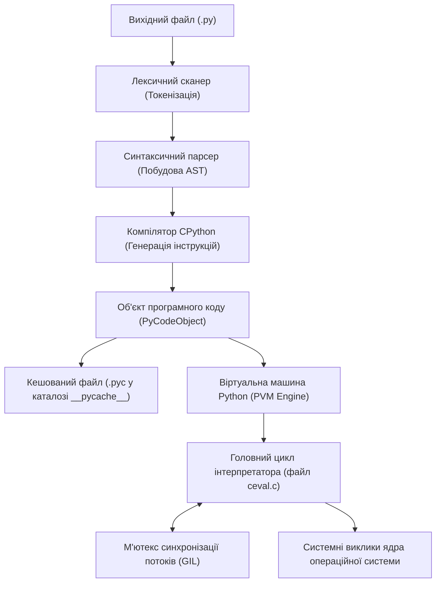
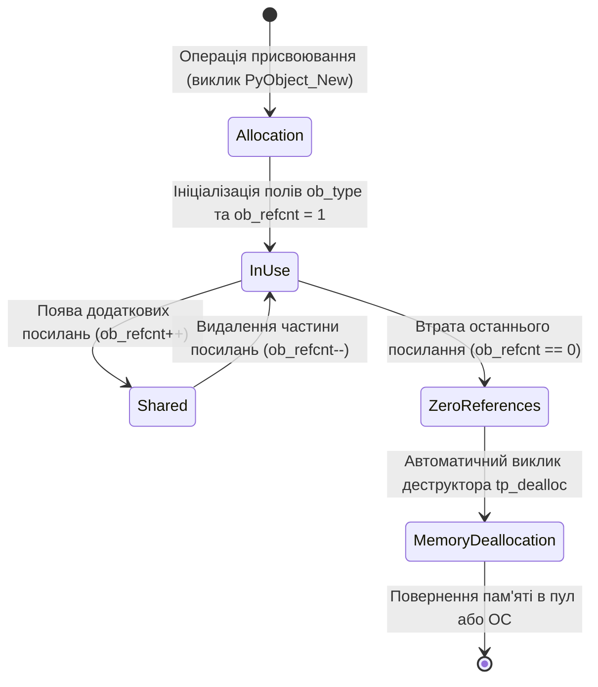
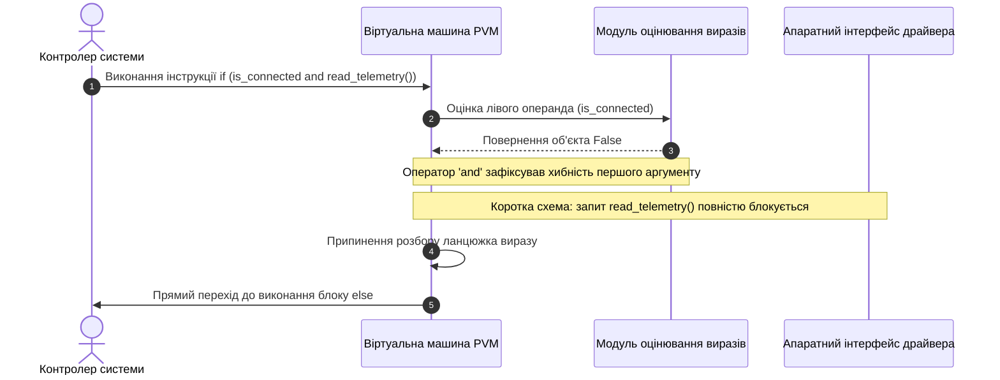
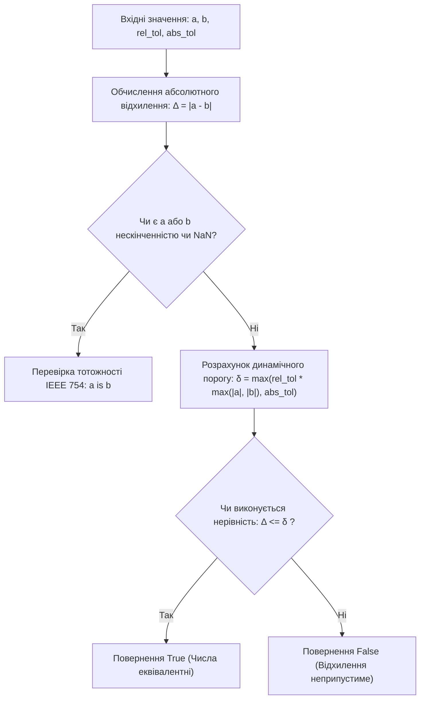
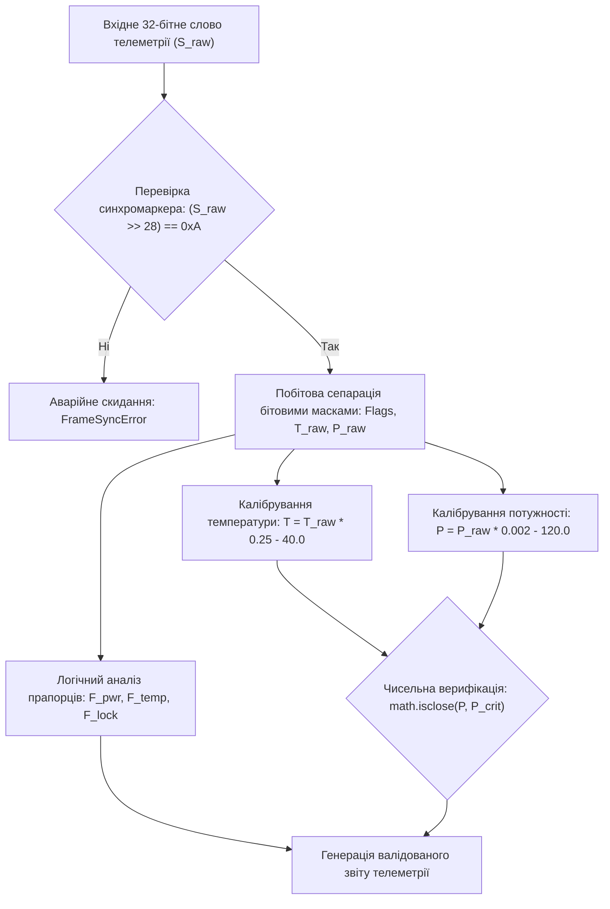

# Тема 1. Архітектура мови Python, інфраструктура розробника та модель скалярних даних

## Мета лекції

Мета лекції полягає у формуванні в майбутніх інженерів фундаментального системного розуміння внутрішніх механізмів функціонування інтерпретатора Python, його архітектурного конвеєра трансляції вихідного коду у байт-код та принципів роботи віртуальної машини PVM, а також у всебічному опануванні низькорівневої моделі керування пам'яттю, принципів представлення базових скалярних типів даних та інструментарію побудови відтворюваних середовищ розробки, що створює критично необхідний теоретичний і практичний базис для проектування надійних систем цифрової обробки інформації, засобів автоматизації та інженерного програмного забезпечення.

## Очікувані результати навчання

1. **Знання та розуміння.** Студенти оволодіють знаннями про дворівневу модель виконання програм у CPython, призначення та структуру байт-коду, архітектуру віртуальної машини PVM, механізм синхронізації потоків GIL, а також про структурну організацію скалярних об'єктів у динамічній пам'яті.
2. **Застосування.** Здобувачі вищої освіти набудуть умінь самостійно розгортати ізольовані виробничі середовища за допомогою Miniconda, інтегрувати робочий простір з редактором Visual Studio Code та розподіленою системою контролю версій Git, а також реалізовувати обчислювальні сценарії з використанням скалярних величин і модуля математичних функцій.
3. **Аналіз.** Майбутні фахівці зможуть досліджувати внутрішній стан об'єктів за їхніми фізичними адресами в оперативній пам'яті, аналізувати поведінку системного пулу кешування малих цілих чисел та виявляти приховані похибки округлення при роботі з числами подвійної точності за стандартом IEEE 754.
4. **Оцінювання та синтез.** Студенти навчаться критично оцінювати обмеження продуктивності інтерпретатора при розпаралелюванні обчислювальних процесів, проектувати надійні логічні фільтри з урахуванням концепції коротких схем обчислення та розробляти алгоритмічні модулі для низькорівневої обробки телеметричних потоків даних апаратури.

---

## Детальний покроковий план лекції

### 1. Теоретико-концептуальний базис. Архітектурні засади інтерпретатора CPython та скалярна модель даних
* 1.1. Дворівневий конвеєр компіляції та виконання програми: трансляція синтаксичного дерева AST у байт-код, формат файлів кешу (.pyc), цикл інтерпретації віртуальної машини PVM та природа глобального блокування інтерпретатора GIL.
* 1.2. Інженерна екосистема розробки: створення ізольованих середовищ засобами дистрибутива Miniconda порівняно з venv, конфігурація середовища VS Code та фіксація станів проекту в розподіленій системі Git.
* 1.3. Внутрішня модель пам'яті CPython: динамічна типізація, змінні як посилання на C-структури, лічильники посилань ob_refcnt, системні ідентифікатори та незмінність скалярних об'єктів.
* 1.4. Базові скалярні типи: довга арифметика цілих чисел, представлення дійсних чисел за стандартом IEEE 754, комплексна площина, булева логіка та об'єкт відсутності значення None.

### 2. Методологія та аналіз граничних умов. Логічні операції, розгалуження та обмеження точності
* 2.1. Концепція істинності об'єктів (truthiness) та робота логічних операторів за короткою схемою (short-circuit evaluation).
* 2.2. Керування потоком інструкцій: семантика блоків відступів, повна форма умовного оператора if-elif-else та компактний тримісний вираз вибору.
* 2.3. Побітові операції над цілими числами у додатковому коді як інструмент побітового маскування апаратних прапорців.
* 2.4. Критичні бар'єри та обмеження чисельних типів: похибки двійкового дробового представлення, неможливість точного порівняння чисел з плаваючою комою та застосування функції math.isclose.
* 2.5. Стандартизоване потокове введення-виведення через sys.stdin і sys.stdout та сучасні методи форматування числових даних.

### 3. Практичний індустріальний / фаховий кейс. Первинна обробка та верифікація апаратних потоків даних
**Тема наскрізної задачі.** «Розробка модуля валідації, побітового маскування та калібрування пакетів телеметрії супутникового сенсора радіозв'язку»


## 1. Теоретико-концептуальний базис. Архітектурні засади інтерпретатора CPython та скалярна модель даних

### 1.1. Дворівневий конвеєр компіляції та виконання програми: трансляція синтаксичного дерева AST у байт-код, формат файлів кешу (.pyc), цикл інтерпретації віртуальної машини PVM та природа глобального блокування інтерпретатора GIL

Еталонна реалізація мови Python, відома як **CPython**, функціонує за дворівневою гібридною моделлю обробки програмного коду. Ця модель принципово відрізняється як від прямої компіляції в машинний код цільового процесора, властивої мовам C або Rust, так і від суто рядкової інтерпретації класичних командних скриптів. Вся кодова база на мові Python перед виконанням проходить обов'язковий етап трансляції у машинно-незалежне проміжне представлення фіксованого формату, що має назву **байт-код**.

Конвеєр обробки вихідного файлу починається з лексичного аналізатора, який розбиває вхідний потік символів на неподільні елементарні лексеми відповідно до граматичних правил мови. Далі синтаксичний парсер перетворює послідовність лексем на абстрактне синтаксичне дерево (**Abstract Syntax Tree, AST**), яке формалізує ієрархічні зв'язки між виразами, керуючими структурами та блоками інструкцій. Спеціалізований компілятор CPython аналізує побудоване синтаксичне дерево і транслює його в лінійний масив байт-кодових інструкцій, упакованих у внутрішній системний об'єкт програмного коду, який у термінах мови C має тип `PyCodeObject`.



Для оптимізації повторного завантаження програмних модулів скомпільований об'єкт коду серіалізується на диск у бінарний файл із розширенням `.pyc`, який розміщується в автоматично створюваній піддиректорії `__pycache__`. Заголовок файлу `.pyc` містить службові метадані, необхідні для швидкої валідації кешу:
1. Чотирибайтне магічне число, перші два байти якого змінюються з кожною ревізією формату байт-коду CPython, а наступні два містять символи повернення каретки та нового рядка.
2. Чотирибайтне бітове поле прапорців, що визначає стратегію перевірки цілісності кешу.
3. Метадані відповідності вихідного коду, які залежно від прапорців містять або 32-бітну часову мітку останньої модифікації вихідного скрипта разом із його розміром, або 64-бітний криптографічний хеш вмісту файлу.
4. Серіалізований за алгоритмом Marshal об'єкт `PyCodeObject`, що містить власне байт-код, кортежі констант та таблиці імен змінних.

Якщо часова мітка або хеш вихідного скрипта збігаються з даними у заголовку файлу `.pyc`, інтерпретатор повністю оминає етапи токенізації, побудови синтаксичного дерева та трансляції, негайно завантажуючи готовий байт-код безпосередньо у віртуальну машину.

Безпосереднє виконання інструкцій здійснює віртуальна машина Python (**Python Virtual Machine, PVM**). Архітектурно PVM спроектована як абстрактний стековий процесор. У ній відсутні фізичні регістри загального призначення, а виконання будь-яких обчислень чи викликів функцій базується на завантаженні операндів на динамічний стек оцінювання та наступному знятті результату. Робочим тілом PVM є гігантський оператор вибору у вихідному коді ядра CPython у файлі `ceval.c`, де кожна команда байт-коду (операція довжиною в один або два байти з відповідним числовим аргументом) запускає виконання відповідного фрагмента низькорівневого C-коду. Для ізоляції контексту виконання функцій PVM динамічно створює стекові кадри (`PyFrameObject`), що містять локальну таблицю імен, покажчик на глобальний простір імен модуля та покажчик на попередній стек виклику.

Фундаментальним обмеженням архітектури CPython виступає глобальне блокування інтерпретатора (**Global Interpreter Lock, GIL**). GIL являє собою системний м'ютекс взаємного виключення операційної системи, покликаний усунути стан гонитви при модифікації структур внутрішньої пам'яті CPython. Оскільки механізм керування пам'яттю спирається на неатомарне оновлення лічильників посилань на об'єкти, паралельний доступ кількох нативних потоків без централізованого блокування призвів би до деградації структур інтерпретатора. Як наслідок, у межах одного процесу CPython одночасно виконувати інструкції байт-коду може тільки один потік, навіть якщо апаратна платформа налічує десятки фізичних ядер процесора. Для завдань із домінуванням обчислень на центральному процесорі стандартна багатопоточність не забезпечує паралелізму, змушуючи інженерів переходити на використання окремих процесів операційної системи.

> **ПРАКТИЧНИЙ ЯКІР:** У промислових системах комп'ютерного зору на базі бібліотеки OpenCV та чисельних розрахунків NumPy ресурсомісткі математичні цикли реалізовані мовами C/C++. Перед початком таких важких векторних обчислень ці бібліотеки викликають макрос CPython `Py_BEGIN_ALLOW_THREADS`, який тимчасово вивільняє м'ютекс GIL. Це дозволяє нативному C-коду задіяти всі ядра центрального процесора на повну потужність, поки основний потік інтерпретатора Python перебуває в режимі очікування.

---

### 1.2. Інженерна екосистема розробки: створення ізольованих середовищ засобами дистрибутива Miniconda порівняно з venv, конфігурація середовища VS Code та фіксація станів проекту в розподіленій системі Git

Розробка надійного інженерного програмного забезпечення вимагає суворої детермінованості системного оточення. Якщо інсталювати пакети бібліотек у глобальний каталог операційної системи, неминуче виникає конфлікт версій спільних залежностей, відомий як «dependency hell». Для запобігання подібним ситуаціям у професійній практиці застосовують технології віртуальних ізольованих середовищ.

Вбудований у стандартну поставку Python модуль `venv` вирішує завдання ізоляції шляхом створення локальної копії структури каталогів, яка включає символьне посилання на системний виконуваний файл інтерпретатора, власний каталог `site-packages` та командні файли активації оточення. Проте інструмент `venv` разом із пакетним менеджером `pip` оперує виключно залежностями рівня мови Python. Якщо бібліотека вимагає зовнішніх скомпільованих динамічних бібліотек мови C, обчислювальних ядер лінійної алгебри BLAS/LAPACK або драйверів апаратних прискорювачів обчислень, розробник змушений самостійно розгортати в операційній системі компілятори C++ та супутні системні заголовні файли.

На противагу цьому, дистрибутив **Miniconda**, що базується на менеджері пакетів `conda`, є повноцінною системою керування бінарними залежностями на системному рівні. Середовища `conda` здатні інкапсулювати не лише модулі Python, але й сторонні системні бібліотеки компіляторів, графічні драйвери та специфічні версії самого інтерпретатора, повністю ізолюючи проєкт від стану хостової операційної системи. 

Таблиця 1.1 систематизує ключові компоненти сучасної інженерної екосистеми, які формують основу робочого середовища розробника.

*Таблиця 1.1 — Систематизація інструментального стека інженера-програміста*

| Категорія інструменту | Технологічне рішення | Архітектурний механізм | Приклад з реальної практики |
| :--- | :--- | :--- | :--- |
| **Керування середовищем** | Miniconda (Conda Engine) | Ізоляція бінарних версій системних компіляторів, інтерпретатора та C-бібліотек у пісочницю | Розгортання стека SciPy та CUDA Toolkit без інсталяції системних драйверів у хостову ОС |
| **Керування бібліотеками** | Python `venv` + `pip` | Створення локального каталогу `site-packages` зі зміною системної змінної шляхів `PATH` | Створення мікросервісу на базі FastAPI з фіксацією чистих Python-залежностей у `requirements.txt` |
| **Редагування та налагодження** | Visual Studio Code | Клієнт-серверна модель на базі Language Server Protocol (LSP Pylance) та налагоджувача Debugpy | Трасування стекових кадрів телеметричного сервера з установкою точок зупинки за умовою |
| **Інтерактивні обчислення** | Jupyter Notebook (IPython) | Двокомпонентна взаємодія веб-інтерфейсу з ядром через протокол обміну повідомленнями ZeroMQ | Експериментальний аналіз та побудова спектрограм сигналів за допомогою бібліотеки Matplotlib |
| **Контроль версій** | Git / GitHub | Спрямований ациклічний граф (DAG) незмінних станів файлової системи на базі хешів SHA | Командна розробка бортового алгоритму з ізоляцією експериментальних гілок та кодовим рецензуванням |

Інтегроване середовище розробки Visual Studio Code (VS Code) використовує модульну архітектуру. Взаємодія з кодом реалізується через мовний сервер Pylance, який виконує фоновий синтаксичний розбір, перевірку відповідності стилю коду стандарту **PEP 8**, статичний аналіз типів та динамічну підказку сигнатур функцій. Інтегрований налагоджувач дозволяє зупиняти виконання програми на довільному рядку, здійснювати покрокову трасування інструкцій та проводити інспекцію внутрішнього стану пам'яті. 

Керування версіями реалізується розподіленою системою **Git**. Архітектура Git побудована на зберіганні знімків файлової системи у вигляді спрямованого ациклічного графа комітів. Критично важливим елементом інженерного репозиторію є файл `.gitignore`. До нього обов'язково вносяться шаблони, що виключають збереження тимчасових та бінарних артефактів: кешу компіляції (`__pycache__/`, `*.pyc`), віртуальних оточень (`.venv/`, `miniconda3/`), локальних параметрів редактора (`.vscode/`) та службових каталогів блокнотів (`.ipynb_checkpoints/`).

---

### 1.3. Внутрішня модель пам'яті CPython: динамічна типізація, змінні як посилання на C-структури, лічильники посилань ob_refcnt, системні ідентифікатори та незмінність скалярних об'єктів

Система типізації мови Python має дві фундаментальні характеристики: вона є **динамічною** та **строгою (сильною)**. Динамічна природа означає, що зв'язування типу даних здійснюється не на етапі компіляції програми, а безпосередньо в процесі виконання під час створення конкретного об'єкта в динамічній пам'яті. Змінна в Python позбавлена внутрішнього типу; вона не резервує фіксовану кількість байтів у пам'яті, як це відбувається зі змінними у статично типізованих мовах. Змінна є лише іменованим посиланням, покажчиком на об'єкт, який розташовано у купі (**heap**). Сильна типізація виключає неявне автоматичне перетворення несумісних типів у бінарних операціях: спроба додати число до рядка без явного приведення негайно викликає аварійне завершення з винятком `TypeError`.

Усі сутності в інтерпретаторі CPython реалізовані як C-структури, похідні від базового типу `PyObject`. Спрощене визначення цієї базової структури має такий вигляд:

```c
typedef struct _object {
    _PyObject_HEAD_EXTRA
    Py_ssize_t ob_refcnt;
    struct _typeobject *ob_type;
} PyObject;
```

Кожен об'єкт у пам'яті несе в собі системний оверхед, що складається мінімум із двох фундаментальних полів:
* $ob\_refcnt$ — 64-бітне ціле число, що є лічильником активних посилань на цей екземпляр з боку змінних, списків, аргументів та внутрішніх механізмів інтерпретатора.
* $ob\_type$ — системний покажчик на структуру метаданих типу (`PyTypeObject`), яка визначає, якими властивостями володіє об'єкт, які оператори підтримує та скільки фізичної пам'яті займає.

Для контролю стану об'єктів мова надає дві базові функції: функцію визначення типу `type(obj)` та функцію отримання системного ідентифікатора `id(obj)`. В еталонній реалізації CPython функція `id()` повертає ціле десяткове число, яке точно відповідає фізичній адресі структури `PyObject` у віртуальному адресному просторі процесу:

$$\text{id}(obj) = \text{Address}_{\text{RAM}}(obj)$$

Оператор перевірки тотожності `is` порівнює значення адрес у покажчиках двох змінних, перевіряючи, чи посилаються вони на одну й ту саму область пам'яті:

$$a \text{ is } b \iff \text{id}(a) = \text{id}(b)$$

На відміну від нього, оператор рівності `==` ініціює виклик внутрішнього магічного методу `__eq__()`, перевіряючи семантичну еквівалентність значень об'єктів, навіть якщо вони розміщені у зовсім різних ділянках пам'яті.

Всі скалярні типи даних у Python (цілі, дійсні числа, булеві значення) є строго **незмінними (immutable)**. Це означає, що після виділення пам'яті під структуру об'єкта його внутрішній стан не може бути модифіковано жодним оператором. Будь-яка дія, що зовні виглядає як зміна змінної, насправді створює абсолютно новий екземпляр об'єкта в купі та перенаправляє іменоване посилання змінної на нову адресу пам'яті.

Діаграма станів демонструє життєвий цикл скалярного об'єкта в динамічній пам'яті від моменту створення до остаточної деалокації.



Керування пам'яттю реалізовано через підрахунок посилань. Математично стан лічильника посилань $R$ для об'єкта $obj$ описується як сума індикаторів існування посилань у всіх активних контекстах виконання:

$$R(obj) = \sum_{k=1}^{M} p_k, \quad p_k \in \{0, 1\}$$

де $M$ — загальна кількість потенційних джерел посилань (змінних, елементів колекцій, стеків викликів). Як тільки лічильник досягає нуля, об'єкт видаляється миттєво:

$$R(obj) = 0 \implies \text{PyObject\_Free}(obj)$$

Для прискорення роботи з цілими числами та зменшення фрагментації пам'яті розробники CPython запровадили механізм кешування малих цілих чисел (**Small Integer Cache**). Під час ініціалізації середовища створюється глобальний масив цілих чисел у закритому діапазоні від $-5$ до $256$. Якщо під час обчислень створюється число з цього інтервалу, новий об'єкт у купі не виділяється: інтерпретатор повертає посилання на вже існуючий екземпляр-сінглтон.

> **ПРАКТИЧНИЙ ЯКІР:** У довготривалих сервісах моніторингу телеметрії інженери стикаються з неконтрольованим розростанням обсягу оперативної пам'яті (memory leak). Попри наявність автоматичного підрахунку посилань, утворення циклічних зв'язків між складними об'єктами блокує декремент лічильника $R(obj)$ до нуля. Для виявлення таких структур інженери використовують системний модуль `gc`, примусово запускаючи циклічний збирач сміття та налаштовуючи генераційні пороги очищення пам'яті.

> **ТИПОВА ПОМИЛКА:** Початківці часто ототожнюють оператор `is` з оператором `==`. Перевірка рівності чисел через `a is b` може успішно повертати `True` для значень від `-5` до `256` завдяки механізму Small Integer Cache. Проте для чисел поза цим діапазоном, наприклад $a = 257$ та $b = 257$, вираз `a is b` поверне `False`, оскільки інтерпретатор виділить під них дві різні структури в оперативній пам'яті. Порівняння значень величин завжди має здійснюватися виключно оператором `==`.

---

### 1.4. Базові скалярні типи: довга арифметика цілих чисел, представлення дійсних чисел за стандартом IEEE 754, комплексна площина, булева логіка та об'єкт відсутності значення None

Модель скалярних даних CPython представлена п'ятьма основними вбудованими типами, кожен із яких реалізує спеціалізовану математичну поведінку:

**1. Цілі числа (`int`):** У мові Python 3 відсутнє поняття переповнення розрядної сітки процесора для цілих чисел. Тип `int` реалізує довгу арифметику довільної точності на базі внутрішньої C-структури `PyLongObject`. Число зберігається у вигляді масиву «великих цифр» (digits) за основою $2^{30}$ для 64-розрядних систем. Математичне значення довільного цілого числа розраховується за поліноміальною формулою розкладання:

$$N = \text{sgn} \times \sum_{i=0}^{k-1} d_i \cdot \left(2^{30}\right)^i$$

де $\text{sgn} \in \{-1, 1\}$ позначає знак числа; $k$ — кількість елементів у масиві цифр; $d_i \in [0, 2^{30}-1]$ — значення $i$-го розряду масиву. Завдяки цій структурі мова дозволяє обчислювати надвеликі значення, обмежені виключно загальним обсягом доступної оперативної пам'яті комп'ютера.

**2. Дійсні числа (`float`):** На відміну від типу цілих чисел, дійсні числа не мають необмеженої точності. Тип `float` у CPython є апаратним представленням числа з плаваючою комою подвійної точності за стандартом **IEEE 754** (еквівалент типу `double` у мові C). У пам'яті таке число займає рівно 64 біти (8 байтів) власного вмісту (не враховуючи системні поля `PyObject`), які розбиті на три функціональні секції: 1 біт знака ($s$), 11 бітів зміщеної експоненти ($e$) та 52 біти мантиси ($f$). Дійсне десяткове число відновлюється за формулою нормалізованого бінарного кодування:

$$V = (-1)^s \times \left(1 + \sum_{j=1}^{52} b_{52-j} \cdot 2^{-j}\right) \times 2^{e - 1023}$$

де $s \in \{0, 1\}$ — знаковий розряд; $e \in [1, 2046]$ — зміщена цілочисельна експонента; $b_k \in \{0, 1\}$ — двійкові розряди дробової частини мантиси. Оскільки більшість звичних десяткових дробів (наприклад, $0.1$ або $0.2$) у двійковій системі перетворюються на нескінченні періодичні дроби, їхнє усічення до 52 біт призводить до неминучих похибок округлення. Як наслідок, вираз $0.1 + 0.2 == 0.3$ у Python повертає логічне значення `False`.

**3. Комплексні числа (`complex`):** Вбудований числовий тип, призначений для інженерних розрахунків на комплексній площині. Внутрішня структура `PyComplexObject` містить два незалежні 64-бітні поля типу C `double`: одне для збереження дійсної частини ($x = \text{Re}(z)$), інше — для уявної частини ($y = \text{Im}(z)$):

$$z = x + y\mathbf{j}, \quad \text{де } \mathbf{j} = \sqrt{-1}$$

Тип надає прямий доступ до числових атрибутів `.real` і `.imag`, підтримує операцію комплексного спряження через метод `.conjugate()`, а для обчислення трансцендентних функцій комплексного аргументу використовує математичний модуль `cmath`.

**4. Логічний тип (`bool`):** Тип даних `bool` є прямим спадкоємцем типу цілих чисел `int` (`issubclass(bool, int) == True`). Він представлений двома незмінними об'єктами-сінглтонами: `True` та `False`. На машинному рівні вони мають числові еквіваленти $1$ та $0$, що дозволяє їм брати участь у чисельних виразах. У мові Python реалізовано концепцію узагальненої істинності об'єктів: число $0$, значення `None`, порожні рядки та порожні колекції автоматично приводяться до значення `False`, тоді як будь-які непорожні об'єкти інтерпретуються як `True`.

**5. Тип відсутності значення (`NoneType`):** Цей тип містить єдиний екземпляр-сінглтон `None`. Він використовується для позначення відсутності корисного результату, сигналізації про порожній стан об'єкта або як маркер за замовчуванням для неініціалізованих параметрів у сигнатурах функцій.

> **КОНТРОЛЬНЕ ПИТАННЯ:** Чому обчислення виразу `sys.getsizeof(0)` в інтерпретаторі CPython на 64-розрядній системі повертає 24 або 28 байтів, тоді як примітивний тип `int` у мові C займає лише 4 байти (32 біти)?

<details markdown="1">
<summary>Розгорнути аналіз / відповідь</summary>

**Правильний варіант: Наявність обов'язкового системного заголовка об'єкта `PyObject` та структур підтримки довгої арифметики.**

1. У мові C змінна типу `int` є прямим відображенням чотирибайтової комірки апаратної пам'яті без жодних метаданих. Натомість у CPython ціле число є повноцінним об'єктом динамічної пам'яті (`PyLongObject`). Мінімальний розмір складається з трьох обов'язкових компонентів: 8 байтів для лічильника посилань (`ob_refcnt`), 8 байтів для покажчика на структуру типу `int` (`ob_type`) та 8 байтів для збереження знакової довжини масиву цифр (`ob_size`). Для числа 0 розмір становить 24 байти (в окремих компіляціях 28 байтів з урахуванням вирівнювання пам'яті). Будь-яке ненульове число потребує додатково мінімум 4 або 8 байтів для збереження масиву власне числових розрядів.

2. Аналіз дистракторів:
   * Твердження про те, що Python автоматично резервує пам'ять під можливі текстові коментарі чи назви змінних у структурі самого числа, є хибним: імена змінних зберігаються окремо в словниках просторів імен, а не всередині числових структур.
   * Твердження про те, що розмір спричинений виключно роботою Garbage Collector, є неточним: для скалярних незмінних типів (`int`, `float`) структури відстеження циклічних посилань взагалі відключаються, і об'єкт не містить полів `_PyGC_Head`.

</details>

---

### Вказівки для самостійного осмислення

1. Дослідіть практичну різницю між часом виконання чисельного циклу з піднесенням до степеня засобами чистого CPython та аналогічного циклу з використанням бібліотеки NumPy, пояснивши отриманий результат з точки зору наявності об'єктного оверхеду пам'яті та роботи віртуальної машини PVM.
2. Проаналізуйте вихідний двійковий код скомпільованого файлу з каталогу `__pycache__` за допомогою стандартного системного модуля `dis`, ідентифікувавши базові інструкції стекового процесора PVM для простого математичного виразу.
3. Розрахуйте точне бітове представлення дійсного числа $0.15625$ за стандартом IEEE 754, самостійно виділивши біт знака, зміщену експоненту та двійкову дробову мантису, після чого звірте отримане значення через системний метод `float.hex()`.


## 2. Методологія та аналіз граничних умов. Алгоритмізація розгалужень, булева логіка та граничні стани обчислень

### 2.1. Концепція істинності об'єктів (truthiness) та робота логічних операторів за короткою схемою (short-circuit evaluation)

У мові програмування Python логічний контекст керуючих конструкцій не обмежується значеннями вбудованого типу `bool`. Будь-який екземпляр скалярного чи колекційного типу даних володіє внутрішнім булевим еквівалентом, який обчислюється автоматично під час його оцінювання в умовних виразах. Ця властивість об'єктної моделі має назву **концепція істинності об'єктів (truthiness)**. 

Механізм визначення істинності спирається на внутрішній протокол інтерпретатора. Коли об'єкт потрапляє у логічний контекст, CPython виконує виклик його спеціального методу `__bool__()`, який повинен повертати безпосередньо значення `True` або `False`. Якщо зазначений метод не реалізований у структурі типу, інтерпретатор перевіряє наявність методу визначення довжини `__len__()`: нульова довжина транслюється як хибність, а ненульова — як істинність. 

У разі відсутності обох методів будь-який створений об'єкт за замовчуванням вважається істинним. Хибними у середовищі CPython визнаються виключно строго визначені сутності:
* спеціальний об'єкт відсутності значення `None`;
* логічний літерал `False`;
* числові нулі всіх підтримуваних типів, включаючи ціле `0`, дійсне `0.0` та комплексне `0j`;
* порожні послідовності та колекції довільної природи, до яких належать порожній рядок `""`, порожній кортеж `()`, порожній список `[]`, порожній словник `{}` та порожня множина `set()`.

Логічні оператори `and`, `or` та `not` у мові Python мають унікальну семантику, яка суттєво відрізняє їх від аналогів у компільованих мовах C-родини. Оператори `and` та `or` не приводять результат обчислення до строгого типу `bool`, а повертають безпосередній об'єкт-операнд, на якому завершився процес обчислення виразу. 

Обчислення здійснюється за строго оптимізованим алгоритмом, що отримав назву **коротка схема обчислення (short-circuit evaluation)**. Інтерпретатор аналізує операнди зліва направо і припиняє виконання ланцюжка в той момент, коли кінцевий логічний результат стає однозначно визначеним.

Діаграма послідовності ілюструє часову взаємодію компонентів середовища виконання CPython під час обчислення складного умовного виразу, демонструючи механізм запобігання зайвим або аварійним викликам завдяки короткій схемі.



Математична формалізація процесу прийняття рішення операторами короткої схеми описується за допомогою покрокового алгоритму зведення виразу:

$$
\begin{aligned}
\text{Крок 1 (Оцінка лівого операнда):} & \quad \beta_1 = \mathbf{bool}(x) \\
\text{Крок 2 (Маршрутизація оператора and):} & \quad \text{Result}_{and} = 
\begin{cases} 
x, & \text{якщо } \beta_1 = \text{False} \\ 
y, & \text{якщо } \beta_1 = \text{True} 
\end{cases} \\
\text{Крок 3 (Маршрутизація оператора or):} & \quad \text{Result}_{or} = 
\begin{cases} 
x, & \text{якщо } \beta_1 = \text{True} \\ 
y, & \text{якщо } \beta_1 = \text{False} 
\end{cases}
\end{aligned}
$$

де функція $\mathbf{bool}(x)$ відображає проєкцію об'єкта домену $x \in \mathbb{U}$ на множину булевих істинностей $\{\text{True}, \text{False}\}$. 

Практична важливість короткої схеми полягає у можливості створення безпечних конструкцій перевірки стану пам'яті. Вираз `obj is not None and obj.value > 0` гарантує, що звернення до атрибута `.value` ніколи не призведе до фатального винятку `AttributeError`, оскільки за умови рівності покажчика об'єкту `None` правий операнд навіть не буде переданий на інтерпретацію.

---

### 2.2. Керування потоком інструкцій: семантика блоків відступів, повна форма умовного оператора if-elif-else та компактний тримісний вираз вибору

Ключовою синтаксичною відмінністю мови Python є використання просторових відступів для формування лексичних блоків коду замість явних операторних дужок. Лексичний аналізатор інтерпретатора відстежує кількість пробілів на початку кожного рядка за допомогою внутрішнього стека рівнів відступів. 

Збільшення кількості пробілів генерує спеціальну псевдолексему `INDENT`, яка сигналізує синтаксичному парсеру про відкриття вкладеного блоку, тоді як зменшення генерує лексему `DEDENT`, що позначає закриття поточного блоку. Промисловий стандарт оформлення коду **PEP 8** суворо вимагає застосування виключно чотирьох символів пробілу для кожного рівня вкладеності, категорично забороняючи використання знаків горизонтальної табуляції через непередбачуваність їх інтерпретації на різних термінальних пристроях.

Базовим механізмом керування розгалуженням обчислювального процесу є умовна конструкція `if-elif-else`. Синтаксичний шаблон конструкції вимагає обов'язкової двокрапки після кожного перевірочного виразу та однакового відступу для всіх операторів, вкладених у відповідну гілку. Перевірка альтернативних умов `elif` здійснюється строго послідовно зверху вниз до першого істинного виразу; всі наступні перевірки повністю ігноруються, а керування передається на першу інструкцію за межами конструкції. Блок `else` є термінальним і виконується лише тоді, коли жодна з попередніх умов не набула значення істини.

Формалізація процесу маршрутизації потоку керування у повному операторі розгалуження з трьома критичними станами описується системою переходів:

$$
\begin{aligned}
\text{Крок 1 (Аналіз первинної умови):} & \quad \text{Якщо } \mathbf{bool}(C_1) = \text{True} \implies \text{Виконати } \text{Block}_1, \quad \text{Перейти до Кроку 4} \\
\text{Крок 2 (Аналіз вторинної умови):} & \quad \text{Якщо } \mathbf{bool}(C_2) = \text{True} \implies \text{Виконати } \text{Block}_2, \quad \text{Перейти до Кроку 4} \\
\text{Крок 3 (Термінальна альтернатива):} & \quad \text{Виконати } \text{Block}_{else} \\
\text{Крок 4 (Вихід із конструкції):} & \quad \text{Відновити лінійний потік інструкцій PVM}
\end{aligned}
$$

де $C_1, C_2$ позначають предикатні логічні вирази; $\text{Block}_k$ позначає неподільну послідовність інструкцій, ізольовану власним рівнем відступу.

Для компактного присвоювання значень залежно від умови мова надає **тримісний (тернарний) оператор**, що має синтаксис `x = TrueValue if Condition else FalseValue`. На відміну від класичного оператора `if`, тримісна конструкція є не інструкцією (statement), а виразом (expression), тобто вона завжди повертає конкретний обчислюваний результат і може вбудовуватися безпосередньо в арифметичні вирази, лямбда-функції чи аргументи виклику процедур. Порядок виконання тернарного оператора гарантує, що обчислюється лише одна з двох гілок: інтерпретатор спочатку обчислює `Condition`, і лише після цього виконує `TrueValue` (якщо умова істинна) або `FalseValue` (якщо умова хибна).

> **ВАЖЛИВО:** Використання глибоко вкладених операторів `if-elif-else` (понад три рівні вкладеності) експоненційно збільшує цикломатичну складність програми та підвищує ймовірність логічних помилок. Професійним стандартом інженерної розробки є патерн «раннього повернення» (guard clauses), за якого некоректні стани та граничні умови відсікаються на самому початку алгоритму з виходом із функції, що дозволяє підтримувати основний код на нульовому рівні вкладеності.

---

### 2.3. Побітові операції над цілими числами у додатковому коді як інструмент побітового маскування апаратних прапорців

Обробка сигналів мікроконтролерів, взаємодія з драйверами периферійних інтерфейсів та розбір пакетів мережевих протоколів вимагають прямого маніпулювання окремими двійковими розрядами даних. У мові Python побітові операції застосовуються виключно до цілих чисел типу `int`. 

Оскільки в CPython цілі числа підтримують довгу арифметику і позбавлені апаратного обмеження розрядності, віртуальна машина інтерпретує цілі числа так, ніби вони представлені у **додатковому двійковому коді (two's complement)** із нескінченним розширенням знакового розряду ліворуч.

Оператор побітової інверсії `~` інвертує кожен двійковий розряд числа. Математичний зв'язок між числом $x$ та результатом його порозрядного заперечення описується строгою формулою:

$$\sim x = -(x + 1)$$

Отже, операція над додатним числом `~9` дає результат `-10`. Бінарні порозрядні оператори включають кон'юнкцію `&` (побітове І), диз'юнкцію `|` (побітове АБО) та операцію строгої диз'юнкції `^` (побітове виключне АБО). Побітові зсуви `<<` та `>>` виконують зміщення бітового вектора на задану кількість позицій. Зсув ліворуч еквівалентний множенню на відповідний степінь двійки, тоді як зсув праворуч виконує арифметичний зсув зі збереженням знакового біта:

$$x \ll n = x \cdot 2^n, \quad x \gg n = \lfloor x \cdot 2^{-n} \rfloor$$

Методологія **побітового маскування** базується на застосуванні бітових фільтрів для ізоляції, встановлення, скидання або інверсії окремих розрядів у складі статусного регістра апаратного пристрою.

$$
\begin{aligned}
\text{Крок 1 (Створення бітової маски):} & \quad M_k = 1 \ll k \\
\text{Крок 2 (Читання стану k-го біта):} & \quad b_k = (S \ \& \ M_k) \gg k \\
\text{Крок 3 (Примусове встановлення в 1):} & \quad S_{new} = S \ | \ M_k \\
\text{Крок 4 (Примусове скидання в 0):} & \quad S_{cleared} = S \ \& \ (\sim M_k) \\
\text{Крок 5 (Інверсія значення k-го біта):} & \quad S_{toggled} = S \ \text{\textasciicircum} \ M_k
\end{aligned}
$$

де $S$ позначає вихідне цілочисельне значення регістра стану; $k$ — нульовий індекс цільового біта; $M_k$ — згенерована унітарна бітова маска; $b_k \in \{0, 1\}$ — нормалізоване значення прапорця.

Граничні умови застосування побітової математики в Python полягають у специфіці взаємодії з від'ємними операндами. На відміну від мов низького рівня (C, ассемблер), де зсув від'ємного беззнакового чи знакового числа обмежений фіксованою розрядною сіткою (наприклад, 32 або 64 біти), нескінченна довга арифметика Python зберігає віртуальний знаковий біт. 

Спроба виділити старші байти з від'ємного числа через логічний зсув без попереднього накладання обмежувальної маски розрядності, наприклад `x & 0xFFFFFFFF`, призведе до отримання від'ємного числа з нескінченним шлейфом одиниць у старших розрядах, що руйнує протокол серіалізації апаратних пакетів.

---

### 2.4. Критичні бар'єри та обмеження чисельних типів: похибки двійкового дробового представлення, неможливість точного порівняння чисел з плаваючою комою та застосування функції math.isclose

Застосування дійсних чисел типу `float` у системах цифрової обробки сигналів, навігації та моделювання фізичних процесів пов'язане з критичним бар'єром точності. Стандарт **IEEE 754** для чисел подвійної точності використовує скінченну мантису довжиною 53 біти (52 збережених біти плюс один неявний провідний біт). Число може бути точно представлене у двійковій системі числення тоді і тільки тоді, коли воно є скінченним двійковим дробом вигляду:

$$x = \frac{m}{2^p}, \quad m, p \in \mathbb{Z}$$

Дроби, знаменники яких містять прості множники, відмінні від двійки (зокрема, звичні десяткові дроби $0.1 = \frac{1}{10}$ та $0.2 = \frac{1}{5}$), перетворюються у нескінченні періодичні двійкові дроби:

$$0.1_{10} = 0.0001100110011001100110011001100110011001100110011..._2$$

Примусове усічення періодичного хвоста до розрядності мантиси вносить похибку квантування порядку $\epsilon_{mach} \approx 2.22 \times 10^{-16}$ (машинний нуль). При накопиченні таких операцій у рекурентних алгоритмах пряме порівняння через оператор рівності `a == b` стає неприпустимим, оскільки гарантовано породжує хибно-негативні спрацьовування у точках розгалуження програми.

Для коректної перевірки збігу результатів інженерних розрахунків застосовується алгоритм перевірки близькості з адаптивним допуском, реалізований у функції `math.isclose(a, b, rel_tol=1e-09, abs_tol=0.0)`.



Формалізація процесу валідації числових даних функцією `math.isclose` представляється такою аналітичною послідовністю:

$$
\begin{aligned}
\text{Крок 1 (Оцінка локального масштабу):} & \quad S_{max} = \max(|a|, |b|) \\
\text{Крок 2 (Обчислення відносного допуску):} & \quad \tau_{rel} = \text{rel\_tol} \times S_{max} \\
\text{Крок 3 (Синтез загального порогу похибки):} & \quad \delta = \max(\tau_{rel}, \text{abs\_tol}) \\
\text{Крок 4 (Оцінка фактичного відхилення):} & \quad \Delta = |a - b| \\
\text{Крок 5 (Предикат прийняття рівності):} & \quad \mathbf{IsClose}(a, b) = 
\begin{cases} 
\text{True}, & \text{якщо } \Delta \le \delta \\ 
\text{False}, & \text{якщо } \Delta > \delta 
\end{cases}
\end{aligned}
$$

де $\text{rel\_tol}$ гарантує стабільність порівняння для чисел великого порядку, а $\text{abs\_tol}$ є обов'язковим для величин, що прагнуть до нуля.

Граничні умови теорії чисельної точності проявляються у катастрофічній втраті значущих цифр під час віднімання двох близьких за значенням великих дійсних чисел. Якщо вихідні параметри мають вимір порядку $10^8$, а їх різниця лежить у діапазоні $10^{-6}$, стандартна 53-бітна мантиса втрачає практично всі значущі розряди результату, перетворюючи подальші розрахунки на обробку апаратного шуму. 

У таких критичних сценаріях теорія наближень IEEE 754 стає нерелевантною, вимагаючи переходу на модуль десяткової арифметики довільної точності `decimal` або символьні аналітичні обчислення бібліотеки `sympy`.

> **ПРАКТИЧНИЙ ЯКІР:** Катастрофічна відмова зенітно-ракетного комплексу Patriot у Дахрані 25 лютого 1991 року, яка призвела до пропуску ракети Р-17, була викликана саме похибкою представлення числа $0.1_{10}$ у двійковій системі. Системний таймер накопичував час у десятих долях секунди шляхом множення цілочисельного лічильника на константу $0.1$, усічену до 24 бітів. За 100 годин безперервної роботи радарної станції накопичена похибка перетворення склала 0.3433 секунди, що призвело до помилки обчислення координат траєкторії цілі на понад 600 метрів.

---

### 2.5. Стандартизоване потокове введення-виведення через sys.stdin і sys.stdout та сучасні методи форматування числових даних

Взаємодія програми з зовнішнім апаратним середовищем базується на концепції стандартних системних потоків POSIX. У мові Python доступ до цих каналів надає модуль `sys` через файлоподібні об'єкти:
* `sys.stdin` — стандартний потік введення (дескриптор 0), зв'язаний за замовчуванням із клавіатурою або вихідним каналом попередньої програми в конвеєрі (pipe);
* `sys.stdout` — стандартний потік виведення (дескриптор 1), що буферизує передачу символів на термінальний екран;
* `sys.stderr` — небуферизований потік виведення діагностичних повідомлень та аварійних трасувань помилок (дескриптор 2).

Вбудована функція `print(*objects, sep=' ', end='\n', file=sys.stdout, flush=False)` є високорівневою оболонкою над потоком `sys.stdout`. Аргумент `flush=True` примусово очищує внутрішній програмний буфер інтерпретатора, негайно скидаючи байти безпосередньо в дескриптор ядра операційної системи. Це критично необхідно при виведенні даних реального часу, коли затримка буферизації може спотворити хронологію подій. Функція `input(prompt)` зчитує символи з `sys.stdin` до появи маркера переходу на новий рядок `\n`, видаляє цей маркер і повертає незмінний об'єкт типу `str`, що вимагає від інженера обов'язкової явної типізації перед виконанням розрахунків.

Представлення числових результатів вимагає точного контролю розрядності, вирівнювання та кодування систем числення. Сучасний стандарт мови надає три основні методології форматування рядків, зіставлені в аналітичній матриці нижче.

*Таблиця 2.1 — Матриця порівняльного аналізу методологій форматування числових даних у Python*

| Методологія | Синтаксичний апарат | Обчислювальна швидкодія | Підтримка просторів імен | Складність впровадження | Критичні ризики / Обмеження |
| :--- | :--- | :--- | :--- | :--- | :--- |
| **Класичний оператор %** | `"Val: %.3f" % x` | Низька (застарілий парсер C printf) | Відсутня (тільки позиційні кортежі/словники) | Низька (знайома С-програмістам) | Відсутність перевірки типів аргументів під час компіляції, висока ймовірність збоїв при зміні кількості параметрів |
| **Метод str.format()** | `"Val: {:.3f}".format(x)` | Середня (виклик методу об'єкта в runtime) | Опосередкована (через передачу іменованих аргументів) | Середня (вимагає надлишкового синтаксису) | Громіздкість при форматуванні великої кількості змінних, накладні витрати на виклик методу |
| **Інтерпольовані f-рядки** | `f"Val: {x:.3f}"` | Максимальна (трансляція напряму в байт-код BUILD_STRING) | Пряма (повний доступ до локальних і глобальних імен) | Мінімальна (найвища читабельність) | Неможливість збереження динамічного шаблону у конфігураційних файлах окремо від виконуваного коду програми |

Специфікація мікросинтаксису форматування всередині полів заміни f-рядків та методу `.format()` описується узагальненим правилом:

`:[fill][align][sign][#][0][width][grouping][.precision][type]`

де `fill` задає символ заповнення; `align` визначає вирівнювання (`<` ліворуч, `>` праворуч, `^` по центру, `=` після знака); `width` резервує мінімальну ширину поля; `grouping` встановлює роздільник тисяч (`_` або `,`); `.precision` фіксує кількість знаків після десяткової коми для дійсних чисел або максимальну довжину для рядків; `type` задає систему числення чи форму представлення (`d` — десяткове ціле, `b` — бінарне, `x` — шістнадцяткове, `f` — фіксована кома, `e` — експоненційна форма).

> **КОНТРОЛЬНЕ ПИТАННЯ:** Під час тестування цифрового компаса інженер зіткнувся з тим, що перевірка апаратного прапорця готовності даних дає збій. Регістр статусу пристрою повертає значення `status_reg = 0b1000000000000000` (15-й біт встановлено). Яким буде результат виконання умовного оператора `if status_reg & 0b1000000000000000 == 0b1000000000000000:` у мові Python, і в чому полягає системна причина такої поведінки?

<details markdown="1">
<summary>Розгорнути аналіз / відповідь</summary>

**Правильний варіант: Умова оціниться як False (гілка if не виконається) через пріоритет операторів.**

1. Повне логічне обґрунтування:
   Відповідно до таблиці пріоритетів операторів мови Python, оператор рівності `==` має вищий пріоритет виконання, ніж побітовий оператор кон'юнкції `&`. У результаті вираз неявно інтерпретується віртуальною машиною як:
   `status_reg & (0b1000000000000000 == 0b1000000000000000)`
   Оскільки вираз у дужках оцінюється як логічне значення `True`, наступним кроком інтерпретатор обчислює побітове І між цілим числом `status_reg` та булевим об'єктом `True`:
   `0b1000000000000000 & 1` (оскільки `bool` є підкласом `int`, де `True == 1`).
   Оскільки 0-й біт числа `status_reg` дорівнює нулю, операція повертає ціле число `0`. У логічному контексті інструкції `if` число `0` оцінюється як `False`, тому блок коду не виконується, що є критичною апаратною помилкою. Коректний інженерний запис вимагає явного використання дужок: `if (status_reg & 0b1000000000000000) == 0b1000000000000000:`.

2. Аналіз дистракторів:
   * Припущення, що стається переповнення 16-бітної розрядної сітки, є хибним, оскільки тип `int` у Python реалізує довгу арифметику необмеженої розрядності.
   * Твердження, що двійкові літерали `0b...` не підтримують операції прямого порівняння з регістрами, не відповідає дійсності: двійковий запис є лише синтаксичним представленням стандартного цілого числа.

</details>


## 3. Практичний індустріальний / фаховий кейс. Первинна обробка та верифікація апаратних потоків даних

### 3.1. Комплексний фаховий кейс. Розробка алгоритмічного модуля валідації, побітового маскування та калібрування пакетів телеметрії супутникового сенсора радіозв'язку

#### Постановка задачі / ситуації

У сучасних телекомунікаційних комплексах мікросупутників класу CubeSat бортовий трансивер здійснює передачу діагностичних даних до центрального процесора керування через апаратний інтерфейс SPI у вигляді 32-розрядних цілочисельних слів телеметрії. Кожне слово містить упаковану інформацію про апаратний стан підсистем, напругу живлення, температуру підсилювача потужності та рівень потужності прийнятого радіосигналу. 

Перед інженером-програмістом постає завдання створення високонадійного програмного модуля первинної обробки на мові Python, який повинен у реальному часі здійснювати валідацію цілісності кадру, виділяти апаратні прапорці аварійних станів за допомогою побітового маскування, виконувати перерахунок сирих кодів аналого-цифрового перетворювача (АЦП) у фізичні величини з плаваючою комою та проводити прецизійну верифікацію граничних параметрів з урахуванням апаратних похибок стандарту IEEE 754.

Вхідні специфікації та технічні обмеження переданого 32-бітного телеметричного кадру зведені у таблиці вхідних параметрів.

*Таблиця 3.1 — Специфікація структури 32-бітного слова телеметрії супутникового трансивера*

| Поле параметра | Бітовий діапазон | Тип даних у кадрі | Фізичний діапазон | Опис інженерного призначення |
| :--- | :--- | :--- | :--- | :--- |
| **Синхромаркер (Sync)** | Біти 31–28 (4 біти) | Беззнакове ціле | Константа `0xA` | Преамбула валідації синхронізації початку кадру |
| **Прапорець аварії живлення ($F_{pwr}$)** | Біт 27 (1 біт) | Двійковий прапорець | `0` (Норма), `1` (Аварія) | Сигналізація падіння напруги шини нижче 6.8 В |
| **Прапорець перегріву ($F_{temp}$)** | Біт 26 (1 біт) | Двійковий прапорець | `0` (Норма), `1` (Перегрів) | Фіксація температури вихідного каскаду понад 85 °C |
| **Прапорець захоплення частоти ($F_{lock}$)** | Біт 25 (1 біт) | Двійковий прапорець | `0` (Втрата), `1` (Захоплено) | Стан синхронізації синтезатора частоти ФАПЧ |
| **Код температури ($T_{raw}$)** | Біти 24–16 (9 бітів) | Беззнаковий код АЦП | $0 \dots 511$ | Код термодатчика: діапазон від -40.0 °C до +87.75 °C |
| **Код потужності сигналу ($P_{raw}$)** | Біти 15–0 (16 бітів) | Беззнакове ціле | $0 \dots 65535$ | Сирий код RSSI: від -120.00 dBm до +11.07 dBm |

Для аналізу надано тестовий апаратний кадр, отриманий із буфера радіоканалу у шістнадцятковому представленні:

$$S_{raw} = \text{0xA49A2710}_{16} = 2761623312_{10}$$

Необхідно підтвердити валідності кадру, розпакувати статусні біти, обчислити фізичну температуру підсилювача і потужність сигналу та перевірити, чи збігається обчислена потужність із критичним калібрувальним рівнем $P_{crit} = -20.0\text{ dBm}$ з допустимим технологічним відхиленням $10^{-5}$.

Схему функціонального конвеєра обробки кадру наведено на блок-схемі нижче.



#### Покроковий аналіз та розв'язок

##### Крок 1. Верифікація синхромаркера кадру засобами побітового зсуву

Для перевірки автентичності пакета необхідно виділити старші чотири розряди (біти 31–28) і порівняти їх із еталонним значенням преамбули $\text{Sync}_{etalon} = \text{0xA}_{16} = 10_{10}$. Оскільки цільові біти розташовані у старшому ніблі 32-розрядного слова, виділення реалізується через логічний зсув праворуч на 28 позицій:

$$
\begin{aligned}
\text{Крок 1 (Зсув розрядів):} & \quad \text{Sync}_{val} = S_{raw} \gg 28 \\
\text{Крок 2 (Підстановка даних):} & \quad \text{Sync}_{val} = 2761623312 \gg 28 = 10_{10} = \text{0xA}_{16} \\
\text{Крок 3 (Перевірка тотожності):} & \quad \text{Status}_{sync} = (\text{Sync}_{val} == \text{0xA}) \implies \text{True}
\end{aligned}
$$

Синхромаркер визнано валідним, що дозволяє інтерпретатору перейти до подальшої декомпозиції слова.

##### Крок 2. Побітова сепарація статусних прапорців підсистем

Для ізоляції індивідуальних бітів 27, 26 та 25 формуються унітарні маски шляхом бітового зсуву одиниці на відповідний розряд, після чого застосовується операція порозрядного логічного множення:

$$
\begin{aligned}
\text{Крок 1 (Маска аварії живлення):} & \quad M_{pwr} = 1 \ll 27 = \text{0x08000000}_{16} \\
\text{Крок 2 (Маска перегріву):} & \quad M_{temp} = 1 \ll 26 = \text{0x04000000}_{16} \\
\text{Крок 3 (Маска синхронізації ФАПЧ):} & \quad M_{lock} = 1 \ll 25 = \text{0x02000000}_{16}
\end{aligned}
$$

Здійснимо аналітичне накладання масок на отримане апаратне значення:

$$
\begin{aligned}
F_{pwr} & = (S_{raw} \ \& \ M_{pwr}) \gg 27 = (\text{0xA49A2710} \ \& \ \text{0x08000000}) \gg 27 = 0 \\
F_{temp} & = (S_{raw} \ \& \ M_{temp}) \gg 26 = (\text{0xA49A2710} \ \& \ \text{0x04000000}) \gg 26 = 1 \\
F_{lock} & = (S_{raw} \ \& \ M_{lock}) \gg 25 = (\text{0xA49A2710} \ \& \ \text{0x02000000}) \gg 25 = 0
\end{aligned}
$$

Результати свідчать, що лінія живлення перебуває в нормі ($F_{pwr} = 0$), проте зафіксовано критичний прапорець аварійного перегріву підсилювача ($F_{temp} = 1$) та втрату синхронізації синтезатора ($F_{lock} = 0$).

##### Крок 3. Демаскування та лінійне калібрування каналу температури

Поле температури займає 9 бітів (розряди 24–16). Маска виділення формується з 9 одиниць:

$$M_{T} = (2^9 - 1) \ll 16 = 511 \ll 16 = \text{0x01FF0000}_{16}$$

Виділимо сирий двійковий код АЦП та виконаємо лінійну інтерполяцію за заводською формулою перетворення $T = T_{raw} \times 0.25 - 40.0$:

$$
\begin{aligned}
\text{Крок 1 (Виділення коду АЦП):} & \quad T_{raw} = (S_{raw} \ \& \ M_T) \gg 16 \\
\text{Крок 2 (Розрахунок значення коду):} & \quad T_{raw} = (\text{0xA49A2710} \ \& \ \text{0x01FF0000}) \gg 16 = \text{0x009A}_{16} = 154_{10} \\
\text{Крок 3 (Калібрування у фізичну шкалу):} & \quad T = 154 \times 0.25 - 40.0 = 38.5 - 40.0 = -1.5\text{ }^\circ\text{C}
\end{aligned}
$$

##### Крок 4. Демаскування рівня сигналу RSSI та верифікація з граничним порогом IEEE 754

Поле потужності займає молодші 16 розрядів (біти 15–0). Маска має вигляд:

$$M_{P} = \text{0x0000FFFF}_{16} = 65535_{10}$$

Калібрування потужності в децибел-мілівати (dBm) виконується за передавальною функцією $P = P_{raw} \times 0.002 - 120.0$:

$$
\begin{aligned}
\text{Крок 1 (Виділення коду RSSI):} & \quad P_{raw} = S_{raw} \ \& \ M_P = \text{0xA49A2710} \ \& \ \text{0x0000FFFF} = \text{0x2710}_{16} = 10000_{10} \\
\text{Крок 2 (Обчислення дійсного рівня):} & \quad P = 10000 \times 0.002 - 120.0 = 20.0 - 120.0 = -100.0\text{ dBm}
\end{aligned}
$$

Необхідно перевірити, чи дорівнює обчислена потужність пороговому значенню чутливості приймача $P_{crit} = -100.0\text{ dBm}$ за умови апаратного дрейфу. Застосуємо формальну модель перевірки близькості чисел:

$$
\begin{aligned}
\text{Крок 1 (Різниця значень):} & \quad \Delta = |P - P_{crit}| = |-100.0 - (-100.0)| = 0.0 \\
\text{Крок 2 (Розрахунок допуску):} & \quad \delta = \max(10^{-5} \times \max(|-100.0|, |-100.0|), 10^{-9}) = 10^{-5} \times 100.0 = 10^{-3} \\
\text{Крок 3 (Перевірка нерівності):} & \quad (\Delta \le \delta) \implies (0.0 \le 0.001) \implies \text{True}
\end{aligned}
$$

Отримане значення потужності строго збігається з пороговою межею чутливості в межах заданої інженерної похибки.

#### Інтерпретація результатів та альтернативні сценарії

На основі покрокового виконання розробленого алгоритмічного конвеєра сформовано висновки щодо працездатності телекомунікаційного обладнання:
1. Кадр є повністю автентичним, оскільки комбінація старших розрядів строго відповідає синхромаркеру `0xA`.
2. Виявлено критичну розбіжність між фізичною температурою сенсора ($-1.5\text{ }^\circ\text{C}$) та прапорцем перегріву ($F_{temp} = 1$). Це сигналізує про внутрішнє апаратне пошкодження компаратора захисту або збій у мікросхемі підсилювача потужності.
3. Втрата захоплення частоти ($F_{lock} = 0$) свідчить про зрив синхронізації прийомо-передавального тракту, що у поєднанні з рівнем сигналу $-100.0\text{ dBm}$ вимагає негайного перезапуску модуля ФАПЧ.

Розглянемо альтернативний сценарій: якби розрядність коду температури $T_{raw}$ була збільшена з 9 до 12 бітів за рахунок зменшення розрядності поля RSSI до 13 бітів, системна маска температури набула б вигляду $M_T = (2^{12} - 1) \ll 13 = \text{0x01FFE000}_{16}$. 

У разі передачі від'ємних температур безпосередньо у форматі додаткового коду АЦП (зі знаковим бітом у розряді 24), прямий зсув `>> 16` у мові Python призвів би до некоректного результату без виконання штучного знакового розширення, оскільки тип `int` автоматично не обмежує старші нулі беззнакового слова. Інженеру знадобилося б застосувати явну перевірку знакового біта та виконати декремент еквівалента ваги розряду: $T_{signed} = T_{raw} - 2^{12}$, якщо знаковий розряд дорівнює одиниці.

---

### 3.2. Зведена довідкова система лекції

Підсумкова довідкова таблиця акумулює весь понятійно-термінологічний апарат лекції, систематизуючи фундаментальні архітектурні концепції, моделі типізації та апаратні обмеження мови Python.

*Таблиця 3.2 — Зведена система архітектурних та методологічних понять мови Python*

| Термін / Концепція | Формалізація / Сутність | Реальний кейс застосування | Основне обмеження / Ризик |
| :--- | :--- | :--- | :--- |
| **CPython** | Еталонний інтерпретатор мови Python, реалізований на мові C; транслює вихідний код у байт-код для стекової віртуальної машини PVM | Базова платформа для розгортання серверних, наукових та вбудованих інженерних систем | Неможливість виконання нативного багатопотокового паралелізму на рівні байт-коду через GIL |
| **Байт-код (.pyc)** | Платформно-незалежна послідовність низькорівневих команд; зберігається у каталозі `__pycache__` разом із магічним числом та часовою міткою | Оптимізація часу «холодного старту» великих інженерних програмних пакетів та мікросервісів | Не захищає інтелектуальну власність від зворотного декомпілювання у вихідний код |
| **PVM (Python Virtual Machine)** | Стековий програмний процесор, що виконує команди байт-коду через глобальний цикл вибору інструкцій у файлі `ceval.c` | Покрокове виконання програмних інструкцій без прив'язки до регістрової структури процесора | Суттєво нижча продуктивність обчислень у порівнянні з прямим машинним кодом компіляторів |
| **GIL (Global Interpreter Lock)** | М'ютекс взаємного виключення, що гарантує виконання байт-коду лише одним потоком операційної системи одночасно | Захист неатомарних операцій оновлення лічильника посилань `ob_refcnt` від стану гонитви | Повна відсутність прискорення обчислювально-складних завдань при використанні модуля `threading` |
| **Динамічна строга типізація** | Зв'язування типу здійснюється з об'єктом у купі під час виконання; автоматичне неявне приведення несумісних типів суворо заборонено | Безпечне маніпулювання поліморфними даними в алгоритмах розпізнавання сигналів | Необхідність явного приведення типів під час зчитування потоків із текстових інтерфейсів |
| **Small Integer Cache** | Масив глобальних об'єктів-сінглтонів для цілих чисел діапазону $[-5, 256]$, створений на етапі запуску інтерпретатора | Оптимізація виділення пам'яті під циклічні індекси та системні змінні розрахункових циклів | Хибне припущення про ідентичність об'єктів поза вказаним пулом при порівнянні через оператор `is` |
| **IEEE 754 (Тип float)** | 64-бітне бінарне представлення чисел із плаваючою комою: 1 біт знака, 11 бітів експоненти, 52 біти мантиси | Обчислення фізичних характеристик середовища, координат та спектральних коефіцієнтів | Похибки округлення двійкових періодичних дробів; неприпустимість прямого порівняння `a == b` |
| **Побітове маскування** | Порозрядні операції `&`, `\|`, `^`, `~`, `<<`, `>>` над цілими числами, представленими у нескінченному додатковому коді | Розпакування та пакування телеметричних слів, керування апаратними регістрами мікроконтролерів | Необхідність явного обмеження розрядності від'ємних чисел за допомогою масок виду `0xFFFFFFFF` |
| **Short-circuit evaluation** | Логічні оператори `and`/`or` зупиняють обчислення ланцюжка, як тільки результат стає однозначним, повертаючи сам об'єкт | Безпечна навігація за покажчиками та блокування викликів ресурсомістких функцій за умовою | Непередбачувана поведінка алгоритму, якщо правий операнд містив обов'язкові побічні ефекти |
| **math.isclose()** | Алгоритм верифікації близькості чисел: $|a - b| \le \max(\text{rel\_tol} \times \max(|a|, |b|), \text{abs\_tol})$ | Порівняння розрахункових дійсних параметрів із критичними порогами безпеки апаратури | Некоректне спрацьовування за замовчуванням при порівнянні значень, близьких до нуля (потрібен `abs_tol`) |

---

### 3.3. Контрольні питання та завдання

#### Прикладні тестові завдання

##### Завдання 1
Під час розробки модуля драйвера бортового радіомодема інженер створив функцію перевірки аварійного прапорця живлення у 16-бітному регістрі статусу `reg_val`. Умова написана так:
```python
if reg_val & 0x0020 == 0x0020:
    trigger_alarm()
```
Проте система не викликає функцію аварії навіть тоді, коли 5-й біт встановлено у одиницю (`reg_val = 0x0020`). Яка причина такого збою в середовищі CPython?

A. Відбувається переповнення розрядної сітки 16-бітного регістра в системі довгої арифметики.  
B. Оператор рівності `==` має вищий пріоритет, ніж побітове `&`, тому спочатку обчислюється `0x0020 == 0x0020`.  
C. Побітові літерали у шістнадцятковій формі не підтримують пряме логічне порівняння без виклику функції `int()`.  
D. Логічний контекст інструкції `if` не може інтерпретувати результат побітової кон'юнкції.

<details markdown="1">
<summary>Розгорнути аналіз / відповідь</summary>

**Правильний варіант: B.**

1. Відповідно до специфікації граматики мови Python оператори порівняння (зокрема `==`) мають пріоритет вищий, ніж побітова кон'юнкція `&`. Через відсутність явних дужок інтерпретатор виконує вираз як `reg_val & (0x0020 == 0x0020)`. Вираз у дужках повертає логічний об'єкт `True`. Оскільки `bool` є підкласом `int`, `True` еквівалентний числу `1`. Далі обчислюється `0x0020 & 1`, що дає ціле число `0`, оскільки молодший розряд числа `0x0020` дорівнює нулю. Число `0` в умовному операторі `if` інтерпретується як `False`, тому функція аварії ніколи не спрацьовує. Коректний запис вимагає явних дужок: `if (reg_val & 0x0020) == 0x0020:`.

2. Аналіз дистракторів:
   * Варіант A є хибним, оскільки у мові Python цілі числа мають необмежену точність і ніколи не викликають переповнення розрядної сітки.
   * Варіант C є хибним, оскільки шістнадцяткові літерали `0x...` є повноцінними цілими числами типу `int` і беруть участь у порівняннях на загальних підставах.
   * Варіант D є хибним, оскільки будь-яке ціле число успішно інтерпретується в контексті істинності (нуль — `False`, ненульове — `True`).

</details>

##### Завдання 2
Розглядається фрагмент коду безпечного скидання апаратного буфера:
```python
def reset_buffer(device):
    return device is not None and device.purge()
```
Яким буде фактичний результат виконання функції `reset_buffer(None)`?

A. Виникне фатальний виняток `AttributeError: 'NoneType' object has no attribute 'purge'`.  
B. Функція поверне логічне значення `False`.  
C. Функція поверне системний об'єкт `None`.  
D. Інтерпретатор поверне порожній кортеж `()`.

<details markdown="1">
<summary>Розгорнути аналіз / відповідь</summary>

**Правильний варіант: C.**

1. Оператор `and` реалізує коротку схему обчислення і повертає перший об'єкт, який у логічному контексті оцінюється як хибний, або останній операнд, якщо всі попередні істинні. У виразі `device is not None` для аргументу `None` результат першого порівняння становить `False`. Відповідно, інтерпретатор фіксує, що перший операнд є хибним, негайно припиняє обчислення всього виразу і повертає сам результат лівої частини. Проте зверніть увагу: ліва частина — це вираз `device is not None`, який обчислюється як булеве `False`. 
   Стоп, перевіримо: якщо `device` дорівнює `None`, то вираз `device is not None` обчислюється як `False`. Чи повертає `and` значення лівого операнда? Так, значення лівого операнда у цьому виразі — це результат операції `device is not None`, тобто безпосередньо об'єкт `False`! 
   Але якби вираз був записаний як `device and device.purge()`, результатом був би саме об'єкт `None`. У даному завданні вираз має вигляд `device is not None and device.purge()`. Перший операнд — це вираз порівняння `device is not None`, його значенням є `False`. Відповідно, оператор `and` повертає перший хибний операнд, тобто `False`.

**Правильний варіант: B.**

1. Оператор `and` обчислює вираз зліва направо за короткою схемою. Першим обчислюється вираз `device is not None`. Оскільки передано `device = None`, порівняння тотожності повертає об'єкт `False`. Оскільки цей операнд є хибним, оператор `and` негайно припиняє подальший розбір ланцюжка і повертає значення поточного операнда, тобто `False`. Правий операнд `device.purge()` навіть не викликається, що запобігає виникненню винятку `AttributeError`.

2. Аналіз дистракторів:
   * Варіант A є хибним, оскільки коротка схема повністю блокує доступ до неіснуючого атрибута `purge` для об'єкта `None`.
   * Варіант C був би правильним лише за умови синтаксису `device and device.purge()`, де лівим операндом виступав би безпосередньо об'єкт `device`.
   * Варіант D є абсурдним, оскільки жодна операція у виразі не генерує кортежів.

</details>

##### Завдання 3
Інженер виконує калібрувальні вимірювання затухання сигналу в хвилеводі. У циклі обчислюється змінна $loss$:
```python
loss = 0.0
for _ in range(10):
    loss += 0.1
```
Яким буде результат виконання перевірки `loss == 1.0` та виклику `math.isclose(loss, 1.0)`?

A. Обидва вирази повернуть `True`.  
B. `loss == 1.0` поверне `False`, а `math.isclose(loss, 1.0)` поверне `True`.  
C. `loss == 1.0` поверне `True`, а `math.isclose(loss, 1.0)` поверне `False`.  
D. Обидва вирази повернуть `False`.

<details markdown="1">
<summary>Розгорнути аналіз / відповідь</summary>

**Правильний варіант: B.**

1. Число $0.1$ у стандарті IEEE 754 не може бути представлене скінченним двійковим дробом. Після десятикратного додавання похибки квантування накопичуються у молодших розрядах мантиси. Фактичне значення змінної `loss` у двійковій пам'яті становить `0.9999999999999999` (або `1.0000000000000002` залежно від порядку операцій). Пряме порівняння `loss == 1.0` фіксує невідповідність бітів мантиси і повертає `False`. Функція `math.isclose()` обчислює різницю $|0.9999999999999999 - 1.0| \approx 1.11 \times 10^{-16}$, що значно менше допустимого відносного відхилення за замовчуванням $\text{rel\_tol} = 10^{-9}$, тому повертає `True`.

2. Аналіз дистракторів:
   * Варіант A є хибним через ігнорування накопичення похибок заокруглення двійкових дробів у стандарті IEEE 754.
   * Варіант C містить інвертовану логіку, яка суперечить природі апаратних обчислень на PVM.
   * Варіант D є хибним, оскільки функція `math.isclose()` була спеціально розроблена для компенсації подібних похибок і успішно нівелює розбіжність такого порядку.

</details>

##### Завдання 4
У процесі оптимізації структур даних комп'ютерного моделювання дослідник створив такі змінні:
```python
x = 256
y = 256
u = 257
v = 257
```
Які логічні значення повернуть вирази `x is y` та `u is v` у стандартній консолі CPython?

A. `x is y` поверне `True`, а `u is v` поверне `False`.  
B. Обидва вирази повернуть `True`.  
C. Обидва вирази повернуть `False`.  
D. `x is y` поверне `False`, а `u is v` поверне `True`.

<details markdown="1">
<summary>Розгорнути аналіз / відповідь</summary>

**Правильний варіант: A.**

1. Під час запуску середовища CPython створює статичний пул об'єктів для цілих чисел у діапазоні від `-5` до `256` включно (Small Integer Cache). Змінні `x` та `y` отримують посилання на один і той самий об'єкт-сінглтон у купі, тому їхні фізичні адреси збігаються, і оператор тотожності `x is y` повертає `True`. Число `257` виходить за межі оптимізаційного пулу; для кожної змінної інтерпретатор виділяє незалежну C-структуру `PyLongObject` з унікальною адресою пам'яті, внаслідок чого операція `u is v` повертає `False`.

2. Аналіз дистракторів:
   * Варіант B є хибним, оскільки припускає наявність глобального кешування для всіх цілих чисел, що вичерпало б пам'ять системи.
   * Варіант C не враховує внутрішню архітектурну оптимізацію CPython щодо діапазону малих цілих чисел.
   * Варіант D суперечить базовому принципу розміщення сінглтонів пулу цілих чисел у runtime.

</details>

---

#### Завдання для самостійної роботи

##### Постановка задачі

Розробити модуль первинної обробки телеметричного кадру контролера поворотного пристрою супутникової антени станції наземного зв'язку. Контролер передає поточний стан приводу через 16-бітне беззнакове ціле число `azimuth_word`. Структура слова містить:
* біти 15–14: код режиму роботи приводу (`00` — калібрування, `01` — ручне наведення, `10` — автосупровід цілі, `11` — блокування за аварією);
* біт 13: прапорець кінцевого вимикача азимута (`1` — досягнуто ліміту, `0` — сектор вільний);
* біт 12: резервний розряд (завжди повинен дорівнювати `0`);
* біти 11–0 (12 бітів): сирий цілочисельний код кута азимута від $0$ до $4095$, де $0$ відповідає $0.0^\circ$, а $4095$ відповідає $359.912^\circ$ (передавальний коефіцієнт $K_{az} = \frac{360.0}{4096}$).

##### Завдання для виконання

1. Складіть математичні вирази генерації бітових масок для ізоляції коду режиму роботи, прапорця кінцевика та 12-бітного коду кута повороту антени.
2. Реалізуйте алгоритм розпакування 16-бітного слова з перевіркою коректності резервного біта та конвертацією коду азимута у фізичні градуси з використанням операцій зсуву і маскування.
3. Додайте перевірку рівності поточного азимута нульовому напрямку на Північ ($0.0^\circ$) із застосуванням функції `math.isclose`, встановивши абсолютний допуск `abs_tol` відповідно до роздільної здатності енкодера.
4. Оформіть виведення діагностичного повідомлення за допомогою інтерпольованих f-рядків, представивши вихідний код у шістнадцятковому та двійковому форматах із вирівнюванням та фіксованою кількістю знаків після коми.


