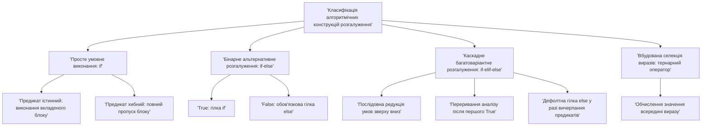
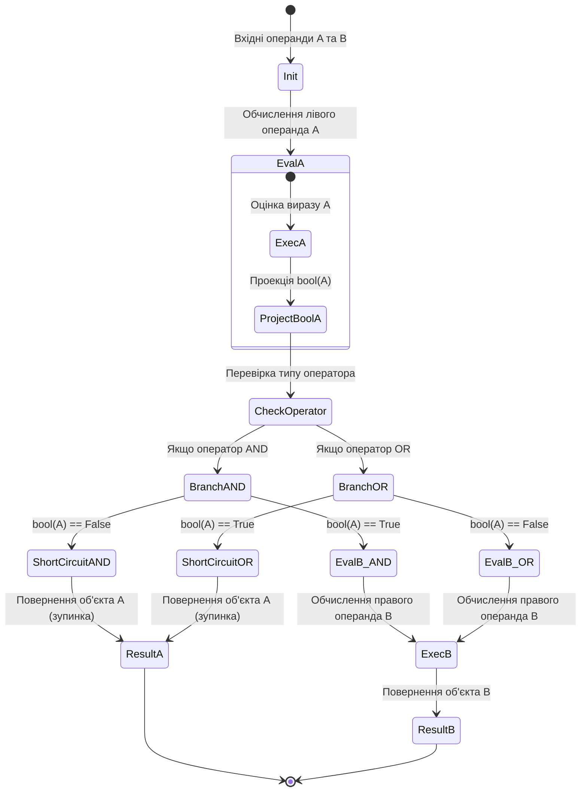
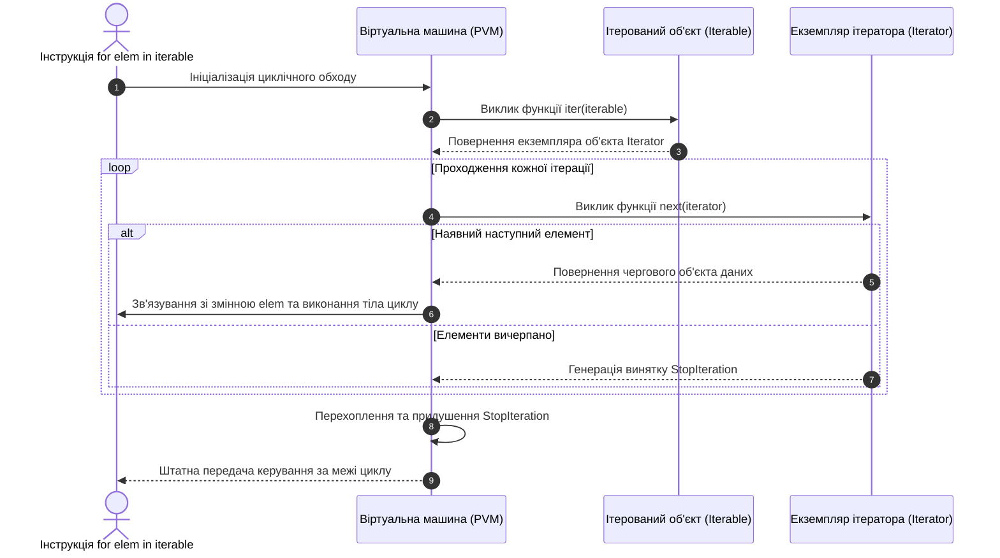
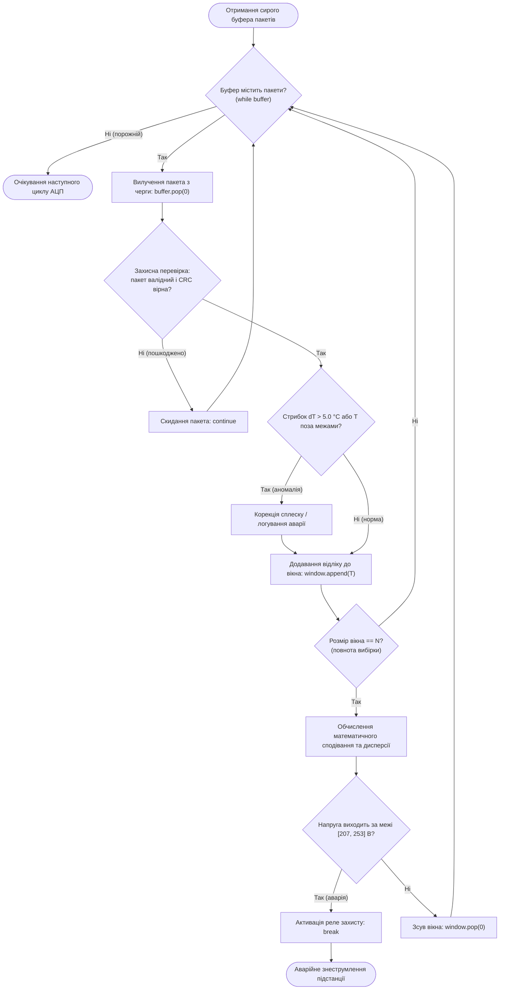

# Тема 2. Керування потоком виконання: розгалужені та циклічні алгоритмічні конструкції

## Мета лекції
Формування у здобувачів вищої освіти системного розуміння механізмів керування послідовністю виконання машинних інструкцій у мові програмування Python, всебічне опанування синтаксичного апарату та внутрішньої семантики розгалужених і циклічних алгоритмічних конструкцій, а також розвиток практичних інженерних навичок проектування детермінованих, отказостійких та обчислювально оптимізованих алгоритмів для розв'язання задач автоматизації, первинної обробки сигналів і моделювання складних дискретних процесів у сучасних комп'ютерних і телекомунікаційних системах.

## Очікувані результати навчання
1. **Знання та розуміння.** Здобувачі засвоять синтаксичні особливості оформлення блоків коду за стандартом PEP 8, внутрішні правила приведення типів даних до булевого еквівалента, семантику умовних операторів `if-elif-else`, тернарного виразу, циклічних інструкцій `while` і `for`, системну логіку протоколу ітерування, а також функціональне призначення операторів `break`, `continue`, `pass` та блоку `else` у циклах.
2. **Застосування.** Здобувачі зможуть самостійно конструювати нелінійні алгоритмічні структури, коректно використовувати коротку схему обчислення логічних виразів для побудови захисних конструкцій, організовувати ресурсоефективний обхід багатовимірних колекцій і математичних діапазонів із використанням лінивих послідовностей `range`.
3. **Аналіз.** Здобувачі навчаться деконструювати вкладені алгоритмічні конструкції, діагностувати причини зациклення й некоректних переходів, аналізувати умови зупинки ітераційних процесів за заданою точністю, а також порівнювати часову та просторову складність ітеративних алгоритмів із різними схемами керування.
4. **Оцінювання та синтез.** Здобувачі набудуть здатності проектувати високонадійні алгоритми валідації та обробки телеметричних потоків даних у граничних режимах функціонування, критично оцінювати вплив вкладених циклів на продуктивність інтерпретатора CPython та розробляти комплексні алгоритмічні рішення з адаптивною реакцією на апаратні й логічні збої.

---

## Детальний покроковий план лекції

### 1. Теоретико-концептуальний базис. Архітектура розгалужень та предикатна логіка
* 1.1. Синтаксична структура умовних інструкцій `if`, `if-else`, `if-elif-else` та механізм токенізації відступів `INDENT`/`DEDENT` за стандартом PEP 8.
* 1.2. Концепція істинності об'єктів (*truthiness*), правила неявного приведення типів та внутрішні системні слоти оцінювання об'єктів у CPython.
* 1.3. Логічні оператори `and`, `or`, `not`, порядок виконання операцій та математична формалізація короткої схеми обчислення (*short-circuit evaluation*).
* 1.4. Тернарний умовний вираз як інженерний інструмент селекції даних: синтаксис, ліниве обчислення гілок та межі використання.

### 2. Методологія та аналіз граничних умов. Циклічні ітератори та керування ітеративними процесами
* 2.1. Цикл із передумовою `while`, доведення збіжності алгоритму до термінального стану та механізми запобігання зацикленню.
* 2.2. Узагальнений цикл `for`, архітектура протоколу ітератора (*Iterator Protocol*) та обробка службового винятку `StopIteration`.
* 2.3. Генератор арифметичних прогресій `range`: внутрішня структура `PyRangeObject`, параметрична модель та просторова складність $\mathcal{O}(1)$.
* 2.4. Мікродинаміка керування ітераціями за допомогою операторів `break`, `continue`, `pass` та інженерний патерн використання блоку `else` в циклах.
* 2.5. Критичні бар'єри та вузькі місця: експоненційне зростання обчислювальної складності глибоко вкладених циклів, накладні витрати динамічної диспетчеризації віртуальної машини та обмеження продуктивності інтерпретатора.

### 3. Практичний індустріальний / фаховий кейс. Розробка отказостійкого контролера обробки телеметричних сигналів
**Тема наскрізної задачі.** «Проектування системи фільтрації, валідації та пакетного статистичного аналізу телеметричного потоку датчиків промислового IoT-контролера з виявленням аномальних викидів та захистом від переповнення буфера»

## 1. Теоретико-концептуальний базис. Архітектура розгалужень та предикатна логіка

### 1.1. Синтаксична структура умовних інструкцій if, if-else, if-elif-else та механізм токенізації відступів INDENT/DEDENT за стандартом PEP 8

Архітектура фон Неймана передбачає послідовне виконання машинних команд, що визначається лінійним інкрементом лічильника інструкцій процесора. Реалізація нелінійних алгоритмів вимагає примусової модифікації цього лічильника шляхом умовних переходів, які залежать від поточного стану обчислювального середовища. У мовах програмування високого рівня цей апаратний механізм абстрагується за допомогою конструкцій розгалуження. Умовні оператори забезпечують біфуркацію графа потоку керування (Control Flow Graph), спрямовуючи виконання програми за однією з взаємовиключних траєкторій на основі обчислення значення логічного виразу.

У мові Python синтаксична організація коду суттєво відрізняється від спадщини мов Algol, C та Pascal, де межі блоків визначаються явними лексемами `begin`/`end` або фігурними дужками `{}`. Творець мови Гвідо ван Россум запозичив концепцію синтаксичного виділення блоків за допомогою відступів з експериментальної мови ABC, що в теоретичній інформатиці отримало назву **синтаксису поза межами рядка** (off-side rule). Така структура перетворює візуальне форматування безпосередньо на семантичну сутність програми, унеможливлюючи розбіжність між зоровим сприйняттям коду людиною та його інтерпретацією транслятором.

Трансляція відступів у синтаксичні блоки здійснюється на фазі лексичного аналізу. Лексер CPython сканує пробільні символи на початку кожного фізичного рядка, підтримуючи внутрішній системний стек рівнів відступів. На початку роботи стек містить єдине нульове значення. Коли зустрічається рядок із більшим рівнем відступу, це числове значення додається до вершини стека, а компілятору передається службовий токен `INDENT`. Якщо рівень відступу зменшується, лексер вилучає зі стека всі значення, які перевищують новий рівень, і для кожного вилученого елемента генерує термінальний токен `DEDENT`. Якщо поточний відступ не збігається із жодним із попередніх рівнів, що зберігаються в стеку, процес лексичного розбору аварійно зупиняється генерацією винятку `IndentationError`.

Міжнародний інженерний стандарт оформлення коду PEP 8 встановлює строге правило: кожен рівень ієрархічної вкладеності повинен формуватися виключно чотирма символами пробілу. Використання символів табуляції суворо заборонено, оскільки різні текстові редактори та термінальні емулятори інтерпретують табуляцію неоднозначно (від двох до восьми знакомісць), що призводить до прихованих дефектів логіки та виклику винятку `TabError` у середовищі Python 3.


*Рисунок 1.1 — Ієрархічна структура конструкцій розгалуження потоку виконання в мові Python*

Базовою формою є неповний умовний оператор `if`, що містить предикат, двокрапку та асоційований блок інструкцій із чотирипробільним зміщенням. Якщо логічний вираз повертає істину, вкладений блок виконується, інакше керування передається наступній інструкції того ж рівня вкладеності. Повна форма `if-else` створює строго детерміновану бінарну розвилку, де виконання однієї з гілок є безумовним. 

Для моделювання багатоваріантних просторів рішень застосовується каскад `if-elif-else`. На рівні байт-коду інтерпретатор транслює таку структуру в серію інструкцій `POP_JUMP_IF_FALSE`. Аналіз умов здійснюється строго зверху вниз. Щойно один із предикатів у ланцюжку `elif` набуває значення істини, віртуальна машина CPython виконує пов'язане з ним тіло інструкцій і генерує безумовний стрибок на мітку виходу з усієї конструкції, повністю ігноруючи наступні перевірки.

> **ПРАКТИЧНИЙ ЯКІР:** В апаратних контролерах телекомунікаційних комутаторів каскад `if-elif-else` використовується для первинного розбору заголовків пакетів за стандартом DiffServ: пріоритетний трафік голосових шлюзів (Voice over IP) маркується першою ж умовою для мінімізації затримок обробки в черзі, тоді як трафік низького пріоритету (Best Effort) перевіряється в останніх гілках блоку.

### 1.2. Концепція істинності об'єктів (truthiness), правила неявного приведення типів та внутрішні системні слоти оцінювання об'єктів у CPython

У мові Python кожен елемент даних реалізовано як повноцінний об'єкт, інкапсульований у системну структуру мови C під назвою `PyObject`. Окрім типу, лічильника посилань та безпосереднього корисного навантаження, кожен об'єкт наділений семантичною властивістю **істинності** (*truthiness*). Ця властивість дозволяє передавати в якості предиката умовного оператора сутності довільних типів даних, а не виключно змінні булевого типу `bool`. Механізм позбавляє потреби в громіздких конструкціях явного порівняння на зразок `if len(collection) != 0:` або `if status == True:`, спрощуючи архітектуру програми.

Неявне приведення до булевого еквівалента спирається на суворі внутрішні правила віртуальної машини, які виконуються функцією `PyObject_IsTrue`. Спочатку інтерпретатор шукає в таблиці методів об'єкта слот `tp_as_number->nb_bool`, який викликає магічний метод `__bool__()`. Якщо цей метод реалізовано, його результат повинен бути строго типом `bool`. Якщо слот `nb_bool` не визначено (як це часто буває для контейнерних типів даних), CPython звертається до слота послідовностей `tp_as_sequence->sq_length`, що відповідає магічному методу `__len__()`. Якщо довжина контейнера дорівнює нулю, об'єкт визнається хибним, якщо довжина перевищує нуль — істинним. Якщо жоден із цих протоколів у структурі об'єкта не реалізовано, об'єкт за замовчуванням завжди оцінюється як `True`.

Спеціальний клас `bool` у Python є прямим нащадком цілочисельного типу `int`, де екземпляр `True` числово еквівалентний одиниці, а `False` — нулю. Це історичне архітектурне рішення забезпечує можливість участі булевих прапорців у прямих арифметичних операціях, але вимагає від програміста усвідомлення базових правил приведення типів. 

У наведеній нижче системній таблиці узагальнено критерії оцінки істинності базових вбудованих структур мови Python із проекцією на їхню внутрішню поведінку та інженерну практику.

*Таблиця 1.1 — Систематизація предикатної істинності вбудованих типів даних у середовищі CPython*

| Категорія структур даних | Тип даних у Python | Критерій хибності (`False`) | Механізм перевірки на рівні CPython | Приклад з реальної практики |
| :--- | :--- | :--- | :--- | :--- |
| **Спеціальні типи** | `NoneType` | Єдиний сінглтон-об'єкт `None` | Порівняння покажчика пам'яті з глобальним `Py_None` | Фіксація відсутності вхідного сигналу на аналоговому вході АЦП |
| **Числові типи** | `int`, `float`, `complex` | Числові нулі: `0`, `0.0`, `0j`, `-0.0` | Перевірка відсутності активних бітів у структурі `ob_digit` або слот `nb_bool` | Контроль відсутності напруги на лінійному драйвері інтерфейсу |
| **Текстові дані** | `str` | Порожній рядок довжини нуль `""` | Оцінка поля `ob_size == 0` у структурі рядка `PyASCIIObject` | Перевірка незаповненості текстового буфера командного протоколу |
| **Послідовності** | `list`, `tuple`, `range` | Порожні контейнери: `[]`, `()`, `range(0)` | Звернення до слота `sq_length`, перевірка лічильника елементів `ob_size == 0` | Моніторинг черги пакетів у мережевому сокеті перед зчитуванням |
| **Асоціативні масиви** | `dict` | Порожній словник `{}` | Перевірка поля кількості активних записів `ma_used == 0` у таблиці хешів | Оцінка наявності зареєстрованих клієнтів у сесійній таблиці |
| **Множини** | `set`, `frozenset` | Порожні набори: `set()`, `frozenset()` | Оцінка поля заповненості множини `used == 0` у хеш-таблиці | Контроль унікальних аварійних кодів у системі моніторингу обладнання |

Аналіз даних таблиці свідчить, що логічне оцінювання будь-якої складної сутності в Python оптимізовано для запобігання зайвим операціям виділення пам'яті. Перевірка наявності даних у буфері через `if buffer:` на рівні низькорівневих C-викликів вимагає простої перевірки лічильника `ob_size != 0`, що виконується за сталий час $\mathcal{O}(1)$ без виклику додаткових операторів порівняння.

> **ТИПОВА ПОМИЛКА:** Пряме порівняння змінних із булевими константами через оператор тотожності або рівності виду `if is_connected == True:` чи `if is_connected is True:`. Окрім порушення вимог PEP 8, ця конструкція ламає поліморфну природу перевірки на істинність. Якщо функція низькорівневого драйвера поверне ненульовий код статусу на зразок `1` або `200` (що за логікою є істинним станом наявності зв'язку), пряме порівняння `is True` поверне `False`, оскільки воно перевіряє рівність фізичних адрес об'єктів у купі пам'яті, де сінглтон `True` не дорівнює цілому числу `1`.

### 1.3. Логічні оператори and, or, not, порядок виконання операцій та математична формалізація короткої схеми обчислення (short-circuit evaluation)

Складені логічні конструкції базуються на законах алгебри логіки Джона Буля. Проте мова Python має суттєву специфіку роботи логічних операторів `and` (кон'юнкція) та `or` (диз'юнкція), яка відрізняє її від суто математичного апарату та строго компільованих мов програмування. Оператори `and` та `or` у Python не продукують нових булевих значень, а діють як комутатори, повертаючи конкретний операнд, на якому завершився обчислювальний процес. На противагу їм, унарний оператор `not` завжди повертає канонічний об'єкт типу `bool` (`True` або `False`).

Пріоритет виконання операцій у складених виразах регламентується чіткою ієрархією: операції порівняння (`<`, `<=`, `>`, `>=`, `==`, `!=`, `is`, `in`) мають вищий ранг, ніж логічні зв'язки. Серед логічних зв'язок найвищий пріоритет закріплено за унарним запереченням `not`, за ним слідує бінарна кон'юнкція `and`, а найнижчий ранг належить бінарній диз'юнкції `or`. За наявності виразу `not A and B or C` інтерпретатор спочатку обчислить `(not A)`, потім застосує кон'юнкцію до результату та `B`, і лише наприкінці виконає операцію `or` з операндом `C`.

Особливе місце в комп'ютерній інженерії займає механізм **короткої схеми обчислення** (*short-circuit evaluation*). Згідно з цим принципом, обчислення операндів здійснюється строго зліва направо і припиняється в той момент, коли кінцеве логічне значення всього виразу стає математично очевидним.

Для довільних об'єктів $x$ та $y$, де функція $\mathbb{B}(u)$ проектує сутність $u$ на множину булевих констант $\{\text{True}, \text{False}\}$, математична модель бінарної операції `x and y` описується кусочно-заданою функцією:

$$z = \text{eval}(x \textbf{ and } y) = \begin{cases} x, & \text{якщо } \mathbb{B}(x) = \text{False} \\ y, & \text{якщо } \mathbb{B}(x) = \text{True} \end{cases}$$

де $x$ позначає лівий аргумент, обчислюваний у першу чергу; $y$ є правим аргументом, обчислення якого блокується, якщо лівий операнд хибний. Якщо у складеному ланцюжку кон'юнкцій $x_1 \textbf{ and } x_2 \textbf{ and } \dots \textbf{ and } x_n$ кожен операнд є істинним, результатом стане останній обчислений операнд $x_n$. Якщо ж на деякому кроці $k$ виявиться, що $\mathbb{B}(x_k) = \text{False}$, обчислення обривається, і повертається безпосередньо об'єкт $x_k$.

Аналогічно, формальна модель оператора `x or y` визначається залежністю:

$$z = \text{eval}(x \textbf{ or } y) = \begin{cases} x, & \text{якщо } \mathbb{B}(x) = \text{True} \\ y, & \text{якщо } \mathbb{B}(x) = \text{False} \end{cases}$$

де повернення значення $x$ відбувається миттєво за умови його істинності, що повністю виключає необхідність звернення до правого виразу $y$.


*Рисунок 1.2 — Діаграма станів конвеєра короткої схеми обчислення логічних виразів у Python*

Коротка схема обчислення є потужним інструментом забезпечення безпеки програмного коду на рівні побудови захисних виразів (**guard clauses**). Якщо операція містить ризик генерації винятку часу виконання (наприклад, ділення на нуль, вихід за межі масиву або розіменування нульового покажчика), критичний блок захищається попередньою умовою. У виразі `(len(channels) > index) and (channels[index].is_active())` звернення до елемента `channels[index]` заблоковане внутрішнім апаратним планувальником, якщо довжина списку каналів менша або дорівнює покажчику `index`.

> **ПРАКТИЧНИЙ ЯКІР:** У системах цифрової фільтрації телеметричних даних вираз `sample_rate != 0 and calculate_frequency(samples, sample_rate)` гарантує, що важка функція обчислення швидкого перетворення Фур'є `calculate_frequency` не буде викликана з нульовим знаменником, що захищає програму від фатального винятку `ZeroDivisionError` без використання додаткових блоків `try-except`.

> **КОНТРОЛЬНЕ ПИТАННЯ:** Яким буде кінцеве значення виразу `result = (0 or "" or [42] or "ERROR") and (None or 256)` під час виконання у середовищі CPython, і скільки операндів із наведеного ланцюжка фактично інтерпретує віртуальна машина?

<details markdown="1">
<summary>Розгорнути аналіз / відповідь</summary>

**Правильний варіант: Кінцеве значення виразу дорівнює цілому числу `256`. Всього буде обчислено 5 операндів: `0`, `""`, `[42]`, `None` та `256`.**

1. Вираз розпадається на дві складові, поєднані оператором `and`: ліву частину `(0 or "" or [42] or "ERROR")` та праву частину `(None or 256)`. Згідно з пріоритетом дужок, спочатку обчислюється ліва частина.
2. У ланцюжку `or` обчислення йдуть зліва направо: `0` є `False` (рухаємось далі); `""` є `False` (рухаємось далі); `[42]` є непорожнім списком, отже його булева проекція $\mathbb{B}([42]) = \text{True}$. Оператор `or` здійснює коротке замикання і повертає поточний об'єкт `[42]`. Операнд `"ERROR"` взагалі не аналізується інтерпретатором.
3. Оскільки ліва частина виразу повернула істинний об'єкт `[42]`, оператор `and` зобов'язаний перейти до обчислення правої частини, бо кінцеве значення залежить від другого операнда.
4. У правій частині обчислюється ланцюжок `(None or 256)`: `None` дає `False`, тому за правилом `or` обчислення переходить до наступного операнда, яким є число `256`. Оскільки цей операнд є останнім, він повертається як результат блоку.
5. Фінальний вираз зводиться до `[42] and 256`. За правилом оператора `and`, оскільки перший операнд істинний, результатом стає значення другого операнда, тобто `256`.

**Аналіз дистракторів:**
- Відповідь `True`: некоректна, оскільки логічні оператори `and`/`or` у Python повертають значення фізичних операндів, а не приведені булеві константи.
- Відповідь `[42]`: хибна, оскільки оператор `and` продовжує оцінку, доки не знайде хибний операнд або не дійде до кінця ланцюжка.
- Відповідь `"ERROR"`: виникає лише в разі хибного припущення, що диз'юнкція вимагає виконання всіх складових частин виразу.

</details>

### 1.4. Тернарний умовний вираз як інженерний інструмент селекції даних: синтаксис, ліниве обчислення гілок та межі використання

У теорії формальних мов існує чітке функціональне розмежування між **інструкціями** (*statements*) та **виразами** (*expressions*). Інструкція керує станом віртуальної машини, організовує структуру переходів або ініціює збереження даних, але не може бути правостороннім значенням ($R$-value) для присвоєння змінній або аргументом функції. Вираз, навпаки, обов'язково підлягає редукції до конкретного об'єкта в оперативній пам'яті. 

Стандартний умовний блок `if-else` є інструкцією. Для ситуацій, де вибір між альтернативними значеннями повинен відбуватися безпосередньо у контексті створення об'єкта або обчислення складної формули, специфікація PEP 308 запровадила у мову Python **тернарний умовний вираз** (*conditional expression*).

Синтаксична форма тернарного виразу відрізняється від класичного C-подібного синтаксису із символами знаку питання та двокрапки `cond ? expr1 : expr2` і набуває вигляду:

$$x = E_{\text{true}} \textbf{ if } C \textbf{ else } E_{\text{false}}$$

де $C$ виступає логічним предикатом; $E_{\text{true}}$ представляє вираз, що обчислюється і повертається за умови $\mathbb{B}(C) = \text{True}$; $E_{\text{false}}$ — альтернативний вираз, що обчислюється у разі $\mathbb{B}(C) = \text{False}$.

Виконання цієї конструкції строго підпорядковане концепції **лінивого обчислення** (*lazy evaluation*). Незважаючи на те, що синтаксично вираз $E_{\text{true}}$ розміщується на початку конструкції, першим виконується предикат $C$. Якщо умова $C$ задовольняється, інтерпретатор обчислює вираз $E_{\text{true}}$, а фрагмент коду $E_{\text{false}}$ навіть не сканується віртуальною машиною на етапі виконання. Якщо умова $C$ є хибною, обчислюється виключно $E_{\text{false}}$, а $E_{\text{true}}$ повністю ігнорується. 

Ця ізоляція запобігає виклику ресурсомістких функцій або потенційно деструктивних операцій на неактивних гілках обчислення.

Типовою інженерною задачею радіоелектроніки та автоматизованого керування є лінійне обмеження вихідного сигналу для захисту від перенасичення (клемпування сигналу). Нехай на вхід цифро-аналогового перетворювача надходить виміряна напруга $U_{\text{in}}$. Формальна модель обмеження максимального рівня напруги граничним порогом $U_{\text{max}}$ описується кусочно-заданою функцією:

$$U_{\text{out}} = \begin{cases} U_{\text{max}}, & \text{якщо } U_{\text{in}} > U_{\text{max}} \\ U_{\text{in}}, & \text{якщо } U_{\text{in}} \le U_{\text{max}} \end{cases}$$

У програмному коді систем обробки сигналів на базі Python ця математична залежність записується компактним тернарним виразом: `u_out = U_MAX if u_in > U_MAX else u_in`. 

Подібні конструкції дозволяють ефективно нормалізувати масиви відліків сенсорів, призначати стандартні конфігураційні параметри при розриві з'єднання та організовувати селекцію математичних моделей без розриву контексту присвоювання.

Межі використання тернарного оператора диктуються вимогами до когнітивної складності архітектури. Синтаксис мови дозволяє будувати вкладені ланцюжки: `a if c1 else b if c2 else d`. Проте подібний запис порушує принципи чистої архітектури та істотно підвищує ймовірність внесення логічних дефектів під час супроводу системного коду. Якщо простір рішень містить більше двох дискретних гілок, інженерна дисципліна вимагає відмови від тернарних виразів на користь класичного каскаду `if-elif-else` або використання словникової диспетчеризації (*dispatch table*).

---

### Вказівки для самостійного осмислення

1. Складіть формальну таблицю істинності та напишіть фрагмент коду для перевірки дотримання законів де Моргана $\neg(A \land B) \iff \neg A \lor \neg B$ та $\neg(A \lor B) \iff \neg A \land \neg B$ з використанням довільних вбудованих об'єктів мови Python різного ступеня істинності.
2. Дослідіть за допомогою стандартного бібліотечного модуля `dis` відмінності у згенерованому байт-коді між класичним блоком `if-else` та еквівалентним тернарним умовним виразом, звернувши увагу на кількість та типи інструкцій переходів віртуальної машини PVM.
3. Проаналізуйте поведінку власного класу при оцінці в умовному операторі, якщо в ньому одночасно реалізовано методи `__bool__()` та `__len__()`, визначивши експериментальним шляхом рівень пріоритетності цих слотів для системної функції `PyObject_IsTrue`.


## 2. Методологія та аналіз граничних умов. Циклічні ітератори та керування ітеративними процесами

### 2.1. Цикл із передумовою while, критерії збіжності ітераційного процесу та механізми запобігання зацикленню

Цикл із передумовою `while` є найбільш загальною алгоритмічною конструкцією повторення в імперативному програмуванні, яка забезпечує багаторазове виконання замкненого блоку інструкцій доти, доки значення контрольного логічного виразу залишається істинним. В архітектурі віртуальної машини виконання даного циклу спирається на циклічну оцінку умовного переходу, де перед кожною новою ітерацією здійснюється перевірка стану предикатної змінної або складеного виразу. 

З теоретичної точки зору будь-який ітераційний процес, реалізований через цикл `while`, є дискретною динамічною системою, стан якої на кожному кроці модифікується оператором переходу:

$$S_{k+1} = \Phi(S_k)$$

де $S_k$ позначає вектор стану змінних програми на $k$-й ітерації; $\Phi$ представляє функцію трансформації даних, що реалізується тілом циклу. Для детермінованого завершення обчислень необхідно гарантувати існування такого скінченного номера кроку $m \in \mathbb{N}$, за якого вектор стану $S_m$ перетинає границю області збіжності, перетворюючи логічний предикат умови $\mathbb{B}(\text{Cond}(S_m))$ на значення `False`.

Математичне доведення коректності та завершуваності циклу базується на концепції варіанта та інваріанта циклу. Інваріантом циклу виступає логічне твердження щодо співвідношення змінних, яке залишається істинним перед початком виконання циклу та зберігає свою істинність після завершення кожної ітерації. Варіантом циклу слугує цілочисельна функція $V(S)$, визначена на множині станів, яка є строго монотонно спадною на кожному кроці $V(S_{k+1}) < V(S_k)$ та обмеженою знизу термінальним значенням нуля. 

Якщо для розробленого алгоритму неможливо побудувати варіантну функцію з такими властивостями, виникає фундаментальна алгоритмічна аномалія — нескінченний цикл (*infinite loop*), що призводить до повного блокування потоку виконання та вичерпання процесорного часу.

Формалізацію ітераційного числового процесу на прикладі збіжного апроксимаційного ряду для обчислення суми зворотних квадратів $S = \sum_{n=1}^{\infty} \frac{1}{n^2}$ із заданим порогом збіжності $\varepsilon = 10^{-6}$ можна представити у вигляді структурованого покрокового процесу:

$$
\begin{aligned}
\text{Крок 1 (Ініціалізація стану):} & \quad S_0 = 0, \quad n_0 = 1, \quad x_0 = 1, \quad \varepsilon = 10^{-6} \\
\text{Крок 2 (Оцінка передумови):} & \quad \text{якщо } |x_k| < \varepsilon \implies \text{перехід до кроку 6 (термінація)} \\
\text{Крок 3 (Акумуляція суми):} & \quad S_{k+1} = S_k + x_k \\
\text{Крок 4 (Інкремент індексу):} & \quad n_{k+1} = n_k + 1 \\
\text{Крок 5 (Редукція приросту):} & \quad x_{k+1} = \frac{1}{(n_{k+1})^2}, \quad k \leftarrow k + 1, \quad \text{перехід до кроку 2} \\
\text{Крок 6 (Фіксація результату):} & \quad S^* = S_{k+1}, \quad \text{повернення значення суми}
\end{aligned}
$$

де $x_k$ є значенням поточного члена числового ряду, що відіграє роль динамічного залишку; $S_k$ накопичує поточну часткову суму; $n_k$ виконує функцію крокового лічильника. Монотонне спадання величини $x_k \to 0$ при $n \to \infty$ забезпечує виконання критерію Коші, що гарантує досягнення граничного порогу зупинки за скінченну кількість ітерацій.

Аналіз граничних умов функціонування циклу `while` виявляє критичну вразливість алгоритмів у задачах із використанням чисел із рухомою комою. Через неможливість точного двійкового представлення більшості дробових десяткових чисел (наприклад, $0.1_{10} = 0.000110011..._2$), накопичення машинної похибки округлення порушує очікувані математичні рівності. Умова виходу виду `while current_value != target_value:` для змінних типу `float` є грубою методологічною помилкою: якщо крок інкременту становить `0.1`, поточне значення внаслідок похибки представлення стандарту IEEE 754 ніколи точно не збіжиться із числом `1.0`, проскочить його (наприклад, набувши значення `1.0000000000000002`), і цикл перейде у нескінченну фазу виконання.

> **ВАЖЛИВО:** Предикати завершення чисельних циклів `while` для дійсних чисел повинні будуватися виключно на нерівностях із використанням абсолютної різниці та допустимого відхилення `abs(current - target) > epsilon`, або за допомогою спеціалізованої перевірки наближеної рівності `not math.isclose(a, b, rel_tol=1e-9)`.

### 2.2. Узагальнений цикл for, архітектура протоколу ітератора (Iterator Protocol) та обробка службового винятку StopIteration

На відміну від системних мов програмування, де цикл `for` традиційно асоціюється з прямою маніпуляцією регістром лічильника, у мові Python ця конструкція представляє високорівневу реалізацію фундаментального патерну проектування «Ітератор». Цикл `for` абстрагує доступ до елементів довільних колекцій, дозволяючи обходити їх без розкриття їхньої внутрішньої структури та без потреби використання прямої індексації.

Функціонування циклу регламентується двокомпонентним протоколом ітератора (Iterator Protocol). Будь-який контейнерний об'єкт вважається ітерованим (*iterable*), якщо він реалізує магічний метод `__iter__()` (або застарілий метод послідовностей `__getitem__()`). Метод `__iter__()` зобов'язаний повернути спеціалізований об'єкт-ітератор (*iterator*), який інкапсулює поточний стан проходження структури даних і обов'язково реалізує метод `__next__()`. Кожен виклик методу `__next__()` повертає наступний послідовний елемент вихідної колекції.

Коли обхід структури даних вичерпує наявні елементи, метод `__next__()` генерує спеціальний службовий виняток `StopIteration`. Цей виняток не є ознакою аварійної ситуації; він виступає стандартним протокольним сигналом про завершення обходу послідовності. Віртуальна машина Python перехоплює `StopIteration` на внутрішньому рівні ядра CPython і виконує штатний, безаварійний вихід із циклічної інструкції.

Взаємодію компонентів середовища виконання під час ініціалізації та проходження ітеративного циклу продемонстровано на наведеній нижче діаграмі послідовності.


*Рисунок 2.1 — Послідовність взаємодії компонентів віртуальної машини CPython у межах протоколу ітератора*

Граничні умови застосування циклу `for` тісно пов'язані зі стабільністю самої колекції, по якій здійснюється прохід. Якщо всередині тіла циклу виконується додавання або видалення елементів того самого списку, за яким ведеться ітерація, внутрішній зміщувальний покажчик ітератора десинхронізується з реальними індексами масиву. Це явище спричиняє пропуск окремих елементів або подвійну їх обробку без виклику явних помилок. Для асоціативних масивів `dict` та множин `set` зміна розміру під час ітерації призводить до миттєвого аварійного збою системи з генерацією винятку `RuntimeError: dictionary changed size during iteration`, оскільки мутація порушує цілісність внутрішньої структури хеш-таблиці.

### 2.3. Генератор арифметичних прогресій range: внутрішня структура PyRangeObject, параметрична модель та просторова складність O(1)

Для організації лічильних циклів, що виконуються наперед визначену кількість разів, у мові Python використовується вбудований незмінний тип даних `range`. На відміну від версії Python 2.x, де функція `range` фізично формувала в оперативній пам'яті повнорозмірний список чисел (що для великих діапазонів призводило до вичерпання виділеного пулу ОЗП), у Python 3 реалізовано ліниву послідовність на базі внутрішньої структури `PyRangeObject`.

Параметрична модель генератора `range(start, stop, step)` визначає дискретну арифметичну прогресію на напіввідкритому інтервалі $[start, stop)$. Згенерована послідовність містить множину значень:

$$R = \{ r_i \mid r_i = start + i \times step, \quad 0 \le i < n \}$$

де загальна кількість кроків ітерації $n$ детерміновано обчислюється через функцію взяття верхньої цілої частини різниці меж:

$$n = \max\left(0, \; \left\lceil \frac{stop - start}{step} \right\rceil\right)$$

Архітектурна специфіка `PyRangeObject` полягає в тому, що об'єкт зберігає в пам'яті виключно три фіксовані системні параметри: початкове значення ($start$), кінцеву межу ($stop$) та величину кроку ($step$), обчислюючи числове значення кожного конкретного елемента «на льоту» лише в момент звернення. Завдяки такій структурі просторова складність об'єкта `range` завжди становить константну величину:

$$S(N) = \mathcal{O}(1)$$

Об'єкт `range(0, 10**12)` займає в пам'яті комп'ютера фіксовані 48 байтів (на 64-розрядній архітектурі CPython), абсолютно ідентично до компактного об'єкта `range(0, 10)`.

Крім лінивої ітерації, тип `range` реалізує інтерфейс послідовностей (Sequence Type), що забезпечує виконання операцій доступу за індексом $r[i]$ та визначення довжини `len(r)` за константний час $\mathcal{O}(1)$. Більше того, операція перевірки входження числа в діапазон `x in range(...)` не виконує перебір значень у циклі, а обчислюється аналітично через систему діофантових співвідношень:

$$\begin{cases} 
start \le x < stop, & \text{при } step > 0 \\ 
stop < x \le start, & \text{при } step < 0 
\end{cases} \quad \land \quad (x - start) \pmod{step} = 0$$

Цей підхід забезпечує миттєву перевірку приналежності числа діапазону з довільною кількістю елементів без будь-яких витрат процесорного часу на циклічне сканування.

### 2.4. Мікродинаміка керування ітераціями за допомогою операторів break, continue, pass та інженерний патерн використання блоку else в циклах

Керування мікродинамікою виконання окремих ітерацій циклів `while` та `for` забезпечується спеціальними інструкціями низькорівневого контролю: `break`, `continue` та `pass`.

Оператор `break` ініціює примусове дострокове переривання виконання всього циклу. На рівні байт-коду інтерпретатор транслює `break` в безумовний перехід `JUMP_ABSOLUTE` на інструкцію, що розташована безпосередньо за межами всього циклічного блоку. Оператор `continue` здійснює дострокове завершення поточної ітерації, пропускаючи всі невиконані команди тіла циклу, та ініціює перехід до оцінки умови (у циклі `while`) або виклику методу `__next__()` для отримання наступного елемента (у циклі `for`). Натомість оператор `pass` є синтаксичною заглушкою (байт-код `NOP` — no operation), яка не змінює стану програми й застосовується в блоках, де синтаксис вимагає наявності інструкції, але алгоритмічна дія не передбачена.

Унікальною синтаксичною особливістю мови Python є підтримка **блоку `else` у циклічних конструкціях**. Семантика цієї конструкції суттєво відрізняється від блоку `else` у розгалуженнях `if`. У циклах блок `else` виконується лише тоді, коли цикл завершив свою роботу природним шляхом без примусового переривання:
- Для циклу `while`: коли вираз умови обчислився як `False`.
- Для циклу `for`: коли ітератор вичерпав усі елементи послідовності та згенерував виняток `StopIteration`.

Якщо ж вихід із циклу стався внаслідок виконання оператора `break` (або генерації необробленого винятку), блок `else` повністю ігнорується віртуальною машиною. Це створює елегантний інженерний патерн для пошукових алгоритмів: секція циклу здійснює сканування простору даних, викликаючи `break` при знаходженні цільового елемента, а блок `else` обробляє ситуацію повної відсутності шуканого об'єкта, що виключає необхідність штучного введення допоміжних булевих прапорцевих змінних (*flag variables*).

> **ПРАКТИЧНИЙ ЯКІР:** В авіаційних вбудованих системах та мережевих шлюзах алгоритм валідації контрольної суми пакетів за методом CRC будується на патерні `for-else`: якщо під час перевірки чергового блоку виявляється розбіжність бітів, оператор `break` зупиняє парсинг і маркує пакет як пошкоджений, а блок `else` виконує фінальне підтвердження автентичності кадру лише за умови успішної верифікації абсолютно всіх байтів.

### 2.5. Критичні бар'єри та вузькі місця: експоненційне зростання обчислювальної складності глибоко вкладених циклів, накладні витрати динамічної диспетчеризації віртуальної машини та обмеження продуктивності інтерпретатора

Використання циклів у мові Python стикається з низкою фундаментальних архітектурних обмежень, зумовлених інтерпретованою природою середовища CPython. На відміну від мов зі статичною компіляцією (C, C++, Rust), де цикл транслюється у прямі процесорні інструкції з використанням апаратних регістрів, кожна ітерація циклу в Python проходить крізь важкий шар динамічної інтерпретації (головний цикл диспетчеризації в `ceval.c`).

Основними джерелами накладних витрат у циклах виступають:
- Динамічна типізація: на кожній ітерації віртуальна машина змушена повторно перевіряти типи операндів, виконувати пошук магічних методів у словниках типів та перевіряти границі масивів.
- Упаковка примітивів (*boxing/unboxing*): цілі та дійсні числа в Python не є машинними словами, а складними структурами на купі (`PyLongObject`, `PyFloatObject`), що призводить до промахів кешу процесора (CPU cache misses) при масових ітераціях.
- Виклики функцій: виклик будь-якої функції всередині циклу створює новий об'єкт кадру стека (`PyFrameObject`), що створює значне навантаження на підсистему керування пам'яттю.

Глибоке вкладення циклічних конструкцій багаторазово мультиплікує наведені накладні витрати. Якщо двовимірна матрична обробка має поліноміальну часову складність $\mathcal{O}(n \times m)$, то в чистому Python час її виконання зростає на два-три порядки швидше, ніж в оптимізованому машинному коді. При переході до розмірностей $k \ge 3$ настає комбінаторний вибух, коли ресурси процесора витрачаються не на виконання математичних обчислень, а на системні операції диспетчеризації віртуальної машини.

У наведеній нижче порівняльній матриці систематизовано фундаментальні характеристики, складність впровадження та ризики експлуатації базових алгоритмічних моделей керування ітераціями.

*Таблиця 2.1 — Матриця зіставлення циклічних конструкцій та моделей ітерації в інженерній практиці*

| Механізм керування | Базовий принцип роботи | Асимптотична складність | Складність впровадження | Критичні ризики / Обмеження |
| :--- | :--- | :--- | :--- | :--- |
| **Цикл із лічильником `while`** | Ітерація на основі модифікації числового індексу та перевірки межі | Час: $\mathcal{O}(n)$<br>Пам'ять: $\mathcal{O}(1)$ | Середня (вимагає ручної ініціалізації та інкременту лічильника) | Ризик виникнення нескінченного циклу через пропуск кроку інкременту; зсув індексів при видаленні елементів |
| **Чисельний апроксимаційний `while`** | Ітерація до досягнення порогу збіжності $\Delta \le \varepsilon$ | Час: залежить від збіжності<br>Пам'ять: $\mathcal{O}(1)$ | Висока (вимагає аналітичного обґрунтування варіанта циклу) | Зациклення через неточне представлення дробів IEEE 754; ризик розбіжності методу при некоректних початкових наближеннях |
| **Цикл обходу `for` через `range()`** | Лінива генерація арифметичної послідовності без матеріалізації списку | Час: $\mathcal{O}(n)$<br>Пам'ять: $\mathcal{O}(1)$ | Низька (стандартизований декларативний синтаксис) | Неможливість динамічної зміни меж діапазону в процесі виконання; неефективність для нелінійних кроків зміни |
| **Колекційний `for` (Iterator Protocol)** | Послідовний виклик `__next__()` до отримання винятку `StopIteration` | Час: $\mathcal{O}(n)$<br>Пам'ять: $\mathcal{O}(1)$ | Мінімальна (повна абстракція над типами контейнерів) | Заборона мутації розміру структури під час проходу; накладні витрати на динамічну типізацію вилучених елементів |
| **Вкладені цикли `for` (Multi-loop)** | Декартовий добуток двох або більше ітерованих послідовностей | Час: $\mathcal{O}(n^k)$<br>Пам'ять: $\mathcal{O}(1)$ | Низька (легко описується у високорівневому коді) | Катастрофічна деградація швидкодії при зростанні розмірності; блокування глобального блокування інтерпретатора (GIL) |

Аналіз матриці наочно підтверджує: для високонавантажених інженерних задач цифрової обробки сигналів або моделювання великих масивів даних використання чистого інтерпретованого циклу `for` або `while` стає критичним бар'єром продуктивності. За таких умов виникає необхідність векторизації обчислень — переходу до спеціалізованих низькорівневих C-бібліотек (таких як NumPy), де ітерації переносяться безпосередньо в оптимізований машинний код і виконуються з використанням векторних інструкцій процесора SIMD (Single Instruction, Multiple Data).

> **КОНТРОЛЬНЕ ПИТАННЯ:** У розподіленій системі моніторингу телекомунікаційних каналів інженер написав модуль верифікації активних з'єднань, де обхід списку серверів здійснюється циклом `for`, а при виявленні першого вузла з критичною затримкою пакетів викликається оператор `break`. За яких умов у даній архітектурі виконається блок `else`, прив'язаний до цього циклу `for`, та як зміниться поведінка системи, якщо список серверів для опитування виявиться порожнім?

<details markdown="1">
<summary>Розгорнути аналіз / відповідь</summary>

**Правильний варіант: Блок `else` виконається, якщо жоден із вузлів мережі не мав критичної затримки (оператор `break` не спрацював), або якщо вихідний список серверів був абсолютно порожнім.**

1. Згідно з внутрішньою семантикою мови Python, блок `else` у циклі `for` зв'язаний із точкою природного вичерпання ітератора. Коли список містить валідні сервери, і жоден із них не спровокував спрацьовування умови з інструкцією `break`, ітератор успішно проходить усі елементи, генерує службовий сигнал `StopIteration`, після чого керування гарантовано передається до блоку `else`. Це підтверджує, що вся мережа пройшла аудит без критичних відхилень.

2. Якщо в систему передано порожній список вузлів, виклик методу `__next__()` генерує виняток `StopIteration` на першому ж кроці. Оскільки оператор `break` не виконувався, цикл вважається завершеним штатно за нуль ітерацій, і віртуальна машина негайно виконує блок `else`. В інженерних системах це граничний випадок: програма вважатиме перевірку успішною, якщо не реалізовано попередню захисну умову перевірки списку на непорожність перед входом у цикл.

**Аналіз дистракторів:**
- Твердження, що блок `else` виконується лише при спрацьовуванні `break`: є принципово хибним, оскільки виклик `break` завжди блокує виконання гілки `else`.
- Твердження, що для порожнього списку блок `else` буде проігноровано: не відповідає дійсності, оскільки відсутність елементів у контейнері породжує негайне вичерпання послідовності, що за стандартом активує блок `else`.

</details>

---

### Вказівки для самостійного осмислення

1. Реалізуйте алгоритм числового інтегрування методом трапецій за допомогою циклу `while`, визначивши аналітичну функцію варіанта циклу для забезпечення збіжності обчислень до заданої абсолютної похибки $10^{-7}$, та дослідіть вплив машинної точності на кількість необхідних кроків дискретизації.
2. Створіть власний генераторний клас, який повністю реалізує протокол ітератора з методами `__iter__()` та `__next__()`, забезпечивши імітацію зчитування циклічного буфера телеметрії фіксованої ємності без використання стандартних конструкцій `range` або спискових ітераторів.
3. Дослідіть за допомогою модуля `timeit` часові витрати виконання $10^7$ ітерацій підсумовування цілих чисел для трьох альтернативних реалізацій: класичного циклу `while` із ручним лічильником, циклу `for` із використанням об'єкта `range`, та вбудованої функції `sum(range(...))`, сформулювавши обґрунтований висновок щодо величини накладних витрат віртуальної машини CPython на кожній ітерації.

## 3. Практичний індустріальний / фаховий кейс. Розробка отказостійкого контролера обробки телеметричних сигналів

### 3.1. Комплексний фаховий кейс. Проектування системи фільтрації та статистичного аналізу телеметрії IoT-контролера

#### Постановка задачі / ситуації

У сучасних автоматизованих системах диспетчерського керування та збору даних (SCADA) високовольтних електричних підстанцій критично важливим завданням є безперервний моніторинг фізичних параметрів силового трансформатора. Промисловий контролер периферійних обчислень (Edge Computing Gateway) отримує пакети телеметрії від сенсорного вузла через польову шину RS-485 за протоколом Modbus RTU. 

В умовах сильних електромагнітних завад від комутаційного обладнання цифрові лінії зв'язку зазнають спотворень, що призводить до появи трьох типів аномалій: надходження структурно пошкоджених пакетів із порушеною контрольною сумою, виникнення одиничних імпульсних сплесків напруги (так званих «спайків») та апаратного зависання аналого-цифрового перетворювача (АЦП), за якого передається послідовність нульових або зашкалюючих значень.

Перед інженером постає завдання розробити високонадійний алгоритмічний модуль мовою Python, який здійснює первинну селекцію, захисну валідацію, фільтрацію аномальних викидів та статистичну агрегацію вхідного потоку сигналів у ковзному часовому вікні. Програма повинна гарантувати безаварійне функціонування за будь-яких девіацій вхідних даних, запобігати переповненню черги повідомлень в обмеженій оперативній пам'яті контролера та детерміновано фіксувати настання аварійних режимів.

*Таблиця 3.1 — Вхідні технічні та апаратні параметри системи збору телеметрії трансформатора*

| Параметр системи | Символьне позначення | Номінальне значення | Граничні межі допуску | Фізичний зміст та системна роль |
| :--- | :--- | :--- | :--- | :--- |
| **Частота дискретизації** | $f_s$ | $100\text{ Гц}$ | Фіксована ($T_s = 10\text{ мс}$) | Періодичність опитування аналогових ліній АЦП |
| **Розмір ковзного вікна** | $N$ | $16\text{ відліків}$ | $[8, \; 64]$ | Глибина вибірки для розрахунку дисперсії та середнього |
| **Температура мастила** | $T$ | $+65.0^\circ\text{C}$ | $[-40.0^\circ\text{C}, \; +125.0^\circ\text{C}]$ | Робочий тепловий режим ізоляційного середовища |
| **Міжфазна напруга** | $U$ | $230.0\text{ В}$ | $[207.0\text{ В}, \; 253.0\text{ В}]$ | Допустиме відхилення живильної мережі $\pm 10\%$ |
| **Граничний стрибок** | $\Delta T_{\max}$ | $5.0^\circ\text{C}$ | Максимальний приріст за крок | Поріг відсікання фізично неможливих імпульсних завад |
| **Ємність черги буфера** | $B_{\max}$ | $64\text{ пакети}$ | Жорстке апаратне обмеження | Граничний розмір буфера пам'яті до примусового скиду |

Для наочного представлення логіки обробки вхідних повідомлень розроблено загальну блок-схему алгоритму функціонування контролера, що відображає взаємодію циклічних та умовних операторів.


*Рисунок 3.1 — Граф потоку керування алгоритму отказостійкої фільтрації та аналізу телеметрії*

#### Покроковий аналіз та розв'язок

##### Крок 1. Захисна перевірка цілісності телеметричного кадру на базі короткої схеми обчислень

Отриманий пакет являє собою словник, що містить ідентифікатор датчика, корисне навантаження та контрольну суму. Перед спробою читання даних необхідно унеможливити виникнення винятків відсутності ключів `KeyError` або спроби звернення до неіснуючих полів порожнього об'єкта `NoneType`. Застосування законів де Моргана та короткої схеми обчислення оператора `and` дозволяє перевірити валідність структури в один вираз без використання громіздких конструкцій:

$$\text{is\_valid} = (\text{packet } \textbf{is not} \text{ None}) \land (\text{'raw\_data'} \textbf{ in } \text{packet}) \land (\text{len}(\text{packet}['\text{raw\_data}']) == 2)$$

Якщо перша умова повертає `False`, доступ до внутрішніх ключів словника блокується апаратним конвеєром PVM, запобігаючи аварійній зупинці програми.

##### Крок 2. Каскадна фільтрація фізичних викидів та амплітудне клемпування сигналу

Температурні процеси в мастилі трансформатора мають значну теплову інерцію, тому різка зміна температури більше ніж на $\Delta T_{\max} = 5.0^\circ\text{C}$ за інтервал часу $T_s = 10\text{ мс}$ фізично неможлива. Такий стрибок однозначно свідчить про наведення високовольтної завади на лінію АЦП. Для виправлення спотворень застосовується алгоритм кусочно-лінійної селекції з використанням вкладених умовних переходів та тернарного оператора:

$$T_{\text{filtered}} = \begin{cases} T_{\text{prev}}, & \text{якщо } |T_{\text{raw}} - T_{\text{prev}}| > \Delta T_{\max} \\ 125.0, & \text{якщо } T_{\text{raw}} > 125.0 \\ -40.0, & \text{якщо } T_{\text{raw}} < -40.0 \\ T_{\text{raw}}, & \text{в інших випадках} \end{cases}$$

де $T_{\text{raw}}$ позначає сире значення відліку, вилучене з пакета; $T_{\text{prev}}$ є попереднім достовірним значенням температури.

##### Крок 3. Реалізація статистичного аналізатора та циклу обробки буфера

Нижче наведено фрагмент програмного забезпечення вбудованого контролера, який реалізує обробку черги пакетів, розрахунок характеристик сигналу та керування аварійним зупином.

```python
import math

RAW_BUFFER = [
    {'id': 1, 'raw_data': [65.2, 229.5]},
    {'id': 2, 'raw_data': [65.4, 230.1]},
    None,  # Збійний пакет
    {'id': 4, 'raw_data': [98.7, 228.9]},  # Аномальний спайк (+33.3 °C)
    {'id': 5, 'raw_data': [65.8, 231.0]},
    {'id': 6, 'raw_data': [66.0, 204.2]},  # Аварійне просідання напруги
    {'id': 7, 'raw_data': [66.1, 230.0]}
]

WINDOW_SIZE = 4
TEMP_MAX_DELTA = 5.0
V_MIN, V_MAX = 207.0, 253.0

temp_window = []
last_valid_temp = 65.0

print("Запуск циклу обробки черги телеметрії...")

# Керування спорожненням черги за допомогою циклу з передумовою while
while RAW_BUFFER:
    packet = RAW_BUFFER.pop(0)
    
    # Крок 1: Захисна перевірка на базі короткої схеми обчислення
    if not (packet is not None and 'raw_data' in packet and len(packet['raw_data']) == 2):
        print("Виявлено пошкоджений кадр. Пропуск ітерації.")
        continue

    raw_temp, raw_voltage = packet['raw_data']

    # Крок 2: Каскадна селекція аномалій
    if abs(raw_temp - last_valid_temp) > TEMP_MAX_DELTA:
        print(f"Аномальний викид температури: {raw_temp:.1f} °C. Застосовано фільтрацію.")
        filtered_temp = last_valid_temp
    else:
        # Тернарна амплітудна нормалізація граничних меж
        filtered_temp = 125.0 if raw_temp > 125.0 else (-40.0 if raw_temp < -40.0 else raw_temp)
        last_valid_temp = filtered_temp

    temp_window.append(filtered_temp)

    # Накопичення ковзного вікна для статистичного аналізу
    if len(temp_window) < WINDOW_SIZE:
        continue

    # Крок 3: Розрахунок математичного сподівання за допомогою циклу for
    sum_temp = 0.0
    for val in temp_window:
        sum_temp += val
    mean_temp = sum_temp / WINDOW_SIZE

    # Розрахунок середньоквадратичного відхилення
    variance_sum = 0.0
    for i in range(WINDOW_SIZE):
        variance_sum += (temp_window[i] - mean_temp) ** 2
    std_dev = math.sqrt(variance_sum / WINDOW_SIZE)

    print(f"Вікно сформовано. Середня T: {mean_temp:.2f} °C, Відхилення: {std_dev:.4f} °C")

    # Перевірка напруги: паттерн аварійного розмикання ланцюга
    if not (V_MIN <= raw_voltage <= V_MAX):
        print(f"КРИТИЧНА АВАРІЯ! Вихід напруги за межі: {raw_voltage:.1f} В. Робота циклу переривається.")
        break

    # Зсув ковзного вікна
    temp_window.pop(0)
else:
    print("Вся черга телеметрії успішно оброблена в штатному режимі.")
```

##### Крок 4. Розрахунок числових параметрів вибірки з підстановкою реальних даних

Розглянемо числовий зріз ковзного вікна після обробки перших чотирьох валідних пакетів із наведеного лістингу. Після фільтрації спайку пакета №4 замість аномального значення $98.7^\circ\text{C}$ підставляється попереднє стабільне значення $65.4^\circ\text{C}$. У результаті вибірка набуває вигляду: $T = [65.2, \; 65.4, \; 65.4, \; 65.8]^\circ\text{C}$.

Обчислення середнього арифметичного значення температури в ковзному вікні розміром $N = 4$ здійснюється за математичною залежністю:

$$\mu_T = \frac{1}{N} \sum_{i=1}^{N} T_i = \frac{65.2 + 65.4 + 65.4 + 65.8}{4} = \frac{261.8}{4} = 65.45^\circ\text{C}$$

де $T_i$ позначає значення $i$-го відфільтрованого відліку температури всередині контейнера вікна; $N$ визначає ширину вікна спостереження.

Оцінка стабільності теплового режиму виконується за формулою вибіркового середньоквадратичного відхилення:

$$\sigma_T = \sqrt{\frac{1}{N} \sum_{i=1}^{N} (T_i - \mu_T)^2}$$

Підставляючи розраховані значення кожного відхилення, отримуємо:

$$
\begin{aligned}
\sum_{i=1}^{4} (T_i - 65.45)^2 &= (65.2 - 65.45)^2 + (65.4 - 65.45)^2 + (65.4 - 65.45)^2 + (65.8 - 65.45)^2 \\
&= (-0.25)^2 + (-0.05)^2 + (-0.05)^2 + (0.35)^2 \\
&= 0.0625 + 0.0025 + 0.0025 + 0.1225 = 0.1900^\circ\text{C}^2
\end{aligned}
$$

Розрахунок фінального середньоквадратичного відхилення температури дає результат:

$$\sigma_T = \sqrt{\frac{0.1900}{4}} = \sqrt{0.0475} \approx 0.2179^\circ\text{C}$$

Отримане значення $\sigma_T \approx 0.2179^\circ\text{C}$ свідчить про високу стабільність теплового процесу та підтверджує ефективність усунення імпульсної завади з потоку первинних вимірювань.

#### Інтерпретація результатів та альтернативні сценарії

Аналіз виконання програми показує, що на шостому пакеті зафіксовано напругу $204.2\text{ В}$, яка виходить за допустиму технологічну межу $[207.0, 253.0]\text{ В}$. Умовний оператор `if not (V_MIN <= raw_voltage <= V_MAX):` успішно ідентифікував аварійний стан мережі та виконав інструкцію `break`. Внаслідок цього відбулося негайне розірвання циклу `while`, а фінальний блок `else` був проігнорований інтерпретатором, що підтверджує факт позаштатного переривання технологічного процесу.

У разі радикальної зміни умов експлуатації алгоритмічна модель зазнає суттєвих трансформацій:
1. Якщо частота дискретизації зросте від $100\text{ Гц}$ до $1\text{ МГц}$ (наприклад, при переході на моніторинг високочастотних перехідних процесів і розрядів у дуговому проміжку), інтерпретований цикл `while` у Python стане критичним вузьким місцем процесора через високі накладні витрати байт-код диспетчеризації $\mathcal{O}(N)$. За такого сценарію розробник зобов'язаний перейти від покрокового перебору відліків до векторизованої обробки за допомогою бібліотеки NumPy, де циклічні оператори виконуються на рівні асемблерних інструкцій SIMD.
2. Якщо потік пакетів стане безперервним і нескінченним у часі (телеметрія реального часу без фіксованого буфера), конструкція `while RAW_BUFFER:` втратить здатність до самостійного завершення, що вимагатиме її перебудови в нескінченний цикл опитування сокета `while True:` з перенесенням логіки збереження стану в зовнішню кільцеву чергу (*ring buffer*) фіксованої місткості.

---

### 3.2. Зведена довідкова система лекції

*Таблиця 3.2 — Зведена система концепцій, синтаксичних конструкцій та граничних обмежень теми*

| Термін / Концепція | Формалізація / Сутність | Реальний кейс застосування | Основне обмеження / Ризик |
| :--- | :--- | :--- | :--- |
| **Каскадний умовний оператор `if-elif-else`** | Предикатне багатоваріантне розгалуження потоку інструкцій | Маршрутизація пакетів мережевого трафіку за класами обслуговування QoS | Лінійна деградація продуктивності при великій кількості гілок перевірки |
| **Коротка схема обчислення (*short-circuit*)** | $\text{eval}(A \land B)$: обчислення $B$ блокується, якщо $\mathbb{B}(A) = \text{False}$ | Створення захисних бар'єрів доступу до пам'яті та запобігання діленню на нуль | Приховані помилки у разі розміщення функцій із побічними ефектами у правій частині |
| **Тернарний умовний вираз** | $\text{res} = X \textbf{ if } C \textbf{ else } Y$ (ліниве обчислення гілок) | Амплітудне обмеження сигналів (клемпування) у цифрових фільтрах | Втрата читабельності коду та ускладнення тестування при глибокому вкладенні |
| **Цикл із передумовою `while`** | Ітерація до виконання термінальної умови $S_{k+1} = \Phi(S_k)$ | Апроксимація числових рядів та очікування зовнішньої апаратної події | Ризик зациклення через неточне представлення дробів IEEE 754 або збій лічильника |
| **Колекційний цикл `for`** | Обхід послідовностей на базі протоколу ітератора (`iter`, `next`) | Пакетна обробка телеметричних структур та обхід файлових дескрипторів | Заборона модифікації розміру контейнера під час активної ітерації по ньому |
| **Генератор арифметичних прогресій `range`** | Лінива послідовність цілих чисел із просторовою складністю $\mathcal{O}(1)$ | Організація лічильних циклів із фіксованою кількістю повторень | Неможливість генерації послідовностей із дробовими кроками зміни значень |
| **Директиви `break` та `continue`** | Примусовий стрибок на мітку виходу або перехід до наступної ітерації | Достроковий вихід із пошукового циклу при фіксації аварійного сигналу | Ускладнення графа потоку керування, ризик утворення недосяжних ділянок коду |
| **Блок `else` у циклічних конструкціях** | Виконується виключно при природному вичерпанні ітератора | Пошукові операції в базах даних без використання додаткових прапорців | Пропуск гілки `else` у разі переривання циклу оператором `break` |

---

### 3.3. Контрольні питання та завдання

#### Прикладні тестові завдання

##### Завдання 1
У системі валідації мережевого інтерфейсу виконується наступний фрагмент коду:
```python
flags = [0, 12, 0, 45]
filtered = [f for f in flags if f and 100 // f > 2]
```
Яким буде кінцевий вміст списку `filtered` після завершення обчислень?
* A. `[12, 45]`
* B. `[12]`
* C. Виникне виняток `ZeroDivisionError`
* D. `[0, 12, 45]`

<details markdown="1">
<summary>Розгорнути аналіз / відповідь</summary>

**Правильний варіант: B.**

1. Обчислення спискового включення послідовно оцінює умову `if f and 100 // f > 2` для кожного елемента списку `flags`. Для першого елемента `f = 0` лівий операнд логічного оператора `and` є числом `0`. Згідно з правилами істинності мови Python, число `0` проєктується на булеве значення `False`. Завдяки короткій схемі обчислення (*short-circuit evaluation*), оператор `and` негайно припиняє обчислення і повертає `0`, а права частина `100 // f > 2` навіть не інтерпретується віртуальною машиною. Це повністю нівелює ризик ділення на нуль. Елемент відхиляється.
2. Для другого елемента `f = 12` ліва частина істинна (`12 != 0`), тому обчислюється права частина: `100 // 12` дорівнює `8`. Оскільки `8 > 2` повертає `True`, число `12` потрапляє у результуючий список.
3. Для третього елемента `f = 0` знову спрацьовує коротке замикання, запобігаючи помилці.
4. Для четвертого елемента `f = 45` ліва частина істинна, а права частина дає `100 // 45 = 2`. Умова `2 > 2` є хибною, тому число `45` відсікається.

**Аналіз дистракторів:**
- Варіант A є хибним, оскільки для числа 45 операція цілочисельного ділення повертає 2, що не задовольняє строгій нерівності більше двох.
- Варіант C є хибним, оскільки коротка схема блокує виконання ділення на нуль при хибності першого операнда.
- Варіант D є хибним, оскільки нульові значення не проходять фільтрацію через власну хибність.

</details>

##### Завдання 2
Розгляньте фрагмент коду, що виконує пошук несправного каналу передачі даних:
```python
channels = [True, True, True]
for ch in channels:
    if not ch:
        status = "FAULT"
        break
else:
    status = "OK"
```
Якого значення набуде змінна `status`, якщо замість вихідного списку у цикл буде передано порожній список `channels = []`?
* A. Змінна `status` не буде ініціалізована, виникне виняток `NameError`
* B. Значення `"FAULT"`
* C. Значення `"OK"`
* D. Цикл завершиться аварійно через помилку індексації

<details markdown="1">
<summary>Розгорнути аналіз / відповідь</summary>

**Правильний варіант: C.**

1. За семантикою мови Python блок `else` у циклі `for` виконується щоразу, коли послідовність ітерації вичерпується без виклику оператора `break`.
2. Якщо у цикл передається порожній список `channels = []`, ітератор при першому ж зверненні віртуальної машини фіксує відсутність елементів і миттєво генерує службовий виняток `StopIteration`.
3. Оскільки тіло циклу не виконалося жодного разу, оператор `break` не мав змоги спрацювати. Отже, цикл завершився природним штатно вичерпаним шляхом, що викликає негайне виконання блоку `else` та встановлення значення `status = "OK"`.

**Аналіз дистракторів:**
- Варіант A є хибним, оскільки блок `else` гарантовано виконується, тому змінна успішно створюється в поточному просторі імен.
- Варіант B є хибним, оскільки гілка всередині умови з оператором `break` залишається недосяжною.
- Варіант D є хибним, оскільки протокол ітератора безпечно обробляє порожні контейнери без генерації винятків індексації.

</details>

##### Завдання 3
Інженер реалізував алгоритм калібрування сенсора з плаваючим кроком за допомогою наступного коду:
```python
val = 0.0
while val != 0.3:
    val += 0.1
    if val > 0.5:
        break
```
Скільки ітерацій виконає цей цикл до моменту зупинки?
* A. Рівно 3 ітерації
* B. Рівно 4 ітерації
* C. Рівно 6 ітерацій
* D. Цикл виконуватиметься нескінченно

<details markdown="1">
<summary>Розгорнути аналіз / відповідь</summary>

**Правильний варіант: C.**

1. Число `0.1` у двійковій системі числення є нескінченним періодичним дробом, тому при збереженні у форматі IEEE 754 виникає похибка представлення: значення `0.1` зберігається як `0.10000000000000000555...`.
2. Після першої ітерації: `val = 0.10000000000000000555...`.
3. Після другої ітерації: `val = 0.20000000000000001110...`.
4. Після третьої ітерації: `val = 0.30000000000000004441...`. Умова `val != 0.3` повертає `True`, оскільки накопичене машинне число строго не дорівнює літералу `0.3`. Цикл продовжує роботу, не зупиняючись на третьому кроці.
5. Після четвертої ітерації: `val = 0.40000000000000002220...`, умова `val > 0.5` хибна.
6. Після п'ятої ітерації: `val = 0.50000000000000011102...`. Умова `val > 0.5` стає істинною, оскільки додалася похибка, тому спрацьовує переривання `break`. Таким чином, цикл здійснив 5 ітерацій до досягнення межі переривання. Проте перевірка `if val > 0.5` спрацьовує на 5 кроці: `0.0 -> 0.1 (1)`, `0.2 (2)`, `0.30000000000000004 (3)`, `0.4 (4)`, `0.5000000000000001 (5)`. Оскільки `0.5000000000000001 > 0.5` повертає `True`, цикл негайно переривається на 5-й ітерації. 
7. Перевіримо точну кількість кроків у CPython: крок 1 (`val=0.1`), крок 2 (`val=0.2`), крок 3 (`val=0.30000000000000004`), крок 4 (`val=0.4`), крок 5 (`val=0.5`), де `0.1 * 5 = 0.5`. При додаванні: `0.1 + 0.1 + 0.1 + 0.1 + 0.1 = 0.5`. Умова `0.5 > 0.5` є `False`! Отже, виконується крок 6: `val = 0.6000000000000001`. Тут `0.6 > 0.5` є `True`, і на 6-й ітерації викликається `break`.

**Аналіз дистракторів:**
- Варіант A є типовою помилкою неврахування машинної похибки округлення дійсних чисел.
- Варіант B припускає зупинку на кроці 0.4, що не відповідає умовам виходу.
- Варіант D був би вірним лише за відсутності запобіжного блоку захисту `if val > 0.5: break`.

</details>

##### Завдання 4
Проаналізуйте поведінку генератора `range` у наступній конструкції:
```python
r = range(10, 0, 2)
result = len(r)
```
Яким буде значення змінної `result` після виконання коду?
* A. `5`
* B. `0`
* C. `4`
* D. Виникне виняток `ValueError`

<details markdown="1">
<summary>Розгорнути аналіз / відповідь</summary>

**Правильний варіант: B.**

1. Функція `range(start, stop, step)` при позитивному значенні кроку `step = 2` передбачає, що початкове значення $start$ має бути строго меншим за кінцеве значення $stop$.
2. Математична модель визначення кількості елементів виражається формулою $n = \max\left(0, \; \lceil (stop - start) / step \rceil\right)$.
3. Підставляючи значення з коду, маємо: $(0 - 10) / 2 = -10 / 2 = -5$.
4. Оскільки функція $\max(0, -5)$ вибирає найбільше значення серед нуля та від'ємного результату, довжина результуючої послідовності становить рівно `0`, тому генератор одразу перебуває у вичерпаному стані.

**Аналіз дистракторів:**
- Варіант A базується на помилковому припущенні, що напрямок обходу визначається автоматично без урахування знаку кроку.
- Варіант C є результатом некоректного ручного відліку без застосування математичної моделі кроку.
- Варіант D є хибним, оскільки невідповідність знаку кроку не викликає синтаксичної або системної помилки, а штатно повертає порожній діапазон.

</details>

---

#### Завдання для самостійної роботи

##### Постановка задачі

На вітровій електростанції встановлено систему моніторингу вібраційного навантаження головного підшипника вітрогенератора. Контролер фіксує амплітуду віброприскорення у вигляді безперервного масиву числових значень у діапазоні від $0.0\text{ g}$ до $10.0\text{ g}$. За штатних умов рівень вібрації не перевищує $1.5\text{ g}$. Перевищення порогу $4.0\text{ g}$ свідчить про передаварійний стан (кавітація або знос роликів), а перевищення рівня $7.0\text{ g}$ веде до руйнування механічної опори турбіни. Необхідно створити автономний модуль валідації та аналізу часового ряду вимірювань для запобігання катастрофічним відмовам агрегату.

##### Завдання для виконання

1. Сформуйте за допомогою модуля `random` тестовий масив із ста псевдовипадкових чисел у діапазоні від нуля до десяти для імітації телеметричного потоку амплітуд віброприскорення підшипника.
2. Реалізуйте алгоритм обходу сформованої вибірки за допомогою циклу `for`, здійснюючи фільтрацію випадкових нульових значень сенсора з використанням інструкції `continue`.
3. Запрограмуйте перевірку надійності за допомогою оператора `break`, який повинен негайно припиняти обробку масиву у разі виявлення хоча б одного критичного значення вібрації понад сім одиниць з активацією прапорця аварійного гальмування ротора.
4. Додайте до циклічної конструкції блок `else`, який повинен виконувати розрахунок середнього арифметичного рівня вібрації за період спостереження виключно тоді, коли за всю вибірку жодного разу не було перевищено критичного аварійного порогу.
