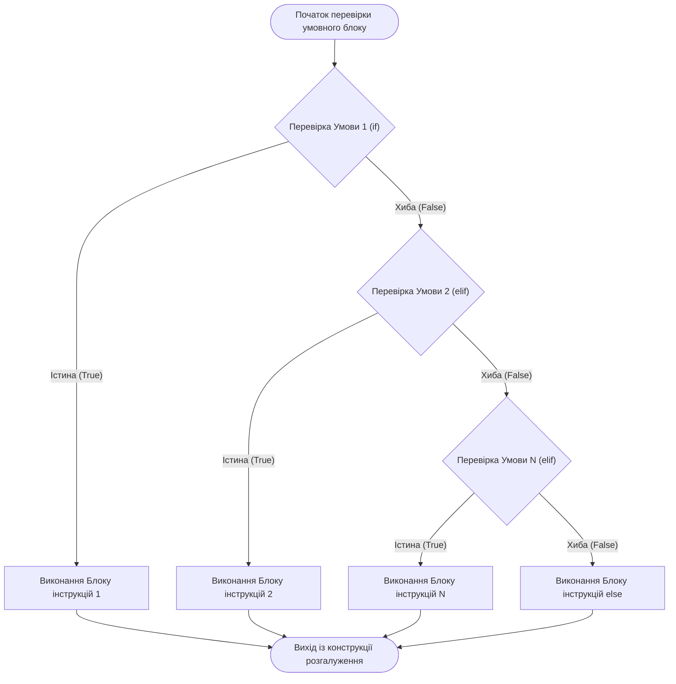
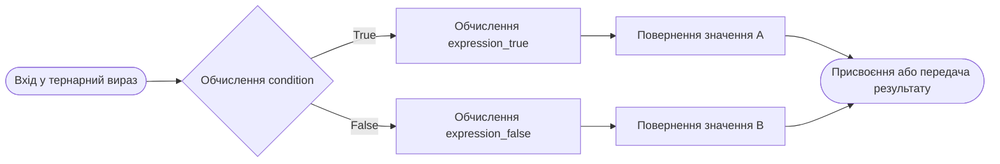
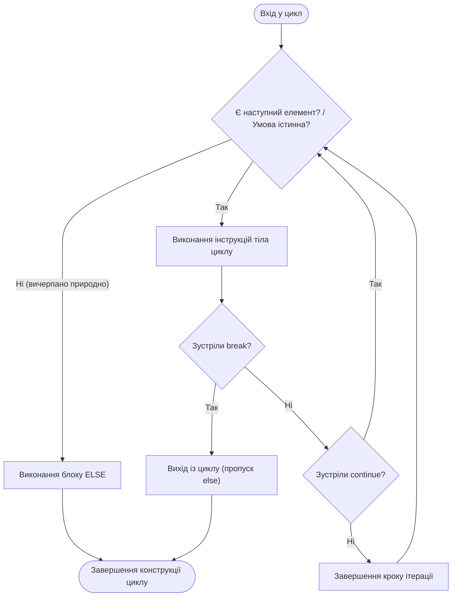

# ЗМІСТОВИЙ МОДУЛЬ 1. ТЕМА 2. КЕРУВАННЯ ПОТОКОМ ВИКОНАННЯ: РОЗГАЛУЖЕНІ ТА ЦИКЛІЧНІ АЛГОРИТМІЧНІ КОНСТРУКЦІЇ

---

## 2.1. Умовне виконання: повні та неповні форми if-elif-else, правила відступів (PEP 8), логічні зв'язки and, or, not і коротка схема обчислення (short-circuit evaluation)

### Основний зміст та теоретичний базис

Керування послідовністю виконання інструкцій є фундаментальним аспектом побудови будь-якого алгоритму в комп'ютерній інженерії. У базовому режимі процесор виконує команди лінійно, однак розв'язання реальних обчислювальних задач вимагає адаптивної зміни траєкторії обчислювального процесу залежно від динамічного стану системи, поточних значень змінних або зовнішніх сигналів. Конструкція розгалуження забезпечує умовну зміну потоку керування шляхом обчислення булевих виразів-предикатів.

У мові програмування Python розгалуження реалізовано за допомогою операторів `if`, `elif` та `else`. На відміну від більшості класичних мов програмування, таких як C, C++ або Java, де для структурування блоків коду застосовуються фігурні дужки `{}` або спеціальні ключові слова `begin` і `end`, синтаксис Python базується на концепції синтаксичного виділення блоків відступами (відомій як *off-side rule*). 

Лексичний аналізатор інтерпретатора перетворює пробіли на початку рядка у службові токени `INDENT` (збільшення рівня вкладеності) та `DEDENT` (зменшення рівня вкладеності). Стандарт інженерного оформлення коду PEP 8 вимагає використання рівно чотирьох символів пробілу для кожного рівня ієрархії, суворо забороняючи змішування символів табуляції та пробілів, оскільки це призводить до виникнення винятку `TabError`.

Неповна форма умовного оператора містить лише блок `if` і забезпечує виконання вкладених інструкцій виключно у разі істинності заданого предиката. Повна бінарна форма `if-else` створює дві взаємовиключні гілки виконання. Для реалізації складних деревоподібних розгалужень використовується каскадна конструкція `if-elif-else`, яка є високоефективною альтернативою операторам багатоваріантного вибору на кшталт `switch-case`. 

Обчислення умовних виразів у ланцюжку `elif` відбувається строго послідовно зверху вниз до першого виразу, що оцінюється як істинний. Після виконання відповідного блоку інструкцій інтерпретатор повністю ігнорує всі наступні блоки `elif` та фінальний блок `else`, негайно передаючи керування за межі всієї конструкції розгалуження.

*Рисунок 1 — Логічна схема виконання каскадної конструкції розгалуження if-elif-else*

Проаналізуємо схему виконання алгоритму розгалуження. Граф потоку керування наочно демонструє детермінований характер перевірки умов. Жоден із вкладених блоків не може бути виконаний одночасно з іншим. Якщо жоден із предикатів у ланцюжку `if-elif` не набув значення істини, керування безумовно передається блоку `else`. Якщо секція `else` відсутня, а всі умови виявилися хибними, умовний оператор завершує роботу без виконання будь-яких побічних дій.

Оцінювання умов у мові Python базується на перевірці так званої істинності об'єктів (*truthiness*). Будь-який тип даних може бути приведений до логічного значення `bool` за допомогою внутрішнього виклику методу `__bool__()` або, у разі його відсутності, методу визначення довжини `__len__()`. Об'єкти, що представляють числові нулі будь-якого типу (`0`, `0.0`, `0j`), порожні колекції (`""`, `[]`, `()`, `{}`, `set()`) та спеціальний об'єкт `None`, автоматично приводяться до логічного значення `False`. Усі інші об'єкти інтерпретуються як `True`.

Формування складених логічних умов здійснюється за допомогою логічних операторів `and` (кон'юнкція), `or` (диз'юнкція) та `not` (логічне заперечення). Пріоритет оператора `not` є найвищим, далі йде `and`, а найнижчий пріоритет має оператор `or`. За необхідності зміни порядку обчислень застосовуються круглі дужки.

Фундаментальним механізмом виконання логічних операцій у Python є **коротка схема обчислення** (*short-circuit evaluation*). Відповідно до цього підходу, обчислення операндів у ланцюжку логічних зв'язок відбувається зліва направо і негайно зупиняється, як тільки кінцеве логічне значення всього виразу стає однозначно визначеним. Особливістю мови Python є те, що оператори `and` та `or` повертають не булеве значення `True` або `False`, а безпосередньо значення того операнда, на якому зупинилося обчислення.

Математично роботу оператора кон'юнкції $z = x \land y$ у контексті короткої схеми Python можна формалізувати за допомогою наступного кусочно-заданого правила:

$$z = \text{eval}(x \text{ and } y) = \begin{cases} x, & \text{якщо } \mathbb{B}(x) = \text{False}, \\ y, & \text{якщо } \mathbb{B}(x) = \text{True} \end{cases}$$

де $x$ та $y$ — довільні вирази або об'єкти мови Python; $\mathbb{B}(x)$ — функція перетворення об'єкта $x$ до булевого типу (`bool(x)`). Якщо перший операнд $x$ хибний, весь вираз гарантовано не може бути істинним, тому операнд $y$ взагалі не інтерпретується, що запобігає виникненню критичних помилок часу виконання (наприклад, помилки ділення на нуль або звернення за неіснуючим індексом).

Аналогічно, для логічного оператора диз'юнкції $z = x \lor y$ коротка схема обчислення описується залежністю:

$$z = \text{eval}(x \text{ or } y) = \begin{cases} x, & \text{якщо } \mathbb{B}(x) = \text{True}, \\ y, & \text{якщо } \mathbb{B}(x) = \text{False} \end{cases}$$

де $x$ виступає визначальним операндом: якщо $\mathbb{B}(x) = \text{True}$, результат $x$ повертається негайно, а обчислення виразу $y$ блокується. Це дозволяє створювати надійні інженерні конструкції перевірки захисних умов (guard clauses) в один рядок, наприклад: `is_valid = (denominator != 0) and (numerator / denominator > threshold)`.

Таблиця 2.1 систематизує правила приведення стандартних типів даних до булевого еквівалента, що є теоретичним підґрунтям для роботи умовних операторів.

*Таблиця 2.1 — Правила оцінювання істинності стандартних типів даних у логічному контексті*

| Тип даних | Значення, що інтерпретуються як `False` | Значення, що інтерпретуються як `True` | Механізм перевірки на рівні CPython |
| :--- | :--- | :--- | :--- |
| **`int`, `float`, `complex`** | `0`, `0.0`, `0.0j`, `-0.0` | Будь-яке ненульове числове значення | Виклик слота `nb_bool` або порівняння бітів зі значенням нуля |
| **`bool`** | `False` | `True` | Пряма ідентифікація вбудованого об'єкта-сінглтона |
| **`str`** | Порожній рядок `""` | Непорожній рядок довільної довжини | Оцінка поля `ob_size` у структурі `PyASCIIObject` |
| **`list`, `tuple`** | Порожні послідовності `[]`, `()` | Послідовності, що містять щонайменше один елемент | Перевірка лічильника елементів `ob_size > 0` |
| **`dict`, `set`** | Порожні колекції `{}`, `set()` | Колекції з кількістю елементів більше нуля | Оцінка заповненості внутрішньої хеш-таблиці |
| **`NoneType`** | Єдиний об'єкт `None` | Не існує | Порівняння покажчика пам'яті з глобальним `Py_None` |

Наведений системний аналіз підтверджує, що концепція істинності охоплює всі внутрішні структури CPython. Це дозволяє розробникам писати лаконічний та водночас високопродуктивний код перевірки стану апаратних буферів, системних прапорців та каналів передачі даних.

---

## 2.2. Тернарний умовний вираз (Conditional Expressions): синтаксис та інженерні сценарії застосування

### Основний зміст та теоретичний базис

У теорії мов програмування розрізняють поняття інструкції (*statement*) та виразу (*expression*). Інструкція визначає дію та керує потоком виконання, однак вона не повертає прямого обчислювального значення, яке можна було б безпосередньо передати як аргумент функції або використати у правій частині оператора присвоєння. З іншого боку, вираз обов'язково редукується до конкретного результуючого об'єкта ($R$-value). 

Класичний умовний оператор `if-else` є інструкцією. Для ситуацій, коли вибір між двома альтернативними значеннями повинен здійснюватися безпосередньо всередині обчислювального виразу, починаючи з версії Python 2.5 (згідно з документом PEP 308), було впроваджено **тернарний умовний вираз** (*conditional expression*).

Граматична структура тернарного виразу у Python відрізняється від традиційного C-подібного синтаксису `condition ? true_val : false_val` і має такий синтаксичний формат:

$$\text{result} = \text{expression\_true} \textbf{ if } \text{condition} \textbf{ else } \text{expression\_false}$$

де $\text{condition}$ — логічний предикат; $\text{expression\_true}$ — вираз, який обчислюється і повертається у разі $\mathbb{B}(\text{condition}) = \text{True}$; $\text{expression\_false}$ — вираз, який обчислюється і повертається у разі $\mathbb{B}(\text{condition}) = \text{False}$.

Семантичною особливістю тернарного виразу є суворе дотримання принципу лінивого обчислення (*lazy evaluation*). Інтерпретатор спочатку обчислює предикат $\text{condition}$. Якщо умова істинна, обчислюється виключно лівий вираз $\text{expression\_true}$, тоді як правий вираз $\text{expression\_false}$ навіть не аналізується на етапі виконання. Якщо умова хибна, обчислюється лише правий вираз $\text{expression\_false}$. 

Ця властивість гарантує безпеку виконання обчислень у випадках, коли одна з альтернативних гілок містить операцію, потенційно небезпечну для виконання за певних граничних умов.

*Рисунок 2 — Порядок оцінювання та обчислення гілок тернарного умовного виразу*

Графічна інтерпретація порядку обчислення чітко ілюструє, що тернарний вираз працює як селектор потоку даних. На відміну від позиційного порядку читання коду людиною (зліва направо), процесорне виконання завжди ставить на перше місце центральну частину виразу — предикат перевірки.

В інженерній практиці комп'ютерної інженерії тернарні вирази найчастіше використовуються у таких сценаріях:
* Ініціалізація апаратних конфігурацій та встановлення значень за замовчуванням у разі відсутності телеметричного сигналу: `sampling_rate = config.rate if config.is_valid() else DEFAULT_RATE`.
* Реалізація кусочно-неперервних математичних залежностей та функцій обмеження сигналів (клемпування / насичення):

$$f(u) = \begin{cases} U_{\max}, & \text{якщо } u \ge U_{\max} \\ u, & \text{якщо } u < U_{\max} \end{cases}$$

на рівні коду набуває лаконічного вигляду: `voltage_out = MAX_VOLTAGE if measured_voltage > MAX_VOLTAGE else measured_voltage`.
* Нормалізація та фільтрація вхідних даних безпосередньо у виразах спискових включень (*list comprehensions*).
* Форматування текстових повідомлень у логах системного адміністрування залежно від статусу операції: `log_status = f"Port status: {'UP' if link_active else 'DOWN'}"`.

Незважаючи на високу виразність, мова Python дозволяє створювати вкладені тернарні вирази вигляду: `a if cond1 else b if cond2 else c`. Проте з точки зору стандартів інженерної розробки глибоке вкладення тернарних операторів категорично не рекомендується, оскільки воно істотно підвищує когнітивне навантаження при читанні коду та ускладнює статичний аналіз програмного забезпечення.

---

## 2.3. Циклічні конструкції: цикл з передумовою while, цикл ітерації for по ітерованих послідовностях, функція range(). Керування ітераціями: оператори break, continue, pass та специфіка блоку else у циклах

### Основний зміст та теоретичний базис

Циклічні конструкції є базовим засобом автоматизації повторюваних обчислень, масової обробки структур даних та організації системних циклів опитування обладнання (polling loops). У мові Python реалізовано дві фундаментальні парадигми організації циклів: цикл із передумовою `while` та узагальнений цикл ітерації `for`.

Цикл з передумовою `while` виконує блок вкладених інструкцій доти, доки логічний вираз умови зберігає значення `True`. Перевірка умови здійснюється перед початком кожної ітерації. 

Формальна коректність циклу `while` вимагає дотримання умови збіжності: всередині тіла циклу обов'язково має модифікуватися стан змінних, що входять до предиката, таким чином, щоб за скінченну кількість кроків $k$ умова набула значення `False`:

$$\exists k \in \mathbb{N} : \mathbb{B}(\text{condition}(k)) = \text{False}$$

Порушення цього правила призводить до виникнення критичної помилки — **нескінченного циклу** (*infinite loop*), який викликає стовідсоткове завантаження процесорного ядра (CPU starvation) та блокування потоку виконання. Нескінченні цикли створюються свідомо лише у специфічних архітектурних патернах системного програмування, таких як диспетчери подій операційної системи або фонові сервіси-демони (`while True:`), із яких передбачено вихід за зовнішнім апаратним перериванням або умовною інструкцією переривання.

На відміну від багатьох інших мов програмування, де цикл `for` є лише синтаксичним еквівалентом лічильника з кроком, у мові Python цикл `for` реалізує фундаментальний патерн проектування **Ітератор** (*Iterator Protocol*). Він призначений для послідовного перебору елементів будь-якого ітерованого об'єкта (*iterable*): списків, кортежів, рядків, словників, множин, відкритих файлових потоків або користувацьких генераторів. 

Внутрішній механізм функціонування циклу `for element in sequence:` складається з наступних системних кроків:
1. Інтерпретатор звертається до об'єкта `sequence` та викликає низькорівневу функцію `iter(sequence)`, яка повертає спеціальний об'єкт-ітератор, що реалізує метод `__next__()`.
2. На кожній ітерації віртуальна машина викликає метод `next(iterator)`.
3. Отриманий об'єкт зв'язується зі змінною ітерації `element`, після чого виконується тіло циклу.
4. Процес циклічно триває до моменту, коли об'єкт-ітератор вичерпує послідовність і генерує службовий виняток `StopIteration`.
5. Віртуальна машина PVM автоматично перехоплює виняток `StopIteration` і коректно завершує роботу циклу, не викликаючи аварійної зупинки програми.

Для генерації строго детермінованих арифметичних прогресій цілих чисел у циклі `for` застосовується вбудований незмінний тип даних `range`. Функція `range` підтримує три форми виклику: `range(stop)`, `range(start, stop)` та `range(start, stop, step)`. Генерація послідовності здійснюється у напіввідкритому інтервалі $[start, stop)$, тобто кінцеве значення $stop$ ніколи не включається до результуючої послідовності. 

Математично $i$-й елемент послідовності $r(i)$, сформованої генератором `range(start, stop, step)`, описується лінійною функцією:

$$r(i) = start + i \times step, \quad \text{де } 0 \le i < n$$

де загальна кількість згенерованих ітерацій $n$ обчислюється через функцію взяття верхньої цілої частини (стелі):

$$n = \text{len}(range(start, stop, step)) = \max\left(0, \; \left\lceil \frac{stop - start}{step} \right\rceil\right)$$

Важливою архітектурною перевагою `range` у Python 3 є те, що цей об'єкт є лінивою послідовністю. Він не створює масив чисел у пам'яті фізично, а зберігає лише три атрибути: $start$, $stop$ та $step$. Завдяки цьому об'єкт `range(0, 10**12)` споживає рівно стільки ж оперативної пам'яті (фіксовані 48 байтів), як і `range(0, 10)`, забезпечуючи просторову складність $O(1)$.

Керування мікродинамікою ітерацій здійснюється за допомогою трьох спеціальних операторів:
* Оператор `break` здійснює негайне аварійне або дострокове переривання виконання циклу, передаючи керування на першу інструкцію за межами його блоку.
* Оператор `continue` припиняє виконання поточної ітерації циклу, ігнорує всі залиheaders інструкцій у тілі циклу та ініціює перехід до перевірки умови (у `while`) або взяття наступного елемента (у `for`).
* Оператор `pass` є синтаксичною порожньою операцією (*no-op*), яка не виконує жодних дій і використовується як тимчасова заглушка у порожніх блоках функцій, класів чи умовних переходів.

Унікальною синтаксичною конструкцією мови Python є наявність **блоку `else` у циклах `while` та `for`**. Блок `else` виконується тоді і тільки тоді, коли цикл завершив роботу природним шляхом (умова циклу `while` стала хибною або послідовність у циклі `for` була повністю вичерпана). 

Якщо ж вихід із циклу відбувся достроково за допомогою оператора `break`, блок `else` повністю ігнорується. Ця конструкція є високоефективним інженерним патерном для реалізації алгоритмів лінійного пошуку, усуваючи необхідність створення допоміжних булевих прапорців (*flag variables*).

*Рисунок 3 — Діаграма станів циклічної конструкції з інтеграцією операторів break, continue та блоку else*

Схема демонструє критичну біфуркацію потоку керування: блок `else` тісно пов'язаний із точкою природного вичерпання ітератора. У разі спрацьовування директиви `break` потік виконання миттєво оминає як залишок тіла циклу, так і блок `else`.

Таблиця 2.2 проводить комплексне порівняння циклічних конструкцій мови Python за ключовими технічними показниками.

*Таблиця 2.2 — Порівняльний аналіз циклічних конструкцій `while` та `for`*

| Параметр порівняння | Цикл з передумовою `while` | Цикл ітерації `for` |
| :--- | :--- | :--- |
| **Базовий механізм керування** | Обчислення булевого предиката перед кожною ітерацією | Протокол ітератора (`iter()`, `next()`, `StopIteration`) |
| **Сфера оптимального застосування** | Задачі з невідомою кількістю ітерацій, числові методи, очікування події | Перебір структур даних, фіксована кількість кроків, пакетна обробка |
| **Накладні витрати інтерпретатора** | Вищі за рахунок повторної оцінки змінних у виразі | Нижчі через оптимізоване C-виконання обходу колекції |
| **Ризик зациклення програми** | Високий у разі некоректного кроку модифікації лічильника | Відсутній при роботі зі скінченними послідовностями |
| **Підтримка блоку `else`** | Виконується, коли вираз умови повертає `False` | Виконується після вичерпання всіх елементів ітератора |
| **Просторова складність індексації** | Вимагає окремої змінної лічильника ($O(1)$) | При використанні `range()` просторова складність становить $O(1)$ |

Як видно з порівняльного аналізу, для задач комп'ютерної інженерії, пов'язаних з обробкою масивів фіксованої довжини, перевагу слід надавати циклу `for`, який мінімізує накладні витрати віртуальної машини та унеможливлює помилки розбіжності циклу.

---

### Питання для самоперевірки та аналітичного осмислення

1. У чому полягає фундаментальна відмінність підходу мови Python до структурування блоків коду за допомогою відступів від використання синтаксичних дужок у мовах C/C++? Які токени генерує лексичний аналізатор при зміні рівня відступів?
2. Поясніть концепцію короткої схеми обчислення (*short-circuit evaluation*) для логічних операторів `and` та `or`. Які практичні переваги цей механізм надає при перевірці захисних умов (наприклад, запобігання діленню на нуль або уникнення винятку `IndexError`)?
3. Чому значення виразу `[] or "default"` у Python дорівнює `"default"`, а виразу `[1, 2] and 0` дорівнює `0`? Опишіть правило повернення фактичного операнда замість булевих констант.
4. Розкрийте семантичну різницю між умовним оператором `if-else` як інструкцією (*statement*) та тернарним умовним виразом як виразом (*expression*). Чому тернарний вираз можна використовувати всередині спискових включень, а звичайний `if` — ні?
5. Опишіть внутрішній механізм роботи циклу `for` на рівні протоколу ітератора. Яку роль відіграє службовий виняток `StopIteration` і чому він не призводить до аварійного завершення програми?
6. Доведіть, що об'єкт `range(0, 1000000000)` у середовищі CPython споживає константний обсяг пам'яті $O(1)$. Які внутрішні параметри зберігаються в структурі `PyRangeObject`?
7. За яких конкретних умов виконується блок `else`, асоційований із циклом `for` або `while`? Наведіть інженерний приклад використання конструкції `for-else` для пошуку несправного вузла комп'ютерної мережі без використання допоміжних прапорцевих змінних.