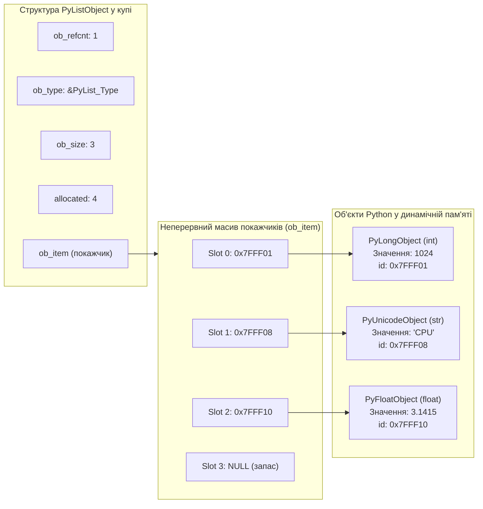
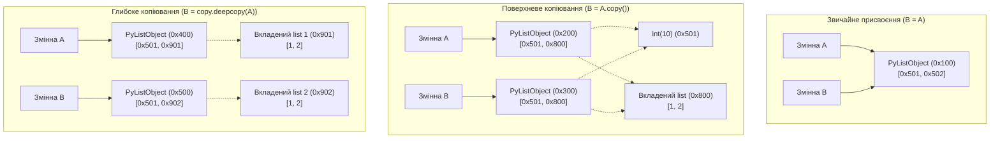
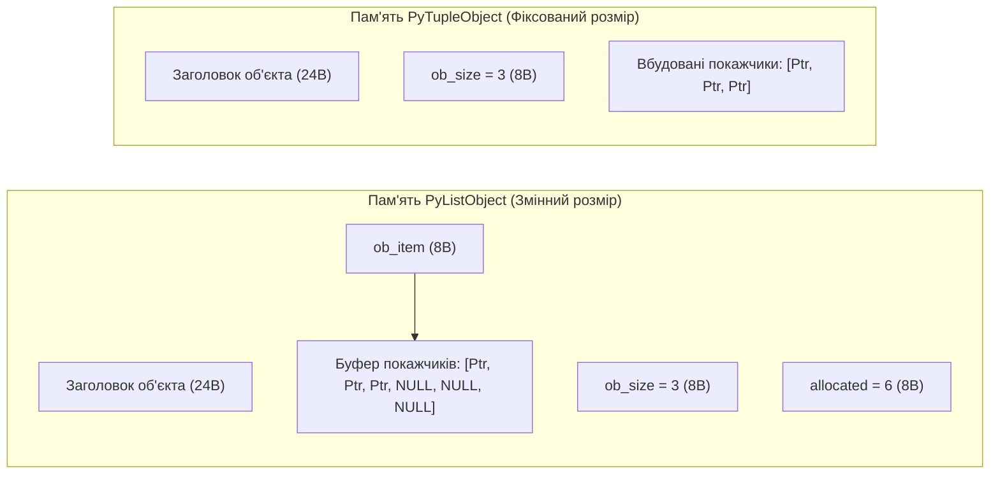

# ЗМІСТОВИЙ МОДУЛЬ 1. ТЕМА 3. ВПОРЯДКОВАНІ СТРУКТУРИ ДАНИХ: СПИСКИ (LIST) ТА КОРТЕЖІ (TUPLE)

---

## 3.1. Список (list) як динамічний масив посилань: створення, індексація, зрізи (slicing: [start:stop:step]), багатовимірні вкладені списки

### Основний зміст та теоретичний базис

У системному програмуванні та комп'ютерній інженерії організація структур даних у пам'яті визначає обчислювальну складність алгоритмів і просторову ефективність програмного забезпечення. Мова Python пропонує високорівневу впорядковану послідовність — **список** (`list`), який за своєю внутрішньою архітектурою в еталонній реалізації CPython є інкапсульованим динамічним масивом покажчиків. 

На відміну від статичних масивів мов C або C++, де елементи однакового базового типу розташовуються в пам'яті суцільним неперервним блоком безпосередньо зі своїми бінарними значеннями, список Python забезпечує гетерогенність завдяки непрямій адресації. Внутрішня C-структура `PyListObject` зберігає не самі дані, а масив адрес (покажчиків типу `PyObject*`), кожен із яких веде до відповідного об'єкта, розташованого у довільному місці динамічної пам'яті (купи).

```c
typedef struct {
    PyObject_VAR_HEAD
    PyObject **ob_item;
    Py_ssize_t allocated;
} PyListObject;
```

У наведеній структурі макрос `PyObject_VAR_HEAD` містить системні поля: лічильник посилань `ob_refcnt`, покажчик на дескриптор типу `ob_type` та кількість фактично збережених елементів `ob_size`. Поле `ob_item` є покажчиком на блок неперервної пам'яті, що містить покажчики на об'єкти, а поле `allocated` фіксує сумарну кількість зарезервованих слотів у виділеному буфері.


*Рисунок 1 — Фізична організація списку в CPython: неперервний масив покажчиків та розпорошені об'єкти в купі*

Наведена схема розкриває механізм забезпечення довільного доступу до елементів. Оскільки покажчики на елементи розташовані в пам'яті строго послідовно один за одним, обчислення фізичної адреси будь-якого $i$-го слота виконується за один такт процесора за формулою адресної арифметики:

$$\text{Address}(L[i]) = \text{BaseAddress}(ob\_item) + i \times \text{sizeof}(\text{PyObject}^*)$$

де $\text{BaseAddress}(ob\_item)$ позначає початкову адресу виділеного масиву покажчиків; $i$ є індексом елемента ($0 \le i < ob\_size$); $\text{sizeof}(\text{PyObject}^*)$ дорівнює 8 байтам на 64-розрядних апаратних архітектурах. Звідси випливає, що операція індексації списку в Python має строгу константну часову складність $O(1)$.

Створення списку здійснюється за допомогою літерала квадратних дужок `[]` або виклику вбудованої фабричної функції `list()`. Використання літерала є швидшим, оскільки транслюється компілятором у спеціалізовані опкоди `BUILD_LIST`, тоді як функція `list()` вимагає пошуку ідентифікатора у глобальному просторі імен або таблиці вбудованих функцій. 

Індексація підтримує роботу як із додатними, так і з від'ємними індексами. При передачі від'ємного значення інтерпретатор нормалізує його шляхом додавання поточної довжини списку: $i_{\text{actual}} = n + i_{\text{neg}}$, де $n = \text{len}(L)$. Якщо обчислений індекс виходить за межі діапазону $[0, n-1]$, віртуальна машина PVM збуджує виняток `IndexError`.

Операція вилучення зрізу (*slicing*) дозволяє отримати підпослідовність елементів і має синтаксис `L[start:stop:step]`. Зріз списку завжди повертає **новий об'єкт списку** (`PyListObject`), у який копіюються відповідні покажчики на об'єкти з вихідного списку (поверхнева копія підмасиву). За замовчуванням параметри набувають значень: $start = 0$, $stop = n$, $step = 1$. Кількість елементів $k$, що потрапляють у зріз, визначається формулою:

$$k = \max\left(0, \; \left\lceil \frac{stop - start}{step} \right\rceil\right)$$

У разі використання від'ємного кроку ($step < 0$) рух за індексами здійснюється у зворотному напрямку, при цьому значення за замовчуванням інвертуються: $start = n - 1$, $stop = -(n + 1)$. Операція взяття зрізу виконується за час $O(k)$ та вимагає виділення $O(k)$ додаткової оперативної пам'яті.

Багатовимірні (вкладені) списки є основним засобом представлення матриць, тензорів та табличних структур без використання зовнішніх бібліотек. Матриця $A \in \mathbb{R}^{m \times n}$ моделюється як список довжиною $m$, елементами якого є окремі списки довжиною $n$. При проектуванні таких структур критично уникати типової інженерної помилки поверхневого множення списків вигляду `matrix = [[0] * n] * m`. За такої ініціалізації створюється зовнішній список, що містить $m$ копій одного й того самого покажчика на єдиний внутрішній список у пам'яті, що призводить до синхронної зміни всіх рядків при модифікації одного елемента:

$$\text{id}(\text{matrix}[0]) = \text{id}(\text{matrix}[1]) = \dots = \text{id}(\text{matrix}[m-1])$$

Коректна ініціалізація вимагає побудови незалежних екземплярів для кожного рядка через генератори списків: `matrix = [[0 for _ in range(n)] for _ in range(m)]`. Для обчислення класичного добутку двох сумісних матриць $A \in \mathbb{R}^{m \times p}$ та $B \in \mathbb{R}^{p \times n}$, де результуючий елемент визначається як $C_{ij} = \sum_{k=0}^{p-1} A_{ik} B_{kj}$, використовується трирівневий вкладений цикл:

```python
# Класичне матричне множення C = A * B
m, p, n = len(A), len(A[0]), len(B[0])
C = [[sum(A[i][k] * B[k][j] for k in range(p)) for j in range(n)] for i in range(m)]
```

*Таблиця 3.1 — Асимптотична складність базових операцій зі списками у середовищі CPython*

| Операція | Синтаксичний вираз | Середня складність | Найгірша складність | Примітка та системний механізм |
| :--- | :--- | :---: | :---: | :--- |
| **Доступ за індексом** | `L[i]` | $O(1)$ | $O(1)$ | Пряме обчислення зміщення покажчика |
| **Присвоєння за індексом** | `L[i] = value` | $O(1)$ | $O(1)$ | Заміна покажчика зі зміною `ob_refcnt` |
| **Визначення довжини** | `len(L)` | $O(1)$ | $O(1)$ | Зчитування значення поля `ob_size` |
| **Отримання зрізу** | `L[start:stop]` | $O(k)$ | $O(k)$ | Виділення пам'яті та копіювання $k$ покажчиків |
| **Перевірка наявності** | `x in L` | $O(n)$ | $O(n)$ | Послідовний лінійний перебір елементів |
| **Множення списку** | `L * k` | $O(k \times n)$ | $O(k \times n)$ | Виділення нового буфера та копіювання посилань |

Наведена таблиця демонструє, що завдяки масиву покажчиків операції позиційного читання та запису виконуються з максимальною теоретичною швидкістю, проте пошук елемента за значенням вимагає лінійного сканування.

---

## 3.2. Мутабельність списків: методи додавання (append, extend, insert), вилучення (pop, remove, clear, del), сортування (sort vs sorted, reverse) та поверхневе/глибоке копіювання (shallow vs deep copy)

### Основний зміст та теоретичний базис

Списки є змінюваними (mutable) об'єктами: їхній розмір, внутрішня структура та склад елементів можуть динамічно змінюватися під час виконання програми без зміни ідентифікатора самого списку (`id(L) == const`). Для забезпечення високої продуктивності при частих операціях додавання елементів CPython реалізує стратегію **надлишкового виділення пам'яті** (*over-allocation*). 

Коли розмір списку перевищує ємність виділеного буфера (`ob_size > allocated`), внутрішня функція `list_resize()` у вихідному коді `listobject.c` виділяє новий блок пам'яті з запасом, розмір якого розраховується за формулою:

$$\text{allocated}_{\text{new}} = n + (n \gg 3) + (n < 9 \; ? \; 3 : 6)$$

де $n = ob\_size_{\text{new}}$ — необхідна кількість слотів; $n \gg 3$ позначає побітовий зсув праворуч на 3 розряди (цілочисельне ділення на 8). Завдяки геометричному зростанню буфера амортизована часова складність додавання елемента в кінець списку за допомогою методу `append(x)` становить $O(1)$, хоча поодинокі виклики, що ініціюють системне системне перерозподілення через `realloc()`, мають складність $O(n)$.

Методи модифікації списку мають різну алгоритмічну ефективність:
* Метод `append(x)` додає один об'єкт у кінець списку з амортизованою складністю $O(1)$.
* Метод `extend(iterable)` розширює список, ітеруючи переданий об'єкт і послідовно додаючи всі його елементи за час $O(k)$, де $k$ — розмір доданої послідовності.
* Метод `insert(i, x)` вставляє об'єкт `x` у довільну позицію `i`. Це вимагає зсуву всіх наступних покажчиків праворуч за допомогою низькорівневої C-функції `memmove()`, тому операція має лінійну складність $O(n)$.
* Метод `pop([i])` вилучає та повертає елемент із позиції `i`. Вилучення з кінця списку (`pop()`) виконується за $O(1)$, тоді як вилучення з початку або середини (`pop(0)`) вимагає зсуву покажчиків ліворуч і триває $O(n)$.
* Метод `remove(x)` здійснює лінійний пошук першого входження об'єкта, значення якого дорівнює `x` (порівняння через `==`), і вилучає його за сумарний час $O(n)$, збуджуючи `ValueError` у разі відсутності збігу.
* Оператор `del L[i]` або `del L[start:stop]` знищує вказаний елемент чи діапазон на рівні структури списку та декрементує лічильники посилань відповідних об'єктів.
* Метод `clear()` повністю очищає список, обнуляючи `ob_size` та вивільняючи ресурси буфера.

Сортування списків у Python реалізовано за допомогою гібридного адаптивного алгоритму **Timsort** (поєднання сортування злиттям Merge Sort та сортування вставками Insertion Sort). Алгоритм знаходить у вхідних даних природно впорядковані неперервні послідовності (*runs*) і ефективно об'єднує їх. 

Timsort є стабільним алгоритмом сортування (*stable sort*), тобто він гарантовано зберігає початковий відносний порядок розташування еквівалентних елементів. Теоретична часова складність Timsort становить $O(n)$ для майже впорядкованих масивів та $O(n \log n)$ у середньому й найгіршому випадках, при просторовій складності $O(n)$.

У мові розрізняють два підходи до сортування:
1. Метод `list.sort(key=None, reverse=False)` виконує сортування на місці (*in-place*), безпосередньо мутуючи масив покажчиків вихідного списку і повертаючи значення `None`.
2. Вбудована функція `sorted(iterable, key=None, reverse=False)` приймає довільну ітеровану послідовність, створює новий відсортований список і повертає його, залишаючи джерело даних незмінним.

Параметр `key` приймає функцію одного аргументу, яка обчислює ключ порівняння для кожного елемента. Спеціальний метод `list.reverse()` змінює порядок елементів списку на протилежний на місці за час $O(n)$.

Особливе місце в комп'ютерній інженерії посідає семантика копіювання складених структур даних. При простому присвоєнні `B = A` новий об'єкт списку не створюється: змінна `B` стає лише додатковим іменованим посиланням на той самий екземпляр `PyListObject` у пам'яті (`id(A) == id(B)`).


*Рисунок 2 — Порівняльна схема розміщення в пам'яті структур при присвоєнні, поверхневому та глибокому копіюванні*

Як свідчить представлена діаграма, **поверхнева копія** (*shallow copy*), яка створюється через `B = A.copy()`, `B = A[:]` або `B = list(A)`, дублює виключно зовнішню структуру списку — виділяється новий `PyListObject`, однак його слоти заповнюються тими самими покажчиками на елементи. 

Якщо список містить змінні вкладені структури (наприклад, інші списки), зміна вкладеного списку через `B[1][0] = 99` призведе до автоматичної зміни `A[1][0]`, оскільки покажчик `0x800` веде до одного й того самого фізичного блоку пам'яті. 

**Глибока копія** (*deep copy*), яка реалізується за допомогою функції `copy.deepcopy(A)`, виконує повний рекурсивний обхід графа об'єктів. Вона створює дублікати всіх складених підструктур, усуваючи будь-яку спільну мутабельність між вихідним та цільовим об'єктами.

*Таблиця 3.2 — Класифікація та системні характеристики методів маніпуляції списками*

| Метод / Оператор | Зміна на місці (In-place) | Повертає значення | Часова складність | Системні накладні витрати пам'яті |
| :--- | :---: | :---: | :---: | :--- |
| `append(x)` | Так | `None` | $O(1)$ амортизована | Можливий виклик `realloc` за формулою надлишку |
| `extend(iter)` | Так | `None` | $O(k)$ | Одноразове розширення буфера на $k$ слотів |
| `insert(i, x)` | Так | `None` | $O(n)$ | Побайтовий зсув покажчиків управо (`memmove`) |
| `pop(i)` | Так | Елемент | $O(n - i)$ | Побайтовий зсув покажчиків уліво |
| `remove(x)` | Так | `None` | $O(n)$ | Лінійне порівняння $O(n)$ + зсув елементів $O(n)$ |
| `sort()` | Так | `None` | $O(n \log n)$ | Тимчасовий системний буфер Timsort ($O(n)$) |
| `sorted(iter)` | Ні | Новий `list` | $O(n \log n)$ | Виділення нового об'єкта `PyListObject` |
| `deepcopy(L)` | Ні | Новий `list` | $O(N_{\text{total}})$ | Повна дуплікація всього дерева об'єктів |

Аналітичний огляд таблиці демонструє, що некоректний вибір методу (наприклад, багаторазове використання `insert(0, x)` замість `append(x)` з подальшим реверсуванням) може погіршити швидкодію алгоритму з лінійної $O(n)$ до квадратичної $O(n^2)$.

---

## 3.3. Кортежі (tuple): незмінність, оптимізація споживання пам'яті (__sizeof__), кортежі як ключі словників, розпакування послідовностей (tuple unpacking, *args). Генератори списків (List Comprehensions)

### Основний зміст та теоретичний базис

**Кортеж** (`tuple`) є впорядкованою незмінною (immutable) послідовністю довільних об'єктів. Синтаксично кортеж позначається круглими дужками `()`, або формується простим перерахуванням елементів через кому. Створення одноелементного кортежу обов'язково вимагає наявності висячої коми (`single_element_tuple = (42,)`), оскільки вираз `(42)` без коми сприймається синтаксичним парсером як скалярне ціле число в арифметичних дужках.

На внутрішньому рівні CPython кортеж описується структурою `PyTupleObject`:

```c
typedef struct {
    PyObject_VAR_HEAD
    PyObject *ob_item[1];
} PyTupleObject;
```

Ключова архітектурна відмінність кортежу від списку полягає у відсутності поля `allocated`. Оскільки кортеж не може змінювати свій розмір після ініціалізації, пам'ять під масив покажчиків `ob_item` виділяється строго під фактичну кількість елементів (`ob_size`) без будь-якого надлишкового резервування. 

Це забезпечує значну просторову оптимізацію: порожній кортеж у 64-розрядному середовищі займає 40 байтів, тоді як порожній список потребує 56 байтів, а при заповненні елементами різниця у споживанні пам'яті зростає внаслідок надлишкового алокування списків.


*Рисунок 3 — Порівняння фізичного розміщення в пам'яті структур PyListObject та PyTupleObject*

Схема демонструє відсутність додаткового рівня непрямої адресації в кортежі. Більше того, інтерпретатор CPython реалізує оптимізацію повторного використання пам'яті: порожній кортеж `()` є глобальним об'єктом-сінглтоном (`id(()) == id(tuple())`), а для кортежів довжиною до 20 елементів підтримується масив вільних списків (*free lists*), що дозволяє уникати дорогих системних викликів виділення пам'яті `malloc()` при їх частому створенні та знищенні.

Фундаментальною властивістю кортежу є можливість його використання як ключа в хеш-таблицях (словниках `dict` та множинах `set`). Умова хешованості об'єкта (*hashability*) вимагає наявності незмінного протягом життя об'єкта хеш-значення, що обчислюється спеціальним методом `__hash__()`. 

Кортеж є хешованим тоді і тільки тоді, коли всі його елементи є рекурсивно хешованими. Кортеж `(1, 2, "CPU")` може виступати ключем словника, оскільки містить виключно незмінні скаляри. Якщо ж кортеж містить змінний елемент, наприклад список `(1, [2, 3])`, спроба його хешування призведе до генерації винятку `TypeError: unhashable type: 'list'`.

Операція **розпакування послідовностей** (*sequence unpacking*) дозволяє деструктурувати елементи кортежу чи списку безпосередньо в окремі змінні. Кількість ідентифікаторів ліворуч від оператора присвоєння повинна точно збігатися з довжиною послідовності праворуч:

$$a, b, c = (10, 20, 30)$$

Розширене розпакування з використанням оператора зірочки `*` (впроваджене у PEP 3132) дозволяє перехоплювати довільну змінну кількість елементів у вигляді списку:

```python
# Розширене позиційне розпакування
head, *middle, tail = (1, 2, 3, 4, 5)
# head = 1, middle = [2, 3, 4], tail = 5
```

Цей механізм лежить в основі позиційного пакування аргументів функцій `*args`, де всі передані параметри формують незмінний кортеж усередині тіла функції.

**Генератори списків** (*List Comprehensions*) є синтаксичним засобом декларативного опису побудови списків на основі ітерованих послідовностей. Загальна математична форма генератора списків відповідає нотації визначення множин у теорії множин:

$$\{f(x) \mid x \in S \land P(x)\}$$

Синтаксично в Python цей вираз записується у вигляді:

```python
[expression(x) for x in iterable if predicate(x)]
```

де `expression(x)` — довільна функція трансформації елемента; `iterable` — вхідна послідовність; `predicate(x)` — необов'язковий фільтруючий логічний предикат.

List Comprehensions виконуються значно швидше, ніж аналогічні імперативні цикли з методом `append()`. Це зумовлено тим, що компілятор CPython оптимізує генератори списків на рівні байт-коду, використовуючи спеціалізовану інструкцію `LIST_APPEND`. Ця інструкція додає елемент безпосередньо у внутрішній масив `ob_item` без необхідності щоразу завантажувати метод `append` із простору імен об'єкта та створювати стековий кадр виклику функції.

Генератори списків підтримують роботу з кількома рівнями вкладеності, що є зручним інструментом для задач матричної алгебри, наприклад, операції транспонування матриці $A^T$, де $(A^T)_{ij} = A_{ji}$:

```python
# Транспонування матриці розмірністю m x n
matrix = [[1, 2, 3], [4, 5, 6]]
transposed = [[row[i] for row in matrix] for i in range(len(matrix[0]))]
# Результат: [[1, 4], [2, 5], [3, 6]]
```

*Таблиця 3.3 — Комплексне інженерне порівняння списків (`list`) та кортежів (`tuple`)*

| Характеристика | Список (`list`) | Кортеж (`tuple`) |
| :--- | :--- | :--- |
| **Змінюваність (Mutability)** | Змінюваний (Mutable) | Незмінний (Immutable) |
| **Розмір у пам'яті (порожній)** | 56 байтів (на 64-бітній PVM) | 40 байтів (на 64-бітній PVM) |
| **Резервування пам'яті** | Надлишкове алокування (Over-allocation) | Суворе точне алокування під розмір |
| **Можливість бути ключем dict** | Заборонено (викликає `TypeError`) | Дозволено (якщо всі елементи незмінні) |
| **Швидкодія ітерації** | Повільніша через непряму адресацію буфера | Швидша на 10–15% завдяки кешуванню CPython |
| **Пул повторного використання** | Вільні списки для структур `PyListObject` | Free lists для кортежів фіксованих розмірів ($\le 20$) |
| **Основне інженерне призначення** | Динамічні колекції, накопичувачі даних, стеки | Фіксовані записи, параметри конфігурації, координати |

Порівняльний аналіз підтверджує, що для статичних конфігураційних даних та передачі параметрів у функціях перевагу слід надавати кортежам, що гарантує захист даних від несанкціонованої мутації та оптимізує використання пам'яті.

---

### Питання для самоперевірки та аналітичного осмислення

1. Яким чином влаштована внутрішня C-структура `PyListObject` в інтерпретаторі CPython? Чому операція індексації списку виконується за константний час $O(1)$ незалежно від розміру списку?
2. Опишіть алгоритмічний механізм надлишкового виділення пам'яті (*over-allocation*) при додаванні елементів до списку. Чому амортизована складність методу `append()` становить $O(1)$, а складність `insert(0, x)` є лінійною $O(n)$?
3. У чому полягає принципова відмінність між поверхневим копіюванням списку (`shallow copy`) та глибоким копіюванням (`deep copy`)? Які непередбачувані побічні ефекти можуть виникнути при модифікації вкладеного списку у поверхневій копії?
4. Охарактеризуйте алгоритм сортування Timsort. Які його характеристики щодо стабільності, а також часової складності у найкращому, середньому та найгіршому випадках?
5. Чому кортеж `(1, 2, [3, 4])` не може бути використаний як ключ словника, незважаючи на те, що сам кортеж належить до незмінного типу `tuple`? Яким математичним критеріям повинен відповідати об'єкт для підтримки протоколу `__hash__()`?
6. За рахунок яких низькорівневих оптимізацій віртуальної машини CPython генератори списків (*List Comprehensions*) демонструють вищу швидкість виконання порівняно з класичними циклами `for`, що використовують метод `list.append()`?
7. Поясніть причину виникнення логічної помилки при створенні нульової матриці розмірністю $3 \times 3$ за допомогою виразу `A = [[0] * 3] * 3`. Які адреси поверне функція `id()` для окремих рядків такої матриці?