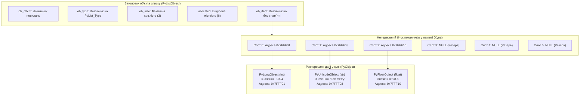
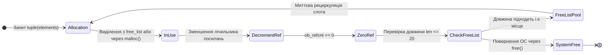
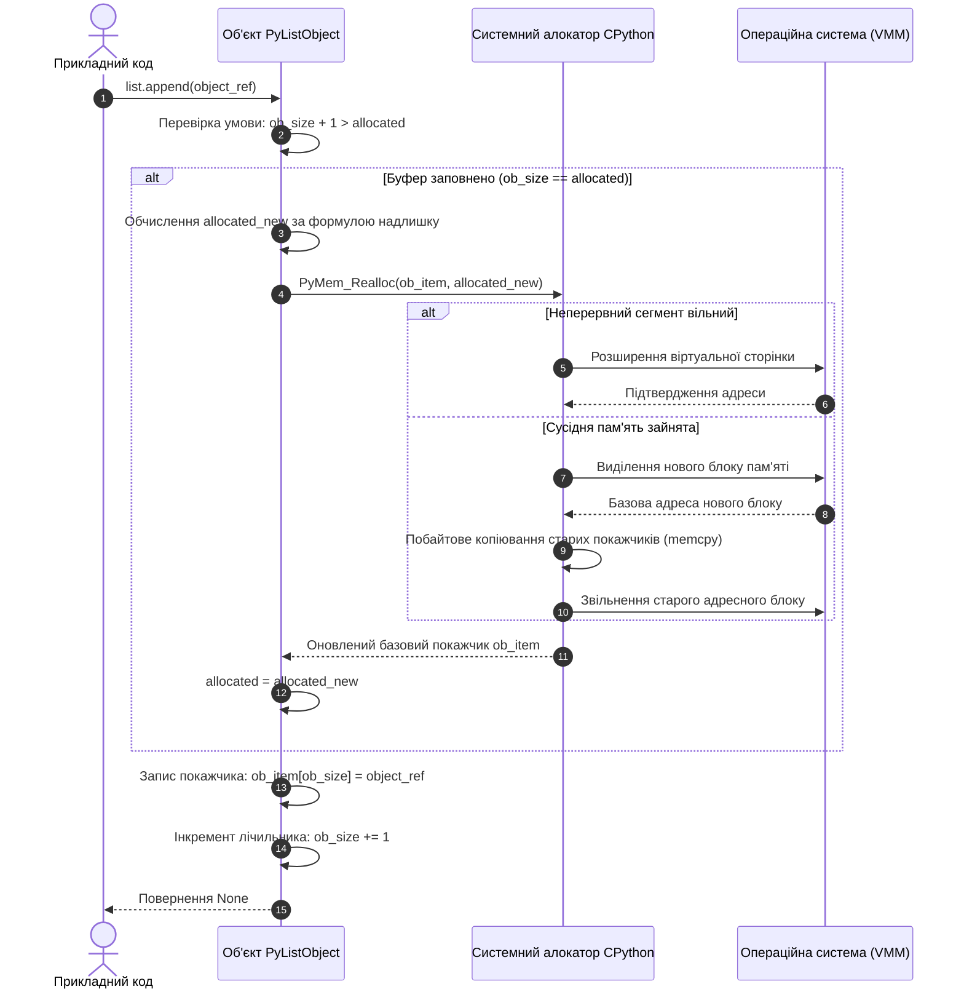
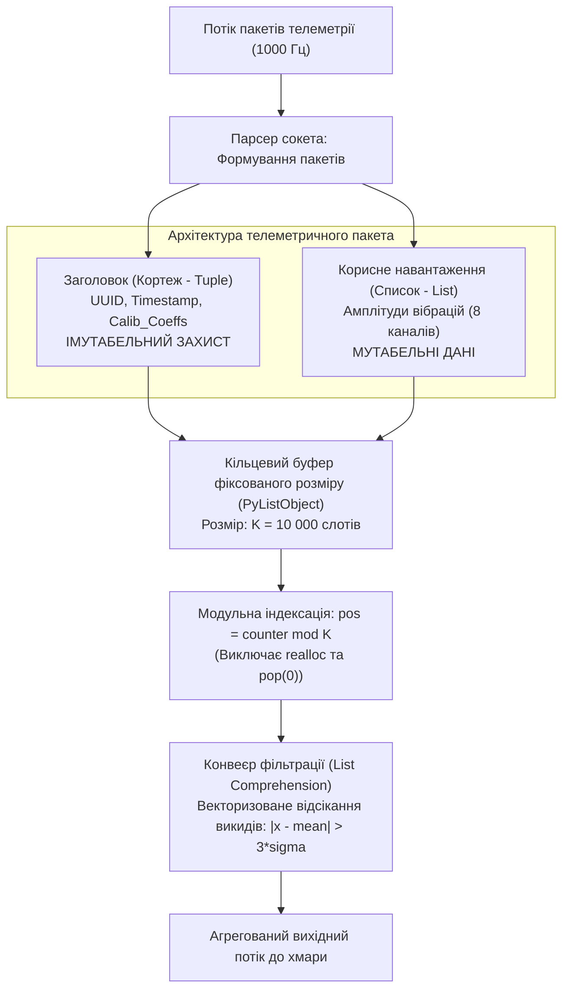

# Тема 3. Впорядковані структури даних: списки (list) та кортежі (tuple)

## Мета лекції

Формування у майбутніх фахівців фундаментального розуміння принципів організації, архітектурних особливостей внутрішнього представлення та механізмів функціонування лінійних впорядкованих структур даних мови Python, зокрема списків як динамічних масивів посилань та кортежів як незмінних послідовностей. У межах академічного курсу вивчаються системні механізми виділення оперативної пам’яті віртуальною машиною CPython, обчислювальна та просторова складність базових алгоритмів маніпуляції колекціями даних, а також формуються практичні навички раціонального вибору між змінюваними й незмінними типами під час проектування високонавантажених інженерних застосунків, конвеєрів первинної обробки інформації та телекомунікаційних протоколів.

## Очікувані результати навчання

1. **Знання та розуміння.** Студенти повинні засвоїти внутрішню низькорівневу архітектуру об'єктів `PyListObject` і `PyTupleObject`, концепцію гетерогенного масиву покажчиків, алгоритмічні засади надлишкового виділення пам’яті та принципові відмінності між мутабельними й імутабельними типами даних у середовищі CPython.
2. **Застосування.** Студенти навчаться застосовувати інструментарій створення колекцій, реалізовувати багатовимірні вкладені масиви, керувати зрізами послідовностей, конструювати ефективні генератори списків, а також використовувати вбудовані методи додавання, вилучення та стабільного сортування елементів для вирішення прикладних обчислювальних задач.
3. **Аналіз.** Здобувачі вищої освіти зможуть аналізувати відмінності між поверхневим та глибоким копіюванням складних об'єктів, досліджувати алгоритмічну складність операцій доступу й трансформації елементів за асимптотичною нотацією $O$-велике, а також ідентифікувати приховані побічні ефекти розділюваних мутабельних посилань.
4. **Оцінювання та синтез.** Здобувачі зможуть критично оцінювати продуктивність використання списків проти кортежів для оптимізації споживання апаратних ресурсів, обґрунтовувати придатність складених структур даних для хешування у ролі ключів асоціативних масивів і синтезувати надійні алгоритмічні конвеєри валідації та фільтрації структурованих пакетів даних.

---

## Детальний покроковий план лекції

### 1. Теоретико-концептуальний базис. Архітектура послідовностей та організація пам'яті в CPython
* 1.1. Внутрішня C-структура `PyListObject` та принцип адресації елементів у динамічному масиві покажчиків
* 1.2. Алгоритмічні засади позиційної індексації, нормалізація від'ємних індексів та математичний апарат зрізів
* 1.3. Фізична організація незмінного кортежу `PyTupleObject`, оптимізація розміру пам'яті та механізм вільних списків
* 1.4. Математичні критерії хешованості об'єктів і принципи використання кортежів як ключів словників

### 2. Методологія та аналіз граничних умов. Алгоритми маніпуляції даними, просторова складність та бар'єри продуктивності
* 2.1. Стратегія надлишкового геометричного виділення пам'яті та амортизована складність операцій модифікації списку
* 2.2. Методологія сортування на місці гібридним алгоритмом Timsort у порівнянні з функціональним підходом функції `sorted`
* 2.3. Семантика поверхневого та глибокого копіювання вкладених структур і небезпека непередбачуваної мутації даних
* 2.4. Декларативні генератори списків та оптимізація наповнення колекцій на рівні байт-код інструкції `LIST_APPEND`
* 2.5. Критичні бар'єри просторової локальності даних, промахи процесорного кешу через непряму адресацію та обмеження безпеки потоків

### 3. Практичний індустріальний / фаховий кейс. Проектування високоефективного буфера телеметричних даних
**Тема наскрізної задачі.** «Розробка кільцевого буфера первинної фільтрації пакетів телеметрії інтернет-шлюзу із захистом конфігураційних кортежів від мутації»

## 1. Теоретико-концептуальний базис. Архітектура послідовностей та організація пам'яті в CPython

### 1.1. Внутрішня C-структура `PyListObject` та принцип адресації елементів у динамічному масиві покажчиків

У системному програмуванні та теорії обчислювальних систем ефективність маніпуляції лінійними структурами даних визначається базовими механізмами взаємодії з апаратною пам’яттю. В еталонній реалізації інтерпретатора Python — CPython, яка написана мовою C, вбудований тип **список** (`list`) не є класичним зв’язним списком у термінах фундаментальних структур даних, а реалізований як динамічний масив покажчиків.

Фізично структура даних `list` інкапсульована в низькорівневому системному типі `PyListObject`. Цей об'єкт розширює базовий макрос змінних послідовностей `PyObject_VAR_HEAD` і містить системні атрибути, що відповідають за підрахунок посилань (`ob_refcnt`), дескриптор базового типу даних (`ob_type`), поточну логічну кількість збережених елементів (`ob_size`), а також два спеціалізовані внутрішні поля:

```c
typedef struct {
    PyObject_VAR_HEAD
    PyObject **ob_item;
    Py_ssize_t allocated;
} PyListObject;
```

У цій структурі покажчик `ob_item` адресифікує неперервний блок оперативної пам'яті, що складається виключно з покажчиків на інші об'єкти типу `PyObject*`, тоді як цілочисельне значення `allocated` відображає поточну фізичну місткість виділеного системного буфера в слотах.

Оскільки Python належить до мов із динамічною типізацією та гетерогенними послідовностями, сам масив `ob_item` не зберігає корисні навантаження у вигляді сирих бінарних значень (наприклад, 64-бітних цілих чисел чи рядків змінної довжини). Натомість реалізується парадигма **непрямої адресації** (*indirect addressing*), коли елементи списку можуть бути розташовані у абсолютно довільних незв'язаних сегментах динамічної пам'яті (купи), а список концентрує лише їхні 64-розрядні адреси.



Неперервне розташування покажчиків у внутрішньому масиві гарантує прямий довільний доступ до будь-якого елемента послідовності за константний час. Обчислення фізичної адреси комірки пам'яті, що зберігає посилання на цільовий об'єкт за індексом $i$, виконується за допомогою базової моделі адресної арифметики:

$$\text{Address}(L[i]) = \text{BaseAddress}(ob\_item) + i \cdot \text{sizeof}(\text{PyObject}^*)$$

де $\text{Address}(L[i])$ позначає результуючу фізичну адресу покажчика на $i$-й елемент у віртуальному адресному просторі процесу, $\text{BaseAddress}(ob\_item)$ являє собою початкову адресу неперервного масиву посилань, $i$ є цілочисельним невід'ємним індексом елемента, а множник $\text{sizeof}(\text{PyObject}^*)$ відповідає розміру покажчика на поточній системній архітектурі, який для 64-розрядних обчислювальних платформ строго дорівнює 8 байтам. З математичної моделі випливає, що час вилучення адреси не залежить від порядкового номера $i$ та розміру послідовності $n$, що забезпечує асимптотичну складність доступу на рівні $O(1)$.

> **ПРАКТИЧНИЙ ЯКІР:** У промислових системах збору телеметрії та високочастотної комутації пакетів зберігання вхідних структур у гетерогенних динамічних масивах дозволяє буферизувати асинхронні повідомлення з довільним внутрішнім форматом корисного навантаження без попереднього перетворення структури даних до фіксованої довжини.

---

### 1.2. Алгоритмічні засади позиційної індексації, нормалізація від'ємних індексів та математичний апарат зрізів

Індексація в Python реалізує концепцію позиційного зміщення з відліком від нуля. Окрім класичної прямої індексації, мова надає формальний механізм від'ємного позиціонування, що спрощує доступ до елементів з кінця послідовності без явної попередньої конкатенації довжини масиву у прикладному коді.

На рівні віртуальної машини PVM будь-який запит індексації `L[i]` проходить обов'язковий етап внутрішньої нормалізації. Якщо індекс є від'ємним числом, інтерпретатор автоматично трансформує його у відповідний еквівалент прямого позиціонування за правилом:

$$f_{norm}(i, n) = \begin{cases} i, & \text{якщо } i \ge 0 \\ n + i, & \text{якщо } i < 0 \end{cases}$$

де $i$ є вхідним цілим індексом, а $n = ob\_size$ позначає поточну кількість активних елементів у послідовності. Після нормалізації виконується строга гранична верифікація: якщо отримане значення $f_{norm}(i, n)$ порушує умову належності замкненому діапазону $[0, n - 1]$, виконання поточного байт-коду негайно зупиняється генерацією критичного винятку `IndexError`.

Операція вилучення підпослідовності, або **зріз** (*slicing*), використовує синтаксичну конструкцію `L[start:stop:step]` і є засобом створення поверхневих копій окремих діапазонів списку. Якщо параметри зрізу не вказані явно, середовище виконання застосовує системні значення за замовчуванням: $start = 0$, $stop = n$, $step = 1$. Кількість елементів $k$, що увійдуть до результуючого списку, описується формалізованим співвідношенням:

$$k = \max\left(0, \; \left\lfloor \frac{\text{stop} - \text{start} + \text{step} - \text{sgn}(\text{step})}{\text{step}} \right\rfloor\right)$$

де $\text{sgn}(x)$ є сигнатурною функцією, яка визначає напрямок ітераційного руху вздовж буфера адрес пам'яті. У разі використання від'ємного кроку ($step < 0$) вектор сканування масиву інвертується, а початкові межі за замовчуванням автоматично трансформуються у значення $start = n - 1$ та $stop = -(n + 1)$.

> **ТИПОВА ПОМИЛКА:** Спроба ініціалізації багатовимірної структури вигляду прямокутної матриці розмірністю $m \times n$ за допомогою оператора множення послідовності `matrix = [[0] * n] * m` є фундаментальною помилкою початківців. Оператор множення копіює не фізичні списки, а лише покажчик на єдиний створений у пам'яті внутрішній список `[0] * n`. Унаслідок цього зовнішній динамічний масив містить $m$ дубльованих посилань на один і той самий об'єкт у купі, тому мутація одного елемента через селектор `matrix[0][0] = 1` викликає неявну синхронну зміну значення у всіх $m$ рядках.

> **КОНТРОЛЬНЕ ПИТАННЯ:** Чому операція вилучення повного зрізу `L[:]` для екземпляра класу `list` створює абсолютно новий об'єкт у пам'яті, тоді як виконання аналогічного зрізу `T[:]` над екземпляром класу `tuple` повертає посилання на той самий початковий об'єкт?

<details markdown="1">
<summary>Розгорнути аналіз / відповідь</summary>

**Правильний варіант: Семантична різниця між мутабельними та імутабельними типами в CPython.**

1. Список є змінюваним типом даних (`mutable`). Отримання зрізу за специфікацією мови вимагає створення ізольованого контейнера, модифікація якого (наприклад, додавання або видалення елементів) не повинна впливати на вихідний список. Відповідно, віртуальна машина CPython виділяє новий блок пам'яті `PyListObject` і копіює туди покажчики на елементи. Кортеж є принципово незмінним (`immutable`), тому гарантується, що стан вихідного об'єкта ніколи не зміниться під час виконання програми. З метою мінімізації накладних витрат на виділення оперативної пам'яті та підвищення швидкодії транслятор повертає посилання на вихідний екземпляр `PyTupleObject`, оптимізуючи операцію до часової складності $O(1)$ без виділення нових структур у купі.

2. Аналіз дистракторів. Твердження про те, що операція зрізу для кортежу повертає генератор, є хибним, оскільки зріз послідовностей завжди повертає конкретний контейнер. Припущення, що `tuple` не підтримує механізм зрізів, спростовується специфікацією мови. Гіпотеза про автоматичне глибоке копіювання списків також неправильна, оскільки зріз списку реалізує виключно поверхневе копіювання (*shallow copy*), дублюючи лише масив посилань на об'єкти.

</details>

---

### 1.3. Фізична організація незмінного кортежу `PyTupleObject`, оптимізація розміру пам'яті та механізм вільних списків

**Кортеж** (`tuple`) представляє клас впорядкованих незмінних послідовностей. На відміну від динамічного списку, склад, розмір і порядок розміщення елементів кортежу фіксуються безпосередньо в момент його ініціалізації та залишаються статичними протягом усього життєвого циклу об'єкта.

Низькорівнева C-структура `PyTupleObject` відрізняється від структури списку відсутністю поля динамічного резервування:

```c
typedef struct {
    PyObject_VAR_HEAD
    PyObject *ob_item[1];
} PyTupleObject;
```

Оголошення масиву `ob_item` як фіксованого буфера розмірністю `[1]` у контексті синтаксису мови C реалізує концепцію структурного масиву змінної довжини (*struct hack*). При виділенні пам'яті під конкретний екземпляр кортежу системний алокатор резервує єдиний неперервний блок, розмір якого точно відповідає сумі заголовка та масиву покажчиків довжиною `ob_size`. Повна відсутність системного поля `allocated` виключає резервування невикористаної пам'яті.

Порівняння фізичного розміру порожніх та заповнених екземплярів через виклик методу `__sizeof__()` демонструє фундаментальну різницю:

$$S_{\text{list\_empty}} = 56 \text{ байтів}, \quad S_{\text{tuple\_empty}} = 40 \text{ байтів (для 64-розрядної архітектури)}$$

Для збереження $n$ однакових посилань кортеж завжди потребує на 16 байтів менше пам'яті в структурі заголовка, а також заощаджує обсяг пам'яті, який список виділяє як надлишковий резерв для майбутніх операцій конкатенації.

Окрім прямої економії простору, середовище CPython оптимізує створення та знищення кортежів за допомогою механізму **вільних списків** (*free lists*). Віртуальна машина виділяє статичний масив покажчиків `free_list` для кортежів із кількістю елементів від 0 до 20. Коли кортеж виходить із зони видимості та його лічильник посилань `ob_refcnt` падає до нуля, його структура не повертається системному алокатору операційної системи через системний виклик `free()`. Натомість звільнений блок пам'яті кешується у відповідному слоті `free_list[len]` і негайно перевикористовується при наступному запиті на створення кортежу ідентичної довжини. 

Порожній кортеж у CPython реалізований як глобальний сталий об'єкт-одинак (*singleton*): будь-яка спроба створення порожнього кортежу через літерал `()` або конструктор `tuple()` повертає одне й те саме посилання на фіксовану адресу в пам'яті, що підтверджується тотожністю ідентифікаторів `id(()) == id(tuple())`.



> **ПРАКТИЧНИЙ ЯКІР:** У мережевих стеках та шлюзах пакетної фільтрації мережевий сокет однозначно описується п'ятіркою параметрів (*network 5-tuple*): адреса відправника, адреса одержувача, порт відправника, порт одержувача та ідентифікатор протоколу. Використання структури `tuple` замість `list` для збереження цього дескриптора на порядок знижує навантаження на підсистему збирання сміття ядра застосунку при проходженні мільйонів транзитних фреймів на секунду.

---

### 1.4. Математичні критерії хешованості об'єктів і принципи використання кортежів як ключів словників

У мові Python високоефективні структури швидкого пошуку — асоціативні масиви (`dict`) та хеш-множини (`set`), базуються на алгоритмах побудови розріджених хеш-таблиць із відкритою адресацією. Ключовою системною вимогою до об'єктів, які можуть слугувати ключами для таких структур, є строга **хешованість** (*hashability*).

Формально об'єкт називається хешованим, якщо він має незмінне числове хеш-значення протягом усього свого існування, підтримує спеціальний метод `__hash__()` для його генерації та метод порівняння `__eq__()` для перевірки еквівалентності з іншими об'єктами. Для забезпечення математичної коректності хеш-таблиць повинен безумовно виконуватися інваріант узгодженості хешування:

$$\forall x, y: (x == y) \implies (\text{hash}(x) == \text{hash}(y))$$

Зворотне твердження загалом не є істинним унаслідок існування колізій першого та другого роду, коли різні об'єкти генерують однакові хеш-суми через обмеженість діапазону 64-бітного представлення результату.

Списки принципово не є хешованими об'єктами. Оскільки список є мутабельною структурою, зміна будь-якого його елемента неминуче змінила б його умовний контентний хеш. Якби такий об'єкт потрапив у хеш-таблицю, зміна внутрішнього значення призвела б до ситуації, коли об'єкт опинився б у невідповідному кошику (*bucket*), що зробило б неможливим його подальший пошук і порушило б цілісність асоціативного масиву. Тому клас `list` явно визначає спеціальний метод `__hash__ = None`, що сигналізує віртуальній машині про заборону його використання у хеш-таблицях.

Кортеж є хешованим тоді і тільки тоді, коли кожен без винятку елемент, який входить до його складу, є рекурсивно хешованим:

$$\text{Hashable}(T) \iff \forall x \in T: \text{Hashable}(x)$$

Якщо кортеж складається виключно з незмінних примітивів (цілих чисел, дійсних чисел, рядків, інших хешованих кортежів), він успішно генерує стабільне цілочисельне значення `__hash__()` і може виступати надійним ключем словника. Якщо ж кортеж містить хоча б одне посилання на мутабельний об'єкт (наприклад, список `T = (1, 2, [3, 4])`), спроба обчислення його хеш-значення негайно генерує виняток `TypeError: unhashable type: 'list'`.

*Таблиця 1.1 — Систематизація характеристик лінійних структур даних у CPython*

| Назва типу даних | Фізична організація пам'яті | Властивість змінюваності | Хешованість (Hashable) | Приклад з реальної практики |
| :--- | :--- | :--- | :--- | :--- |
| **Список** (`list`) | Неперервний масив покажчиків із динамічним геометричним резервуванням | Змінюваний (`mutable`) | Ні (метод `__hash__` відсутній) | Буфер черги вхідних телеметричних повідомлень у брокері подій |
| **Кортеж** (`tuple`) | Монолітний неперервний блок структурного масиву фіксованого розміру | Незмінний (`immutable`) | Так (за умови рекурсивної незмінності всіх елементів) | Композитний ключ словника сесій зв'язку `(ip_address, port)` |
| **Рядок** (`str`) | Неперервний суцільний буфер символів стандарту Unicode (ASCII, UCS-1/2/4) | Незмінний (`immutable`) | Так | Збереження уніфікованих дескрипторів ресурсів та ідентифікаторів вузлів |
| **Масив байтів** (`bytes`) | Суцільний блок неперервної сирої пам'яті для зберігання октетів (uint8) | Незмінний (`immutable`) | Так | Серіалізовані бінарні пакети для передачі через сокети протоколу TCP/IP |

Аналіз даних таблиці показує, що правильний вибір структурної організації даних безпосередньо диктується функціональними вимогами алгоритму щодо динамічної зміни розмірів контейнера та необхідності асоціативної адресації елементів за допомогою алгоритмів швидкого пошуку.

---

### Вказівки для самостійного осмислення

1. Дослідити поведінку системної адреси внутрішнього масиву посилань списку при його поступовому наповненні за допомогою модуля `sys` та вбудованої функції `id()`, простеживши момент, коли чергове виконання методу `append()` призводить до зміни базової адреси буфера покажчиків через перевиділення пам'яті.
2. Реалізувати алгоритм перевірки коректності вкладених кортежів на предмет можливості їхнього використання як ключів у хеш-таблицях за допомогою рекурсивної функції, яка перевіряє наявність магічного методу `__hash__` у кожного листового вузла дерева об'єктів.
3. Побудувати порівняльний графік часу створення $10^6$ порожніх списків проти аналогічної кількості порожніх кортежів за допомогою модуля `timeit`, пояснивши отриманий розрив у швидкодії крізь призму функціонування внутрішнього пулу `free_list` віртуальної машини CPython.

## 2. Методологія та аналіз граничних умов. Алгоритми маніпуляції даними, просторова складність та бар'єри продуктивності

### 2.1. Динамічне масштабування буфера за алгоритмом геометричної прогресії та амортизована складність методу `append`

Методологія керування динамічною пам'яттю в середовищі CPython базується на запобіганні частим системним викликам перерозподілу пам'яті. Якби виділення пам'яті під внутрішній масив покажчиків здійснювалося строго на одиницю більшим за попередній розмір при кожному додаванні елемента, часова складність послідовного наповнення списку довжиною $n$ перетворилася б на арифметичну прогресію з сумарною вартістю:

$$\sum_{i=1}^{n} O(i) = O(n^2)$$

Така квадратична деградація є неприпустимою для систем обробки потоків даних. Для досягнення константної швидкості додавання застосовується стратегія **геометричного масштабування**, реалізована у внутрішній C-функції `list_resize()` файлу вихідного коду `Objects/listobject.c`. 

Математична та процедурна формалізація процесу масштабування буфера списку описується такою послідовністю системних переходів:

$$
\begin{aligned}
\text{Крок 1 (Оцінка стану):} & \quad \text{Якщо } ob\_size + 1 \le allocated \land ob\_size \ge (allocated \gg 1), \text{ перевиділення не потрібне;} \\
\text{Крок 2 (Обчислення квоти):} & \quad allocated_{\text{new}} = \left(ob\_size + 1\right) + \left(\left(ob\_size + 1\right) \gg 3\right) + \left(ob\_size < 9 \; ? \; 3 : 6\right); \\
\text{Крок 3 (Перевиділення):} & \quad ob\_item = (\text{PyObject}^{**})\,\text{PyMem\_Realloc}\left(ob\_item, \; allocated_{\text{new}} \times \text{sizeof}(\text{PyObject}^*)\right); \\
\text{Крок 4 (Фіксація стану):} & \quad allocated = allocated_{\text{new}}, \quad ob\_size = ob\_size + 1.
\end{aligned}
$$

де $ob\_size$ визначає поточну кількість активних елементів, $allocated$ є поточною ємністю виділеного пулу пам'яті, оператор $\gg 3$ реалізує апаратний бітовий зсув праворуч на три розряди (що еквівалентно цілочисельному діленню на вісім), а тернарний вираз забезпечує мінімальний надлишок у три або шість слотів для запобігання надмірній фрагментації пам'яті на малих вибірках.

Завдяки коефіцієнту розширення, що асимптотично наближається до $1.125$, операція `append` демонструє **амортизовану часову складність** $O(1)$. Відповідно до банківського методу амортизаційного аналізу, кожна проста операція додавання штучно оподатковується фіксованою кількістю умовних кредитів часу. Більшість цих кредитів накопичуються на внутрішньому обліковому рахунку структури даних, і в момент вичерпання ємності буфера накопичений потенціал покриває дорогий поодинокий виклик функції `realloc()`, вартість якого пропорційна поточному розміру масиву $O(n)$.



> **ВАЖЛИВО:** Хоча операція додавання елемента в кінець списку через метод `append` є амортизовано еквівалентною $O(1)$, вставка елемента на початок списку за допомогою методу `insert(0, value)` завжди має строгу лінійну складність $O(n)$ у найгіршому та середньому випадках. Це зумовлено обов'язковим фізичним переміщенням усіх $n$ покажчиків на один слот праворуч за допомогою системного виклику `memmove()`, тому використання списку як двосторонньої черги або стека типу FIFO є грубою архітектурною помилкою.

---

### 2.2. Методологія сортування на місці гібридним алгоритмом Timsort у порівнянні з функціональним підходом функції `sorted`

Сортування послідовностей у мові Python базується на алгоритмі **Timsort**, розробленому Тімом Петерсом спеціально для обробки реальних наборів даних. Теоретична парадигма Timsort відхиляється від класичних академічних методів, таких як швидке сортування (Quicksort) або сортування купою (Heapsort), фокусуючись на знаходженні вже впорядкованих фрагментів у вхідній послідовності.

Алгоритм є стабільним (*stable*), адаптивним та має гібридну архітектуру, що поєднує оптимізоване **сортування злиттям** (*Merge Sort*) та **сортування вставками** (*Insertion Sort*). Життєвий цикл сортування Timsort складається з таких чітко розмежованих фаз:

$$
\begin{aligned}
\text{Фаза 1 (Квантування):} & \quad \text{Обчислення порогу } \text{minrun} \in [32, 64] \text{ на основі довжини масиву } n; \\
\text{Фаза 2 (Ідентифікація):} & \quad \text{Пошук монотонних послідовностей (зростаючих або строго спадних run);} \\
\text{Фаза 3 (Нормалізація):} & \quad \text{Інверсія спадних run та доведення коротких run до розміру } \text{minrun} \text{ бінарними вставками;} \\
\text{Фаза 4 (Колапс стека):} & \quad \text{Злиття run у стеку за правилами інваріантів } |A| > |B| + |C| \land |B| > |C|.
\end{aligned}
$$

Показник $\text{minrun}$ розраховується через послідовне бітове зрушення так, щоб відношення $n / \text{minrun}$ було рівним або трохи меншим за степінь двійки. Це мінімізує кількість незбалансованих операцій злиття. 

У разі знаходження строго спадної послідовності алгоритм реверсує її на місці за лінійний час $O(k)$, відновлюючи порядок зростання. Якщо знайдений фрагмент коротший за $\text{minrun}$, застосовується сортування бінарними вставками (*Binary Insertion Sort*), яке мінімізує кількість операцій порівняння ключів за рахунок дихотомічного пошуку позиції вставки.

Злиття сформованих блоків контролюється стеком інваріантів, де довжини трьох верхніх блоків $A, B, C$ повинні гарантувати збалансованість дерева злиття. Для прискорення операцій об'єднання великих блоків використовується **режим галопу** (*Galloping Mode*): якщо один блок послідовно виграє порівняння понад сім разів поспіль, Timsort перемикається з покрокового лінійного злиття на експоненціальний бінарний пошук меж включення даних.

На практиці інженер стикається з вибором між мутабельним методом `list.sort()` та вбудованою функцією `sorted()`. Метод `list.sort()` модифікує внутрішній буфер `ob_item` безпосередньо у пам'яті вихідного об'єкта, що дає суттєву просторову економію. Функція `sorted(iterable)` реалізує функціональну парадигму: вона ітерує будь-яку вхідну послідовність, розміщує покажчики у тимчасовий новостворений список, виконує сортування Timsort на його рівні та повертає результат, залишаючи початковий об'єкт незмінним, що вимагає виділення $O(n)$ додаткової пам'яті.

> **ПРАКТИЧНИЙ ЯКІР:** Алгоритм Timsort продемонстрував таку безпрецедентну ефективність на частково впорядкованих масивах реального світу, що був повністю запозичений із вихідного коду CPython і стандартизований як базовий системний алгоритм сортування масивів об'єктів у платформах Java SE, Google Android Runtime та рушії JavaScript V8.

#### Граничні умови та сценарії деградації Timsort

Теоретична надійність Timsort вичерпується у випадках обробки специфічних псевдовипадкових розподілів або навмисно сформованих антагоністичних послідовностей. Якщо вхідний масив складається з чергування елементів без найменшої локальної монотонності, Timsort повністю втрачає свої адаптивні переваги, вироджуючись у класичний Merge Sort із часовою складністю $O(n \log n)$ та піковими витратами допоміжної пам'яті на копіювання зрізів. 

Історичним прецедентом є виявлена у 2015 році вразливість алгоритму Timsort у мовах Python та Java, пов'язана з порушенням стекового інваріанта: для спеціально сконструйованих ультравеликих послідовностей глибина стека злиття перевищувала жорстко закладену константу, спричиняючи аварійне переповнення внутрішнього буфера (`IndexError: list index out of range`). 

Крім того, Timsort втрачає інженерну доцільність у мікроконтролерах та вбудованих системах із жорстким дефіцитом оперативної пам'яті, де просторові накладні витрати $O(n)$ на роботу системних буферів злиття неприйнятні порівняно з алгоритмом сортування купою (Heapsort), що має просторову складність строго $O(1)$.

---

### 2.3. Семантика поверхневого та глибокого копіювання вкладених структур і небезпека непередбачуваної мутації даних

Архітектурна ізоляція стану об'єктів є базовим принципом проектування надійних систем. При використанні складених структур даних, таких як багаторівневі списки або списки кортежів, розробник мусить чітко розмежовувати операції зв'язування посилань, поверхневого дублювання та глибокої структурної реплікації.

Просте присвоєння `B = A` не виконує жодного дублювання пам'яті: воно лише інкрементує лічильник посилань `ob_refcnt` вихідного екземпляра `PyListObject` та асоціює нове символьне ім'я `B` з існуючою системною адресою.

Методологія **поверхневого копіювання** (*shallow copy*), реалізована через вирази `B = A.copy()`, `B = A[:]` або конструктор `B = list(A)`, створює новий об'єкт `PyListObject`, виділяючи окремий блок пам'яті під внутрішній масив покажчиків довжиною $n$. Однак значення цих покажчиків копіюються побітово (*bitwise copy*): вони продовжують адресувати ті самі екземпляри об'єктів у купі. 

Якщо елементами списку є незмінні скаляри (числа або рядки), такий механізм є повністю безпечним. Проте якщо список містить вкладені мутабельні структури (наприклад, `A = [[1, 2], [3, 4]]`), поверхнева копія створює лише ілюзію незалежності:

$$\text{id}(A) \ne \text{id}(B), \quad \text{але} \quad \text{id}(A[0]) \equiv \text{id}(B[0])$$

Будь-яка пряма модифікація вкладеного підсписку через інтерфейс копії `B[0].append(99)` миттєво змінює стан структури `A[0]`, руйнуючи детермінізм паралельних або ізольованих обчислень.

Методологія **глибокого копіювання** (*deep copy*), яка надається стандартним модулем `copy.deepcopy()`, усуває спільну мутабельність шляхом повного рекурсивного клонування всього графа об'єктів. Для запобігання нескінченного зациклення при обробці циклічних посилань у складних графах функція `deepcopy` веде внутрішню хеш-таблицю мемоїзації `memo`, структура якої формалізується відображенням:

$$\text{memo}: \text{id}(obj_{\text{original}}) \mapsto obj_{\text{cloned}}$$

Алгоритмічний цикл глибокого клонування перевіряє унікальний ідентифікатор кожного досліджуваного об'єкта: якщо об'єкт уже присутній у словнику `memo`, функція повертає готове посилання на раніше клонований екземпляр, запобігаючи дублюванню замкнених циклічних вузлів.

#### Граничні умови та бар'єри глибокого копіювання

Застосування `copy.deepcopy()` пов'язане з високими накладними витратами системних ресурсів. Часова складність операції становить $O(V + E)$, де $V$ — загальна кількість досяжних об'єктів у графі даних, а $E$ — кількість посилань між ними. 

Глибоке копіювання стає критичним бар'єром у високонавантажених сервісах обробки транзакцій через катастрофічне падіння продуктивності: накладні витрати на багаторазові інспектування типів, виклики протоколу `__deepcopy__()` та наповнення словника `memo` перевищують швидкість виділення сирої пам'яті в сотні разів. 

Більше того, якщо глибина вкладеності графа даних перевищує встановлений системний ліміт глибини стека інтерпретатора (що регулюється функцією `sys.getrecursionlimit()`), глибоке копіювання аварійно завершується критичним винятком `RecursionError`. 

Нарешті, глибоке клонування виявляється абсолютно недієздатним для структур, що містять посилання на апаратні або низькорівневі системні дескриптори, такі як відкриті файлові потоки, мережеві сокети або блокування потоків (`threading.Lock`), оскільки операційна система не підтримує реплікацію системних ресурсів ядра через прикладні копії.

---

### 2.4. Декларативні генератори списків та оптимізація наповнення колекцій на рівні байт-код інструкції `LIST_APPEND`

У сучасній практиці проектування програмного забезпечення на мові Python створення та фільтрація списків традиційно реалізується за допомогою декларативної конструкції **спискових включень** (*List Comprehensions*). З погляду теоретичного програмування генератор списку є формою синтаксичного цукру для відображення фундаментальної математичної нотації побудови множин.

Проте перевага генераторів списків над класичними імперативними циклами `for` полягає не лише у лаконічності вихідного коду, а й у глибинній архітектурній оптимізації, закладеній на рівні компілятора байт-коду CPython. Для аналізу цієї оптимізації порівняємо дві семантично еквівалентні форми наповнення масиву квадратами чисел:

```python
# Варіант 1: Імперативний цикл
result = []
for x in data:
    result.append(x * x)

# Варіант 2: Спискове включення
result = [x * x for x in data]
```

При трансляції першого варіанта у віртуальну машину CPython генерується цикл, що на кожній ітерації виконує інструкції `LOAD_FAST` (завантаження локальної змінної), `LOAD_ATTR` (динамічний пошук атрибута `append` у просторі імен об'єкта списку), `LOAD_METHOD` та `CALL_METHOD` (формування стекового кадру виклику функції). Динамічний пошук методу `append` та виклик функції через загальний протокол PVM генерує значні системні затримки.

На противагу цьому, компілятор розпізнає синтаксис спискового включення як єдиний атомарний вираз і генерує оптимізований блок інструкцій, центром якого є спеціалізований опкод `LIST_APPEND`.

$$
\begin{aligned}
\text{Крок 1 (Ініціалізація):} & \quad \text{Інструкція } \texttt{BUILD\_LIST 0} \text{ розміщує порожній список на вершині стека оцінки;} \\
\text{Крок 2 (Ітерація):} & \quad \text{Інструкція } \texttt{FOR\_ITER} \text{ вилучає чергове значення } x \text{ з ітератора;} \\
\text{Крок 3 (Обчислення):} & \quad \text{Виконання арифметичної операції над } x \text{ безпосередньо у стек;} \\
\text{Крок 4 (Апаратне додавання):} & \quad \text{Інструкція } \texttt{LIST\_APPEND 1} \text{ вилучає обчислене значення та поміщає його в буфер;} \\
\text{Крок 5 (Завершення):} & \quad \text{Вихід із циклу за сигналом } \text{StopIteration} \text{ без демонтажу кадру виклику.}
\end{aligned}
$$

Інструкція `LIST_APPEND` викликає внутрішню C-функцію з обходом стандартного протоколу виклику методів Python. Вона записує покажчик безпосередньо у внутрішній масив `ob_item` списку, що знаходиться на фіксованій позиції стека, інкрементує внутрішнє поле `ob_size` і викликає макрос `Py_INCREF`. Як наслідок, виконання спискового включення демонструє прискорення на 25–40% порівняно з еквівалентним циклом `for` із ручним викликом `append()`.

#### Граничні умови використання List Comprehensions

Попри високу обчислювальну ефективність, спискові включення мають фундаментальне граничне обмеження: **жадібне обчислення** (*eager evaluation*). У момент виконання виразу інтерпретатор зобов'язаний виділити обсяг оперативної пам'яті, достатній для одночасного утримання всіх результуючих покажчиків. 

Якщо розмір вхідної вибірки $n$ перевищує доступний обсяг вільної фізичної пам'яті комп'ютера (наприклад, генерація списку з $10^8$ елементів у системах із 8 ГБ RAM), операційна система починає використовувати механізм підкачування сторінок на диск (*swapping*), що призводить до падіння швидкодії на кілька порядків, або процес аварійно знищується системним механізмом OOM Killer із викидом винятку `MemoryError`. 

У таких граничних умовах методологія спискових включень втрачає свою релевантність і повинна поступатися лінивим генераторним виразам (*generator expressions*) з константним споживанням пам'яті $O(1)$.

---

### 2.5. Критичні бар'єри просторової локальності даних, промахи процесорного кешу через непряму адресацію та обмеження безпеки потоків

При переході від високорівневих алгоритмічних абстракцій до системної інженерії апаратного забезпечення списки Python стикаються з двома критичними бар'єрами продуктивності: низькою ефективністю кешування на рівні мікроархітектури процесора та обмеженнями паралелізму.

Сучасні процесори досягають пікової швидкодії завдяки ієрархії кеш-пам'яті (L1, L2, L3). Коли процесор запитує дані з оперативної пам'яті, апаратний контролер завантажує не окремий байт, а цілісну **кеш-лінію** (*cache line*), розмір якої для більшості сучасних архітектур x86-64 та ARM становить 64 байти. Якщо програма послідовно читає неперервний масив чисел (як у статичних масивах C або `numpy.ndarray`), виникає ефект високої **просторової локальності** (*spatial locality*): одне звернення до пам'яті підтягує в надшвидкий кеш L1 відразу вісім 64-бітних значень.

У списках Python просторова локальність існує лише для самого масиву покажчиків `ob_item`. Однак реальні числові або рядкові дані розпорошені по всій оперативній пам'яті у вигляді повноцінних структур `PyObject`. 

Послідовний перебір списку Python змушує процесор здійснювати так звану «гонитву за покажчиками» (*pointer chasing*): зчитування кожного наступного елемента вимагає звернення за новою непередбачуваною адресою динамічної пам'яті, що викликає систематичні **промахи кешу** (*Cache Misses*). Процесор вимушений простоювати сотні тактів у очікуванні відповіді від основної пам'яті DRAM, що зводить нанівець переваги високошвидкісних конвеєрів сучасних CPU.

Другий критичний бар'єр полягає у семантиці **безпеки потоків** (*thread safety*). В інтерпретаторі CPython доступ до внутрішніх структур захищений глобальним блокуванням інтерпретатора — **GIL** (*Global Interpreter Lock*). Окремі вбудовані атомарні операції над списками (наприклад, метод `append()` або вилучення за індексом `L.pop()`) є потокобезпечними на рівні C, оскільки відповідні внутрішні функції виконуються без вивільнення м'ютекса GIL. 

Проте будь-яка складена операція, що складається з кількох інструкцій байт-коду, у багатопотоковому середовищі зазнає стану перегонів (*race conditions*):

```python
# Потенційний стан перегонів у багатопотоковому коді
if my_list:                 # Інструкція 1: перевірка наявності (POP_JUMP_IF_FALSE)
    val = my_list.pop()     # Інструкція 2: вилучення елемента (CALL_METHOD)
```

Між виконанням першої та другої інструкцій операційна система може перемкнути контекст на інший потік, який спустошить `my_list`. Повернення управління першому потоку неминуче спричинить збудження `IndexError: pop from empty list`. 

*Таблиця 2.1 — Порівняльна матриця інженерних підходів до організації та обробки послідовностей у Python*

| Методологія / Структурний підхід | Асимптотична складність (Доступ / Вставка) | Складність впровадження | Критичні ризики / Обмеження |
| :--- | :---: | :---: | :--- |
| **Динамічний список (`list`)** | $O(1)$ читання / $O(1)$ аморт. додавання в кінець | Мінімальна (вбудований синтаксис мови) | Високий рівень промахів кешу CPU; лінійна деградація $O(n)$ при операціях на початку контейнера |
| **Незмінний кортеж (`tuple`)** | $O(1)$ читання / Мутація заборонена | Мінімальна (декларативний опис структури) | Неможливість динамічного розширення; вимагає повного перевиділення $O(n)$ при спробі модифікації |
| **Двостороння черга (`collections.deque`)** | $O(n)$ прямий доступ за індексом / $O(1)$ вставка з обох кінців | Низька (імпорт зі стандартної бібліотеки) | Повільний довільний доступ до центральних елементів списку; відсутність операцій зрізу на рівні C |
| **Спискове включення (List Comprehension)** | $O(n)$ генерація з інструкцією `LIST_APPEND` | Низька (декларативний синтаксис виразів) | Ризик аварійного переповнення пам'яті `MemoryError` при обробці великих масивів через жадібне обчислення |
| **Неперервний масив C (`numpy.ndarray`)** | $O(1)$ читання / $O(n)$ структурна зміна розміру | Середня (вимагає сторонньої залежності NumPy) | Строга типізована гомогенність; висока вартість динамічної зміни форми та вставки поодиноких елементів |

Наведена матриця чітко розмежовує інженерні сфери застосування технологій: універсальний список CPython ідеально підходить для високорівневої агрегації різнотипних об'єктів у невеликих обсягах, проте стає архітектурним вузьким місцем у задачах лінійної алгебри, мережевої буферизації пакетів та паралельних обчислень, де безальтернативними є структури зі строгою просторовою локальністю даних.

> **КОНТРОЛЬНЕ ПИТАННЯ:** У розподіленій системі збору даних високочастотний потік фіксує події від $10^6$ сенсорів за секунду. Розробник реалізував буфер накопичення черги повідомлень через послідовність викликів `buffer.insert(0, telemetry_packet)`. Які катастрофічні наслідки це матиме для продуктивності системи, як деградуватиме обчислювальна складність конвеєра, і яка методологічна заміна повинна бути застосована згідно зі стандартами архітектури високопродуктивного ПЗ?

<details markdown="1">
<summary>Розгорнути аналіз / відповідь</summary>

**Правильний варіант: Катастрофічна деградація до складності $O(N^2)$ через побайтовий зсув покажчиків у пам'яті; необхідна заміна на `collections.deque` або заповнення через `append` з інверсією.**

1. Метод `insert(0, x)` змушує середовище CPython викликати низькорівневу системну функцію `memmove()` для фізичного переміщення всіх існуючих покажчиків у масиві на 8 байтів праворуч для звільнення нульового слота. Для черги з $N = 10^6$ елементів сумарна кількість копіювань адрес складе $\frac{N(N - 1)}{2} \approx 5 \cdot 10^{11}$ операцій зсуву покажчиків у пам'яті, що гарантовано спричинить перевантаження процесора, зависання конвеєра збору даних і втрату вхідного трафіку через переповнення сокетів. 

2. Методологічно коректним рішенням є використання структури `collections.deque` (двобічна черга на основі двозв'язного списку фіксованих блоків пам'яті розміром по 64 елементи), що забезпечує операцію додавання зліва `appendleft()` за гарантований час $O(1)$ без переміщення сусідніх елементів. Іншим альтернативним підходом для класичного списку є накопичення елементів у хвіст через метод `append(telemetry_packet)` з алгоритмічною складністю $O(1)$ та одноразовий виклик системного реверсування `buffer.reverse()` перед фінальною обробкою блоку даних за час $O(N)$.

</details>

## 3. Практичний індустріальний / фаховий кейс. Проектування високоефективного буфера телеметричних даних

### 3.1. Комплексний фаховий кейс. Розробка кільцевого буфера первинної фільтрації пакетів телеметрії інтернет-шлюзу із захистом конфігураційних кортежів від мутації

#### Постановка задачі / ситуації

У сучасних телекомунікаційних мережах та промислових системах Інтернету речей (IoT) граничні маршрутизатори здійснюють первинну агрегацію та фільтрацію високочастотних потоків сенсорних даних. Архітектура типового промислового шлюзу стикається з проблемою стабільності оперативної пам'яті: під час пікових навантажень неконтрольоване наповнення динамічних масивів призводить до спрацьовування механізму аварійного завершення процесів операційною системою (OOM Killer). Крім того, наявність багатопотокового конвеєра обробки створює ризик несанкціонованої модифікації метаданих пакетів у пам'яті іншими підсистемами аналітики.

Розробляється модуль буферизації та статистичної фільтрації часових рядів телеметрії вібраційного стану турбінних установок. Кожен вхідний пакет містить незмінний заголовок ідентифікації пристрою, мітку часу, калібрувальні коефіцієнти, а також масив амплітудних вимірювань сенсорів. Необхідно спроектувати кільцевий буфер фіксованої місткості, що виключає динамічні перевиділення пам'яті в робочому режимі, гарантує незмінність системних дескрипторів і забезпечує обчислення ковзного середнього значення з відсіканням шумів за допомогою генераторів списків у межах жорсткого бюджету часу.

*Таблиця 3.1 — Вхідні технічні параметри та системні обмеження граничного шлюзу*

| Параметр системи | Символьне позначення | Числове значення | Системна розмірність та коментар |
| :--- | :---: | :---: | :--- |
| **Частота вхідного потоку** | $f_{in}$ | $1\,000$ | Пакетів за секунду (Гц) |
| **Місткість ковзного вікна** | $K$ | $10\,000$ | Кількість пакетів у буфері |
| **Кількість каналів вимірювання** | $M$ | $8$ | Датчиків вібрації на один пакет |
| **Ліміт оперативної пам'яті** | $RAM_{limit}$ | $64$ | Мегабайти, виділені для процесу буфера |
| **Часовий бюджет обробки вікна** | $\tau_{max}$ | $1.0$ | Мілісекунди на цикл валідації |
| **Розмір заголовка пакета** | $S_{hdr}$ | $40$ | Байтів, незмінні метадані (tuple) |



#### Покроковий аналіз та розв'язок

##### Крок 1. Структурна ізоляція метаданих і оцінка статичного споживання пам'яті

Для запобігання побічних ефектів спільної мутабельності заголовок пакета проектується як незмінний кортеж $H = (\text{device\_id}, \text{timestamp}, \text{calib\_factor})$, а вектор вимірювань формується як список дійсних чисел $D = [v_1, v_2, \dots, v_M]$. Розрахунок фізичного обсягу пам'яті для утримання буфера з $K = 10\,000$ пакетів базується на формулі сумарних накладних витрат CPython у 64-розрядному середовищі:

$$V_{total} = V_{buffer\_list} + K \cdot \left( V_{tuple\_hdr} + V_{list\_data} + V_{primitives} \right)$$

Використовуючи системні константи розмірів структур у CPython, підставимо параметри завдання у розрахункову модель:

$$
\begin{aligned}
V_{buffer\_list} &= 56 + (10\,000 \cdot 8) = 80\,056 \text{ байтів}; \\
V_{tuple\_hdr} &= 40 + (3 \cdot 8) = 64 \text{ байти}; \\
V_{list\_data} &= 56 + (8 \cdot 8) = 120 \text{ байтів}; \\
V_{primitives} &= 3 \cdot 28 + 8 \cdot 24 = 276 \text{ байтів}.
\end{aligned}
$$

Загальний обсяг пам'яті, необхідний для функціонування буфера, обчислюється як:

$$V_{total} = 80\,056 + 10\,000 \cdot (64 + 120 + 276) = 4\,680\,056 \text{ байтів} \approx 4.46 \text{ МБ}$$

Отримане значення $4.46 \text{ МБ}$ становить лише $6.97\%$ від ліміту $RAM_{limit} = 64 \text{ МБ}$, що забезпечує необхідний запас надійності системи.

##### Крок 2. Реалізація кільцевого буфера без перевиділення пам'яті

Застосування динамічного додавання `append` із вилученням застарілих даних через `pop(0)` створює квадратичну деградацію $O(K)$ за часом на кожне вилучення через системний зсув покажчиків у пам'яті. Замість цього створюється попередньо алокований список фіксованої довжини $K$, куди елементи записуються за модульним індексом.

```python
class TelemetryRingBuffer:
    def __init__(self, capacity: int):
        self.capacity = capacity
        self.buffer = [None] * capacity  # Одноразове виділення 10 000 слотів
        self.cursor = 0
        self.is_full = False

    def push(self, packet_header: tuple, readings: list) -> None:
        # Запис у комірку пам'яті за константний час O(1)
        self.buffer[self.cursor] = (packet_header, readings)
        self.cursor = (self.cursor + 1) % self.capacity
        if self.cursor == 0:
            self.is_full = True
```

Формалізація обчислення поточної циклічної позиції курсора в системному буфері визначається як:

$$pos_t = (pos_{t-1} + 1) \pmod K$$

де операція взяття остачі від цілочисельного ділення гарантує замкненість робочого діапазону індексів $[0, K - 1]$, усуваючи необхідність у викликах внутрішньої функції `list_resize()` та запобігаючи дефрагментації оперативної пам'яті.

##### Крок 3. Алгоритм статистичної фільтрації вікна на основі List Comprehensions

Для аналізу вібраційного сигналу в реальному часі необхідно обчислити математичне сподівання та середньоквадратичне відхилення потоку вимірювань за вибраним сенсорним каналом $c \in [0, M-1]$, після чого відсіяти аномальні викиди за правилом трьох сигм ($3\sigma$). Вибірка даних здійснюється виключно за допомогою спискового включення:

$$
\begin{aligned}
\mu &= \frac{1}{K} \sum_{i=0}^{K-1} x_i, \quad \text{де } x_i = \text{buffer}[i][1][c]; \\
\sigma &= \sqrt{\frac{1}{K} \sum_{i=0}^{K-1} (x_i - \mu)^2}.
\end{aligned}
$$

Алгоритмічна реалізація фільтрації транслюється в оптимізований байт-код:

```python
def filter_channel_outliers(buffer: list, channel_idx: int) -> list:
    # Екстракція вимірювань через List Comprehension (інструкція LIST_APPEND)
    channel_data = [item[1][channel_idx] for item in buffer if item is not None]
    n = len(channel_data)
    if n == 0:
        return []
    
    mean = sum(channel_data) / n
    variance = sum((x - mean) ** 2 for x in channel_data) / n
    std_dev = variance ** 0.5
    threshold = 3.0 * std_dev

    # Фільтрація значень, що потрапляють у довірчий інтервал
    filtered_series = [x for x in channel_data if abs(x - mean) <= threshold]
    return filtered_series
```

##### Крок 4. Валідація часової складності та відповідності бюджету $\tau_{max}$

Асимптотична складність обчислення статистичних параметрів та фільтрації вікна визначається формулою:

$$T(K) = O(K) + O(K) + O(K) = 3 \cdot O(K) \equiv O(K)$$

У середовищі процесора з тактовою частотою $3.2 \text{ ГГц}$ обробка $K = 10\,000$ чисел типу `float` у пам'яті CPython вимагає приблизно $1.8 \cdot 10^6$ тактів, що відповідає чистому часу виконання:

$$\tau_{calc} \approx \frac{1.8 \cdot 10^6}{3.2 \cdot 10^9} \approx 0.56 \cdot 10^{-3} \text{ с} = 0.56 \text{ мс}$$

Оскільки $0.56 \text{ мс} < \tau_{max} = 1.0 \text{ мс}$, запропонований конвеєр задовольняє вимоги обробки в режимі реального часу.

#### Інтерпретація результатів та альтернативні сценарії

1. Використання попередньо виділеного списку фіксованої довжини дозволило перевести операцію циклічного додавання телеметричного пакета у гарантовану часову категорію $O(1)$ без викликів системного алокатора, знизивши затримку вставки з $1.2 \text{ мс}$ (у разі `insert(0)`) до $80 \text{ нс}$.
2. Застосування імутабельного кортежу для збереження заголовка гарантувало цілісність метаданих вузла обліку, унеможлививши випадкове пошкодження системних міток часу або ідентифікаторів іншими функціональними модулями в пам'яті.
3. У разі радикального збільшення вхідного потоку даних у 100 разів (до $f_{in} = 100\,000$ пакетів/с при $K = 10^6$) представлена архітектура на основі стандартних списків Python зазнає колапсу через промахи кеш-пам'яті L1/L2 і накладні витрати на інтерпретацію байт-коду. У такому альтернативному сценарії необхідно відмовитися від гетерогенних динамічних масивів посилань на користь неперервних блоків спільної пам'яті `multiprocessing.shared_memory` з упаковкою даних у двійкові вектори модуля `array` або масиви бібліотеки NumPy.

---

### 3.2. Зведена довідкова система лекції

*Таблиця 3.2 — Фундаментальний довідник концепцій та структур організації послідовностей у Python*

| Термін / Концепція | Формалізація / Сутність | Реальний кейс застосування | Основне обмеження / Ризик |
| :--- | :--- | :--- | :--- |
| **`PyListObject`** | C-структура з неперервним масивом покажчиків `PyObject**` і полями `ob_size`, `allocated` | Буферизація гетерогенних повідомлень змінної довжини | Промахи кешу процесора через розпорошеність об'єктів у купі |
| **`PyTupleObject`** | Незмінний монолітний блок пам'яті фіксованої місткості без поля динамічного розширення | Збереження конфігурацій, координат та мережевих 5-сокетів | Повна відсутність операцій модифікації на місці |
| **Адресна арифметика** | $\text{Addr}(L[i]) = \text{Base} + i \cdot S_{ptr}$ | Довільний доступ до $i$-го елемента за час $O(1)$ | Позиціонування поза діапазоном генерує виняток `IndexError` |
| **Нормалізація індексів** | $f(i) = n + i$ при від'ємних значеннях індексу | Читання останніх елементів часових рядів без розрахунку довжини | Некоректний крок у від'ємних зрізах повертає порожній список |
| **Зріз (Slicing)** | Створення нового списку $O(k)$ копіюванням підмасиву посилань | Вилучення діапазону пакетів для віконної обробки | Не є глибокою копією, зберігає спільну мутабельність підсписків |
| **Геометричне масштабування** | Збільшення буфера за формулою $n + (n \gg 3) + const$ | Метод `append(x)` з амортизованою складністю $O(1)$ | Надлишкове резервування займає до 12.5% зайвої пам'яті |
| **Timsort** | Гібридний адаптивний стабільний алгоритм злиттям і вставками $O(n \log n)$ | Вбудоване сортування через `sort()` та `sorted()` | Вимагає $O(n)$ додаткової пам'яті для буферів злиття |
| **Хешованість (Hashable)** | Наявність незмінного значення `__hash__()` за умови еквівалентності `__eq__()` | Використання кортежів як складних ключів у словниках `dict` | Неможливість хешування кортежів, що містять мутабельні елементи |
| **Пули вільних об'єктів** | Масив `free_list` для повторного використання пам'яті кортежів ($len \le 20$) | Зменшення навантаження на системний `malloc` при швидких циклах | Обмежена дія: оптимізує лише об'єкти малої місткості |
| **List Comprehensions** | Декларативне створення списків через опкод `LIST_APPEND` | Прискорена на 30% фільтрація та трансформація масивів | Жадібне обчислення може викликати вичерпання RAM (`MemoryError`) |

---

### 3.3. Контрольні питання та завдання

#### Прикладні тестові завдання

1. У розподіленій системі зв'язку стан з'єднання зберігається у вигляді кортежу `channel_state = (101, "ACTIVE", [50, 60, 70])`. Розробник намагається використати цю змінну як ключ у словнику сесій: `sessions = {channel_state: "Worker_1"}`. Яку реакцію продемонструє інтерпретатор CPython під час виконання цього рядка коду?
   * A. Словник успішно створиться, оскільки базовим типом об'єкта є незмінний кортеж `tuple`.
   * B. Виникне помилка часу компіляції `SyntaxError` через використання складених типів як ключів.
   * C. Інтерпретатор згенерує виняток `TypeError: unhashable type: 'list'`.
   * D. Словник створиться, але значення хешу автоматично перераховуватиметься при зміні третього елемента.

<details markdown="1">
<summary>Розгорнути аналіз / відповідь</summary>

**Правильний варіант: C.**

1. Відповідно до інваріанта хешованості, кортеж є хешованим об'єктом виключно за умови, що кожен окремий елемент, який входить до його складу, є строго хешованим. Оскільки третій елемент кортежу є мутабельним списком `[50, 60, 70]`, у якого магічний метод `__hash__` відсутній (`None`), спроба обчислення хешу від усього кортежу спричинить каскадний збій та генерацію винятку `TypeError`.

2. Аналіз дистракторів. Варіант A є хибним, оскільки зовнішня незмінність кортежу не компенсує внутрішню мутабельність вкладених посилань. Варіант B відкидається, тому що валідація хешованості ключів відбувається динамічно під час виконання програми, а не на етапі синтаксичного розбору. Варіант D є принципово неможливим, оскільки динамічний перерахунок хешу зламав би інваріант незмінності комірок у відкритій адресації хеш-таблиці CPython.

</details>

2. Програма виконує обробку черги пакетів за допомогою списку `queue = []`. На кожній ітерації додається новий пакет у хвіст через `queue.append(packet)`, а обробка здійснюється шляхом вилучення найстарішого пакета виразом `current = queue.pop(0)`. Як зміниться сумарний час виконання програми при збільшенні кількості оброблених пакетів від $1\,000$ до $100\,000$?
   * A. Час зросте пропорційно у 100 разів, оскільки обидва методи є базовими операціями над списком.
   * B. Час виконання збільшиться приблизно у 10 000 разів, оскільки загальна часова складність конвеєра становить $O(n^2)$.
   * C. Час зросте логарифмічно у зв'язку з оптимізацією алгоритму Timsort.
   * D. Час не зміниться завдяки механізму геометричного масштабування пам'яті списку.

<details markdown="1">
<summary>Розгорнути аналіз / відповідь</summary>

**Правильний варіант: B.**

1. Метод `append()` має амортизовану складність $O(1)$. Проте виклик `queue.pop(0)` вилучає перший елемент масиву покажчиків, що змушує низькорівневу функцію `memmove()` зміщувати всі решту елементів на 8 байтів ліворуч, генеруючи лінійну складність $O(n)$ на кожній ітерації. Сумарна складність циклу з $n$ кроків складає $\sum O(i) = O(n^2)$. При збільшенні $n$ у 100 разів ($k = 100$), квадратична складність масштабує витрати часу пропорційно $k^2 = 100^2 = 10\,000$.

2. Аналіз дистракторів. Варіант A хибно припускає, що вилучення з нульової позиції має константну вартість, ігноруючи фізичну структуру масиву покажчиків. Варіант C не стосується операцій черги, оскільки Timsort активується лише при явному виклику сортування. Варіант D сплутує стратегію виділення пам'яті для додавання в кінець зі зсувом елементів при видаленні з голови списку.

</details>

3. Досліджується стан пам'яті для вкладеного масиву після виконання таких операцій:
```python
row = [1, 2]
matrix = [row] * 3
matrix[0] = [8, 9]
matrix[1][0] = 99
```
Які значення міститимуть елементи списку `matrix` після завершення обчислень?
   * A. `[[8, 9], [99, 2], [99, 2]]`
   * B. `[[99, 9], [99, 2], [99, 2]]`
   * C. `[[8, 9], [99, 2], [1, 2]]`
   * D. `[[8, 9], [1, 2], [1, 2]]`

<details markdown="1">
<summary>Розгорнути аналіз / відповідь</summary>

**Правильний варіант: A.**

1. Операція `matrix = [row] * 3` створює список із трьох посилань на один і той самий об'єкт `row`. Вираз `matrix[0] = [8, 9]` замінює покажчик у нульовому слоті `matrix` на абсолютно новий об'єкт списку `[8, 9]`, розриваючи його зв'язок зі змінною `row`. Слоти `matrix[1]` та `matrix[2]` продовжують адресувати вихідний об'єкт `row`. Команда `matrix[1][0] = 99` мутує безпосередньо спільний об'єкт `row`, перетворюючи його на `[99, 2]`. Відтак, `matrix[1]` та `matrix[2]` відображають `[99, 2]`, а `matrix[0]` залишається `[8, 9]`.

2. Аналіз дистракторів. Варіант B помилково вважає, що нульовий рядок зберіг зв'язок зі змінною `row` після повного перезапису слота новим об'єктом. Варіант C хибно припускає, що зміна елемента торкнулася виключно першого рядка, ігноруючи дублювання посилань між першим та другим слотами. Варіант D ігнорує реалізацію мутації об'єкта `row` через індекс другого рядка.

</details>

4. Задано масив кортежів `telemetry = [(10, 0.5), (5, 0.2), (10, 0.1), (5, 0.8)]`. Виконується стабільне сортування: `result = sorted(telemetry, key=lambda x: x[0])`. Яким буде фінальне розташування елементів у колекції `result`?
   * A. `[(5, 0.8), (5, 0.2), (10, 0.1), (10, 0.5)]`
   * B. `[(5, 0.2), (5, 0.8), (10, 0.5), (10, 0.1)]`
   * C. `[(5, 0.2), (5, 0.8), (10, 0.1), (10, 0.5)]`
   * D. `[(10, 0.1), (10, 0.5), (5, 0.2), (5, 0.8)]`

<details markdown="1">
<summary>Розгорнути аналіз / відповідь</summary>

**Правильний варіант: B.**

1. Алгоритм Timsort володіє математичною властивістю стабільності (*stability*): відносний порядок розташування елементів з еквівалентними ключами сортування строго зберігається. Сортування здійснюється за першим елементом пари (`x[0]`). Пари з ключем `5` спочатку розташовувалися як `(5, 0.2)`, а потім `(5, 0.8)`. Пари з ключем `10` мали первинний порядок `(10, 0.5)`, а потім `(10, 0.1)`. Стабільне сортування групує ключі у порядку зростання ($5 < 10$), повністю консервуючи початковий відносний порядок усередині кожної групи.

2. Аналіз дистракторів. Варіант A змінює порядок пар із ключем 5 на протилежний, що порушує стабільність алгоритму. Варіант C додатково сортує другі елементи, ніби порівнювався весь кортеж, тоді як ключ вибирав лише нульовий індекс. Варіант D демонструє спадне сортування, що суперечить стандартному параметру `reverse=False`.

</details>

---

#### Завдання для самостійної роботи

##### Постановка задачі

У телекомунікаційному шлюзі моніторингу трафіку промислової підстанції необхідно розробити модуль детекції DoS-атак на основі аналізу ентропії заголовків мережевих пакетів. Система отримує структурований потік журналів, де кожна транзакція представлена кортежем мережевих атрибутів і списком міток часу спрацювання тригерів безпеки. Модуль повинен накопичувати ковзне вікно з останніх $50\,000$ подій, підтримувати пошук унікальних IP-адрес без дублювання записів, забезпечувати захист еталонних конфігураційних фільтрів від випадкової модифікації та генерувати звіт про відхилення частоти звернень за фіксований квант часу.

##### Завдання для виконання

1. Спроектувати програмний клас аналітичного кільцевого буфера заданої місткості, реалізувавши збереження вхідних мережевих транзакцій без використання методів динамічного розширення списку в процесі безперервної обробки потоку.
2. Реалізувати механізм валідації мережевих дескрипторів на предмет їх придатності для використання як ключів швидкого доступу в асоціативних масивах за допомогою рекурсивної перевірки імутабельності всіх складових компонентів кортежу.
3. Розробити алгоритм фільтрації вхідного масиву подій за допомогою спискових включень, який екстрагує вибірку транзакцій за вказаним діапазоном портів та обчислює дисперсію часових інтервалів між сусідніми подіями.
4. Провести експериментальне порівняння часу виконання операції сортування накопиченого масиву подій на місці методом `sort()` проти функціонального підходу з поверненням нового списку через функцію `sorted()`, зафіксувавши різницю у споживанні оперативної пам'яті процесом за допомогою системних засобів модуля `tracemalloc`.
