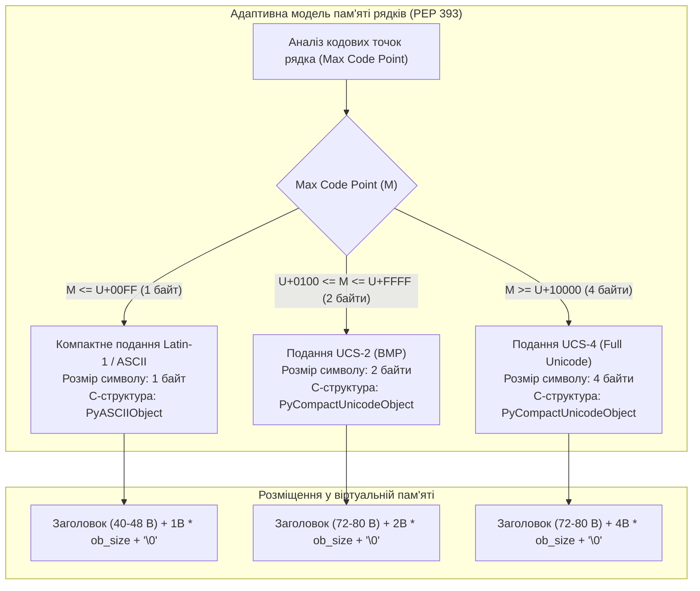
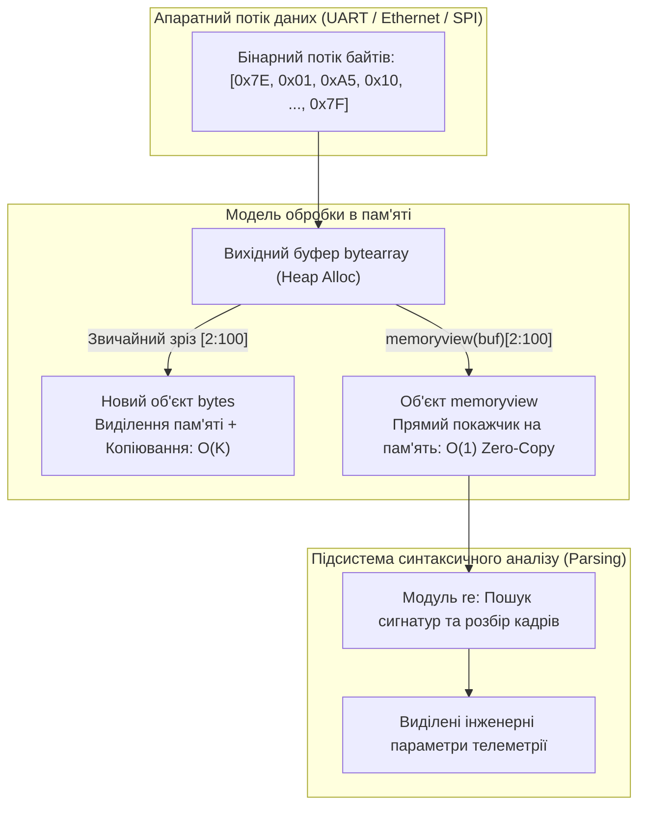

# ЗМІСТОВИЙ МОДУЛЬ 1. ТЕМА 4. ТЕКСТОВІ ТА ДВІЙКОВІ СТРУКТУРИ ДАНИХ. РЕГУЛЯРНІ ВИРАЗИ

---

## 4.1. Рядки (str) як незмінні Unicode-послідовності: індексація, зрізи, імутабельність, escape-послідовності, сирі рядки (raw strings r"")

### Основний зміст та теоретичний базис

У сучасних комп'ютерних системах обробка текстової інформації є однією з ключових задач системного програмування, мережевої взаємодії та аналізу даних. У мові програмування Python текстові дані представлені типом **`str`**, який є впорядкованою незмінною (**immutable**) послідовністю символів міжнародного стандарту **Unicode**. На відміну від ранніх версій мови (Python 2) та мови C, де базовим типом виступав однобайтний ASCII-рядок, у Python 3 кожен рядок абстрагований від конкретного апаратного кодування та представляє послідовність кодових точок (*code points*) у діапазоні від $U+0000$ до $U+10FFFF$.

Для оптимізації використання оперативної пам'яті в інтерпретаторі CPython, починаючи з версії 3.3 (згідно зі специфікацією PEP 393 — *Flexible String Representation*), реалізовано адаптивну внутрішню структуру рядка. Замість фіксованого виділення чотирьох байтів на кожен символ (UTF-32), внутрішній алокатор CPython динамічно обирає мінімально достатню ширину символу залежно від максимального коду символу, наявного у конкретному рядку: 1 байт (Latin-1/ISO-8859-1), 2 байти (UCS-2) або 4 байти (UCS-4).


*Рисунок 1 — Структурна організація та оптимізація розміщення рядків у пам'яті CPython за стандартом PEP 393*

Проаналізуємо схему, наведену на рисунку. Гнучке подання забезпечує константний час доступу до довільного символу рядка за індексом, зберігаючи при цьому просторову ефективність. Загальний обсяг пам'яті $S_{\text{str}}$, що виділяється під об'єкт `str`, розраховується за формулою:

$$S_{\text{str}} = S_{\text{header}} + (L \times w) + w$$

де $S_{\text{header}}$ — розмір базового C-заголовка (`PyASCIIObject` або `PyCompactUnicodeObject`, що становить від 40 до 80 байтів на 64-розрядній платформі); $L$ — довжина рядка у символах (`ob_size`); $w \in \{1, 2, 4\}$ — ширина одного символу в байтах; додатковий доданок $w$ резервує нуль-термінатор `\0` для сумісності з низькорівневими системними C-функціями.

Індексація рядків є нуль-орієнтованою. Доступ до $i$-го символу здійснюється за фіксований час $O(1)$ завдяки прямій адресній арифметиці:

$$\text{Address}(S[i]) = \text{BaseAddress}(data) + i \times w$$

де $\text{BaseAddress}(data)$ позначає початкову адресу буфера символів у структурі рядка. Від'ємні індекси відображають позицію з кінця послідовності: $i_{\text{actual}} = L + i_{\text{neg}}$, де $i_{\text{neg}} \in [-L, -1]$. Звернення за межі діапазону індексів генерує виняток `IndexError`.

Імутабельність (незмінність) рядкового типу означає, що спроба модифікації символу за індексом (`S[0] = 'A'`) викликає виняток `TypeError`. Будь-які операції конкатенації (`+`), множення на ціле число (`*`) або заміни створюють абсолютно новий об'єкт `PyUnicodeObject` у динамічній пам'яті. 

Операція вилучення зрізу (*slicing*) `S[start:stop:step]` формує новий підрядок на основі діапазону індексів. Кількість символів у зрізі та алгоритмічна складність взяття підрядка описуються лінійною залежністю $O(k)$, де $k$ — довжина результуючого зрізу.

Керувальні послідовності (**escape-послідовності**) дозволяють впроваджувати у текст недруковані або службові символи через символ зворотного слешу (`\`). У задачах комп'ютерної інженерії найчастіше використовуються: перехід на новий рядок `\n` (ASCII 0x0A, Line Feed), повернення каретки `\r` (ASCII 0x0D, Carriage Return), горизонтальна табуляція `\t` (ASCII 0x09), шістнадцятковий код символу `\xHH`, а також 16-бітні `\uHHHH` та 32-бітні `\U00HHHHHH` кодові точки Unicode.

Особливе значення мають **сирі рядки** (**raw strings**), що позначаються префіксом `r` або `R` (наприклад, `r"C:\Device\Port_1\n"`). У сирих рядках механізм інтерпретації escape-послідовностей повністю вимикається, і символ зворотного слешу розглядається як звичайний літерал. 

Це є критично важливим при проектуванні регулярних виразів, описі шляхів до файлів в операційній системі Windows та формуванні апаратних команд керування телеметрією.

*Таблиця 4.1 — Формати внутрішнього представлення типів рядкових даних у CPython*

| Формат CPython | Діапазон кодових точок | Байт на символ ($w$) | Застосування в інженерних задачах | Типові приклади символів |
| :--- | :--- | :---: | :--- | :--- |
| **`PyASCIIObject`** | $U+0000 \dots U+007F$ | 1 | Чистий ASCII, системні логи, протоколи HTTP/IP | `A`, `z`, `0`, `\n`, `\x1B` (ESC) |
| **`Latin-1 Compact`** | $U+0000 \dots U+00FF$ | 1 | Розширений латинський алфавіт, базова телеметрія | `©`, `µ`, `±`, `Å`, `é` |
| **`UCS-2 Compact`** | $U+0000 \dots U+FFFF$ | 2 | Кирилиця, більшість світових алфавітів, спецсимволи | `П`, `я`, `Ω`, `λ`, `→`, `≠` |
| **`UCS-4 Compact`** | $U+0000 \dots U+10FFFF$ | 4 | Спеціальні математичні символи, емодзі, рідкісні ієрогліфи | `𝔘`, `𝔉`, `𝄞`, `🚀`, `📡` |

Порівняння форматів демонструє, що впровадження стандарту PEP 393 дозволило скоротити споживання пам'яті для англомовних ASCII-логів та апаратних повідомлень майже в чотири рази порівняно з фіксованими чотирибайтними структурами UCS-4.

---

## 4.2. Методи аналізу та перетворення рядків (split, join, strip, replace, find, count, регістрові методи). Форматування рядків: f-рядки (f-strings), метод str.format(), специфікатори ширини та точності

### Основний зміст та теоретичний базис

Стандартна бібліотека мови Python надає потужний математично вивірений апарат методів для трансформації, пошуку, валідації та форматування рядків. Усі методи повертають нові об'єкти `str` або скалярні результати, не порушуючи принцип незмінності початкового тексту.

Методи аналізу підрядків базуються на оптимізованих алгоритмах пошуку (зокрема, алгоритмі Боєра-Мура-Хорспула, реалізованому на рівні C-коду CPython):
* Метод `find(sub[, start[, end]])` повертає найменший індекс першого входження підрядка `sub` у діапазоні $[start, end)$ або ціле число `-1`, якщо підрядок не знайдено.
* Метод `rfind(sub[, start[, end]])` повертає найбільший індекс (пошук справа наліво).
* Методи `index()` та `rindex()` дублюють логіку пошуку, але у разі невдачі генерують виняток `ValueError`.
* Метод `count(sub[, start[, end]])` підраховує загальну кількість входжень підрядка без взаємних перекриттів за лінійний час $O(N)$.
* Предикати `startswith(prefix)` та `endswith(suffix)` перевіряють наявність заданого префікса або суфікса (приймаючи як аргумент окремий рядок або кортеж допустимих рядків).
* Предикати валідації структури символів перевіряють належність символів до певних підмножин: `isdigit()` (десяткові цифри та числові сурогати), `isnumeric()` (усі числові символи Unicode, включаючи римські цифри та дроби), `isalpha()` (літери), `isalnum()` (літери та цифри), `isspace()` (пробільні символи: пробіл, `\t`, `\n`, `\r`, `\v`, `\f`).

Методи модифікації та сегментації забезпечують структурний розбір тексту:
* Метод `split(sep=None, maxsplit=-1)` розбиває рядок на список підрядків за роздільником `sep`. Якщо `sep=None`, роздільником виступає довільна неперервна послідовність пробільних символів, а порожні рядки автоматично видаляються з результуючого списку.
* Метод `rsplit()` виконує аналогічне розбиття, починаючи з кінця рядка (що критично при обмеженні `maxsplit`).
* Метод `join(iterable)` виконує об'єднання колекції рядків у єдиний рядок, вставляючи вихідний рядок між кожним елементом послідовності. Це є найбільш ефективним способом конкатенації множини рядків із лінійною складністю $O(\sum L_i)$, на відміну від багаторазового застосування оператора `+=`, що породжує квадратичні накладні витрати $O(N^2)$ через постійне перестворення проміжних об'єктів у купі.
* Метод `strip([chars])` видаляє всі символи, перераховані в аргументі `chars` (за замовчуванням — пробільні символи), з обох кінців рядка. Модифікації `lstrip()` та `rstrip()` здійснюють очищення виключно зліва або справа відповідно.
* Метод `replace(old, new[, count])` виконує пошук та заміну входжень підрядка `old` на рядок `new`.
* Регістрові методи `upper()`, `lower()`, `capitalize()`, `title()`, `swapcase()` виконують відображення кодових точок відповідно до правил таблиць категорій символів Unicode.

Форматування рядків пройшло еволюцію від класичного C-подібного оператора `%` та методу `str.format()` (PEP 3101) до інтерпольованих рядкових літералів — **f-рядків** (**f-strings**, PEP 498), впроваджених у Python 3.6. f-рядки позначаються префіксом `f` або `F` і дозволяють впроваджувати довільні вирази безпосередньо у тіло рядка всередині фігурних дужок `{expression}`.

На рівні компілятора f-рядки транслюються безпосередньо у спеціалізовані інструкції байт-коду `FORMAT_VALUE` та `BUILD_STRING`, що виключає парсинг шаблону під час виконання та робить їх найшвидшим механізмом форматування у Python. 

Синтаксис полів підстановки підтримує мову специфікаторів форматування:

$$\text{\{expression[!conversion][:format\_spec]\}}$$

де `conversion` визначає примусове приведення (`!s` — через `str()`, `!r` — через `repr()`, `!a` — через `ascii()`); `format_spec` визначає параметри геометричного вирівнювання, знака, ширини поля, роздільників розрядів, точності та типу відображення:

$$\text{[[fill]align][sign][#][0][width][grouping][.precision][type]}$$

Експлікація компонентів специфікатора форматування:
* `fill` — символ заповнення порожнього простору поля (за замовчуванням — пробіл);
* `align` — вирівнювання значення (`<` — по лівому краю, `>` — по правому краю, `^` — по центру, `=` — примусове розміщення знака числа у крайній лівій позиції перед нулями заповнення);
* `sign` — відображення знака для числових типів (`+` — обов'язковий знак для додатних і від'ємних чисел, `-` — знак тільки для від'ємних чисел, пробіл — пробіл для додатних чисел і мінус для від'ємних);
* `#` — альтернативна форма представлення (додає префікси `0b`, `0o`, `0x` для систем числення, зберігає десяткову крапку для `g/G`);
* `0` — автоматичне доповнення числа нулями до заданої ширини поля (еквівалентно `fill='0'` та `align='='`);
* `width` — мінімальна ширина виділеного поля у символах (ціле додатне число);
* `grouping` — роздільник груп розрядів (символ коми `,` або підкреслення `_` для тисяч);
* `.precision` — точність (кількість знаків після коми для типу з плаваючою комою `f/F`, загальна кількість значущих цифр для `g/G`, або максимальна довжина обрізання для рядкового типу `s`);
* `type` — код типу представлення даних (`b` — бінарний, `c` — символ за кодом, `d` — десяткове ціле, `x/X` — шістнадцяткове ціле, `e/E` — експоненційна форма, `f/F` — фіксована кома, `%` — відсотковий формат із множенням на 100).

```python
# Приклад інженерного форматування телеметрії апаратного датчика
sensor_id = 0x2A
voltage = 3.2584
status_flags = 0b10110010
log_entry = f"DEV_ID: 0x{sensor_id:04X} | V_CORE: {voltage:6.2f} V | REG: {status_flags:#010b}"
# log_entry -> "DEV_ID: 0x002A | V_CORE:   3.26 V | REG: 0b10110010"
```

*Таблиця 4.2 — Специфікатори міні-мови форматування для інженерних розрахунків*

| Специфікатор | Математичний / Системний зміст | Вхідне значення | Шаблон форматування | Результат виконання |
| :--- | :--- | :--- | :--- | :--- |
| **`04X`** | Шістнадцятковий код (4 знаки, великі літери, нулі) | `42` | `f"{42:04X}"` | `'002A'` |
| **`#010b`** | Двійковий код із префіксом (10 символів ширини) | `170` | `f"{170:#010b}"` | `'0b10101010'` |
| **`+8.3f`** | Фіксована кома (ширина 8, 3 знаки після коми, знак) | `12.3456` | `f"{12.3456:+8.3f}"` | `' +12.346'` |
| **`_.2f`** | Роздільник тисяч знаком підкреслення | `1234567.891` | `f"{1234567.891:_.2f}"` | `'1_234_567.89'` |
| **`.4e`** | Експоненційна інженерна форма (4 знаки мантиси) | `0.000054321`| `f"{0.000054321:.4e}"` | `'5.4321e-05'` |
| **`*^12s`** | Текстове поле (ширина 12, центрування, заповнення `*`)| `'STATUS'` | `f"{'STATUS':*^12s}"` | `'***STATUS***'` |

Наведені у таблиці патерни форматування демонструють гнучкість f-рядків, що дозволяє формувати стандартизовані пакети телеметрії без використання додаткових бібліотек вирівнювання.

---

## 4.3. Бінарні послідовності (bytes, bytearray, memoryview). Вступ до регулярних виразів: модуль re, метасимволи, функції search, match, findall, sub

### Основний зміст та теоретичний базис

У комп'ютерній інженерії низькорівнева взаємодія з апаратними портами (UART, SPI, I2C), мережевими інтерфейсами сокетів, драйверами периферійних пристроїв та бінарними файлами здійснюється не на рівні символів Unicode, а на рівні неструктурованих масивів октетів (байтів). Для представлення сирих бінарних даних Python надає три спеціалізовані типи: **`bytes`**, **`bytearray`** та **`memoryview`**.

Тип **`bytes`** є незмінною послідовністю цілих чисел у діапазоні $0 \le x \le 255$. Створення об'єкта `bytes` здійснюється за допомогою літерала з префіксом `b` (наприклад, `b"DATA\x00\xFF"`), виклику конструктора `bytes(iterable)` або кодування рядка методом `str.encode(encoding='utf-8')`. Зворотне перетворення у текстовий вигляд виконується методом `bytes.decode(encoding='utf-8')`.

Тип **`bytearray`** є змінним аналогом типу `bytes`. Він підтримує повний набір операцій мутації списків (`append`, `extend`, `insert`, `pop`, пряме присвоєння байта за індексом `ba[0] = 0xAA`), поєднуючи їх із методами оптимізованої обробки рядків (`split`, `find`, `replace`). Це перетворює `bytearray` на базовий інструмент для формування та модифікації апаратних пакетів передачі даних.

Тип **`memoryview`** реалізує механізм безпечного доступу до буфера пам'яті (*Python Buffer Protocol*) на рівні C-API без копіювання даних у купі (**Zero-Copy Architecture**). При створенні зрізу зі звичайного об'єкта `bytes` операційна система виділяє новий блок пам'яті та копіює туди байти. 

Натомість `memoryview(buffer)` створює лише легковаговий дескриптор, який містить покажчик на вихідний блок пам'яті, крок адресації (*stride*) та розмір вікна перегляду. Це дозволяє обробляти потоки гігабайтних масивів бінарних даних у реальному часі з константною часовою складністю створення зрізів $O(1)$.


*Рисунок 2 — Конвеєр обробки бінарних потоків даних із застосуванням архітектури нульового копіювання memoryview та регулярних виразів*

Аналіз схеми підтверджує ефективність поєднання `memoryview` з алгоритмами синтаксичного розбору. Після отримання пакета в оперативну пам'ять подальша сегментація заголовків і контрольних сум не створює навантаження на збирач сміття (Garbage Collector).

Для розпізнавання складних текстових та напівструктурованих шаблонів використовується механізм **регулярних виразів** (**Regular Expressions**, RegEx), реалізований у стандартному модулі **`re`**. Регулярний вираз є формальним описом синтаксичного шаблону за допомогою системи спеціальних символів-метасимволів:
* `.` — позначає будь-який одиночний символ, окрім символу нового рядка (якщо не встановлено прапорець `re.DOTALL`);
* `^` та `$` — прив'язка до початку та кінця рядка (або початку/кінця кожного рядка у режимі `re.MULTILINE`);
* `*`, `+`, `?` — квантифікатори повторень (від 0 до $\infty$, від 1 до $\infty$, 0 або 1 раз відповідно; працюють у жадібному режимі);
* `{m,n}` — квантифікатор повторення від $m$ до $n$ разів (додавання знака `?`, наприклад `{m,n}?`, перемикає квантифікатор у лінивий режим);
* `[...]` — користувацький символьний клас (наприклад, `[0-9A-Fa-f]` описує шістнадцяткову цифру);
* `[^...]` — інвертований символьний клас (будь-який символ, окрім перерахованих);
* `|` — логічний оператор вибору «АБО»;
* `(...)` — група захоплення (*capturing group*);
* `(?P<name>...)` — іменована група захоплення, яка дозволяє отримувати виділені поля через словник результатів `.groupdict()`.

Вбудовані символьні класи спрощують запис шаблонів: `\d` позначає цифру (`[0-9]`), `\D` — не цифру, `\s` — пробільний символ, `\S` — непробільний символ, `\w` — літеро-цифровий символ Unicode разом із символом підкреслення, `\W` — символ, що не входить до `\w`, `\b` — границю слова.

Модуль `re` надає набір функцій для роботи з скомпільованими автоматами регулярних виразів:
1. `re.compile(pattern, flags=0)` транслює текстовий шаблон регулярного виразу в оптимізований внутрішній об'єкт `Pattern` (`regex object`), що є обов'язковим для багаторазового використання у циклах обробки даних з метою виключення повторної компіляції.
2. `re.match(pattern, string)` перевіряє відповідність шаблону строго від початку рядка. Повертає об'єкт `Match` у разі успіху або `None`.
3. `re.search(pattern, string)` сканує весь рядок у пошуках першого входження шаблону.
4. `re.findall(pattern, string)` знаходить усі входження шаблону без перекриттів і повертає їх у вигляді списку рядків або списку кортежів (якщо вираз містить групи).
5. `re.finditer(pattern, string)` повертає ітератор, що послідовно генерує об'єкти `Match` для кожного збігу, мінімізуючи споживання оперативної пам'яті при обробці великих файлів.
6. `re.sub(pattern, repl, string, count=0)` знаходить усі входження шаблону в рядку `string` і замінює їх рядком або результатом функції `repl`.
7. `re.split(pattern, string, maxsplit=0)` розбиває рядок на підрядки за шаблоном-роздільником.

Розглянемо практичний приклад синтаксичного аналізу кадру телеметрії протоколу NMEA 0183 (повідомлення GPS-приймача `$GPGGA`), що надходить через послідовний порт комп'ютера:

```python
import re

# Рядок телеметрії GPS датчика
nmea_frame = "$GPGGA,123519.00,4807.038,N,01131.000,E,1,08,0.9,545.4,M,46.9,M,,*47"

# Регулярний вираз з іменованими групами захоплення
pattern = re.compile(
    r"^\$GPGGA,(?P<time>\d{6}\.\d{2}),"
    r"(?P<lat>\d{4}\.\d+),(?P<lat_dir>[NS]),"
    r"(?P<lon>\d{5}\.\d+),(?P<lon_dir>[EW]),"
    r"(?P<quality>\d+),(?P<sats>\d{2}),"
    r"(?P<hdop>\d+\.\d+),(?P<alt>\d+\.\d+),M"
)

match = pattern.search(nmea_frame)
if match:
    data = match.groupdict()
    print(f"Time: {data['time']} | Latitude: {data['lat']} {data['lat_dir']} | Satellites: {data['sats']}")
```

*Таблиця 4.3 — Порівняльна характеристика типів представлення текстових і двійкових даних*

| Тип даних | Мутабельність | Елемент послідовності | Кодування | Просторові накладні витрати | Роль у комп'ютерній інженерії |
| :--- | :---: | :--- | :--- | :--- | :--- |
| **`str`** | Незмінний | Символ Unicode (`str` довжиною 1) | Внутрішнє: Latin-1, UCS-2, UCS-4 | Від 40 B до 80 B + ($L \times w$) | Текстові інтерфейси, JSON, конфігураційні файли |
| **`bytes`** | Незмінний | Ціле число `int` ($0 \dots 255$) | Немає (сирі байти) | 33 B заголовок + $N$ байтів | Мережеві сокети, незмінні дампи прошивок |
| **`bytearray`** | Змінюваний | Ціле число `int` ($0 \dots 255$) | Немає (сирі байти) | 56 B заголовок + $N_{\text{alloc}}$ байтів | Буферизація введення-виведення, збирання пакетів |
| **`memoryview`**| Змінюваний / Незмінний | Залежить від формату (за замовч. `bytes`) | Немає (прямий C-буфер) | 200 B (фіксований об'єкт дескриптора) | Нульове копіювання при потоковому DSP-аналізі |

Систематизація даних підтверджує, що правильний вибір типу даних є основою проектування надійних систем обробки інформації: текстові типи забезпечують коректність семантичного сприйняття, тоді як двійкові типи гарантують точність та граничну швидкодію при взаємодії з апаратним забезпеченням.

---

### Питання для самоперевірки та аналітичного осмислення

1. У чому полягає суть гнучкого представлення рядків (*PEP 393*) у CPython? Як інтерпретатор оптимізує споживання пам'яті для рядків, що містять виключно символи таблиці ASCII?
2. Поясніть причину, чому конкатенація великої кількості рядків у циклі через оператор `+=` є алгоритмічно неефективною ($O(N^2)$), і чому метод `str.join()` забезпечує лінійну складність $O(N)$?
3. За рахунок яких механізмів компіляції та опкодів віртуальної машини f-рядки (*f-strings*) перевершують за швидкодією метод `str.format()` та оператор форматування `%`?
4. Розкрийте фізичний та системний зміст архітектури нульового копіювання (**Zero-Copy**) при використанні об'єктів `memoryview`. У яких інженерних задачах передачі потокових даних застосування `memoryview` є критично необхідним?
5. Опишіть різницю між типами даних `bytes` та `bytearray`. Які обмеження накладаються на елементи цих послідовностей щодо діапазону збережених числових значень?
6. Чим відрізняється функціонування функції `re.match()` від `re.search()` у модулі регулярних виразів? У яких випадках попередній виклик `re.compile()` є обов'язковою вимогою оптимізації алгоритму?
7. Складіть регулярний вираз для валідації та вилучення октетів IPv4-адреси з перевіркою діапазону десяткових чисел від 0 до 255 у кожному октеті. Опишіть призначення використаних метасимволів та груп захоплення.