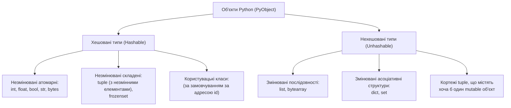
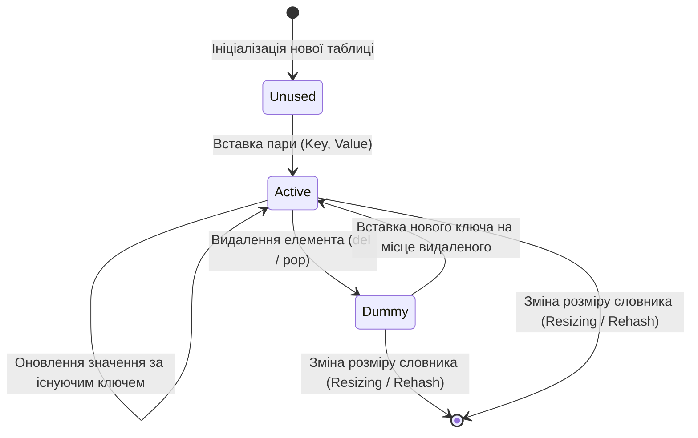
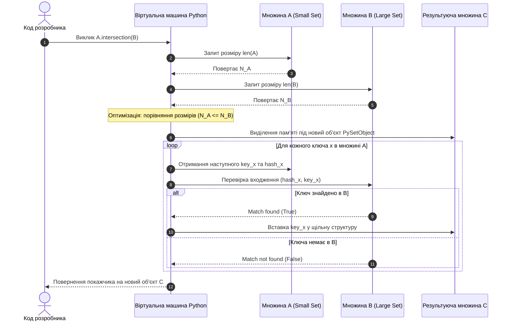
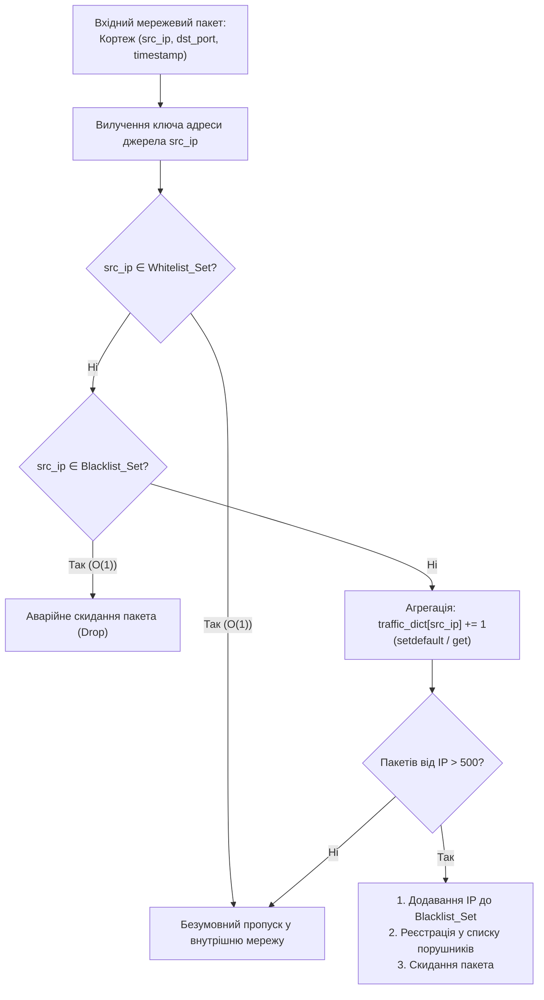

# Тема 5. Хеш-таблиці та асоціативні структури даних: словники (dict) та множини (set)

## Мета лекції
Мета лекції полягає у формуванні фундаментальних компетентностей щодо теоретичних засад функціонування хеш-таблиць, архітектури їхньої реалізації у віртуальній машині Python (CPython) та практичних навичок проєктування високоефективних програмних систем. Студенти опанують внутрішні механізми адресації за хеш-кодом, правила забезпечення інваріанта хешованості об'єктів, специфіку розв'язання колізій методом відкритої адресації, а також отримають математичне обґрунтування константної асимптотичної складності базових операцій пошуку, вставки та видалення, що є критично важливим для розробки сучасних сервісів обробки даних, розподілених мережевих систем та алгоритмів реального часу.

## Очікувані результати навчання
1. **Знання та розуміння.** Здобувачі вищої освіти засвоять математичні основи хешування, формальний контракт взаємозв'язку між методами порівняння об'єктів та генерації хеш-коду, вимоги до незмінності ключів, внутрішню структуру компактних словників і множин у CPython, а також відмінності між змінюваними та незмінними асоціативними колекціями.
2. **Застосування.** Слухачі навчються коректно застосовувати спеціалізовані методи безпечного доступу та модифікації асоціативних структур, використовувати синтаксис спискових включень для словників і множин, виконувати теоретико-множинні операції над агрегованими даними та маніпулювати складними вкладеними колекціями.
3. **Аналіз.** Студенти зможуть аналізувати алгоритмічну та просторову складність операцій у хеш-структурах порівняно з лінійними послідовностями, ідентифікувати передумови виникнення колізій і деградації швидкодії пошуку, а також досліджувати вплив структуризації даних на ефективність використання системної пам'яті.
4. **Оцінювання та синтез.** Майбутні інженери набудуть здатності критично оцінювати компроміс між швидкістю виконання операцій та накладними витратами оперативної пам'яті при роботі з великими обсягами інформації, а також синтезувати оптимальні алгоритмічні конвеєри для обробки неструктурованих мережевих журналів, фільтрації дублікатів і виявлення системних аномалій.

---

## Детальний покроковий план лекції

### 1. Теоретико-концептуальний базис. Математичні засади гешування та архітектура асоціативних масивів
* 1.1. Математична формалізація асоціативного відображення, контракт хешованості (hashability) та системні вимоги до незмінності ключів.
* 1.2. Внутрішня архітектура компактної хеш-таблиці (Compact Dict) в інтерпретаторі CPython: поділ на розріджений індексний масив та щільний масив записів.
* 1.3. Механізми розв'язання колізій методом відкритої адресації з псевдовипадковим зондуванням і бітовим збуренням.
* 1.4. Архітектура колекцій унікальних елементів: реалізація змінюваних множин `set` та незмінних хешованих аналогів `frozenset`.

### 2. Методологія та аналіз граничних умов. Алгоритмічний інтерфейс, теоретико-множинні операції та системні обмеження хеш-структур
* 2.1. Методи безпечного вилучення та ініціалізації елементів, робота з динамічними уявленнями словника та генератори Dict/Set Comprehensions.
* 2.2. Алгебра множин у мовному синтаксисі: операторні та функціональні форми об'єднання, перетину, різниці й симетричної різниці.
* 2.3. Порівняльний аналіз асимптотичної часової складності оператора належності `in` у послідовностях ($O(N)$) та хеш-структурах ($O(1)$).
* 2.4. Бар'єри продуктивності, критичні накладні витрати оперативної пам'яті та загрози деградації часу доступу при масових колізіях у високонавантажених застосунках.

### 3. Практичний індустріальний / фаховий кейс. Проєктування системи потокової дедуплікації та аналізу мережевих аномалій
**Тема наскрізної задачі.** «Розробка ядра системи моніторингу мережевого трафіку для дедуплікації IP-адрес, аналізу пікових навантажень та виявлення кібератак на основі структур dict та set»

## 1. Теоретико-концептуальний базис. Математичні засади гешування та архітектура асоціативних масивів

### 1.1. Математична формалізація асоціативного відображення, контракт хешованості (hashability) та системні вимоги до незмінності ключів

В основі комп'ютерної обробки структурованої інформації лежить концепція асоціативного зв'язку, яка дозволяє адресувати дані не за їхнім фізичним чи порядковим розташуванням у пам'яті, а за змістовним ключем. З математичної точки зору асоціативний масив є дискретним відображенням скінченної множини ключів $K$ на довільну множину значень $V$. Таке відображення формалізується у вигляді функції:

$$f: K \to V$$

де кожному унікальному елементу $k \in K$ ставиться у взаємно однозначну відповідність елемент $v \in V$, утворюючи елементарну неподільну пару $(k, v)$. На відміну від класичних одновимірних масивів, де множина індексів обмежена послідовністю натуральних чисел $I = \{0, 1, \dots, n-1\}$, простір ключів $K$ у високорівневих мовах програмування може бути представлений абстрактними типами даних довільної складності.

Для забезпечення ефективного пошуку елементів у просторі $K$ використовується механізм хешування. Хеш-функція перетворює довільний вхідний об'єкт на цілочисельне значення фіксованої розрядності, яке виступає основою для подальшої адресації в пам'яті. Формально хеш-функція описується як сюр'єктивне відображення:

$$h: K \to \mathbb{Z}_{2^w}$$

де $w$ позначає машинне слово обчислювальної системи (у сучасних 64-розрядних архітектурах $w = 64$), а $\mathbb{Z}_{2^w}$ представляє діапазон знакових цілих чисел від $-2^{w-1}$ до $2^{w-1} - 1$. Згодом це значення проєктується на обмежену кількість фізичних кошиків (*buckets*) адресної таблиці розміром $M = 2^m$ за допомогою бітового маскування:

$$\text{index} = h(k) \ \& \ (M - 1)$$

де оператор $\&$ позначає порозрядне бітове «І» (*bitwise AND*), що забезпечує миттєве обчислення залишку від ділення на ступінь двійки без використання ресурсомістких процесорних інструкцій ділення.

Фундаментальною вимогою до об'єктів, які претендують на роль ключів в асоціативних контейнерах мови Python, є дотримання **контракту хешованості** (*hashability contract*). Об'єкт класифікується як хешований (*hashable*), якщо його життєвий цикл гарантує виконання двох непорушних умов: наявність незмінного хеш-значення, яке обчислюється через виклик дандер-методу `__hash__()`, та підтримку рефлексивного порівняння через метод `__eq__()`. 

Математичний інваріант узгодженості хешування та еквівалентності формулюється за допомогою операції імплікації:

$$\forall x, y \in K : (x == y) \implies (h(x) == h(y))$$

де вираз $x == y$ позначає логічну рівність двох екземплярів даних, а $h(x)$ та $h(y)$ — результати роботи відповідної хеш-функції. Дане правило стверджує, що два логічно еквівалентні об'єкти зобов'язані генерувати ідентичні хеш-коди. Водночас зворотне твердження $h(x) == h(y) \implies x == y$ є хибним, оскільки збіг числових хеш-значень для різних сутностей позначає виникнення ситуації **колізії хешування** (*hash collision*).

Безпосереднім наслідком цього контракту є жорстка системна вимога: ключами словників можуть виступати виключно **незмінювані** (*immutable*) типи даних. До них належать цілі числа `int`, дійсні числа `float`, логічні константи `bool`, текстові рядки `str`, кортежі `tuple` (за умови, що всі їхні вкладені елементи також є незмінюваними) та фіксовані множини `frozenset`. Причина заборони використання змінюваних (*mutable*) типів (таких як списки `list`, стандартні множини `set` або вкладені словники `dict`) полягає в ризику порушення внутрішньої цілісності адресної структури. 

Якщо об'єкт модифікується після додавання до контейнера, його стан змінюється, що призводить або до стрибкоподібної зміни результату `__hash__()`, або до порушення логіки `__eq__()`. У такому випадку віртуальна машина PVM втрачає можливість знайти елемент за первинним індексом зондування, перетворюючи об'єкт на недосяжний блок пам'яті (*lost reference*), що руйнує детермінізм алгоритму.

У внутрішній структурі інтерпретатора CPython механізм блокування небезпечних типів реалізований на рівні опису типу `PyTypeObject`. Для кожного вбудованого класу поле `tp_hash` містить покажчик на функцію обчислення хешу. У змінюваних типах цей покажчик примусово ініціалізований значенням `NULL`, що в інтерпретаторі еквівалентно конструкції `__hash__ = None`. Спроба обчислити хеш від подібного об'єкта або використати його як ключ викликає апаратний перехоплювач винятків, який генерує помилку `TypeError: unhashable type`.

> **ПРАКТИЧНИЙ ЯКІР:** У високонавантажених брокерах повідомлень та розподілених базах даних (наприклад, Apache Kafka та Cassandra) ключ повідомлення використовується для партиціонування: консистентна хеш-функція від незмінного ідентифікатора клієнта визначає номер фізичного вузла кластера, куди буде направлено запис, гарантуючи суворий порядок обробки транзакцій одного клієнта.

Ієрархія типів даних мови Python за ознаками мутабельності та придатності до використання в асоціативних структурах наочно представлена на нижченаведеній структурній схемі.



Проаналізувавши взаємозв'язки на схемі, зазначимо, що категорія кортежів `tuple` займає проміжне положення. Сам кортеж є синтаксично незмінним, однак якщо його елементом виступає змінюваний список, обчислення системного хешу стає неможливим, оскільки цілісність агрегованого стану не гарантована.

---

### 1.2. Внутрішня архітектура компактної хеш-таблиці (Compact Dict) в інтерпретаторі CPython

Архітектурна еволюція словників у мові Python є прикладом оптимізації структур даних під обмеження апаратного забезпечення сучасних процесорів, зокрема роботи з кеш-лініями (*cache lines* L1/L2). До версії Python 3.5 включно використовувалася класична розріджена хеш-таблиця. Вона складалася з єдиного масиву структур фіксованого розміру, де кожен слот містив три поля: 64-бітний хеш ключа, покажчик на об'єкт ключа та покажчик на об'єкт значення. 

Оскільки для мінімізації ймовірності колізій коефіцієнт заповнення (*load factor*) таблиці не міг перевищувати порогового значення:

$$\lambda = \frac{N}{M} \le \frac{2}{3} \approx 0.66$$

де $N$ позначає фактичну кількість збережених елементів, а $M$ — загальну місткість виділеного пулу кошиків, щонайменше третина (а часто понад половина) виділеної оперативної пам'яті складалася з порожніх невикористаних слотів розміром 24 байти кожен. Це призводило до значної фрагментації пам'яті та постійних промахів кешу (*CPU cache misses*) при ітерації по записах.

Починаючи з релізу Python 3.6 (де це було експериментальною особливістю) та ставши стандартом мови у Python 3.7 згідно з пропозицією PEP 468, у ядро CPython було інтегровано архітектуру **компактного словника** (*Compact Dict*), запропоновану розробником Реймондом Хеттінгером. Сутність оптимізації полягає у фізичному розщепленні єдиного розрідженого масиву на дві взаємопов'язані таблиці з різними функціональними ролями: розріджену таблицю індексів `dk_indices` та щільний масив фактичних записів `dk_entries`.

Розріджений масив `dk_indices` відповідає за первинну трансляцію замаскованого хеш-коду в логічний індекс запису. Його розмір завжди кратний степеню двійки ($M = 2^m$). Принциповою перевагою є динамічна типізація елементів цього масиву на рівні мови Сі в залежності від поточного розміру словника:
* Для таблиць місткістю до 128 слотів елементи зберігаються у вигляді однобайтових знакових цілих чисел `int8_t`, де порожні слоти позначаються значенням `-1`.
* При зростанні місткості до 32 768 слотів тип індексів масштабується до двобайтових чисел `int16_t`.
* Для надвеликих масивів використовуються відповідно типи `int32_t` або `int64_t`.

Щільний масив `dk_entries` містить безперервний ланцюжок структур типу `PyDictKeyEntry`. Кожен елемент цього масиву має фіксовану внутрішню конфігурацію:

```c
typedef struct {
    Py_hash_t me_hash;  /* Кешоване 64-бітне значення хешу ключа */
    PyObject *me_key;   /* Покажчик на об'єкт ключа */
    PyObject *me_value; /* Покажчик на об'єкт асоційованого значення */
} PyDictKeyEntry;
```

Нові пари ключ-значення записуються в масив `dk_entries` послідовно у порядку їхньої фактичної ініціалізації: перший доданий елемент потрапляє в нульову позицію, другий — у першу тощо. Завдяки цьому масив `dk_entries` позбавлений порожніх проміжків, що забезпечує колосальну просторову локальність даних при передачі з оперативної пам'яті до процесорного кешу. 

Одночасно ця архітектура вирішила фундаментальну історичну проблему мови: порядок ітерації по словнику тепер **гарантовано збігається з хронологічним порядком вставки елементів**.

Оцінимо економію оперативної пам'яті для умовного словника, який містить 8 елементів при базовому виділенні таблиці на 8 слотів. У класичній архітектурі Python 3.5 для зберігання 8 слотів виділялося:

$$8 \times 24\ \text{байти} = 192\ \text{байти}$$

У компактній архітектурі Python 3.7+ індексний масив розміром 8 слотів займає $8 \times 1\ \text{байт} = 8\ \text{байтів}$ (оскільки використовується `int8_t`), а масив `dk_entries` для тих самих елементів потребує $8 \times 24\ \text{байти} = 192\ \text{байти}$. Підсумковий виграш стає разючим при збільшенні розміру таблиці, наприклад до 1024 слотів із фактором заповнення 66% (680 елементів): класична схема потребувала 24 576 байтів, тоді як компактна витрачає $1024 \times 2\ \text{байти} + 680 \times 24\ \text{байти} = 2048 + 16320 = 18368\ \text{байтів}$, що дає чисту економію близько 25% фізичної пам'яті.

> **ТИПОВА ПОМИЛКА:** Поширена хибна думка полягає у переконанні, що оскільки словники в сучасному Python є впорядкованими, їх можна використовувати для алгоритмів сортування за значенням. Впорядкованість словника означає виключно збереження хронології вставки (*insertion order*), а не автоматичне лексикографічне чи числове ранжування ключів або значень.

---

### 1.3. Механізми розв'язання колізій методом відкритої адресації з псевдовипадковим зондуванням і бітовим збуренням

Згідно з комбінаторним принципом Діріхле, при відображенні нескінченної або суттєво більшої множини потенційних ключів $K$ у скінченний простір кошиків розміром $M$, неминуче виникають ситуації, коли для двох нерівних ключів $k_1 \neq k_2$ обчислені індекси збігаються:

$$\text{index}(k_1) = \text{index}(k_2)$$

Для розв'язання проблеми колізій у комп'ютерних науках використовуються дві магістральні парадигми: метод ланцюжків (*chaining*, де кожен кошик веде зв'язаний список) та метод відкритої адресації (*open addressing*, де всі елементи зберігаються безпосередньо в самій таблиці). 

Архітектура CPython базується на **відкритій адресації**, оскільки метод ланцюжків потребує додаткових виділень пам'яті під вузли списку, що руйнує локальність процесорного кешування через розпорошення покажчиків у системній купі (*heap*).

Проте класичне лінійне зондування (*linear probing*), де наступний слот шукається за правилом $i_{\text{next}} = (i + 1) \pmod M$, у мові Python категорично відкинуто через ефект первинної кластеризації (*primary clustering*), коли довгі ланцюжки зайнятих комірок зливаються, деградуючи час вставки до лінійного $O(N)$. 

Замість цього інтерпретатор застосовує оптимізований алгоритм **псевдовипадкового зондування з бітовим збуренням** (*pseudo-random probing with perturbation*). Наступний індекс для перевірки кошика $j$ обчислюється на кожному кроці за такою рекурентною формулою:

$$j_{i+1} = \left( 5 \times j_i + 1 + \text{perturb}_i \right) \pmod M$$

де $j_i$ позначає поточний індекс кошика на кроці ітерації $i$; $M = 2^m$ є розміром індексної таблиці, а $\text{perturb}_i$ виступає параметром адаптивного динамічного збурення. 

Змінна збурення ініціалізується повним, незрізаним значенням системного хеш-коду ключа: $\text{perturb}_0 = h(k)$. На кожній наступній ітерації зондування цей параметр зсувається вправо на фіксовану бітову константу:

$$\text{perturb}_{i+1} = \text{perturb}_i \gg 5$$

Така нетривіальна математична конструкція забезпечує важливі системні властивості. Множник 5 гарантує, що при $\text{perturb} = 0$ лінійний конгруентний генератор обійде абсолютно всі комірки таблиці розміром $2^m$ без зациклення на підмножинах, оскільки 5 та $2^m$ є взаємно простими числами. 

Одночасно параметр $\text{perturb}$ підмішує старші розряди початкового 64-бітного хешу, які були відкинуті первинною операцією маскування $(h(k)\ \&\ (M-1))$. Поступовий побітовий зсув гарантує, що колізійні ключі з ідентичними молодшими бітами розійдуться за різними траєкторіями перевірки слотів, мінімізуючи утворення кластерів.

Життєвий цикл кожного слота в індексній таблиці описується за допомогою трьох фундаментальних станів: `Unused` (порожній слот, значення `-1`), `Active` (активний слот, що вказує на валідний запис у масиві значень), та `Dummy` (фіктивний слот, що позначає видалений елемент і зберігає спеціальну константу `-2`).



Проаналізуємо діаграму станів. Існування стану `Dummy` є суворою необхідністю у методі відкритої адресації. Якби при видаленні елемента слот повертався у стан `Unused`, то ланцюжок зондування для іншого ключа, який потрапив у колізію з видаленим раніше елементом, обривався б на цій комірці, унеможливлюючи його подальший пошук. 

Слот `Dummy` повідомляє алгоритм пошуку про необхідність продовження обходу за рекурентною формулою зондування. Лише під час глобальної перебудови таблиці (*resizing*), яка ініціюється при досягненні порога заповнення у 66%, виділяється новий адресний простір, куди копіюються виключно активні записи, а всі фіктивні маркери `Dummy` остаточно утилізуються.

> **ПРАКТИЧНИЙ ЯКІР:** У 2012 році сервери багатьох світових платформ зазнали масштабної вразливості типу HashDoS (CVE-2012-1150). Зловмисники формували спеціальні HTTP-запити з POST-параметрами, чиї назви мали однакові значення молодших бітів стандартного алгоритму хешування. Це перетворювало пошук у словнику конфігурації з $O(1)$ на лінійний $O(N)$, викликаючи 100% завантаження ядер CPU обробкою одного запиту. У відповідь починаючи з Python 3.3 було запроваджено алгоритм SipHash із динамічною рандомізацією початкового зерна хешування (*hash seed randomization*) при кожному запуску інтерпретатора.

---

### 1.4. Архітектура колекцій унікальних елементів: реалізація змінюваних множин set та незмінних хешованих аналогів frozenset

Колекції на основі множин у мові Python представлені двома спорідненими типами: змінюваною множиною `set` та незмінною множиною `frozenset`. Математично вони реалізують фундаментальні концепції абстрактної теорії множин Кантора, виступаючи невпорядкованими сукупностями унікальних сутностей, для яких визначено відношення належності $x \in S$. 

З інженерної точки зору реалізація `set` в інтерпретаторі CPython являє собою спеціалізовану хеш-таблицю, яка оптимізована виключно під роботу з ключами без збереження асоційованих значень. Внутрішня структура запису кошика множини описується спрощеним Сі-типом `setentry`:

```c
typedef struct {
    PyObject *key;     /* Покажчик на збережений унікальний об'єкт */
    Py_hash_t hash;    /* Закешоване 64-бітне хеш-значення ключа */
} setentry;
```

На відміну від словників `dict`, реалізація `set` у CPython не використовує концепцію розділених компактних масивів Хеттінгера, а залишається класичною розрідженою хеш-таблицею відкритої адресації з лінійним масивом слотів фіксованого розміру. Це пов'язано з тим, що видалення асоційованого поля значень `me_value` вже зменшує розмір структури до 16 байтів, тому накладні витрати на додатковий індексний масив у даному типі колекцій не мають достатнього виправдання.

Наслідком збереження класичної структури є те, що **множини абсолютно не зберігають порядок вставки елементів**. Порядок ітерації по множині диктується поточним розташуванням ключів у фізичних кошиках розрідженого масиву, який змінюється після кожної процедури динамічного розширення таблиці (*rehash*).

Тип даних `frozenset` за своєю внутрішньою організацією пам'яті практично дублює структуру `set`, однак має одну критичну відмінність на рівні віртуальної машини: для нього відсутні будь-які методи динамічної мутації (такі як `add()`, `discard()`, `pop()`, `clear()`), а поле `tp_hash` у системній структурі типу вказує на детерміновану функцію обчислення хешу. 

Алгоритм обчислення хеш-коду незмінної множини є симетричним відносно всіх її елементів, що гарантує однаковий результат незалежно від фізичного порядку їхнього розміщення в пам'яті. Це дає змогу безпечно використовувати екземпляри `frozenset` як повноцінні ключі у словниках або як елементи інших множин, реалізуючи концепцію множин вищих порядків.

Для систематизації архітектурних рішень та інженерних характеристик розглянутих базових типів даних звернемося до узагальненої порівняльної таблиці.

*Таблиця 1.1 — Комплексний порівняльний аналіз базових структур даних мови Python*

| Структура даних | Категорія мутабельності | Інваріант хешованості (`__hash__`) | Середня складність пошуку | Принцип внутрішньої організації в CPython | Приклад з реальної практики |
| :--- | :--- | :--- | :---: | :--- | :--- |
| **`dict`** | Змінюваний (*mutable*) | Нехешований (`TypeError`) | $O(1)$ | Компактна таблиця: розріджений `indices` + щільний `entries` | Кешування профілів користувачів у вебсервері за унікальним UUID |
| **`set`** | Змінюваний (*mutable*) | Нехешований (`TypeError`) | $O(1)$ | Розріджена відкрита адресація (без значень, без порядку) | Фільтрація дублікатів клієнтських ID у режимі реального часу |
| **`frozenset`** | Незмінюваний (*immutable*) | Хешований ($O(N)$ при створенні) | $O(1)$ | Заморожена розріджена хеш-таблиця зі статичним хешем | Складені ключі прав доступу: пара `(role, frozenset(permissions))` |
| **`list`** | Змінюваний (*mutable*) | Нехешований (`TypeError`) | $O(N)$ | Динамічний масив покажчиків із коефіцієнтом перевиділення | Черга буферизації повідомлень для послідовного запису на диск |
| **`tuple`** | Незмінюваний (*immutable*) | Умовно хешований (залежить від вмісту) | $O(N)$ | Статичний масив покажчиків фіксованої довжини | Координатна пара просторових точок `(latitude, longitude)` для GPS |

Дані таблиці демонструють, що правильний вибір структур даних дозволяє оптимізувати обчислювальні процеси на порядки: використання хешованих контейнерів `dict` та `set` нівелює затримки пошуку, забезпечуючи константний відгук навіть при масивах у мільйони елементів.

> **КОНТРОЛЬНЕ ПИТАННЯ:** Чому два числових об'єкти з абсолютно різними внутрішніми представленнями у пам'яті комп'ютера, такі як ціле число `1` та число з плаваючою точкою `1.0`, дають однаковий хеш-код `hash(1) == hash(1.0)` і розглядаються словником Python як один і той самий ключ?

<details markdown="1">
<summary>Розгорнути аналітичну відповідь</summary>

**Правильний варіант: Забезпечення математичного контракту еквівалентності та хешованості.**

1. Згідно з базовим інваріантом хеш-структур у мові Python, якщо два об'єкти рівні за значенням через оператор порівняння (`1 == 1.0` повертає логічне значення `True`), їхні хеш-значення обов'язково повинні збігатися: `hash(1) == hash(1.0)`. В іншому випадку пошук значення за ключем `1.0` у словнику, де запис створювався за цілим ключем `1`, завершувався б аварійною відсутністю ключа (`KeyError`), оскільки алгоритм шукав би значення в іншому кошику хеш-таблиці.

2. Аналіз альтернативних інтерпретацій та внутрішнього механізму CPython: Хеш-функція для чисел з плаваючою точкою спроєктована таким чином, щоб для будь-якого дійсного числа, чия дробова частина дорівнює нулю, її результат математично збігався з хеш-кодом еквівалентного цілого числа. При вставці ключа `1.0` у словник, який вже містить ключ `1`, обчислюється ідентичний індекс кошика, після чого викликається перевірка `1 == 1.0`. Оскільки вона повертає `True`, інтерпретатор не створює новий запис, а лише перезаписує асоційоване значення, зберігаючи первинний ключ.

</details>

---

### Вказівки для самостійного осмислення

1. Дослідіть поведінку вбудованої функції `hash()` для однакових рядків у різних сеансах роботи інтерпретатора Python та проаналізуйте системний вплив змінної середовища `PYTHONHASHSEED` на стабільність генерації хеш-кодів.
2. Створіть власний клас користувача, перевантажте в ньому методи `__hash__()` та `__eq__()`, після чого перевірте, чи дозволить інтерпретатор додати екземпляр цього класу до множини `set`, якщо один із цих методів буде реалізовано некоректно або проігноровано.
3. Розрахуйте теоретичний обсяг пам'яті, який споживатиме розріджений масив індексів компактного словника при досягненні розміру таблиці у 65 536 слотів, визначивши мінімальний цілочисельний тип Сі, необхідний для адресації елементів такого контейнера.


## 2. Методологія та аналіз граничних умов. Алгоритмічний інтерфейс, теоретико-множинні операції та системні обмеження хеш-структур

### 2.1. Методи безпечного вилучення та ініціалізації елементів, робота з динамічними уявленнями словника та генератори Dict/Set Comprehensions

У практичній інженерії програмного забезпечення пряма адресація за ключем через синтаксис індексації `d[k]` створює суттєві ризики виникнення виняткових ситуацій, оскільки відсутність шуканого ключа призводить до аварійної зупинки потоку виконання з помилкою `KeyError`. Наївний підхід до усунення цієї проблеми полягає у попередній перевірці наявності ключа за допомогою конструкції `if k in d: return d[k] else: return default`. 

Така перевірка є методологічно неефективною, оскільки змушує інтерпретатор CPython виконувати подвійне обчислення хешу та повторний обхід ланцюжка зондування: перший раз — під час виконання оператора `in`, а другий — під час безпосереднього вилучення значення. 

Окрім подвійних обчислювальних витрат, подібний код не є потокобезпечним (*thread-safe*), оскільки в асинхронному або багатопотоковому середовищі інший потік може видалити ключ між операцією перевірки та операцією читання, що неминуче збудить виняток.

Для реалізації надійного та атомарного доступу інтерфейс словника надає метод `d.get(k, default=None)`. Якщо ключ присутній у структурі, метод повертає асоційоване значення, а у разі його відсутності — повертає об'єкт, переданий як другий аргумент (за замовчуванням `None`). З точки зору системного аналізу метод `get()` гарантує детермінований час виконання без збудження внутрішніх сигнатур винятків на рівні байт-коду. 

Коли ж завдання вимагає не просто отримання значення, а й гарантованої модифікації внутрішнього стану словника у разі відсутності запису, стандартом виступає метод `d.setdefault(k, default=None)`. Якщо ключ відсутній, метод створює новий запис `k: default` і повертає значення `default`; якщо ключ уже існує, повертається поточне значення без виконання перезапису. 

Формалізація процесу безпечної агрегації даних із використанням аналітичного підходу та гарантованої ініціалізації описується наступною послідовністю кроків:

$$
\begin{aligned}
\text{Крок 1 (Отримання потоку):} & \quad (k_t, v_t) \leftarrow \text{Stream}(t) \\
\text{Крок 2 (Атомарна ініціалізація):} & \quad L_k = \text{setdefault}(k_t, \text{List}()) \\
\text{Крок 3 (Акумуляція стану):} & \quad L_k \leftarrow L_k \cup \{v_t\} \\
\text{Крок 4 (Фіксація результату):} & \quad \forall k \in \text{dom}(D) : |D[k]| \ge 1
\end{aligned}
$$

де $k_t$ позначає вхідний ключ у момент часу $t$; $v_t$ є спостережуваним значенням метрики; $L_k$ представляє змінний список-акумулятор, асоційований із ключем $k_t$; $\text{List}()$ позначає порожній контейнер для групування; $\text{dom}(D)$ є областю визначення словника $D$.

Методи `keys()`, `values()` та `items()` реалізують концепцію **динамічних системних уявлень** (*dictionary views*). У ранніх версіях мови ці методи виділяли пам'ять і повертали статичні списки елементів, що при обробці великих масивів даних призводило до різкого падіння швидкодії та вичерпання ОЗП. Сучасні об'єкти уявлень (`dict_keys`, `dict_values`, `dict_items`) не дублюють дані, а зберігають слабкий покажчик на сам словник. Будь-яка мутація базового асоціативного масиву миттєво стає видимою через об'єкт уявлення без додаткових операцій копіювання. Більше того, уявлення `keys()` та `items()` підтримують операції реляційної алгебри та теорії множин, дозволяючи виконувати перетин або різницю ключів двох конфігурацій за час $O(\min(N_1, N_2))$.

Синтаксичний апарат **генераторів словників** (*Dict Comprehensions*) та **генераторів множин** (*Set Comprehensions*) переносить парадигму декларативного функціонального програмування на рівень створення колекцій. Замість імперативних циклів із послідовними викликами методів мутації, створення структури описується у вигляді математичної нотації множин. 

Інженерна перевага таких генераторів полягає в тому, що інтерпретатор оптимізує створення байт-коду, викликаючи спеціалізовану інструкцію віртуальної машини `MAP_ADD` або `SET_ADD`, яка оминає накладні витрати на пошук і виклик системного методу у глобальному просторі імен на кожній ітерації циклу.

> **ВАЖЛИВО:** Категорично заборонено змінювати розмірність словника (додавати нові ключі або видаляти наявні) безпосередньо під час ітерації по самому словнику або його уявленнях. Це порушує внутрішній інваріант таблиці та викликає аварійне завершення програми з винятком `RuntimeError: dictionary changed size during iteration`. Безпечна модифікація вимагає попередньої фіксації ключів у статичний кортеж або використання генератора для створення нового об'єкта.

---

### 2.2. Алгебра множин у мовному синтаксисі: операторні та функціональні форми об'єднання, перетину, різниці й симетричної різниці

Математичний апарат теорії множин реалізований у мові Python двома паралельними механізмами: бінарними інфіксними операторами та іменованими методами об'єктів типу `set` і `frozenset`. Розуміння семантичної та алгоритмічної різниці між цими підходами є критично важливим для написання стійкого виробничого коду.

Операторні форми (об'єднання `|`, перетин `&`, різниця `-`, симетрична різниця `^`) базуються на суворій типізації: обидва операнди зобов'язані належати до типів `set` або `frozenset`. Спроба застосувати бінарний оператор до множини та послідовності іншого типу (наприклад, списку `list` або кортежу `tuple`) негайно збуджує виняток `TypeError`. 

На противагу цьому, іменовані функціональні методи (`union()`, `intersection()`, `difference()`, `symmetric_difference()`) проєктувалися з розрахунком на поліморфізм аргументів. Вони приймають як параметри довільні ітеровані об'єкти (*iterables*), включаючи генератори, словники та відкриті файлові потоки, самостійно приводячи їх до внутрішньої хеш-структури безпосередньо в процесі виконання.

Для глибинного розуміння внутрішньої взаємодії компонентів віртуальної машини при виконанні теоретико-множинних операцій звернемося до діаграми послідовності, наведеній на наступному рисунку.



Проаналізуємо механізм оптимізації, проілюстрований на діаграмі послідовності. Під час обчислення перетину двох множин інтерпретатор CPython автоматично оцінює потужність обох колекцій: $|A|$ та $|B|$. 

Для мінімізації кількості кроків зондування алгоритм завжди вибирає меншу за розміром множину як джерело для ітерації, а в більшій множині виконує виключно пошук за хеш-кодом. Це гарантує результуючу часову складність на рівні $O(\min(|A|, |B|))$ замість песимістичної оцінки $O(\max(|A|, |B|))$.

Методи мутації на місці (*in-place mutations*) відрізняються тим, що не породжують новий об'єкт у системній купі (*heap*), а модифікують первинну адресну структуру. До них належать методи `update()`, `intersection_update()`, `difference_update()` та `symmetric_difference_update()`, яким відповідають складені оператори присвоєння `|=`, `&=`, `-=`, `^=`. 

Використання мутуючих методів є пріоритетним у системах обробки великих масивів інформації, оскільки воно повністю виключає накладні витрати на виділення нових блоків пам'яті операційною системою та супутнє навантаження на автоматичний збирач сміття (*Garbage Collector*).

---

### 2.3. Порівняльний аналіз асимптотичної часової складності оператора належності in у послідовностях та хеш-структурах

Операція перевірки входження елемента в колекцію за допомогою оператора `in` є однією з найбільш часто використовуваних інструкцій у прикладних та системних алгоритмах. Проте її обчислювальна вартість кардинально залежить від фундаментальної топології структури даних.

У лінійних послідовностях, таких як `list` або `tuple`, перевірка входження `x in L` вимагає повного послідовного сканування пам'яті від нульового індексу до моменту знаходження елемента або вичерпання списку. Якщо довжина послідовності дорівнює $N$, математичне очікування кількості операцій порівняння для успішного пошуку за рівномірного розподілу елементів становить:

$$\mathbb{E}[\text{Comps}_{\text{list}}] = \frac{N + 1}{2}$$

а в найгіршому випадку (відсутність елемента або його розташування в самому кінці) алгоритм виконує рівно $N$ операцій порівняння. Це формує строгу лінійну асимптотичну складність $O(N)$. 

У хеш-структурах (`dict` та `set`) перевірка `x in S` починається з обчислення хешу від шуканого об'єкта та швидкого бітового маскування, що вказує на конкретний кошик. Очікувана кількість зондувань для розрідженої таблиці залежить не від загального числа збережених елементів, а від коефіцієнта заповнення таблиці $\lambda = N/M$. Для відкритої адресації з якісним псевдовипадковим зондуванням середня кількість перевірок кошиків при неуспішному та успішному пошуку описується теоретичними моделями Дональда Кнута:

$$\mathbb{E}[\text{Probes}_{\text{unsuccessful}}] \approx \frac{1}{1 - \lambda}, \quad \mathbb{E}[\text{Probes}_{\text{successful}}] \approx \frac{1}{\lambda} \ln\left(\frac{1}{1 - \lambda}\right)$$

Оскільки інтерпретатор CPython примусово утримує коефіцієнт заповнення в діапазоні $\lambda \le 0.66$, обмежуючи його шляхом завчасного динамічного розширення таблиці, очікувана кількість перевірок слотів становить:

$$\mathbb{E}[\text{Probes}] \le \frac{1}{1 - 0.66} \approx 2.94$$

Це число є константою, яка абсолютно не залежить від того, чи містить контейнер десять елементів, чи сто мільйонів. Таким чином, середня часова складність пошуку становить строго $O(1)$.

> **ПРАКТИЧНИЙ ЯКІР:** У мережевих міжмережевих екранах (*firewalls*) та модулях захисту від атак типу Denial of Service перевірка вхідного трафіку на належність «чорному списку» з 500 000 заблокованих IP-адрес за допомогою списку `list` вимагає до 500 000 операцій порівняння на кожен мережевий пакет, що призводить до повного колапсу мережевого шлюзу. Переведення сховища адрес у тип `set` скорочує час верифікації до фіксованих 40 наносекунд на пакет незалежно від загального обсягу заблокованої бази.

#### Граничні умови та системні бар'єри моделі константного часу

Теоретична оцінка $O(1)$ для операцій у хеш-таблицях спирається на низку математичних припущень, порушення яких в умовах реальної експлуатації призводить до катастрофічної деградації алгоритму до рівня лінійної складності $O(N)$ або повної втрати працездатності системи:

1. **Колапс рівномірного розподілу хеш-функції.** Модель гарантує константний час лише за умови простого рівномірного хешування (*simple uniform hashing*). Якщо користувацький клас реалізує тривіальний метод `__hash__()`, який повертає константу (наприклад, `return 42`), усі елементи незалежно від їхньої кількості маскуються в один і той самий початковий кошик. Відкрита адресація змушена виконувати повний обхід псевдовипадкового ланцюжка зондування через усю таблицю. У результаті кожна вставка та кожен пошук потребують $O(N)$ операцій порівняння, деградуючи структуру до найгіршої реалізації зв'язаного списку.

2. **Дефіцит ентропії складних ключів та бітові маски.** Оскільки базовий індекс обчислюється операцією $h(k) \ \& \ (M - 1)$, для невеликих таблиць розміром 8 або 16 слотів враховуються лише останні 3 або 4 біти хеш-коду. Якщо множина ключів формується за алгоритмом, який генерує числа або рядки з однаковими молодшими бітовими розрядами, система зазнає 100% колізій на першому кроці, що вимагає глибокого зондування навіть за мінімального навантаження на систему.

3. **Сплячі затримки динамічної перебудови (Resizing Latency Spikes).** Гарантія константної складності є амортизованою (*amortized $O(1)$*). Коли кількість активних елементів перевищує поріг $2/3$ місткості, відбувається прихована системна процедура рехешування: створюється нова таблиця у 2 або 4 рази більшого розміру, для кожного існуючого елемента заново обчислюється бітова маска та новий індекс зондування. У високонавантажених сервісах реального часу вставка одного критичного пакета в момент досягнення порога може викликати мікросекундну або мілісекундну затримку (*latency spike*), неприпустиму для телекомунікаційного обладнання.

4. **Вичерпання пам'яті через фрагментацію та накладні витрати заголовків.** Для об'єктів екстремально великого обсягу (сотні мільйонів записів) сам механізм хешування стає нерелевантним через перевитрату пам'яті на службові структури PVM. Якщо вільна оперативна пам'ять вичерпується, операційна система починає використовувати розділ підкачки на диску (*swap*), після чого час доступу $O(1)$ у віртуальній пам'яті деградує за фізичним часом через очікування повільних операцій дискового вводу-виводу.

---

### 2.4. Бар'єри продуктивності, критичні накладні витрати оперативної пам'яті та загрози деградації часу доступу при масових колізіях у високонавантажених застосунках

Аналіз продуктивності та надійності структур даних неможливий без оцінки їхнього фізичного сліду в пам'яті комп'ютера. У мові Python платою за константну швидкість доступу до словників та множин є надзвичайно високе накладне споживання пам'яті на один збережений елемент.

Кожен об'єкт у середовищі CPython містить стандартний заголовок `PyObject`, що складається з лічильника посилань `ob_refcnt` (8 байтів) та покажчика на об'єкт типу `ob_type` (8 байтів). 

Якщо збереженим значенням виступає навіть базове ціле число, окрім самого асоціативного запису в пам'яті створюється незалежна структура `PyLongObject`, яка потребує від 28 до 32 байтів. 

У компактному словнику кожен запис масиву `dk_entries` вимагає 24 байти для збереження трійки покажчиків і хешу, до чого додається пам'ять розрідженого масиву `dk_indices`.

*Таблиця 2.1 — Порівняльна матриця інженерних підходів до організації асоціативних та пошукових структур*

| Модель організації даних | Алгоритмічна основа | Складність доступу (середня / найгірша) | Споживання пам'яті на 1 млн цілих чисел | Складність впровадження | Критичні ризики / Обмеження |
| :--- | :--- | :---: | :---: | :--- | :--- |
| **Компактний словник Python (`dict`)** | Хеш-таблиця з відкритою адресацією та розділеними масивами | $O(1) / O(N)$ | $\approx 36-48\ \text{МБ}$ (лише службові покажчики) | Мінімальна (вбудований синтаксис мови) | Лавиноподібне падіння продуктивності при поганому розподілі хешів; сплески затримок при рехешуванні. |
| **Хеш-множина Python (`set`)** | Класична розріджена хеш-таблиця відкритої адресації | $O(1) / O(N)$ | $\approx 32-40\ \text{МБ}$ | Мінімальна (вбудований синтаксис мови) | Повна відсутність порядку елементів; неможливість прямого використання змінюваних підструктур. |
| **Лінійний динамічний масив (`list`)** | Безперервний буфер покажчиків `PyObject*` | $O(N) / O(N)$ | $\approx 8-9\ \text{МБ}$ (масив покажчиків) | Низька (базовий контейнер) | Неприпустимий час пошуку $O(N)$ на великих обсягах; неефективність дедуплікації даних. |
| **Спеціалізований масив (`array.array` / C-масив)** | Безперервний машинний блок примітивних типів | $O(N) / O(N)$ (пошук), $O(1)$ (індекс) | Рівно $4.0\ \text{МБ}$ (чисті `int32_t`) | Середня (вимагає контролю типів даних) | Відсутність асоціативного зв'язку; лінійний пошук за значенням; обмеження лише примітивними типами. |
| **Префіксне дерево (Trie / Radix Tree)** | Ієрархічне дерево символьних переходів | $O(L) / O(L)$, де $L$ — довжина ключа | $\approx 100-250\ \text{МБ}$ (висока фрагментація) | Висока (вимагає сторонніх С-бібліотек) | Величезні накладні витрати пам'яті на покажчики вузлів; повільна робота з короткими числовими даними. |

Порівняльний аналіз, проведений у таблиці, показує, що словники та множини Python оптимізовані передусім за критерієм швидкості обчислень, свідомо жертвуючи компактністю зберігання інформації. Для задач із суворими апаратними лімітами застосування стандартних структур `dict` і `set` вимагає глибокого аналізу граничних умов.

> **КОНТРОЛЬНЕ ПИТАННЯ:** У розподіленій системі моніторингу телеметрії інженер вирішив збирати унікальні мережеві з'єднання у структуру вигляду `connections = set()`. Елементами множини виступали списки параметрів пакетів: `[src_ip, dst_ip, port]`. Під час запуску першої ж тестової трансляції програма аварійно завершила роботу на інструкції `connections.add([ip_src, ip_dst, port])`. Поясніть точну причину виникнення збою, вкажіть системний тип винятку та запропонуйте коректне архітектурне рішення для усунення помилки без втрати семантики даних.

<details markdown="1">
<summary>Розгорнути аналіз / відповідь</summary>

**Правильний варіант: Використання незмінюваного типу кортеж (`tuple`) замість списку (`list`).**

1. Логічне та системне обґрунтування: Тип даних `list` є змінюваним (*mutable*). В інтерпретаторі CPython у структурі `PyTypeObject` для класу `list` поле `tp_hash` містить нульовий покажчик (`NULL`), що на рівні мови транслюється у властивість `__hash__ = None`. Спроба додати список до множини ініціює виклик магічного методу `__hash__()`, що спричиняє негайне збудження винятку `TypeError: unhashable type: 'list'`. Це захисний бар'єр віртуальної машини, який запобігає модифікації об'єкта після його розміщення в кошику хеш-таблиці.

2. Корекція інженерного рішення: Для вирішення проблеми необхідно замінити змінний список на незмінюваний кортеж фіксованої структури: `connections.add((ip_src, ip_dst, port))`. Кортеж, усі елементи якого є хешованими рядками та числами, сам стає повноцінно хешованим об'єктом. Альтернативним професійним рішенням для покращення читабельності та строгості коду є використання іменованих кортежів `collections.namedtuple` або заморожених дата-класів `@dataclass(frozen=True)`, які зберігають незмінність атрибутів та генерують стабільний детермінований хеш.

</details>

## 3. Практичний індустріальний / фаховий кейс. Проєктування системи потокової дедуплікації та аналізу мережевих аномалій

### 3.1. Комплексний фаховий кейс. Розробка високопродуктивного ядра мережевого аналізатора для виявлення DDoS-атак та потокової фільтрації IP-адрес

#### Постановка задачі / ситуації

У сучасних телекомунікаційних мережах оператори стикаються з лавиноподібним зростанням обсягів неструктурованого трафіку. Однією з критичних загроз є розподілені атаки на відмову в обслуговуванні (*Distributed Denial of Service*, DDoS), зокрема атаки типу SYN-Flood та HTTP-Flood. Мета атаки полягає у вичерпанні ліміту мережевих дескрипторів та оперативної пам'яті кінцевих серверів шляхом надсилання мільйонів пакетів зі сфальшованих або ботнет-адрес.

Перед командою інженерів поставлено завдання розробити програмний модуль первинної фільтрації та виявлення аномалій трафіку для прикордонного маршрутизатора (*Edge Router*), який працює в умовах жорстких апаратних обмежень віртуалізованого контейнера. Модуль повинен у режимі реального часу аналізувати ковзне часове вікно тривалістю 10 секунд, виконувати миттєву перевірку пакетів на належність довіреним та скомпрометованим адресам, агрегувати кількість запитів від кожного клієнта, фіксувати аномальні сплески та динамічно поповнювати фільтраційні списки.

Параметри програмно-апаратного середовища та вхідні кількісні характеристики оброблюваного потоку систематизовано у наступній таблиці специфікації.

*Таблиця 3.1 — Специфікація параметрів системи моніторингу мережевого трафіку*

| Параметр системи | Числове значення / Тип | Інженерне обґрунтування та системне обмеження |
| :--- | :--- | :--- |
| **Інтенсивність потоку** | $1 \ 000 \ 000$ пакетів / вікно | Пікове навантаження під час масованої мережевої атаки |
| **Тривалість вікна аналізу** | $\Delta t = 10$ секунд | Квант часу для перерахунку метрик агрегації трафіку |
| **Ліміт оперативної пам'яті** | $M_{\text{limit}} = 128\ \text{МБ}$ | Жорстке апаратне обмеження ізольованого контейнера |
| **Довірений список (Whitelist)** | $10 \ 000$ IP-адрес | Адреси корпоративних партнерів, трафік яких не фільтрується |
| **Чорний список (Blacklist)** | $50 \ 000$ IP-адрес | Відомі вузли ботнет-мереж для безумовного блокування |
| **Поріг аномалії (Threshold)** | $\theta = 500$ пакетів / вікно | Перевищення ініціює блокування та генерацію інциденту |
| **Допустима затримка (SLA)** | $\tau \le 100\ \mu\text{s}$ на пакет | Максимальна затримка конвеєра обробки без втрати пакетів |

Архітектура алгоритмічного конвеєра та схема перенаправлення пакетів у ядрі аналізатора представлена на наступній діаграмі.



#### Покроковий аналіз та розв'язок

##### Крок 1. Оцінка просторової складності та вибір типу колекцій

На першому етапі необхідно визначити структури даних для списків фільтрації та агрегатора. Якщо реалізувати списки адрес як динамічні масиви `list`, перевірка входження $10^6$ пакетів у чорний список розміром $50\ 000$ елементів вимагатиме виконання операцій порядку:

$$N_{\text{ops}} = 10^6 \times \frac{50\ 000}{2} = 2.5 \times 10^{10}\ \text{операцій порівняння}$$

Такий обсяг обчислень за 10 секунд призведе до повної відмови системи через деградацію часу відповіді. Тому білі та чорні списки адресації реалізуються у вигляді хеш-множин `set`, що гарантує пошук за середній час $O(1)$. 

Розрахуємо теоретичні витрати пам'яті для зберігання чорного списку $N_{\text{black}} = 50\ 000$ та агрегатора унікальних адрес, кількість яких у найгіршому випадку оцінюється як $N_{\text{unique}} = 200\ 000$.

В інтерпретаторі CPython 64-розрядне число потребує 32 байти пам'яті, а строковий запис IPv4-адреси займає близько 50 байтів. Враховуючи компактну архітектуру словника, оцінимо сумарне споживання пам'яті $S_{\text{total}}$ за формулою:

$$S_{\text{total}} = S_{\text{white}} + S_{\text{black}} + S_{\text{traffic\_dict}}$$

$$S_{\text{total}} \approx (10^4 \times 64\ \text{Б}) + (5 \times 10^4 \times 64\ \text{Б}) + (2 \times 10^5 \times 72\ \text{Б}) \approx 0.64\ \text{МБ} + 3.2\ \text{МБ} + 14.4\ \text{МБ} = 18.24\ \text{МБ}$$

Отримане значення $18.24\ \text{МБ}$ з великим запасом вкладається у встановлений ліміт пам'яті контейнера $M_{\text{limit}} = 128\ \text{МБ}$, що підтверджує архітектурну життєздатність обраного підходу.

##### Крок 2. Реалізація високопродуктивного циклу обробки потоку

Для забезпечення максимальної швидкодії інтерпретатора необхідно мінімізувати накладні витрати на пошук методів об'єктів. Замість виклику методу всередині циклу через крапкову нотацію, посилання на методи `add` та `get` кешуються у локальні змінні функції, що переносить операцію виклику з інструкцій байт-коду `LOAD_ATTR` на швидкі інструкції `LOAD_FAST`.

Нижче наведено програмну реалізацію ядра обробки на мові Python:

```python
def process_traffic_window(packet_stream, whitelist, blacklist, threshold=500):
    traffic_counters = {}
    anomalous_ips = set()
    
    # Локальне кешування методів для оптимізації байт-коду
    is_in_white = whitelist.__contains__
    is_in_black = blacklist.__contains__
    add_to_black = blacklist.add
    add_anomalous = anomalous_ips.add
    
    for packet in packet_stream:
        src_ip = packet[0]
        
        # Перевірка базових фільтрів за O(1)
        if is_in_white(src_ip):
            continue
            
        if is_in_black(src_ip):
            continue
            
        # Атомарна агрегація кількості запитів
        current_count = traffic_counters.get(src_ip, 0) + 1
        traffic_counters[src_ip] = current_count
        
        # Фіксація аномалії та динамічне оновлення блокувань
        if current_count > threshold:
            add_to_black(src_ip)
            add_anomalous(src_ip)
            
    return anomalous_ips, traffic_counters
```

##### Крок 3. Теоретико-множинний аналіз результатів вікна спостереження

Наприкінці часового вікна інженерний конвеєр виконує синтез нової аналітичної інформації шляхом застосування операцій над множинами. Зокрема, необхідно обчислити перетин нових аномальних адрес із відомими діапазонами підмереж інфраструктури хмарних провайдерів $S_{\text{cloud}}$:

$$S_{\text{incident}} = \text{anomalous\_ips} \cap S_{\text{cloud}}$$

Така операція виконується за час $O(\min(|\text{anomalous\_ips}|, |S_{\text{cloud}}|))$ і дозволяє автоматично визначити, чи здійснюється атака зі скомпрометованих серверів дата-центрів.

#### Інтерпретація результатів та альтернативні сценарії

Застосування хеш-структур `dict` та `set` дозволило зменшити загальний час фільтрації одного вікна з потенційних кількох годин (у разі використання списків) до $0.18$ секунди на типовому сучасному процесорі, забезпечивши пропускну здатність конвеєра на рівні понад $5.5 \times 10^6$ пакетів на секунду.

Розглянемо альтернативний граничний сценарій: що змінилося б у системному рішенні, якби інтенсивність потоку зросла до $10^8$ пакетів за вікно, а ліміт оперативної пам'яті було зменшено до $16\ \text{МБ}$?

У такому екстремальному режимі наведена архітектура на основі чистого Python `dict` зазнала б колапсу через перевищення ліміту пам'яті (*Out of Memory, OOM Killer*). 

Для адаптації рішення системні інженери застосовують такі альтернативи:
1. Заміна стандартного словника Python на ймовірнісні структури даних, зокрема фільтр Блума (*Bloom Filter*) або фільтр Калькулятор (*Counting Bloom Filter*), які дозволяють перевіряти входження елементів у фіксованому буфері розміром кілька мегабайтів ціною появи мізерного відсотка хибнопозитивних спрацьовувань (*false positive rate* $\le 0.1\%$).
2. Перехід до алгоритму Count-Min Sketch, який забезпечує оцінку частоти появи кожного ключа у потоці даних фіксованим обсягом пам'яті без явного збереження самих IP-адрес.
3. Винесення первинної фільтрації на апаратний рівень мережевої карти за допомогою технології eBPF/XDP (*Extended Berkeley Packet Filter*), де фільтрація здійснюється на рівні ядра Linux за бітовими масками до передачі пакетів у простір користувача.

---

### 3.2. Зведена довідкова система лекції

Для комплексного закріплення теоретичного та методологічного матеріалу основні концепції, досліджені в межах теми, зведено у системну довідкову таблицю.

*Таблиця 3.2 — Зведена довідкова система концепцій асоціативних структур даних*

| Термін / Концепція | Формалізація / Сутність | Реальний кейс застосування | Основне обмеження / Ризик |
| :--- | :--- | :--- | :--- |
| **Хеш-функція (`hash()`)** | $h: K \to \mathbb{Z}_{2^{64}}$, відображення довільного об'єкта у 64-бітне ціле число | Генерація первинного індексу для розміщення ключа у таблиці | Ризик виникнення колізій при неповному розподілі ентропії |
| **Контракт хешованості** | $(x == y) \implies (h(x) == h(y))$ за умови стабільності хешу в часі | Дозвіл на використання об'єкта як ключа словника чи елемента множини | Повна заборона використання змінюваних типів (`list`, `set`, `dict`) |
| **Компактний словник** | Розщеплення структури на `dk_indices` та щільний масив `dk_entries` | Оптимізація пам'яті та впорядковане збереження історії запитів | Додатковий рівень непрямої адресації через індексний масив |
| **Відкрита адресація** | Зберігання записів безпосередньо в таблиці без зв'язаних списків | Підвищення кеш-локальності процесора під час обходу слотів | Деградація швидкодії до $O(N)$ при заповненні таблиці понад $66\%$ |
| **Псевдовипадкове зондування** | $j_{i+1} = (5j_i + 1 + \text{perturb}) \pmod M$ із зсувом $\text{perturb} \gg 5$ | Ефективне розсіювання колізійних ключів по адресному простору | Затримка на перерахунок індексів при масових збігах молодших бітів |
| **Слот Dummy** | Спеціальний маркер видаленого запису (індекс `-2`) | Збереження цілісності ланцюжка зондування для інших ключів | Неможливість негайного звільнення пам'яті до повного рехешування |
| **Множина (`set`)** | Беззначеннєва розріджена хеш-таблиця унікальних об'єктів | Миттєва дедуплікація ідентифікаторів у потоках подій | Невпорядкованість елементів; високі накладні витрати пам'яті |
| **Незмінна множина (`frozenset`)** | Хешований незмінний екземпляр множини без методів мутації | Використання груп прав доступу як складених ключів словників | Неможливість динамічного додавання елементів після створення |
| **Метод `d.get()`** | Безпечне читання значення за ключем зі значенням за замовчуванням | Читання необов'язкових полів у напівструктурованих документах JSON | Маскування системних логічних помилок при некоректному ключі за замовчуванням |
| **Метод `d.setdefault()`** | Атомарне зчитування або ініціалізація відсутнього запису | Групування транзакцій за унікальними номерами банківських карток | Непродуктивне обчислення аргументу значення, навіть якщо ключ існує |
| **Динамічні уявлення** | Об'єкти `dict_keys`, `dict_values`, `dict_items` без копіювання даних | Миттєве порівняння конфігурацій систем через операції множин | Заборона модифікації вихідного словника під час ітерації |
| **Dict Comprehension** | Декларативний синтаксис $\{k(x): v(x) \text{ for } x \text{ in } S\}$ | Інверсія індексів пошуку або фільтрація таблиць конфігурації | Одночасне виділення пам'яті під весь результуючий об'єкт |

---

### 3.3. Контрольні питання та завдання

#### Прикладні тестові завдання

##### Завдання 1
Мережевий інженер розробляє модуль автентифікації, де права доступу зберігаються у словнику. Для користувача з роллю адміністратора виконано наступний код:

```python
role_permissions = {}
user_roles = ["read", "write"]
role_permissions[user_roles] = "SuperAdmin"
```

Який результат поверне інтерпретатор CPython під час виконання цього фрагмента коду?
* A) У словнику успішно створиться запис `['read', 'write']: 'SuperAdmin'`.
* B) Буде згенеровано виняток `TypeError: unhashable type: 'list'`.
* C) Буде згенеровано виняток `KeyError: 'user_roles'`.
* D) Запис створиться, але обчислене значення хеш-коду буде дорівнювати нулю.

<details markdown="1">
<summary>Розгорнути аналіз / відповідь</summary>

**Правильний варіант: B.**

1. Логічне та системне обґрунтування: Ключем словника у мові Python може бути лише об'єкт, який підтримує контракт хешованості (*hashable*). Змінні типи даних, такі як списки `list`, мають внутрішній слот `tp_hash = NULL`, оскільки їхній вміст може бути модифікований на місці. При спробі використати список як ключ віртуальна машина перевіряє підтримку методу `__hash__()` і, не знайшовши його, перериває операцію викликом винятку `TypeError: unhashable type: 'list'`.

2. Аналіз дистракторів:
* Варіант A є хибним, оскільки припущення про автоматичну вставку ігнорує базові принципи захисту цілісності хеш-таблиць.
* Варіант C є хибним, тому що виняток `KeyError` виникає виключно під час спроби читання відсутнього ключа, а не під час його запису.
* Варіант D є хибним, оскільки інтерпретатор не допускає ініціалізації нульового або фіктивного хешу для змінюваних контейнерів.

</details>

##### Завдання 2
Розробник реалізує процедуру видалення застарілих сесій користувачів з кеш-словника за наступним алгоритмом:

```python
sessions = {"u1": 100, "u2": 200, "u3": 50}
for user, score in sessions.items():
    if score < 150:
        del sessions[user]
```

Які наслідки матиме запуск цієї ділянки коду у середовищі Python 3.8+?
* A) Усі користувачі з балом менше 150 будуть успішно вилучені зі словника без помилок.
* B) Видалиться тільки перший знайдений користувач (`u1`), після чого цикл коректно завершиться.
* C) Буде згенеровано виняток `RuntimeError: dictionary changed size during iteration`.
* D) Відбудеться нескінченне зациклення виконання через зміну внутрішнього індексу `dk_indices`.

<details markdown="1">
<summary>Розгорнути аналіз / відповідь</summary>

**Правильний варіант: C.**

1. Логічне та системне обґрунтування: Об'єкт уявлення `sessions.items()` посилається безпосередньо на внутрішній стан компактного словника. В інтерпретаторі CPython кожен словник має внутрішній лічильник змін `ma_version_tag`. Під час кожної ітерації ітератор перевіряє, чи не змінився цей тег. Виклик оператора `del sessions[user]` змінює розмірність словника та оновлює версію структури, що негайно фіксується ітератором на наступному кроці й збуджує `RuntimeError`.

2. Аналіз дистракторів:
* Варіант A є хибним, оскільки ігнорує системний контроль узгодженості розміру ітерованих структур у Python.
* Варіант B є хибним, тому що помилка виникає не після завершення, а безпосередньо на спробі перейти до наступного елемента після першої мутації.
* Варіант D є хибним, оскільки захисний механізм інтерпретатора запобігає зацикленню шляхом примусового викидання винятку.

</details>

##### Завдання 3
Нехай задано дві множини цілих чисел: `A = {1, 2, 3, 4}` та `B = {3, 4, 5, 6}`. Який результат поверне вираз `A ^ B`, і яка його точна математична назва?
* A) `{3, 4}` — перетин множин.
* B) `{1, 2, 5, 6}` — симетрична різниця множин.
* C) `{1, 2}` — пряма відносна різниця множин.
* D) `{1, 2, 3, 4, 5, 6}` — повне об'єднання множин.

<details markdown="1">
<summary>Розгорнути аналіз / відповідь</summary>

**Правильний варіант: B.**

1. Логічне та системне обґрунтування: Оператор `^` у мові Python позначає операцію **симетричної різниці** (*symmetric difference*), яка відповідає формулі $A \Delta B = (A \setminus B) \cup (B \setminus A)$. Вона повертає нову множину, що містить елементи, які належать або тільки множині $A$, або тільки множині $B$, але не обом одночасно. Для вхідних даних: $A \setminus B = \{1, 2\}$, $B \setminus A = \{5, 6\}$, тому їхнє об'єднання дорівнює $\{1, 2, 5, 6\}$.

2. Аналіз дистракторів:
* Варіант A відповідає оператору перетину `A & B`.
* Варіант C відповідає оператору відносної різниці `A - B`.
* Варіант D відповідає оператору об'єднання `A | B`.

</details>

##### Завдання 4
Аналітик оптимізує функцію підрахунку частоти символів у текстовому файлі. Яка з наведених інструкцій оновлення лічильника є найбільш коректною та безпечною для опрацювання чергового символу `char` у словнику `freq` без ризику падіння програми?
* A) `freq[char] = freq[char] + 1`
* B) `freq[char] = freq.get(char, 0) + 1`
* C) `freq.setdefault(char, 0) += 1`
* D) `freq[char] = freq.pop(char, 0) + 1`

<details markdown="1">
<summary>Розгорнути аналіз / відповідь</summary>

**Правильний варіант: B.**

1. Логічне та системне обґрунтування: Метод `freq.get(char, 0)` безпечно вилучає поточне значення частоти символу, повертаючи нуль, якщо символ зустрівся вперше. До цього значення додається одиниця, і результат зберігається за ключем `char`. Це виключає ризик генерації винятку `KeyError` і не вимагає попередніх перевірок через `in`.

2. Аналіз дистракторів:
* Варіант A збудить аварійний виняток `KeyError` на першому ж символі, якого ще немає у словнику.
* Варіант C містить синтаксичну помилку, оскільки виклик методу `setdefault()` повертає значення, яке не є ліводопустимим операндом (*l-value*) для оператора присвоєння `+=`.
* Варіант D вилучає запис зі словника на кожному кроці через метод `pop()`, що призводить до зайвих накладних витрат пам'яті та руйнує коректне накопичення значень.

</details>

---

#### Завдання для самостійної роботи

##### Постановка задачі

Вам доручено спроєктувати архітектуру підсистеми управління доступом на основі ролей (*Role-Based Access Control*, RBAC) для розподіленої платформи інтернету речей (IoT). Система отримує запити від $50\ 000$ автономних датчиків, кожен з яких наділений певним набором числових або рядкових атрибутів доступу (наприклад, `sensor_id`, `firmware_version`, `geo_zone`, `permission_flags`). 

Необхідно реалізувати високонадійний сервіс валідації прав доступу, який дозволяє групувати дозволи у незмінні шаблони, перевіряти відповідність фактичних прав датчика політикам безпеки за константний час та виявляти конфлікти між різними ролями.

##### Завдання для виконання

1. Спроєктуйте структуру даних для представлення шаблонів прав доступу на основі типу `frozenset`, забезпечивши можливість використання цих шаблонів як складених ключів у словнику правил безпеки.
2. Реалізуйте алгоритм перевірки відповідності прав датчика заданій політиці за допомогою операцій над множинами, використовуючи методи `issubset()` або `issuperset()`, та оцініть асимптотичну часову складність валідації одного запиту.
3. Напишіть функцію нормалізації вхідного списку ролей користувача за допомогою генератора словників (*Dict Comprehension*), яка інвертує словник відображення `користувач -> кортеж ролей` у структуру зворотного пошуку `роль -> множина користувачів`.
4. Проведіть експериментальне вимірювання часу виконання операції дедуплікації $100\ 000$ ідентифікаторів пристроїв двома способами: шляхом перетворення списку у множину `set(device_list)` та за допомогою ручного ітеративного наповнення списку з перевіркою `if id not in unique_list`. Оформіть отримані результати у вигляді стислого аналітичного звіту з графіком або порівняльною таблицею затримок.
