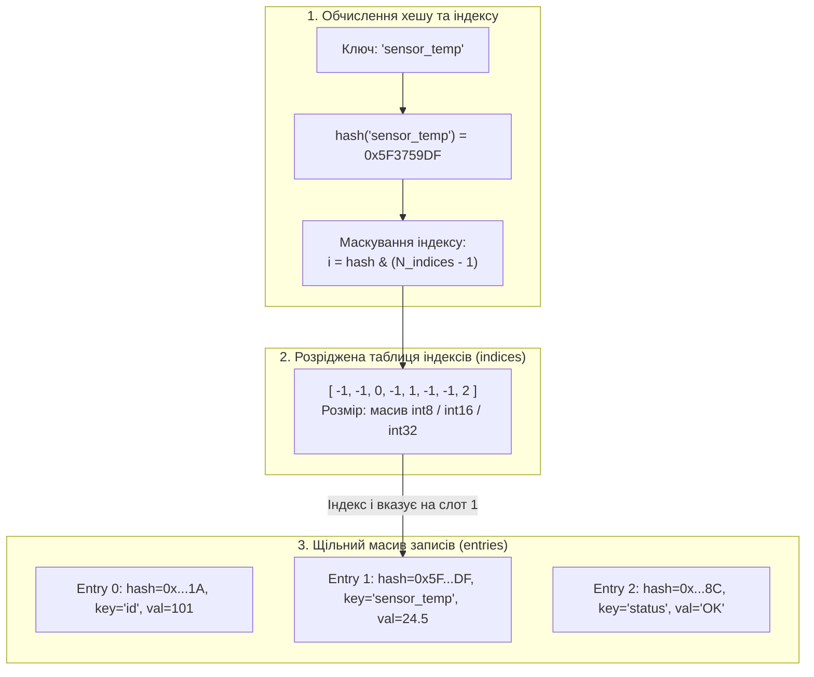
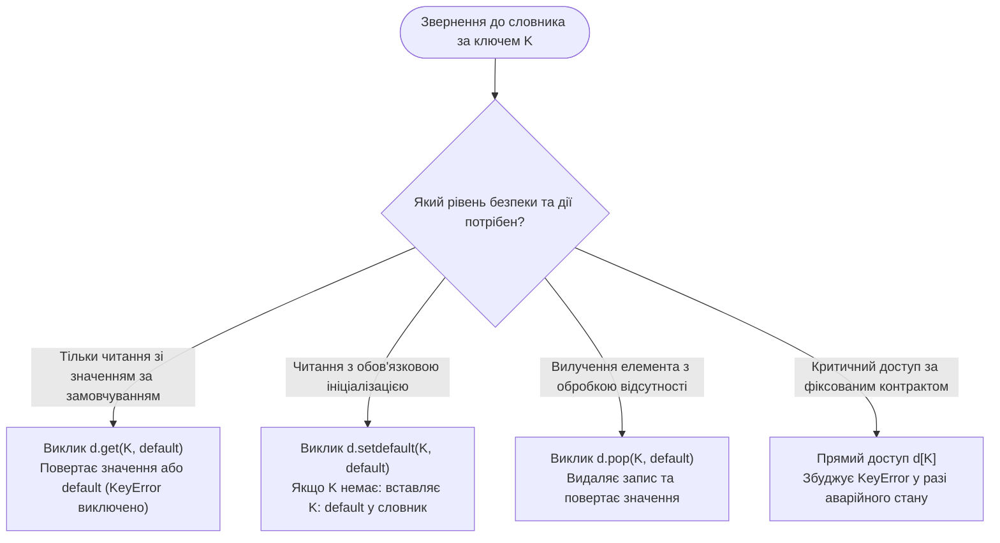
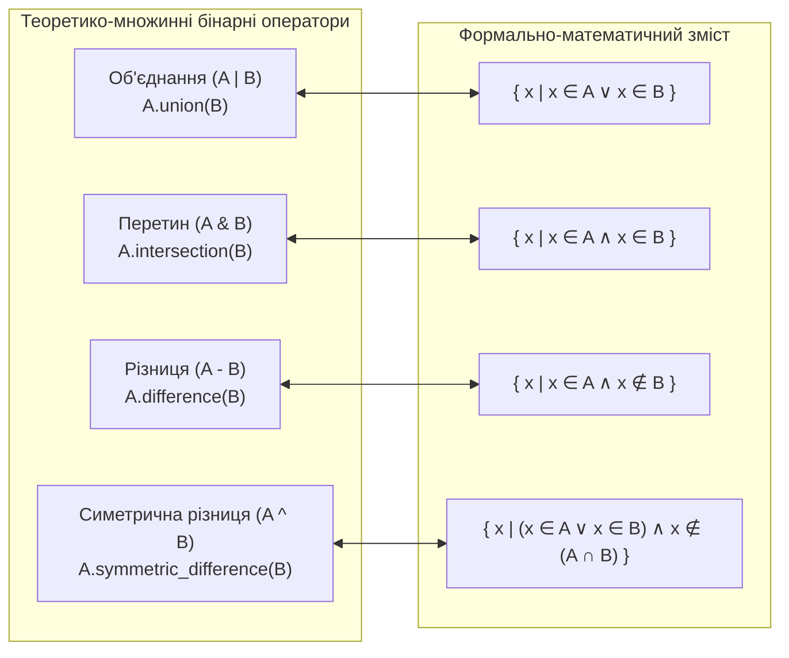

# ЗМІСТОВИЙ МОДУЛЬ 2. ТЕМА 5. ХЕШ-ТАБЛИЦІ ТА АСОЦІАТИВНІ СТРУКТУРИ: СЛОВНИКИ (DICT) ТА МНОЖИНИ (SET)

---

## 5.1. Тип даних словник (dict): структура "ключ-значення", вимоги до хешованості ключів (hashable), створення та базовий доступ

### Основний зміст та теоретичний базис

В інженерії програмного забезпечення та теорії алгоритмів асоціативні структури даних займають центральне місце завдяки здатності забезпечувати прямий доступ до інформації за символьними або складеними ідентифікаторами. У мові програмування Python основною асоціативною структурою виступає **словник** (`dict`), що реалізує відображення множини унікальних ключів $K$ на множину довільних значень $V$:

$$f: K \to V$$

Кожен запис словника представляє неподільну пару «ключ–значення» (*key-value pair*). На відміну від послідовностей типу `list` або `tuple`, де адресація здійснюється за цілочисельним порядковим індексом, адресація у словнику базується на обчисленні хеш-функції від ключа.

Фундаментальною вимогою до об'єктів, які можуть використовуватися як ключі словника, є їхня **хешованість** (*hashability*). Об'єкт є хешованим тоді і тільки тоді, коли він має фіксоване протягом усього свого життєвого циклу хеш-значення, яке обчислюється магічним методом `__hash__()`, та підтримує порівняння на рівність з іншими об'єктами через метод `__eq__()`. 

Математично коректність функціонування хеш-структур спирається на суворе дотримання контракту узгодженості хешування та рівності:

$$\forall x, y \in K : (x == y) \implies (\text{hash}(x) == \text{hash}(y))$$

де $x$ та $y$ — довільні об'єкти мови Python; $\text{hash}(x)$ — 64-розрядне ціле число, що повертається вбудованою функцією `hash(x)`. Зворотне твердження загалом не є істинним: збіг хеш-значень $\text{hash}(x) == \text{hash}(y)$ для нерівних об'єктів ($x \neq y$) свідчить про виникнення **колізії хешування** (*hash collision*).

Причина, чому змінні об'єкти (наприклад, списки `list`, словники `dict`, множини `set`) категорично не можуть виступати ключами словників, криється у природі їхньої мутабельності. Якщо об'єкт змінює свій внутрішній стан, це неминуче призводить або до зміни його хеш-значення, або до зміни результатів перевірки на рівність через `__eq__()`. 

Якби змінний об'єкт було вставлено у хеш-таблицю в певний кошик (*bucket*), а згодом модифіковано в пам'яті, його новий хеш вказував би на зовсім інший кошик. У результаті об'єкт став би недосяжним для пошуку, що повністю зруйнувало б цілісність асоціативного масиву. З цієї причини в інтерпретаторі CPython для всіх змінюваних вбудованих типів слот методу `tp_hash` встановлено у значення `NULL` (`__hash__ = None`), що при спробі використання викликає виняток `TypeError: unhashable type`.

Внутрішня архітектура словника в інтерпретаторі CPython (починаючи з версії Python 3.6, згідно з пропозицією стандарту PEP 468) побудована за схемою **компактної хеш-таблиці** (*compact dict*), розробленої Реймондом Хеттінгером. Традиційні хеш-таблиці використовували єдиний розріджений масив великого розміру, у якому кожен слот містив трійку покажчиків `(hash, key, value)`. 

Через необхідність підтримки коефіцієнта заповнення не вище 66% дві третини виділеної оперативної пам'яті залишалися порожніми. Компактна архітектура CPython розділила словник на дві окремі таблиці: розріджений індексний масив `indices` та щільний масив записів `entries`.


*Рисунок 1 — Структура компактної хеш-таблиці CPython: розділення розрідженого індексного масиву та щільного масиву збереження записів*

Проаналізуємо схему, зображену на рисунку. Розріджений масив `indices` містить лише невеликі цілі числа (типу `int8` для таблиць розміром до 128 слотів, `int16` для таблиць до 32768 слотів тощо), які вказують на позицію запису в щільному масиві. Масив `entries` зберігає структури з полями `me_hash` (кешоване 64-бітне значення хешу), `me_key` (покажчик на об'єкт ключа) та `me_value` (покажчик на об'єкт значення). 

Нові пари «ключ–значення» записуються в масив `entries` строго послідовно у порядку їх надходження. Завдяки цьому словники в сучасному Python мають фундаментальну інженерну гарантію: **збереження порядку вставки елементів** (*insertion-order preservation*) при скороченні споживання оперативної пам'яті на 20–35% порівняно зі старими реалізаціями.

Розв'язання колізій у CPython реалізовано за методом відкритої адресації (*open addressing*) з псевдовипадковим зондуванням (*pseudo-random probing*). Якщо первинний слот `indices[i]` вже зайнятий іншим ключем із таким самим маскованим значенням індексу, інтерпретатор обчислює наступний індекс зондування $j$ за рекурентною формулою:

$$j = ((5 \times j) + 1 + \text{perturb}) \pmod{2^k}$$

де $j$ — поточний індекс у таблиці `indices`; $2^k$ — загальний розмір індексної таблиці, що завжди є степенем двійки; $\text{perturb}$ — змінна збурення, яка ініціалізується повним значенням незрізаного хешу і на кожному кроці зсувається праворуч на 5 розрядів ($\text{perturb} \leftarrow \text{perturb} \gg 5$). 

Змінна $\text{perturb}$ гарантує, що високі розряди хеш-коду, які спочатку були відсічені бітовою маскою $(2^k - 1)$, поступово впливають на послідовність обходу кошиків, що мінімізує кластеризацію колізій.

Створення словників здійснюється за допомогою літерала фігурних дужок `{}` або фабричної функції `dict()`. Базовий доступ до значення за ключем виконується оператором індексації `d[key]`. Якщо ключ присутній у структурі, доступ виконується за константний час $O(1)$. У разі відсутності ключа віртуальна машина PVM генерує виняток `KeyError`.

*Таблиця 5.1 — Порівняльний аналіз механізмів асоціативного пошуку в структурах даних*

| Механізм адресації | Алгоритмічна основа | Середня часова складність | Найгірша часова складність | Вимоги до ключів |
| :--- | :--- | :---: | :---: | :--- |
| **Хеш-таблиця CPython (`dict`)** | Відкрита адресація з псевдовипадковим зондуванням | $O(1)$ | $O(N)$ (катастрофічні колізії) | Хешованість (`__hash__`, `__eq__`), незмінність |
| **Збалансоване дерево пошуку (AVL/Red-Black)** | Ієрархічне бінарне порівняння вузлів | $O(\log N)$ | $O(\log N)$ | Підтримка операції строгого порядку (`<`, `__lt__`) |
| **Лінійний асоціативний список (A-List)** | Послідовний лінійний перебір пар `(key, value)` | $O(N)$ | $O(N)$ | Підтримка оператора рівності (`==`, `__eq__`) |

Порівняння структур демонструє абсолютну перевагу хеш-таблиці CPython за швидкістю доступу, що робить словники базовим інструментом для побудови просторів імен, кешів системних дескрипторів та баз даних реального часу в комп'ютерній інженерії.

---

## 5.2. Методи словників (keys, values, items, get, setdefault, pop, update), безпечний доступ без винятків KeyError, Dict Comprehensions

### Основний зміст та теоретичний базис

Стандартний протокол словника у мові Python надає розгалужений інтерфейс методів для безпечного читання, модифікації, каскадного оновлення та генерації динамічних уявлень. Оскільки пряме звернення за індексом `d[key]` є потенційно небезпечним через генерацію винятку `KeyError`, у високонадійних програмних модулях системного адміністрування та обробки телеметрії застосовуються спеціалізовані методи безпечного доступу.

Метод `d.get(key, default=None)` виконує пошук ключа у хеш-таблиці. Якщо ключ знайдено, метод повертає асоційоване з ним значення, а у разі його відсутності — повертає значення аргументу `default` без збудження винятку `KeyError`. Це дозволяє уникати попередніх перевірок через оператор `in` та виключає необхідність огортання операції в блок `try-except`.

Метод `d.setdefault(key, default=None)` реалізує атомарну операцію перевірки та ініціалізації: якщо ключ `key` присутній у словнику, метод повертає існуюче значення; якщо ж ключ відсутній, метод вставляє в словник новий запис `key: default` і повертає значення `default`. Метод `setdefault` широко застосовується для групування даних за категоріями, наприклад, при агрегації пакетів за IP-адресами джерел:

```python
# Агрегація мережевих пакетів за IP-адресою джерела
traffic_log = {}
for packet in raw_packets:
    traffic_log.setdefault(packet.src_ip, []).append(packet.payload_size)
```

Метод `d.pop(key[, default])` виконує вилучення запису зі словника. Якщо ключ знайдено, відповідна пара видаляється з хеш-таблиці, а асоційоване значення повертається викликачу. Якщо ключ відсутній, але передано необов'язковий аргумент `default`, метод повертає його значення; за відсутності значення за замовчуванням генерується виняток `KeyError`. 

Спеціальний метод `d.popitem()` видаляє та повертає останню додану пару `(key, value)` у форматі кортежу згідно з дисципліною LIFO (*Last In, First Out*), спираючись на гарантований порядок вставки елементів компактної таблиці CPython.

Метод `d.update([other])` здійснює масове оновлення словника. Він приймає інший словник або ітеровану послідовність пар `(key, value)` та перезаписує існуючі значення, або додає нові ключі у кінець таблиці.


*Рисунок 2 — Дерево вибору інженерних патернів доступу до елементів словника*

Проаналізуємо схему, наведену на рисунку. Вибір методу доступу визначається вимогами до інваріанта стану програми. У випадках, коли відсутність ключа свідчить про порушення протоколу взаємодії або апаратний збій, доцільно використовувати пряму індексацію `d[key]`, що ініціює системний виняток. Якщо ж відсутність ключа є штатним станом конфігурації, застосовуються методи `get()` або `setdefault()`.

Особливе місце в архітектурі Python займають **динамічні уявлення словника** (*dictionary views*), що повертаються методами `d.keys()`, `d.values()` та `d.items()`. Уявлення не створюють статичних копій списків елементів у пам'яті, а є легковаговими ітерованими вікнами перегляду безпосередньо над внутрішніми структурами словника. 

Будь-яка подальша модифікація словника автоматично та миттєво відображається у раніше створених об'єктах уявлень без додаткових обчислень. Уявлення `keys()` та `items()` підтримують множинні операції (об'єднання `|`, перетин `&`, різницю `-`), якщо значення словника є хешованими, що дозволяє порівнювати структури конфігурацій за один рядок коду.

**Генератори словників** (*Dict Comprehensions*, впроваджені у PEP 274) надають лаконічний декларативний синтаксис для створення та трансформації асоціативних масивів:

$$\{k(x): v(x) \mid x \in S \land P(x)\}$$

Синтаксична форма запису в Python має вигляд:

```python
{key_expression(x): value_expression(x) for x in iterable if predicate(x)}
```

де `key_expression(x)` та `value_expression(x)` визначають правила обчислення ключа та значення відповідно; `iterable` — вхідний потік даних; `predicate(x)` — фільтруюча умова. 

Типовим інженерним застосуванням генераторів словників є операція **інверсії словника** (перетворення однозначного відображення $K \to V$ у зворотне $V \to K$), нормалізація конфігураційних параметрів та фільтрація масивів телеметрії:

```python
# Інверсія словника ідентифікаторів портів
port_to_device = {80: "HTTP", 443: "HTTPS", 22: "SSH", 21: "FTP"}
device_to_port = {device: port for port, device in port_to_device.items()}
# Результат: {'HTTP': 80, 'HTTPS': 443, 'SSH': 22, 'FTP': 21}
```

*Таблиця 5.2 — Характеристики та часова складність методів словника `dict`*

| Метод | Сигнатура | Мутує словник | Повертає значення | Асимптотична складність |
| :--- | :--- | :---: | :--- | :---: |
| **`keys()`** | `d.keys()` | Ні | Динамічне уявлення `dict_keys` | $O(1)$ |
| **`values()`** | `d.values()` | Ні | Динамічне уявлення `dict_values` | $O(1)$ |
| **`items()`** | `d.items()` | Ні | Динамічне уявлення `dict_items` | $O(1)$ |
| **`get()`** | `d.get(k, [def])` | Ні | Значення або `default` | $O(1)$ |
| **`setdefault()`**| `d.setdefault(k, [def])` | Так (при додаванні) | Існуюче або нове значення | $O(1)$ |
| **`pop()`** | `d.pop(k, [def])` | Так | Вилучене значення або `default` | $O(1)$ |
| **`popitem()`** | `d.popitem()` | Так | Кортеж `(key, value)` (LIFO) | $O(1)$ |
| **`update()`** | `d.update([other])` | Так | `None` | $O(M)$, де $M = \text{len}(other)$ |
| **`clear()`** | `d.clear()` | Так | `None` | $O(1)$ |

Дані таблиці демонструють високу ефективність методів словника, що досягається завдяки оптимізованій адресації на рівні віртуальної машини PVM.

---

## 5.3. Множини (set, frozenset): математичні операції над множинами, методи мутації, швидкість перевірки входження (in) за O(1)

### Основний зміст та теоретичний базис

**Множина** (`set`) у мові Python є невпорядкованою колекцією унікальних хешованих об'єктів. За своєю внутрішньою інженерною організацією об'єкт `set` у CPython є модифікацією хеш-таблиці, у якій зберігаються виключно ключі, а покажчики на асоційовані значення відсутні. Це забезпечує високу швидкість виконання операцій перевірки належності елемента множині ($x \in S$) із середньою часовою складністю $O(1)$, на відміну від списків та кортежів, де аналогічна операція вимагає лінійного перебору за час $O(N)$.

У мові реалізовано дві варіації типу множини:
* Змінювана множина (**`set`**, структура `PySetObject`): дозволяє динамічно додавати та вилучати елементи під час виконання програми. Оскільки тип `set` є мутабельним, він не має реалізації методу `__hash__()` і не може бути елементом іншої множини або ключем словника.
* Незмінна множина (**`frozenset`**, структура `PyFrozenSetObject`): ініціалізується один раз і після створення не підлягає модифікації. Об'єкт `frozenset` є повноцінно хешованим, що дозволяє використовувати його для побудови множин вищих порядків (множин, елементами яких є інші множини) та складених ключів у словниках.

Створення порожньої змінюваної множини виконується виключно через конструктор `s = set()`, оскільки синтаксичний літерал `{}` зарезервований під створення порожнього словника. Непорожні множини можуть створюватися за допомогою літерала з фігурними дужками: `s = {1, 2, 3}`.


*Рисунок 3 — Відповідність бінарних операторів мови Python формальним операціям теорії множин*

Проаналізуємо взаємозв'язок між синтаксичними конструкціями Python та класичною теорією множин. Мова надає дві форми виконання кожної операції: через бінарні оператори та через іменовані методи. Ключова відмінність полягає в тому, що бінарні оператори (`|`, `&`, `-`, `^`) вимагають, щоб обидва операнди належали до типу `set` або `frozenset`. Натомість однойменні методи (`union()`, `intersection()`, `difference()`, `symmetric_difference()`) можуть приймати як аргумент довільну ітеровану послідовність (список, кортеж, генератор), автоматично приводячи її до множини під час виконання.

Розглянемо математичну формалізацію базових операцій над множинами:

**1. Об'єднання множин ($A \cup B$):** Обчислюється оператором `A | B` або методом `A.union(B)`. Результуюча множина містить усі елементи, що належать хоча б одній із вхідних множин:

$$A \cup B = \{x \mid x \in A \lor x \in B\}$$

Часова складність операції становить $O(|A| + |B|)$.

**2. Перетин множин ($A \cap B$):** Обчислюється оператором `A & B` або методом `A.intersection(B)`. Результат містить тільки ті елементи, які одночасно присутні в обох множинах:

$$A \cap B = \{x \mid x \in A \land x \in B\}$$

Для оптимізації алгоритм CPython завжди ітерує меншу за розміром множину та виконує пошук елементів у більшій множині за час $O(\min(|A|, |B|))$.

**3. Відносна різниця множин ($A \setminus B$):** Обчислюється оператором `A - B` або методом `A.difference(B)`. Результат складається з елементів множини $A$, які не входять до множини $B$:

$$A \setminus B = \{x \mid x \in A \land x \notin B\}$$

Часова складність операції становить $O(|A|)$.

**4. Симетрична різниця ($A \Delta B$):** Обчислюється оператором `A ^ B` або методом `A.symmetric_difference(B)`. Множина містить елементи, які належать точно одній із множин, виключаючи їхній спільний перетин:

$$A \Delta B = (A \setminus B) \cup (B \setminus A) = \{x \mid (x \in A \lor x \in B) \land x \notin (A \cap B)\}$$

Часова складність операції становить $O(|A| + |B|)$.

Предикати відношень між множинами повертають булеві значення:
* Перевірка неперетинності: `A.isdisjoint(B)` повертає `True`, якщо $A \cap B = \emptyset$.
* Перевірка підмножини: вираз `A <= B` або метод `A.issubset(B)` повертає `True`, якщо кожен елемент множини $A$ належить множині $B$ ($A \subseteq B$). Строга підмножина $A \subset B$ перевіряється оператором `A < B`.
* Перевірка надмножини: вираз `A >= B` або метод `A.issuperset(B)` повертає `True`, якщо $A \supseteq B$. Строга надмножина перевіряється через `A > B`.

Методи мутації змінюваної множини модифікують об'єкт на місці:
* Метод `s.add(elem)` додає окремий елемент у множину за константний час $O(1)$. Якщо елемент уже присутній, стан структури не змінюється.
* Метод `s.discard(elem)` вилучає елемент із множини за час $O(1)$. Якщо елемент відсутній, метод завершує роботу без збудження помилок.
* Метод `s.remove(elem)` вилучає елемент, однак у разі його відсутності обов'язково генерує виняток `KeyError`.
* Метод `s.pop()` вилучає та повертає довільний елемент множини, збуджуючи `KeyError` над порожньою структурою.
* Методи оновлення на місці (`s.update()`, `s.intersection_update()`, `s.difference_update()`, `s.symmetric_difference_update()` та відповідні оператори `|=`, `&=`, `-=`, `^=`) змінюють вихідну множину $s$, застосовуючи відповідну теоретико-множинну операцію.

*Таблиця 5.3 — Порівняльний аналіз колекцій та послідовностей у мові Python*

| Структура | Впорядкованість | Змінюваність | Унікальність елементів | Хешованість структури | Складність пошуку (`in`) |
| :--- | :---: | :---: | :---: | :---: | :---: |
| **`list`** | Так | Так | Ні (дублікати дозволені) | Ні (`TypeError`) | $O(N)$ |
| **`tuple`** | Так | Ні | Ні (дублікати дозволені) | Так (якщо всі елементи незмінні) | $O(N)$ |
| **`set`** | Ні | Так | Так (тільки унікальні) | Ні (`TypeError`) | $O(1)$ в середньому |
| **`frozenset`**| Ні | Ні | Так (тільки унікальні) | Так (`__hash__` підтримується) | $O(1)$ в середньому |
| **`dict`** | Так (з версії 3.7) | Так | Ключі унікальні | Ні (`TypeError`) | $O(1)$ в середньому |

Наведені у таблиці дані демонструють чіткий розподіл інженерних ролей: множини та словники оптимізовані для задач високонавантаженої фільтрації, швидкої перевірки прав доступу, видалення дублікатів та аналізу топологій графів у комп'ютерних системах.

---

### Питання для самоперевірки та аналітичного осмислення

1. Сформулюйте математичний контракт хешованості об'єктів у мові Python. Чому рівність двох об'єктів $x == y$ обов'язково вимагає рівності їхніх хеш-значень $\text{hash}(x) == \text{hash}(y)$, але однаковий хеш не гарантує рівності об'єктів?
2. Розкрийте системні причини, чому змінні структури даних (зокрема `list` та `set`) не можуть бути використані як ключі словника чи елементи множини. Що відбувається на рівні C-API CPython при спробі виклику функції `hash()` для списку?
3. Поясніть архітектурну організацію компактних словників (*Compact Dict*, PEP 468). Яким чином розділення на розріджену таблицю `indices` та щільний масив `entries` забезпечує одночасну економію пам'яті та гарантію збереження порядку вставки?
4. Опишіть рекурентний алгоритм псевдовипадкового зондування при виникненні колізій хешування у CPython. Яку роль відіграє побітовий зсув змінної $\text{perturb}$ у запобіганні кластеризації колізій?
5. Чим семантично відрізняється поведінка методу `d.get(key, default)` від `d.setdefault(key, default)`? Наведіть інженерний приклад оптимізації групування даних за допомогою `setdefault()`.
6. У чому полягає різниця між структурами `set` та `frozenset`? Поясніть, у яких випадках виникає практична необхідність використання множини незмінного типу.
7. Порівняйте алгоритмічну складність перевірки входження `item in collection` для списку довжиною $N = 10^6$ елементів та множини такого самого обсягу. Опишіть причину колосальної різниці у швидкодії на рівні процесорних інструкцій.