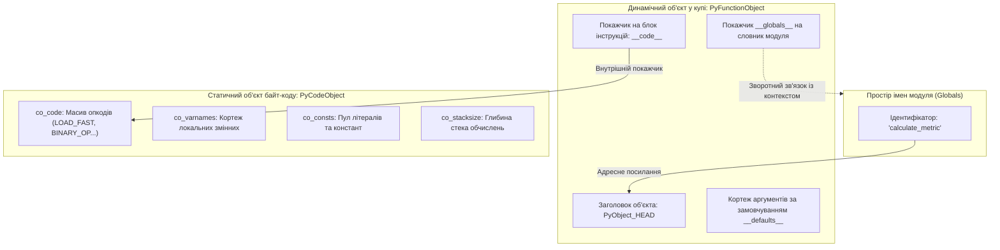
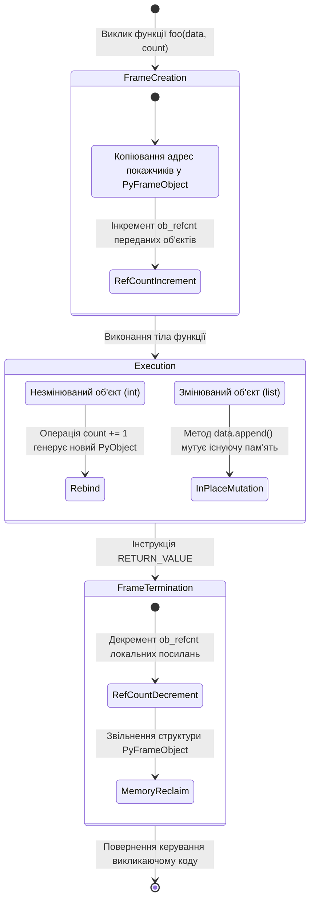
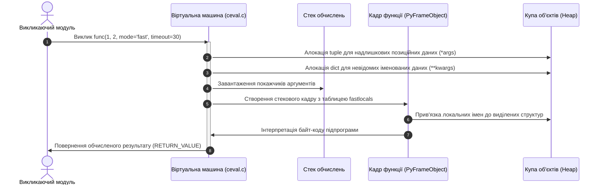
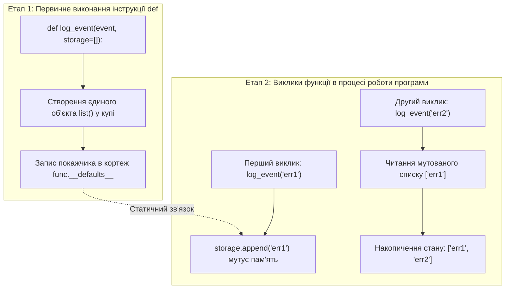
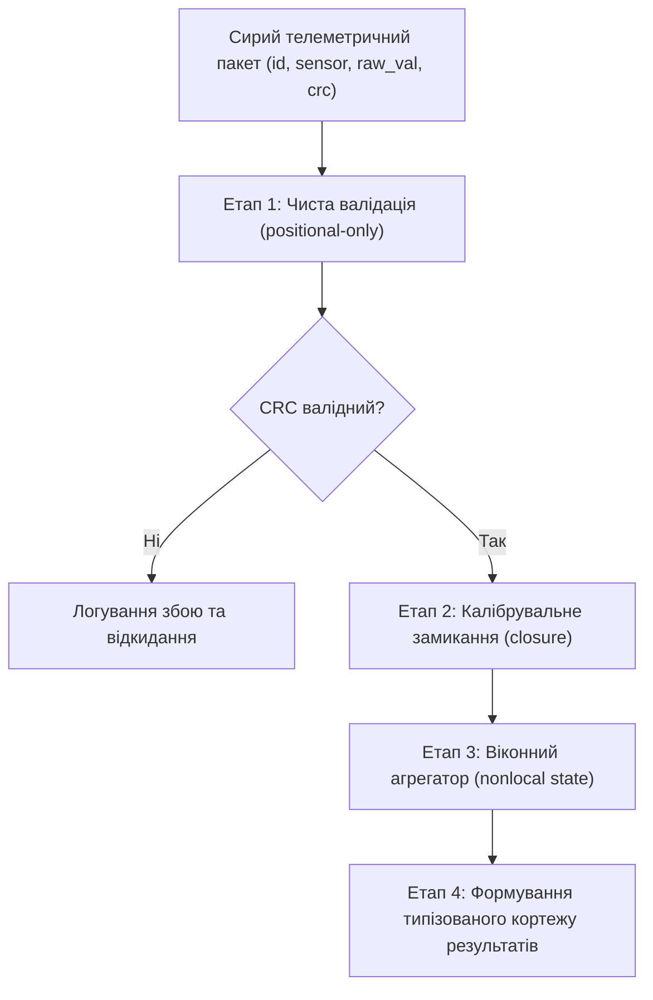

# Тема 6. Функціональна організація програмного коду

## Мета лекції
Формування у здобувачів першого (бакалаврського) рівня вищої освіти фундаментального розуміння процедурно-модульної та функціональної декомпозиції програмного забезпечення мовою Python. Лекція орієнтована на розкриття внутрішніх механізмів створення та виконання підпрограм у середовищі CPython, опанування концепції функцій як об'єктів першого класу, детальне вивчення механізмів виділення пам'яті під час виклику підпрограм за моделлю передачі посилань на об'єкти, засвоєння правил зв'язування аргументів у сучасних стандартах мови, а також опанування дисципліни лексичних областей видимості LEGB для проектування надійних, масштабованих та стійких до відмов інженерних систем.

## Очікувані результати навчання
1. **Знання та розуміння.** Студенти повинні засвоїти архітектурні засади функціональної організації коду в Python, зрозуміти відмінності між статичним байт-кодом об'єкта коду та динамічним об'єктом функції в пам'яті, а також осягнути системні механізми передачі параметрів за посиланням на спільний об'єкт.
2. **Застосування.** Здобувачі вищої освіти набудуть умінь проектувати гнучкі та типізовані сигнатури підпрограм із використанням позиційних, ключових і варіативних параметрів, реалізовувати чисті функції без небажаних побічних ефектів та застосовувати анонімні вирази у конвеєрах обробки потокових даних.
3. **Аналіз.** Студенти зможуть аналізувати проходження ідентифікаторів крізь багаторівневі лексичні простори імен за правилом LEGB, своєчасно діагностувати помилки зв'язування неініціалізованих локальних змінних, а також досліджувати поведінку функціональних замикань і рекурсивних викликів на рівні кадрів стека виконання.
4. **Оцінювання та синтез.** Майбутні інженери зможуть критично оцінювати компроміси між ітеративними обчисленнями, глибокою рекурсією та функціями вищого порядку за критеріями просторової складності й швидкодії, а також синтезувати модульні архітектурні рішення для високонавантажених прикладних систем.

---

## Детальний покроковий план лекції

### 1. Теоретико-концептуальний базис. Архітектура функцій, життєвий цикл об'єктів та модель передачі параметрів
* 1.1. Синтаксична декларація функцій інструкцією def, внутрішня структура об'єкта PyFunctionObject та генерація незмінного байт-коду PyCodeObject у віртуальній машині CPython.
* 1.2. Модель передачі параметрів pass-by-object-reference та оцінка впливу мутабельності аргументів на збереження цілісності даних викликаючого середовища.
* 1.3. Семантика оператора return, правила повернення об'єкта-сінглтона None та механізми автоматичного пакування множинних значень у незмінний кортеж.
* 1.4. Концепція функцій як об'єктів першого класу (First-class citizens), системна інтроспекція службових атрибутів та розміщення посилань у просторах імен.

### 2. Методологія та аналіз граничних умов. Розширене зв'язування аргументів, лексичні замикання та бар'єри рекурсивних обчислень
* 2.1. Варіативне пакування аргументів за допомогою синтаксичних конструкцій *args та **kwargs із наступним застосуванням операцій структурного розпакування колекцій.
* 2.2. Застосування специфікаторів PEP 570 та PEP 3102 для суворого розмежування позиційних (positional-only) та іменованих (keyword-only) параметрів у публічних програмних інтерфейсах.
* 2.3. Дозвіл ідентифікаторів за ієрархічним правилом LEGB, проектування лексичних замикань та модифікація контексту видимості за допомогою директив global і nonlocal.
* 2.4. Анонімна функціональна декомпозиція за допомогою lambda-виразів у поєднанні з функціями вищого порядку map та filter для потокової трансформації даних.
* 2.5. Архітектурні обмеження та критичні бар'єри: небезпека спільного стану при використанні мутабельних значень за замовчуванням у кортежі __defaults__ та вичерпання системного стека викликів RecursionError за відсутності оптимізації хвостової рекурсії в CPython.

### 3. Практичний індустріальний / фаховий кейс. Проєктування модульного конвеєра обробки телеметричних сигналів у розподілених системах
**Тема наскрізної задачі.** «Розробка відмовостійкого функціонального конвеєра первинної валідації, калібрування та потокової агрегації телеметричних пакетів сенсорної мережі з використанням чистих функцій, варіативних аргументів та замикань»


## 1. Теоретико-концептуальний базис. Архітектура функцій, життєвий цикл об'єктів та модель передачі параметрів

### 1.1. Синтаксична декларація функцій інструкцією def, внутрішня структура об'єкта PyFunctionObject та генерація незмінного байт-коду PyCodeObject у віртуальній машині CPython

Функціональна декомпозиція виступає фундаментальним інженерним інструментом структурування складних обчислювальних систем, забезпечуючи ізоляцію локальної алгоритмічної логіки, повторне використання програмного коду та мінімізацію ентропії архітектури. У традиційних компільованих мовах програмування на зразок C або C++ декларація функції є статичною директивою для транслятора, яка фіксує сигнатуру та генерує незмінну адресу точки входу в сегменті пам'яті інструкцій. На противагу цьому, у мові програмування Python інструкція `def` є повноцінним виконуваним оператором часу виконання. Коли інтерпретатор CPython під час послідовного виконання блоку інструкцій досягає ключового слова `def`, він не просто реєструє прототип, а динамічно ініціалізує новий об'єкт у керованій купі та пов'язує його ім'я з новоствореною адресою в поточному просторі імен.

Внутрішня архітектура підпрограми у середовищі CPython базується на чіткому розділенні між статичним скомпільованим представленням алгоритму та динамічним екземпляром функції. Статична складова інкапсулюється в низькорівневому незмінному об'єкті коду **PyCodeObject**, який формується компілятором під час синтаксичного аналізу вихідного тексту. Динамічна сутність представлена екземпляром типу **PyFunctionObject**, який створюється інструкцією віртуальної машини `MAKE_FUNCTION` безпосередньо в процесі виконання програми. Об'єкт функції функціонує як контекстна обгортка навколо об'єкта коду, забезпечуючи зв'язок абстрактних машинних інструкцій із глобальним середовищем виконання модуля, значеннями параметрів за замовчуванням та лексичними замиканнями.

Об'єкт коду є детермінованим і абсолютно ізольованим від динамічного середовища, містячи виключно інформацію, необхідну для роботи стекової віртуальної машини. До його ключових полів належать сирий масив байт-код операцій `co_code`, кортеж літеральних констант `co_consts`, кортеж імен глобальних змінних та зовнішніх функцій `co_names`, а також кортеж локальних ідентифікаторів `co_varnames`. Окрім того, об'єкт коду фіксує точну кількість позиційних параметрів через атрибут `co_argcount` та визначає піковий обсяг пам'яті стека оцінювання, необхідний для обчислення виразів, через цілочисельне поле `co_stacksize`.



Математично процес визначення та виконання функції можна описати як оператор відображення, що переводить вхідний вектор параметрів $\vec{x}$ у вихідний результат $y$ у межах зафіксованого середовища стану $\mathcal{E}$:

$$f: \mathcal{X} \times \mathcal{E} \longrightarrow \mathcal{Y}$$

де вектор $\vec{x} = (x_1, x_2, \dots, x_n) \in \mathcal{X}$ позначає область допустимих вхідних значень аргументів, $\mathcal{E} = (\mathcal{S}_{\text{local}}, \mathcal{S}_{\text{global}}, \mathcal{S}_{\text{builtin}})$ формує впорядковану трійку доступних просторів імен, а множина $\mathcal{Y}$ задає простір результуючих значень, обчислених функціональним блоком.

> **ПРАКТИЧНИЙ ЯКІР:** У високонавантажених вебфреймворках на кшталт FastAPI або gRPC динамічна природа `PyFunctionObject` дозволяє системі під час старту сервера зчитувати службовий атрибут `__code__` разом із метаданими сигнатури та автоматично генерувати специфікацію OpenAPI й маршрутизатори RPC без використання громіздких зовнішніх конфігураційних файлів.

---

### 1.2. Модель передачі параметрів pass-by-object-reference та оцінка впливу мутабельності аргументів на збереження цілісності даних викликаючого середовища

Механізм зв'язування формальних і фактичних параметрів у мові Python виключає класичну дихотомію між передачею за значенням (*pass-by-value*) та передачею за посиланням (*pass-by-reference*), яка характерна для мов Pascal, C або C++. Замість цього використовується об'єктно-орієнтована парадигма **передачі за посиланням на спільний об'єкт** (*pass-by-object-reference* або *call-by-sharing*). 

Сутність цієї моделі полягає в тому, що під час виклику функції фактичні аргументи ніколи не копіюються фізично в пам'яті незалежно від їхнього розміру. Віртуальна машина створює локальні змінні в новому стековому кадрі виконання **PyFrameObject**, які отримують точні копії адрес покажчиків на вже існуючі об'єкти в купі. Таким чином, викликаючий і викликаний контексти одночасно володіють посиланнями на одні й ті самі області оперативної пам'яті, що збільшує лічильник посилань кожного переданого об'єкта `ob_refcnt` на одиницю на час існування стекового кадру.

Наслідки цієї моделі безпосередньо визначаються внутрішньою природою самого переданого об'єкта, яка поділяє всі типи даних на змінювані (**mutable**) та незмінювані (**immutable**). Якщо аргументом виступає незмінюваний тип (наприклад, `int`, `float`, `str`, `tuple`), то спроба його внутрішньої зміни через оператор присвоєння призводить до розриву зв'язку локального ідентифікатора з початковим об'єктом та створення нового незалежного об'єкта в пам'яті. Викликаючий контекст зберігає посилання на початковий об'єкт, і його стан залишається повністю незмінним. 

Навпаки, передача змінюваних структур (таких як `list`, `dict`, `set`) створює пряму загрозу порушення цілісності даних у викликаючому коді: застосування внутрішніх мутуючих методів змінює фізичний стан того самого екземпляра в купі, породжуючи неявні зовнішні **побічні ефекти** (*side-effects*).



Формалізуємо процес модифікації пам'яті за умови взаємодії зі змінюваними об'єктами. Нехай стан пам'яті кучі в дискретний момент часу $t$ описується відображенням $\sigma_t: \mathcal{A} \to \mathcal{V}$, де $\mathcal{A}$ — множина фізичних адрес, а $\mathcal{V}$ — множина станів об'єктів. Викликаючий код ініціалізує зв'язування для змінної $x$ у вигляді покажчика на адресу $a$:

$$\beta_{\text{caller}}(x) = a \quad \text{де} \quad \sigma_t(a) = v_{\text{initial}}$$

Під час передачі змінної $x$ у функцію $g(p)$ створюється локальне зв'язування $\beta_{\text{callee}}(p) = a$. Якщо функція $g$ застосовує оператор мутації $\mu: \mathcal{V} \to \mathcal{V}$, новий глобальний стан комірки пам'яті набуває вигляду:

$$\sigma_{t+1}(a) = \mu(\sigma_t(a)) = v_{\text{mutated}}$$

Оскільки відображення викликаючого коду залишається інваріантним $\beta_{\text{caller}}(x) = a$, після завершення виконання підпрограми викликаюче середовище спостерігає мутований стан $\sigma_{t+1}(\beta_{\text{caller}}(x)) = v_{\text{mutated}}$, що може спричинити каскадні логічні помилки в паралельних чи розподілених обчислювальних потоках.

> **ТИПОВА ПОМИЛКА:** Хибне припущення про те, що будь-яка операція всередині підпрограми ізольована від вихідних даних викликаючого контексту. Передача масиву `def process(batch): batch.sort()` призводить до непоправної мутації первинного набору телеметрії безпосередньо у викликаючому коді, замість чого інженер повинен явно застосовувати створення захисної копії `batch.copy()` або використовувати функцію `sorted(batch)`, яка створює новий об'єкт.

---

### 1.3. Семантика оператора return, правила повернення об'єкта-сінглтона None та механізми автоматичного пакування множинних значень у незмінний кортеж

Оператор `return` виконує ключову роль у керуванні життєвим циклом обчислень, реалізуючи контрольований вихід із підпрограми та передачу розрахованого значення викликаючому середовищу. З точки зору системної архітектури виконання, обробка інструкції `return` призводить до негайного переривання обчислювального циклу віртуальної машини `PyEval_EvalFrameEx`, припинення обробки байт-код послідовності поточного блоку та запуску процедури демонтажу локального стекового кадру. Усі локальні ідентифікатори, що мали ненульові лічильники посилань у межах цього кадру, проходять операцію декременту, що за умови відсутності зовнішніх посилань ініціює негайне звільнення займаних ними комірок пам'яті через менеджер пам'яті CPython.

У мові Python повністю відсутня концепція процедур, які не повертають значення. Кожна синтаксична функціональна одиниця зобов'язана надати викликаючому контексту адресу конкретного об'єкта. Якщо розробник явно не використав оператор `return`, або якщо вказаний оператор викликається без наступного результуючого виразу, транслятор мови автоматично додає в кінець блоку байт-коду інструкцію завантаження константи `LOAD_CONST` зі значенням об'єкта **None**, після якої обов'язково слідує термінальний опкод `RETURN_VALUE`.

Об'єкт `None` є строго детермінованим системним сінглтоном типу `NoneType`. На рівні вихідного коду середовища CPython він представлений глобальною структурою `_Py_NoneStruct`. Це означає, що незалежно від кількості функцій, які повертають порожнє значення, або кількості змінних, що його утримують, усі вони посилаються на одну й ту саму адресу пам'яті:

$$\forall x, y \in \mathcal{U} : ((x = \text{None}) \land (y = \text{None})) \implies (\text{id}(x) = \text{id}(y))$$

де $\mathcal{U}$ позначає універсум об'єктів середовища виконання, а функція $\text{id}(\cdot)$ повертає унікальний цілочисельний ідентифікатор комірки пам'яті об'єкта.

Коли перед архітектором постає задача проектування інтерфейсу, що повертає кілька розрахованих метрик (наприклад, статус транзакції, обчислене значення сигналу та код помилки), синтаксис Python дозволяє перерахувати результуючі сутності через кому у формі `return status, value, error_code`. 

У даному випадку спрацьовує низькорівневий механізм **автоматичного пакування значень у кортеж**. Компілятор зчитує вираз як єдиний структурний літерал і генерує опкод `BUILD_TUPLE`, який виділяє у купі пам'ять під незмінний масив покажчиків типу `tuple`. 

Викликаючий контекст має змогу або зберегти цей кортеж у єдиній комплексній змінній, або виконати симетричну операцію структурного розпакування послідовності, яка на рівні віртуальної машини реалізується через опкод `UNPACK_SEQUENCE`.

> **ПРАКТИЧНИЙ ЯКІР:** У промислових системах обробки цифрових сигналів використання автоматичного пакування результатів дозволяє одночасно повертати кортеж із вектором амплітуд, вектором фазових кутів та оцінкою дисперсії шуму, мінімізуючи накладні витрати пам'яті завдяки оптимізованому пулу вільних кортежів невеликого розміру в ядрі CPython.

---

### 1.4. Концепція функцій як об'єктів першого класу (First-class citizens), системна інтроспекція службових атрибутів та розміщення посилань у просторах імен

Парадигмальна основа Python зводить функцію в ранг **об'єкта першого класу** (*First-Class Citizen*). Ця концепція, запозичена з функціонального програмування та лямбда-числення Чорча, гарантує, що функції мають абсолютно еквівалентні права поряд із базовими скалярними чи колекційними сутностями: числами, рядками або масивами. Об'єкт функції може динамічно конструюватися під час виконання, передаватися в ролі формального аргументу іншим функціональним блокам, повертатися підпрограмами як результат обчислення, а також агрегуватися всередині довільних структур даних: списків, множин або словників.

Реалізація цієї моделі в архітектурі віртуальної машини спирається на внутрішній протокол виклику. Будь-який об'єкт мови Python, у структурі типу якого (`PyTypeObject`) заповнено функціональний покажчик слота `tp_call`, класифікується як **викликова сутність** (*callable*). Коли компілятор зустрічає оператор круглих дужок `()`, застосований до ідентифікатора, він генерує інструкцію виклику `CALL`, транслюючи запит безпосередньо на низькорівневий слот `tp_call`. Оскільки `PyFunctionObject` реалізує цей протокол за замовчуванням, його можна динамічно зв'язувати з іншими ідентифікаторами або перезаписувати у системних словниках.

Інженерна цінність функціональних об'єктів підсилюється глибинною системою системної **інтроспекції**. Кожен функціональний об'єкт відкриває прямий програмний доступ до своїх внутрішніх службових атрибутів, що дозволяє виконувати динамічний аудит коду безпосередньо під час роботи прикладного комплексу:

*Таблиця 1.1 — Системні службові атрибути об'єкта функції в архітектурі CPython*

| Атрибут | Тип даних CPython | Призначення в runtime | Приклад з реальної практики |
| :--- | :--- | :--- | :--- |
| **`__name__`** | `str` | Ідентифікує офіційне ім'я підпрограми | Логування викликів у розподілених трасувальниках на кшталт OpenTelemetry |
| **`__doc__`** | `str` або `None` | Зберігає сирий текст рядка документації | Автоматична генерація API-документації сервісів інструментами Sphinx та Swagger |
| **`__code__`** | `types.CodeType` | Утримує незмінний скомпільований об'єкт коду | Профілювання та статичний аналіз покриття коду тестами у бібліотеці Coverage.py |
| **`__defaults__`** | `tuple` або `None` | Фіксує обчислені позиційні значення за замовчуванням | Системна інтроспекція під час динамічного зв'язування залежностей у DI-контейнерах |
| **`__annotations__`** | `dict` | Зберігає словник анотацій типів параметрів | Валідація схеми вхідних JSON-пакетів даними моделями валідатора Pydantic |
| **`__closure__`** | `tuple` або `None` | Інкапсулює кортеж комірок збереженого лексичного стану | Реалізація фабрик обчислювальних фільтрів та декораторів доступу |

Можливість зберігання функціональних покажчиків у структурах даних дозволяє повністю відмовитися від розгалужених конструкцій вибору у вигляді багаторівневих блоків `if-elif-else`, замінюючи їх на **таблиці диспетчеризації** (*dispatch tables*). Таблиця диспетчеризації будується на основі хеш-таблиці `dict`, де ключами виступають команди протоколу або коди подій, а значеннями — прямі посилання на обробники.

Зіставлення парадигмальних засад організації функцій у різних мовах програмування дозволяє глибше осягнути специфіку архітектури Python:

*Таблиця 1.2 — Порівняльний аналіз архітектурної організації підпрограм у різних мовах*

| Мова програмування | Архітектурна сутність функції | Модель передачі параметрів | Підтримка First-Class Citizens | Приклад з реальної практики |
| :--- | :--- | :--- | :--- | :--- |
| **C** | Статична адреса машинних інструкцій у пам'яті | Суворий pass-by-value з передачею покажчиків вручну | Обмежена (виключно через покажчики на функції) | Системні таблиці переривань ядра операційної системи Linux |
| **C++** | Скомпільований код, шаблони або функціональні об'єкти | Pass-by-value або pass-by-reference на рівні компілятора | Повна через функціональні обгортки `std::function` | Високочастотний біржовий трейдинг із мінімальною латентністю пам'яті |
| **Java** | Методи, жорстко прив'язані до структури класу | Суворий pass-by-value для примітивів і адрес об'єктів | Опосередкована через функціональні інтерфейси | Банківські транзакційні системи корпоративного класу на базі Spring |
| **Python** | Динамічний повноправний об'єкт `PyFunctionObject` у купі | Pass-by-object-reference (копіювання покажчиків на heap) | Абсолютна (нативна підтримка в ядрі віртуальної машини) | Маршрутизація асинхронних подій та сигналів у брокерах повідомлень Celery |

Наведена класифікація демонструє, що завдяки повноправному статусу функціональних об'єктів Python мінімізує обсяг шаблонного інженерного коду, дозволяючи будувати гнучкі та високоадаптивні системи.

> **КОНТРОЛЬНЕ ПИТАННЯ:** Що відбудеться з викликом функції, якщо розробник під час виконання програми динамічно модифікує поле `func.__code__`, підставивши туди скомпільований об'єкт коду іншої функції з ідентичною кількістю аргументів?

<details markdown="1">
<summary>Розгорнути аналіз / відповідь</summary>

**Правильний варіант: Функція успішно виконає нову логіку, зберігши старе ім'я та глобальний контекст.**

1. Об'єкт функції `PyFunctionObject` виступає динамічною оболонкою, яка під час виклику через слот `tp_call` звертається до свого внутрішнього атрибута `__code__` для запуску циклу виконання віртуальної машини. Якщо підмінити об'єкт коду іншим сумісним об'єктом коду з такою самою кількістю формальних параметрів `co_argcount`, інтерпретатор CPython запустить нову послідовність байт-коду. При цьому початковий простір імен `__globals__`, назва функції `__name__` та адреса самої функції в пам'яті залишаться незмінними.

2. Аналіз дистракторів:
- Твердження про те, що інтерпретатор негайно згенерує виняток `TypeError`, є помилковим, оскільки атрибут `__code__` є доступним для запису на рівні системного API мови за умови передачі валідного об'єкта типу `types.CodeType`.
- Твердження про руйнування глобального простору імен є некоректним, оскільки простір імен `__globals__` закріплений безпосередньо за екземпляром функції `PyFunctionObject` і не залежить від статичної таблиці байт-коду підміненого `PyCodeObject`.
- Припущення про неможливість зміни поведінки через незмінність байт-коду плутає сам `PyCodeObject`, який дійсно не можна модифікувати in-place, з покажчиком на нього всередині змінюваного об'єкта функції `PyFunctionObject`.

</details>

---

### Вказівки для самостійного осмислення

1. Складіть аналітичну діаграму взаємодії об'єктів пам'яті CPython під час передачі змінної структури даних у підпрограму, детально простеживши зміну лічильника посилань об'єкта до, під час та після демонтажу відповідного стекового кадру.
2. Дослідіть за допомогою стандартного системного модуля `dis` байт-код функції, яка повертає декілька скалярних значень через кому, та поясніть точну роль опкодів `BUILD_TUPLE` і `RETURN_VALUE` у збереженні стабільності простору пам'яті віртуальної машини.
3. Спроектуйте модульну архітектуру диспетчеризації мережевих запитів телеметрії на базі словника функцій першого класу, оцінивши її обчислювальну складність у нотації $O$-велике у порівнянні з каскадними перевірками умовними операторами.

## 2. Методологія та аналіз граничних умов. Розширене зв'язування аргументів, лексичні замикання та бар'єри рекурсивних обчислень

### 2.1. Варіативне пакування аргументів за допомогою синтаксичних конструкцій *args та **kwargs із наступним застосуванням операцій структурного розпакування колекцій

Проектування гнучких інженерних інтерфейсів вимагає від підпрограм здатності адаптуватися до динамічної кількості вхідних даних без порушення сигнатури функції. Для реалізації такого функціоналу мова Python надає механізм варіативного пакування аргументів, що спирається на синтаксичні префікси одиночної та подвійної зірочки. Якщо формальний параметр позначений префіксом `*args`, віртуальна машина перехоплює всі надлишкові позиційні аргументи, передані під час виклику, та упаковує їх у новий незмінний кортеж `tuple`. Аналогічно, параметр з префіксом `**kwargs` перехоплює будь-які передані іменовані аргументи, назви яких не збігаються з явно задекларованими параметрами, та агрегує їх у асоціативний словник `dict`.

На рівні системної реалізації віртуальної машини CPython використання варіативних параметрів модифікує байт-код виклику, перемикаючи виконання на спеціалізовані інструкції сімейства `CALL_FUNCTION_EX`. Під час такого виклику інтерпретатор змушений динамічно виділяти пам'ять у керованій купі під структури кортежу та словника, що породжує додаткові системні накладні витрати на кожну ітерацію підпрограми. 

Зворотна операція структурного розпакування (*unpacking*) дозволяє перетворити елементи довільної ітерованої послідовності на потік позиційних аргументів за допомогою оператора `*`, а пари ключ-значення довільного мапінгу — на потік іменованих аргументів за допомогою `**`. Це формує потужний фундамент для створення патернів проектування типу проксі-обгорток, декораторів та делегування викликів, де проміжна функція повинна прозоро передати будь-який вхідний потік аргументів цільовій підпрограмі без аналізу їхнього внутрішнього вмісту.



---

### 2.2. Застосування специфікаторів PEP 570 та PEP 3102 для суворого розмежування позиційних (positional-only) та іменованих (keyword-only) параметрів у публічних програмних інтерфейсах

Еволюція мови Python призвела до впровадження жорстких інструментів специфікації інтерфейсів підпрограм, покликаних розв'язати проблему надмірної гнучкості викликів. За замовчуванням будь-який стандартний параметр функції може бути переданий як за позицією, так і за ім'ям, що створює небажану залежність зовнішнього клієнтського коду від конкретних назв параметрів у тілі бібліотечної функції. Для усунення цього архітектурного ризику стандарти PEP 3102 та PEP 570 впровадили синтаксичні роздільники у вигляді символів прямого слешу `/` та одиночної зірочки `*`.

Символ прямого слешу відокремлює групу **виключно позиційних параметрів** (*positional-only*). Параметри, задекларовані ліворуч від слешу, можуть приймати значення виключно на основі свого порядкового номера у виклику. Спроба передати значення такого параметра через синтаксис `name=value` призводить до негайної зупинки програми віртуальною машиною з генерацією винятку `TypeError`. Це дозволяє авторам системних бібліотек вільно перейменовувати внутрішні змінні під час рефакторингу, зберігаючи абсолютну зворотну сумісність публічного API. Окрім того, це запобігає виникненню колізій імен у ситуаціях, коли функція одночасно приймає параметр `**kwargs`, ключі якого можуть випадково співпасти з іменами фіксованих аргументів.

Символ зірочки слугує делімітером для **виключно іменованих параметрів** (*keyword-only*). Усі формальні змінні, оголошені праворуч від зірочки (або після параметра `*args`), не можуть бути ініціалізовані через позиційний виклик. Такий підхід є обов'язковим інженерним стандартом при конструюванні функцій із багатьма булевими прапорцями або конфігураційними коефіцієнтами, оскільки позиційна передача значень на зразок `configure(True, False, 10, False)` робить код абсолютно нечитабельним та провокує критичні помилки під час зміни порядку аргументів.

> **ВАЖЛИВО:** Сигнатура підпрограми з роздільниками підпорядковується суворому системному інваріанту: спершу розташовуються виключно позиційні параметри до роздільника `/`, далі слідують стандартні позиційно-іменовані параметри, після них — варіативний кортеж `*args` або порожній роздільник `*`, за якими розміщуються виключно іменовані параметри, а завершує список варіативний словник `**kwargs`. Порушення цієї послідовності є фатальною синтаксичною помилкою `SyntaxError` на етапі компіляції байт-коду.

---

### 2.3. Дозвіл ідентифікаторів за ієрархічним правилом LEGB, проектування лексичних замикань та зміна контексту видимості за допомогою директив global і nonlocal

Розв'язання ідентифікаторів у Python здійснюється за суворою статичною моделлю лексичного контексту, формалізованою як **правило LEGB**. Під час спроби читання змінної всередині функції інтерпретатор виконує послідовний пошук у чотирьох ізольованих просторах імен: спершу опитується локальний простір `Local`, сформований параметрами та локальними призначеннями кадру; якщо ім'я не знайдено, пошук розширюється на простори `Enclosing` усіх статично охоплюючих функцій у порядку їхньої вкладеності; далі перевіряється глобальний простір модуля `Global`, і нарешті опитується вбудований простір ядра `Built-in`. Неможливість знайти ідентифікатор на жодному з рівнів спричиняє виняток `NameError`.

Формалізуємо алгоритмічний процес зіставлення фактичних аргументів із формальними параметрами функції у віртуальній машині CPython як детермінований покроковий процес трансформації станів простору імен:

$$
\begin{aligned}
\text{Крок 1 (Зв'язування positional-only):} & \quad \forall i \in [1, k] : \beta_{\text{frame}}(p_i) \leftarrow \alpha_{\text{pos}}[i] \\
\text{Крок 2 (Зв'язування standard params):} & \quad \forall j \in [k+1, m] : \beta_{\text{frame}}(p_j) \leftarrow \alpha_{\text{pos}}[j] \lor \alpha_{\text{kw}}[p_j] \\
\text{Крок 3 (Пакування залишку позицій):} & \quad \beta_{\text{frame}}(\text{args}) \leftarrow \left( \alpha_{\text{pos}}[m+1], \dots, \alpha_{\text{pos}}[N] \right) \\
\text{Крок 4 (Зв'язування keyword-only):} & \quad \forall r \in [m+1, q] : \beta_{\text{frame}}(p_r) \leftarrow \alpha_{\text{kw}}[p_r] \\
\text{Крок 5 (Підстановка дефолтних значень):} & \quad \forall p \in \mathcal{P}_{\text{unbound}} : \beta_{\text{frame}}(p) \leftarrow \text{defaults}[p] \\
\text{Крок 6 (Пакування залишку іменованих):} & \quad \beta_{\text{frame}}(\text{kwargs}) \leftarrow \alpha_{\text{kw}} \setminus \{ \text{використані ключі} \}
\end{aligned}
$$

де $\alpha_{\text{pos}}$ є вектором переданих позиційних аргументів, $\alpha_{\text{kw}}$ позначає асоціативну таблицю переданих іменованих аргументів, $\beta_{\text{frame}}$ задає функцію відображення локальних імен у покажчики на об'єкти кучі всередині кадру `PyFrameObject`, а $\mathcal{P}_{\text{unbound}}$ є множиною параметрів, що залишилися неініціалізованими після виконання попередніх кроків алгоритму.

Особливе місце у методології займає концепція **лексичного замикання** (*lexical closure*), коли внутрішня підпрограма захоплює та утримує посилання на змінні з охоплюючого простору імен `Enclosing` навіть після того, як зовнішня функція завершила своє виконання і її стековий кадр був знищений. На системному рівні CPython перетворює кожну захоплену змінну на спеціальний об'єкт комірки **PyCellObject**. Ця комірка розташовується безпосередньо в керованій купі, а не на стеку, що дозволяє внутрішній функції звертатися до збереженого стану через атрибут `__closure__` за допомогою спеціалізованих інструкцій байт-коду `LOAD_DEREF` та `STORE_DEREF`.

Якщо вкладена функція потребує перезапису значення захопленої змінної, просте присвоєння `x = value` не оновить зовнішню сутність, а неявно створить нову локальну змінну в просторі `Local`. Для явної модифікації зв'язування в охоплюючому контексті використовується оператор `nonlocal x`. На відміну від нього, директива `global x` повністю ігнорує проміжні рівні вкладеності та пов'язує ідентифікатор безпосередньо зі словником верхнього рівня модуля.

> **ПРАКТИЧНИЙ ЯКІР:** У сучасних системах оркестрації мікросервісів директива `nonlocal` застосовується для реалізації патерну автоматичного вимикача (*Circuit Breaker*). Внутрішня функція-обгортка перехоплює помилки мережевих викликів і безпосередньо модифікує лічильник збоїв, збережений у комірці пам'яті замикання зовнішньої фабрики, забезпечуючи перехід сервісу в стан відмови без використання глобальних змінних.

---

### 2.4. Анонімна функціональна декомпозиція за допомогою lambda-виразів у поєднанні з функціями вищого порядку map та filter для потокової трансформації даних

Для вирішення завдань локальної трансформації даних мова Python надає механізм конструювання анонімних функцій за допомогою ключового слова `lambda`. З точки зору формальної семантики, інструкція `lambda` є скороченою синтаксичною формою створення стандартного об'єкта `PyFunctionObject`. Головна методологічна відмінність анонімної функції полягає в її строгому синтаксичному обмеженні: її тіло може складатися виключно з одного обчислюваного виразу, результат якого автоматично повертається без явної наявності оператора `return`. Включення в тіло lambda будь-яких операторів керування потоком (`while`, `for`, `try-except`) або присвоєння значень є синтаксично неможливим.

Lambda-вирази демонструють максимальну аналітичну ефективність при використанні як аргументів у **функціях вищого порядку** (*Higher-Order Functions*), що складають основу декларативної обробки потоків даних:

Математична семантика функції `map(f, S)` полягає у послідовному застосуванні відображення $f: \mathcal{A} \to \mathcal{B}$ до кожного елемента множини або послідовності $S = \{s_1, s_2, \dots, s_n\}$:

$$\text{map}(f, S) = \big\{ f(s_1), f(s_2), \dots, f(s_n) \big\}$$

де вихідний результат генерується у формі лінивого ітератора, який реалізує константну просторову складність $O(1)$ відносно оперативної пам'яті комп'ютера, оскільки елементи обчислюються по одному лише за запитом викликаючого споживача.

Оператор фільтрації `filter(p, S)` спирається на функціональний предикат $p: \mathcal{A} \to \{\text{True}, \text{False}\}$, формуючи підмножину елементів, для яких значення предиката є істинним:

$$\text{filter}(p, S) = \big\{ s \in S \;\big|\; p(s) = \text{True} \big\}$$

Незважаючи на високу теоретичну виразність комбінації `map` та `filter` із lambda-функціями, у реальній практиці CPython такі конструкції часто поступаються списковим включенням (*list comprehensions*) та генераторним виразам. Спискове включення на кшталт `[f(x) for x in data if p(x)]` оптимізовано на рівні компілятора до монолітного C-циклу з прямим викликом опкоду `LIST_APPEND`, тоді як парадигма `map(lambda x: ..., data)` вимагає регулярного створення повноцінного стекового кадру `PyFrameObject` на кожен окремий елемент колекції, що збільшує час виконання програми на десятки відсотків через оверхед віртуальної машини.

---

### 2.5. Архітектурні обмеження та критичні бар'єри: пастка накопичення стану в мутабельних значеннях за замовчуванням кортежу __defaults__ та ризики переповнення стека викликів RecursionError за відсутності оптимізації хвостової рекурсії в CPython

Глибоке розуміння внутрішньої моделі виконання Python дозволяє виявити суворі межі застосування теоретичних концепцій, порушення яких призводить до фатальних помилок у промислових системах. Першим критичним бар'єром є поведінка значень параметрів за замовчуванням при роботі зі змінюваними об'єктами. Відповідно до архітектури трансляції CPython, вираз значення за замовчуванням обчислюється рівно один раз під час завантаження модуля та первинного виконання інструкції `def`. Отриманий об'єкт розміщується у керованій купі, а покажчик на нього назавжди записується у незмінний кортеж `__defaults__` відповідного об'єкта `PyFunctionObject`.

Якщо функція містить декларацію на зразок `def register_node(node_id, cluster_list=[])`, адреса списку `cluster_list` фіксується статично. Будь-які модифікації цього списку методом `.append()` всередині підпрограми змінюють фізичну комірку пам'яті, збережену в атрибуті `__defaults__`. У результаті всі наступні виклики підпрограми без явної передачі аргументу працюватимуть не з новим чистим масивом, а зі старим екземпляром, що призводить до прихованого витоку стану між абсолютно незалежними сесіями користувачів або транзакціями бази даних.



Другим фундаментальним бар'єром виступає механізм обробки рекурсивних викликів. На відміну від компіляторів мов Scheme, Lisp або сучасних оптимізуючих трансляторів C++, віртуальна машина CPython принципово не реалізує **оптимізацію хвостової рекурсії** (*Tail Call Optimization*, TCO). Причина такого проектного рішення полягає у вимогах безпеки та діагностики: згортання стекових кадрів спотворює трасування стека (*stack trace*), що ускладнює пошук помилок та інтроспекцію викликів під час аварійних зупинок.

Як наслідок, кожен рекурсивний крок вимагає виділення структури `PyFrameObject` розміром у кількасот байтів на рівні платформного C-стека. При роботі зі структурами даних великої глибини (наприклад, незбалансованими графами або довгими пов'язаними списками) глибина викликів стрімко сягає системного ліміту, який за замовчуванням становить 1000 викликів. Захисний механізм інтерпретатора ініціює виняток `RecursionError`. Якщо ж розробник штучно збільшить ліміт за допомогою виклику `sys.setrecursionlimit()`, виникає фізичне вичерпання виділеного стека процесу операційної системи, що призводить до аварійного завершення інтерпретатора з фатальною системною помилкою порушення сегментації (*Segmentation Fault*), яку неможливо перехопити жодним блоком `try-except`.

Зіставимо розглянуті методологічні підходи до організації функціонального коду та їхні системні характеристики:

*Таблиця 2.1 — Порівняльна матриця функціональних методологій у Python*

| Методологічний підхід | Просторова складність | Механізм дозволу пам'яті | Складність впровадження | Критичні ризики / Обмеження |
| :--- | :---: | :--- | :--- | :--- |
| **Позиційне та іменоване зв'язування** | $O(1)$ | Пряма адресація через масив `fastlocals` | Низька (базовий синтаксис) | Ризик передачі аргументів невідповідного типу за відсутності валідації |
| **Варіативне пакування (`*args`, `**kwargs`)** | $O(k)$ | Динамічна алокація об'єктів `tuple` та `dict` у купі | Середня (потребує документації) | Деградація пропускної здатності на гарячих шляхах виконання |
| **Лексичні замикання (`nonlocal`)** | $O(c)$ | Опосередкований доступ через об'єкти `PyCellObject` | Висока (вимагає контролю станів) | Пастка пізнього зв'язування в циклах генерації функцій |
| **Функції вищого порядку (`map`, `filter`)** | $O(1)$ | Ліниві ітератори без проміжних колекцій | Середня (функціональний стиль) | Накладні витрати на виклик інтерпретатора для кожного елемента |
| **Рекурсивна декомпозиція** | $O(D)$ | Каскадне виділення кадрів `PyFrameObject` у стеку | Середня (математична елегантність) | Аварійний збій системи через `RecursionError` або переповнення стека ОС |

Наведена матриця чітко окреслює інженерні межі: варіативність сигнатур повинна дозуватися заради збереження продуктивності, лексичні замикання потребують захисту від пізнього зв'язування, а глибока рекурсія в середовищі CPython повинна обов'язково замінюватися на ітеративні еквіваленти з явними структурами даних.

> **КОНТРОЛЬНЕ ПИТАННЯ:** У розподіленій системі розробник створив фабрику функцій зворотного виклику для обробки черги телеметричних сигналів:
> ```python
> handlers = []
> for i in range(5):
>     handlers.append(lambda packet: packet * i)
> ```
> Який результат поверне виклик `handlers[0](10)` під час роботи системи та яка точна причина такої поведінки?

<details markdown="1">
<summary>Розгорнути аналіз / відповідь</summary>

**Правильний варіант: Вираз поверне число 40, а не 0, через ефект пізнього зв'язування змінних у замиканнях.**

1. Покрокове розв'язання та аналітичне обґрунтування:
- **Крок 1 (Створення замикань):** Під час виконання циклу `for` кожна ітерація створює новий об'єкт функції `lambda`. Проте тіло анонімної функції не виконується в момент створення, а лише компілюється в об'єкт коду з інструкцією читання вільної змінної `i`.
- **Крок 2 (Спільна комірка пам'яті):** Оскільки змінна `i` належить до локального простору імен охоплюючої функції (або глобального простору модуля), усі п'ять створених lambda-об'єктів отримують посилання на одну й ту саму фізичну комірку пам'яті `PyCellObject`, яка зберігає поточний індекс циклу.
- **Крок 3 (Фіксація стану після завершення циклу):** На момент завершення ітераційного процесу змінна `i` набуває фінального значення 4. 
- **Крок 4 (Оцінка виклику):** Коли викликається перший обробник `handlers[0](10)`, віртуальна машина зчитує поточний стан замикання, де значення `i` дорівнює 4. Обчислення набуває вигляду $10 \times 4 = 40$.

2. Аналіз варіантів вирішення та попередження помилки:
- Для забезпечення раннього зв'язування слід використовувати параметри за замовчуванням, які обчислюються в момент декларації кожного екземпляра: `lambda packet, factor=i: packet * factor`.
- Альтернативним архітектурним рішенням є застосування фабричної підпрограми `functools.partial`, яка жорстко зв'язує значення аргументу на кожній ітерації без утворення замикань на спільний змінюваний контекст циклу.

</details>


## 3. Практичний індустріальний / фаховий кейс. Проєктування модульного конвеєра обробки телеметричних сигналів у розподілених системах

### 3.1. Комплексний фаховий кейс. Розробка відмовостійкого функціонального конвеєра обробки телеметрії

#### Постановка задачі / ситуації

У сучасних системах збору даних інтернету речей (IoT) та автоматизованого керування технологічними процесами (АСКТП) критично важливим є етап первинної обробки телеметрії на прикордонних вузлах (*edge computing nodes*). Прикордонний контролер отримує безперервний потік гетерогенних пакетів від мережі сенсорів, що вимірюють параметри вібрації, температури та тиску в промисловому обладнанні. Головний інженерний виклик полягає у необхідності створення обчислювального конвеєра, який гарантує детерміновану валідацію вхідних структур, динамічне поліноміальне калібрування сигналів та потоковий розрахунок ковзних статистик в умовах жорстко обмежених обчислювальних ресурсів.

Система функціонує в режимі суворого ліміту оперативної пам'яті, що унеможливлює створення проміжних копій масивів даних. Будь-який непередбачений витік спільного стану між циклами обробки, викликаний некоректною роботою зі змінюваними структурами даних, призводить до спотворення показань сусідніх каналів зв'язку та аварійної зупинки обладнання. Для усунення цих ризиків конвеєр будується виключно на принципах чистих функцій, замикань із контрольованим станом та строго типізованих сигнатур підпрограм.

Параметри функціонування та системні обмеження шлюзу первинної обробки наведено у розрахунковій таблиці:

*Таблиця 3.1 — Технічні вимоги та граничні параметри прикордонного вузла обробки телеметрії*

| Параметр системи | Одиниця вимірювання | Розрахункове значення | Інженерне обмеження середовища |
| :--- | :--- | :--- | :--- |
| **Вхідний потік даних** | пакетів / секунду | $10\,000$ | Максимальний інтервал між пакетами $100$ мкс |
| **Бюджет оперативної пам'яті** | мегабайт | $64$ | Жорсткий ліміт на один робочий процес ОС |
| **Розмірність сирого відліку АЦП** | біт | $12$ (діапазон $0 \dots 4095$) | Цілочисельний тип без знаку |
| **Коефіцієнти калібрування** | пара чисел | $\alpha = 0{,}025$, $\beta = -5{,}0$ | Лінійне відображення в реальну шкалу |
| **Розмір вікна ковзного аналізу** | кількість відліків | $5$ | Необхідність фіксації стану між викликами |

Архітектура функціонального конвеєра передбачає послідовну трансформацію невалідованого бінарного пакета крізь ізольовані функціональні блоки:



#### Покроковий аналіз та розв'язок

##### Крок 1. Проектування чистої функції валідації пакетів із позиційними обмеженнями

На першому етапі необхідно реалізувати функцію швидкої перевірки цілісності пакета. Оскільки функція валідації викликається на найгарячішому шляху виконання, ми застосовуємо синтаксис PEP 570 для створення строго позиційних параметрів, що усуває накладні витрати на обробку імен аргументів у словнику кадру. Математично контрольна сума обчислюється як побітове додавання за модулем 256:

$$\text{CRC}_{\text{expected}} = (id + raw\_val) \pmod{256}$$

Підставимо граничні параметри з таблиці для пакета з ідентифікатором $id = 101$ та сирим значенням $raw\_val = 2048$:

$$\text{CRC}_{\text{expected}} = (101 + 2048) \pmod{256} = 2149 \pmod{256} = 101$$

Реалізуємо підпрограму у функціональному стилі як чисту функцію:

```python
def validate_telemetry_packet(pkt_id, raw_val, crc, /):
    calculated_crc = (pkt_id + raw_val) % 256
    is_valid = (calculated_crc == crc) and (0 <= raw_val <= 4095)
    return is_valid
```

##### Крок 2. Побудова фабрики калібрувальних функцій на базі лексичних замикань

Отримане сире значення АЦП $X_{\text{raw}}$ необхідно перевести у фізичну величину (наприклад, температуру в градусах Цельсія). Замість передачі калібрувальних коефіцієнтів аргументами при кожній ітерації, створимо фабрику функцій, яка інкапсулює коефіцієнти в об'єкті комірки пам'яті `PyCellObject` лексичного замикання:

$$V_{\text{physical}} = \alpha \cdot X_{\text{raw}} + \beta$$

Використовуючи параметри з таблиці $\alpha = 0{,}025$ та $\beta = -5{,}0$, для відліку $X_{\text{raw}} = 2048$ отримуємо розрахункову температуру:

$$V_{\text{physical}} = 0{,}025 \cdot 2048 - 5{,}0 = 51{,}2 - 5{,}0 = 46{,}2^\circ\text{C}$$

Фабрика замикання конструюється наступним чином:

```python
def create_linear_calibrator(alpha, beta):
    def calibrator(raw_val, /):
        return alpha * raw_val + beta
    return calibrator
```

##### Крок 3. Реалізація віконного агрегатора з лексичним замиканням та оператором nonlocal

Для розрахунку середнього значення за останніми $N = 5$ відліками не можна використовувати глобальні змінні або змінювані значення параметрів за замовчуванням через ризик руйнування ізоляції стану. Спроектуємо замикання, яке утримує внутрішній фіксований буфер розміром $N$ і модифікує його за допомогою оператора `nonlocal`, гарантуючи відсутність побічних ефектів для зовнішнього середовища:

$$
\begin{aligned}
\text{Крок 3.1 (Оновлення ковзного буфера):} & \quad B_t = \big( B_{t-1}[2 \dots N] \cup \{ V_t \} \big) \\
\text{Крок 3.2 (Розрахунок ковзного середнього):} & \quad \bar{V}_t = \frac{1}{|B_t|} \sum_{v \in B_t} v
\end{aligned}
$$

де $B_t$ позначає стан внутрішнього буфера спостережень на кроці $t$, а $V_t$ є новим каліброваним відліком сигналу.

```python
def create_window_accumulator(*, window_size=5):
    buffer = []
    def accumulator(value, /):
        nonlocal buffer
        buffer.append(value)
        if len(buffer) > window_size:
            buffer.pop(0)
        return sum(buffer) / len(buffer)
    return accumulator
```

##### Крок 4. Композиція конвеєра за допомогою функцій вищого порядку

Зберемо розроблені функціональні компоненти у повноцінний відмовостійкий конвеєр, що приймає варіативний потік пакетів через `*packets` та повертає незмінний кортеж агрегованих метрик, повністю виключаючи мутацію зовнішніх об'єктів:

```python
def process_telemetry_stream(*packets, calibrator, aggregator):
    processed_metrics = []
    for pkt in packets:
        pkt_id, sensor_type, raw_val, crc = pkt
        if not validate_telemetry_packet(pkt_id, raw_val, crc):
            continue
        calibrated_value = calibrator(raw_val)
        rolling_mean = aggregator(calibrated_value)
        processed_metrics.append((pkt_id, sensor_type, calibrated_value, rolling_mean))
    return tuple(processed_metrics)
```

#### Інтерпретація результатів та альтернативні сценарії

Застосування модульної функціональної архітектури забезпечило повну референтну прозорість конвеєра: внутрішній стан агрегатора суворо ізольований у комірках замикання `__closure__`, а функції валідації та калібрування позбавлені побічних ефектів. Це виключає блокування пам'яті та дозволяє паралелізувати обробку незалежних сенсорних каналів між різними ядрами процесора без ризику виникнення станів гонитви (*race conditions*).

Якби вхідні вимоги змінилися в бік радикального збільшення навантаження до $10^7$ пакетів за секунду з мікросекундними затримками реального часу, поточна реалізація на CPython досягла б межі пропускної здатності через накладні витрати на виклик інтерпретатора та динамічну алокацію пам'яті під об'єкти `PyFrameObject` і списки буфера. У такому граничному сценарії архітектуру слід було б модифікувати: замінити внутрішні списки на кільцеві буфери у фіксованій виділеній C-структурі через `ctypes` або модуль `array`, а критичні обчислювальні замикання скомпілювати за допомогою Cython або транслювати у машинний код засобами JIT-компілятора Numba.

---

### 3.2. Зведена довідкова система лекції

Нижче наведено зведену концептуальну систему, що систематизує теоретичні та інженерні засади функціональної організації коду мовою Python:

*Таблиця 3.2 — Зведена довідкова система функціональних концепцій Python*

| Термін / Концепція | Формалізація / Сутність | Реальний кейс застосування | Основне обмеження / Ризик |
| :--- | :--- | :--- | :--- |
| **PyFunctionObject** | Динамічний об'єкт у купі, що зв'язує код `PyCodeObject` із контекстом `__globals__` | Реєстрація динамічних ендпоінтів у вебфреймворках (FastAPI, Flask) | Додаткові накладні витрати пам'яті на створення обгортки в runtime |
| **Pass-by-object-reference** | Модель передачі аргументів шляхом копіювання покажчиків на `PyObject` без дублювання даних | Передача масивів цифрових сигналів у математичні обчислювальні бібліотеки | Ненавмисна зовнішня мутація змінюваних аргументів (`list`, `dict`) |
| **Правило LEGB** | Статичний ієрархічний порядок пошуку імен: Local $\to$ Enclosing $\to$ Global $\to$ Built-in | Організація багатошарових просторів імен у модульних бібліотеках | Ризик виникнення `UnboundLocalError` при повторному локальному присвоєнні |
| **Лексичне замикання (Closure)** | Функція, що утримує стан охоплюючого простору через об'єкти `PyCellObject` у купі | Реалізація ковзних віконних фільтрів та генераторів унікальних токенів | Пастка пізнього зв'язування змінних усередині ітераційних циклів |
| **Positional-Only (`/`)** | Делімітер параметрів, доступних для ініціалізації виключно за порядковим номером | Захист публічних контрактів API низькорівневих системних утиліт | Неможливість явного іменування параметрів для підвищення читабельності коду |
| **Keyword-Only (`*`)** | Делімітер параметрів, що вимагають обов'язкової передачі у форматі `name=value` | Конфігураційні методи системних служб із багатьма булевими прапорцями | Синтаксична помилка `TypeError` при спробі позиційної передачі значень |
| **Оператор nonlocal** | Інструкція зв'язування ідентифікатора з найближчим зовнішнім простором `Enclosing` | Модифікація внутрішніх лічильників у патернах `State` та `Circuit Breaker` | Обмежений лише вкладеними функціями; не діє на рівні глобального модуля |
| **Чиста функція (Pure func)** | Детермінований оператор $f(X)$, позбавлений побічних ефектів мутації оточення | Критичні модулі білінгу, криптографії та обчислення контрольних сум | Потенційне збільшення використання пам'яті при поверненні нових об'єктів |

---

### 3.3. Контрольні питання та завдання

#### Прикладні тестові завдання

1. Розробник спроектував функцію підключення до брокера повідомлень із такою сигнатурою:
```python
def connect(host, port, /, timeout=10, *, secure=True):
    return f"{host}:{port}?timeout={timeout}&secure={secure}"
```
Який із наведених викликів призведе до аварійного завершення програми з винятком `TypeError`?
- A) `connect("localhost", 9092, 5, secure=False)`
- B) `connect("localhost", 9092, timeout=5, secure=True)`
- C) `connect(host="localhost", port=9092, timeout=5, secure=True)`
- D) `connect("localhost", 9092, secure=False)`

<details markdown="1">
<summary>Розгорнути аналіз / відповідь</summary>

**Правильний варіант: C.**

1. Параметри `host` та `port` задекларовані ліворуч від роздільника `/`, що відносить їх до категорії строго позиційних параметрів (*positional-only*). У варіанті C розробник явно передає `host="localhost"` та `port=9092` як іменовані аргументи, що є прямим порушенням специфікації PEP 570 та ініціює виняток `TypeError: connect() got some positional-only arguments passed as keyword arguments`.

2. Аналіз дистракторів:
- Варіант A є повністю коректним, оскільки перші два аргументи передано позиційно, параметр `timeout` допускає як позиційну, так і іменовану передачу, а `secure` передано як ключовий аргумент праворуч від `*`.
- Варіант B є валідним, оскільки `timeout` передано як іменований аргумент, що дозволено для стандартних параметрів між `/` та `*`.
- Варіант D є валідним, оскільки `timeout` опускається і приймає дефолтне значення 10, а решта параметрів задовольняє правилам роздільників.

</details>

2. У системі розподіленого кешування створено функцію для збереження сесій:
```python
def cache_session(session_id, store={}):
    store[session_id] = True
    return len(store)
```
Що виведе послідовність викликів `print(cache_session('A'))` та `print(cache_session('B'))` за умови відсутності інших операцій?
- A) 1 та 1
- B) 1 та 2
- C) 0 та 1
- D) Помилку `UnboundLocalError` під час другого виклику

<details markdown="1">
<summary>Розгорнути аналіз / відповідь</summary>

**Правильний варіант: B.**

1. У даному фрагменті коду спрацьовує пастка змінного значення за замовчуванням (*mutable default argument trap*). Об'єкт порожнього словника `{}` ініціалізується один раз під час завантаження модуля та зберігається в атрибуті `__defaults__` функції. Перший виклик записує ключ `'A'` у цей словник і повертає довжину 1. Другий виклик працює з тим самим фізичним об'єктом у купі, додаючи ключ `'B'`, тому довжина словника стає рівною 2.

2. Аналіз дистракторів:
- Варіант A базується на помилковому припущенні, що словник за замовчуванням створюється наново при кожному виклику функції.
- Варіант C суперечить логіці оператора `store[session_id] = True`, який гарантовано додає елемент перед поверненням довжини.
- Варіант D є хибним, оскільки змінна `store` успішно резолвиться через механізм завантаження аргументів за замовчуванням і не провокує проблем з локальним зв'язуванням.

</details>

3. Проаналізуйте роботу з лексичними замиканнями у наступному фрагменті коду:
```python
def outer_scope():
    factor = 2
    def inner_scope(val):
        return val * factor
    factor = 3
    return inner_scope

closure_instance = outer_scope()
print(closure_instance(10))
```
Яке число буде виведено на консоль?
- A) 20
- B) 30
- C) 60
- D) Виникне виняток `NameError`

<details markdown="1">
<summary>Розгорнути аналіз / відповідь</summary>

**Правильний варіант: B.**

1. Замикання в Python реалізують механізм пізнього зв'язування (*late binding*). Внутрішня функція `inner_scope` утримує посилання на спільний об'єкт комірки `PyCellObject`, у якому зберігається адреса об'єкта, пов'язаного з ідентифікатором `factor`. На момент завершення виконання функції `outer_scope` значення змінної `factor` було перезаписано на 3. Відповідно, під час виклику `closure_instance(10)` значення зчитується з цієї самої комірки, даючи результат $10 \times 3 = 30$.

2. Аналіз дистракторів:
- Варіант A був би правильним, якби мова фіксувала стан змінних на момент створення функції `inner_scope` (раннє копіювання значень), що не відповідає архітектурі CPython.
- Варіант C є безпідставним математичним припущенням, яке не спирається на жодну інструкцію програми.
- Варіант D є некоректним, оскільки змінна `factor` успішно захоплюється в лексичному просторі `Enclosing` і залишається доступною через кортеж `__closure__`.

</details>

4. У модулі обробки аудіосигналів оголошено функцію з використанням глобальної змінної:
```python
gain = 1.5
def adjust_gain(sample):
    if sample > 100:
        gain = 2.0
    return sample * gain

adjust_gain(50)
```
Який результат отримає система під час виконання інструкції `adjust_gain(50)`?
- A) Число 75.0
- B) Число 100.0
- C) Виняток `UnboundLocalError`
- D) Виняток `TypeError`

<details markdown="1">
<summary>Розгорнути аналіз / відповідь</summary>

**Правильний варіант: C.**

1. Під час синтаксичного аналізу тіла функції компілятор CPython виявляє наявність оператора присвоєння `gain = 2.0`. Відповідно до правил формування просторів імен, ідентифікатор `gain` автоматично позначається як локальна змінна функції для всього блоку. При виклику з аргументом `sample = 50` гілка `if` не виконується, і потік доходить до рядка `return sample * gain`. На цьому етапі локальна змінна `gain` ще не зв'язана з жодним об'єктом, а пошук у глобальному просторі заблоковано локальним статусом імені, що викликає помилку `UnboundLocalError: local variable 'gain' referenced before assignment`.

2. Аналіз дистракторів:
- Варіант A хибно припускає, що за відсутності виконання умови `if` інтерпретатор автоматично прочитає глобальне значення 1.5.
- Варіант B припускає некоректну логіку обчислення без урахування семантики операторів мови.
- Варіант D є нерелевантним, оскільки операція множення чисел з рухомою комою та цілих чисел є валідною і проблема виникає виключно на етапі дозволу ідентифікатора.

</details>

---

#### Завдання для самостійної роботи

##### Постановка задачі
У розподіленій системі моніторингу вібраційного стану роторних турбін виникає необхідність створення модуля цифрової фільтрації спектральних відліків. Від датчиків з інтервалом у $10$ мікросекунд надходять масиви комплексних амплітуд сигналів. Розробнику доручається спроектувати автономний функціональний вузол, який виконує первинне відсікання шумів нижче динамічного порогу, обчислює нормовану дисперсію потужності сигналу та агрегує аварійні сплески за допомогою чистих функцій вищого порядку, запобігаючи неконтрольованому зростанню споживання пам'яті.

##### Завдання для виконання
1. Спроектуйте чисту функцію фільтрації сигналу, яка приймає коефіцієнт зрізу частоти як строго позиційний параметр, а вхідний потік амплітуд як варіативний кортеж позиційних аргументів.
2. Розробіть фабрику замикань для розрахунку експоненційно зваженого ковзного середнього значення енергії вібрації, забезпечивши збереження коефіцієнта згладжування та попереднього інтегрального стану всередині замикання без використання глобальних змінних.
3. Реалізуйте функцію-диспетчер обробки аварійних станів турбіни, що приймає таблицю функціональних зворотних викликів у вигляді розпакованого словника іменованих параметрів і маршрутизує сигнали за константний час без використання умовних операторів.
4. Проведіть практичне профілювання розробленого модуля за допомогою вбудованого модуля `dis`, зафіксувавши відсутність генерації опкодів створення динамічних словників аргументів на гарячому шляху виконання циклу фільтрації.
