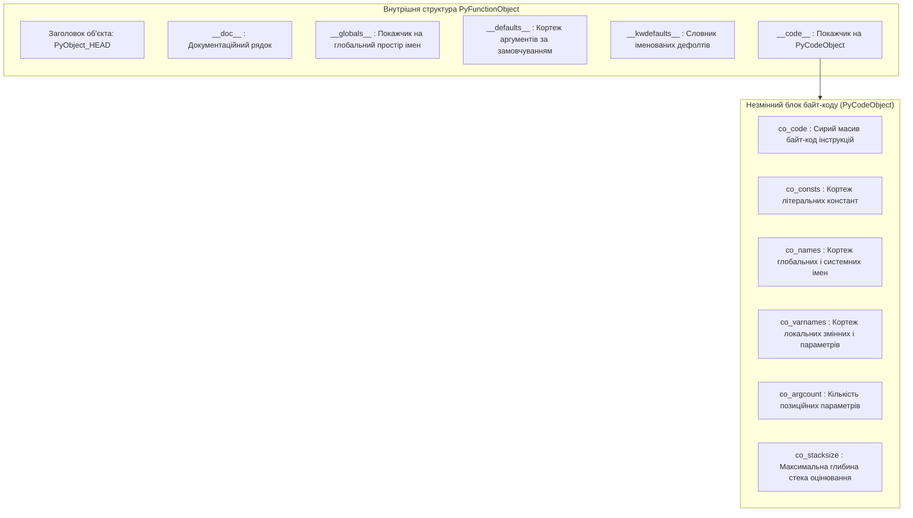
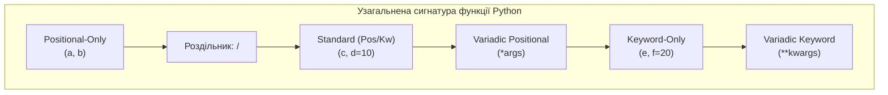
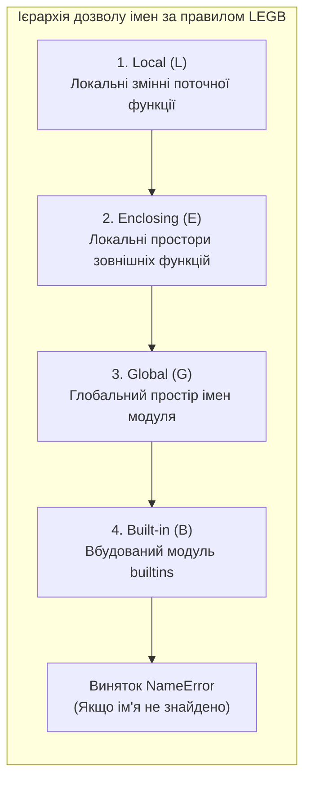

# ЗМІСТОВИЙ МОДУЛЬ 2. ТЕМА 6. ФУНКЦІОНАЛЬНА ОРГАНІЗАЦІЯ ПРОГРАМНОГО КОДУ

---

## 6.1. Оголошення функцій (def), формальні та фактичні параметри, оператор return, об'єктна природа функцій (First-class citizens)

### Основний зміст та теоретичний базис

Функціональна декомпозиція виступає базовим методологічним інструментом інженерії програмного забезпечення, що забезпечує структурування складних обчислювальних процесів на автономні, логічно завершені підпрограми. У контексті архітектури комп'ютерних систем функція є іменованим блоком інструкцій, який ізолює локальну обчислювальну логіку, реалізує повторне використання коду та мінімізує дублювання алгоритмічних конструкцій. У мові програмування Python концепція підпрограм повністю уніфікована: на відміну від таких мов, як Pascal, де існує суворе розмежування на процедури (підпрограми без повернення значення) та функції, у Python будь-яка процедурна одиниця є функцією.

Створення функції здійснюється за допомогою зарезервованого ключового слова `def`, за яким слідує ідентифікатор функції, список формальних параметрів у круглих дужках та символ двокрапки. Інструкція `def` є не просто статичною декларацією, а повноцінним виконуваним оператором. Коли потік керування досягає інструкції `def`, інтерпретатор CPython динамічно створює в оперативній пам'яті новий об'єкт функції типу `PyFunctionObject` і зв'язує його з відповідним ідентифікатором у поточному просторі імен.


*Рисунок 1 — Структурна організація об'єкта функції та зв'язаного об'єкта байт-коду в архітектурі CPython*

Проаналізуємо схему, наведену на рисунку. Об'єкт функції `PyFunctionObject` слугує динамічною обгорткою над статичним, незмінним блоком скомпільованого байт-коду `PyCodeObject`. Поле `__globals__` фіксує контекст глобального простору імен модуля, у якому функція була визначена, що є фундаментом для реалізації лексичних замикань. Поле `__code__` містить точні інструкції віртуальної машини, перелік локальних змінних `co_varnames` та необхідний розмір стека обчислень `co_stacksize`.

Передача даних у функцію базується на зіставленні формальних та фактичних параметрів. **Формальні параметри** — це змінні, задекларовані в заголовку визначення функції, які визначають інтерфейс очікуваних вхідних даних. **Фактичні параметри** (або аргументи) — це конкретні значення та об'єкти, які передаються у функцію в момент її виклику. 

Механізм передачі параметрів у Python строго класифікується як **передача через присвоєння об'єктного посилання** (*pass-by-object-reference* або *call-by-sharing*). Всередині функції створюються локальні імена, які зв'язуються з тими самими фізичними об'єктами в купі, що й аргументи у точці виклику:
* Якщо у функцію передається незмінний об'єкт (`int`, `float`, `str`, `tuple`), будь-яка спроба його модифікації всередині тіла функції призводить до створення нового локального об'єкта, залишаючи початковий об'єкт у викликаючому коді без змін.
* Якщо у функцію передається змінний об'єкт (`list`, `dict`, `set`), виклик його внутрішніх методів мутації (наприклад, `list.append()`) змінює безпосередньо стан вихідного об'єкта в пам'яті, що породжує зовнішній побічний ефект (*side-effect*).

Завершення виконання функції та повернення обчисленого результату викликаючому коду здійснюється за допомогою оператора `return`. Оператор `return` негайно зупиняє виконання поточної функції, звільняє локальний стековий кадр `PyFrameObject` і передає вказаний об'єкт у точку виклику. Якщо функція не містить оператора `return` або оператор викликається без аргументів, інтерпретатор неявно повертає значення глобального об'єкта-сінглтона `None`. 

У разі необхідності повернення декількох значень, вони перераховуються через кому, що автоматично ініціює упаковку значень у єдиний незмінний кортеж: вираз `return x, y, z` еквівалентний поверненню `return (x, y, z)`.

В інженерній практиці розробки надійного програмного забезпечення критично важливим є поняття **чистої функції** (*pure function*). Чиста функція задовольняє двом суворим математичним критеріям: детермінізму результату та повній відсутності побічних ефектів. 

Математично властивість детермінізму описується тим, що для одного й того самого набору вхідних аргументів $X = (x_1, x_2, \dots, x_n)$ функція завжди генерує тотожне значення результату $Y$:

$$\forall X_1, X_2 \in D : (X_1 = X_2) \implies (f(X_1) = f(X_2))$$

де $D$ — область визначення функції. Відсутність побічних ефектів означає, що виконання функції не змінює стан глобальних змінних, не модифікує передані змінні структури даних, не здійснює операцій введення-виведення та не залежить від змінного стану оточення (наприклад, системного часу або генератора псевдовипадкових чисел). 

У мові Python функції є **об'єктами першого класу** (*First-Class Citizens*). Це означає, що функція має абсолютно рівні права з іншими об'єктами мови: вона може бути присвоєна змінній, передана як аргумент в іншу функцію, повернута з функції як результат обчислення та збережена у структурах даних (списках, кортежах, словниках).

*Таблиця 6.1 — Системні атрибути об'єкта функції в середовищі CPython*

| Атрибут | Тип об'єкта | Опис призначення та роль у runtime |
| :--- | :--- | :--- |
| **`__name__`** | `str` | Рядковий ідентифікатор імені функції, заданий при оголошенні |
| **`__code__`** | `code` | Скомпільований об'єкт байт-коду, що виконується віртуальною машиною |
| **`__defaults__`** | `tuple` / `None` | Кортеж позиційних значень аргументів за замовчуванням |
| **`__kwdefaults__`** | `dict` / `None` | Словник значень за замовчуванням для keyword-only параметрів |
| **`__annotations__`** | `dict` | Словник статичних анотацій типів параметрів та значення, що повертається |
| **`__closure__`** | `tuple` / `None` | Кортеж комірок (`cell objects`), що зберігають зв'язані нелокальні змінні |

Наведена таблиця демонструє високий рівень інтроспекції функцій у Python: розробник може програмно аналізувати сигнатуру, дефолтні значення та скомпільований байт-код функції безпосередньо під час виконання програми.

---

## 6.2. Розширена система аргументів: позиційні та ключові аргументи, значення за замовчуванням (дефолтні змінні та пастка mutable default), пакування/розпакування *args, **kwargs, positional-only (/) та keyword-only (*) параметри

### Основний зміст та теоретичний базис

Мова Python реалізує гнучку систему зв'язування параметрів, яка дозволяє будувати інтерфейси функцій з високим ступенем адаптивності до вхідних даних. Зв'язування аргументів при виклику функції може здійснюватися за їхнім порядковим номером (**позиційні аргументи**, *positional arguments*) або за ідентифікатором формального параметра (**іменовані аргументи**, *keyword arguments*). Позиційні аргументи зіставляються з параметрами зліва направо, тоді як іменовані аргументи передаються у форматі `name=value`, що дозволяє ігнорувати їхню послідовність у точці виклику.

Параметри функцій можуть мати **значення за замовчуванням** (*default parameter values*), які присвоюються за допомогою синтаксичної конструкції `param=default_value`. Якщо під час виклику функції аргумент для такого параметра не передано, використовується заздалегідь визначене значення. 

Фундаментальною архітектурною особливістю CPython є те, що вирази значень за замовчуванням обчислюються рівно один раз — у момент інтерпретації інструкції `def` (під час завантаження модуля), а не при кожному виклику функції. Обчислені об'єкти дефолтних параметрів зберігаються у незмінному кортежі в атрибуті функції `__defaults__`.

Ця особливість породжує класичну інженерну пастку, відому як **пастка змінного значення за замовчуванням** (*mutable default argument trap*). Якщо як значення за замовчуванням вказати змінний об'єкт (наприклад, порожній список `def append_data(item, target_list=[]):`), то всі наступні виклики функції без явного передавання другого аргументу працюватимуть з одним і тим самим фізичним екземпляром списку в пам'яті. 

Модифікація `target_list.append(item)` призводить до накопичення стану між незалежними викликами:

```python
# Некоректне проектування: спільний стан у пам'яті
def collect_telemetry_bad(val, buffer=[]):
    buffer.append(val)
    return buffer

# Коректний інженерний патерн: динамічна ініціалізація
def collect_telemetry_good(val, buffer=None):
    if buffer is None:
        buffer = []
    buffer.append(val)
    return buffer
```

Для створення функцій із невизначеною заздалегідь кількістю параметрів мова надає механізм **варіативного пакування аргументів**:
* Оператор одиночної зірочки `*args` перехоплює довільну кількість позиційних аргументів, що перевищують кількість явно задекларованих параметрів, і упаковує їх у незмінний кортеж `tuple`.
* Оператор подвійної зірочки `**kwargs` перехоплює всі нерозпізнані іменовані аргументи та упаковує їх в асоціативний масив `dict`.

Зворотна операція — **розпакування аргументів** (*argument unpacking*) — дозволяє передавати елементи колекцій у функцію, підставляючи окремі елементи списку або кортежу як позиційні аргументи (`func(*list_data)`), а пари словника — як іменовані параметри (`func(**dict_params)`).

Сучасні стандарти Python (PEP 3102 та PEP 570) впровадили спеціальні синтаксичні роздільники для суворого контролю способу передачі кожного параметра:
* Символ прямого слешу `/` визначає межу **виключно позиційних параметрів** (*positional-only parameters*). Усі параметри, розташовані ліворуч від слешу, можуть бути передані виключно за позицією; спроба передати їх за ім'ям викликає виняток `TypeError`.
* Символ зірочки `*` визначає межу **виключно іменованих параметрів** (*keyword-only parameters*). Усі параметри, розташовані праворуч від зірочки, обов'язково вимагають явного зазначення імені при виклику.


*Рисунок 2 — Повна узагальнена схема структури параметрів функції згідно зі стандартами PEP 570 та PEP 3102*

Проаналізуємо структуру повної сигнатури функції, зображеної на схемі:

$$\text{def } \text{func}(p_1, p_2, /, p_3, p_4 = v_1, *args, p_5, p_6 = v_2, **kwargs):$$

де $p_1, p_2$ — позиційно-залежні параметри; $p_3, p_4$ — стандартні параметри (дозволяють як позиційну, так і іменовану передачу); $args$ — кортеж залишку позиційних аргументів; $p_5, p_6$ — обов'язкові та необов'язкові іменовані параметри; $kwargs$ — словник залишку іменованих аргументів. 

Використання `/` гарантує стабільність публічного API низькорівневих системних модулів, дозволяючи розробникам змінювати внутрішні назви аргументів у наступних версіях без ризику зламати клієнтський код.

*Таблиця 6.2 — Класифікація та правила зв'язування типів параметрів у Python*

| Тип параметра | Синтаксичний запис | Допустимий спосіб виклику | Результуючий тип у тілі функції |
| :--- | :--- | :--- | :--- |
| **Positional-Only** | `a, b, /` | Тільки позиційно (`func(1, 2)`) | Об'єкт відповідного типу |
| **Standard** | `c, d=0` | Позиційно або за ім'ям (`func(3, d=4)`) | Об'єкт відповідного типу |
| **Variadic Positional** | `*args` | Довільна кількість позиційних значень | `tuple` |
| **Keyword-Only** | `*, key1, key2=0` | Тільки за іменем (`func(key1=5)`) | Об'єкт відповідного типу |
| **Variadic Keyword** | `**kwargs` | Довільна кількість пар `name=value` | `dict` |

Систематизація правил зв'язування параметрів показує, що правильне комбінування типів аргументів забезпечує проектування API-інтерфейсів, стійких до некоректного використання.

---

## 6.3. Області видимості змінних (правило LEGB: Local, Enclosing, Global, Built-in), оператори global та nonlocal. Анонімні функції lambda, функції вищого порядку (map, filter). Основи рекурсії

### Основний зміст та теоретичний базис

Область видимості (*scope*) визначає межі доступності ідентифікаторів змінних та функцій у різних частинах програми. У мові Python вирішення імен спирається на концепцію просторів імен (*namespaces*), які реалізовані у вигляді стандартних словників `dict`. 

Пошук об'єкта, асоційованого з ідентифікатором, здійснюється строго за ієрархічним **правилом LEGB**:

$$\text{Scope Search Order}: \quad \text{Local (L)} \longrightarrow \text{Enclosing (E)} \longrightarrow \text{Global (G)} \longrightarrow \text{Built-in (B)}$$

1. **Local (L):** Локальний простір імен функції, що містить імена параметрів та змінні, яким присвоєно значення всередині поточного тіла функції.
2. **Enclosing (E):** Простори імен зовнішніх (охоплюючих) функцій у разі використання вкладених функціональних конструкцій (статична лексична область видимості).
3. **Global (G):** Глобальний простір імен поточного модуля, що містить змінні рівня файлу (`globals()`).
4. **Built-in (B):** Простір імен вбудованих функцій, констант та винятків мови Python, що інкапсульований у модулі `builtins`.

Якщо ідентифікатор не знайдено на жодному з чотирьох рівнів ієрархії, віртуальна машина збуджує виняток `NameError`.


*Рисунок 3 — Послідовність пошуку ідентифікаторів у просторах імен Python відповідно до правила LEGB*

За замовчуванням будь-яке присвоєння значення змінній усередині функції (`x = 10`) автоматично реєструє це ім'я в локальному просторі імен `Local`, навіть якщо в глобальному просторі існує однойменна змінна. Якщо спробувати зчитати значення змінної до її локального присвоєння, інтерпретатор не звернеться до глобальної змінної, а згенерує виняток `UnboundLocalError`. 

Для явної зміни поведінки пошуку та модифікації змінних застосовуються два спеціальні оператори:
* Оператор `global var_name` вказує компілятору, що всі операції читання та запису для змінної `var_name` повинні адресуватися безпосередньо у глобальний простір імен модуля.
* Оператор `nonlocal var_name` (впроваджений у PEP 3104) інструктує інтерпретатор шукати змінну в найближчому зовнішньому просторі імен `Enclosing` серед охоплюючих функцій, виключаючи глобальний простір `Global`.

Оператор `nonlocal` є фундаментальним для проектування **лексичних замикань** (*closures*). Замикання — це функція, яка зберігає зв'язок зі змінними зі свого лексичного контексту створення навіть після того, як зовнішня функція завершила своє виконання і її стековий кадр було вилучено з пам'яті. Збережені змінні розміщуються у спеціальних об'єктах комірок (*cell objects*), доступних через атрибут `__closure__`.

Для створення однорядкових безіменних підпрограм Python підтримує **анонімні функції** (**lambda-вирази**). Синтаксис lambda-виразу має вигляд:

$$\lambda(x_1, x_2, \dots, x_n) = \text{expression}$$

```python
lambda arg1, arg2, ..., argN: expression
```

Lambda-вирази можуть містити виключно один обчислювальний вираз, результат якого автоматично повертається без використання оператора `return`. В інженерних задачах lambda-функції найчастіше використовуються як параметри для **функцій вищого порядку** (*Higher-Order Functions*), які приймають інші функції як аргументи:
* Функція `map(func, iterable)` застосовує відображення `func` до кожного елемента вхідного потоку, генеруючи лінивий ітератор результатів з часовою складністю $O(N)$ та просторовою складністю $O(1)$.
* Функція `filter(func, iterable)` фільтрує послідовність, залишаючи лише ті елементи, для яких предикат `func` повертає істинне значення.

**Рекурсія** у програмуванні є методом організації обчислень, за якого функція викликає саму себе безпосередньо або опосередковано. Будь-який коректний рекурсивний алгоритм повинен базуватися на принципі математичної індукції та містити два обов'язкові компоненти:
1. **Базовий випадок (термінальна умова):** тривіальний стан обчислення, за якого результат повертається безпосередньо без здійснення подальших рекурсивних викликів.
2. **Рекурсивний крок:** декомпозиція задачі з модифікацією аргументів у напрямку наближення до базового випадку.

При кожному рекурсивному виклику віртуальна машина PVM створює новий стековий кадр `PyFrameObject`, виділяючи пам'ять під копію локальних змінних. Глибина рекурсії $D$ визначає накладні витрати пам'яті $O(D)$. 

Для запобігання переповненню системного стека інтерпретатор CPython встановлює фіксований ліміт глибини рекурсії (за замовчуванням 1000 викликів), при перевищенні якого генерується виняток `RecursionError`. Оскільки CPython не реалізує автоматичної оптимізації хвостової рекурсії (*Tail Call Optimization*, TCO), глибокі рекурсивні алгоритми в інженерних задачах вимагають заміни на ітеративні еквіваленти або використання явних стеків.

*Таблиця 6.3 — Порівняльний аналіз парадигм ітеративної та функціональної обробки даних у Python*

| Парадигма / Інструмент | Синтаксична форма | Просторова складність | Швидкодія в CPython | Рекомендована сфера застосування |
| :--- | :--- | :---: | :---: | :--- |
| **Імперативний цикл `for`** | `for x in data: ...` | $O(1)$ | Базова | Складні алгоритми з розгалуженим станом |
| **List Comprehension** | `[f(x) for x in data if p(x)]` | $O(N)$ | Висока (C-опкод `LIST_APPEND`) | Пакетне створення нових масивів у пам'яті |
| **Лінивий ітератор `map`/`filter`**| `map(f, filter(p, data))` | $O(1)$ | Висока (без проміжних виділень) | Потокова конвеєрна обробка великих даних |
| **Пряма рекурсія** | `def f(n): return f(n-1)` | $O(D)$ | Низька (оверхед стекових кадрів) | Обхід деревоподібних і графових структур |

Аналіз підтверджує, що для потокових обчислень у комп'ютерній інженерії найвищу ресурсну ефективність демонструють генератори та ліниві функції вищого порядку, тоді як рекурсія є виправданою виключно для ієрархічних структур даних.

---

### Питання для самоперевірки та аналітичного осмислення

1. Яким чином у CPython влаштована модель передачі параметрів *pass-by-object-reference*? Чому модифікація списку всередині функції змінює вихідний об'єкт, а модифікація цілого числа — ні?
2. Розкрийте причину виникнення помилки «спільного стану» при використанні змінних об'єктів як значень за замовчуванням у функціях (`mutable default argument trap`). У який момент життєвого циклу програми виділяється пам'ять під атрибут `__defaults__`?
3. Поясніть призначення та інженерну доцільність роздільників `/` (positional-only) та `*` (keyword-only) у сигнатурі функції. Як вони захищають публічний API програмних бібліотек від змін?
4. Опишіть послідовність пошуку ідентифікатора за правилом LEGB. За яких умов інтерпретатор генерує виняток `UnboundLocalError` при роботі з однойменними локальними та глобальними змінними?
5. У чому полягає відмінність між операторами `global` та `nonlocal`? Яку роль відіграє `nonlocal` у реалізації лексичних замикань (*closures*)?
6. Сформулюйте математичні та системні критерії чистої функції (*pure function*). Чому проектування чистих функцій є критично важливим для надійності та тестування системного програмного забезпечення?
7. Чому інтерпретатор CPython обмежує максимальну глибину рекурсії? Які апаратні та системні ризики виникають у разі відсутності оптимізації хвостової рекурсії (TCO) при обробці великих обсягів даних?