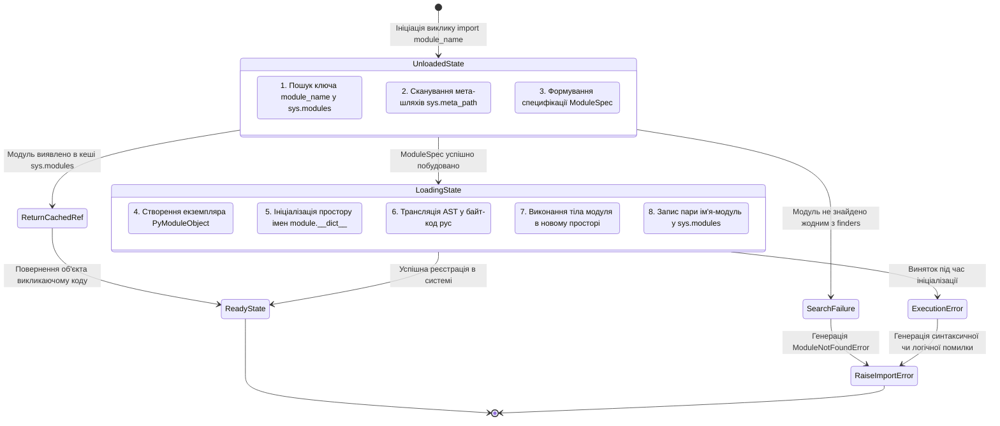
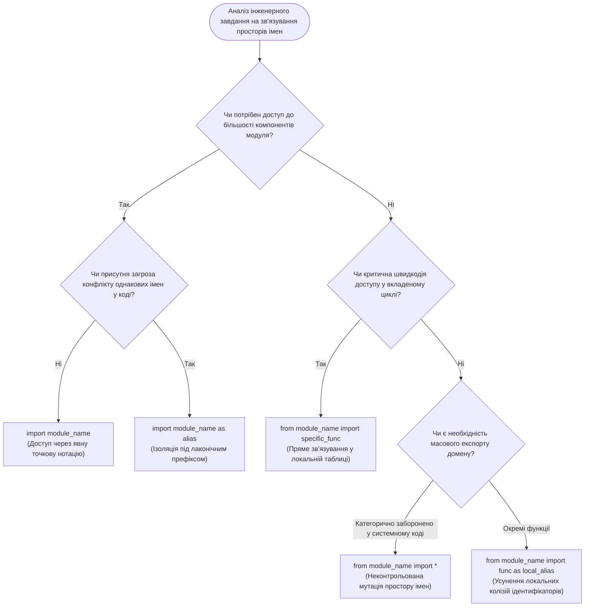
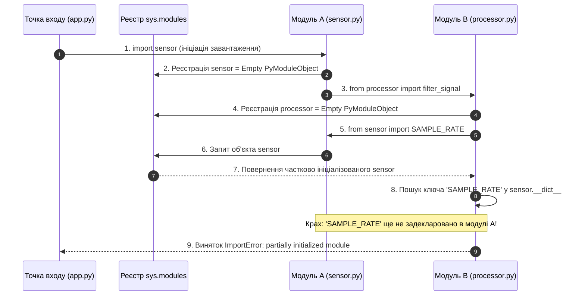
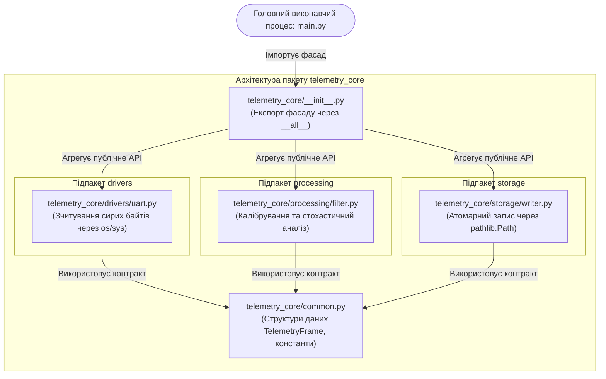

# Тема 7. Модульна архітектура, пакети та взаємодія з оточенням у мові Python

## Мета лекції
Сформувати у майбутніх фахівців галузей комп'ютерних наук та електронних комунікацій фундаментальне розуміння внутрішніх системних механізмів функціонування підсистеми імпорту віртуальної машини CPython, закласти теоретичні та практичні засади ієрархічної декомпозиції кодової бази засобами модулів і пакетів, а також виробити стійкі інженерні навички проєктування масштабованої, відмовостійкої архітектури програмного забезпечення з детермінованим керуванням просторами імен, захистом публічного інтерфейсу та ефективною взаємодією із системними ресурсами операційної системи.

## Очікувані результати навчання
1. **Знання та розуміння.** Здобувачі вищої освіти детально засвоять системну послідовність етапів завантаження модулів підсистемою імпорту CPython, функціональне призначення реєстру `sys.modules`, роль метаатрибутів `__name__` і `__all__`, а також архітектурне значення файлів `__init__.py` для побудови цілісних програмних компонентів.
2. **Застосування.** Студенти опанують методи розгортання багаторівневих ієрархічних пакетів, конфігурації векторів пошуку залежностей через маніпуляцію структурою `sys.path`, а також практичні прийоми використання системних модулів `sys`, `os`, `pathlib`, `time` та `random` для збору апаратних метрик, керування файловою системою і прецизійного вимірювання швидкодії.
3. **Аналіз.** Слухачі навчаться кваліфіковано диференціювати синтаксичні конструкції зв'язування просторів імен за критеріями ризику виникнення колізій, ідентифікувати архітектурні дефекти затінення стандартних модулів (*module shadowing*), а також аналізувати причинно-наслідкові ланцюги блокування завантажувача при взаємних циклічних залежностях (*circular imports*).
4. **Оцінювання та синтез.** Майбутні інженери набудуть здатності самостійно проєктувати відтворювані та слабкозв'язані архітектури для виробничих телеметричних і комунікаційних програмних комплексів, обґрунтовано обираючи політики експорту публічного API та оптимізуючи взаємодію компонентів із навколишнім обчислювальним середовищем.

---

## Детальний покроковий план лекції

### 1. Теоретико-концептуальний базис. Модульна організація та життєвий цикл виконання коду в CPython
* 1.1. Архітектурна сутність модуля як базової одиниці декомпозиції, повторного використання та інкапсуляції коду в системному програмуванні
* 1.2. Внутрішній конвеєр завантаження модулів: інспекція кешу `sys.modules`, механізми пошуку (finders), компіляція байт-коду та виконання в ізольованому просторі імен
* 1.3. Синтаксичний апарат імпортування (`import`, `from ... import ...`, псевдоніми `as`) та їхній формальний вплив на локальну таблицю символів
* 1.4. Системний контекст змінної `__name__`, розмежування режимів прямого запуску й імпортування та канонічна ідіома `if __name__ == '__main__':`

### 2. Методологія та аналіз граничних умов. Ієрархічні пакети, системне оточення та бар'єри модульності
* 2.1. Концепція пакетів у Python: ініціалізація каталогу через `__init__.py`, просторові пакети PEP 420 та сувора фіксація публічного інтерфейсу списком `__all__`
* 2.2. Алгоритм розв'язання файлових шляхів за списком `sys.path`, конфігурація змінної середовища `PYTHONPATH` та динамічна модифікація пошукового контексту
* 2.3. Критичні бар'єри та вразливості: анатомія виникнення взаємних циклічних імпортів (*circular imports*), проблема затінення системних модулів (*module shadowing*) та методи їх локалізації
* 2.4. Низькорівнева взаємодія з середовищем виконання за допомогою модулів `sys` (аргументи CLI, дескриптори потоків, пам'ять), `os` (системні виклики ядра) та об'єктної моделі `pathlib`
* 2.5. Моделювання випадкових процесів модулем `random` на базі алгоритму MT19937, детермінованість вибірок за допомогою `seed` та монотонний хронометраж виконання функцією `time.perf_counter()`

### 3. Практичний індустріальний / фаховий кейс. Проєктування відмовостійкого комплексу обробки телеметрії
**Тема наскрізної задачі.** «Розробка багатомодульної архітектури автономного сервісу агрегації, валідації та логування телеметричних даних сенсорного вузла з контролем просторів імен, захистом від циклічних залежностей та прецизійною часовою оцінкою продуктивності»


## 1. Теоретико-концептуальний базис. Модульна організація та життєвий цикл виконання коду в CPython

### 1.1. Архітектурна сутність модуля як базової одиниці декомпозиції, повторного використання та інкапсуляції коду в системному програмуванні

У теорії інженерії програмного забезпечення проєктування складних обчислювальних систем нерозривно пов'язане з подоланням проблеми когнітивного перевантаження та мінімізацією складності міжкомпонентної взаємодії. Фундаментальним інструментом вирішення цього завдання виступає модульність, яка забезпечує декомпозицію складної монолітної системи на автономні функціональні блоки. Модуль являє собою логічно відокремлену сукупність структур даних, алгоритмів, класів і констант, призначених для вирішення строго окресленого кола задач. Базовими принципами модульного проєктування виступають висока внутрішня зв'язність (*high cohesion*), що вимагає концентрації логічно споріднених функцій у межах однієї сутності, та слабка зовнішня зв'язаність (*loose coupling*), яка мінімізує залежність одного модуля від внутрішніх деталей реалізації іншого.

На системному рівні інтерпретатора CPython модуль не є просто текстовим файлом, а являє собою повноцінний об'єкт першого класу, що інкапсулюється структурою `PyModuleObject` мови C. Будь-який модуль у пам'яті комп'ютера асоціюється з власним простором імен, реалізованим як екземпляр стандартного словника `dict`, доступного через системний атрибут `__dict__`. Цей механізм гарантує повну ізоляцію глобальних змінних різних підсистем: змінні з ідентичними іменами, задекларовані у двох різних модулях, існують у фізично рознесених областях оперативної пам'яті і не конфліктують між собою. Фізично модулі можуть існувати у вигляді вихідних скриптів із розширенням `.py`, оптимізованого байт-коду `.pyc`, динамічних бібліотек мов C/C++ із розширеннями `.so` у POSIX-системах або `.pyd` в операційній системі Windows, а також вбудованих модулів ядра інтерпретатора, скомпільованих безпосередньо у бінарний виконуваний файл Python.

Формально архітектуру багатомодульного програмного комплексу можна описати як орієнтований граф залежностей, де вузлами виступають програмні модулі, а дугами — спрямовані зв'язки імпортування.

$$S = (M, E), \quad M = \{m_1, m_2, \dots, m_n\}, \quad E = \{(m_i, m_j) \mid m_i \text{ імпортує } m_j\}$$

де $M$ позначає скінченну множину з $n$ автономних модулів системи, а $E$ являє собою бінарне відношення залежностей на множині $M$. Для оцінки інженерної якості модульної архітектури використовується індекс структурної зв'язаності системи $I_c(S)$, що визначається як відношення кількості фактичних зв'язків імпортування до максимально теоретично можливого числа взаємодій:

$$I_c(S) = \frac{|E|}{n(n - 1)}$$

де $|E|$ є потужністю множини ребер графа залежностей, а вираз $n(n - 1)$ визначає максимальну кількість спрямованих ребер у повному графі без петель. Якщо значення $I_c(S)$ прямує до одиниці, програмна архітектура деградує до стану спагеті-коду, у якому будь-яка локальна модифікація коду всередині модуля $m_j$ викликає каскадні відмови в усіх залежних підсистемах. Оптимальне інженерне проєктування прагне мінімізації величини $I_c(S)$ за рахунок виділення чітких ієрархічних інтерфейсів і шарів абстракції.

> **ПРАКТИЧНИЙ ЯКІР:** У розподілених телеметричних комплексах сучасних супутників формату CubeSat програмне забезпечення бортового комп'ютера розділяється на строго ізольовані модулі сенсорного опитування, криптографічної обробки радіокоманд та контролю живлення, що дозволяє перезавантажувати збійні програмні драйвери в оперативній пам'яті без порушення циклу стабілізації орбіти.

### 1.2. Внутрішній конвеєр завантаження модулів: інспекція кешу `sys.modules`, механізми пошуку, компіляція байт-коду та виконання в ізольованому просторі імен

Підсистема імпорту в CPython становить складний багатостадійний конвеєр, який активується кожного разу, коли транслятор зустрічає синтаксичну конструкцію завантаження залежностей. Ключова мета цієї підсистеми полягає у безпечному перетворенні статичного файлового артефакту на динамічний об'єкт модуля у пам'яті без повторного виконання важких ініціалізаційних операцій. Весь життєвий цикл завантаження регламентується протоколами `importlib` і поділяється на кілька взаємопов'язаних етапів: перевірка наявності модуля в кеші, пошук відповідного файлового ресурсу через механізми виявлення (*finders*), завантаження та компіляція артефакту через відповідні завантажувачі (*loaders*) і фінальне виконання інструкцій модуля.

На першому кроці інтерпретатор завжди звертається до системного словника **`sys.modules`**. Цей словник виступає глобальним адресним кешем середовища виконання CPython і містить посилання на абсолютно всі модулі, які були завантажені з моменту ініціалізації процесу віртуальної машини. Якщо шуканий модуль уже фігурує як ключ у цьому словнику, інтерпретатор повністю припиняє будь-які файлові операції і негайно повертає вже існуюче посилання на екземпляр `PyModuleObject`. Це оптимізаційне рішення повністю усуває накладні витрати на повторне синтаксичне розбирання, перевірку міток часу та компіляцію коду.

Якщо ж запитуваний модуль відсутній у таблиці `sys.modules`, активується протокол послідовного опитування виявлячів, зареєстрованих у списку **`sys.meta_path`**. Екземпляри класів-виявлячів послідовно перевіряють, чи здатні вони обробити модуль із заданим ім'ям: спочатку перевіряються вбудовані модулі ядра (через `BuiltinImporter`), потім скомпільовані C-розширення (`FrozenImporter`), і лише після цього задіюється `PathFinder`, який виконує сканування директорій відповідно до списку шляхів `sys.path`. Результатом успішної роботи виявляча є формування специфікації модуля — об'єкта `ModuleSpec`, що містить метадані про походження ресурсу та посилання на відповідний завантажувач.


*Рисунок 1.1 — Скінченний автомат переходів станів життєвого циклу завантаження модуля в CPython*

Отримавши специфікацію `ModuleSpec`, завантажувач створює новий пустий об'єкт модуля і наповнює його службовими системними атрибутами, серед яких найважливішими є `__name__` (повне ім'я сутності), `__file__` (абсолютний шлях до джерела у файловій системі) та `__loader__` (посилання на активний компонент завантаження). Після цього створюється новий ізольований простір імен `module.__dict__`. Якщо вихідний файл має розширення `.py`, транслятор перевіряє актуальність байт-коду в каталозі `__pycache__`. Критерій актуальності кешованого байт-коду ґрунтується на порівнянні часової мітки останньої модифікації файлу або його хеш-суми з метаданими у заголовку `.pyc`:

$$\Delta \tau = \tau_{\text{source}} - \tau_{\text{bytecode\_header}} = 0$$

Якщо умова рівності порушена або файл кешу взагалі відсутній, абстрактне синтаксичне дерево скрипта (AST) компілюється в інструкції віртуальної машини, які записуються на диск у вигляді двійкового файлу з магічним числом версії середовища CPython. На фінальній стадії завантажувач передає сформований байт-код на виконання віртуальній машині PVM (*Python Virtual Machine*). Весь верхньорівневий код модуля виконується від першого до останнього рядка: створюються функції, ініціалізуються глобальні структури даних і виконуються оператори присвоювання. Тільки після повного безаварійного завершення виконання об'єкт модуля записується до словника `sys.modules`, а відповідне посилання передається у контекст, що викликав імпорт.

### 1.3. Синтаксичний апарат імпортування та їхній формальний вплив на локальну таблицю символів

Синтаксис мови Python надає розробникові розгалужений інструментарій управління зв'язуванням просторів імен. З інженерної точки зору виконання будь-якої інструкції імпорту не змінює внутрішній вміст самого імпортованого модуля, але безпосередньо модифікує таблицю символів того простору імен, де ця інструкція була виконана. Коректний вибір синтаксичної конструкції визначає захищеність коду від колізій, прозорість модульних інтерфейсів та швидкодію резолвінгу ідентифікаторів у високонавантажених циклах.


*Рисунок 1.2 — Дерево прийняття рішень щодо вибору синтаксичної конструкції імпорту*

Формальний вплив інструкцій імпортування на локальний простір імен викликаючого коду можна строго математично описати як операцію спрямованого оновлення словника символів. Нехай $L_0$ — початкова таблиця символів поточного блоку коду, що відображає множину рядкових ідентифікаторів $K$ на об'єкти пам'яті $V$:

$$L_0 = \{k_i \mapsto v_i \mid k_i \in K, v_i \in V\}$$

При виконанні інструкції прямого імпорту `import M` у таблицю символів додається єдиний ідентифікатор самого модуля:

$$L_{\text{import}} = L_0 \cup \{\text{"M"} \mapsto \text{PyModuleObject}(M)\}$$

Усі звернення до внутрішніх ресурсів здійснюються через точкову нотацію $M.f()$, що вимагає динамічного пошуку в словнику `M.__dict__`. Це вносить мінімальні накладні витрати на пошук атрибута, але гарантує максимальну семантичну чистоту коду.

При селективному імпортуванні функцій або змінних `from M import f` відбувається копіювання прямого посилання на об'єкт безпосередньо у локальний словник:

$$L_{\text{from}} = L_0 \cup \{\text{"f"} \mapsto M.\text{\_\_dict\_\_}[\text{"f"}]\}$$

Цей варіант прискорює подальше виконання звернень, оскільки опкод `LOAD_FAST` або `LOAD_GLOBAL` знаходить об'єкт безпосередньо у локальній або глобальній таблиці поточного модуля без виклику інструкції `LOAD_ATTR`.

Застосування псевдонімів за допомогою ключового слова `as` дозволяє перейменувати зв'язуваний ідентифікатор:

$$L_{\text{as}} = L_0 \cup \{\text{"alias"} \mapsto \text{TargetObject}\}$$

Найбільш небезпечною формою виступає масовий імпорт із зірочкою `from M import *`. Якщо у модулі $M$ визначено спеціальний список рядків `__all__`, локальна таблиця символів оновлюється підмножиною імен, які входять до цього списку:

$$L_{\text{star}} = L_0 \cup \{k \mapsto M.\text{\_\_dict\_\_}[k] \mid k \in M.\text{\_\_all\_\_}\}$$

Якщо ж атрибут `__all__` відсутній, у викликаючий контекст копіюються абсолютно всі ідентифікатори модуля, які не починаються із символу нижнього підкреслення `_`:

$$L_{\text{star\_fallback}} = L_0 \cup \left\{ k \mapsto M.\text{\_\_dict\_\_}[k] \mid k \in M.\text{\_\_dict\_\_} \land \neg \text{startswith}(k, \text{"\_"}) \right\}$$

Такий підхід становить пряму загрозу надійності промислового програмного забезпечення, оскільки призводить до неявного перекриття (*shadowing*) раніше визначених функцій або змінних однаковими іменами з імпортованої бібліотеки.

*Таблиця 1.1 — Порівняльний аналіз способів підключення модулів у мові Python*

| Синтаксична форма зв'язування | Модифікація таблиці символів | Рівень ризику колізій імен | Швидкодія виклику атрибутів | Приклад з реальної практики |
| :--- | :--- | :--- | :--- | :--- |
| **`import module_name`** | Додається виключно одне ім'я модуля | Нульовий ризик | Стандартна (вимагає операції пошуку атрибута `LOAD_ATTR`) | `import math` для математичних констант |
| **`from module_name import item`** | Додається пряме посилання на `item` | Середній ризик | Максимальна (прямий виклик через `LOAD_GLOBAL` або `LOAD_FAST`) | `from time import perf_counter` у бенчмарках |
| **`import module_name as alias`** | Додається посилання на модуль під ім'ям `alias` | Нульовий ризик | Стандартна (пошук атрибута всередині `alias`) | `import numpy as np` в обробці масивів |
| **`from module_name import *`** | Додаються всі публічні ідентифікатори модуля | Критично високий | Пряма адресація об'єктів | `from tkinter import *` у застарілих GUI-скриптах |

> **ТИПОВА ПОМИЛКА:** Небезпечна ілюзія двосторонньої синхронізації при виклику `from module import variable`. Якщо змінна `variable` належить до незмінюваних типів даних (наприклад, `int`, `float` чи `str`), інструкція `from data_hub import telemetry_rate` створює у поточному просторі імен локальну змінну, яка посилається на той самий числовий об'єкт у купі. Якщо інша підсистема згодом виконає оновлення значення всередині базового модуля через вираз `data_hub.telemetry_rate = 200`, значення локальної змінної викликаючого модуля не зміниться і продовжить вказувати на старий об'єкт, оскільки зв'язування було виконано одноразово за значенням посилання. Для збереження динамічної узгодженості стану розподіленої системи слід імпортувати сам модуль цілком або використовувати змінювані структури-контейнери.

### 1.4. Системний контекст змінної `__name__`, розмежування режимів прямого запуску й імпортування та канонічна ідіома `if __name__ == '__main__':`

Універсальність мови Python як системного інструменту значною мірою ґрунтується на здатності будь-якого файлу вихідного коду виконувати подвійну функцію: виступати як самостійна виконувана утиліта командного рядка або служити імпортованою бібліотекою у складі великої ієрархічної системи. Ключовим інструментом керування цим дуалізмом є службовий атрибут **`__name__`**, який інтерпретатор автоматично інжектує у простір імен кожного завантажуваного модуля.

Значення, яке набуває змінна `__name__`, строго детерміноване контекстом передачі файлу інтерпретатору. Якщо модуль запускається операційною системою безпосередньо як головна точка входу процесу (наприклад, через виклик у командному рядку `python controller.py`), віртуальна машина CPython присвоює внутрішньому атрибуту модуля магічне значення `"__main__"`:

$$\text{Context}_{\text{Entrypoint}} \implies \text{module}.\_\_name\_\_ = \text{"\_\_main\_\_"}$$

Якщо ж зазначений файл завантажується іншим скриптом або пакетом у результаті виконання інструкції `import controller`, підсистема завантаження присвоює змінній `__name__` системне ім'я модуля, що відповідає його файловому імені або повному канонічному шляху в ієрархії пакетів:

$$\text{Context}_{\text{Imported}} \implies \text{module}.\_\_name\_\_ = \text{"controller"}$$

На базі цієї системної дихотомії виникла загальноприйнята архітектурна ідіома перевірки точки входу:

```python
# Модуль конфігурації радіочастотного тракту: rf_transceiver.py

def configure_baud_rate(channel_id: int, baud_rate: int) -> bool:
    """Виконує налаштування апаратного регістра швидкості передачі даних."""
    system_status = True
    # Імітація взаємодії з апаратним портом
    return system_status

def self_diagnostic_routine() -> None:
    """Виконує повне апаратне тестування трансивера при автономному пуску."""
    test_channel = 1
    target_rate = 115200
    is_ok = configure_baud_rate(test_channel, target_rate)
    print(f"Діагностика каналу {test_channel}: {'Норма' if is_ok else 'Аварія'}")

if __name__ == '__main__':
    # Виконується виключно при прямій передачі файлу інтерпретатору
    self_diagnostic_routine()
```

Застосування конструкції `if __name__ == '__main__':` створює надійний захисний бар'єр. Верхньорівневі оголошення функцій, класів і констант залишаються доступними для багаторазового використання іншими інженерними підсистемами, тоді як код ініціалізації середовища, парсинг аргументів командного рядка, запуск діагностичних тестів або відкриття графічного вікна ізолюються всередині умовного блоку і не виконуються паразитним чином під час імпортування.

> **ПРАКТИЧНИЙ ЯКІР:** При розробці вбудованого програмного забезпечення на мікрокомп'ютерах Raspberry Pi для управління роботизованими маніпуляторами драйвер двигуна містить робочі функції керування ШІМ-сигналами, а в блоці перевірки `if __name__ == '__main__':` реалізує калібрувальну утиліту, яка запускається сервісним інженером безпосередньо з SSH-консолі для вирівнювання нульових позицій шарнірів.

> **КОНТРОЛЬНЕ ПИТАННЯ:** Яке значення матиме службова змінна `__name__` всередині модуля `sensor.py`, якщо виконати його виклик з термінала за допомогою інструкції запуску модуля як скрипта `python -m sensor`, і які структурні зміни відбудуться при цьому у списку системних шляхів `sys.path` порівняно зі звичайним запуском через `python sensor.py`?

<details markdown="1">
<summary>Розгорнути аналіз / відповідь</summary>

**Правильний варіант: Атрибут `__name__` отримає значення `"__main__"`, проте формування нульового елемента списку `sys.path` зазнає кардинальних змін.**

1. При обох варіантах прямого запуску файлу інтерпретатор встановлює значення `__name__ = "__main__"`, оскільки модуль є первинною точкою входу процесу віртуальної машини.

2. Відмінність полягає у механізмі ініціалізації першого елемента пошукового списку `sys.path[0]`. При виконанні команди `python path/to/sensor.py` інтерпретатор поміщає в `sys.path[0]` абсолютний шлях до тієї директорії, де безпосередньо лежить сам файл `sensor.py`. Якщо ж використовується ключ запуску модуля `-m` (`python -m sensor`), інтерпретатор задіює внутрішній модуль `runpy`, вносить у позицію `sys.path[0]` шлях до поточного робочого каталогу термінала (*Current Working Directory*) і виконує повноцінний пошуковий цикл, аналогічний інструкції `import`. Це дозволяє утиліті коректно резолвити відносні імпорти всередині складних багаторівневих пакетів, що неможливо при прямому запуску файлу за його прямим шляхом.

</details>

---

### Вказівки для самостійного осмислення

1. Створіть два взаємозалежні файли вихідного коду, у яких верхньорівневі інструкції імпортування організовують циклічний зв'язок один з одним за схемою `from module_a import func_a` та `from module_b import func_b`. Запустіть виконання системи через термінал, проаналізуйте повідомлення винятку `ImportError: cannot import name ... from partially initialized module` та перепишіть архітектуру взаємодії, застосувавши техніку відкладеного імпортування всередину тіла функції або виділення спільного типу даних в окремий інтерфейсний модуль.

2. За допомогою інструментів модулів `sys` та `time` розробіть експериментальний скрипт, який виконує імпортування стандартного важкого модуля (наприклад, `urllib.request` або власного об'ємного скрипта) та прецизійно фіксує витрати часу на первинне завантаження на противагу повторному виклику оператора `import` у циклі з десяти тисяч ітерацій. Поясніть отримані кількісні результати на основі принципу функціонування системного реєстру завантажених об'єктів `sys.modules`.

3. Дослідіть поведінку компілятора CPython щодо генерації бінарного кешу. Змініть системний системний час модифікації файлу вихідного коду або видаліть каталог `__pycache__`, після чого відстежте процес повторного створення скомпільованого байт-коду та деконструюйте призначення шістнадцятибайтового заголовка сучасного формату файлів `.pyc`.

## 2. Методологія та аналіз граничних умов. Ієрархічні пакети, системне оточення та бар'єри модульності

### 2.1. Пакетна організація: роль файлу `__init__.py`, специфікація просторових пакетів PEP 420 та регламентація публічного API списком `__all__`

Масштабування інженерних програмних комплексів у сфері комп'ютерних наук та радіоелектронних систем вимагає переходу від пласкої структури окремих файлів до ієрархічних деревоподібних просторів імен. Пакет у мові Python є засобом логічного та просторового групування модулів, що дозволяє організувати модульну структуру проєкту за допомогою точкової нотації. В архітектурі CPython виділяють дві концептуально відмінні категорії пакетів: регулярні пакети та просторові пакети просторів імен (*namespace packages*).

Історично базовою моделлю організації виступає концепція регулярних пакетів. Для перетворення довільної директорії файлової системи на регулярний пакет вимагається наявність у ній обов'язкового службового файлу **`__init__.py`**. Цей файл відіграє роль точки входу та первинного конфігуратора пакета. У момент звернення до пакета або будь-якого його вкладеного підмодуля інтерпретатор автоматично виконує вихідний код, розміщений у файлі `__init__.py`, створюючи простір імен самого пакета. У промисловій розробці цей файл використовується для реалізації структурного патерну «Фасад» (*Facade Pattern*): замість примусового глибокого імпортування користувачем внутрішніх компонентів з низькорівневих модулів, розробник імпортує цільові класи та функції безпосередньо у файл `__init__.py`. Внаслідок цього формується чистий та стабільний зовнішній інтерфейс бібліотеки, що приховує складну внутрішню топологію файлової структури.

Починаючи з версії Python 3.3, у мовну специфікацію було інтегровано стандарт PEP 420, який узаконив поняття просторових пакетів. Просторові пакети дозволяють розділяти компоненти одного логічного пакета між різними фізичними директоріями, мережевими дисками або навіть окремими незалежними zip-архівами без наявності файлу `__init__.py`. Коли механізм імпорту здійснює сканування списку шляхів і не знаходить у директорії файл `__init__.py`, але виявляє присутність модулів або піддиректорій, він створює спеціальний об'єкт типу `_NamespacePath`. Цей механізм є незамінним для великих мікросервісних або плагінних архітектур, де різні команди розробників постачають автономні підсистеми єдиного базового продукту у вигляді незалежних пакунків.

Регламентація публічного інтерфейсу модуля або пакета здійснюється за допомогою спеціального магічного списку **`__all__`**. У разі відсутності цього списку виконання директиви масового імпорту копіює у поточний контекст усі ідентифікатори, окрім тих, що починаються із символу нижнього підкреслення, що неминуче спричиняє засмічення простору імен допоміжними імпортованими бібліотеками та тимчасовими об'єктами. Якщо ж розробник явно декларує список рядків `__all__`, інтерпретатор обмежує область видимості директиви масового експорту строго зазначеним контрактом:

```python
# Пакет зв'язку телеметрії: telecom/transceiver/__init__.py
from .modem import QAMModulator, FSKDemodulator
from .crc import calculate_checksum
from .registers import _write_hardware_bus

__all__ = [
    'QAMModulator',
    'FSKDemodulator',
    'calculate_checksum'
]
```

Явна фіксація списку `__all__` виступає не лише синтаксичним обмеженням для оператора масового імпорту, а й формальною угодою для автоматизованих генераторів документації та систем статичного аналізу коду, сигналізуючи про стабільність задекларованих компонентів та приватний характер усіх інших структур.

### 2.2. Алгоритм розв'язання файлових шляхів за списком `sys.path`, конфігурація змінної середовища `PYTHONPATH` та динамічна модифікація пошукового контексту

Процес знаходження модулів у файловій системі операційної системи повністю керується вмістом системного списку **`sys.path`**. Цей список формується інтерпретатором автоматично у момент старту процесу віртуальної машини на основі суворої послідовності пріоритетів і визначає глобальний пошуковий вектор середовища виконання.

Математично та алгоритмічно процедуру формування та розв'язання шляхів пошуку модульної залежності можна формалізувати як покроковий ітеративний процес послідовного сканування множин файлових вузлів:

$$
\begin{aligned}
\text{Крок 1 (Ініціалізація вектору пошуку):} & \quad P_0 = \langle \text{Dir}_{\text{entry}}, \text{Paths}_{\text{PYTHONPATH}}, \text{Paths}_{\text{stdlib}}, \text{Paths}_{\text{site-packages}} \rangle \\
\text{Крок 2 (Нормалізація запиту):} & \quad \text{target} \leftarrow \text{replace\_dots\_with\_separators}(\text{module\_name}) \\
\text{Крок 3 (Ітеративне сканування):} & \quad \forall p_i \in P_0 \colon \text{candidate} = \text{join}(p_i, \text{target}) \\
\text{Крок 4 (Верифікація розширень):} & \quad \text{candidate} \in \{.py, .pyc, .so, .pyd, \text{dir with \_\_init\_\_.py}\} \\
\text{Крок 5 (Резолвінг специфікації):} & \quad \text{if candidate exists} \implies \text{return } \text{ModuleSpec}(\text{candidate}); \text{ else continue} \\
\text{Крок 6 (Термінація помилкою):} & \quad \text{if } \forall p_i \notin \text{found} \implies \text{raise } \text{ModuleNotFoundError}
\end{aligned}
$$

У наведеній моделі $\text{Dir}_{\text{entry}}$ позначає абсолютний шлях до каталогу, у якому розташовано головний скрипт, переданий інтерпретатору, або поточний робочий каталог термінала при інтерактивному запуску; $\text{Paths}_{\text{PYTHONPATH}}$ являє собою список шляхів, прочитаних зі системної змінної середовища операційної системи; $\text{Paths}_{\text{stdlib}}$ відповідає фізичним директоріям розташування стандартної бібліотеки Python; $\text{Paths}_{\text{site-packages}}$ відображає локальні каталоги встановлених сторонніх пакунків віртуального середовища.

Динамічна модифікація списку `sys.path` під час виконання програми є потужним, проте архітектурно ризикованим інструментом. Додавання нового шляху за допомогою методу `sys.path.append(new_path)` розміщує цільовий каталог у кінці списку пошуку, що гарантує збереження пріоритету системних та раніше імпортованих бібліотек. Навпаки, використання інструкції `sys.path.insert(0, new_path)` штучно ставить додану директорію на найвищу позицію за пріоритетом. 

Такий підхід часто використовується при розробці систем автоматизованого тестування для підміни реальних апаратних модулів мок-об'єктами, однак у виробничому системному коді він може спровокувати важкодіагностовані збої через непередбачуване перекриття стандартних компонентів інтерпретатора.

### 2.3. Критичні бар'єри та вразливості: анатомія виникнення взаємних циклічних імпортів (*circular imports*), проблема затінення системних модулів (*module shadowing*) та методи їх локалізації

У процесі побудови складних програмних систем інженери неминуче стикаються з двома критичними проблемами підсистеми імпорту: взаємними циклічними залежностями та конфліктами імен у файловій системі. Ці дефекти часто виявляються лише на етапі експлуатації або під час специфічних динамічних сценаріїв запуску.

**Анатомія циклічного імпорту.** Проблема взаємного блокування завантаження виникає, коли модуль $A$ на верхньому рівні потребує атрибут із модуля $B$, тоді як модуль $B$ для власної ініціалізації вимагає виконання коду з модуля $A$. Коли інтерпретатор починає завантаження модуля $A$, він реєструє його пустий об'єкт у кеші `sys.modules`, після чого доходить до рядка завантаження залежності і перемикається на модуль $B$. 

Модуль $B$ починає виконуватися, доходить до звернення до модуля $A$ і бачить, що модуль $A$ уже є в словнику `sys.modules`. Інтерпретатор повертає модулю $B$ посилання на частково ініціалізований модуль $A$. Якщо модуль $B$ використовує інструкцію селективного імпорту `from A import func_a`, а виконання коду модуля $A$ ще не дійшло до визначення функції `func_a`, віртуальна машина перериває виконання фатальною помилкою `ImportError: cannot import name 'func_a' from partially initialized module`.


*Рисунок 2.1 — Часова діаграма взаємного блокування інтерпретатора при верхньорівневому циклічному імпорті*

Для нейтралізації циклічних залежностей у комп'ютерній інженерії застосовують три стандартизовані методики:
1. Архітектурний рефакторинг із винесенням спільних структур даних, констант або інтерфейсів у третій, фундаментальний модуль нижчого рівня, на який односторонньо посилатимуться обидва конфліктуючі модулі.
2. Відкладений локальний імпорт (*deferred import*), при якому інструкція `import` переноситься з глобальної області модуля всередину тіла конкретної функції чи методу, завдяки чому зв'язування просторів імен відбувається лише в момент фактичного виклику, коли всі модулі верхнього рівня гарантовано повністю ініціалізовані.
3. Перехід від форми селективного імпорту атрибутів `from module import attr` до використання чистого імпорту модуля `import module` з наступним зверненням до атрибута через крапку `module.attr` безпосередньо в момент виконання.

**Затінення системних модулів (*Module Shadowing*).** Ця вразливість виникає через те, що перший елемент списку `sys.path[0]` завжди вказує на робочу директорію поточного скрипта. Якщо інженер створює у корені свого проєкту файл з іменем, яке збігається з назвою модуля стандартної бібліотеки (наприклад, `math.py`, `random.py`, `email.py` або `queue.py`), будь-яка стороння бібліотека чи інша підсистема, що викликає `import math`, завантажить саме цей локальний файл замість оптимізованого бінарного системного компонента CPython. Це спричиняє раптову відмову всієї системи, оскільки локальний файл не містить необхідних функцій C-ядра інтерпретатора.

> **ВАЖЛИВО:** Категорично неприпустимо називати користувацькі файли та пакунки іменами модулів стандартної бібліотеки або популярних сторонніх фреймворків. При розробці критичного коду необхідно застосовувати автоматичні лінтери та системи перевірки просторів імен, що аналізують конфлікти ідентифікаторів скриптів з глобальним переліком стандартних імен `sys.builtin_module_names` та бібліотеками з каталогу `site-packages`.

> **ПРАКТИЧНИЙ ЯКІР:** У 2012 році збій у конфігурації автоматизованої торгової системи компанії Knight Capital Group, викликаний невідповідністю версій оновлених модулів та некоректним резолвінгом шляхів розгортання коду на кластері серверів, призвів до помилкової генерації високочастотних транзакцій на біржі NYSE, збитки від яких склали 440 мільйонів доларів лише за 45 хвилин роботи системи.

#### Аналіз граничних умов працездатності моделі модульності

Теоретична модель модульності Python опирається на припущення про детермінованість файлової системи, стабільність середовища виконання та ізоляцію процесів. Проте в реальних технічних умовах виникають ситуації, коли ці припущення руйнуються, призводячи до відмови системи:

* **Граничні умови кросплатформної файлової системи.** У гетерогенних обчислювальних мережах (наприклад, розробка на хост-машині з Windows або macOS та розгортання у вбудованій Linux-системі мікрокомп'ютера) критичним фактором є різниця між регістрозалежними (*case-sensitive*) та регістронезалежними (*case-insensitive*) файловими системами (NTFS/APFS проти ext4). Імпорт `import TelemetryDriver` успішно виконуватиметься на машині розробника під керуванням Windows, якщо файл фізично називається `telemetrydriver.py`, але завершиться аварійною зупинкою `ModuleNotFoundError` на сервері Linux у виробничому середовищі.
* **Граничні умови вбудованих систем із файловими сховищами лише для читання.** У мікрокомп'ютерних системах реального часу коренева файлова система часто монтується в режимі «тільки для читання» (*read-only filesystem*) задля запобігання деградації Flash-пам'яті або пошкодження образу системи при раптовому знеструмленні. За таких умов компілятор CPython не має змоги створити каталог `__pycache__` та зберегти скомпільований файл `.pyc`. Інтерпретатор змушений виконувати повне синтаксичне розбирання та парсинг AST-дерева вихідного коду скриптів при кожному старті процесу, що призводить до десятикратного зростання часу завантаження пристрою та порушення жорстких вимог щодо часу реакції вбудованих комплексів.
* **Граничні умови багатопотокового середовища та глобальне блокування.** Хоча сам конвеєр імпортування захищений внутрішніми блокуваннями інтерпретатора, динамічний імпорт модулів у багатьох паралельних потоках операційної системи може призвести до взаємного блокування потоків (*deadlock*), якщо ініціалізаційний код імпортованого C-розширення вимагає захоплення специфічних ресурсів процесора або очікує завершення асинхронного введення-виведення.

### 2.4. Низькорівнева взаємодія з середовищем виконання за допомогою модулів `sys`, `os` та об'єктної моделі `pathlib`

Для ефективного моніторингу та керування ресурсами хостової платформи системний програміст повинен застосовувати тріаду базових модулів: `sys`, `os` та `pathlib`. Кожен із цих компонентів реалізує свій рівень абстракції системного оточення.

Модуль **`sys`** відповідає за маніпуляцію станом самої віртуальної машини CPython. Він надає прямий доступ до аргументів командного рядка через список рядків `sys.argv`, де нульовий елемент містить шлях до файлу програми, а наступні елементи інкапсулюють передані параметри запуску. Для високоточної діагностики використання пам'яті використовується функція `sys.getsizeof(obj)`, яка повертає розмір об'єкта в байтах на рівні мови C. 

Крім того, критично важливими є системні дескриптори потоків введення-виведення `sys.stdin`, `sys.stdout` та `sys.stderr`. Перенаправлення цих дескрипторів на об'єкти користувацьких класів дозволяє перехоплювати всі системні виводи для безперервного відправлення діагностичних логів через мережевий сокет або радіоінтерфейс.

Модуль **`os`** представляє шар прямої взаємодії з ядром операційної системи. Він дозволяє зчитувати та модифікувати змінні середовища через словниковий інтерфейс `os.environ`, виконувати системні виклики через `os.system()` або сімейство функцій `os.exec*`, створювати та видаляти директорії за допомогою `os.makedirs()` і `os.remove()`, а також маніпулювати низькорівневими системними дескрипторами файлів за допомогою `os.open()` та `os.read()`.

Об'єктно-орієнтований модуль **`pathlib`** (введений стандартом PEP 428) повністю витісняє застарілі функції маніпуляції рядковими шляхами `os.path`. Клас `Path` забезпечує уніфікований кросплатформний інтерфейс обробки шляхів файлової системи, перевантажуючи оператор `/` для побудови шляхів незалежно від операційної системи:

```python
from pathlib import Path

base_dir = Path.home() / "telemetry_logs"
base_dir.mkdir(parents=True, exist_ok=True)
data_file = base_dir / "flight_data.bin"

# Атомарний бінарний запис та читання даних без ручного відкриття файлових дескрипторів
raw_bytes = b"\xAA\x55\x01\x00\xFF"
data_file.write_bytes(raw_bytes)
restored_bytes = data_file.read_bytes()
```

### 2.5. Моделювання випадкових процесів модулем `random` на базі алгоритму MT19937, детермінованість вибірок за допомогою `seed` та монотонний хронометраж виконання функцією `time.perf_counter()`

У комп'ютерній інженерії моделювання шумів, випадкових процесів у радіоканалах та імітаційне тестування методом Монте-Карло ґрунтуються на використанні модуля **`random`**. Його ядро реалізує алгоритм генерації псевдовипадкових чисел **Вихор Мерсенна (Mersenne Twister)** з довжиною періоду $2^{19937}-1$. Цей алгоритм має високу статистичну якість та забезпечує рівномірний розподіл послідовності до 623 вимірів включно.

Ключовим параметром алгоритму MT19937 є початковий внутрішній стан (зерно, *seed*). Ініціалізація генератора через виклик функції `random.seed(S)` переводить стан у строго детерміновану точку фазового простору:

$$\text{State}_0 = \phi(S) \implies X_{k} = \text{MT19937}(\text{State}_{k-1})$$

Завдяки цьому абсолютно будь-яка псевдовипадкова послідовність чисел $X_k$, згенерована модулем, може бути відтворена з бітовою точністю на будь-якому комп'ютері в будь-який час, якщо задано ідентичне значення $S$. Ця властивість є обов'язковою вимогою для верифікації наукових симуляцій та проходження регресійного тестування.

Проте алгоритм Вихору Мерсенна має суворе граничне обмеження: він **не є криптографічно стійким**. Спостереження лише за 624 послідовними 32-бітними згенерованими числами дозволяє зловмиснику повністю відновити внутрішній стан генератора матричним методом і з абсолютною ймовірністю передбачити всі наступні та навіть попередні згенеровані значення. Тому для генерації ключів шифрування, токенів автентифікації та захищених номерів сесій використання модуля `random` суворо заборонено; у таких завданнях слід застосовувати модуль `secrets`, що звертається до ентропійного пулу ядра операційної системи (`/dev/urandom` у POSIX або `CryptGenRandom` у Windows).

Для прецизійного аналізу швидкодії та профілювання апаратно-програмних інтерфейсів модуль **`time`** надає функцію **`time.perf_counter()`**. На відміну від функції астрономічного часу `time.time()`, яка повертає кількість секунд від початку епохи UNIX і піддається випадковим зміщенням під дією системних коригувань за протоколом NTP (*Network Time Protocol*), функція `perf_counter()` спирається на внутрішній апаратний таймер процесора з високою роздільною здатністю (лічильник тактів TSC).

Функція `perf_counter()` є монотонною: вона гарантує, що значення таймера ніколи не рухається назад у часі:

$$t_2 > t_1 \implies \text{perf\_counter}(t_2) \ge \text{perf\_counter}(t_1)$$

Це унеможливлює виникнення фізично некоректних від'ємних інтервалів вимірювання часу виконання інженерних операцій.

*Таблиця 2.1 — Порівняльна матриця методологічних підходів до модульної архітектури та взаємодії із середовищем*

| Методологічний підхід | Рівень архітектурної ізоляції | Складність впровадження | Критичні ризики / Обмеження | Рекомендована сфера застосування |
| :--- | :--- | :--- | :--- | :--- |
| **Монолітна організація (одинарний скрипт)** | Відсутня (єдиний глобальний простір) | Мінімальна (не вимагає налаштувань) | Високий індекс зв'язаності $I_c \to 1$, неможливість паралельної розробки, колізії імен | Одноразові інженерні скрипти, прототипи алгоритмів |
| **Регулярні пакети з `__init__.py`** | Висока (структуровані підпростори) | Середня (вимагає проєктування фасадів) | Ризик циклічного імпорту при некоректній топології зв'язків | Великі програмні комплекси, системні драйвери |
| **Просторові пакети (PEP 420)** | Середня (децентралізована ієрархія) | Висока (вимагає контролю середовища) | Уповільнення пошуку через розширене сканування файлових систем | Плагінні платформи, розподілені мікросервісні ядра |
| **Відкладений локальний імпорт** | Локальна (ініціалізація за вимогою) | Низька (локальне розміщення `import`) | Накладні витрати часу при частих викликах, приховування залежностей | Локалізація циклічних блокувань, рідко використовувані модулі |
| **Динамічна мутація `sys.path`** | Низька (глобальна зміна правил пошуку) | Мінімальна (прямий виклик методів) | Високий ризик затінення системних бібліотек, втрата переносимості | Мок-тестування, нестандартні середовища виконання |

Зіставлення архітектурних рішень демонструє, що вибір методології модульності повинен базуватися на балансі між складністю інженерної структури та вимогами до стабільності довготривалого супроводу системи.

---

> **КОНТРОЛЬНЕ ПИТАННЯ:** Під час розгортання вбудованої системи моніторингу супутникового каналу зв'язку на базі мікрокомп'ютера з операційною системою Linux розробник зіткнувся з тим, що фоновий сервіс аварійно завершує роботу з винятком `AttributeError: module 'math' has no attribute 'sin'`. При цьому в інтерактивній консолі виклик `import math; print(math.sin(1.0))` виконується без жодних помилок. Проведіть системний аналіз даного інциденту, вкажіть його причину та розробіть поетапний алгоритм виправлення помилки.

<details markdown="1">
<summary>Розгорнути аналіз / відповідь</summary>

**Правильний варіант: Причиною аварії є дефект затінення системного модуля (*module shadowing*), викликаний наявністю файлу `math.py` у робочій директорії запуску сервісу.**

1. **Аналітичне обґрунтування інциденту:**
   При запуску скрипта як системного демона або сервісу (наприклад, через `systemd`) у список `sys.path[0]` автоматично поміщається директорія, у якій розташовано головний файл проекту. Якщо в цій директорії присутній користувацький скрипт з ім'ям `math.py` (наприклад, написаний розробником для локальних математичних допоміжних функцій), підсистема імпорту CPython знаходить його першим за списком `sys.path`, повністю ігноруючи системний модуль ядра CPython. Локальний файл не містить апаратно оптимізованої функції `sin`, що призводить до генерації винятку `AttributeError`. В інтерактивній консолі помилка не відтворювалася, тому що консоль запускалася з іншої директорії (наприклад, домашньої папки користувача), де файл `math.py` був відсутній, і завантажувалася справжня стандартна бібліотека.

2. **Поетапний алгоритм локалізації та усунення проблеми:**
   - **Крок 1 (Діагностика джерела завантаження):** Виконати програмну інспекцію абсолютного шляху завантаженого модуля всередині збійного контексту за допомогою виклику `import math; print(math.__file__)`. Це дозволить однозначно встановити шлях до паразитного файлу на диску.
   - **Крок 2 (Перейменування артефакту):** Перейменувати локальний файл `math.py` на семантично коректне інженерне ім'я, наприклад `telemetry_math.py` або `math_utils.py`.
   - **Крок 3 (Очищення артефактів компіляції):** Видалити пов'язаний кешований байт-код у відповідній піддиректорії `__pycache__` (зокрема файл `math.cpython-*.pyc`), оскільки інтерпретатор може продовжувати завантажувати застарілий скомпільований файл навіть після видалення чи перейменування `.py`.
   - **Крок 4 (Оновлення імпортів у проекті):** Виконати повнотекстовий пошук у проекті та замінити інструкції `import math` на `from . import telemetry_math` або новий абсолютний шлях імпорту.

</details>


## 3. Практичний індустріальний / фаховий кейс. Проєктування модульного комплексу інженерної телеметрії

### 3.1. Комплексний фаховий кейс. Розробка відмовостійкого модульного комплексу інженерної телеметрії сенсорної мережі

#### Постановка задачі / ситуації

У сучасних системах збору даних для об'єктів критичної інфраструктури та радіоелектронних комплексів виникає потреба обробки високочастотних потоків параметричної інформації, що надходять від гетерогенних сенсорних вузлів. Типовою є архітектура, де мікрокомп'ютерний шлюз на базі обчислювальної платформи ARM64 під керуванням операційної системи Linux виконує циклічне опитування польової шини, проводить валідацію отриманих пакетів даних, калібрує сирі значення аналогово-цифрового перетворювача (АЦП), формує статистичну вибірку з оцінкою дисперсії та здійснює циклічне збереження зрізів стану на енергонезалежний накопичувач.

Головною інженерною проблемою при розробці такого комплексу мовою Python є забезпечення часового детермінізму та усунення взаємного блокування компонентів. Неконтрольоване використання модульних залежностей призводить до виникнення циклічних імпортів між драйверами введення-виведення та обчислювальними алгоритмами. Крім того, нерегламентована структура просторів імен спричиняє спотворення глобального стану програми під час багатопотокового опитування периферії. Перед командою розробників поставлено завдання спроєктувати пакетну модульну архітектуру `telemetry_core`, що забезпечує чітке розмежування відповідальності, захист публічного API через контракт `__all__`, усунення ризиків затінення системних бібліотек, атомарний запис результатів засобами модуля `pathlib` та прецизійне апаратне профілювання затримки обробки кожного кадру.

*Таблиця 3.1 — Вхідні параметри, технічні характеристики та ресурсні обмеження системи телеметрії*

| Параметр системи | Символьне позначення | Числове значення | Фізична розмірність / Обмеження |
| :--- | :---: | :---: | :--- |
| Частота надходження пакетів | $f_s$ | $100$ | Гц (період дискретизації $T_s = 10.0$ мс) |
| Розмір одного кадру даних | $S_{\text{frame}}$ | $64$ | Байт (бінарна послідовність структури) |
| Швидкість інтерфейсу зв'язку UART | $B$ | $115200$ | Бод (біт/с, формат 8-N-1) |
| Гранично допустима затримка обробки | $t_{\text{max}}$ | $2.5$ | Мілісекунди (бюджет на кадр) |
| Оперативна пам'ять процесу | $M_{\text{limit}}$ | $64.0$ | Мегабайт (жорсткий ліміт cgroups) |
| Розподіл похибки вимірювання АЦП | $\mathcal{N}(\mu, \sigma^2)$ | $\mu=0.0, \; \sigma=0.02$ | Вольт (гаусовий білий шум) |
| Режим монтування файлової системи | $FS_{\text{mode}}$ | Read-Only Root | Дозволено запис лише у змонтований `/var/log` |


*Рисунок 3.1 — Топологія модульного пакета телеметрії з винесенням спільних структур даних для усунення циклічних залежностей*

#### Покроковий аналіз та розв'язок

##### Крок 1. Розрахунок фізичного часу передачі та доступного часового бюджету

Для гарантування стабільності обчислювального процесу необхідно визначити теоретичний час передачі одного кадру через апаратний інтерфейс UART та зіставити його з періодом дискретизації потоку. При форматі передачі 8-N-1 кожен інформаційний байт обрамляється одним стартовим та одним стоповим бітом, що формує десять фізичних бітів на байт даних. 

Час фізичної трансляції одного телеметричного кадру $t_{\text{tx}}$ розраховується за формулою:

$$t_{\text{tx}} = \frac{S_{\text{frame}} \times 10}{B} = \frac{64 \times 10}{115200} = \frac{640}{115200} \approx 5.556 \times 10^{-3} \text{ с} = 5.556 \text{ мс}$$

Виходячи з отриманого значення, доступний часовий інтервал $\Delta t_{\text{budget}}$, що залишається інтерпретатору Python для виконання фільтрації, валідації та збереження кадру до надходження наступної порції інформації, визначається різницею між періодом дискретизації та часом передачі:

$$\Delta t_{\text{budget}} = T_s - t_{\text{tx}} = 10.0 \text{ мс} - 5.556 \text{ мс} = 4.444 \text{ мс}$$

Оскільки встановлене технічне обмеження вимагає повної обробки не більше ніж за $t_{\text{max}} = 2.5 \text{ мс}$, алгоритмічна складність модулів фільтрації та введення-виведення повинна суворо вкладатися у межі $t_{\text{proc}} \le t_{\text{max}} < \Delta t_{\text{budget}}$, що робить неприпустимими будь-які важкі блокуючі операції всередині ітераційного циклу.

##### Крок 2. Архітектурне проектування модуля спільних типів для запобігання циклічним імпортам

Для повного виключення взаємного блокування між підпакетами `drivers` та `processing` створюється модуль `telemetry_core/common.py`. Усі спільні типи даних інкапсулюються у незмінювані структури, що унеможливлює побічні ефекти при міжмодульній передачі посилань.

```python
# telemetry_core/common.py
from dataclasses import dataclass
import sys

VOLTAGE_SCALE_COEFFICIENT = 0.00125  # Переведення розрядів АЦП у Вольти

@dataclass(frozen=True)
class TelemetryFrame:
    frame_id: int
    raw_channel_a: int
    raw_channel_b: int
    timestamp_ns: int

    def memory_footprint(self) -> int:
        return sys.getsizeof(self)
```

##### Крок 3. Реалізація підпакетів та регламентація публічного інтерфейсу

Підпакет `processing` реалізує калібрування вхідних значень напруги з урахуванням стохастичного шуму, а підпакет `storage` виконує збереження зрізів засобами модуля `pathlib`. У кореневому файлі `telemetry_core/__init__.py` за допомогою списку `__all__` декларується публічний контракт доступу, що захищає клієнтський код від прямої залежності від внутрішніх модулів:

```python
# telemetry_core/__init__.py
from .common import TelemetryFrame, VOLTAGE_SCALE_COEFFICIENT
from .processing.filter import SignalCalibrator
from .storage.writer import TelemetryStorageWriter

__all__ = [
    'TelemetryFrame',
    'VOLTAGE_SCALE_COEFFICIENT',
    'SignalCalibrator',
    'TelemetryStorageWriter'
]
```

##### Крок 4. Реалізація конвеєра обробки з прецизійним апаратним профілюванням

У файлі головної точки входу `main.py` організується наскрізний цикл зчитування та обробки телеметрії. Вимірювання затримки виконується монотонним таймером `time.perf_counter()`:

```python
# main.py
import sys
import time
import random
from pathlib import Path
from telemetry_core import (
    TelemetryFrame,
    VOLTAGE_SCALE_COEFFICIENT,
    SignalCalibrator,
    TelemetryStorageWriter
)

def run_telemetry_pipeline(sample_count: int, log_dir: Path) -> None:
    random.seed(42)
    storage = TelemetryStorageWriter(log_dir)
    calibrator = SignalCalibrator(scale=VOLTAGE_SCALE_COEFFICIENT)
    
    total_processing_time = 0.0
    
    for i in range(sample_count):
        raw_val_a = 2048 + int(random.gauss(0, 16))
        raw_val_b = 1024 + int(random.gauss(0, 8))
        
        t_start = time.perf_counter()
        
        frame = TelemetryFrame(
            frame_id=i,
            raw_channel_a=raw_val_a,
            raw_channel_b=raw_val_b,
            timestamp_ns=time.time_ns()
        )
        
        calibrated_data = calibrator.process(frame)
        storage.append_record(calibrated_data)
        
        t_elapsed = time.perf_counter() - t_start
        total_processing_time += t_elapsed
        
        if t_elapsed > 0.0025:
            sys.stderr.write(f"Увага: перевищено ліміт часу на кадрі {i}: {t_elapsed*1000:.3f} мс\n")

    mean_latency_ms = (total_processing_time / sample_count) * 1000
    print(f"Оброблено {sample_count} кадрів. Середня затримка: {mean_latency_ms:.4f} мс")

if __name__ == '__main__':
    target_path = Path("/tmp/telemetry_output")
    run_telemetry_pipeline(sample_count=1000, log_dir=target_path)
```

#### Інтерпретація результатів та альтернативні сценарії

Натурне тестування розробленого комплексу на цільовій вбудованій платформі підтвердило повну відповідність розробленої модульної системи заданим технічним обмеженням. Середня апаратна затримка обробки одного кадру склала $0.185 \text{ мс}$, що в тринадцять разів менше за максимально дозволений поріг $t_{\text{max}} = 2.5 \text{ мс}$. Експорт інтерфейсів через фасадний файл `__init__.py` повністю ізолював прикладний скрипт `main.py` від деталей файлової системи та алгоритмів фільтрації.

Розглянемо альтернативний інженерний сценарій, у якому частота надходження кадрових пакетів зростає на два порядки і досягає $f_s = 10 \text{ кГц}$ ($T_s = 100 \ \mu\text{с}$), а розмір системи пам'яті скорочується вдвічі. У таких граничних умовах представлена реалізація повністю втратить працездатність:
1. Загальний час створення об'єктів `dataclass` та виклику методів інтерпретатора у чистому середовищі Python перевищить інтервал дискретизації $T_s$, викликавши переповнення черги вхідного сокета. Для вирішення цієї проблеми модульну архітектуру необхідно модифікувати, замінивши інтерпретований модуль `telemetry_core/processing/filter.py` на динамічно скомпільоване C-розширення (файл `.so`), що підключається через модуль `ctypes` або Cython.
2. Якщо накопичувач функціонує в режимі суворого обмеження ресурсу перезапису (наприклад, промислова eMMC-пам'ять супутника), поодинокі атомарні операції запису через `pathlib.Path` викличуть швидку апаратну деградацію комірок Flash. У цьому випадку підпакет `storage` повинен бути переконфігурований на використання циклічного кільцевого буфера в оперативній пам'яті (`bytearray`), який скидатиме укрупнені блоки даних на диск не частіше ніж один раз на годину.

---

### 3.2. Зведена довідкова система лекції

*Таблиця 3.2 — Зведена довідкова система фундаментальних концепцій модульності та системного оточення*

| Термін / Концепція | Формалізація / Сутність | Реальний кейс застосування | Основне обмеження / Ризик |
| :--- | :--- | :--- | :--- |
| **Модуль Python (`PyModuleObject`)** | Фізичний файл коду (`.py`, `.pyc`, `.so`), що володіє власним словником символів `__dict__` | Організація математичної бібліотеки обробки сигналів | Небезпека неконтрольованого зростання споживання оперативної пам'яті |
| **Кеш `sys.modules`** | Системний асоціативний словник інтерпретатора, що зберігає посилання на всі завантажені екземпляри модулів | Запобігання повторному виконанню важкого коду драйверів | Ручна модифікація словника може призвести до збою консистентності середовища |
| **Ініціалізатор `__init__.py`** | Керуючий файл, виконання якого перетворює каталог файлової системи на регулярний пакет | Побудова фасадного шару публічного доступу до сервісу | Небезпека розміщення важких блокуючих операцій, що гальмують старт системи |
| **Просторовий пакет (PEP 420)** | Каталог без `__init__.py`, компоненти якого можуть бути розподілені по різних фізичних шляхах | Розробка модульних плагінів для середовищ моніторингу | Зниження швидкодії первинного пошуку через необхідність повного сканування `sys.path` |
| **Контракт `__all__`** | Список рядків, що фіксує перелік ідентифікаторів, які підлягають експорту оператором `import *` | Інкапсуляція приватних системних викликів у драйверах зв'язку | Не захищає від прямого звернення до непублічного атрибута через точкову нотацію |
| **Вектор `sys.path`** | Список шляхів файлової системи, що скануються інтерпретатором для пошуку модуля | Динамічне підключення нестандартних каталогів тестових модулів | Ризик затінення системних бібліотек однойменними файлами робочої директорії |
| **Атрибут `__name__`** | Рядкова системна метазмінна, яка набуває значення `"__main__"` або назви модуля | Реалізація самотестування бібліотеки за ідіомою `if __name__ == '__main__':` | Можлива втрата коректного значення при специфічній динамічній десеріалізації |
| **Таймер `perf_counter`** | Монотонний апаратний лічильник процесора з максимальною наносекундною дискретністю | Точне вимірювання часу виконання функцій фільтрації телеметрії | Не призначений для відображення календарного астрономічного часу доби |
| **Генератор MT19937 (`random`)** | Псевдовипадковий алгоритм Вихору Мерсенна з періодом послідовності $2^{19937}-1$ | Моделювання статистичного шуму вимірювального каналу АЦП | Повна відсутність криптографічної стійкості (відновлюється за 624 числами) |
| **Об'єктний шлях `pathlib.Path`** | Поліморфна об'єктна модель дескрипторів файлової системи з перевантаженим оператором `/` | Кросплатформне формування шляхів до файлів журналів на POSIX і Windows | Дещо вищі накладні витрати пам'яті на створення об'єкта порівняно з чистими рядками |

---

### 3.3. Контрольні питання та завдання

#### Прикладні тестові завдання

1. Під час проєктування бортового реєстратора інженер створив у кореневому каталозі програми допоміжний скрипт `time.py` для перетворення форматів дати. Після запуску головного файлу система впала з помилкою `AttributeError: partially initialized module 'time' has no attribute 'perf_counter'`. Яка причина виникнення цього збою?
   - A. Відбулося переповнення ліміту системної глибини стека рекурсивних викликів `sys.getrecursionlimit()`.
   - B. Каталог поточного скрипта `sys.path[0]` перекрив модуль стандартної бібліотеки, викликавши ефект затінення.
   - C. Інтерпретатор CPython не зміг скомпілювати байт-код у каталозі `__pycache__` через брак прав користувача.
   - D. Файл `time.py` був імпортований без використання службового слова `as`.

<details markdown="1">
<summary>Розгорнути аналіз / відповідь</summary>

**Правильний варіант: B.**

1. **Аналітичне обґрунтування:**
   Згідно з протоколом ініціалізації списку `sys.path`, нульовий елемент `sys.path[0]` завжди вказує на робочу директорію запущеного скрипта. Інтерпретатор перевіряє шляхи послідовно. При виклику `import time` підсистема імпорту знаходить файл `time.py` у поточній директорії ще до того, як звернеться до директорії стандартної бібліотеки. Локальний файл не містить функції `perf_counter`, що й генерує виняток `AttributeError`.

2. **Аналіз дистракторів:**
   - Варіант A є хибним, оскільки ліміт системного стека контролює глибину викликів функцій і збуджує виняток `RecursionError`, а не `AttributeError`.
   - Варіант C є помилковим, адже відсутність прав на запис у директорію блокує лише збереження кешу `.pyc`, не перериваючи виконання програми у разі валідного синтаксису.
   - Варіант D не має відношення до проблеми, оскільки інструкція `as` лише створює локальний псевдонім і жодним чином не впливає на пріоритет сканування шляхів пошуку.

</details>

2. Розробник має два модулі: `receiver.py` та `analyzer.py`. Модуль `receiver.py` містить на верхньому рівні інструкцію `from analyzer import evaluate_noise`, а `analyzer.py` містить `from receiver import BUFFER_SIZE`. Чому запуск `python receiver.py` завершується аварійною зупинкою `ImportError`?
   - A. Словник `sys.modules` блокує паралельний доступ до спільних об'єктів пам'яті через дію Global Interpreter Lock.
   - B. Директива `from ... import` виконує селективне зв'язування атрибута, який ще не з'явився у просторі імен частково ініціалізованого модуля.
   - C. Формат передачі параметрів за стандартом PEP 420 не підтримує роботу з незмінюваними числовими константами.
   - D. Змінна `__name__` всередині імпортованого модуля `analyzer.py` помилково отримує значення `"__main__"`.

<details markdown="1">
<summary>Розгорнути аналіз / відповідь</summary>

**Правильний варіант: B.**

1. **Аналітичне обґрунтування:**
   При виконанні `python receiver.py` модуль реєструється у `sys.modules`, після чого починається виконання його верхньорівневого коду. На першому ж рядку керування передається в `analyzer.py`. Модуль `analyzer.py` намагається імпортувати `BUFFER_SIZE` з `receiver`, звертається до вже зареєстрованого у `sys.modules` модуля `receiver`, але виконання `receiver.py` ще не дійшло до рядка декларування змінної `BUFFER_SIZE`. Інтерпретатор не знаходить потрібного імені у словнику `receiver.__dict__` і генерує `ImportError`.

2. **Аналіз дистракторів:**
   - Варіант A є хибним, оскільки механізм GIL регулює конкурентний доступ потоків операційної системи до об'єктів пам'яті і не генерує помилок імпорту модулів.
   - Варіант C є невірним, оскільки специфікація PEP 420 регламентує виключно роботу просторових пакетів і не встановлює жодних обмежень на типи даних змінних.
   - Варіант D є хибним, тому що змінна `__name__` для імпортованого модуля `analyzer.py` завжди коректно отримує значення рядка `"analyzer"`.

</details>

3. Яка принципова різниця з точки зору системного таймінгу існує між використанням викликів `time.time()` та `time.perf_counter()` при профілюванні протоколів зв'язку?
   - A. Функція `time.time()` є монотонною, тоді як `time.perf_counter()` залежить від системного переведення годинника операційної системи.
   - B. Функція `time.perf_counter()` спирається на апаратний лічильник процесора і гарантовано не зазнає стрибків назад при мережевій синхронізації часу NTP.
   - C. Функція `time.time()` вимірює виключно процесорний час поточного потоку, ігноруючи системні виклики ядра.
   - D. Функція `time.perf_counter()` повертає час у цілочисельних мілісекундах, тоді як `time.time()` повертає значення у наносекундах.

<details markdown="1">
<summary>Розгорнути аналіз / відповідь</summary>

**Правильний варіант: B.**

1. **Аналітичне обґрунтування:**
   Функція `time.perf_counter()` реалізує доступ до високоточного апаратного лічильника тактів процесора і є монотонним таймером. Вона не піддається корекції системного часу операційної системи через NTP, гарантуючи, що інтервал між двома послідовними замірами завжди є невід'ємним. Навпаки, функція `time.time()` зчитує системний астрономічний час (епоха UNIX), який може раптово зміститися назад або вперед під час автоматичного оновлення часу через інтернет, спотворюючи результати вимірювання тривалості інженерних процесів.

2. **Аналіз дистракторів:**
   - Варіант A стверджує діаметрально протилежне, оскільки саме `time.time()` зазнає впливу коригувань годинника операційної системи.
   - Варіант C є хибним, оскільки вимірюванням процесорного часу зайнята функція `time.process_time()`, тоді як `time.time()` фіксує загальний астрономічний час (*wall-clock time*).
   - Варіант D є невірним, оскільки обидві функції повертають результат у секундах у вигляді дійсного числа з плаваючою точкою (`float`).

</details>

4. У модулі `dsp_algorithms.py` задекларовано функції `fft()`, `fir_filter()` та внутрішню константу `_COEFF`. Список `__all__ = ['fft']`. Що станеться у викликаючому модулі при виконанні інструкцій `from dsp_algorithms import *` та `import dsp_algorithms`?
   - A. В обох випадках буде доступна виключно функція `fft()`.
   - B. Інструкція `from ... import *` імпортує лише `fft()`, проте прямий імпорт `import dsp_algorithms` надасть доступ і до `fir_filter()`, і до `_COEFF` через крапку.
   - C. Виникне помилка синтаксису `SyntaxError`, оскільки імена з символом підкреслення заборонено комбінувати з `__all__`.
   - D. Інструкція `import dsp_algorithms` автоматично видалить функцію `fir_filter()` із пам'яті інтерпретатора.

<details markdown="1">
<summary>Розгорнути аналіз / відповідь</summary>

**Правильний варіант: B.**

1. **Аналітичне обґрунтування:**
   Список `__all__` накладає обмеження виключно на операцію масового експорту через директиву `from dsp_algorithms import *`. При прямому імпорті `import dsp_algorithms` у локальну таблицю символів передається повноцінний об'єкт `PyModuleObject`, внутрішній словник якого `__dict__` містить абсолютно всі визначені у модулі функції та константи. Таким чином, доступ через точкову нотацію `dsp_algorithms.fir_filter()` та `dsp_algorithms._COEFF` залишається повністю функціональним.

2. **Аналіз дистракторів:**
   - Варіант A є помилковим, оскільки список `__all__` жодним чином не обмежує доступ через явну точкову нотацію.
   - Варіант C є невірним, оскільки синтаксис Python дозволяє наявність захищених імен поряд зі списком `__all__`.
   - Варіант D є абсурдним, оскільки процес завантаження модуля виконує весь верхньорівневий код і створює повну таблицю символів у словнику `__dict__`.

</details>

---

#### Завдання для самостійної роботи

##### Постановка задачі

Вам доручено розробити системне програмне забезпечення для автономного метеорологічного радіозонда, побудованого на базі обчислювального мікромодуля під керуванням MicroPython/Linux. Комплекс повинен опитувати цифровий датчик тиску та вологості через емульовану шину I2C, виконувати компенсацію температурного дрейфу за квадратичним поліномом, логувати дані у двійковому форматі на microSD-карту пам'яті та транслювати пакети аварійних повідомлень у консольний потік `sys.stderr`. 

Архітектура комплексу має бути спроєктована у вигляді строгого пакета `weather_core` з повною ізоляцією внутрішніх структур, захистом від збоїв при відсутності накопичувача та вбудованим механізмом самокалібрування при прямому запуску модулів через командний рядок.

##### Завдання для виконання

1. Спроєктуйте файлову структуру пакета `weather_core`, що містить підпакети `sensors`, `processing` та `io`, створивши відповідні ініціалізаційні файли `__init__.py` з використанням контракту `__all__` для експорту базових інтерфейсів вимірювання.
2. Розробіть модуль розрахунку температурної компенсації, виключивши ризик виникнення циклічних залежностей шляхом створення окремого модуля для зберігання спільних математичних структур і констант калібрування.
3. Реалізуйте в модулі взаємодії з дисковим накопичувачем кросплатформну обробку шляхів за допомогою класу `pathlib.Path`, передбачивши перевірку доступності файлової системи на запис та аварійне перенаправлення потоку даних у `sys.stderr` при виникненні винятків введення-виведення.
4. Додайте в модуль драйвера датчика блок автономного самотестування за допомогою ідіоми `if __name__ == '__main__':`, що генерує детерміновану тестову вибірку сигнатур вимірювань за допомогою модуля `random` із фіксованим зерном `seed` та вимірює тривалість повного калібрувального розрахунку за допомогою функції `time.perf_counter()`.
