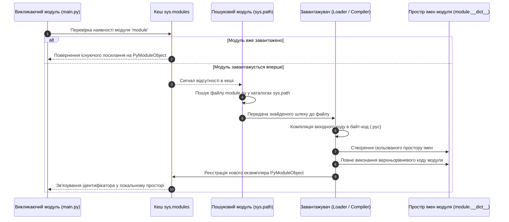
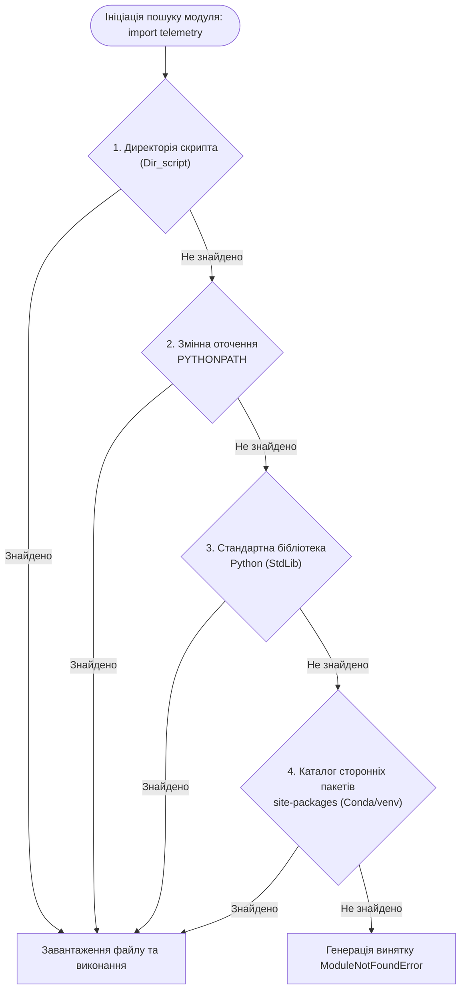

# ЗМІСТОВИЙ МОДУЛЬ 2. ТЕМА 7. МОДУЛЬНА АРХІТЕКТУРА, ПАКЕТИ ТА ВЗАЄМОДІЯ З ОТОЧЕННЯМ

---

## 7.1. Модульна організація: поняття модуля, інструкції import, from ... import ..., псевдоніми as, службова змінна `__name__` та ідіома `if __name__ == '__main__':`

### Основний зміст та теоретичний базис

Проектування складних програмних систем у комп'ютерній інженерії вимагає декомпозиції кодової бази на автономні функціональні компоненти. Модульність є фундаментальним принципом інженерії програмного забезпечення, що забезпечує високу внутрішню зв'язність (*high cohesion*) та слабку взаємну залежність (*loose coupling*) між окремими підсистемами. У мові програмування Python фізичною та логічною одиницею модульності виступає **модуль** — окремий файл із вихідним кодом (розширення `.py`), скомпільованим байт-кодом (`.pyc`) або скомпільованим динамічним розширенням на мовах C/C++ (файли `.so` в операційних системах сімейства POSIX або `.pyd` у середовищі Windows).

Процес підключення модуля до виконуваного контексту є строго детермінованим конвеєром, який реалізується підсистемою імпорту інтерпретатора CPython. Коли в коді зустрічається інструкція `import`, віртуальна машина виконує послідовність обов'язкових системних кроків:
1. Інтерпретатор звертається до глобального кешу завантажених модулів `sys.modules`, який являє собою словник асоціацій між іменами модулів та екземплярами об'єктів типу `PyModuleObject`. Якщо модуль уже присутній у цьому словнику, етап завантаження миттєво завершується, а викликаючий код отримує посилання на вже існуючий об'єкт модуля.
2. У разі відсутності модуля в кеші активується підсистема пошуку (*finders*), яка послідовно сканує директорії, визначені у списку шляхів `sys.path`.
3. Після знаходження відповідного файлу завантажувач (*loader*) створює новий порожній простір імен модуля (об'єкт `__dict__`), транслює вихідний код у байт-код (якщо файл `.pyc` відсутній або застарів) та виконує весь верхньорівневий код модуля від першого до останнього рядка в цьому ізольованому просторі імен.
4. Сформований об'єкт модуля реєструється у словнику `sys.modules`, а відповідне ім'я зв'язується у локальному просторі імен того файлу, де було викликано інструкцію імпорту.


*Рисунок 1 — Послідовність системних операцій при виконанні інструкції імпорту в CPython*

Наведена схема взаємодії компонентів середовища CPython підкреслює той факт, що верхньорівневий код будь-якого модуля виконується рівно один раз під час першого імпортування. Усі наступні спроби імпорту в інших частинах програми не виконують код повторно, а лише повертають готове посилання зі словника `sys.modules`, що суттєво прискорює завантаження великих програмних комплексів.

Синтаксис мови Python підтримує декілька форм інструкцій імпорту:
* Форма прямого імпорту `import module_name` зв'язує простір імен завантаженого модуля з локальною змінною `module_name`. Звернення до функцій, класів та змінних модуля здійснюється через явну точкову нотацію `module_name.function_name()`. Такий підхід є рекомендованим за стандартом PEP 8, оскільки він повністю унеможливлює засмічення локального простору імен та гарантує однозначність джерела кожного ідентифікатора.
* Селективна форма `from module_name import attribute_name` здійснює копіювання посилання на конкретний атрибут із простору імен модуля безпосередньо у поточний локальний простір імен. Це дозволяє викликати функцію або створювати екземпляр класу без зазначення префікса модуля.
* Масова форма `from module_name import *` виконує імпорт усіх імен, задекларованих у модулі (окрім тих, що починаються з символу підкреслення `_`, або тих, що явно обмежені списком `__all__`). В інженерній практиці використання групового імпорту із зірочкою суворо не рекомендується, оскільки воно призводить до неконтрольованого перекриття однойменних локальних змінних і порушує роботу статичних аналізаторів коду.
* Інструкція призначення псевдонімів `as` (наприклад, `import module_name as alias` або `from module_name import function_name as fn`) створює локальний псевдонім для модуля чи атрибута. Це дозволяє усувати конфлікти між однойменними сутностями з різних бібліотек та скорочувати довгі складені імена.

Центральне місце в архітектурі модулів Python посідає службова змінна **`__name__`**. Цей системний рядковий атрибут створюється віртуальною машиною PVM для кожного завантаженого файлу і набуває значення залежно від того, у якому статусі запускається відповідний код:
* Якщо файл запускається безпосередньо користувачем як головна точка входу програми (наприклад, через термінал командою `python main.py`), інтерпретатор встановлює значення `__name__ = "__main__"`.
* Якщо ж файл імпортується іншим скриптом або модулем як залежність, змінній `__name__` автоматично присвоюється ім'я файлу без розширення (наприклад, `__name__ = "sensor_driver"`).

На базі цієї поведінки реалізовано фундаментальний інженерний патерн — **ідіома `if __name__ == '__main__':`**:

```python
# Модуль обробки сигналів: dsp_filter.py

def low_pass_filter(signal_data: list, cutoff_freq: float) -> list:
    """Виконує цифрову низькочастотну фільтрацію вхідного сигналу."""
    filtered_data = [sample * cutoff_freq for sample in signal_data]
    return filtered_data

if __name__ == '__main__':
    # Блок модульного тестування та демонстрації
    test_signal = [0.1, 0.5, 1.2, 0.8, 0.3]
    result = low_pass_filter(test_signal, 0.5)
    print(f"Результат тестування фільтра: {result}")
```

Застосування зазначеної ідіоми дозволяє створювати універсальні модулі подвійного призначення: вони можуть безпечно імпортуватися в інші бібліотеки без виконання налагоджувального або тестового коду, і водночас залишаються доступними для автономного запуску як самостійні консольні утиліти чи модульні тести.

У практиці модульного проектування особливу небезпеку становлять **циклічні імпорти** (*circular imports*). Циклічна залежність виникає тоді, коли модуль $A$ виконує імпорт модуля $B$, а модуль $B$ у своєму тілі імпортує модуль $A$:

$$A \xrightarrow{\text{imports}} B \xrightarrow{\text{imports}} A$$

Якщо імпорт виконується за допомогою форми `from A import func_a` на верхньому рівні модулів, інтерпретатор перериває виконання з винятком `ImportError: cannot import name ... from partially initialized module`. Це відбувається тому, що модуль $A$ ще не встиг заповнити свій простір імен об'єктом `func_a`, оскільки був заблокований на етапі очікування завершення виконання модуля $B$. 

Для усунення циклічних блокувань у комп'ютерній інженерії застосовують архітектурний рефакторинг із винесенням спільних типів даних у третій модуль, або використовують відкладений імпорт (*deferred import*), розміщуючи інструкцію `import` безпосередньо всередині тіла функції, де вона викликається лише в момент безпосередньої потреби.

*Таблиця 7.1 — Порівняльний аналіз синтаксичних форм інструкцій імпорту в Python*

| Синтаксична конструкція | Вплив на локальний простір імен | Ризик колізій імен | Швидкість доступу до атрибутів | Рекомендований інженерний сценарій |
| :--- | :--- | :---: | :---: | :--- |
| **`import module`** | Додає єдине ім'я `module` | Нульовий | Повільніший (через пошук `module.attr`) | Базовий промисловий стандарт підключення бібліотек |
| **`from module import attr`** | Додає ім'я `attr` напряму | Помірний | Швидший (пряме читання з `locals()`) | Імпорт окремих високонавантажених функцій і класів |
| **`import module as alias`** | Додає ім'я `alias` | Нульовий | Аналогічний до прямого імпорту | Скорочення назв стандартних бібліотек |
| **`from module import *`** | Додає всю множину імен модуля | Критичний | Пряме читання, але непрозорий код | Категорично не рекомендовано у системному коді |

Систематизація синтаксичних форм підтверджує необхідність суворого контролю просторів імен: явне зазначення джерел імпорту забезпечує стабільність програмних інтерфейсів та спрощує супровід багатомодульних комплексів.

---

## 7.2. Пакети та простори імен: файли `__init__.py`, керування публічним API через `__all__`, механізм пошуку модулів (`sys.path`)

### Основний зміст та теоретичний базис

Коли масштаби програмного комплексу виходять за межі декількох модулів, виникає потреба в ієрархічній організації файлової структури. **Пакет** у мові Python являє собою структурований каталог файлової системи, який інкапсулює множину взаємопов'язаних модулів та вкладених підпакетів, формуючи єдиний ієрархічний простір імен через точкову нотацію (`package.subpackage.module`).

В архітектурі CPython розрізняють два типи пакетів:
1. **Звичайні пакети (Regular Packages):** каталоги, які обов'язково містять службовий ініціалізаційний файл `__init__.py`. Файл `__init__.py` автоматично виконується віртуальною машиною PVM у момент імпортування пакета або будь-якого з його внутрішніх компонентів.
2. **Просторові пакети (Namespace Packages):** концепція, впроваджена у стандарті PEP 420 (починаючи з Python 3.3), яка дозволяє розділяти компоненти одного логічного пакета між кількома фізично відокремленими директоріями або мережевими сховищами без використання файлів `__init__.py`.

Файл `__init__.py` виконує ключові системні функції в архітектурі пакета. Він ініціалізує стан пакета, налаштовує відносні імпорти між внутрішніми модулями та формує так званий експортний шар (*facade layer*). 

Замість того щоб змушувати зовнішнього користувача виконувати глибокий імпорт вигляду `from my_framework.drivers.network.ethernet import EthernetDriver`, розробник пакета імпортує клас `EthernetDriver` безпосередньо у файл `__init__.py`, надаючи лаконічний інтерфейс: `from my_framework import EthernetDriver`.

Керування публічним інтерфейсом модуля або пакета реалізується за допомогою спеціального списку **`__all__`**. Змінна `__all__` визначається на рівні модуля як список рядків, що містять точні імена тих атрибутів, які повинні експортуватися при масовому імпорті `from module import *`:

```python
# Пакет апаратного моніторингу: hardware_monitor/__init__.py

from .cpu import CPUTracker
from .memory import RAMTracker
from .utils import _internal_kernel_call  # Внутрішня службова функція

# Явна фіксація контракту публічного API
__all__ = [
    'CPUTracker',
    'RAMTracker'
]
```

Якщо змінна `__all__` визначена, інструкція `import *` імпортує виключно елементи, перераховані в цьому списку. Усі інші ідентифікатори (включаючи випадково імпортовані сторонні бібліотеки та допоміжні функції) залишаються прихованими. Це забезпечує суворе інкапсулювання деталей реалізації та захищає внутрішні алгоритми від несанкціонованого прямого використання.

Пошук модулів і пакетів у файловій системі здійснюється інтерпретатором відповідно до списку шляхів **`sys.path`**. Цей список ініціалізується під час запуску інтерпретатора і формується на основі суворої ієрархії пріоритетів:

$$\text{sys.path} = [\text{Dir}_{\text{script}}, \; \text{Env}_{\text{PYTHONPATH}}, \; \text{StdLib}_{\text{core}}, \; \text{SitePackages}_{\text{venv}}]$$

де $\text{Dir}_{\text{script}}$ — абсолютний шлях до директорії, у якій розміщено безпосередньо запущений головний скрипт (має найвищий пріоритет); $\text{Env}_{\text{PYTHONPATH}}$ — список додаткових шляхів, визначених у змінній середовища операційної системи `PYTHONPATH`; $\text{StdLib}_{\text{core}}$ — шляхи до стандартної бібліотеки Python та попередньо скомпільованих бінарних модулів CPython; $\text{SitePackages}_{\text{venv}}$ — каталог сторонніх пакунків поточного віртуального або conda-середовища (`site-packages`).


*Рисунок 2 — Алгоритм послідовного сканування просторів файлової системи через список sys.path*

Проаналізуємо механізм пошуку, відображений на блок-схемі. Найвищий пріоритет каталогу поточного скрипта $\text{Dir}_{\text{script}}$ породжує явище **затінення модулів** (*module shadowing*): якщо розробник назве власний файл іменем стандартного модуля (наприклад, створить файл `math.py` або `random.py` у робочій папці), будь-яка спроба імпортувати однойменну системну бібліотеку завантажить локальний файл, що призведе до порушення роботи стандартної бібліотеки та аварійної зупинки програми. 

Програмне розширення шляхів пошуку може виконуватися динамічно безпосередньо в коді за допомогою методу `sys.path.append("/path/to/custom/libs")`.

Для забезпечення повної відтворюваності багатофайлових інженерних проєктів та фіксації їхньої модульної структури застосовуються файли маніфестів залежностей `requirements.txt` або конфігурації середовищ `environment.yml` у системі Conda. Еталонна структура інженерного проекту організовується за стандартами ізоляції кодової бази:

```text
telemetry_project/
├── .gitignore               <- Фільтрація артефактів (__pycache__, .venv)
├── environment.yml          <- Декларація Conda-середовища та C-бібліотек
├── requirements.txt         <- Список Python-пакунків з точними версіями
├── README.md                <- Технічна документація проекту
├── src/                     <- Вихідний код комплексу (Source root)
│   └── telemetry/           <- Кореневий пакет проекту
│       ├── __init__.py      <- Головний інтерфейс пакету та __all__
│       ├── core.py          <- Алгоритмічне ядро
│       └── drivers/         <- Підпакет драйверів периферії
│           ├── __init__.py
│           ├── uart.py
│           └── spi.py
└── tests/                   <- Набір модульних тестів (Unit Tests)
    ├── test_core.py
    └── test_drivers.py
```

*Таблиця 7.2 — Структурні компоненти професійного багатофайлового проєкту на Python*

| Елемент структури | Тип файлового об'єкта | Функціональне призначення в архітектурі | Взаємодія з інтерпретатором |
| :--- | :--- | :--- | :--- |
| **`src/package/`** | Директорія | Кореневий простір імен програмного модуля | Додається до `sys.path` або встановлюється через `pip install -e .` |
| **`__init__.py`** | Файл вихідного коду | Маркер пакета, експорт публічного API через `__all__` | Виконується автоматично при зверненні до каталогу |
| **`requirements.txt`** | Текстовий конфіг | Фіксація детермінованих версій залежностей | Зчитується утилітою `pip install -r` |
| **`.gitignore`** | Конфігурація Git | Запобігання передачі тимчасових та бінарних файлів | Ігнорується інтерпретатором, зчитується системою Git |

Наведена системна організація файлової структури усуває хаотичні взаємні залежності та дозволяє розгортати проект на цільових вбудованих обчислювачах за допомогою єдиної команди ініціалізації середовища.

---

## 7.3. Огляд стандартної бібліотеки для інженерних задач: модулі `sys`, `os`, `pathlib`, `time`, `random`

### Основний зміст та теоретичний базис

Стандартна бібліотека мови Python («Batteries Included») надає розробникам апаратно-орієнтованого та системного програмного забезпечення набір високоефективних вбудованих модулів, реалізованих безпосередньо мовою C. 

Ці модулі забезпечують пряму взаємодію з ядром операційної системи, керування пам'яттю інтерпретатора, прецизійне профілювання часових інтервалів та стохастичне моделювання фізичних процесів.

### Модуль `sys`: взаємодія з інтерпретатором CPython та параметри середовища

Модуль **`sys`** інкапсулює змінні та функції, які мають прямий зв'язок із середовищем виконання віртуальної машини PVM. Ключові можливості модуля включають:
* Отримання параметрів командного рядка через список **`sys.argv`**. Перший елемент `sys.argv[0]` завжди містить ім'я запущеного скрипта, а наступні елементи (`sys.argv[1:]`) — аргументи, передані користувачем або зовнішнім процесом.
* Стандартні потоки введення-виведення: `sys.stdin` (потік введення, файловий дескриптор 0), `sys.stdout` (потік стандартного виведення, дескриптор 1) та `sys.stderr` (потік виведення діагностичних повідомлень і помилок, дескриптор 2). Перенаправлення цих потоків дозволяє організовувати автоматичне логування в бінарні чи текстові канали зв'язку.
* Керування лімітом глибини системного стека викликів: функція `sys.getrecursionlimit()` повертає поточний поріг викликів, а `sys.setrecursionlimit(limit)` дозволяє збільшити глибину стека для виконання глибоких рекурсивних розрахунків.
* Інспекція споживання пам'яті об'єктами: функція `sys.getsizeof(object)` повертає точний фізичний розмір структури об'єкта в байтах без урахування розміру вкладених посилань.
* Завершення роботи процесу: виклик `sys.exit([code])` збуджує виняток `SystemExit`, передаючи цілочисельний статус завершення (`0` — успіх, ненульове значення — код апаратної чи логічної помилки) в операційну систему.

### Модулі `os` та `pathlib`: абстракція операційної системи та об'єктно-орієнтовані файлові шляхи

Модуль **`os`** надає низькорівневий процедурний інтерфейс для виконання системних викликів операційної системи (POSIX / Windows API). Він дозволяє керувати змінними середовища (`os.environ`), робочими каталогами (`os.getcwd()`, `os.chdir()`), маніпулювати файловими дескрипторами та ініціювати породження дочірніх процесів через системні функції.

Починаючи з версії Python 3.4 (згідно зі стандартом PEP 428), для роботи з файловою системою впроваджено сучасний об'єктно-орієнтований модуль **`pathlib`**. Замість маніпуляції звичайними рядками модуль надає поліморфні класи `Path`, `PosixPath` та `WindowsPath`, які інкапсулюють специфіку роздільників шляхів (`/` проти `\`):
* Перевантажений оператор ділення `/` забезпечує платформо-незалежну конкатенацію компонентів шляху: `config_path = Path.home() / "system_data" / "device.cfg"`.
* Методи перевірки стану вузлів файлової системи: `.exists()` (перевірка фізичної наявності), `.is_file()` (ідентифікація файлу), `.is_dir()` (ідентифікація каталогу).
* Потокове читання та запис: методи `.read_text(encoding='utf-8')`, `.write_text()`, `.read_bytes()` та `.write_bytes()` забезпечують відкриття, атомарне читання/запис і гарантоване закриття файлового дескриптора за один виклик.
* Пошук файлів за маскою: метод `.glob(pattern)` та рекурсивний пошук `.rglob(pattern)` генерують ітератор шляхів, що відповідають регулярному шаблону файлової системи.

### Модуль `time`: системний час та високоточне профілювання швидкодії

Модуль **`time`** забезпечує роботу з часовими мітками, синхронізацію потоків та вимірювання інтервалів виконання алгоритмів. У комп'ютерній інженерії критично розрізняти два типи системних годинників:
1. Астрономічний час (*wall-clock time*), що повертається функцією `time.time()`. Він відраховує кількість секунд, що минули від початку епохи UNIX (00:00:00 UTC, 1 січня 1970 року). Цей годинник не є строго монотонним, оскільки може зазнавати раптових стрибків внаслідок мережевої синхронізації часу за протоколом NTP або переведення годинників операційної системи.
2. Монотонний таймер високої роздільної здатності, що повертається функцією **`time.perf_counter()`**. Цей таймер має найвищу доступну апаратну дискретність (на базі лічильників процесора TSC — *Time Stamp Counter*) і гарантовано ніколи не зменшує своє значення.

Математично розрахунок часу виконання $\Delta t$ обчислювального алгоритму або апаратного опитування датчика з використанням монотонного лічильника описується формулою:

$$\Delta t = t_{\text{stop}} - t_{\text{start}} = \text{perf\_counter}_{\text{stop}} - \text{perf\_counter}_{\text{start}}$$

де $t_{\text{start}}$ та $t_{\text{stop}}$ — значення лічильника часу в секундах (з плаваючою комою, точність до наносекунд). Затримка виконання потоку на фіксований час $\tau$ реалізується функцією `time.sleep(\tau)`.

### Модуль `random`: алгоритм вихору Мерсенна та генерація псевдовипадкових процесів

Модуль **`random`** реалізує генератор псевдовипадкових чисел (PRNG) на базі алгоритму **Вихору Мерсенна** (**Mersenne Twister**, варіант MT19937). Цей алгоритм має колосальний період повторення послідовності, що дорівнює простому числу Мерсенна:

$$T = 2^{19937} - 1 \approx 4.3 \times 10^{6001}$$

та забезпечує 623-вимірну рівномірність розподілу псевдовипадкових векторів.

Генератор не є криптографічно стійким, проте має високу швидкість генерації, що робить його базовим інструментом для статистичного моделювання за методом Монте-Карло, стрес-тестування систем передачі даних та імітації шумів у каналах зв'язку:
* Функція `random.random()` генерує дійсне псевдовипадкове число з неперервного рівномірного розподілу на напіввідкритому інтервалі $[0.0, 1.0)$.
* Функція `random.uniform(a, b)` масштабує рівномірний розподіл на довільний числовий проміжок $[a, b]$ згідно з лінійною щільністю ймовірності:

$$f(x) = \frac{1}{b - a}, \quad \text{для } a \le x \le b$$

* Функція `random.randint(a, b)` генерує дискретне ціле число з рівномірного закритого діапазону $[a, b]$.
* Функція `random.choice(sequence)` повертає випадковий елемент із непорожньої послідовності за константний час $O(1)$.
* Функція `random.shuffle(list)` виконує перестановку елементів списку на місці за алгоритмом Фішера-Єйтса з лінійною складністю $O(N)$.
* Функція `random.sample(population, k)` формує вибірку $k$ унікальних елементів без повернення.
* Функція `random.gauss(mu, sigma)` моделює неперервну випадкову величину з нормальним (гаусовим) розподілом із математичним сподіванням $\mu$ та середньоквадратичним відхиленням $\sigma$:

$$f(x) = \frac{1}{\sigma \sqrt{2\pi}} \exp\left(-\frac{(x - \mu)^2}{2\sigma^2}\right)$$

Фундаментальною властивістю псевдовипадкових послідовностей є їхня повна детермінованість при фіксації початкового стану (**seed**). Виклик функції `random.seed(S)` (де $S$ — ціле число або послідовність байтів) повністю визначає всю подальшу послідовність згенерованих чисел. Це забезпечує абсолютну відтворюваність інженерних експериментів, верифікацію алгоритмів та налагодження складних стохастичних систем.

```python
# Інженерний приклад: симуляція вимірювання напруги з гаусовим шумом та оцінка часу
import time
import random
from pathlib import Path

random.seed(42)  # Фіксація зерна для детермінованого тестування
NOMINAL_VOLTAGE = 5.0  # Вольт
NOISE_SIGMA = 0.05      # Відхилення шуму АЦП

t_start = time.perf_counter()
telemetry_samples = [random.gauss(NOMINAL_VOLTAGE, NOISE_SIGMA) for _ in range(10000)]
t_elapsed = time.perf_counter() - t_start

output_file = Path("telemetry_dump.csv")
output_file.write_text("\n".join(f"{v:.4f}" for v in telemetry_samples[:10]))
print(f"Згенеровано 10000 замірів за {t_elapsed * 1000:.3f} мс. Збережено у {output_file.name}")
```

*Таблиця 7.3 — Систематизація системних модулів стандартної бібліотеки Python*

| Модуль | Рівень взаємодії | Ключові класи та функції | Сфера застосування в комп'ютерній інженерії |
| :--- | :--- | :--- | :--- |
| **`sys`** | Інтерпретатор PVM / CPython | `argv`, `exit()`, `getsizeof()`, `stdin`, `stdout`, `path` | Парсинг CLI-інтерфейсів, контроль пам'яті та лімітів рекурсії |
| **`os`** | Системні виклики ядра ОС | `environ`, `getcwd()`, `listdir()`, `system()`, `remove()` | Адміністрування операційної системи, змінні середовища |
| **`pathlib`**| Об'єктна файлова система | `Path`, `glob()`, `stat()`, `read_bytes()`, `write_text()` | Кросплатформне керування шляхами, пошук логів, дампи пам'яті |
| **`time`** | Апаратні лічильники часу | `perf_counter()`, `time()`, `sleep()`, `strftime()` | Прецизійний бенчмаркінг, таймаути драйверів, протоколи опитування |
| **`random`** | Генератор MT19937 | `seed()`, `random()`, `randint()`, `gauss()`, `choice()` | Імітація апаратних шумів, метод Монте-Карло, стрес-тести |

Аналітичний огляд модулів стандартної бібліотеки підтверджує, що вбудовані засоби мови Python забезпечують повний цикл розробки системного програмного забезпечення: від низькорівневого контролю параметрів виконання до прецизійного статистичного аналізу без необхідності залучення сторонніх залежностей.

---

### Питання для самоперевірки та аналітичного осмислення

1. Опишіть покроковий механізм імпортування модуля у CPython. Яку роль відіграє системний словник `sys.modules` у запобіганні повторному виконанню верхньорівневого коду модуля?
2. Розкрийте фізичний та системний зміст службової змінної `__name__`. Поясніть принцип дії та архітектурне призначення ідіоми `if __name__ == '__main__':`.
3. Чому виникає виняток `ImportError` при взаємному циклічному імпортуванні модулів (`circular imports`) через форму `from module import attribute`? Які інженерні методи дозволяють усунути цю проблему?
4. Поясніть призначення файлу `__init__.py` у регулярних пакетах. Як за допомогою списку `__all__` регламентувати публічний контракт API програмного модуля?
5. Опишіть алгоритм формування списку шляхів `sys.path`. Що таке «затінення модулів» (*module shadowing*) і як локальний файл `random.py` може заблокувати роботу стандартної бібліотеки?
6. Чому для прецизійного вимірювання часу виконання обчислювальних алгоритмів слід використовувати функцію `time.perf_counter()`, а не `time.time()`? Поясніть поняття монотонності системного таймера.
7. Охарактеризуйте алгоритм генерації псевдовипадкових чисел Mersenne Twister (MT19937), реалізований у модулі `random`. Чому фіксація зерна генератора (`random.seed()`) є критично важливою вимогою для верифікації науково-інженерних розрахунків?