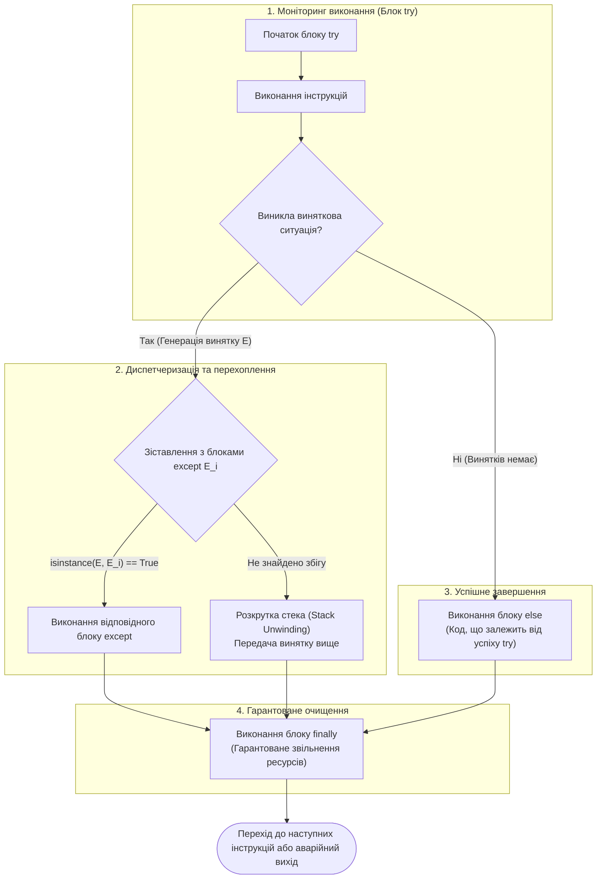
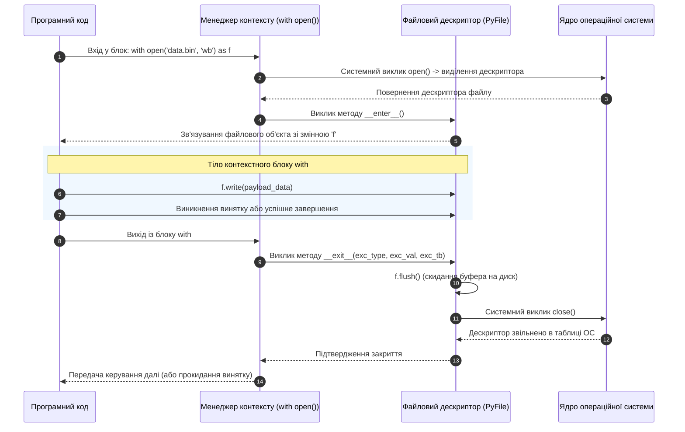

# ЗМІСТОВИЙ МОДУЛЬ 3. ТЕМА 8. ОБРОБКА ВИНЯТКОВИХ СИТУАЦІЙ ТА ФАЙЛОВЕ ВВЕДЕННЯ-ВИВЕДЕННЯ

---

## 8.1. Архітектура обробки винятків: синтаксичні помилки проти винятків часу виконання, конструкція try-except-else-finally, порядок перехоплення та ієрархія класів BaseException / Exception

### Основний зміст та теоретичний базис

Надійність функціонування програмних комплексів у комп'ютерній інженерії визначається їхньою здатністю штатно обробляти непередбачені або аномальні стани системи. Будь-які порушення нормального ходу виконання програми класифікуються на дві принципово різні категорії: синтаксичні помилки (*syntax errors*) та помилки часу виконання (*runtime errors*), які в об'єктно-орієнтованому середовищі Python формалізуються як **винятки** (**виняткові ситуації**, *exceptions*).

Синтаксичні помилки (клас `SyntaxError` та його похідний підклас `IndentationError`) виявляються транслятором CPython на етапі лексичного та синтаксичного аналізу вихідного тексту до моменту генерації байт-коду. Якщо код містить синтаксичні дефекти (порушення правил відступів, незакриті дужки або некоректні ключові слова), трансляція повністю блокується, а програма взагалі не починає виконуватися. 

Натомість винятки часу виконання виникають у коректно скомпільованому байт-коді безпосередньо під час його інтерпретації віртуальною машиною PVM. До таких ситуацій належать спроби ділення на нуль (`ZeroDivisionError`), звернення за межі діапазону масиву (`IndexError`), передача несумісних типів даних (`TypeError`) або апаратні помилки доступу до зовнішніх носіїв і портів (`OSError`).

Механізм обробки винятків у CPython базується на процедурі **розкручування стека викликів** (*stack unwinding*). Коли в точці виконання інструкції виникає аномальний стан, віртуальна машина PVM створює об'єкт винятку, який інкапсулює інформацію про тип помилки, її текстовий опис та повний стан стекових кадрів на момент аварії (*traceback*). Якщо в поточному стековому кадрі `PyFrameObject` відсутній блок перехоплення помилки, виконання кадру негайно переривається, ресурси локальних змінних декрементуються, а об'єкт винятку передається вгору за ієрархією викликів у викликаючий стековий кадр. 

Цей процес рекурсивно повторюється доти, доки не буде знайдено відповідний обробник. Якщо виняток досягає верхнього рівня програми і залишається необробленим, інтерпретатор аварійно завершує процес, виводячи діагностичний звіт трасування в стандартний потік помилок `sys.stderr`.


*Рисунок 1 — Повний життєвий цикл та граф потоку керування конструкції try-except-else-finally*

Проаналізуємо структуру керування, наведену на рисунку. Повний синтаксичний каркас обробки винятків складається з чотирьох взаємопов'язаних блоків:
* Блок `try` інкапсулює критичну ділянку програмного коду, виконання якої потенційно може призвести до виникнення винятку.
* Блоки `except ExceptionClass as err` задають перелік очікуваних типів помилок. Якщо згенерований виняток є екземпляром класу `ExceptionClass` або його нащадком, керування передається цьому блоку, а сам об'єкт винятку зв'язується з локальною змінною `err`. Конструкція може містити довільну кількість блоків `except`, що перевіряються послідовно зверху вниз.
* Блок `else` виконується виключно в тому випадку, коли в блоці `try` не виникло жодної виняткової ситуації. Відокремлення основного коду від блоку `try` за допомогою секції `else` є важливим інженерним принципом, оскільки це унеможливлює випадкове перехоплення помилок, що виникають поза межами цільової операції.
* Блок `finally` виконується безумовно в усіх можливих випадках: при успішному завершенні блоку `try`, після виконання блоку `except`, а також перед передачею необробленого винятку вгору за стеком викликів. Блок `finally` спрацьовує навіть у разі наявності всередині `try` або `except` операторів переривання потоку керування `return`, `break` чи `continue`.

В основі системи винятків Python лежить сувора об'єктно-орієнтована ієрархія класів, коренем якої є базовий клас **`BaseException`**. 

Усі стандартні та користувацькі винятки організовані в деревоподібну структуру наслідування:

```text
BaseException
├── SystemExit                   <- Завершення процесу інтерпретатора
├── KeyboardInterrupt            <- Сигнал переривання користувачем (Ctrl+C)
├── GeneratorExit                <- Закриття генератора або корутини
└── Exception                    <- Базовий клас для всіх прикладних помилок
    ├── ArithmeticError
    │   ├── FloatingPointError   <- Помилка апаратного обчислення з рухомою комою
    │   ├── OverflowError        <- Переповнення діапазону для дійсних чисел
    │   └── ZeroDivisionError    <- Спроба ділення на нуль
    ├── LookupError
    │   ├── IndexError           <- Звернення за неіснуючим індексом послідовності
    │   └── KeyError             <- Відсутність ключа в хеш-таблиці
    ├── OSError                  <- Системні помилки оточення та вводу-виводу
    │   ├── FileNotFoundError   <- Відсутність файлу у файловій системі
    │   ├── PermissionError      <- Недостатньо прав доступу на рівні ОС
    │   └── TimeoutError         <- Вичерпання ліміту часу системного виклику
    ├── TypeError                <- Застосування операції до невідповідного типу
    └── ValueError               <- Некоректне значення при правильному типі
```

З точки зору архітектури програмного забезпечення критично розуміти різницю між `BaseException` та `Exception`. Системні винятки `SystemExit` та `KeyboardInterrupt` успадковуються безпосередньо від `BaseException`, оминаючи гілку `Exception`. Це зроблено для того, щоб універсальний обробник прикладних помилок `except Exception:` не перехоплював команди аварійної зупинки програми користувачем через комбінацію клавіш `Ctrl+C`. 

Використання так званого порожнього перехоплення `except:` або перехоплення `except BaseException:` вважається грубим порушенням інженерних практик, оскільки воно блокує штатне завершення процесів операційною системою.

При побудові ланцюжка блоків `except` порядок їхнього слідування повинен суворо відповідати правилу: **від найбільш спеціалізованих (похідних) класів до більш загальних (базових)**. Якщо розмістити блок перехоплення базового класу вище його нащадків, наприклад, `except LookupError:` перед `except IndexError:`, базовий блок перехопить усі екземпляри `IndexError`, оскільки перевірка відповідності типів на рівні CPython виконується за принципом:

$$\text{isinstance}(\text{RaisedException}, \text{HandledExceptionClass}) == \text{True}$$

У такому випадку блок `except IndexError:` перетвориться на мертвий код (*dead code*), який ніколи не отримає керування.

*Таблиця 8.1 — Систематизація базових класів винятків CPython та їхній інженерний контекст*

| Клас винятку | Базовий клас | Типова причина збудження | Інженерне значення в комп'ютерній інженерії |
| :--- | :--- | :--- | :--- |
| **`ZeroDivisionError`** | `ArithmeticError` | Ділення на числовий нуль (`x / 0`, `x % 0`) | Порушення математичної коректності в алгоритмах DSP |
| **`IndexError`** | `LookupError` | Вихід за межі індексної сітки списку/кортежу | Помилка адресації динамічних буферів обміну даними |
| **`KeyError`** | `LookupError` | Звернення до неіснуючого ключа словника | Збій розбору конфігурацій чи протоколів за словником |
| **`ValueError`** | `Exception` | Некоректне значення (`int("ABC")`) | Помилка перетворення даних, отриманих з АЦП чи UART |
| **`TypeError`** | `Exception` | Несумісність типів (`"10" + 5`) | Порушення контракту виклику функції чи драйвера |
| **`FileNotFoundError`**| `OSError` | Відсутність файлу на диску | Збій завантаження калібрувальних таблиць чи прошивок |
| **`PermissionError`** | `OSError` | Заборона доступу на рівні ядра ОС | Спроба прямого доступу до системних портів без прав root |

Аналіз таблиці показує, що чітка типізація виняткових ситуацій дозволяє розробнику точно локалізувати рівень збою — від помилки у внутрішніх структурах даних до апаратних відмов периферійних інтерфейсів.

---

## 8.2. Генерація винятків (raise), створення власних класів винятків (Custom Exceptions) для бізнес-логіки

### Основний зміст та теоретичний базис

Оператор **`raise`** забезпечує явну примусову генерацію виняткової ситуації у будь-якій точці програми. Застосування цього оператора сигналізує про виникнення стану, який порушує внутрішні інваріанти модуля або вимоги технічного завдання. 

Синтаксично оператор `raise` підтримує три форми використання:
1. Генерація нового екземпляра класу винятку з передачею діагностичного повідомлення: `raise ValueError("Параметр напруги виходить за межі 0..5V")`.
2. Повторна генерація (*re-raising*) поточного активного винятку всередині блоку `except`: одиночний оператор `raise` без аргументів передає раніше перехоплений виняток далі вгору за стеком викликів після виконання локального логування.
3. Явна трансформація винятків із збереженням первинного контексту помилки через конструкцію **ланцюжка винятків** (**exception chaining**, PEP 3134): `raise TargetException() from OriginalException`.

Механізм ланцюжка винятків є критично важливим для збереження діагностичного сліду при переході між різними рівнями абстракції. Якщо низькорівневий драйвер генерує `OSError` через апаратний таймаут шини I2C, високорівневий контролер може перехопити його та згенерувати спеціалізований виняток `SensorReadError`, явно вказавши джерело через директиву `from`:

$$\text{TargetException}.\_\_\text{cause}\_\_ = \text{OriginalException}$$

Це дозволяє інженеру бачити повну хронологію виникнення проблеми у звіті трасування: як первинну апаратну відмову, так і її наслідки для бізнес-логіки.

Для відображення специфічних помилок предметної області розробник повинен проектувати **власні класи винятків** (**Custom Exceptions**). За правилами проектування архітектури Python, будь-який користувацький виняток зобов'язаний наслідуватися від класу `Exception` (або одного з його стандартних нащадків) і в жодному разі не від `BaseException`.

В інженерних проектах рекомендується створювати ієрархію винятків із спільним базовим класом для всього модуля або підсистеми. Це дозволяє користувачам бібліотеки перехоплювати як будь-яку помилку модуля в цілому через його базовий клас, так і обробляти кожну окрему нештатну ситуацію індивідуально:

```python
# Ієрархія користувацьких винятків підсистеми телеметрії

class TelemetryError(Exception):
    """Базовий клас для всіх винятків підсистеми збору телеметрії."""
    pass

class DeviceTimeoutError(TelemetryError):
    """Виникає при перевищенні ліміту часу очікування відповіді пристрою."""
    def __init__(self, port: str, timeout: float):
        self.port = port
        self.timeout = timeout
        super().__init__(f"Пристрій на порту '{port}' не відповів за {timeout} с.")

class CRCValidationError(TelemetryError):
    """Виникає при невідповідності контрольної суми отриманого пакета."""
    def __init__(self, expected_crc: int, actual_crc: int):
        self.expected_crc = expected_crc
        self.actual_crc = actual_crc
        super().__init__(f"Помилка CRC: очікувалося 0x{expected_crc:04X}, отримано 0x{actual_crc:04X}.")
```

У наведеному прикладі класи `DeviceTimeoutError` та `CRCValidationError` інкапсулюють специфічні контекстні параметри (назва порту, часовий інтервал, очікувана та фактична контрольні суми), що дозволяє обробнику помилок не просто отримати текстове повідомлення, а програмно аналізувати числові атрибути винятку для прийняття рішення про повторну передачу кадру.

У практиці комп'ютерної інженерії виділяють дві парадигми проектування обчислювальних процесів:
* **LBYL** (*Look Before You Leap* — «Подивись перед тим, як стрибнути»): підхід, характерний для мов C/C++, за якого перед виконанням кожної потенційно небезпечної операції здійснюються численні попередні перевірки через інструкції `if`. Цей підхід створює значний оверхед на багаторазове дублювання перевірок і у багатопотокових системах страждає від стану гонитви типу TOCTOU (*Time-of-Check to Time-of-Use*).
* **EAFP** (*Easier to Ask for Forgiveness than Permission* — «Легше попросити вибачення, ніж дозволу»): ідіоматичний підхід мови Python, за якого операція виконується безпосередньо всередині блоку `try`, а можливі збої перехоплюються відповідними блоками `except`. Парадигма EAFP є швидшою в умовах, коли виняткові ситуації виникають відносно рідко, оскільки блок `try` за відсутності помилок не створює додаткових обчислювальних накладних витрат.

---

## 8.3. Робота з файлами: функція open(), режими доступу ('r', 'w', 'a', 'b', '+'), позиціонування курсору (seek, tell), буферизація та кодування. Патерн RAII та менеджери контексту (оператор with)

### Основний зміст та теоретичний базис

Взаємодія з постійними запам'ятовуючими пристроями (ПЗП), накопичувачами та віртуальними файловими системами операційної системи здійснюється через абстракцію файлового потоку введення-виведення. У мові Python доступ до файлових ресурсів відкриває вбудована функція **`open()`**, яка пов'язує фізичний файл на носії з відповідним файловим об'єктом (потоком) у пам'яті процесу:

$$\text{file\_object} = \text{open}(file, mode='r', buffering=-1, encoding=None, errors=None, newline=None, closefd=True)$$

Експлікація ключових параметрів функції `open()`:
* $file$ — рядковий шлях до файлу (абсолютний або відносний), об'єкт `pathlib.Path` або цілочисельний файловий дескриптор ядра ОС;
* $mode$ — рядковий специфікатор режиму доступу;
* $buffering$ — ціле число, що регламентує політику буферизації потоку ($0$ — буферизація вимкнена, дозволено лише для бінарних файлів; $1$ — рядкова буферизація для тексту; $>1$ — фіксований розмір системного буфера в байтах; $-1$ — використання розміру системного буфера за замовчуванням `io.DEFAULT_BUFFER_SIZE`, що зазвичай становить 4096 або 8192 байти);
* $encoding$ — назва стандарту кодування символів для текстового режиму (`utf-8`, `ascii`, `cp1251`);
* $errors$ — режим реакції на помилки декодування символів (`strict` — збудження винятку `UnicodeDecodeError`, `ignore` — пропуск некоректних байтів, `replace` — заміна на маркер `\uFFFD`);
* $newline$ — спосіб трансляції символів кінця рядка (`\n`, `\r`, `\r\n`).

Режим доступу $mode$ формується комбінацією базових символів, що визначають спрямованість потоку даних та формат інтерпретації вмісту:
* Символ `'r'` (Read) відкриває файл виключно для читання. Файловий курсор встановлюється на нульовий байт (початок файлу). Якщо файл фізично відсутній на диску, функція збуджує виняток `FileNotFoundError`.
* Символ `'w'` (Write) відкриває файл для запису. Якщо файл існує, його вміст миттєво знищується (**усікається до нульової довжини**, *truncation*). Якщо файл відсутній, створюється новий порожній файл.
* Символ `'a'` (Append) відкриває файл для дозапису в кінець. Початковий вміст зберігається, а всі операції запису автоматично перенаправляються в кінець файлу незалежно від переміщень курсору.
* Символ `'x'` (Exclusive Creation) відкриває файл для запису виключно за умови, що він ще не існує. Якщо файл уже присутній, генерується виняток `FileExistsError`.
* Символ `'+'` (Update) підключає комбінований режим одночасного читання та запису (`r+`, `w+`, `a+`). У режимі `r+` початкові дані зберігаються, а запис перезаписує байти з поточної позиції курсору. У режимі `w+` файл попередньо очищається.
* Символи `'t'` (Text) та `'b'` (Binary) визначають рівень представлення: текстовий (повертає об'єкти `str` з автоматичним декодуванням) або бінарний (повертає сирі байти `bytes` без інтерпретації).

Керування позицією зчитування та запису здійснюється за допомогою методів низькорівневого позиціонування курсору:
* Метод **`file.tell()`** повертає поточне зміщення курсору в байтах від початку файлу у вигляді невід'ємного цілого числа $P \in \mathbb{N}_0$.
* Метод **`file.seek(offset, whence=0)`** переміщує курсор у нову позицію, де $offset$ визначає зміщення в байтах, а параметр $whence$ вказує точку відліку:
  - $whence = 0$ (`os.SEEK_SET`): абсолютне зміщення від початку файлу (дозволено в текстовому та бінарному режимах);
  - $whence = 1$ (`os.SEEK_CUR`): відносне зміщення від поточної позиції курсору (дозволено тільки в бінарному режимі `'b'`);
  - $whence = 2$ (`os.SEEK_END`): відносне зміщення від кінця файлу (дозволено тільки в бінарному режимі `'b'`).

У текстовому режимі використання довільних числових зміщень $offset \neq 0$ при $whence \neq 0$ суворо заборонено через нелінійність багатобайтових кодувань Unicode (UTF-8), де символ може займати від 1 до 4 байтів: єдиним коректним аргументом для `seek()` у тексті є значення, раніше отримане з виклику `tell()`.

У комп'ютерній інженерії критичною проблемою є **витік файлових дескрипторів** (*file descriptor leak*). Операційна система виділяє кожному процесу обмежену кількість файлових дескрипторів (ліміт `ulimit -n` у POSIX-системах). 

Якщо відкривати файли без їхнього явного закриття методом `file.close()`, таблиця дескрипторів процесу швидко переповнюється, що призводить до системного винятку `OSError: [Errno 24] Too many open files` та блокування операцій введення-виведення. Крім того, нескинуті з буфера дані при раптовому збої процесу втрачаються.

Для вирішення проблеми гарантованого вивільнення ресурсів застосовується архітектурний патерн **RAII** (*Resource Acquisition Is Initialization*), реалізований у Python через **менеджери контексту** та оператор **`with`** (PEP 343).


*Рисунок 2 — Послідовність взаємодії протоколу менеджера контексту при гарантованому закритті файлу*

Проаналізуємо схему виконання протоколу контекстного менеджера. Протокол базується на двох магічних методах:
1. Метод **`__enter__()`** ініціалізує ресурс, відкриває файловий потік і повертає об'єкт, що зв'язується зі змінною після ключового слова `as`.
2. Метод **`__exit__(exc_type, exc_val, exc_tb)`** викликається автоматично при виході з блоку `with` за будь-яких умов. Якщо всередині блоку виник виняток, його параметри передаються в `__exit__`. Метод гарантовано викликає системну функцію `close()`, виконує скидання буферів на диск через `flush()` та звільняє дескриптор операційної системи. Якщо метод `__exit__` повертає `True`, виняток вважається подавленим; якщо повертається `False` (поведінка за замовчуванням) — виняток продовжує прокидатися вгору за стеком після закриття файлу.

Розглянемо практичний інженерний приклад надійного зчитування бінарного файлу прошивки мікроконтролера з перевіркою цілісності та обробкою системних винятків:

```python
import os
from pathlib import Path

FIRMWARE_HEADER_MAGIC = b"\x7F\x45\x4C\x46"  # Сигнатура ELF файлу

def load_firmware_safe(file_path: Path) -> bytes:
    """Виконує надійне зчитування бінарного образу прошивки з обробкою винятків."""
    try:
        # Безпечне відкриття файлу через менеджер контексту
        with open(file_path, mode="rb", buffering=0) as bin_file:
            header = bin_file.read(4)
            if header != FIRMWARE_HEADER_MAGIC:
                raise ValueError(f"Некоректна сигнатура заголовка: {header.hex()}")
            
            # Переміщення в кінець файлу для визначення розміру
            file_size = bin_file.seek(0, os.SEEK_END)
            bin_file.seek(4, os.SEEK_SET)  # Повернення до тіла прошивки
            
            payload = bin_file.read()
            print(f"Успішно завантажено {file_size} байтів прошивки.")
            return payload

    except FileNotFoundError as err:
        print(f"Апаратна помилка: Файл прошивки '{file_path}' відсутній на носії. ({err})")
        raise
    except PermissionError as err:
        print(f"Помилка безпеки ОС: Відсутні права на читання файлу '{file_path}'. ({err})")
        raise
    except (OSError, ValueError) as err:
        print(f"Критичний збій введення-виведення при читанні прошивки: {err}")
        raise
```

*Таблиця 8.2 — Матриця режимів доступу функції `open()` та поведінки файлового курсору*

| Режим | Тип доступу | Усікання файлу (Truncate) | Початкова позиція курсору | Створення нового файлу | Типове застосування в інженерії |
| :--- | :--- | :---: | :---: | :---: | :--- |
| **`'r'` / `'rb'`** | Тільки читання | Ні | Початок (0 байт) | Ні (генерує `FileNotFoundError`) | Зчитування конфігурацій, калібрувань |
| **`'w'` / `'wb'`** | Тільки запис | **Так (очищення)** | Початок (0 байт) | Так (якщо відсутній) | Запис нових образів прошивок, дампи |
| **`'a'` / `'ab'`** | Тільки дозапис | Ні | Кінець файлу | Так (якщо відсутній) | Логування системних подій і трафіку |
| **`'x'` / `'xb'`** | Ексклюзивне створення| Ні | Початок (0 байт) | Так (якщо є — `FileExistsError`) | Безпечне створення унікальних логів |
| **`'r+'` / `'r+b'`**| Читання та запис | Ні | Початок (0 байт) | Ні (генерує `FileNotFoundError`) | Модифікація окремих байтів без перезапису |
| **`'w+'` / `'w+b'`**| Читання та запис | **Так (очищення)** | Початок (0 байт) | Так (якщо відсутній) | Тимчасові буфери обміну інформацією |
| **`'a+'` / `'a+b'`**| Читання та дозапис | Ні | Кінець файлу | Так (якщо відсутній) | Читання історії та дозапис нових логів |

Наведена матриця режимів демонструє строгу спеціалізацію операцій введення-виведення, дозволяючи оптимізувати роботу дискової підсистеми відповідно до конкретних вимог надійності.

---

### Питання для самоперевірки та аналітичного осмислення

1. У чому полягає принципова відмінність між помилками етапу трансляції (`SyntaxError`) та винятками часу виконання (`Exception`) у віртуальній машині CPython?
2. Опишіть алгоритм розкручування стека (*stack unwinding*) при виникненні необробленого винятку. Які системні структури формують звіт трасування `traceback`?
3. Чому перехоплення винятків за допомогою виразу `except BaseException:` або порожнього `except:` вважається критичною архітектурною помилкою? Чим семантично відрізняється клас `BaseException` від класу `Exception`?
4. Поясніть призначення та порядок виконання блоку `else` у конструкції `try-except-else-finally`. Чому розміщення основного коду в секції `else` є безпечнішим, ніж його пряме включення в блок `try`?
5. Розкрийте системний механізм ланцюжка винятків (*exception chaining*) через оператор `raise ... from ...`. Яка інформація зберігається в атрибутах `__cause__` та `__context__`?
6. До яких наслідків для операційної системи призводить витік файлових дескрипторів (*file descriptor leak*) у високонавантажених сервісах? Чому виклику методу `close()` у блоці `try` недостатньо для гарантування надійності?
7. Опишіть роботу протоколу менеджера контексту (`__enter__` та `__exit__`) при використанні інструкції `with open()`. За яких умов метод `__exit__` здатний придушити виняток, що виник усередині контекстного блоку?