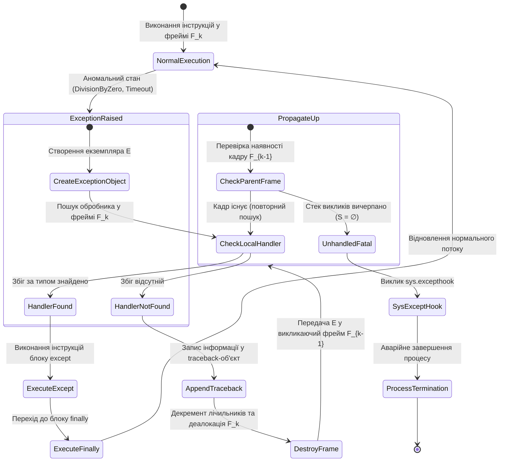
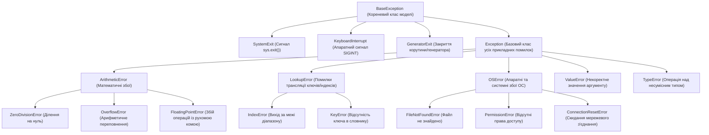
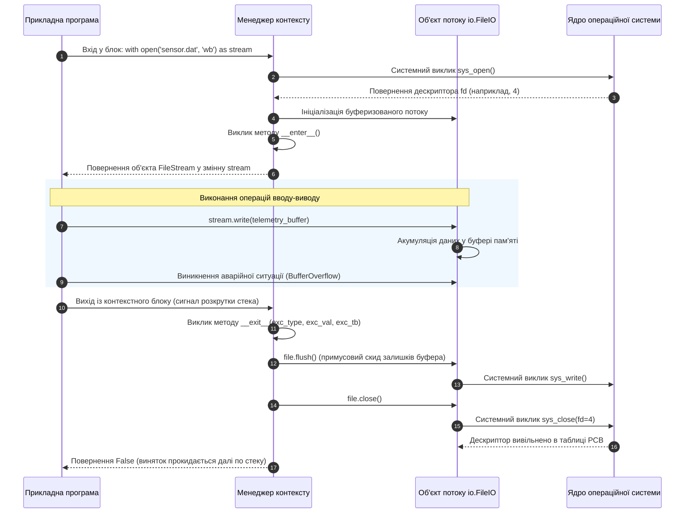
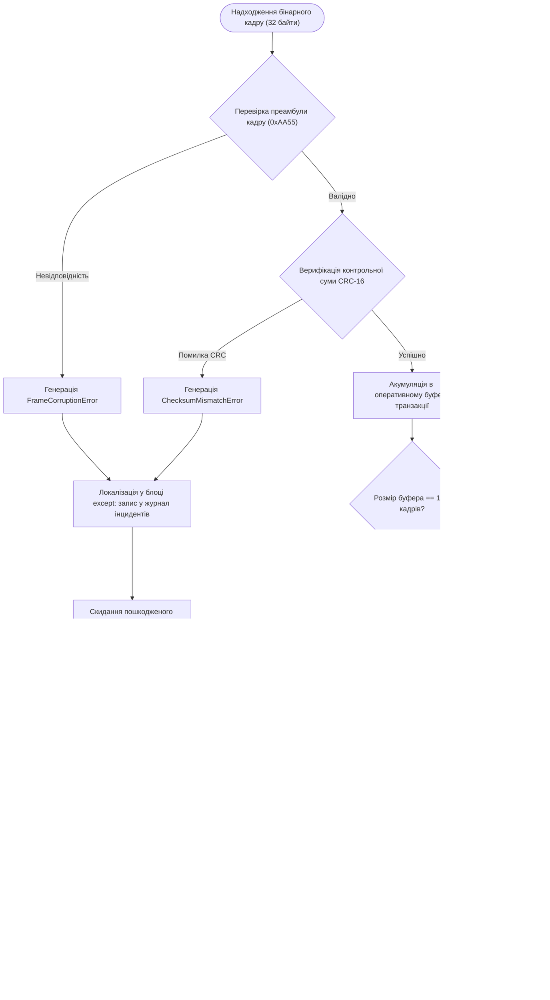

# Тема 8. Архітектура обробки виняткових ситуацій та потокового файлового введення-виведення у мові Python

## Мета лекції
Метою лекції з навчальної дисципліни «Програмування на Python» для здобувачів першого (бакалаврського) рівня вищої освіти спеціальностей 122 «Комп’ютерні науки» та 172 «Електронні комунікації та радіотехніка» є формування цілісної системи фундаментальних знань і практичних інженерних компетентностей щодо забезпечення надійності та стійкості програмних комплексів шляхом глибокого опанування внутрішньої архітектури диспетчеризації винятків у віртуальній машині CPython, проектування предметно-орієнтованих ієрархій користувацьких помилок, а також засвоєння нормативних практик низькорівневого й буферизованого введення-виведення з гарантованим керуванням системними дескрипторами на основі концепції детермінованого вивільнення ресурсів і протоколу менеджерів контексту.

## Очікувані результати навчання
1. **Знання та розуміння.** Здобувачі вищої освіти засвоять теоретичні засади функціонування механізму розкручування стека викликів у віртуальній машині CPython, ієрархічну структуру базових класів винятків, системну організацію файлових дескрипторів операційної системи та принципи взаємодії з апаратними накопичувачами через дискові буфери.
2. **Застосування.** Студенти оволодіють практичними навичками побудови повноформатних блоків перехоплення аномальних станів, створення власних типізованих класів винятків для бізнес-логіки систем, а також синтаксичного керування файловими потоками за допомогою методів прямого позиціонування й контекстних менеджерів.
3. **Аналіз.** Майбутні інженери зможуть диференціювати синтаксичні дефекти трансляції від динамічних аварій часу виконання, досліджувати причини виникнення витоків системних дескрипторів та станів гонитви при операціях введення-виведення, а також зіставляти ефективність парадигм проектування програмного забезпечення при високих навантаженнях.
4. **Оцінювання та синтез.** Здобувачі набудуть здатності проектувати відмовостійкі архітектурні модулі транзакційного збереження телеметричної інформації, оцінювати наслідки некоректного перехоплення системних сигналів та розробляти стратегії комплексного відновлення працездатності телекомунікаційного вузла в умовах раптової втрати з'єднання чи апаратних збоїв.

---

## Детальний покроковий план лекції

### 1. Теоретико-концептуальний базис. Архітектура обробки виняткових ситуацій та об'єктна модель помилок у CPython
* 1.1. Диференціація синтаксичних помилок і помилок часу виконання з детальним аналізом внутрішнього механізму розкручування стека викликів та генерації трасування.
* 1.2. Об'єктно-орієнтована таксономія винятків на основі ієрархії класів BaseException і Exception із нормативними правилами послідовного перехоплення за принципом спадання специфічності.
* 1.3. Повна семантична структура диспетчеризації винятків за допомогою конструкції try-except-else-finally та особливості гарантованого виконання фіналізаторів.
* 1.4. Механізми явної ініціалізації виняткових станів оператором raise, техніка збереження діагностичного сліду через ланцюжки винятків та проектування користувацьких класів для специфічних інженерних завдань.

### 2. Методологія та аналіз граничних умов. Потокове введення-виведення, системні файлові дескриптори та контекстні протоколи
* 2.1. Архітектура системних викликів функції open, матриця взаємовиключних і комбінованих режимів доступу, механізми кодування символів та апаратна буферизація потоків даних.
* 2.2. Низькорівневе позиціонування файлового курсору за допомогою методів seek і tell та математичні аспекти адресації зміщень у бінарних і текстових структурах.
* 2.3. Патерн детермінованого вивільнення ресурсів RAII та системна реалізація протоколу менеджерів контексту через інтерфейсні магічні методи enter і exit.
* 2.4. Критичні обмеження та вузькі місця роботи з дисковими потоками, включаючи вичерпання лімітів дескрипторів ядра операційної системи, стан гонитви перевірки часу використання та блокування введення-виведення у багатозадачному середовищі.
* 2.5. Порівняльний аналіз інженерних парадигм Look Before You Leap та Easier to Ask for Forgiveness than Permission у контексті швидкодії інтерпретатора та надійності критичних сервісів.

### 3. Практичний індустріальний / фаховий кейс. Проектування відмовостійкого модуля збору та збереження телеметрії телекомунікаційного вузла
**Тема наскрізної задачі.** «Розробка відмовостійкого модуля аудиту телеметричних пакетів мережевого маршрутизатора із забезпеченням транзакційної атомарності запису на накопичувач, верифікацією цілісності потокових даних та багаторівневою обробкою апаратних винятків введення-виведення»

## 1. Теоретико-концептуальний базис. Архітектура обробки виняткових ситуацій та об'єктна модель помилок у CPython

### 1.1. Диференціація синтаксичних помилок і помилок часу виконання з детальним аналізом внутрішнього механізму розкручування стека викликів та генерації трасування

Надійність функціонування будь-якого програмного комплексу в комп'ютерній інженерії та телекомунікаціях визначається його здатністю зберігати стабільний стан або коректно деградувати при виникненні аномальних режимів. Для побудови стійких систем розробник повинен чітко розмежовувати дві принципово різні категорії збоїв, а саме синтаксичні дефекти вихідного тексту та динамічні помилки часу виконання.

Синтаксичні помилки виникають на етапі статичного аналізу коду компілятором CPython до початку безпосереднього виконання інструкцій. Коли інтерпретатор отримує вихідний модуль, підсистема лексичного аналізу перетворює потік символів на послідовність неподільних лексем. Далі синтаксичний аналізатор співставляє отримані лексеми з граматичними правилами мови, будуючи конкретне дерево синтаксису, яке згодом трансформується в абстрактне синтаксичне дерево. 

Якщо на цьому етапі виявляється невідповідність формальній граматиці, генерується виняток класу **`SyntaxError`** або його спеціалізованого нащадка **`IndentationError`**. Оскільки фаза побудови абстрактного синтаксичного дерева передує етапу генерації байт-коду, виявлення синтаксичної помилки призводить до негайної відмови компіляції всього модуля. За таких умов жодна інструкція програми взагалі не передається на виконання віртуальній машині PVM (*Python Virtual Machine*), а конструкції динамічного перехоплення помилок не здатні нейтралізувати цей збій всередині того самого файлу.

На противагу синтаксичним дефектам, помилки часу виконання виникають у процесі інтерпретації синтаксично валідного байт-коду. Вони формалізуються в об'єктній моделі CPython як **виняткові ситуації** або **винятки** (*exceptions*). До цієї категорії належать спроби ділення на нульовий дільник, звернення до неіснуючих ключів асоціативного масиву, вичерпання апаратної оперативної пам'яті або втрата несучої частоти й обрив зв'язку при роботі з фізичними мережевими інтерфейсами.

Внутрішній механізм обробки виняткових ситуацій у віртуальній машині CPython базується на процедурі **розкручування стека викликів** (*stack unwinding*). Стан виконання програми у будь-який момент часу моделюється ланцюжком зв'язаних стекових кадрів, які в C-реалізації інтерпретатора представлені структурами `PyFrameObject`. Кожен стековий кадр інкапсулює стан локальних змінних, вказівник поточної інструкції байт-коду та внутрішній стек блоків для контекстних менеджерів і циклів.

Формально стан стека викликів у момент виникнення збою можна представити як упорядковану послідовність активних кадрів:

$$S = \langle F_1, F_2, \dots, F_k \rangle$$

де $F_1$ позначає глобальний фрейм точки входу програми, а $F_k$ відповідає поточному фрейму функції, у якому сталася помилка на кроці інструкції $IP \in F_k$. 

Коли віртуальна машина стикається з неможливістю штатного завершення інструкції, вона ініціалізує об'єкт винятку $E$ і переходить у режим диспетчеризації помилки. Процес розкручування стека формалізується алгоритмом динамічного пошуку обробника $\Delta(F_i, E)$. Якщо в кадрі $F_k$ присутній активний блок захищеного коду, адреса переходу якого охоплює $IP$, і вказаний блок зіставляється з типом $E$, керування передається на відповідну інструкцію обробника. Якщо ж обробник у кадрі $F_k$ відсутній:

$$S \leftarrow S \setminus \{F_k\}$$

Поточний кадр $F_k$ знищується, лічильники посилань його локальних змінних декрементуються, запускаючи деалокацію об'єктів у купі, а виняток $E$ прокидається на рівень вище у кадр $F_{k-1}$. При цьому формується або доповнюється спеціалізований системний об'єкт трасування `traceback`, який фіксує зв'язний список усіх пройдених стекових кадрів з точними номерами рядків та іменами функцій. Процедура триває рекурсивно до виявлення активного блоку перехоплення або до вичерпання стека, що призводить до передачі $E$ в обробник вищого рівня `sys.excepthook`, виведення трасувального повідомлення у стандартний потік `sys.stderr` та аварійної зупинки процесу.


*Рисунок 1.1 — Скінченний автомат життєвого циклу винятку та алгоритму розкручування стека викликів*

> **ПРАКТИЧНИЙ ЯКІР:** У вбудованих контролерах промислового Інтернету речей під керуванням MicroPython некоректно оброблений виняток часу виконання при парсингу пошкодженого пакета з послідовного порту UART призводить до повного перезавантаження операційної системи реального часу, якщо стек викликів розкручується до базового циклу обробки повідомлень без перехоплення.

---

### 1.2. Об'єктно-орієнтована таксономія винятків на основі ієрархії класів BaseException і Exception із нормативними правилами послідовного перехоплення за принципом спадання специфічності

В архітектурі мови Python концепція обробки аномалій повністю інтегрована в об'єктно-орієнтовану парадигму. Будь-який виняток є повноправним екземпляром певного класу, інтегрованого у строго ієрархічне дерево наслідування. Вершиною цієї структури є абстрактний клас **`BaseException`**, безпосередньо від якого успадковуються системні інфраструктурні сигнали інтерпретатора, а також фундаментальний базовий клас усіх прикладних помилок **`Exception`**.

Ієрархічний розподіл відповідальності спроектовано так, щоб чітко розмежувати програмні помилки прикладного рівня від команд керування життєвим циклом самого процесу віртуальної машини. До безпосередніх нащадків `BaseException` належать клас **`SystemExit`**, що ініціалізується функцією `sys.exit()` при плановому завершенні роботи, клас **`KeyboardInterrupt`**, який генерується внаслідок надходження апаратного сигналу `SIGINT` при натисканні користувачем комбінації клавіш `Ctrl+C`, а також клас **`GeneratorExit`**, що сигналізує про примусове закриття генераторного об'єкта чи корутини. 

Усі помилки, які виникають внаслідок збоїв алгоритмічної логіки, некоректності обчислень або відмов периферійного обладнання, зосереджені в піддереві класу `Exception`. 


*Рисунок 1.2 — Структурне дерево успадкування стандартних класів винятків CPython*

Селекція відповідного блоку `except` віртуальною машиною виконується на основі відношення спеціалізації типів у частково впорядкованій множині класів винятків $(\mathcal{C}, \preceq)$, де $C_i \preceq C_j$ позначає відношення наслідування, згідно з яким клас $C_i$ є прямим чи опосередкованим нащадком класу $C_j$. Диспетчеризація блоку `except HandlerClass:` для активного екземпляра винятку $e \in \text{Instance}(RaisedClass)$ завершується успішно тоді й лише тоді, коли виконується предикат:

$$\text{isinstance}(e, HandlerClass) \iff RaisedClass \preceq HandlerClass$$

З наведеної формальної моделі випливає обов'язкове інженерне правило організації коду, яке полягає у **розташуванні обробників у порядку спадання специфічності** (від конкретних підкласів до базових класів). Якщо базовий клас розташований вище за ієрархією синтаксичних блоків, ніж його спеціалізований нащадок, то внаслідок транзитивності відношення наслідування перевірка істинності умови перехоплення завжди виконуватиметься на користь більш загального класу. У такому випадку блок обробки спеціалізованого винятку перетворюється на мертвий код, який за жодних умов не отримає керування.

> **ТИПОВА ПОМИЛКА:** Використання конструкції `except BaseException:` або нетипізованого блоку `except:` для глобального придушення помилок є критичним порушенням системного дизайну. У такому випадку програма перехоплює сигнали `KeyboardInterrupt` та `SystemExit`, що позбавляє диспетчер процесів операційної системи або оркестратор контейнерів можливості штатно зупинити процес за допомогою сигналів завершення, перетворюючи програму на неуправлінний завислий фоновий потік.

---

### 1.3. Повна семантична структура диспетчеризації винятків за допомогою конструкції try-except-else-finally та особливості гарантованого виконання фіналізаторів

Повнофункціональний синтаксичний каркас захисту коду в Python реалізується взаємодією чотирьох секцій оператора `try`. Кожна секція володіє строго детермінованою семантикою та зоною відповідальності в загальному ланцюжку передачі керування.

Блок **`try`** формує межі захищеного регіону пам'яті та інструкцій. Усі операції, розміщені всередині цього блоку, перебувають під постійним моніторингом диспетчера винятків. Розробник повинен мінімізувати обсяг інструкцій у блоці `try`, ізолюючи лише ті виклики, які дійсно здатні призвести до прогнозованого збою, щоб уникнути ненавмисного маскування сторонніх помилок.

Блок **`except`** виконує роль спеціалізованого фільтра та обробника. Якщо клас перехопленого об'єкта задовольняє умову екземпляра цільового типу, виконання блоку `try` припиняється на інструкції, що викликала збій, і потік виконання негайно спрямовується до тіла відповідного `except`. Об'єкт помилки може бути асоційований з локальною змінною за допомогою синтаксичної конструкції `as alias`, що надає прямий доступ до внутрішніх атрибутів збою, таких як діагностичне повідомлення `args`, системний код помилки `errno` або сформований трасувальний стек `__traceback__`. Дозволяється також перехоплення кортежу взаємонезалежних класів `except (ValueError, KeyError, IndexError) as err:`.

Блок **`else`** реалізує семантику умовного успіху. Код, розміщений у секції `else`, активізується виключно тоді, коли блок `try` відпрацював до кінця без збудження жодної виняткової ситуації. Відокремлення постобробки від основного коду `try` за допомогою секції `else` є важливим архітектурним принципом інженерії надійних систем, оскільки це виключає ризик випадкового перехоплення винятків, які можуть виникнути всередині самого коду постобробки, тими самими блоками `except`.

Блок **`finally`** забезпечує детерміновану фіналізацію та гарантоване вивільнення захоплених апаратних чи системних ресурсів. Інструкції цього блоку виконуються безумовно в усіх сценаріях завершення роботи захищеної конструкції:
1. При штатному завершенні блоку `try` та послідовному виконанні секції `else`.
2. Після завершення обробки перехопленого винятку всередині блоку `except`.
3. Перед початком процедури розкручування стека викликів, якщо виник виняток, для якого не знайдено відповідного блоку `except`.
4. При примусовому виході з будь-якого внутрішнього блоку внаслідок спрацьовування операторів переривання потоку керування `return`, `break` або `continue`.

Якщо всередині блоку `try` спрацьовує оператор `return value`, віртуальна машина CPython зберігає повернуте значення у внутрішньому регістрі потоку, призупиняє вихід із функції, повністю виконує весь блок `finally`, і лише після цього остаточно повертає керування викликаючому коду. Якщо ж блок `finally` сам містить явний оператор `return` або збуджує новий виняток, первинне збережене значення або попередній неперехоплений виняток безповоротно стираються та замінюються новою дією фіналізатора.

*Таблиця 1.1 — Систематизація стратегій керування потоком виконання при обробці виняткових ситуацій*

| Стратегія / Конструкція | Механізм активації | Вплив на системний стан | Приклад з реальної практики |
| :--- | :--- | :--- | :--- |
| **`try - except`** | Активується у разі динамічного виникнення типізованого винятку | Зупиняє розкручування стека викликів та локалізує аномалію | Перехоплення втрати пакетів при таймауті сокета з переходом на резервний канал зв'язку |
| **`try - except - else`** | Секція `else` виконується лише за повної відсутності збоїв у `try` | Запобігає маскуванню помилок, що виникають поза цільовою ділянкою | Парсинг валідного JSON-пакета конфігурації виключно після успішного зчитування файлу з диска |
| **`try - finally`** | Секція `finally` спрацьовує детерміновано за будь-яких умов | Гарантує повернення дескрипторів та закриття інтерфейсів | Звільнення блокування м'ютекса підсистеми пам'яті у багатопотоковому модулі прийому телеметрії |
| **`raise ... from ...`** | Явно ініціюється розробником для заміни типу помилки | Зберігає первинний діагностичний контекст у атрибуті `__cause__` | Трансляція низькорівневого винятку сокета `OSError` у високорівневий бізнес-виняток сервісу |

> **ПРАКТИЧНИЙ ЯКІР:** При проектуванні драйверів комутаторів пакетів блок `finally` використовується для безумовного скидання апаратного прапорця занятості буфера DMA (*Direct Memory Access*), навіть якщо процес перетворення отриманого фрейму викликав помилку розбору заголовка, що запобігає апаратному клінчу всієї мережевої карти.

---

### 1.4. Механізми явної ініціалізації виняткових станів оператором raise, техніка збереження діагностичного сліду через ланцюжки винятків та проектування користувацьких класів для специфічних інженерних завдань

Оператор **`raise`** забезпечує явну примусову генерацію об'єкта винятку. Цей інструмент застосовується у випадках, коли алгоритмічний стан системи порушує задані граничні умови, інваріанти структури даних або правила мережевого протоколу, незважаючи на відсутність прямих апаратних збоїв чи математичної некоректності операцій.

У комп'ютерній інженерії виділяють три базові форми застосування оператора `raise`:
1. Ініціалізація нового винятку з передачею контекстного текстового опису або числових кодів помилки: `raise ValueError("Частота опитування датчика виходить за межі 1..1000 Гц")`.
2. Повторна генерація (*re-raising*) поточного активного винятку всередині секції `except` за допомогою одиночного виклику `raise` без аргументів, що дозволяє локально зафіксувати телеметрію аварії в журналі подій та прокинути помилку далі вгору по стеку викликів для глобального обробника.
3. Формування явного ланцюжка винятків (*explicit exception chaining*) відповідно до стандарту PEP 3134 за допомогою синтаксичної конструкції `raise TargetException() from OriginalException`.

Техніка ланцюжків винятків розв'язує фундаментальну проблему збереження первинного діагностичного контексту при міжрівневій трансляції помилок. Якщо високорівневий модуль обробки телеметрії перехоплює низькорівневий виняток `OSError`, безпосереднє збудження власного винятку `TelemetryStreamError` може призвести до втрати інформації про первинну причину відмови на фізичному рівні. Конструкція `from` зв'язує об'єкти винятків на системному рівні:

$$\text{TargetException}.\_\_\text{cause}\_\_ = \text{OriginalException}$$

При виведенні трасування інтерпретатор автоматично надрукує обидва стекових сліди, явно зазначивши, що виняток вищого рівня був безпосереднім наслідком помилки нижчого рівня. Якщо виникає необхідність навмисно приховати деталі внутрішньої реалізації системи (наприклад, з міркувань кібербезпеки), ланцюжок можна примусово розірвати за допомогою конструкції `raise TargetException() from None`, що очищає атрибут `__suppress_context__` і вимикає друк первинного трасування.

Стандартні винятки мови Python не здатні повноцінно виразити бізнес-логіку специфічних інженерних та телекомунікаційних завдань. Для вирішення цієї проблеми проектуються **користувацькі класи винятків** (*Custom Exceptions*). Відповідно до стандартів об'єктно-орієнтованого проектування, користувацькі винятки повинні наслідуватися від класу `Exception` (або його прикладних нащадків) і в жодному разі не від `BaseException`.

При проектуванні складних програмних комплексів створюється ієрархія класів, корінням якої виступає базовий виняток конкретної підсистеми. Це дозволяє зовнішнім клієнтам бібліотеки гнучко налаштовувати глибину перехоплення:

```python
class TelemetrySubsystemError(Exception):
    """Базовий виняток для всіх збоїв у підсистемі обробки телеметрії."""
    def __init__(self, message: str, subsystem_id: int):
        super().__init__(message)
        self.subsystem_id = subsystem_id
        self.timestamp = None  # Заповнюється системним таймером

class FrameIntegrityError(TelemetrySubsystemError):
    """Виникає при порушенні структури або контрольної суми кадру даних."""
    def __init__(self, message: str, subsystem_id: int, expected_crc: int, actual_crc: int):
        super().__init__(message, subsystem_id)
        self.expected_crc = expected_crc
        self.actual_crc = actual_crc

class ChannelTimeoutError(TelemetrySubsystemError):
    """Виникає при перевищенні ліміту часу очікування сигналу в каналі."""
    def __init__(self, message: str, subsystem_id: int, channel_id: int, timeout_sec: float):
        super().__init__(message, subsystem_id)
        self.channel_id = channel_id
        self.timeout_sec = timeout_sec
```

Представлена ієрархія дозволяє обробляти помилки на різних рівнях деталізації. Якщо високорівневому диспетчеру достатньо зафіксувати загальний факт збою в модулі, він використовує блок `except TelemetrySubsystemError:`. Якщо ж алгоритм підтримує можливість автоматичного запиту повторної передачі кадру при виявленні бітових помилок, реалізується спеціалізований блок `except FrameIntegrityError as err:`, який оперує безпосередньо числовими полями `expected_crc` та `actual_crc`.

> **КОНТРОЛЬНЕ ПИТАННЯ:** Яким буде результат виконання функції, якщо в блоці `try` виконується інструкція `return 1`, у блоці `except` — `return 2`, а в блоці `finally` — `return 3` за умови збудження винятку `ZeroDivisionError`?

<details markdown="1">
<summary>Розгорнути аналіз / відповідь</summary>

**Правильний варіант: Функція поверне значення 3.**

1. При виконанні блоку `try` генерується виняток `ZeroDivisionError`. Інструкція `return 1` не встигає виконатися, і керування негайно передається відповідному блоку `except`.
2. Всередині блоку `except` віртуальна машина інтерпретує вираз `return 2`. Значення `2` зберігається у внутрішній комірці стекового кадру як потенційне значення повернення.
3. Проте інтерпретатор перевіряє наявність активного блоку `finally` і примусово виконує його інструкції перед виходом із фрейму функції.
4. Оскільки блок `finally` містить власну явну інструкцію `return 3`, це нове значення повністю перезаписує попередній результат повернення (`2`). Функція остаточно виштовхує зі стека числове значення `3`.

Аналіз дистракторів (чому інші варіанти є хибними на практиці):
* Варіант `1`: Інструкція блоку `try` не виконується взагалі через аварійне переривання потоку на діленні на нуль.
* Варіант `2`: Повернення з блоку `except` скасовується і придушується пізнішим поверненням із термінального блоку `finally`.
* Варіант пробросу необробленого винятку `ZeroDivisionError`: Виняток був успішно нейтралізований блоком `except`, а вторинне переривання в блоці `finally` перетворило потік виконання на штатний вихід із функції з поверненням константи.

</details>

---

### Вказівки для самостійного осмислення

1. Складіть формальну порівняльну таблицю надійності обробки помилок за двома основними парадигмами: перевірка кодів повернення функцій у стилістиці мови програмування C та розгортання структурованих винятків у середовищі CPython. Проаналізуйте вплив кожного підходу на кінцеву читабельність вихідного коду, швидкість виконання у штатному режимі за відсутності збоїв та ймовірність пропуску критичної помилки розробником.
2. Спроектуйте власну трирівневу ієрархію класів винятків для емулятора мережевого стека протоколів передачі даних. Базовий клас повинен представляти загальну системну помилку протоколу, класи другого рівня мають розділяти помилки фізичного каналу зв'язку та логічні помилки валідації пакетів, а класи третього рівня — конкретизувати відмову до рівня таймауту, невідповідності розміру корисного навантаження або помилки контрольної суми CRC-16.
3. Дослідіть поведінку віртуальної машини CPython при збудженні нового вторинного винятку безпосередньо всередині блоку `finally` під час обробки первинного винятку в секції `try`. Напишіть мінімальний тестовий скрипт, проаналізуйте виведений звіт трасування стека та поясніть структуру зв'язування об'єктів помилок через системні атрибути `__context__` і `__cause__`.

## 2. Методологія та аналіз граничних умов. Потокове введення-виведення, системні файлові дескриптори та контекстні протоколи

### 2.1. Архітектура системних викликів функції open, матриця взаємовиключних і комбінованих режимів доступу, механізми кодування символів та апаратна буферизація потоків даних

Взаємодія програмного забезпечення з енергонезалежними запам'ятовуючими пристроями в сучасних обчислювальних системах являє собою багаторівневий процес абстрагування апаратних ресурсів. На найнижчому системному рівні будь-яка операція введення-виведення транслюється у системні виклики ядра операційної системи, такі як `sys_open`, `sys_read`, `sys_write` та `sys_close` для POSIX-сумісних систем або функцію `CreateFileW` у середовищі Windows API. 

Високорівнева вбудована функція Python **`open()`** слугує мостом між віртуальною машиною CPython та ядром операційної системи. Під час її виклику ядро створює запис у внутрішній таблиці відкритих файлів процесу (*File Descriptor Table*) і повертає невід'ємне ціле число — **файловий дескриптор** (*file descriptor, fd*), який виступає індексом системного дескриптора файлового потоку в просторі ядра.

Архітектура підсистеми введення-виведення CPython (модуль `io`) має трирівневу структуру, де кожен шар відповідає за власну фазу перетворення потоку даних:
* Шар сирого байтового вводу-виводу (*Raw I/O*), представлений класом `io.FileIO`, здійснює безпосереднє виконання системних викликів операційної системи, передаючи незмінні послідовності байтів між пам'яттю та блоковим пристроєм.
* Шар буферизації (*Buffered I/O*), представлений класами `io.BufferedReader`, `io.BufferedWriter` або `io.BufferedRandom`, акумулює окремі операції читання та запису в оперативній пам'яті виділеного системного буфера, мінімізуючи частоту звернень до ядра ОС та оптимізуючи взаємодію з апаратною геометрією секторів накопичувача.
* Шар текстового перетворення (*Text I/O*), що реалізується класом `io.TextIOWrapper`, відповідає за потокове декодування бінарних послідовностей у рядки символів Unicode і навпаки, застосовуючи відповідні кодові таблиці та здійснюючи трансляцію кінців рядків.

Механізм функціонування буфера введення-виведення базується на асинхронізмі між швидкістю виконання процесорних інструкцій і часом затримки дискових накопичувачів. За замовчуванням інтерпретатор встановлює розмір внутрішнього буфера рівним константі `io.DEFAULT_BUFFER_SIZE`, яка у більшості систем становить 8192 байти. 

При записі даних у файл інформація спочатку накопичується в оперативній пам'яті цього буфера. Фізична передача байтів на контролер накопичувача відбувається лише у трьох випадках: при повному заповненні виділеного об'єму буфера, при явному виклику програмного методу `file.flush()` або при штатному закритті дескриптора методом `file.close()`.

Кодування текстових потоків вимагає однозначного узгодження між джерелом і приймачем інформації. Якщо параметр `encoding` опущений, інтерпретатор застосовує платформозалежне значення за замовчуванням, яке повертається функцією `locale.getpreferredencoding()`. У гетерогенних розподілених середовищах та телекомунікаційних протоколах це призводить до виникнення фатальних помилок розкодування, оскільки кодова сторінка вузла відправника (наприклад, `UTF-8` у дистрибутиві Linux) не збігається з локаллю сервера-приймача (наприклад, `CP1251` у застарілих інсталяціях Windows). 

> **ВАЖЛИВО:** Режим відкриття файлу `'w'` (*Write*) на системному рівні передає ядру операційної системи прапорець `O_TRUNC` (*truncate*). Це призводить до миттєвого видалення метаданих та обнулення розміру існуючого файлу ще до виконання першої операції запису. Якщо програма аварійно завершиться відразу після виклику `open(..., 'w')`, початкові дані на накопичувачі будуть безповоротно втрачені.

---

### 2.2. Низькорівневе позиціонування файлового курсору за допомогою методів seek і tell та математичні аспекти адресації зміщень у бінарних і текстових структурах

Для реалізації довільного доступу (*random access*) до дискретних структур даних замість послідовного вичитування всього масиву застосовується механізм позиціонування внутрішнього **файлового курсору** (*file pointer*). Курсор представляє собою цілочисельний вказівник на зміщення відносно початку файлу, що зберігається в контексті відкритого дескриптора ядра.

Зчитування поточної координати курсору здійснюється методом `file.tell()`, який повертає ціле значення зміщення в байтах:

$$P_{\text{cur}} = \text{file.tell}(), \quad P_{\text{cur}} \in [0, L_{\text{file}}]$$

де $L_{\text{file}}$ позначає повну довжину файлу в байтах. 

Переміщення курсору здійснюється системним методом `file.seek(offset, whence=0)`. Математична модель обчислення результуючої абсолютної позиції курсору $P_{\text{new}}$ описується кусочно-заданою функцією залежно від значення базисної точки відліку $whence$:

$$P_{\text{new}} = 
\begin{cases} 
offset, & \text{якщо } whence = 0 \quad (\text{SEEK\_SET, початок файлу}) \\ 
P_{\text{cur}} + offset, & \text{якщо } whence = 1 \quad (\text{SEEK\_CUR, поточна позиція}) \\ 
L_{\text{file}} + offset, & \text{якщо } whence = 2 \quad (\text{SEEK\_END, кінець файлу}) 
\end{cases}$$

Формалізація процесу розрахунку зміщення при адресації фіксованих бінарних записів телеметрії дозволяє здійснювати прямий доступ до довільного кадру даних без необхідності завантаження попередніх блоків:

$$
\begin{aligned}
\text{Крок 1 (Специфікація структури):} & \quad H_{\text{size}} = 64 \text{ байтів (розмір службового заголовка файлу)}, \\
& \quad R_{\text{size}} = 128 \text{ байтів (фіксований розмір одного пакету даних)}. \\
\text{Крок 2 (Обчислення зміщення i-го запису):} & \quad \text{Offset}(i) = H_{\text{size}} + i \cdot R_{\text{size}}, \quad i \in \{0, 1, \dots, N-1\}. \\
\text{Крок 3 (Позиціонування покажчика):} & \quad \text{file.seek}(\text{Offset}(i), \text{os.SEEK\_SET}). \\
\text{Крок 4 (Зчитування корисного навантаження):} & \quad \text{Payload} = \text{file.read}(R_{\text{size}}).
\end{aligned}
$$

Аналіз граничних умов позиціонування розкриває принципові відмінності між бінарним і текстовим режимами доступу. У бінарному режимі операції `seek` і `tell` строго відповідають реальним фізичним байтам, що дозволяє застосовувати від'ємні та відносні зміщення для будь-яких типів файлів. 

Навпаки, у текстовому режимі використання відносних зміщень ($whence = 1$ або $whence = 2$) заборонене на рівні реалізації CPython і генерує виняток `io.UnsupportedOperation`. Єдиним допустимим аргументом для переміщення в текстовому файлі є або абсолютний нуль (`seek(0)` для повернення на початок файлу чи `seek(0, 2)` для переходу в кінець), або непрозоре числове значення (*opaque cookie*), яке раніше було отримане безпосередньо з виклику `tell()`. 

Це фундаментальне обмеження зумовлене тим, що у кодуванні `UTF-8` довжина окремого символу є змінною величиною і становить від 1 до 4 байтів:

$$\text{len}_{\text{bytes}}(\text{char}) \in \{1, 2, 3, 4\}$$

Спроба довільного позиціонування курсору на довільну кількість байтів усередину багатобайтового символу розриває послідовність октетів, що при наступній спробі читання гарантовано призводить до генерації винятку `UnicodeDecodeError`. Крім того, автоматична трансляція символів кінця рядка (`\r\n` у `\n` на платформі Windows) спотворює пряму відповідність між логічною кількістю прочитаних символів і фізичним зміщенням файлового курсору на дисковому носії.

---

### 2.3. Патерн детермінованого вивільнення ресурсів RAII та системна реалізація протоколу менеджерів контексту через інтерфейсні магічні методи enter і exit

У парадигмі системного програмування витік дескрипторів є однією з критичних причин відмови серверних систем. Архітектурний шаблон **RAII** (*Resource Acquisition Is Initialization* — «Захоплення ресурсу є ініціалізацією») постулює, що життєвий цикл системного ресурсу повинен бути строго прив'язаний до життєвого циклу відповідного програмного об'єкта. У мові Python ідіоматична реалізація цього патерну базується на синтаксичній інструкції **`with`** та протоколі **менеджерів контексту** (PEP 343).

Протокол менеджера контексту регламентується наявністю двох взаємопов'язаних методів у інтерфейсі керуючого об'єкта:
* Метод **`__enter__(self)`** виконує ініціалізацію середовища, захоплює необхідний системний ресурс (відкриває файловий дескриптор, блокує м'ютекс пам'яті або встановлює мережеве з'єднання) і повертає об'єкт, який прив'язується до локальної змінної після ключового слова `as`.
* Метод **`__exit__(self, exc_type, exc_val, exc_tb)`** викликається інтерпретатором детерміновано в момент виходу потоку керування за межі тіла блоку `with`. Він приймає параметри можливої виняткової ситуації, яка виникла всередині контексту. Якщо блок виконався штатно, усі три аргументи винятку дорівнюють `None`.


*Рисунок 2.1 — Послідовність виконання протоколу контекстного менеджера при гарантованому закритті системного дескриптора*

Особливе архітектурне значення має повернене значення методу `__exit__`. За замовчуванням метод повертає значення `None`, що в логічному контексті інтерпретується як `False`. Це сигналізує віртуальній машині про необхідність продовжити процедуру розкручування стека викликів для винятку, переданого в метод. 

Якщо ж розробник реалізує в методі `__exit__` явне повернення логічного значення `True`, виняток перехоплюється, його поширення припиняється, а програма продовжує виконання з інструкції, наступної після блоку `with`. Такий підхід вимагає виняткової обережності, оскільки неконтрольоване придушення помилок унеможливлює діагностику системних збоїв.

> **ПРАКТИЧНИЙ ЯКІР:** У космічній програмі Mars Pathfinder відмова бортового комп'ютера була викликана класичною інверсією пріоритетів та блокуванням ресурсів; у сучасному наземному телекомунікаційному ПЗ стандарту 3GPP витік файлових дескрипторів при логуванні сесій мобільних абонентів призводить до спрацьовування сторожового таймера (*watchdog timer*) та примусового перезавантаження базової станції.

---

### 2.4. Критичні обмеження та вузькі місця роботи з дисковими потоками, включаючи вичерпання лімітів дескрипторів ядра операційної системи, стан гонитви перевірки часу використання та блокування введення-виведення у багатозадачному середовищі

Незважаючи на високий рівень абстракції, що надається мовою Python, пряма взаємодія з дисковою підсистемою пов'язана з низкою жорстких фізичних та архітектурних обмежень. Неврахування цих факторів перетворює коректний синтаксично код на причину критичних відмов у промисловому середовищі.

Першим критичним бар'єром є **ліміт файлових дескрипторів операційної системи**. Ядро Linux накладає суворі обмеження на кількість одночасно відкритих дескрипторів як для окремого процесу (параметр `RLIMIT_NOFILE`, що налаштовується командою `ulimit -n`), так і для всієї операційної системи загалом (системний параметр `fs.file-max`). 

Якщо високонавантажений телекомунікаційний демон у процесі обробки з'єднань відкриває файли конфігурації чи створює лог-сесії без гарантованого закриття за допомогою менеджерів контексту, дескриптори залишаються зайнятими до моменту спрацьовування збирача сміття (*Garbage Collector*). Оскільки збирач сміття CPython детерміновано звільняє пам'ять лише за механізмом лічильника посилань, наявність циклічних посилань відтерміновує виклик деструктора `__del__` на невизначений час. 

Це призводить до вичерпання системного пулу дескрипторів і збудження системного винятку `OSError: [Errno 24] Too many open files`. У такій ситуації процес втрачає можливість відкривати нові мережеві сокети або довантажувати динамічні бібліотеки, що спричиняє повний відказ системи обслуговування.

Другим вразливим місцем є **стан гонитви перевірки часу використання** (**TOCTOU**, *Time-of-Check to Time-of-Use*). Це класична асинхронна аномалія, яка виникає при спробі попередньої перевірки стану файлової системи перед виконанням операції:

```python
# Класичний антипатерн TOCTOU, схильний до стану гонитви
import os

if os.path.exists("firmware.bin"):  # Точка перевірки (Time of Check)
    # КРИТИЧНИЙ ІНТЕРВАЛ ГОНИТВИ: файл може бути видалений, підмінений 
    # символьним посиланням або заблокований іншим процесом
    with open("firmware.bin", "rb") as f:  # Точка використання (Time of Use)
        data = f.read()
```

Якщо в інтервалі часу між викликом функції `os.path.exists()` та викликом `open()` сторонній потік чи зловмисник встигає видалити файл або створити на його місці символьне посилання (*symlink*) на захищений системний ресурс, програма або зазнає аварійної зупинки з винятком `FileNotFoundError`, або скомпрометує конфіденційні дані ОС. Єдиним методологічно коректним способом подолання цієї вразливості є відмова від попередньої перевірки на користь парадигми безпосередньої спроби виконання в захищеному блоці `try-except` із використанням низькорівневих прапорців атомарного створення файлу `os.O_EXCL | os.O_CREAT`.

Третім суттєвим бар'єром виступає **синхронне блокування системного потоку введення-виведення**. У багатопотокових або асинхронних програмах на основі `asyncio` виклик звичайної функції `open()` або методів `read()` та `write()` передає керування системному виклику ядра, який переводить потік операційної системи у стан блокування очікування пристрою (*Uninterruptible Sleep*, або стан `D` утиліти `ps`). 

Глобальне блокування інтерпретатора GIL (*Global Interpreter Lock*) звільняється CPython на час виконання системного виклику дискового вводу-виводу, проте сам потік не повертає керування до завершення фізичного переміщення даних. Якщо дисковий масив зазнає перевантаження або відмови апаратного контролера введення-виведення, весь цикл подій (*event loop*) програми зависає, що паралізує обслуговування мережевих сокетів або терміналів користувача.

Четвертим аспектом граничних умов є розбіжність між завершенням роботи функції `write()` та фактичним записом інформації на магнітний чи напівпровідниковий носій. Завершення виклику `file.write()` означає лише переміщення даних із пам'яті програми в дисковий кеш операційної системи (*page cache*). У разі аварійного знеструмлення апаратного вузла інформація, що залишилася у сторінковому кеші ядра, втрачається безповоротно, призводячи до пошкодження файлових систем. 

Для гарантування транзакційної цілісності даних розробник зобов'язаний після виклику `file.flush()` примусово ініціювати синхронізацію апаратного кешу накопичувача за допомогою системного виклику `os.fsync(file.fileno())`.

---

### 2.5. Порівняльний аналіз інженерних парадигм Look Before You Leap та Easier to Ask for Forgiveness than Permission у контексті швидкодії інтерпретатора та надійності критичних сервісів

У методології розробки програмного забезпечення на Python існують дві діаметрально протилежні філософії проектування обчислювальних процесів: парадигма перевірки передумов **LBYL** (*Look Before You Leap* — «Подивись перед тим, як стрибнути») та парадигма оптимістичного виконання **EAFP** (*Easier to Ask for Forgiveness than Permission* — «Легше попросити вибачення, ніж дозволу»).

Парадигма LBYL вимагає явного підтвердження валідності всіх вхідних умов перед виконанням операції. Наприклад, перед зчитуванням ключа зі словника перевіряється умова `if key in dictionary:`, а перед відкриттям файлу викликається функція `if os.path.exists(path):`. 

Цей підхід є стандартним для компільованих мов програмування з низькими накладними витратами на умовні переходи, проте в інтерпретованому середовищі CPython він демонструє значні вади: подвійне хешування ключів, багаторазові дублюючі системні виклики до файлової системи та схильність до згаданого стану гонитви TOCTOU у конкурентних середовищах.

Навпаки, парадигма EAFP є нормативним стилем програмування на мові Python. Вона передбачає виконання цільової дії всередині блоку `try` в припущенні, що аномалії трапляються вкрай рідко, з подальшим перехопленням можливого збою у секції `except`. 

З погляду мікроархітектури віртуальної машини, виконання блоку `try` за відсутності винятку не створює додаткових накладних витрат у сучасних версіях Python (так звана концепція «нульової вартості винятків» — *zero-cost exceptions*, де таблиці обробників реєструються статично у байт-коді без динамічних маніпуляцій зі стеком блоків). Таким чином, у штатному режимі відсутності помилок код за парадигмою EAFP працює швидше, ніж код із численними запобіжними інструкціями `if`. 

Проте, якщо виняток виникає регулярно (наприклад, усередині високочастотного циклу обробки потоку мережевих пакетів), накладні витрати на ініціалізацію об'єкта `Exception`, збереження стекових кадрів і розкручування стека стають домінуючим фактором сповільнення роботи програми, роблячи парадигму EAFP неефективною.

*Таблиця 2.1 — Порівняльна матриця методологій керування ресурсами та обробки виняткових станів*

| Методологія / Патерн | Механізм гарантії надійності | Швидкодія в штатному режимі | Складність впровадження | Критичні ризики / Обмеження |
| :--- | :--- | :--- | :--- | :--- |
| **LBYL (Попередня валідація)** | Перевірка прапорців та умов через інструкції `if-else` | Низька (подвійні звернення та системні виклики) | Низька (інтуїтивна процедурна логіка) | Вразливість до станів гонитви TOCTOU, надмірний оверхед на системні виклики ядра |
| **EAFP (Оптимістичне перехоплення)** | Локалізація аномалій через `try-except` | Максимальна (за відсутності помилок — zero-cost) | Середня (вимагає точної типізації класів) | Катастрофічне падіння швидкодії при високій частоті помилок через оверхед розкрутки стека |
| **Ручне керування дескрипторами** | Явний виклик методів `close()` безпосередньо в коді | Максимальна (відсутні додаткові абстракції) | Мінімальна (лінійний процедурний код) | Гарантовані витоки дескрипторів при необроблених винятках або передчасних виходах через `return` |
| **RAII / Менеджер контексту (`with`)** | Детермінований виклик `__exit__` на рівні байт-коду | Висока (мінімальний оверхед протоколу контексту) | Середня (вимагає проектування спеціальних класів) | Блокування асинхронних циклів при тривалих дискових операціях, придушення помилок при невірному `return True` |

---

> **КОНТРОЛЬНЕ ПИТАННЯ:** У розподіленій системі зберігання телеметрії процес повинен гарантовано перезаписати критичний калібрувальний файл `calib.dat` новими даними з пам'яті. Якщо процес буде знеструмлено в будь-яку наносекунду виконання операції, на диску повинен залишитися або старий цілісний файл, або новий валідний файл, але ні за яких умов не нульовий або частково записаний фрагмент. Запропонуйте інженерне рішення цієї проблеми засобами мови Python.

<details markdown="1">
<summary>Розгорнути аналіз / відповідь</summary>

**Правильний варіант: Застосування методології атомарного перезапису через тимчасовий файл із примусовою синхронізацією кешу та системним перейменуванням.**

1. Пряме відкриття цільового файлу через виклик `open("calib.dat", "w")` є неприпустимим, оскільки системний виклик ядра з прапорцем `O_TRUNC` миттєво знищує початковий вміст файлу. Якщо апаратне знеструмлення відбудеться до завершення запису нового масиву, система втратить обидві версії калібрувань.
2. Для досягнення атомарності транзакції необхідно створити тимчасовий файл у тому самому розділі файлової системи (наприклад, `calib.dat.tmp`). Однаковий фізичний розділ є обов'язковою умовою для гарантування того, що фінальне перейменування відбудеться на рівні зміни посилання на inode в межах однієї файлової таблиці без фізичного копіювання блоків даних.
3. Після запису даних у тимчасовий файл необхідно виконати дворівневий скид буферів: спочатку програмний метод `file.flush()`, а потім системний виклик `os.fsync(file.fileno())` для примусового виштовхування «брудних сторінок» із кешу операційної системи безпосередньо в комірки енергонезалежного носія.
4. Після закриття тимчасового файлу викликається функція `os.replace("calib.dat.tmp", "calib.dat")`. У стандарті POSIX системний виклик `rename()` є повністю атомарною операцією: на рівні структури каталогу зміна покажчика імені на новий inode виконується як неподільна транзакція, що виключає стан неповної модифікації файлу при аварійній втраті живлення.

Аналіз дистракторів (чому інші підходи є непридатними на практиці):
* Варіант відкриття файлу в режимі оновлення `'r+'`: Спроба перезапису байтів поверх існуючих призводить до пошкодження файлу, якщо довжина нового калібрування менша за старе (залишається «хвіст» попередніх даних) або якщо живлення зникає під час запису проміжних секторів.
* Варіант використання стандартного блоку `try-except-finally` з безпосереднім записом у `calib.dat`: Конструкції перехоплення винятків мови Python не захищають від апаратного відключення живлення чи аварійного завершення процесу сигналом `SIGKILL`, оскільки операційна система не встигає виконати блок `finally`.

</details>


## 3. Практичний індустріальний / фаховий кейс. Проектування відмовостійкої системи збору та збереження телеметрії телекомунікаційного вузла

### 3.1. Комплексний фаховий кейс. Розробка відмовостійкого модуля аудиту телеметричних даних мережевого маршрутизатора із транзакційною атомарністю запису на диск, перевіркою цілісності пакетів та дворівневою системою кастомних винятків

#### Постановка задачі / ситуації
У сучасних розподілених телекомунікаційних мережах магістральні та прикордонні маршрутизатори працюють у режимі безперервної генерації діагностичної інформації. На базовій станції зв'язку бортовий контролер збирає телеметричні параметри апаратних вузлів: напругу живлення лінійних плат, температуру оптичних трансиверів SFP, відсоток втрати пакетів на портах та стан буферів комутаційної фабрики. 

Збір даних здійснюється через локальний інтерфейс у вигляді бінарних кадрів. Критичною інженерною вимогою до підсистеми моніторингу є забезпечення абсолютної цілісності збережених даних в умовах нестабільного живлення та частих аварійних перезавантажень вузла. Прямий або неатомарний запис у робочий лог-файл призводить до пошкодження структури файлу або його обнулення при знеструмленні. 

Додатково розробник стикається з проблемою обмеженого ресурсу циклів перезапису вбудованої flash-пам'яті (eMMC), що вимагає впровадження буферизованого групового запису замість постійного скидання окремих байтів на диск.

*Таблиця 3.1 — Технічні параметри, системні обмеження та вхідні характеристики телеметричного модуля*

| Параметр системи | Числове значення | Фізичний / системний зміст | Інженерні обмеження та вимоги |
| :--- | :--- | :--- | :--- |
| **Розмір кадру телеметрії ($S_f$)** | $32 \text{ байти}$ | Фіксована довжина бінарного кадру датчиків | Вимагає суворої перевірки структури та заголовка |
| **Розмір пакета пачки ($B_{\text{count}}$)** | $100 \text{ кадрів}$ | Кількість кадрів в одній транзакції запису | Об'єм одного транзакційного скиду на носій |
| **Частота надходження пакетів ($F_{\text{in}}$)** | $100 \text{ кадрів/с}$ | Інтенсивність потоку з діагностичної шини | Обробка без затримок внутрішньої черги демона |
| **Розмір службового заголовка ($H_{\text{len}}$)** | $4 \text{ байти}$ | Преамбула кадру: сигнатура 0xAA55 та ID датчика | Невідповідність трактується як втрата синхронізації |
| **Контрольна сума кадру ($CRC_{\text{len}}$)** | $2 \text{ байти}$ | Контрольна сума за стандартом CRC-16-CCITT | Виявлення бітових спотворень у каналі зв'язку |
| **Ліміт дескрипторів процесу ($RLIMIT$)** | $1024$ | Максимальна кількість відкритих файлів ядра | Необхідність детермінованого вивільнення ресурсів |
| **Енергонезалежний буфер ($T_{\text{sync}}$)** | $1.0 \text{ с}$ | Період примусового виклику системного `fsync` | Мінімізація деградації комірок пам'яті накопичувача |

Для вирішення завдання необхідно спроектувати архітектуру модуля, яка об'єднує багаторівневу обробку виняткових ситуацій із транзакційним алгоритмом запису на накопичувач через тимчасові файли.


*Рисунок 3.1 — Граф потоку керування відмовостійкого модуля збору та збереження телеметрії*

#### Покроковий аналіз та розв'язок

##### Крок 1. Проектування дворівневої ієрархії користувацьких винятків
Стандартні класи помилок інтерпретатора не дозволяють диференціювати порушення на рівні бінарного протоколу від збоїв операційної системи. Спроектуємо предметно-орієнтовану ієрархію винятків, у якій базовий клас відокремлює домен телеметрії, а дочірні класи інкапсулюють специфічні діагностичні змінні.

```python
import os
import struct
import tempfile
from pathlib import Path

class TelemetryError(Exception):
    """Базовий виняток підсистеми збору та аудиту телеметрії."""
    pass

class FrameCorruptionError(TelemetryError):
    """Виникає при порушенні сигнатури або структури бінарного кадру."""
    def __init__(self, message: str, raw_header: bytes):
        super().__init__(message)
        self.raw_header = raw_header

class ChecksumMismatchError(TelemetryError):
    """Виникає при неспівпадінні обчисленої та фактичної контрольних сум."""
    def __init__(self, expected_crc: int, actual_crc: int):
        super().__init__(f"CRC mismatch: expected 0x{expected_crc:04X}, got 0x{actual_crc:04X}")
        self.expected_crc = expected_crc
        self.actual_crc = actual_crc

class StorageTransactionError(TelemetryError):
    """Виникає при збоях дискової підсистеми на етапі фіксації транзакції."""
    pass
```

##### Крок 2. Формалізація алгоритму верифікації та розрахунок параметрів транзакції
Кожен вхідний пакет перевіряється на рівність поліноміальної контрольної суми CRC-16. Математична модель розрахунку корисного дискового навантаження однієї транзакції визначається добутком кількості кадрів у пакеті на розмір окремого кадру:

$$V_{\text{batch}} = B_{\text{count}} \cdot S_f = 100 \cdot 32 \text{ байти} = 3200 \text{ байтів}$$

Розрахуємо тривалість накопичення однієї транзакційної пачки даних у буфері оперативної пам'яті за умови номінальної частоти надходження сигналів:

$$T_{\text{accum}} = \frac{B_{\text{count}}}{F_{\text{in}}} = \frac{100 \text{ кадрів}}{100 \text{ кадрів/с}} = 1.0 \text{ с}$$

Зіставлення отриманого часу $T_{\text{accum}} = 1.0 \text{ с}$ з апаратним обмеженням $T_{\text{sync}} = 1.0 \text{ с}$ показує, що операція примусового скидання дискового кешу `os.fsync` виконуватиметься рівно один раз на секунду. Це повністю задовольняє вимогу збереження ресурсу комірок пам'яті накопичувача при гарантованому захисті від втрати більше ніж однієї секунди спостережень.

##### Крок 3. Реалізація відмовостійкого процесора збереження телеметрії
Наведемо програмну реалізацію транзакційного збереження телеметрії, яка поєднує перевірку контрольних сум, перехоплення системних помилок через `try-except-else-finally` та атомарне перейменування файлів.

```python
def compute_crc16(data: bytes) -> int:
    """Обчислює контрольну суму за спрощеним алгоритмом CRC-16-CCITT."""
    crc = 0xFFFF
    for byte in data:
        crc ^= (byte << 8)
        for _ in range(8):
            if crc & 0x8000:
                crc = ((crc << 1) ^ 0x1021) & 0xFFFF
            else:
                crc = (crc << 1) & 0xFFFF
    return crc

class TelemetryStorageEngine:
    """Транзакційний двигун збереження телеметрії з гарантією відмовостійкості."""
    
    HEADER_MAGIC = b"\xAA\x55"
    FRAME_SIZE = 32

    def __init__(self, storage_dir: Path, target_filename: str):
        self.storage_dir = storage_dir
        self.target_path = storage_dir / target_filename
        self.storage_dir.mkdir(parents=True, exist_ok=True)
        self.memory_buffer = bytearray()

    def process_incoming_frame(self, raw_frame: bytes) -> None:
        """Здійснює валідацію кадру та накопичення у транзакційному буфері."""
        if len(raw_frame) != self.FRAME_SIZE:
            raise FrameCorruptionError("Некоректний розмір кадру телеметрії.", raw_frame[:4])
        
        magic_bytes = raw_frame[:2]
        if magic_bytes != self.HEADER_MAGIC:
            raise FrameCorruptionError("Помилка синхронізації: невірна преамбула.", magic_bytes)

        payload = raw_frame[2:30]
        actual_crc = struct.unpack(">H", raw_frame[30:32])[0]
        calculated_crc = compute_crc16(payload)

        if actual_crc != calculated_crc:
            raise ChecksumMismatchError(expected_crc=calculated_crc, actual_crc=actual_crc)

        self.memory_buffer.extend(raw_frame)

    def commit_transaction(self) -> None:
        """Атомарно фіксує накопичений буфер на дисковому носії."""
        if not self.memory_buffer:
            return

        temp_file_path = None
        try:
            # Створення тимчасового файлу в тому ж розділі для забезпечення атомарності replace
            with tempfile.NamedTemporaryFile(
                mode="wb", 
                dir=self.storage_dir, 
                delete=False, 
                prefix="telemetry_batch_", 
                suffix=".tmp"
            ) as tmp_file:
                temp_file_path = Path(tmp_file.name)
                tmp_file.write(self.memory_buffer)
                
                # Дворівневий скид буферів
                tmp_file.flush()
                os.fsync(tmp_file.fileno())

            # Атомарне заміщення цільового файлу
            os.replace(temp_file_path, self.target_path)

        except (OSError, PermissionError) as sys_err:
            # Використання механізму Exception Chaining для збереження системного сліду
            raise StorageTransactionError("Збій фіксації транзакції телеметрії на диск.") from sys_err
        
        else:
            # Очищення оперативного буфера виключно у разі успішної фіксації транзакції
            self.memory_buffer.clear()
            
        finally:
            # Гарантоване прибирання тимчасового файлу у разі аварійного обриву транзакції
            if temp_file_path and temp_file_path.exists() and temp_file_path != self.target_path:
                try:
                    temp_file_path.unlink()
                except OSError:
                    pass
```

#### Інтерпретація результатів та альтернативні сценарії
Запропоноване інженерне рішення повністю нівелює ризик пошкодження основної бази телеметрії. Завдяки використанню системного виклику `os.replace()` оновлення файлу відбувається як єдина неподільна транзакція на рівні метаданих файлової системи. 

У разі знеструмлення контролера в момент виконання інструкції запису ядро відкине тимчасовий несинхронізований файл `.tmp`, а на диску гарантовано збережеться попередня версія файлу без порушення внутрішньої адресації. 

Розглянемо альтернативний сценарій функціонування вузла при екстремальній зміні вхідних умов:
1. Якщо потік телеметрії зростає на три порядки (до $100\,000 \text{ кадрів/с}$), дискова підсистема виявиться вузьким місцем через затримки вводу-виводу при постійній синхронізації кешу. У такому випадку методологія атомарного перезапису окремого файлу має бути замінена на потоковий кільцевий бінарний журнал (*circular WAL buffer*) із прямим доступом до секторів пам'яті через послідовні зсуви курсору `file.seek()`.
2. Якщо апаратний вузол використовує твердотільний накопичувач з обмеженою кількістю циклів перезапису блоків TLC/QLC, щоденна перезапис файлу через створення нових тимчасових об'єктів призведе до швидкої деградації пам'яті. У цьому режимі виклик `os.fsync` необхідно винести в окремий асинхронний таймер із подовженим інтервалом до $60 \text{ с}$, жертвуючи частиною останніх даних заради збереження апаратного ресурсу пристрою.

---

### 3.2. Зведена довідкова система лекції

*Таблиця 3.2 — Підсумкова матриця ключових концепцій обробки винятків та файлового введення-виведення*

| Термін / Концепція | Формалізація / Сутність | Реальний кейс застосування | Основне обмеження / Ризик |
| :--- | :--- | :--- | :--- |
| **`BaseException`** | Кореневий клас моделі винятків CPython; не призначений для прикладного перехоплення | Базова основа системних переривань інтерпретатора | Пряме перехоплення блокує системні сигнали завершення ОС |
| **`Exception`** | Базовий клас для всіх прикладних, обчислювальних та операційних збоїв | Перехоплення некритичних алгоритмічних помилок сервісу | Небезпека маскування непередбачених логічних багів при широкому перехопленні |
| **Розкручування стека (*Stack Unwinding*)** | Каскадне знищення стекових кадрів $\Delta(F_i, E)$ до точки перехоплення | Діагностика глибинних аварій у розподіленому модулі | Суттєві накладні витрати пам'яті та процесорного часу при високій частоті |
| **Ланцюжки винятків (*Chaining*)** | Механізм PEP 3134 зв'язування винятків: $\text{Target}.\_\_\text{cause}\_\_ = \text{Source}$ | Трансляція низькорівневих помилок `OSError` у доменні `TelemetryError` | Можливість розкриття внутрішньої архітектури у відкритих API |
| **Менеджер контексту (`with`)** | Протокол гарантованого життєвого циклу через `__enter__` та `__exit__` | Детерміноване закриття файлових та сокетних дескрипторів | Блокування асинхронних циклів при виконанні важкого вводу-виводу в тілі |
| **Режим доступу `'r+'` / `'w+'`** | Комбінований доступ оновлення; `'w+'` викликає обнулення файлу через `O_TRUNC` | Редагування окремих байтів бінарних таблиць за зміщенням | Ризик повної втрати даних при збої відразу після відкриття `'w+'` |
| **Методи `seek` і `tell`** | Низькорівневе позиціонування курсору: $P_{\text{new}} = f(offset, whence)$ | Прямий доступ до записів телеметрії у бінарному файлі | Позиціонування у середину мультибайтового символу UTF-8 викликає крах читання |
| **Системний виклик `os.fsync`** | Примусове вимивання сторінкового дискового кешу ядра на фізичний накопичувач | Захист цілісності баз даних від раптового знеструмлення сервера | Значне падіння пропускної здатності дискової підсистеми |
| **Атомарний перезапис** | Запис у тимчасовий файл із фінальним системним викликом `os.replace` | Оновлення файлів конфігурації маршрутизаторів без станів гонитви | Вимагає розташування тимчасового файлу в тому самому монтованому розділі |
| **Стан гонитви TOCTOU** | Розбіжність стану системи між перевіркою `exists()` та операцією `open()` | Конкурентний доступ кількох демонів до одного файлу логу | Можливість підміни файлу символьним посиланням у момент перевірки |

---

### 3.3. Контрольні питання та завдання

#### Прикладні тестові завдання

1. Під час роботи демона збору мережевого трафіку виконується наступний блок коду:
```python
try:
    log_file = open("/var/log/traffic.bin", "wb")
    log_file.write(b"HEADER_V1")
    1 / 0
except Exception:
    print("Помилка обробки!")
finally:
    print("Фіналізація блоку.")
```
Яким буде фізичний стан файлової системи, якщо аварійне знеструмлення вузла відбудеться в момент виконання ділення на нуль?

A. Файл міститиме рядок `HEADER_V1`, оскільки операція запису передувала винятку.  
B. Файл буде порожнім або відсутнім, оскільки буфер пам'яті не був вимитий на накопичувач.  
C. Виникне виняток `OSError`, оскільки файл заблоковано незакритим дескриптором.  
D. Операційна система автоматично виконає інструкції блоку `finally` перед перезавантаженням.

<details markdown="1">
<summary>Розгорнути аналіз / відповідь</summary>

**Правильний варіант: B.**

1. Метод `write()` не передає байти безпосередньо на поверхню накопичувача, а лише записує їх у буфер процесу `io.BufferedWriter` розміром 8192 байти. Оскільки 9 байтів рядка `HEADER_V1` не заповнили буфер, фізичного системного виклику `sys_write` та скиду на диск не відбулося.
2. При раптовому знеструмленні вміст оперативної пам'яті стирається миттєво. На диску залишиться лише створений ядром запис про файл із нульовим розміром.

Аналіз дистракторів:
* Варіант A: Помилкове припущення про синхронний дисковий запис за замовчуванням без урахування буферизації.
* Варіант C: Файлові блокування не генерують помилок доступу у відсутності інструкцій `fcntl`.
* Варіант D: Апаратне знеструмлення анулює виконання коду віртуальною машиною; блок `finally` гарантує виконання лише в межах життєвого циклу працюючого процесу CPython.

</details>

2. Програміст спроектував функцію обробки конфігураційних файлів наступним чином:
```python
def load_config(path):
    try:
        f = open(path, "r", encoding="utf-8")
        return f.read()
    except BaseException as err:
        return "{}"
    finally:
        f.close()
```
Яку критичну системну вразливість створює дана реалізація у виробничому середовищі?

A. Функція викликає витік пам'яті через відсутність приведення тексту до рядкового типу.  
B. Застосування `except BaseException` перехоплює сигнал `KeyboardInterrupt`, блокуючи штатне зупинення процесу операційною системою.  
C. Метод `f.close()` у блоці `finally` виконається раніше, ніж завершиться операція `return f.read()`.  
D. Якщо файл не знайдено, блок `finally` збудить додатковий виняток `UnboundLocalError`, замаскувавши первинний `FileNotFoundError`.

<details markdown="1">
<summary>Розгорнути аналіз / відповідь</summary>

**Правильний варіант: D.**

1. Якщо файл за вказаним шляхом відсутній, функція `open()` зазнає невдачі і збудить виняток `FileNotFoundError`. У результаті змінна `f` не буде ініціалізована в локальному просторі імен стекового кадру.
2. Керування перейде до блоку `except`, а потім безумовно до блоку `finally`. Спроба виконати `f.close()` призведе до звернення до неоголошеної змінної `f`, що викличе виняток `UnboundLocalError`. Цей вторинний виняток замістить первинний `FileNotFoundError`, позбавивши інженера коректної інформації про причину збою.

Аналіз дистракторів:
* Варіант A: Текстовий режим читання автоматично повертає екземпляр `str`, витоки пам'яті тут відсутні.
* Варіант B: Хоча перехоплення `BaseException` дійсно є хибним, у разі `FileNotFoundError` інтерпретатор взагалі впаде на блоці `finally` через `UnboundLocalError`, що робить варіант D первинною фатальною помилкою коду.
* Варіант C: Інтерпретатор коректно обчислює результат `f.read()`, зберігає його в тимчасовий регістр, виконує `finally` і лише потім повертає значення.

</details>

3. В системі збору даних необхідно перемістити курсор текстового файлу, відкритого в режимі `open('log.txt', 'r', encoding='utf-8')`. Яка з наведених операцій є синтаксично та методологічно допустимою у CPython?

A. `file.seek(-10, os.SEEK_END)` для швидкого зчитування останніх десяти символів логу.  
B. `file.seek(file.tell() + 5, os.SEEK_SET)` для пропуску п'яти байтів від поточної позиції.  
C. `file.seek(cookie)` де `cookie` — ціле число, раніше повернуте функцією `file.tell()`.  
D. `file.seek(15, os.SEEK_CUR)` за умови, що всі символи у файлі належать таблиці ASCII.

<details markdown="1">
<summary>Розгорнути аналіз / відповідь</summary>

**Правильний варіант: C.**

1. У текстовому режимі транслятор `io.TextIOWrapper` не підтримує довільну байтову арифметику через нелінійне співвідношення між байтами UTF-8 та символами Unicode.
2. Єдиними валідними аргументами для `seek()` у текстовому файлі є нульове зміщення (`0`) від початку або кінця файлу, або непрозоре числове значення (*opaque cookie*), яке було безпосередньо зафіксоване викликом `file.tell()` у цьому самому сеансі читання.

Аналіз дистракторів:
* Варіант A: Від'ємне зміщення від кінця файлу в текстовому режимі заборонене і збуджує `io.UnsupportedOperation`.
* Варіант B: Арифметика над значенням `tell()` не гарантує потрапляння на межу символу і є невалідною для текстового потоку.
* Варіант D: Незалежно від вмісту файлу, інтерпретатор блокує ненульовий параметр `whence=1` для об'єктів `TextIOWrapper`.

</details>

4. Розробник реалізував власний клас менеджера контексту для керування апаратним портом RS-485:
```python
class SerialPortManager:
    def __init__(self, port):
        self.port = port
    def __enter__(self):
        return self
    def __exit__(self, exc_type, exc_val, exc_tb):
        if exc_type is TimeoutError:
            print("Таймаут лінії зв'язку!")
            return True
```
Якою буде поведінка програми, якщо всередині контекстного блоку `with SerialPortManager('/dev/ttyUSB0'):` виникне виняток `ZeroDivisionError`?

A. Виняток буде проігноровано, оскільки метод `__exit__` завжди придушує помилки при наявності інструкції `return`.  
B. Програма надрукує повідомлення про таймаут і продовжить нормальне виконання.  
C. Метод `__exit__` поверне неявне значення `None` (інтерпретується як `False`), і виняток `ZeroDivisionError` продовжить поширюватися стеком викликів.  
D. Виникне внутрішня помилка `TypeError` через неспівпадіння типів умовного виразу перевірки винятку.

<details markdown="1">
<summary>Розгорнути аналіз / відповідь</summary>

**Правильний варіант: C.**

1. Метод `__exit__` перевіряє, чи є тип збудженого винятку екземпляром класу `TimeoutError`. У разі виникнення `ZeroDivisionError` умова `exc_type is TimeoutError` повертає `False`.
2. Тіло умовного оператора пропускається, і метод завершується без явного оператора `return`, повертаючи `None`. У логічному контексті `None` еквівалентний `False`, що наказує віртуальній машині PVM продовжити штатну процедуру розкручування стека для необробленого винятку `ZeroDivisionError`.

Аналіз дистракторів:
* Варіант A: Придушення винятку відбувається виключно тоді, коли `__exit__` явно повертає істинне значення `True`.
* Варіант B: Гілка друку активується лише при виникненні винятку типу `TimeoutError`.
* Варіант D: Зіставлення типів `is` над класами є абсолютно валідною операцією мови Python.

</details>

---

#### Завдання для самостійної роботи

##### Постановка задачі
У системі контролю доступу базової станції стільникового зв'язку ведеться журнал реєстрації спроб автентифікації персоналу. Записи надходять безперервно через чергу міжпроцесної взаємодії. Необхідно розробити програмний модуль ротації лог-файлів, який забезпечує створення нового файлу журналу при досягненні розміру $5 \text{ МБ}$, зберігає архівні копії у форматі `auth_audit.log.N` (де $N \in \{1, 2, 3\}$), верифікує цілісність кожного рядка за допомогою контрольного хешу та унеможливлює втрату або пошкодження даних у разі раптового скидання живлення процесорного модуля.

##### Завдання для виконання
1. Спроектуйте клас власного винятку з обов'язковою інкапсуляцією імені пошкодженого файлу, зафіксованого розміру в байтах та очікуваного хешу контрольного блоку.
2. Реалізуйте алгоритм перевірки розміру робочого журналу та процедуру каскадного зсуву архівних файлів із застосуванням виключно атомарних операцій перейменування файлової системи.
3. Розробіть менеджер контексту для безпечного додавання нових рядків аудиту, який автоматично забезпечує виклик методів очищення буферів програми та примусової синхронізації кешу ядра на фізичний накопичувач.
4. Складіть тестовий набір інструкцій, що емулює аварійне переривання процесу запису та демонструє збереження цілісності файлових дескрипторів та відсутність втрати раніше зафіксованих подій.
