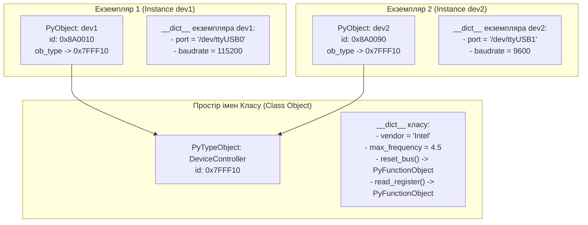
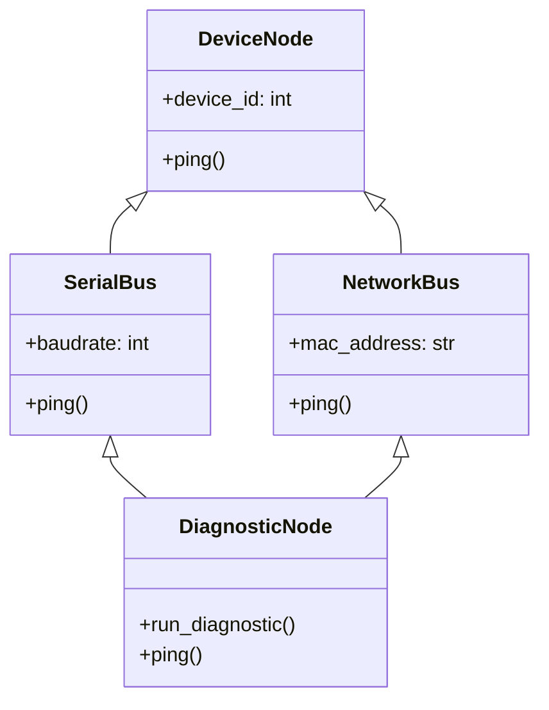
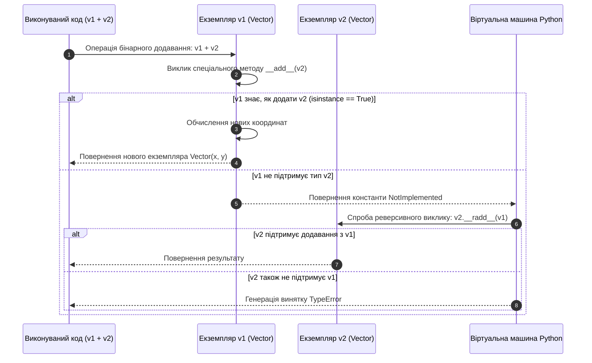

# ЗМІСТОВИЙ МОДУЛЬ 3. ТЕМА 9. ОБ'ЄКТНО-ОРІЄНТОВАНЕ ПРОГРАМУВАННЯ В PYTHON

---

## 9.1. Концепції ООП у Python: класи (class) та об'єкти (екземпляри), ініціалізатор `__init__`, параметр `self`, атрибути класу vs атрибути екземпляру

### Основний зміст та теоретичний базис

Об'єктно-орієнтоване програмування (ООП) є провідною парадигмою інженерії складних програмних систем, що базується на моделюванні предметної області у вигляді сукупності взаємодіючих об'єктів. Кожен об'єкт інкапсулює у собі як поточний інформаційний стан (дані, змінні, поля), так і набір операцій для його обробки (поведінку, функції, методи). У мові програмування Python об'єктно-орієнтований підхід реалізовано як фундаментальний принцип архітектури: усі типи даних, включаючи базові скаляри, списки, модулі та навіть самі функції, є повноправними об'єктами першого класу.

Фундаментальними будівельними блоками ООП виступають поняття класу та об'єкта (екземпляра). **Клас** (`class`) є абстрактним шаблоном, типом даних, визначеним користувачем, який декларує структуру полів та алгоритмічний інтерфейс методів для майбутніх сутностей. **Об'єкт** (екземпляр, *instance*) являє собою конкретну фізичну сутність, створену на основі шаблону класу, яка розміщується у динамічній пам'яті комп'ютера та володіє власним станом.

У системній архітектурі CPython створення класу за допомогою ключового слова `class` є виконуваним оператором. Під час завантаження модуля інтерпретатор створює спеціальний системний об'єкт типу `PyTypeObject`, який описує сам клас і зберігає його простір імен у словнику `Class.__dict__`. 

Створення нового екземпляра класу в пам'яті охоплює дві послідовні фази:
1. Виклик методу-конструктора **`__new__(cls, *args, **kwargs)`**, який відповідає безпосередньо за низькорівневе виділення блоку оперативної пам'яті під новий об'єкт, повертаючи покажчик на створений неініціалізований екземпляр.
2. Виклик методу-ініціалізатора **`__init__(self, *args, **kwargs)`**, який приймає посилання на щойно створений екземпляр через обов'язковий перший параметр `self` і виконує первинне наповнення об'єкта даними (створення та ініціалізацію атрибутів екземпляра).


*Рисунок 1 — Структурна організація просторів імен класу та незалежних екземплярів у пам'яті CPython*

Проаналізуємо схему зв'язків між класом та його екземплярами. Параметр **`self`** є обов'язковим першим аргументом усіх методів екземпляра в Python і є повним семантичним еквівалентом покажчика `this` у мовах C++ та Java. 

Головна відмінність полягає в тому, що в Python передача `self` декларується явно в сигнатурі методу (`def method(self, x):`), проте під час виклику методу через екземпляр (`dev1.method(x)`) віртуальна машина PVM автоматично транслює його у виклик класу з передачею екземпляра як першого аргументу:

$$\text{dev1}.\text{read\_register}(\text{reg\_addr}) \equiv \text{DeviceController}.\text{read\_register}(\text{dev1}, \text{reg\_addr})$$

У комп'ютерній інженерії критично важливо розрізняти **атрибути класу** (*class attributes*) та **атрибути екземпляра** (*instance attributes*):
* Атрибути класу оголошуються безпосередньо в тілі класу поза межами будь-яких методів і розміщуються у словнику `Class.__dict__`. Вони є спільними (статичними) для абсолютно всіх екземплярів цього класу. Модифікація атрибута класу через ім'я класу `DeviceController.vendor = "AMD"` миттєво змінює видиме значення цього поля для всіх існуючих та майбутніх екземплярів.
* Атрибути екземпляра створюються динамічно (зазвичай усередині методу `__init__`) через зв'язування з покажчиком `self` (`self.port = port`). Вони розміщуються в індивідуальному словнику конкретного екземпляра `instance.__dict__` і описують його унікальний апаратний чи логічний стан.

Алгоритм пошуку атрибута у Python працює за ієрархічним принципом: спочатку інтерпретатор сканує локальний словник `instance.__dict__`, у разі відсутності імені — звертається до словника класу `Class.__dict__`, далі — до базових класів за порядком лінеаризації MRO, і лише якщо атрибут не знайдено на жодному рівні, генерується виняток `AttributeError`. 

Якщо розробник спробує присвоїти нове значення атрибуту класу через посилання на екземпляр (`dev1.vendor = "AMD"`), це не змінить спільне значення класу, а створить однойменне локальне поле у словнику `dev1.__dict__`, яке затінить (*shadow*) класовий атрибут для цього конкретного екземпляра.

*Таблиця 9.1 — Порівняльний аналіз атрибутів класу та атрибутів екземпляра*

| Критерій порівняння | Атрибути класу (Class Attributes) | Атрибути екземпляра (Instance Attributes) |
| :--- | :--- | :--- |
| **Місце фізичного зберігання** | Словник простору імен класу `Class.__dict__` | Словник конкретного об'єкта `self.__dict__` |
| **Час виділення пам'яті** | Момент імпорту або компіляції інструкції `class` | Момент виклику `__init__` при створенні об'єкта |
| **Ступінь спільності даних** | Єдине значення для всіх екземплярів (Shared) | Унікальний ізольований стан кожного об'єкта |
| **Вплив мутації через екземпляр** | Створює локальне поле-тінь в `instance.__dict__` | Змінює стан тільки поточного екземпляра |
| **Типове інженерне застосування** | Константи пристрою, загальні лічильники шини | Номери портів, системні дескриптори, буфери |

Порівняння підтверджує, що для зберігання налаштувань, спільних для всієї серії пристроїв, доцільно використовувати атрибути класу, тоді як робочі параметри каналів зв'язку повинні строго інкапсулюватися на рівні екземплярів.

---

## 9.2. Інкапсуляція та захист даних (публічні, захищені `_protected` та приватні `__private` атрибути, механізм name mangling). Наслідування (inheritance), перевизначення методів, функція `super()`, множинне наслідування та MRO (Method Resolution Order)

### Основний зміст та теоретичний базис

**Інкапсуляція** як парадигма об'єктно-орієнтованого проектування полягає в об'єднанні даних та методів їх обробки всередині класу із приховуванням внутрішніх деталей реалізації від зовнішнього втручання. 

На відміну від мов C++ або Java, де інкапсуляція підтримується на рівні компілятора ключовими словами `public`, `protected` та `private`, мова Python реалізує концепцію відкритості архітектури («ми всі дорослі люди»), де захист даних базується на конвенціях іменування:
* **Публічні атрибути (`name`):** доступні для необмеженого читання та модифікації з будь-якої точки кодової бази.
* **Захищені атрибути (`_name`):** позначаються одним провідним символом підкреслення. Це є конвенційною угодою для розробників про те, що атрибут призначений виключно для внутрішнього використання класом та його нащадками; інтерпретатор не накладає технічних заборон на доступ до такого поля, однак статичні аналізатори коду та середовища розробки сигналізують про порушення інкапсуляції.
* **Приватні атрибути (`__name`):** позначаються двома провідними символами підкреслення (без подвійного підкреслення в кінці). Для таких імен інтерпретатор CPython застосовує апаратний механізм **спотворення імен** (**name mangling**).

Механізм спотворення імен полягає в тому, що компілятор синтаксично перетворює будь-який ідентифікатор вигляду `__attribute` у форму `_ClassName__attribute`. Метою цього механізму є не абсолютне приховування даних від зловмисника, а гарантований захист від випадкового перекриття та конфліктів імен при глибокому наслідуванні класів. Прямий доступ до приватного поля через вихідне ім'я `dev.__baudrate` збуджує виняток `AttributeError`, однак технічно доступ залишається можливим через спотворене ім'я `dev._DeviceController__baudrate`.

**Наслідування** (*inheritance*) забезпечує побудову ієрархічних зв'язків між класами, дозволяючи новому похідному класу (*subclass*) успадковувати поля та методи батьківського базового класу (*base class*), розширюючи або модифікуючи їхню поведінку. 

**Перевизначення методів** (*method overriding*) дозволяє класу-нащадку надати власну специфічну реалізацію методу, вже задекларованого у батьківському класі. Для виклику оригінальної реалізації методу базового класу з перевизначеного методу нащадка використовується вбудована проксі-функція **`super()`**, яка динамічно знаходить наступний метод у ланцюжку наслідування без явного жорсткого зазначення імені батьківського класу:

```python
class BaseController:
    def __init__(self, device_id: int):
        self.device_id = device_id

class NetworkController(BaseController):
    def __init__(self, device_id: int, ip_address: str):
        super().__init__(device_id)  # Делегування ініціалізації базовому класу
        self.ip_address = ip_address
```

Мова Python підтримує **множинне наслідування** (*multiple inheritance*), за якого клас може одночасно успадковувати властивості декількох базових класів (`class Controller(SerialInterface, NetworkInterface):`). Головною проблемою множинного наслідування є колізія імен, відома як «проблема ромба» (*diamond problem*), коли два батьківські класи успадковують один і той самий базовий клас, а спільний нащадок повинен однозначно визначити пріоритет виклику перевизначених методів.


*Рисунок 2 — Діаграма множинного ромбоподібного наслідування компонентів комп'ютерної системи*

Для детермінованого розв'язання порядку виклику методів у CPython, починаючи з версії 2.3, застосовується **алгоритм лінеаризації C3** (**C3 Linearization**), який визначає строго фіксований **порядок вирішення методів** (**Method Resolution Order, MRO**). 

Лінеаризація класу $C$, що має батьківські класи $B_1, B_2, \dots, B_k$, являє собою впорядкований список, який складається з самого класу $C$ та злиття лінеаризацій його батьків разом зі списком самих батьків:

$$L(C) = C + \text{merge}\left(L(B_1), L(B_2), \dots, L(B_k), B_1 B_2 \dots B_k\right)$$

де $L(C)$ — результуючий MRO-список класу $C$; операція $+$ позначає конкатенацію послідовностей; функція $\text{merge}$ послідовно вибирає перший клас (голову) зі списків аргументів, який не входить у хвости (будь-яку частину списку, крім голови) інших списків, вилучає його з усіх списків і додає до результату лінеаризації.

Алгоритм C3 Linearization гарантує виконання двох критичних інженерних властивостей: збереження локального порядку слідування батьківських класів та властивість монотонності (якщо клас $X$ передує класу $Y$ у лінеаризації будь-якого базового класу, цей порядок зберігається в усіх похідних класах). 

Переглянути сформований MRO-список будь-якого класу можна через атрибут `Class.__mro__` або метод `Class.mro()`. Якщо користувач проектує ієрархію наслідування, яка суперечить принципу монотонності або створює циклічну залежність, компілятор на етапі створення класу збуджує виняток `TypeError: Cannot create a consistent method resolution order (MRO)`.

*Таблиця 9.2 — Рівні інкапсуляції та захисту атрибутів у мові Python*

| Синтаксичний стиль | Рівень доступу | Механізм інтерпретатора CPython | Правило архітектурного використання |
| :--- | :--- | :--- | :--- |
| **`attr`** | Публічний (Public) | Пряме збереження в `__dict__` | Відкритий інтерфейс, призначений для користувачів |
| **`_attr`** | Захищений (Protected) | Пряме збереження в `__dict__` | Внутрішні методи класу та підкласів (конвенція) |
| **`__attr`** | Приватний (Private) | Спотворення імені у `_ClassName__attr` | Захист від випадкового перекриття в підкласах |
| **`__attr__`** | Системний (Dunder) | Зарезервовано мовою Python | Магічні методи об'єктної моделі (не для полів!) |

Аналіз таблиці показує, що рівні доступу в Python є інструментом координації інженерної розробки, який поєднує дисципліну проектування API із можливістю глибокого системного налагодження.

---

## 9.3. Поліморфізм та спеціальні методи (Dunder/Magic methods). Основи декораторів функцій та методів (`@property`, `@staticmethod`, `@classmethod`)

### Основний зміст та теоретичний базис

**Поліморфізм** у мові Python є здатністю об'єктів різних типів надавати єдиний уніфікований інтерфейс для виконання однотипних за змістом операцій. На відміну від статично типізованих мов, де поліморфізм вимагає явної наявності спільного абстрактного базового класу або інтерфейсу, у Python поліморфізм базується на парадигмі **качиної типізації** (*Duck Typing*: «Якщо воно виглядає як качка, плаває як качка і крякає як качка — це, напевно, качка»). Якщо об'єкт реалізує необхідний набір методів, його можна прозоро використовувати у відповідному алгоритмі незалежно від його положення в дереві наслідування.

Основою об'єктної моделі Python є **спеціальні методи** (відомі як **dunder-методи**, від *double underscore*), які починаються і закінчуються подвійним підкресленням. Спеціальні методи дозволяють користувацьким класам інтегруватися в стандартні системні протоколи мови: рядкове відображення, протокол послідовностей, перевантаження арифметичних операцій, протокол контекстних менеджерів та ітераторів:
* Рядкове відображення: метод `__repr__(self)` повертає точне технічне рядкове представлення об'єкта, орієнтоване на налагодження та розробника (ідеально — вираз, що дозволяє відтворити об'єкт через `eval()`), тоді як метод `__str__(self)` формує людино-читабельний вигляд для виведення через функцію `print()`.
* Протокол колекцій: метод `__len__(self)` викликається функцією `len()` і повертає невід'ємну довжину; метод `__getitem__(self, key)` забезпечує доступ за індексом або зрізом (`obj[key]`).
* Перевантаження операторів порівняння: методи `__eq__` ($==$), `__ne__` ($\neq$), `__lt__` ($<$), `__le__` ($\le$), `__gt__` ($>$), `__ge__` ($\ge$) реалізують компонентне порівняння об'єктів.
* Перевантаження арифметичних операторів: метод `__add__(self, other)` перевизначає оператор додавання `+`, `__sub__` — віднімання `-`, `__mul__` — множення `*`, `__truediv__` — ділення `/`. Для підтримки некомутативних операцій (коли об'єкт користувацького класу стоїть праворуч від скаляра) реалізуються віддзеркалені методи з префіксом `r` (`__radd__`, `__rmul__`).


*Рисунок 3 — Послідовність взаємодії об'єктів при перевантаженні арифметичного оператора додавання*

Діаграма послідовності демонструє протокол узгодження типів у CPython. Якщо лівий операнд повертає константу `NotImplemented`, віртуальна машина автоматично передає керування реверсивному методу правого операнда, забезпечуючи коректну поліморфну взаємодію навіть між різнорідними класами.

Керування методами та властивостями класу здійснюється за допомогою вбудованих **декораторів методів**:
* Декоратор **`@property`** реалізує протокол дескрипторів, дозволяючи звертатися до методу як до звичайного поля даних (`obj.magnitude` замість `obj.magnitude()`). Супутні декоратори `@prop.setter` та `@prop.deleter` забезпечують суворий контроль типів та валідацію діапазонів при запису нового значення, унеможливлюючи встановлення некоректного стану об'єкта.
* Декоратор **`@classmethod`** перетворює метод у метод класу, першим обов'язковим аргументом якого передається не екземпляр `self`, а сам об'єкт класу **`cls`**. Метод класу має доступ до модифікації класових атрибутів і часто використовується для реалізації альтернативних фабричних конструкторів (*factory methods*).
* Декоратор **`@staticmethod`** перетворює метод на статичну функцію, яка фізично розміщується у просторі імен класу, однак не отримує неявних посилань ні на `self`, ні на `cls`. Статичні методи застосовуються для інкапсуляції допоміжних утилітарних функцій, які логічно належать до доменної області класу, але не залежать від його стану.

Розглянемо практичний інженерний приклад: розробку завершеного класу **`HardwareVector`**, призначеного для векторної обробки сигналів просторової орієнтації, у якому реалізовано інкапсуляцію, валідацію через `@property`, фабричний метод `@classmethod`, перевантаження арифметичних операторів та операторів порівняння:

```python
import math
from typing import Union

class HardwareVector:
    """Клас інженерного двовимірного вектора параметрів датчиків."""
    
    # Атрибут класу для аудиту кількості виділених структур
    allocated_vectors_count: int = 0

    def __init__(self, x: float, y: float):
        # Інкапсуляція приватних атрибутів зі спотворенням імен
        self.__x: float = float(x)
        self.__y: float = float(y)
        HardwareVector.allocated_vectors_count += 1

    @property
    def x(self) -> float:
        """Гетер координати X."""
        return self.__x

    @x.setter
    def x(self, value: float) -> None:
        """Сетер координати X з валідацією типу."""
        if not isinstance(value, (int, float)):
            raise TypeError("Координата вектора повинна бути числовим значенням.")
        self.__x = float(value)

    @property
    def y(self) -> float:
        """Гетер координати Y."""
        return self.__y

    @y.setter
    def y(self, value: float) -> None:
        """Сетер координати Y з валідацією типу."""
        if not isinstance(value, (int, float)):
            raise TypeError("Координата вектора повинна бути числовим значенням.")
        self.__y = float(value)

    @property
    def magnitude(self) -> float:
        """Обчислювана властивість: евклідова норма (довжина) вектора."""
        return math.sqrt(self.__x ** 2 + self.__y ** 2)

    @classmethod
    def from_polar(cls, radius: float, angle_rad: float) -> "HardwareVector":
        """Фабричний метод створення вектора з полярних координат."""
        if radius < 0:
            raise ValueError("Радіус у полярній системі не може бути від'ємним.")
        calc_x = radius * math.cos(angle_rad)
        calc_y = radius * math.sin(angle_rad)
        return cls(calc_x, calc_y)

    @staticmethod
    def calculate_dot_product(v1: "HardwareVector", v2: "HardwareVector") -> float:
        """Статичний утилітарний метод обчислення скалярного добутку."""
        return (v1.x * v2.x) + (v1.y * v2.y)

    # --- Спеціальні методи інтерфейсу відображення ---

    def __repr__(self) -> str:
        """Офіційне рядкове представлення для відтворення об'єкта."""
        return f"HardwareVector({self.__x}, {self.__y})"

    def __str__(self) -> str:
        """Користувацьке рядкове представлення для інженерних звітів."""
        return f"Вектор(X={self.__x:.3f}, Y={self.__y:.3f}, Норма={self.magnitude:.3f})"

    # --- Перевантаження арифметичних операторів ---

    def __add__(self, other: Union["HardwareVector", float, int]) -> "HardwareVector":
        """Перевантаження оператора додавання +."""
        if isinstance(other, HardwareVector):
            return HardwareVector(self.__x + other.x, self.__y + other.y)
        elif isinstance(other, (int, float)):
            return HardwareVector(self.__x + other, self.__y + other)
        return NotImplemented

    def __radd__(self, other: Union[float, int]) -> "HardwareVector":
        """Перевантаження віддзеркаленого додавання (скаляр + вектор)."""
        return self.__add__(other)

    def __sub__(self, other: "HardwareVector") -> "HardwareVector":
        """Перевантаження оператора віднімання -."""
        if isinstance(other, HardwareVector):
            return HardwareVector(self.__x - other.x, self.__y - other.y)
        return NotImplemented

    def __mul__(self, scalar: Union[float, int]) -> "HardwareVector":
        """Перевантаження оператора множення на скаляр *."""
        if isinstance(scalar, (int, float)):
            return HardwareVector(self.__x * scalar, self.__y * scalar)
        return NotImplemented

    def __rmul__(self, scalar: Union[float, int]) -> "HardwareVector":
        """Перевантаження віддзеркаленого множення (скаляр * вектор)."""
        return self.__mul__(scalar)

    # --- Перевантаження операторів порівняння ---

    def __eq__(self, other: object) -> bool:
        """Перевантаження оператора рівності == з урахуванням апаратної похибки float."""
        if not isinstance(other, HardwareVector):
            return False
        return math.isclose(self.__x, other.x, rel_tol=1e-9) and math.isclose(self.__y, other.y, rel_tol=1e-9)

    def __lt__(self, other: "HardwareVector") -> bool:
        """Перевантаження оператора менше < за евклідовою нормою."""
        if isinstance(other, HardwareVector):
            return self.magnitude < other.magnitude
        return NotImplemented

    def __len__(self) -> int:
        """Повертає розмірність векторного простору."""
        return 2
```

*Таблиця 9.3 — Базові групи спеціальних dunder-методів у моделі даних Python*

| Категорія протоколу | Dunder-метод | Синтаксичний або функціональний тригер | Математичний / Системний зміст |
| :--- | :--- | :--- | :--- |
| **Життєвий цикл** | `__init__(self, ...)` | `obj = ClassName(...)` | Ініціалізація полів створеного екземпляра |
| **Рядковий вивід** | `__repr__(self)` | `repr(obj)`, інтерактивна консоль | Однозначний технічний рядок стану об'єкта |
| **Рядковий вивід** | `__str__(self)` | `str(obj)`, `print(obj)`, f-рядки | Зручне користувацьке текстове представлення |
| **Порівняння** | `__eq__(self, other)` | `obj1 == obj2` | Перевірка еквівалентності значень полів |
| **Порівняння** | `__lt__(self, other)` | `obj1 < obj2`, сортування `sorted()`| Строге порівняння для впорядкування |
| **Арифметика** | `__add__(self, other)` | `obj1 + obj2` | Векторна або скалярна сума структур |
| **Арифметика** | `__mul__(self, other)` | `obj1 * obj2` | Множення на скаляр або матричний добуток |
| **Колекції** | `__len__(self)` | `len(obj)` | Повернення кількості вимірів або елементів |
| **Колекції** | `__getitem__(self, k)` | `obj[k]` | Доступ до компонентів за індексом або ключем |

Аналіз реалізації класу та таблиці dunder-методів підтверджує, що грамотне використання магічних методів перетворює користувацький клас на органічний елемент мови Python, забезпечуючи високу читабельність коду та математичну строгість операцій.

---

### Питання для самоперевірки та аналітичного осмислення

1. Розкрийте системні відмінності між методом виділення пам'яті `__new__` та методом ініціалізації `__init__` в об'єктній моделі Python. У яких інженерних архітектурних патернах виникає потреба в явному перевизначенні `__new__`?
2. Поясніть фізичний механізм роботи параметра `self`. Чому відсутність `self` у визначенні методу екземпляра викликає виняток `TypeError` під час спроби його виклику через створений об'єкт?
3. Що являє собою механізм спотворення імен (*name mangling*) у CPython? Чому використання приватного атрибута `__attribute` не забезпечує абсолютного захисту від читання ззовні, але надійно захищає від конфліктів при наслідуванні?
4. Сформулюйте сутність алгоритму лінеаризації C3 (C3 Linearization) для розв'язання порядку вирішення методів (MRO). Яким чином MRO усуває неоднозначності при множинному ромбоподібному наслідуванні?
5. Чим принципово відрізняються методи, декоровані за допомогою `@staticmethod` та `@classmethod`? Який із них слід застосовувати для створення альтернативних фабричних конструкторів і чому?
6. Опишіть призначення та протокол роботи декоратора властивості `@property`. Як механізм сетерів (`@property.setter`) запобігає переходу об'єкта в некоректний апаратний стан?
7. Поясніть логіку роботи віртуальної машини CPython при виклику перевантаженого арифметичного оператора додавання `+`. Чому за відсутності підтримки операнда метод `__add__` повинен повертати константу `NotImplemented`, а не збуджувати виняток `TypeError` безпосередньо?