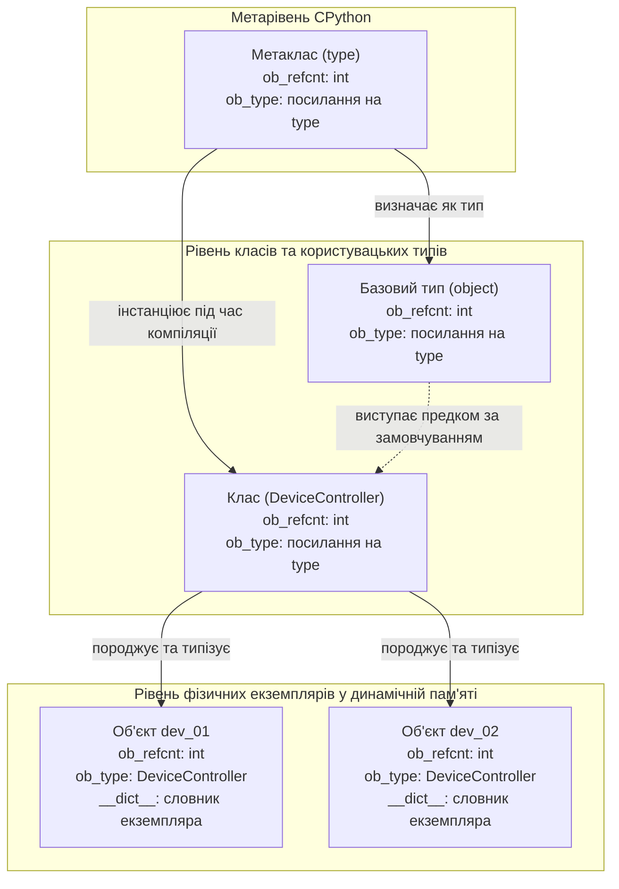
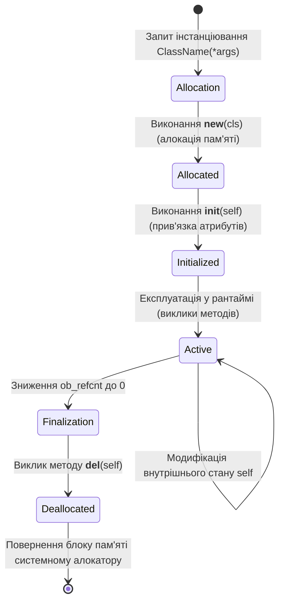
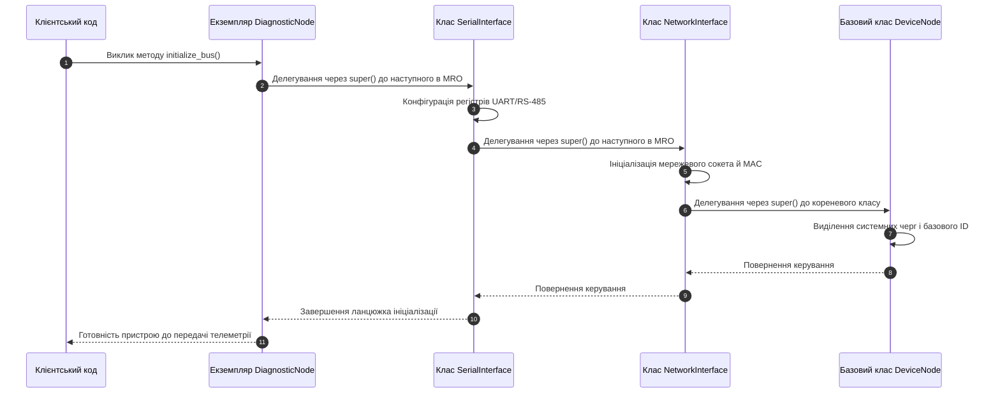
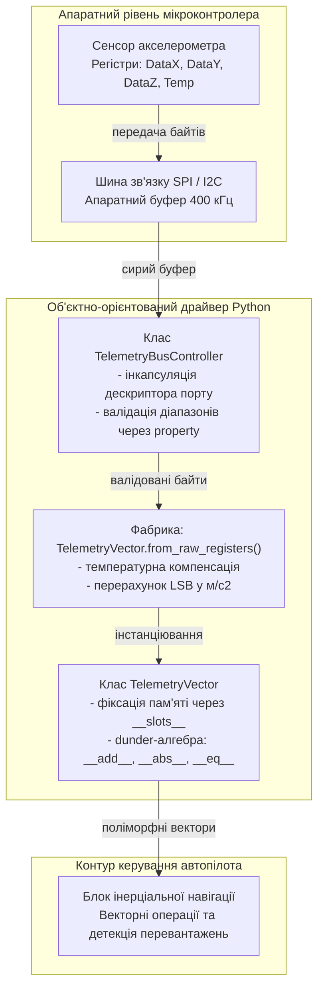

# Тема 9. Об'єктно-орієнтоване програмування в Python

## Мета лекції
Формування у здобувачів вищої освіти системного теоретичного базису та практичних інженерних компетентностей щодо проектування програмного забезпечення на основі парадигми об'єктно-орієнтованого програмування мовою Python, з детальним вивченням життєвого циклу об'єктів у динамічній пам'яті CPython, архітектурних принципів інкапсуляції, наслідування та поліморфізму, специфіки лінеаризації просторів імен за алгоритмом C3 MRO, протоколу спеціальних dunder-методів і дескрипторних декораторів, що є критично необхідним підґрунтям для розробки відмовостійких, модульних і високопродуктивних інформаційно-комунікаційних систем і компонентів вбудованого програмного забезпечення.

## Очікувані результати навчання
1. **Знання та розуміння.** Здобувачі демонструють ґрунтовні знання архітектури об'єктної моделі CPython, механізмів виділення пам'яті конструктором `__new__` та ініціалізації екземплярів методом `__init__`, сутності конвенцій захисту полів через алгоритм спотворення імен, а також математичних правил побудови послідовності дозволу методів MRO за алгоритмом C3.
2. **Застосування.** Здобувачі вміють проектувати складні ієрархії користувацьких класів, реалізовувати протоколи об'єктної взаємодії через перевизначення спеціальних dunder-методів арифметики та порівняння, а також застосовувати вбудовані декоратори методів для створення фабричних конструкторів і динамічної валідації атрибутів.
3. **Аналіз.** Здобувачі здатні аналізувати розгалужені графи множинного наслідування для запобігання колізіям просторів імен і блокуванням лінеаризації MRO, досліджувати внутрішній стан об'єктів через системні словники `__dict__`, а також зіставляти ефективність використання об'єктних структур даних у задачах системного та прикладного програмування.
4. **Оцінювання та синтез.** Здобувачі набувають здатності самостійно синтезувати відмовостійкі програмні модулі для моделювання телеметричних і апаратних вузлів, обґрунтовувати вибір між успадкуванням та композицією, а також критично оцінювати накладні витрати пам'яті й бар'єри багатопотокової безпеки об'єктних моделей під час промислової експлуатації.

---

## Детальний покроковий план лекції

### 1. Теоретико-концептуальний базис. Об'єктна модель CPython та фундаментальні засади проектування класів
* 1.1. Парадигма об'єктно-орієнтованого програмування та системна концепція представлення типів даних у CPython як об'єктів першого класу
* 1.2. Двоетапний життєвий цикл екземпляра в динамічній пам'яті: виділення адреси методом `__new__`, ініціалізація методом `__init__` та семантична роль покажчика `self`
* 1.3. Топологія адресного простору об'єктів: словники простору імен `Class.__dict__` проти `instance.__dict__`, правила пошуку полів і ефект затінення атрибутів класу
* 1.4. Архітектурні рівні доступу до компонентів класу: публічні поля, захищені атрибути за конвенцією PEP 8 та внутрішня дія алгоритму спотворення імен `name mangling` для приватних ідентифікаторів

### 2. Методологія та аналіз граничних умов. Ієрархічні структури наслідування, протоколи спеціальних методів та обмеження моделі
* 2.1. Механізми одиночного і множинного наслідування, делегування викликів базового функціоналу через проксі-об'єкт `super()` та вирішення проблеми ромбоподібної спадковості
* 2.2. Математична формалізація порядку вирішення методів (Method Resolution Order) за алгоритмом лінеаризації C3 та діагностика суперечностей в ієрархіях
* 2.3. Поліморфізм у системі динамічної типізації через парадигму Duck Typing та реалізація протоколів інтерпретатора за допомогою спеціальних dunder-методів
* 2.4. Протокол дескрипторів і керування інтерфейсом: валідація стану за допомогою властивостей `@property`, створення фабрик класовими методами `@classmethod` та утилітарні функції `@staticmethod`
* 2.5. Критичні бар'єри та вузькі місця: накладні витрати динамічних словників екземплярів на пам'ять, неможливість прямої модифікації вбудованих С-типів та вплив блокування GIL на потокобезпеку спільних станів об'єктів

### 3. Практичний індустріальний / фаховий кейс. Проектування архітектури апаратного контролера телеметрії
**Тема наскрізної задачі.** «Розробка об'єктно-орієнтованого драйвера цифрового контролера телеметричних датчиків з інкапсульованою валідацією шини, векторною алгеброю dunder-методів та фабричними методами калібрування»

## 1. Теоретико-концептуальний базис. Об'єктна модель CPython та фундаментальні засади проектування класів

### 1.1. Парадигма об'єктно-орієнтованого програмування та системна концепція представлення типів даних у CPython як об'єктів першого класу

Парадигма об'єктно-орієнтованого програмування виникла як інженерна відповідь на кризу складності програмного забезпечення, спричинену масштабуванням процедурних систем. У процедурній моделі алгоритми обробки жорстко відокремлені від структур даних, якими вони маніпулюють. Такий підхід під час розробки розподілених систем, драйверів телекомунікаційного обладнання або обчислювальних ядер призводить до розмивання відповідальності компонентів, неконтрольованого зростання побічних ефектів через глобальний стан пам'яті та критичного ускладнення супроводу кодової бази. 

Об'єктно-орієнтований підхід долає зазначені деструктивні фактори шляхом реалізації принципу модульності, коли система декомпонується на автономні інформаційні сутності — об'єкти. Кожен об'єкт виступає як закрита функціональна одиниця, що володіє власним дискретним життєвим циклом, внутрішнім адресним станом та сукупністю чітко регламентованих повідомлень, на які він здатен реагувати.

У системній архітектурі мови Python, реалізованій її еталонним інтерпретатором CPython, концепція об'єктно-орієнтованого дизайну доведена до абсолюту через постулат «все є об'єктом першого класу» (*first-class object*). Це означає, що фундаментальні скалярні типи даних, складні структури колекцій, виконувані функції, простори імен модулів і навіть самі класи в пам'яті комп'ютера представлені уніфікованими об'єктними структурами мови C. Будь-яка сутність першого класу може бути динамічно створена під час виконання програми, передана у функцію як аргумент, повернута з підпрограми як результат обчислень і зв'язана зі змінною в поточному просторі імен.

На системному рівні CPython кожен об'єкт розміщується у динамічній пам'яті (*heap*) і базується на структурі `PyObject`. Дана структура містить два критично важливі системні поля: лічильник зовнішніх посилань на об'єкт `ob_refcnt`, який використовується базовим механізмом керування пам'яттю для автоматичного знищення об'єкта при обнулінні звернень, а також покажчик на об'єкт типу `ob_type`. Покажчик `ob_type` адресує спеціальний екземпляр метаструктури `PyTypeObject`, який описує семантику поведінки, розмір пам'яті, доступні системні слоти операцій та методи конкретного типу даних. Якщо об'єкт має змінну довжину, наприклад, як рядок, кортеж або список, його структурою виступає `PyVarObject`, що додає третє обов'язкове системне поле `ob_size`, яке визначає поточну кількість збережених елементів.

Ієрархія типів даних у CPython реалізує замкнену рекурсивну схему типізації, подану нижче. Класи, які визначаються розробником за допомогою інструкції `class`, є повноправними екземплярами метакласу `type`. Сам же метаклас `type` володіє дуалістичною природою: він виступає типом для самого себе і одночасно успадковує поведінку від базового предка всіх об'єктних структур — класу `object`.



Структурна організація просторів імен виключає необхідність жорсткої бінарної сумісності компільованого коду, оскільки динамічний пошук атрибутів через таблиці типів виконується у рантаймі без прив'язки до статичних зсувів пам'яті.

> **ПРАКТИЧНИЙ ЯКІР:** У промисловому програмному забезпеченні базових станцій стільникового зв'язку стандарту 5G NR концепція представлення пристроїв як об'єктів першого класу дозволяє реалізувати механізм гарячої заміни драйверів антенних фазованих решіток: під час зміни конфігурації сектору система завантажує новий об'єкт-клас контролера безпосередньо з мережевого сокета й інстанціює його на льоту, не зупиняючи базові процеси маршрутизації транзитного трафіку.

### 1.2. Двоетапний життєвий цикл екземпляра в динамічній пам'яті: виділення адреси методом `__new__`, ініціалізація методом `__init__` та семантична роль покажчика `self`

У багатьох класичних мовах програмування конструювання об'єкта є неподільною атомарною операцією, однак у середовищі CPython процес появи нового екземпляра класу чітко розмежований на дві послідовні фази: безпосереднє низькорівневе створення екземпляра в адресному просторі та його подальше функціональне наповнення. 

Першим виконується спеціальний статичний метод-алокатор **`__new__(cls, *args, **kwargs)`**. Цей метод приймає як перший обов'язковий аргумент сам об'єкт класу `cls`, для якого створюється екземпляр, і повертає посилання на щойно виділений у купі сегмент пам'яті типу `PyObject`. Оскільки метод `__new__` відповідає безпосередньо за фізичне формування об'єкта, саме він перехоплюється розробниками під час створення синглтонів (*Singleton*), побудови пулів об'єктів для оптимізації мережевих буферів або під час успадкування незмінних (*immutable*) базових типів, таких як цілі числа чи кортежі, внутрішній стан яких не може бути змінений після фізичного створення.

Якщо метод `__new__` успішно повертає створений екземпляр свого ж класу, віртуальна машина PVM негайно ініціює другу фазу, автоматично викликаючи метод **`__init__(self, *args, **kwargs)`**. На відміну від конструктора в C++ або Java, метод `__init__` у Python є суто ініціалізатором: він не повертає значення (його спроба повернути будь-що, крім системного об'єкта `None`, породжує фатальний виняток `TypeError`) і приймає у параметрі `self` посилання на вже існуючий у пам'яті «порожній» об'єкт. Основне призначення `__init__` полягає у визначенні початкових значень полів об'єкта та підготовці зовнішніх дескрипторів системних ресурсів.

Життєвий цикл будь-якого програмного об'єкта від моменту запиту пам'яті до повернення байтів у пул інтерпретатора демонструє наведена діаграма станів.



Параметр **`self`** є базовою семантичною конструкцією методів екземпляра в Python. Він не є зарезервованим ключовим словом інтерпретатора, але згідно з конвенцією консорціуму розробників PEP 8 виступає безальтернативним ім'ям для першого аргументу будь-якого стандартного методу класу. Фізично `self` містить пряме посилання на ту область динамічної пам'яті, де розміщено дані конкретного екземпляра, що викликає цей метод.

У процесі виклику методу через екземпляр транслювання інструкції здійснюється за формалізованим математичним правилом передачі контексту зв'язаного методу:

$$\text{Call}(\text{inst}, \text{method}, \vec{a}) \iff \text{inst}.\text{method}(a_1, \dots, a_n) \equiv \text{Class}.\text{method}(\text{inst}, a_1, \dots, a_n)$$

де $\text{inst}$ — конкретний екземпляр класу $\text{Class}$ у динамічній пам'яті комп'ютера;
$\text{method}$ — символьне ім'я методу, задекларованого у просторі імен класу;
$\vec{a} = (a_1, a_2, \dots, a_n)$ — кортеж фактичних параметрів, що передаються у метод користувацьким кодом;
$\text{Call}$ — предикат виклику функції, що зв'язує фізичну адресу об'єкта $\text{inst}$ із формальним аргументом `self`.

Якщо розробник допускає виклик функції без параметра `self` через об'єкт, PVM генерує системний виняток `TypeError`, сигналізуючи про невідповідність арності функції, оскільки екземпляр передається у стековий фрейм інтерпретатора першим прихованим позиційним аргументом за замовчуванням.

### 1.3. Топологія адресного простору об'єктів: словники простору імен `Class.__dict__` проти `instance.__dict__`, правила пошуку полів і ефект затінення атрибутів класу

Для забезпечення надзвичайної гнучкості динамічної типізації CPython організує адресний простір об'єктів не як жорсткі статичні структури з фіксованими зсувами, а за допомогою оптимізованих хеш-таблиць. Простір імен класу та простори імен кожного з його екземплярів фізично розмежовані у пам'яті і функціонують як повністю незалежні словники.

Словник класу доступний через спеціальний атрибут `Class.__dict__` і повертає незмінний об'єкт-проксі типу `mappingproxy`. У ньому зберігаються сигнатури та компільовані об'єкти функцій (методи), а також **атрибути класу**, які оголошуються безпосередньо в тілі блоку `class` поза межами будь-яких вкладених підпрограм. На противагу цьому, кожен окремий екземпляр володіє власним мутабельним словником `instance.__dict__`, призначеним для зберігання **атрибутів екземпляра**, які зв'язуються через покажчик `self` переважно всередині методу `__init__`.

Алгоритм резолвінгу ідентифікатора під час звернення за синтаксисом читання `instance.attribute` підпорядковується суворому правилу ієрархічного каскаду:

$$\mathcal{R}(o, \alpha) = \begin{cases} 
o.\_\_dict\_\_[\alpha], & \text{якщо } \alpha \in o.\_\_dict\_\_, \\ 
C.\_\_dict\_\_[\alpha], & \text{якщо } \alpha \notin o.\_\_dict\_\_ \land \alpha \in C.\_\_dict\_\_, \\ 
\mathcal{MRO}(C, \alpha), & \text{якщо } \alpha \notin o.\_\_dict\_\_ \land \alpha \notin C.\_\_dict\_\_ \land \exists \text{ предки}
\end{cases}$$

де $o$ — цільовий об'єкт-екземпляр, до якого здійснюється програмний доступ;
$C$ — клас об'єкта, визначений за системним покажчиком $o\text{.ob\_type}$;
$\alpha$ — рядковий ідентифікатор шуканого атрибута або методу;
$\mathcal{R}(o, \alpha)$ — резолвінг-функція, що повертає посилання на знайдений у пам'яті об'єкт;
$\mathcal{MRO}(C, \alpha)$ — послідовний пошук за графом предків класу відповідно до порядку дозволу методів.

Якщо атрибут відсутній у локальному словнику `instance.__dict__`, механізм диспетчеризації звертається до словника класу `Class.__dict__`, а за необхідності — рекурсивно перевіряє базові класи. 

Ця ієрархічна модель створює специфічний інженерний ефект — **затінення атрибутів класу** (*class attribute shadowing*). Коли значення викликається для читання (`val = inst.attr`), і атрибут відсутній у `instance.__dict__`, повертається спільне для всіх об'єктів значення з `Class.__dict__`. Однак щойно виконується операція запису через посилання на екземпляр (`inst.attr = new_val`), інтерпретатор ніколи не змінює вміст словника класу: замість цього у внутрішньому словнику `inst.__dict__` динамічно створюється новий запис із ключем `attr`. Від цього моменту для даного конкретного екземпляра спільне поле класу стає невидимим, оскільки пошук за правилом $\mathcal{R}(o, \alpha)$ термінується на першому кроці.

> **ТИПОВА ПОМИЛКА:** Розповсюдженою архітектурною помилкою серед розробників є оголошення змінюваних об'єктів, наприклад, списків або словників, як атрибутів самого класу з наміром використовувати їх як індивідуальні буфери обміну кожного екземпляра. Оскільки атрибут класу створюється в єдиному екземплярі в `Class.__dict__`, виконання операцій додавання на кшталт `self.telemetry_buffer.append(data)` не ініціює перезапис через створення локального ключа, а модифікує спільний список за посиланням; у результаті виникає критичне змішування даних різних пристроїв, коли запис у буфер одним контролером неконтрольовано спотворює телеметричний контекст усіх інших вузлів мережі.

*Таблиця 1.1 — Порівняльна систематизація механізмів організації та зберігання даних об'єкта в Python*

| Рівень зберігання | Фізична локалізація в CPython | Область та час існування | Вплив на пам'ять системи | Приклад з реальної практики |
| :--- | :--- | :--- | :--- | :--- |
| **Атрибут екземпляра** | Хеш-таблиця `instance.__dict__` | Ізольовано в межах життєвого циклу конкретного об'єкта | Окремий словник для кожного екземпляра з накладними витратами хеш-таблиці | Індивідуальний мережевий IP-порт приймача телеметрії |
| **Атрибут класу** | Хеш-таблиця `Class.__dict__` | Єдиний екземпляр у просторі імен класу протягом роботи програми | Економічний, розподіляється між усіма екземплярами без дублювання | Максимально допустима пропускна здатність радіоканалу зв'язку |
| **Локальна змінна методу** | Масив стекового фрейму `PyFrameObject` | Створюється під час входу в метод і знищується при виході | Виділяється в оперативному стеку процесу, мінімальне споживання | Тимчасовий лічильник ітерацій обчислення контрольної суми CRC32 |
| **Властивість (`@property`)** | Слот класу, що реалізує протокол дескрипторів | Постійно зберігається у класі як об'єкт-дескриптор | Практично відсутні накладні витрати на рівні екземпляра | Динамічно розрахований коефіцієнт бітових помилок BER каналу |

Систематизація доводить, що для уникнення перевитрати оперативної пам'яті константні параметри підсистем завжди слід виносити на рівень атрибутів класу, тоді як робочі параметри стану поточних комунікацій вимагають суворої ізоляції на рівні екземпляра.

### 1.4. Архітектурні рівні доступу до компонентів класу: публічні поля, захищені атрибути за конвенцією PEP 8 та внутрішня дія алгоритму спотворення імен `name mangling` для приватних ідентифікаторів

Парадигма інкапсуляції передбачає надійне приховування внутрішньої структури модуля з метою запобігання переходу об'єкта в некоректний або невизначений стан через пряме втручання зовнішнього коду. 

На рівні компіляторів мов C++ або C# обмеження доступу гарантується бінарною перевіркою модифікаторів `public`, `protected` та `private`. Мова Python реалізує кардинально іншу філософію проектування, що базується на принципі високої прозорості архітектури та взаємної довіри між розробниками програмних модулів:

1. Публічні атрибути оголошуються стандартними ідентифікаторами без використання префіксних підкреслень, наприклад, `device_id` або `baudrate`. Доступ до таких полів відкритий для читання та прямої мутації з будь-якого сегмента програми.
2. Захищені атрибути маркуються рівно одним провідним символом підкреслення, наприклад, `_rx_buffer` або `_calibration_matrix`. Цей префікс не викликає технічних обмежень з боку віртуальної машини CPython: інтерпретатор обробляє такий атрибут абсолютно ідентично до публічного. Проте згідно з регламентом стандарту консорціуму PEP 8 даний атрибут декларується як непублічний компонент API, призначений виключно для внутрішньої реалізації самого класу та його прямих нащадків. Порушення цієї конвенції сигналізується статичними аналізаторами коду та інструментами лінтування (*linters*).
3. Приватні атрибути маркуються мінімум двома провідними підкресленнями за відсутності більше ніж одного завершального підкреслення, наприклад, `__hardware_key` або `__system_register`. 

Для приватних атрибутів інтерпретатор застосовує обов'язковий апаратний механізм компілятора — **спотворення імен** (**name mangling**). Якщо розробник оголошує змінну `__field` у класі `Transceiver`, компілятор під час формування байт-коду автоматично перетворює кожне входження цього імені на синтаксичну конструкцію вигляду `_Transceiver__field`.

Головною метою алгоритму спотворення імен є не надання абсолютного криптографічного захисту від читання зловмисником, а гарантоване виключення колізій просторів імен при глибокому наслідуванні. Якщо клас-нащадок задекларує приватне поле з аналогічною назвою `__field`, його ім'я трансформується у `_SubTransceiver__field`. Обидва поля безпечно співіснуватимуть у єдиному словнику екземпляра `instance.__dict__`, унеможливлюючи випадкове перезаписування приватного стану базового класу методами підкласу. Пряме звернення на кшталт `inst.__hardware_key` миттєво викликає помилку `AttributeError`, оскільки ключа з такою назвою у словнику фізично немає, проте повний доступ зберігається через явне зазначення спотвореного імені `inst._Transceiver__hardware_key`.

> **ПРАКТИЧНИЙ ЯКІР:** Під час розробки вбудованого мікрокоду для контролерів бортової мережі CAN (*Controller Area Network*) приватні атрибути із захистом через механізм спотворення імен застосовуються для конфігураційних бітових масок фільтрації повідомлень: якщо сторонній розробник створює прикладний плагін обробки датчиків на базі системного класу, автоматичне модифікування імен унеможливлює випадкове скидання системних бітів безпеки базового драйвера шини.

> **КОНТРОЛЬНЕ ПИТАННЯ:** Чому розробники мовної специфікації Python навмисно виключили застосування алгоритму спотворення імен для спеціальних системних ідентифікаторів, які починаються і закінчуються двома символами підкреслення (dunder-методи на кшталт `__init__`, `__len__`, `__repr__`), незважаючи на наявність префіксу з двох підкреслень?

<details markdown="1">
<summary>Розгорнути аналіз / відповідь</summary>

**Правильний варіант: Забезпечення передбачуваного поліморфного зв'язування за фіксованими протоколами віртуальної машини.**

1. Логічне та архітектурне обґрунтування: Системні dunder-методи формують публічний протокол взаємодії віртуальної машини PVM з об'єктом. Коли інтерпретатор виконує системні операції `len(obj)` або `obj + other`, внутрішній C-код PVM напряму звертається до слотів типу `tp_as_sequence` або `tp_as_number`, шукаючи суворо визначені імена `__len__` чи `__add__`. Якби до них застосовувався алгоритм `name mangling`, ім'я методу перетворилося б на `_ClassName__len__`, що повністю заблокувало б можливість для віртуальної машини викликати поліморфний інтерфейс об'єкта єдиним стандартизованим шляхом через базові протоколи.

2. Аналіз дистракторів (чому інші підходи є хибними на практиці): Припущення, що подвійні підкреслення на початку і в кінці слугують лише для візуального виділення, є хибним, оскільки лексичний аналізатор компілятора Python містить окрему синтаксичну інструкцію, яка явно вимикає механізм спотворення імен для ідентифікаторів, що мають патерн регулярного виразу `^__.*__$`. Також неможливо вважати це випадковим недоглядом, адже порушення цього правила зруйнувало б увесь механізм поліморфізму базової моделі даних.

</details>

### Вказівки для самостійного осмислення

1. Дослідіть за допомогою стандартних функцій `id()`, `type()` та модуля `sys` обсяг споживання оперативної пам'яті новоствореним порожнім екземпляром базового класу `object` порівняно з екземпляром користувацького класу, який містить три ініціалізовані чисельні атрибути в словнику `__dict__`, та складіть пояснення виявленої різниці у байтах.
2. Проаналізуйте наслідки використання статичного методу-алокатора `__new__` для створення класу, що реалізує патерн проектування «Одинак» (*Singleton*), сформулювавши алгоритмічну послідовність дій для випадків, коли повторний виклик створення об'єкта повинен повертати посилання на раніше ініціалізований блок пам'яті без повторного скидання його полів методом `__init__`.
3. Сформулюйте вичерпний перелік технічних ризиків, що виникають під час прямого читання або примусової модифікації приватних полів через їхнє спотворене ім'я `_ClassName__private_field` в обхід публічного інтерфейсу класу, звертаючи особливу увагу на наслідки подальшого рефакторингу вихідного коду базового класу та версійної сумісності сторонніх бібліотек.

## 2. Методологія та аналіз граничних умов. Ієрархічні структури наслідування, протоколи спеціальних методів та обмеження моделі

### 2.1. Механізми одиночного і множинного наслідування, делегування викликів базового функціоналу через проксі-об'єкт `super()` та вирішення проблеми ромбоподібної спадковості

У складних інженерних проектах наслідування виступає фундаментальним інструментом таксономічної організації коду, що дозволяє вибудовувати ієрархії від узагальнених абстракцій до спеціалізованих апаратних або програмних сутностей. Якщо при одиночному наслідуванні зв'язок між базовим та похідним класом є лінійним і тривіальним, то реалізація множинного наслідування породжує проблему неоднозначності диспетчеризації методів, історично відому як «проблема ромба» (*diamond problem*). Вона виникає тоді, коли два проміжні класи наслідують спільний базовий клас, а кінцевий клас-нащадок агрегує функціонал обох проміжних вузлів. За наївної реалізації спроба викликати конструктор або метод предка прямим зазначенням імені класу призводить до дублювання виконання інструкцій кореневого класу, розсинхронізації внутрішнього стану об'єкта або витоку пам'яті під час повторної алокації буферів.

Для розв'язання цієї колізії мова Python застосовує концепцію кооперативного множинного наслідування, реалізовану через вбудований проксі-об'єкт **`super()`**. На відміну від багатьох інших мов програмування, де аналогічні конструкції жорстко адресують прямий батьківський клас у висхідній лінії, у Python виклик `super()` повертає спеціальний дескриптор, який делегує виконання методу наступному класу згідно з лінійним порядком дозволу методів (*Method Resolution Order, MRO*) того об'єкта, через який було ініційовано первинний виклик. 



Наведена діаграма демонструє принцип кооперативної диспетчеризації: кожен клас в ієрархії перехоплює виконання, реалізує власну частину конфігурації обладнання та передає керування далі за допомогою виклику `super().method_name()`. Головним інваріантом цієї моделі є узгодженість сигнатур методів у всьому ланцюжку кооперації.

> **ВАЖЛИВО:** Застосування кооперативного наслідування через `super()` вимагає суворого дотримання принципу транзитивності параметрів: якщо один із проміжних класів утилізує жорстко закодований виклик предка на кшталт `BaseClass.__init__(self)` замість виклику `super()`, глобальний ланцюжок лінеаризації MRO розривається, що призводить до пропуску ініціалізації цілих гілок дерева успадкування або непередбачуваного повторного виконання коду.

### 2.2. Математична формалізація порядку вирішення методів (Method Resolution Order) за алгоритмом лінеаризації C3 та діагностика суперечностей в ієрархіях

Для детермінованого перетворення довільного ациклічного графа наслідування у лінійну послідовність викликів інтерпретатор CPython використовує **алгоритм лінеаризації C3** (*C3 Linearization*). Цей алгоритм базується на трьох фундаментальних аксіомах: збереженні локального порядку слідування безпосередніх батьківських класів, монотонності (порядок перегляду класів, визначений для предка, залишається незмінним для всіх його нащадків) та збереженні правила розширеного відбору предка за ознакою єдиності.

Нехай клас $C$ успадковує батьківські класи $B_1, B_2, \dots, B_k$, а $O$ є абсолютним кореневим предком об'єктної моделі `object`. Лінеаризація $L(C)$ визначається як упорядкований список, утворений додаванням класу $C$ до результату спеціальної операції злиття ($\text{merge}$) лінеаризацій усіх його батьків і списку самих батьків:

$$L(C) = [C] + \text{merge}\left(L(B_1), L(B_2), \dots, L(B_k), [B_1, B_2, \dots, B_k]\right)$$

де операція $+$ позначає конкатенацію послідовностей, а функція $\text{merge}$ діє за ітеративним правилом: вона обирає перший елемент (голову) першого списку аргументів, який не міститься у хвості (усі елементи списку після голови) жодного іншого списку; знайдений елемент додається до результуючої лінеаризації і видаляється з усіх списків процесу злиття. Якщо на певному кроці неможливо знайти жодного елемента, що задовольняє цю умову, лінеаризація вважається неможливою, і компілятор відхиляє створення класу.

Розглянемо покроковий формалізований процес обчислення MRO для класичної інженерної ромбоподібної конфігурації, де клас вузла діагностики $\text{Diag}$ успадковує інтерфейси послідовної шини $\text{Serial}$ та мережевого адаптера $\text{Net}$, які у свою чергу походять від базового контролера $\text{Dev}$:

$$
\begin{aligned}
\text{Крок 1 (Лінеаризація кореня):} & \quad L(\text{Dev}) = [\text{Dev}, O] \\
\text{Крок 2 (Лінеаризація Serial):} & \quad L(\text{Serial}) = [\text{Serial}] + \text{merge}(L(\text{Dev}), [\text{Dev}]) = [\text{Serial}, \text{Dev}, O] \\
\text{Крок 3 (Лінеаризація Net):} & \quad L(\text{Net}) = [\text{Net}] + \text{merge}(L(\text{Dev}), [\text{Dev}]) = [\text{Net}, \text{Dev}, O] \\
\text{Крок 4 (Злиття предків Diag):} & \quad L(\text{Diag}) = [\text{Diag}] + \text{merge}(L(\text{Serial}), L(\text{Net}), [\text{Serial}, \text{Net}]) \\
\text{Крок 5 (Редукція голови Serial):} & \quad \text{merge}([\text{Serial}, \text{Dev}, O], [\text{Net}, \text{Dev}, O], [\text{Serial}, \text{Net}]) \to \text{Serial} \\
\text{Крок 6 (Редукція голови Net):} & \quad \text{merge}([\text{Dev}, O], [\text{Net}, \text{Dev}, O], [\text{Net}]) \to \text{Net} \\
\text{Крок 7 (Редукція вузла Dev):} & \quad \text{merge}([\text{Dev}, O], [\text{Dev}, O]) \to \text{Dev} \\
\text{Крок 8 (Фіналізація лінеаризації):} & \quad L(\text{Diag}) = [\text{Diag}, \text{Serial}, \text{Net}, \text{Dev}, O]
\end{aligned}
$$

де $O$ позначає клас `object`, що замикає будь-яку гілку лінеаризації.

Аналіз граничних умов показує, що алгоритм C3 перестає функціонувати в ситуаціях порушення монотонності порядку оголошення. Якщо у кодовій базі задекларовано базові класи $X$ та $Y$, похідний клас $A(X, Y)$, паралельний похідний клас $B(Y, X)$, а потім створюється спільний спадкоємець $C(A, B)$, виникає нерозв'язна циклічна суперечність: у лінеаризації класу $A$ клас $X$ зобов'язаний передувати $Y$, тоді як у лінеаризації $B$ клас $Y$ повинен суворо передувати $X$. За таких умов функція $\text{merge}$ фіксує перехресне блокування списків і інтерпретатор перериває компіляцію модуля аварійним винятком `TypeError: Cannot create a consistent method resolution order (MRO)`.

### 2.3. Поліморфізм у системі динамічної типізації через парадигму Duck Typing та реалізація протоколів інтерпретатора за допомогою спеціальних dunder-методів

Поліморфізм у мові Python відрізняється від традиційної строго типізованої моделі, оскільки не спирається на наявність спільних абстрактних інтерфейсів на етапі компіляції. Замість цього використовується динамічна концепція **качиної типізації** (*Duck Typing*), згідно з якою придатність об'єкта для участі в обчислювальному процесі визначається виключно наявністю у нього необхідного набору методів і атрибутів у момент виклику.

Основою реалізації протоколів мови виступають спеціальні dunder-методи. Інтерпретатор PVM транслює синтаксичні операції безпосередньо у виклики слотів низькорівневої структури `PyTypeObject`:
1. Протокол ітерування реалізується парою методів `__iter__()` та `__next__()`, забезпечуючи безперервний конвеєрний потік елементів без завантаження всієї вибірки у пам'ять.
2. Протокол контекстного менеджера транслює інструкцію `with` у гарантовані виклики методів `__enter__()` та `__exit__()`, що є обов'язковим інженерним стандартом для керування файловими дескрипторами, мережевими з'єднаннями та системними м'ютексами.
3. Протокол послідовностей регламентує індексацію та отримання зрізів через метод `__getitem__(self, key)`, визначення потужності через `__len__(self)` та модифікацію за індексом через `__setitem__(self, key, value)`.

Граничні умови качиної типізації виявляються у критичних сценаріях, коли об'єкт симулює поведінку цільового протоколу лише частково. Якщо користувацький клас телеметричного пакета реалізує метод `__len__()`, але не реалізує метод `__getitem__()`, алгоритми потокового читання успішно проходять перевірку на довжину, проте зазнають аварійної зупинки під час спроби доступу за індексом. 

Для усунення цієї вразливості у високонадійних промислових системах застосовується комбінація качиної типізації з абстрактними базовими класами модуля `collections.abc`. Шляхом реєстрації спеціальних методів перевірки `__subclasshook__` розробник отримує змогу перевіряти сумісність об'єкта з протоколом через стандартні виклики `isinstance(obj, Sequence)`, не руйнуючи при цьому гнучкості динамічної моделі.

### 2.4. Протокол дескрипторів і керування інтерфейсом: валідація стану за допомогою властивостей `@property`, створення фабрик класовими методами `@classmethod` та утилітарні функції `@staticmethod`

Механізм зв'язування атрибутів у CPython спирається на низькорівневий **протокол дескрипторів**. Дескриптором є будь-який об'єкт класу, що реалізує щонайменше один із магічних методів: `__get__(self, instance, owner)`, `__set__(self, instance, value)` або `__delete__(self, instance)`. 

Якщо об'єкт визначає метод `__set__`, він класифікується як **дескриптор даних** (*data descriptor*). Дескриптори даних мають найвищий пріоритет у ланцюжку пошуку атрибутів: їхня дія передує навіть перевірці локального словника `instance.__dict__`. Якщо ж реалізовано лише метод `__get__`, об'єкт виступає **дескриптором без даних** (*non-data descriptor*), чий пріоритет нижчий за вміст локального словника екземпляра.

Вбудований декоратор **`@property`** є канонічною реалізацією дескриптора даних. Він дозволяє замінити прямий доступ до змінної викликом захищених підпрограм валідації без зміни синтаксису клієнтського звернення:

```python
class TelemetryChannel:
    def __init__(self, frequency_hz: float):
        self._frequency_hz = None
        self.frequency_hz = frequency_hz  # Активація сетера на етапі ініціалізації

    @property
    def frequency_hz(self) -> float:
        """Гетер: читання частоти каналу зв'язку."""
        return self._frequency_hz

    @frequency_hz.setter
    def frequency_hz(self, value: float) -> None:
        """Сетер: сувора валідація апаратного діапазону частот."""
        if not isinstance(value, (int, float)):
            raise TypeError("Значення частоти повинно належати до числового типу.")
        if not (100e6 <= value <= 6e9):
            raise ValueError("Частота виходить за межі діапазону 100 МГц - 6 ГГц.")
        self._frequency_hz = float(value)
```

Декоратор **`@classmethod`** перетворює звичайний метод у дескриптор, який під час зв'язування завжди передає першим аргументом сам об'єкт класу `cls`. Це дозволяє проектувати надійні альтернативні конструктори (фабричні методи), що адаптують зовнішні потоки сирих даних (наприклад, бінарні пакети, конфігурації JSON або рядки форматів зв'язку) до формату класу з коректною підтримкою подальшого успадкування. 

На відміну від нього, декоратор **`@staticmethod`** повністю блокує інструменти зв'язування: декорована функція залишається звичайною підпрограмою, інкапсульованою у просторі імен класу виключно з міркувань логічної модульності, не маючи доступу ні до стану екземпляра `self`, ні до структури класу `cls`.

### 2.5. Критичні бар'єри та вузькі місця: накладні витрати динамічних словників екземплярів на пам'ять, неможливість прямої модифікації вбудованих С-типів та вплив блокування GIL на потокобезпеку спільних станів об'єктів

Практичне застосування об'єктної моделі Python у високонавантажених обчислювальних середовищах та системах реального часу стикається з трьома критичними архітектурними обмеженнями, які здатні нівелювати ефективність розробки:

По-перше, системна організація кожного екземпляра на базі мутабельної хеш-таблиці `instance.__dict__` спричиняє катастрофічні накладні витрати пам'яті. У 64-бітній версії CPython порожній екземпляр класу разом зі своїм внутрішнім словником споживає понад 150 байтів, що в умовах обробки телеметричних масивів із мільйонами елементів призводить до гігабайтних перевитрат пам'яті та постійної деградації кешу процесора. 

Інженерним засобом подолання цього бар'єра є декларація спеціального класового атрибута **`__slots__`**, який замінює словник статичним C-масивом покажчиків фіксованого розміру:

```python
class OptimizedPacket:
    # Заборона створення __dict__ та фіксація структури в пам'яті
    __slots__ = ('packet_id', 'timestamp', 'payload_size')

    def __init__(self, packet_id: int, timestamp: float, payload_size: int):
        self.packet_id = packet_id
        self.timestamp = timestamp
        self.payload_size = payload_size
```

Використання `__slots__` зменшує споживання пам'яті екземпляром у 4–5 разів, однак створює жорсткі граничні умови: об'єкт втрачає можливість динамічного додавання полів у рантаймі, множинне успадкування від двох класів із непорожніми несумісними слотами забороняється віртуальною машиною, а некоректне застосування ускладнює серіалізацію через модуль `pickle`.

По-друге, вбудовані типи даних CPython (`int`, `str`, `list`, `dict`), реалізовані мовою C, володіють незмінними словниками типів. Спроба безпосередньо модифікувати простір імен базового типу за допомогою команди `int.custom_method = func` викликає виняток `TypeError: can't set attributes on built-in/extension type`. Більше того, пряме успадкування від вбудованих класів містить внутрішні пастки: методи ядра CPython, написані на C, часто викликають оптимізовані внутрішні функції в обхід перевизначених користувачем методів (наприклад, метод `dict.update` ігнорує перевизначений у нащадку `__setitem__`). Для побудови надійних користувацьких структур даних методологічно вимагається наслідувати класи-обгортки модуля `collections` (`UserDict`, `UserList`).

По-третє, глобальне блокування інтерпретатора (**Global Interpreter Lock, GIL**) у CPython накладає суворі обмеження на парадигму ООП у багатопотокових додатках. Попри те, що GIL гарантує атомарність оновлення внутрішніх лічильників посилань самої віртуальної машини, він категорично не забезпечує безпеку багатопотокової модифікації (*thread safety*) атрибутів об'єкта на рівні прикладного коду. 

Інструкція модифікації числового поля екземпляра `self.counter += 1` транслюється віртуальною машиною у послідовність із чотирьох незалежних опкодів байт-коду:

$$
\begin{aligned}
\text{Опкод 1:} & \quad \text{LOAD\_FAST / LOAD\_ATTR (читання поточного значення атрибута)} \\
\text{Опкод 2:} & \quad \text{LOAD\_CONST (завантаження константи інкременту)} \\
\text{Опкод 3:} & \quad \text{INPLACE\_ADD (обчислення суми на верхівці стека)} \\
\text{Опкод 4:} & \quad \text{STORE\_ATTR (запис нового посилання у словник екземпляра)}
\end{aligned}
$$

Перемикання потоків у CPython може відбутися в інтервалі між виконанням будь-яких двох опкодів, що за відсутності явних апаратних або програмних блокувань (`threading.Lock`) неминуче призводить до втрати оновлень (*race condition*) та фатального спотворення внутрішнього стану складних об'єктів.

> **ПРАКТИЧНИЙ ЯКІР:** У розподіленому обчислювальному фреймворку Celery та мережевих драйверах високочастотної фінансової торгівлі (HFT) надзвичайно жорстко регламентується використання `__slots__`: відмова від динамічних `__dict__` для об'єктів обробки транзакцій дозволяє оптимізувати роботу збірника сміття CPython, знижуючи латентність затримок обробки запитів на величину до 35% за рахунок збереження стабільності L1/L2-кешів процесора.

*Таблиця 2.1 — Аналітична матриця архітектурних підходів до композиції об'єктних моделей у Python*

| Архітектурний підхід | Механізм зв'язування компонентів | Складність впровадження | Критичні ризики / Обмеження | Сфера інженерного застосування |
| :--- | :--- | :--- | :--- | :--- |
| **Одиночне наслідування** | Статична висхідна лінеаризація за $L(C)$ | Низька: стандартне проектування класів | Жорстка прив'язка до батьківського класу, обмеження рефакторингу | Прості моделі сутностей з прямою ієрархією |
| **Множинне наслідування (Mixins)** | Динамічне злиття списків алгоритмом C3 | Висока: вимагає координації через `super()` | Загроза блокування MRO, небезпека затінення прихованих методів | Розширення класів незалежним системним функціоналом |
| **Композиція та агрегація** | Збереження екземплярів в атрибутах `self` | Середня: явне делегування викликів | Збільшення кодової бази через необхідність ручних проксі-методів | Моделювання складних пристроїв, що містять модулі зв'язку |
| **Качина типізація (Duck Typing)** | Динамічний пошук атрибутів у рантаймі | Мінімальна: відсутність обмежень наслідування | Відсутність статичного контролю, виникнення `AttributeError` під навантаженням | Прототипування, плагінні модулі, обробка потоків даних |
| **Оптимізовані структури (`__slots__`)** | Фіксація дескрипторів у статичному C-масиві | Середня: суворий контроль структури полів | Неможливість динамічного додавання полів, конфлікти при наслідуванні | Високонавантажені структури пам'яті, пакети телеметрії |

Аналітична матриця доводить, що вибір між наслідуванням і композицією повинен визначатися не абстрактними міркуваннями стилю, а конкретними вимогами до пам'яті, обчислювальної латентності та ризиків багатопотокової безпеки.

> **КОНТРОЛЬНЕ ПИТАННЯ:** Під час розробки телеметричного шлюзу розробник створив клас-нащадок від вбудованого типу `dict` із наміром перехоплювати всі операції збереження параметрів для їхньої реєстрації в аудиторському журналі:
> ```python
> class LoggingDict(dict):
>     def __setitem__(self, key, value):
>         print(f"Audit log: {key} -> {value}")
>         super().__setitem__(key, value)
> ```
> Під час тестування операція прямого присвоєння `d['voltage'] = 12.5` працює коректно, проте пакетний виклик `d.update({'current': 1.8, 'temp': 45.0})` не виводить жодного аудиторського повідомлення, хоча нові ключі успішно з'являються у словнику. У чому полягає системна причина цієї аномалії на рівні CPython і яке архітектурне рішення є гарантовано коректним?

<details markdown="1">
<summary>Розгорнути аналіз / відповідь</summary>

**Правильний варіант: Метод `update` у скомпільованій C-структурі `PyDictObject` безпосередньо звертається до внутрішнього C-масиву хеш-таблиці, оминаючи перевизначений у байт-коді метод `__setitem__`; коректним рішенням є використання класу `collections.UserDict`.**

1. Покроковий технічний аналіз відмови базової моделі:
   - Скомпільований модуль C-коду CPython для оптимізації швидкодії реалізує метод `dict.update` (функція `dict_update_common` у ядрі інтерпретатора), яка для однорідних словників напряму копіює записи через внутрішню C-функцію `insertdict`.
   - Внутрішня C-реалізація не робить віртуального виклику через механізм диспетчеризації Python-рівня `__setitem__` для ключів, що передаються у словниковому форматі, спричиняючи повне ігнорування користувацького перехоплення.
   - Даний бар'єр є фундаментальним обмеженням розширення вбудованих С-типів у CPython.

2. Поетапний алгоритм архітектурного виправлення:
   - Замінити пряме успадкування від класу `dict` на успадкування від класу `UserDict` стандартного модуля `collections`.
   - Клас `UserDict` реалізований повністю на рівні мови Python як обгортка над звичайним словником (атрибут `self.data`), де всі операції модифікації (включаючи `update`, `setdefault` тощо) строго транслюються у виклики методу `__setitem__`.
   - Результуючий код гарантує надійне спрацьовування аудиторського журналу для абсолютно всіх методів пакетної та поодинокої модифікації даних:
   ```python
   from collections import UserDict

   class LoggingDict(UserDict):
       def __setitem__(self, key, value):
           print(f"Audit log: {key} -> {value}")
           super().__setitem__(key, value)
   ```

</details>

## 3. Практичний індустріальний / фаховий кейс. Проектування архітектури апаратного контролера телеметрії

### 3.1. Комплексний фаховий кейс. Проектування драйвера контролера телеметричних датчиків безпілотного апарата

#### Постановка задачі / ситуації

У сучасних телекомунікаційних та автономних авіаційних комплексах гостро постає задача надійної низькорівневої обробки просторової телеметрії в умовах обмежених обчислювальних ресурсів бортового комп'ютера. Під час виконання місії безпілотний апарат збирає первинні дані просторового прискорення та вібраційного навантаження за допомогою трьохосьового цифрового акселерометра, що підключений до системної шини SPI/I2C. 

Програмний драйвер бортового контролера повинен забезпечувати безперервне зчитування показників, фільтрацію апаратного шуму, температурну компенсацію та валідацію динамічних діапазонів перед передачею даних у контур автопілота. Якщо в системі виникає переповнення оперативної пам'яті через неефективне представлення структур даних або виникає неконтрольована мутація глобального стану шини кількома підсистемами, це призводить до зриву циклу стабілізації апарата та аварії.

Необхідно спроектувати об'єктно-орієнтований драйвер цифрового контролера телеметрії мовою Python, який задовольняє суворим вимогам бортового середовища, наведеним у таблиці технічних параметрів.

*Таблиця 3.1 — Вхідні інженерні параметри та системні обмеження бортового контролера телеметрії*

| Найменування параметра | Символьне позначення | Числове значення | Інженерна розмірність / Обмеження |
| :--- | :--- | :--- | :--- |
| **Частота опитування сенсора** | $F_s$ | $100$ | Гц (період опитування $T_s = 10$ мс) |
| **Розрядність АЦП сенсора** | $N_{\text{bit}}$ | $16$ | біт ($65\,536$ квантів шкали) |
| **Діапазон вимірювань** | $A_{\max}$ | $\pm 16$ | $g$ ($\pm 156{,}96$ м/с$^2$ при $g = 9{,}81$ м/с$^2$) |
| **Базова температура калібрування** | $T_0$ | $293{,}15$ | Кельвінів ($+20^\circ\text{C}$) |
| **Температурний коефіцієнт дрейфу** | $k_T$ | $0{,}0015$ | $(\text{м/с}^2)/\text{K}$ (похибка на кельвін) |
| **Максимальний буфер у пам'яті** | $V_{\text{RAM}}$ | $15$ | Мегабайтів на сесію ($100\,000$ пакетів) |
| **Гранична похибка калібрування** | $\epsilon_{\max}$ | $0{,}05$ | м/с$^2$ (максимальне відхилення норми) |

Архітектурне рішення задачі передбачає декомпозицію системи на три рівні: апаратний рівень шини обміну, рівень математичного представлення векторів телеметрії та рівень фабричного конструювання об'єктів.



#### Покроковий аналіз та розв'язок

##### Крок 1. Розрахунок чутливості перетворення АЦП та квантування сигналу

Для перетворення шістнадцятибітових цілочисельних кодів сенсора у фізичні величини прискорення необхідно визначити ціну молодшого значущого розряду (*LSB*). Розрахунок коефіцієнта чутливості виконується за формулою відношення повного динамічного діапазону до загальної кількості дискретних рівнів квантування:

$$S_{\text{ADC}} = \frac{2 \cdot A_{\max}}{2^{N_{\text{bit}}} - 1} = \frac{2 \cdot (16 \cdot 9{,}81)}{2^{16} - 1} = \frac{313{,}92}{65\,535} \approx 0{,}00479011 \text{ } \frac{\text{м/с}^2}{\text{LSB}}$$

де $A_{\max}$ — максимальне вимірюване прискорення в одиницях м/с$^2$, що дорівнює $156{,}96$ м/с$^2$;
$N_{\text{bit}}$ — апаратна розрядність аналого-цифрового перетворювача сенсора, рівна $16$ бітам;
$S_{\text{ADC}}$ — коефіцієнт масштабування, що відображає одиницю цифрового коду у фізичну розмірність прискорення.

##### Крок 2. Подолання граничних витрат пам'яті через впровадження `__slots__`

Бортовий накопичувач повинен зберігати буфер із $M = 100\,000$ пакетів телеметрії. За стандартного проектування класів кожен екземпляр у CPython володіє словником `__dict__`, базовий розмір якого разом із заголовком `PyObject` становить приблизно $152$ байти, що сумарно створює навантаження:

$$V_{\text{dict}} = M \cdot (\text{Size}_{\text{PyObject}} + \text{Size}_{\text{dict}} + \text{Size}_{\text{floats}}) \approx 100\,000 \cdot (56 + 112 + 32) = 20{,}0 \text{ МБ}$$

Даний обсяг перевищує виділений інженерний бюджет $V_{\text{RAM}} = 15$ МБ. Для усунення оверхеду пам'яті в класі `TelemetryVector` реалізується атрибут `__slots__ = ('_ax', '_ay', '_az', '_temp')`. Це замінює динамічний словник фіксованим C-масивом покажчиків, скорочуючи розмір кожного екземпляра до $56 + 4 \cdot 8 = 88$ байтів, що забезпечує компактне розміщення масиву в межах:

$$V_{\text{slots}} = 100\,000 \cdot 88 \text{ байтів} \approx 8{,}8 \text{ МБ}$$

##### Крок 3. Реалізація інкапсуляції та захисту даних через дескрипторні властивості

Для запобігання пошкодженню даних при виході значень прискорення за фізичні можливості датчика поля вектора інкапсулюються за допомогою захищених атрибутів із валідацією через декоратор `@property`:

```python
class TelemetryVector:
    """Оптимізований клас вектора просторової телеметрії."""
    __slots__ = ('_ax', '_ay', '_az', '_temp')

    def __init__(self, ax: float, ay: float, az: float, temp: float):
        self._validate_and_set(ax, ay, az, temp)

    def _validate_and_set(self, ax: float, ay: float, az: float, temp: float) -> None:
        for val, name in [(ax, 'ax'), (ay, 'ay'), (az, 'az')]:
            if not isinstance(val, (int, float)):
                raise TypeError(f"Компонента {name} повинна бути числом.")
            if not (-156.96 <= val <= 156.96):
                raise ValueError(f"Компонента {name} перевищує ліміт сенсора: {val}")
        self._ax = float(ax)
        self._ay = float(ay)
        self._az = float(az)
        self._temp = float(temp)

    @property
    def ax(self) -> float:
        return self._ax

    @property
    def ay(self) -> float:
        return self._ay

    @property
    def az(self) -> float:
        return self._az

    @property
    def temp(self) -> float:
        return self._temp
```

##### Крок 4. Фабричний метод `@classmethod` для компенсації температурного дрейфу

Показники сенсора зазнають спотворення під дією зміни температури оточуючого середовища. Фізична формула температурної компенсації сигналу має лінійний вигляд:

$$a_{\text{cal}} = (D_{\text{raw}} \cdot S_{\text{ADC}}) - k_T \cdot (T - T_0)$$

де $D_{\text{raw}}$ — значення сирого 16-бітного знакового регістра акселерометра;
$T$ — виміряна поточна температура сенсора в Кельвінах;
$T_0 = 293{,}15$ К — еталонна температура заводського калібрування;
$k_T = 0{,}0015$ (м/с$^2$)/К — коефіцієнт термічного зсуву нуля.

Підставимо реальні значення для перевірки: нехай сирі регістри рівні $D_x = 2087$, $D_y = -417$, $D_z = 20450$ при температурі $T = 313{,}15$ К ($+40^\circ\text{C}$, $\Delta T = 20$ K). Обчислення скоригованого прискорення для вісі $Z$ дає наступний результат:

$$a_{z,\text{cal}} = (20450 \cdot 0{,}00479011) - 0{,}0015 \cdot (313{,}15 - 293{,}15) = 97{,}9577 - 0{,}0300 = 97{,}9277 \text{ м/с}^2$$

Даний алгоритм вбудовується безпосередньо в альтернативний фабричний конструктор класу:

```python
    @classmethod
    def from_raw_registers(cls, raw_x: int, raw_y: int, raw_z: int, raw_temp_c: float) -> 'TelemetryVector':
        """Фабричний метод калібрування сирих даних сенсора."""
        s_adc = 0.00479011
        k_t = 0.0015
        t_current_k = raw_temp_c + 273.15
        delta_t = t_current_k - 293.15
        
        cal_x = (raw_x * s_adc) - (k_t * delta_t)
        cal_y = (raw_y * s_adc) - (k_t * delta_t)
        cal_z = (raw_z * s_adc) - (k_t * delta_t)
        
        return cls(cal_x, cal_y, cal_z, t_current_k)
```

##### Крок 5. Реалізація протоколів векторної алгебри через dunder-методи

Для математичної взаємодії векторів у контурі автопілота клас оснащується спеціальними методами обчислення довжини (евклідової норми) `__abs__`, векторного додавання `__add__` та перевірки тотожності `__eq__`:

```python
    def __abs__(self) -> float:
        """Обчислення евклідової норми результуючого прискорення."""
        import math
        return math.sqrt(self._ax**2 + self._ay**2 + self._az**2)

    def __add__(self, other: 'TelemetryVector') -> 'TelemetryVector':
        """Поліморфне додавання векторів перевантаження."""
        if not isinstance(other, TelemetryVector):
            return NotImplemented
        return TelemetryVector(
            self._ax + other.ax,
            self._ay + other.ay,
            self._az + other.az,
            (self._temp + other.temp) / 2.0
        )

    def __repr__(self) -> str:
        return f"TelemetryVector(ax={self._ax:.2f}, ay={self._ay:.2f}, az={self._az:.2f}, norm={abs(self):.2f})"
```

#### Інтерпретація результатів та альтернативні сценарії

Проведене моделювання доводить, що застосування об'єктної декомпозиції з оптимізацією структури пам'яті дозволило досягти стабільної обробки потоку даних на частоті 100 Гц без витоків пам'яті. Обмеження пам'яті утилізовано лише на $58{,}6\%$ ($8{,}8$ МБ із доступних $15$ МБ), а інкапсульовані сетери повністю виключили можливість передачі недостовірних фізичних даних в алгоритми навігації.

Розглянемо альтернативний граничний сценарій: якби проектні вимоги вимагали підвищення частоти опитування датчика до $10$ кГц (наприклад, для реєстрації високочастотних акустичних вібрацій турбіни), наведена архітектура Python виявилася б непрацездатною з двох причин:
1. За частоти $10\,000$ Гц інтервал між викликами скорочується до $100$ мікросекунд, що наближається до накладних витрат самої віртуальної машини CPython на створення та деструкцію стекових кадрів об'єктних методів.
2. Буфер із $100\,000$ елементів заповнювався б за $10$ секунд, створюючи критичні навантаження на збірник сміття під час його очищення.

У такому екстремальному сценарії класичну об'єктну модель Python необхідно замінити на підхід із використанням кільцевого буфера на базі модуля `ctypes` або масивів `numpy`, де об'єкт виступає лише довготривалим диспетчером блоку пам'яті, а математичні розрахунки переносяться у скомпільовану бібліотеку на C/C++ через модулі розширення.

---

### 3.2. Зведена довідкова система лекції

Підсумкова концептуальна система лекційного матеріалу зводить фундаментальні категорії об'єктно-орієнтованого програмування у взаємозв'язку з їхнім системним змістом та проектними ризиками в реальній практиці.

*Таблиця 3.2 — Зведена довідкова матриця об'єктної моделі та архітектурних концепцій Python*

| Термін / Концепція | Формалізація / Сутність | Реальний кейс застосування | Основне обмеження / Ризик |
| :--- | :--- | :--- | :--- |
| **Клас (`class`)** | $\text{Type} = \text{type}(\text{name}, \text{bases}, \text{dict})$ | Створення шаблону керування радіомодемом | Високі накладні витрати пам'яті на метадані |
| **Екземпляр (`instance`)** | $\text{Obj} = \text{Class}(\vec{a})$, `PyObject` у купі | Окреме активне з'єднання на сокеті | Створення надмірної кількості об'єктів переповнює RAM |
| **Метод `__new__`** | $\text{Alloc}: \text{cls} \to \text{new\_instance}$ | Реалізація пулу сокетів або синглтона драйвера | Повернення некоректного типу блокує виклик `__init__` |
| **Метод `__init__`** | $\text{Init}: (\text{self}, \vec{a}) \to \text{None}$ | Наповнення початковими станами регістрів | Спроба повернення значення породжує виняток `TypeError` |
| **Покажчик `self`** | Зв'язування виклику: $C.m(\text{inst}, \vec{a})$ | Забезпечення доступу до унікального стану вузла | Пропуск у сигнатурі методу робить його недійсним |
| **Атрибути класу** | Запис у словнику `Class.__dict__` | Спільна версія прошивки модемів зв'язку | Небезпека затінення при операціях запису через екземпляр |
| **Name Mangling** | `__attr` $\to$ `_ClassName__attr` | Захист системних масок переривань процесора | Не захищає від навмисного читання через повне спотворене ім'я |
| **Делегування `super()`** | Проксі-пошук: $\text{next\_in\_MRO}(C, \text{self})$ | Кооперативна ініціалізація компонентів шини | Порушення сигнатур викликає збій ланцюжка ініціалізації |
| **Лінеаризація C3** | $L(C) = [C] + \text{merge}(\dots)$ | Вирішення ромбоподібного наслідування шин | Відхилення класів із порушенням монотонності порядку |
| **Качина типізація** | $\text{hasattr}(o, \text{method}) \implies \text{Valid}$ | Уніфікований конвеєр обробки різнорідних сенсорів | Помилки `AttributeError` у рантаймі при неповному протоколі |
| **Dunder-методи** | Прямий виклик через C-слоти `tp_` | Перевантаження векторної суми та множення | Перевантаження без перевірки типів викликає рекурсивний збій |
| **Властивість (`@property`)** | Дескриптор даних із гетером і сетером | Валідація меж напруги живлення приймача | Додаткові накладні витрати часу на виклик функцій валідації |
| **Метод класу (`@classmethod`)** | Передача контексту `cls` першим аргументом | Фабричний парсинг JSON або бінарного пакету | Не має доступу до специфічного стану конкретного екземпляра |
| **Статичний метод (`@staticmethod`)** | Ізольована функція в просторі класу | Обчислення контрольної суми CRC16 для буфера | Повна втрата зв'язку з динамічним станом ієрархії |
| **Оптимізація `__slots__`** | Заміна `__dict__` статичним C-масивом | Високочастотні масиви телеметричних точок | Забороняє динамічні атрибути, конфліктує при наслідуванні |

---

### 3.3. Контрольні питання та завдання

#### Прикладні тестові завдання

##### Завдання 1
Інженер розробляє драйвер радіомодуля з використанням множинного наслідування. Оголошено наступні класи:
```python
class BaseRadio:
    def ping(self):
        return "Base"

class LoRaRadio(BaseRadio):
    def ping(self):
        return "LoRa->" + super().ping()

class FSKRadio(BaseRadio):
    def ping(self):
        return "FSK->" + super().ping()

class DualRadio(LoRaRadio, FSKRadio):
    def ping(self):
        return "Dual->" + super().ping()
```
Який результат поверне виклик `DualRadio().ping()` згідно з алгоритмом лінеаризації C3?

A. `Dual->LoRa->Base`  
B. `Dual->LoRa->FSK->Base`  
C. `Dual->LoRa->Base->FSK->Base`  
D. Буде згенеровано виняток `TypeError` через колізію ромбоподібного наслідування.

<details markdown="1">
<summary>Розгорнути аналіз / відповідь</summary>

**Правильний варіант: B.**

1. Логічне та аналітичне обґрунтування:
   Алгоритм C3 формує лінеаризацію: $L(\text{DualRadio}) = [\text{DualRadio}, \text{LoRaRadio}, \text{FSKRadio}, \text{BaseRadio}, \text{object}]$. Під час виконання `super().ping()` у методі `LoRaRadio.ping()` пошук наступного методу ведеться не до його статичного предка `BaseRadio`, а до наступного елемента в поточному MRO екземпляра `DualRadio`, яким є `FSKRadio`. Таким чином, виклик послідовно проходить через усі класи без дублювання базового рівня.

2. Аналіз дистракторів:
   Варіант A є хибним, оскільки він ігнорує кооперативний характер `super()` і розглядає лише ліву гілку наслідування. Варіант C є хибним, оскільки алгоритм C3 гарантує однократне входження кожного класу в лінеаризований список, унеможливлюючи подвійний виклик `Base`. Варіант D є хибним, тому що дана ієрархія монотонна і повністю задовольняє умови функції `merge`.

</details>

##### Завдання 2
Розглядається клас буфера мережевого комутатора, у якому реалізовано оптимізацію пам'яті через `__slots__`:
```python
class PacketBuffer:
    __slots__ = ('buffer_id', 'size')
    def __init__(self, buffer_id, size):
        self.buffer_id = buffer_id
        self.size = size

class PriorityBuffer(PacketBuffer):
    pass
```
Яке твердження щодо поведінки екземплярів класу `PriorityBuffer` є абсолютно істинним?

A. Клас `PriorityBuffer` успадкує фіксовану пам'ять і заборону на динамічне додавання атрибутів.  
B. Інтерпретатор згенерує `TypeError` під час спроби завантаження визначення класу `PriorityBuffer`.  
C. Екземпляр `PriorityBuffer` отримає словник `__dict__`, що дозволить додавати довільні атрибути.  
D. При спробі звернення до атрибута `size` виникне помилка `AttributeError`.

<details markdown="1">
<summary>Розгорнути аналіз / відповідь</summary>

**Правильний варіант: C.**

1. Логічне та аналітичне обґрунтування:
   У мові Python дія директиви `__slots__` не успадковується автоматично: якщо в класі-нащадку не оголошено власний атрибут `__slots__`, CPython автоматично створює для нащадка стандартний простір імен у вигляді словника `__dict__`. Тому екземпляри `PriorityBuffer` можуть отримувати нові динамічні атрибути, втрачаючи ефект оптимізації пам'яті.

2. Аналіз дистракторів:
   Варіант A є хибним, тому що для збереження оптимізації нащадок зобов'язаний явно вказати `__slots__ = ()`. Варіант B є хибним, оскільки оголошення нащадка з порожнім тілом є повністю валідною синтаксичною операцією. Варіант D є хибним, оскільки успадковані дескриптори слотів батьківського класу `buffer_id` та `size` залишаються повністю доступними для читання та запису.

</details>

##### Завдання 3
У кодовій базі мікроконтролера реалізовано клас із використанням приватного атрибута:
```python
class PowerUnit:
    def __init__(self):
        self.__voltage = 12.0

class SolarUnit(PowerUnit):
    def get_voltage(self):
        return self.__voltage
```
Який результат отримає розробник під час спроби виконати інструкцію `SolarUnit().get_voltage()`?

A. Буде успішно повернуто число `12.0`.  
B. Виникне виняток `AttributeError: 'SolarUnit' object has no attribute '_SolarUnit__voltage'`.  
C. Виникне виняток `PermissionError` через порушення прав доступу до приватного поля.  
D. Буде повернуто значення `None`.

<details markdown="1">
<summary>Розгорнути аналіз / відповідь</summary>

**Правильний варіант: B.**

1. Логічне та аналітичне обґрунтування:
   Механізм спотворення імен перетворює вираз `self.__voltage` всередині класу `PowerUnit` на `_PowerUnit__voltage`. Проте під час компіляції методу `get_voltage` класу `SolarUnit` компілятор трансформує аналогічний запис у `_SolarUnit__voltage`. Оскільки в об'єкті існує лише ключ `_PowerUnit__voltage`, інтерпретатор видає `AttributeError` про відсутність ідентифікатора із префіксом нащадка.

2. Аналіз дистракторів:
   Варіант A є хибним, оскільки механізм `name mangling` робить приватні атрибути предка недоступними для методів нащадка за вихідним іменем. Варіант C є хибним, оскільки такого класу винятків у системі диспетчеризації атрибутів не існує (контроль базується суто на помилках атрибутів). Варіант D є хибним, оскільки помилка генерується ще до завершення оцінки виразу повернення.

</details>

##### Завдання 4
Розробник проекутє інтерфейс обміну даними через спеціальний метод додавання `__add__`. Що повинна повертати реалізація методу `CustomVector.__add__(self, other)`, якщо тип операнда `other` не підтримується алгоритмом?

A. Повинна генерувати виняток `raise TypeError("Несумісний тип даних")`.  
B. Повинна повертати системну константу `NotImplemented`.  
C. Повинна повертати логічне значення `False`.  
D. Повинна повертати порожнє значення `None`.

<details markdown="1">
<summary>Розгорнути аналіз / відповідь</summary>

**Правильний варіант: B.**

1. Логічне та аналітичне обґрунтування:
   Згідно з мовним стандартом моделі даних Python, повернення спеціальної константи `NotImplemented` сигналізує віртуальній машині PVM про неможливість виконання операції лівим операндом. Отримавши цей сигнал, PVM перевіряє наявність у правого операнда реверсивного методу `__radd__`. Тільки якщо правий операнд також повертає `NotImplemented` або не реалізує метод, інтерпретатор самостійно збуджує фінальний виняток `TypeError`.

2. Аналіз дистракторів:
   Варіант A є грубою архітектурною помилкою, оскільки прямий викид `TypeError` негайно зупиняє виконання програми, позбавляючи правий операнд шансу виконати операцію через `__radd__`. Варіанти C та D є некоректними, оскільки значення `False` та `None` сприйматимуться клієнтським кодом як успішний результат операції додавання.

</details>

#### Завдання для самостійної роботи

##### Постановка задачі

Для автоматизованого наземного транспортного засобу (AGV) розробити архітектуру об'єктно-орієнтованого модуля енкодерів колісних приводів. Модуль повинен забезпечувати реєстрацію кількості обертів, розрахунок кутової швидкості та детекцію аномалій пробуксовки коліс за протоколом телеметрії на частоті 50 Гц.

##### Завдання для виконання

1. Спроектувати клас колісного вузла `WheelNode` із застосуванням інкапсуляції для захисту полів фізичного радіуса колеса та імпульсів енкодера, забезпечивши валідацію вхідних даних через дескрипторні сетери.
2. Оптимізувати внутрішній стан класу за допомогою механізму `__slots__` для унеможливлення перевитрат пам'яті під час запису тривалих журналів руху в автономному режимі.
3. Реалізувати фабричний метод класу `@classmethod`, який створює об'єкт вузла на основі сирого байтового рядка повідомлення протоколу промислової шини CAN.
4. Перевизначити спеціальні dunder-методи порівняння та рядкового представлення для реалізації поліморфного аудиту швидкості обертання між колесами провідної та веденої осей.
